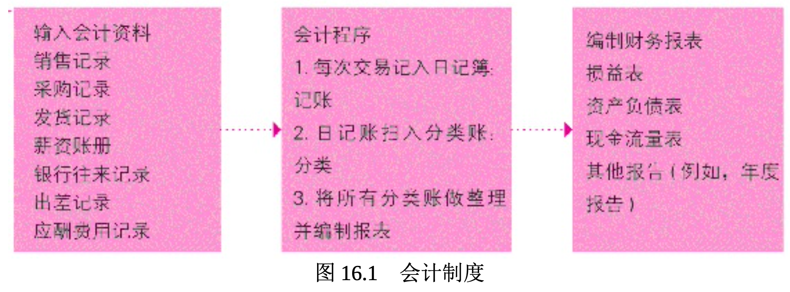

# 会计

小企业经营良好还是倒闭常常在于如何维持财务流程，大企业也是如此。财务管理是优质企业的心跳中枢，而会计制度则负责维持中枢运作正常。

会计报表和财务报告反映了企业的健康状况，就像脉搏和血压显示一个人的身体是否健康一样。如果你想发展成功的事业，就必须具备一些会计学的相关知识。如果没有阅读、了解并分析会计报表和财务报告的能力，就无法理解企业运作。

读到本章的结尾时，你应该会了解会计学是什么，它是如何运作的及它为企业带来了何种价值。当你进一步参与商业活动，或者只是单纯地想了解企业的财务状况时，这些新知识可以让你获益。

## 会计是什么

**会计**(accounting)指的是企业中财务事件及交易的记录、分类、 概述与解释，提供给管理者及利益相关者所需要的信息，能协助他们做出良好的运营决策。财务交易包括货物和服务买卖、购买保险、支付职员薪资和使用原物料等。我们通常将所有的进货记录集合在一起，所有的销售交易亦同。将累积的记录和会计数据整理编制成报表的程序，称为**会计制度**(accounting system)

会计的主要目的是帮助管理者做出良好的决策。另外还有一个主要 的目的，那就是报告企业的财务信息给有兴趣的利益相关者，例如公司 股东、债权人、供应商、职员、工会、社区活动家、投资者和政府(税 务)(如表 16.1 所示)。以下将探讨会计被区分为哪些主要的范围。

许多类型的组织都会利用会计信息来作决策。报表编制必须依据各类使用者的需求 ，会计人员一定要准备好适合的报表。

表16.1 会计信息使用者和所需报表

| 使用者                                                           | 报表类型                                           |
| ---------------------------------------------------------------- | -------------------------------------------------- |
| 政府税务机关(例如国税局)                                         | 纳税申报表                                         |
| 政府监理机构                                                     | 必要的报告                                         |
| 关心组织收入与财务状况的人(例如股东、债权人、财务分析师、供应商) | 年报中的财务报表(如损益表、资产负债表、现金流量表) | 政府监理机构 |
| 企业管理者                                                       | 财务报表和各种内部财务报表                         |

## 会计领域

你可能会认为会计只能用在以营利为目的的公司，但是非营利组织(如教会、学校、医院、互助会和政府机关)在报告财务数据时也需要会计工作。会计被称为企业的语言。会计专业被区分为五个主要的工作领域:管理会计、财务会计、审计、税务会计，以及政府与非营利组织会计。所有的领域都很重要，这五个领域都充满未来创造事业的机会。以下将扼要地探讨每个领域。

### 管理会计

**管理会计** (managerial accounting)**提供信息和分析，以协助组织内的管理者做决策**。管理会计着重于生产、营销，以及其他职能的成本衡量与报告;编制预算(规划);审视各部门预算是否超支(控制); 并且制定将税费最小化的策略等(税务会计)。

如果你主修商科，那么管理会计就几乎是必修的课程。你甚至可能将担任注册管理会计师作为事业目标。一个注册管理会计师(certified management accountant, CMA)是已经符合必要的会计教育和经验充足的专业会计师，并且已经通过了“注册管理会计师协会”(Institute of Cer tified Management Accountants)的检定。由于全球范围的竞争增加、组 织精简、业务外包及组织预算的删减，管理会计可能成为你在大学所修过的最重要的课程之一。

### 财务会计

财务会计(financial accounting)与管理会计不同，**财务会计主要是为组织之外的人，包括除股东、管理者、员工之外的债权人和贷款人、 工会、顾客、供应商、政府机关与一般的投资大众提供信息和分析**。这 些外界人士有兴趣的财务问题包括:组织获利吗?支付账单的能力如何 ?负债多高?很多问题的答案都要写在公司每年一份的年度报告(annu al report)中，年报会记载组织的财务现况、进程与对未来的预期展望 。出于来自利益相关者需要详尽财务信息的庞大压力，企业将大量信息 刊载在年报中。

维持精确的财务信息对企业而言非常重要，因此许多公司、政府机 关，或非营利组织会雇用私业会计师(private accountant)。然而，并 非所有的公司或非营利组织都想要或需要一个全职会计师。因此，在美 国有数以千计的会计公司为组织提供所需的会计服务。

以收费为基础提供会计服务给个人或企业的会计师，称为公众会计 师 (public accountant)。他们提供的业务协助包括设计会计系统、帮 助选择正确的软件来运作系统、分析组织的财务绩效等。通过“美国会 计师协会”(American Institute of Certified Public Accountants, AICPA) 系列考试，并符合政府要求的教育学历和经验，就可获得承认成为一个 注册会计师(certified public accountant, CPA)。注册会计师们可担任私 业会计师或公众会计师，也常应聘担任其他的财务相关职位。现在全美 有超过 60 万位注册会计师，其中有 37 万是美国注册会计师协会的会员 。

向会计数据使用者确保所提供信息的准确性对会计师非常重要。独 立财务会计准则委员会(Financial Accounting Standards Board, FASB) 定义了一般公认会计原则(generally accepted accounting principles, GAA P)，它是会计师必须遵循的。如果会计报告符合公认会计原则，使用 者就知道数据是依照标准，经由专业人士同意的报告。

21 世纪初期，会计业遭遇到了一段黑暗期。许多知名企业诸如世界通讯(WorldCom)、安然(Enron)和泰科(Tyco)均发生会计丑闻 ，使公众对整个会计行业和企业诚信产生了疑虑。美国最领先的会计事 务所之一的安达信(Athur Andersen)会计事务所因在 2002 年安然案中 销毁记录而获罪(但该判决后来遭到美国最高法院驳回)，致使歇业。

对会计产业的监督变得更加严格了，并致使美国国会通过了《萨班 斯-奥克斯莱法案》(Sarbanes-Oxley Act)。该法案制定了公开上市公 司的新报告准则，也设立了上市公司会计监督委员会(Public Company Accounting Oversight Board, PCAOB)，负责监督美国注册会计师协会 。在这一法案颁布之前，会计行业靠的是会计师的自我约束。表 16.2 列出了《萨班斯-奥克斯莱法案》的重要条文。

表 16.2 《萨班斯-奥克斯莱法案》的重要条文

* 禁止会计师事务所对查账公司提供非查账服务(例如咨询服务)。 ·强化对公司不法行为举报者的保护。
* 要求公司的执行长和财务长保证财务报表的正确性，并对财务报表的不实编制( 例如虚报获利)处以重大刑罚。
* 禁止公司贷款给董事和公司高层。
* 在证券管理委员会(SEC)下建立上市公司会计监督委员会(PCAOB)，以监督会计业。 ·规定修改或损毁重要审计纪录为重罪，并处以重大刑罚。

始于 2008 年的金融危机促使国会通过了《多德-弗兰克华尔街改 革和消费者保护法案》。该法案通过增加上市公司会计监督委员会(P CAOB)对证券经纪人和交易商的审计方的监管权力，加强了对会计的 财务监管。我们会在第 18 章深入讨论《多德-弗兰克法案》。

要想让会计职业发挥效力，会计必须像医生或律师一样被看作专业 人士。除了完成 150 多个小时的强化培训和严格考试，注册会计师平均 每年要参加 40 个小时的继续教育培训，接受重新认证，接受职业道德培训，并且必须通过职业道德考试。

### 审 计

**审核与评估编制财务报表所使用的信息称为审计**(auditing)。组织里的私业会计师定期执行内部审计，以确保公司内部的会计程序与财 务报表被适当地执行与编制。公众会计师也会独立审核会计与相关报表 。独立审计(independent audit)指的是客观公正地评估公司财务报表的 准确性并提出意见。公司的年报时常包括来自审计师的书面意见。

在 21 世纪头几年发生的会计丑闻之后，允许会计师事务所为同一 家公司既做审计又做咨询的做法受到了质疑。作为回应，《萨班斯-奥 克斯莱法案》制定了新的审计和咨询规则，以确保审计过程的完整性。 审计流程在 2011 年再次受到批评。在分析了 2008 年雷曼兄弟的垮台及 随之而来的金融危机之后，许多人呼吁要对审计流程进行更严格的控制 。本章的“法律实例”专栏讨论了会计欺诈问题，以及公司如何防止它。

财务审计人员不仅要诊断组织的财务健康，还要检查组织的营运效 率与效益。拥有本科学历、具有两年内部审计经验，并且通过内部审计 师协会组织的考试的会计师可以获得注册内部审计师(certified internal auditor, CIA)的职业证书。

### 税务会计

税赋使得政府可以为提供道路、公园、学校、警察保护、军队以及其他服务而支付费用。联邦、州和地方政府规定，报送纳税申报单的个人和组织一定要在特定的时间内使用精确的格式。**税务会计(tax accou ntant)是受过税法训练的会计师，负责报税或提出税务策略**。政府常常依照特定的需要或目的改变税收政策，这就使税务会计师的工作充满了挑战性。另外，随着税收负担在经济中的增长，税务会计师的角色也对组织、个人或企业越来越重要。

### 政府与非营利组织会计

**政府与非营利组织会计(government and not-for-profit accounting) 服务于不以营利为目的的、服务于纳税人以及其他按照正式批准的预算来运作的组织**。联邦、州与地区政府需要会计制度，以帮助民众、特殊 利益团体、立法单位与债权人等确定政府是否履行义务，并适当地使用 纳税人的钱。政府会计标准由政府会计标准委员会(Governmental Acco unting Standards Board, GASB)制定。联邦调查局(FBI)、美国国税局 (Internal Revenue Service)、密苏里州自然资源部(Missouri Departme nt of Natural Resources)以及库克郡税务局(Cook County Department of Revenue)只是众多政府单位中能提供政府会计工作机会的一小部分机 构。

非营利组织也需要会计人员。诸如救世军、红十字会、博物馆和医 院等慈善机构都要聘请会计，向捐款者说明其资金是如何使用的。事实 上，非营利组织对于专业会计师的需求日益增加，因为捐款人想要准确 地了解他们所捐资金的具体用途和流向。在 2008 年开始的严重经济衰 退期间，很多企业和个人减少了捐款，这就使把所捐的每一分钱解释清 楚比以往更加重要。

如你所见，管理和财务会计、审计、税务会计以及政府和非营利组织会计都需要特别的训练和能力。

## 会计循环

**会计循环(accounting cycle)是指编制和分析主要财务报表所需的六项程序步骤(参阅图 16.2)**。会计循环基于簿记员和会计师两者的工 作。簿记(bookkeeping)是对企业交易的记录，是财务报告的基础部分 。但会计不只对财务信息进行简单记录，而是会将由簿记员所提供的财 务信息进行分类和总结，再向管理高层解释数据和报告信息，并且为改 进公司的财务状况建议策略，准备财务分析和所得税申报。

图 16.2 会计循环的步骤

1. 分析原始资料文件(销售单、出差记录等)。
2. 用日记账记录交易。
3. 将日记账登入分账类。
4. 编辑试算表。
5. 准备财务报表（资产负债表、损益表、现金流量表）。
6. 分析财务报表。

簿记员的第一件工作是把公司的所有交易——诸如销售文件、购买 收据和货运文件——依性质分类，并使数据条理化且容易管理。因此， 簿记员必须从原始的交易文件(销售记录等)开始记入日记簿或计算机程序档案，这种保留每天交易数据的记录就是**日记账**(journal)。“journal”这个词来自法语的“jour”，是“日子”的意思。日记账用于保存每天的交易记录。

记录财务交易也可能会犯错，如把 10.98 美元误记为 10.89 美元。 因此，簿记员会将所有的交易记录在两个地方，然后可以相互核对两个交易记录，以确定最终数值相同。如果不一致，簿记员就知道自己犯错 了。将每笔交易写在两个地方的做法，称为**复式簿记** (double-entry boo kkeeping)。在复式簿记中，每笔交易都需要在日记账和分类账(以下 讨论)里记录两次。

假设公司想知道本年第一季度办公用品花费多少，如果没有特定的簿记工具，即使有精确的会计日记账，也难以得知。因此，簿记员利用特定的会计账册或计算机程序——**分类账**(ledger)，把日记账信息过 账(记录)到各个特定类别，让管理者可以在同一地方找到某项账户( 例如办公用品、现金等)的所有信息。

会计循环的下个步骤为准备**试算表**(trial balance)。试算表是账户分类账的所有财务资料的总结，用来检查数字是否正确和收支平衡。如果账户分类账里的资料不正确，在准备财务报表之前一定要订正，然后会计师依据公认会计原则编制财务报表，包括资产负债表、损益表和现金流量表。

### 会计中的计算机技术

不久前，会计师和簿记员还需要手动录入所有公司财务信息，而今 计算机技术已经大大地简化了会计流程。计算机会计程序可以从日记账 中瞬间过账加入分类账(甚至是远程操作)，随时提供组织所需的财务 信息。这让会计师有了更多时间来处理财报分析等更重要的事情。集合 的会计程序为小企业所有者提供了强而有力的帮助，因为小企业往往无 法像大企业一样拥有强大的会计支持。小企业的需求通常与大企业相去 甚远，因此许多会计软件[如财捷集团(Intuit)的 QuickBooks 与 Sage 的 Peachtree]就是用来处理这些特殊需求的。然而，企业所有人需要了 解什么样的计算机系统及程序最适合自己的特殊需要，因此企业所有人 在创立公司前会先考虑为公司聘请一位会计师，或依特别的需要找会计师咨询建议，然后量身定做开发出一套专用的可与所选会计软件协作的计算机会计制度。

在高级会计软件可以买到的情况下，你可能会奇怪为什么你还要学习和理解会计。计算机是企业人士的一项利器，它无疑简化了单调的簿记和会计工作。遗憾的是，会计师的工作仍然需要培训和非常专业的能力，这些不是编好程序让计算机执行就能解决的。计算机技术与会计师的知识相结合才能帮助企业做出正确的财务决策。下面我们将探讨资产负债表、损益表与现金流量表，会计师正是通过这些财务报表所包含的信息来分析和评估企业财务状况的。
