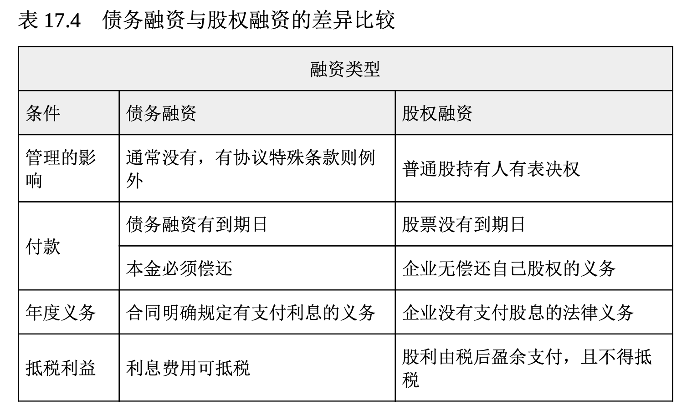
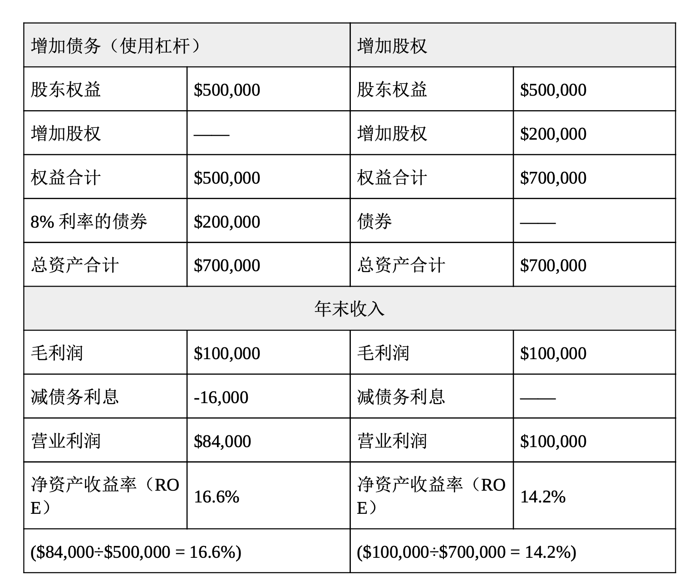

# 取得长期融资

在财务规划中，预测决定公司所需的长短期资金，以及资金取得的渠道。在设立长期融资目标时，财务管理者通常会问三个主要问题:

1. 企业的长期目的和目标是什么?
2. 达成这些长期目的和目标的财务需求是什么?
3. 长期资金的筹集渠道是什么?其中最符合企业财务需求的渠道是什么?

企业需要长期资金来购买诸如厂房设备、机器设备等昂贵的资产， 以开发新产品与支持组织的财务扩展。在大企业中，董事会、管理高层会同财务及会计经理人进行长期融资决策。以世界最大的以研发为基础的生物制药企业之一辉瑞(Pfizer)为例，每年在研发新药上的花费高达 90 亿美元，一种新药品的获利有时会历经 10 年以上的时间，花费达 13 亿美元。因此，不难了解辉瑞为什么要由高层管理者来制定长期融资决策。在中小企业中，所有者总是会主动参与分析公司的长期融资决 策。

前面提过，长期融资通常有两大主要途径: **债务融资**和**股权融资**。下节将介绍这两种重要的长期融资。

## 债务融资

如果企业以举债方式融资，那么它就有清偿债务的法律责任。企业可通过贷款机构或发行债券来取得资金。

向贷款机构借款 长期融资通常在 3~7 年内偿还，但也可能长达15~20 年。**定期贷款协议(term-loan agreement)指要求借方以特定分期付款方式(月付制或年付制)连息偿还的一种商业票据**。这种长期融资 的最大好处是可以减税。

长期融资的金额较大，成本往往也比短期融资高。因为还款期可能很长，资金提供者承担风险的更大，因此要求借方提供抵押品(例如房 地产、机器、设备、公司股票或其他有价资产)。资金提供者也常在某些方面约束公司，推动其履行义务。贷款的利率则视抵押品是否充足、 公司的信用评级以及市场的利率水平而定。资金提供者所承受的风险越高，要求的利率也越高，这就是所谓的**风险/收益权衡(risk/return trade-off)**。

**发行债券** 当某个组织无法由贷款机构取得长期融资时，则可以考虑发行债券。简单地说，债券就像是一家公司的借据，承诺在某一指定日期还本付息。债券发行协议中的条款被称为契约条款(indenture terms)。能发行债券的组织类型包括联邦、州和当地政府、联邦政府机构、外国政府和公司。

你可能已经对债券很熟悉，你可能拥有美国政府发行的储蓄债券，或自愿花时间帮助当地的一所学校发行债券;可能你的小区正在兴建一座新的球场或文化中心，而这需要出售债券为项目筹集资金。企业和政府都可通过发行债券筹集所需资金，所以政府公债与公司债之间也有竞争关系。潜在投资者在投资时会衡量的债券风险，包括投资回报(利息)与发行者的偿债能力。

如同其他的长期债务，债券可分为有担保与无担保债券。**担保债券(secured bond)指含有某种形态抵押品发行的债券**，例如房地产、机 器设备或其他的抵押资产。如果债券的契约条款没有履行(如未支付利息)，债券持有人可以处分抵押品以确保债权。**无担保债券[unsecured bond;或称为信用债券(debenture bond)]是只靠发行者信誉支持而无抵押品的债券**。债券投资人完全是基于信任发行债券的公司的信誉、相信公司会履约还款。对许多企业来说，债券是筹集长期资金的主要方法，对私人或机构投资也十分有价值。因为债券非常重要，在第 18 章将会详尽地介绍。

## 股权融资

如果一家公司不能从贷款机构取得长期贷款，也无法发行债券，这家公司可能会寻求股权融资。股权融资通过企业所有者以股份形式向企业外部投资者出售企业所有权来融资，他们或者使用公司累积的留存收益转增资，或者也从风险投资公司那里取得融资。

**出售股票** 最重要的是记住，股票的收购者成为企业的所有者，可发行出售的股票数通常由公司的董事会决定。**公司第一次在公开市场上销售股票，称为首次公开发行(initial public offering, IPO)**。公开销售股票以取得资金绝非易事。美国的公司只有在美国证券交易委员会(Securities and Exchange Commission, SEC)和各个州政府机关认可时，才能公开上市发行股票。公司可以提供不同类型的股票, 例如优先股和普通股，首次公开发行和这两种股票将会在第 18 章深入探讨。

**留存收益转增资** 你可能还记得在第 16 章中提过，这种公司保留再投资回公司的盈余被称为“留存收益”(retained earnings)。对于比起大型企业没有太多融资选择(例如股票或债券)的小型企业而言，留存收益往往是长期资金的主要来源之一。然而，大型企业在需要长期资金时，也同样仰赖留存收益。事实上，有鉴于可使公司省下发行债券或股票所产生的利息与股息(付给股票投资者的款项)以及发行证券或股票的承销费，留存收益通常是公司需要资金时的第一来源。同时，这也避免了出售股票所产生的所有权稀释问题。

假如你想买一辆新车这样的昂贵个人资产，你该如何做?最理想的方法是从你的私人存款户头中提领所需的现金，既不麻烦也不用支付利息，但只有少数人有如此充沛的可用资金。大部分企业也是如此，虽然想从营运中赚得长期资金(留存收益)，但只有少数能拥有丰沛的可用资金。

**利用风险投资** 公司在创业初期或是刚开始扩张时往往最难筹集资金。一个新成立的公司通常只有很少的资产，也缺乏市场业绩记录，从银行借得大额资金的机会渺茫。**风险投资(venture capital)指投在新成立企业或新兴企业中的资金，有些投资者(风投资本家)认为这些企业极具获利潜力**。风险投资帮助了英特尔、苹果、思科系统等公司的创立 ，也让脸谱网和谷歌得以发展壮大。风投资本家投资企业，并以部分股权作为回报。他们希望自己的投资能获得高于平均水平的回报和富于竞争力的管理表现。

风险投资业最初是美国富有家族的替代性投资工具。例如，洛克菲勒家族(其巨额财富产生自约翰·洛克菲勒在 19 世纪建立的标准石油公司)在桑福德·麦克唐奈(Sanford McDonnell)经营他源自飞机库的公司时对其提供了资助。这个小公司最终发展成为麦道公司(McDonnell Douglas)，并与波音公司在 1997 年合并成大型航空与军事武器承包商 。风险投资业在 20 世纪 90 年代成长迅速，尤其是在高科技聚集区(例如加州的硅谷)，风投资本家格外重视与互联网相关的公司。21 世纪头十年初期，随着高科技产业面临瓶颈与全球经济增速趋缓，风险投资的需求大大降低。2008 年的金融危机导致风投降至新低。然而，随着经济在 2011 年开始增长，风投又重返市场。

## 利用财务杠杆做决策

表 17.4 比较了债务融资和股权融资。**通过借款筹集所需的资金来提高公司的获利能力，称为杠杆(leverage)**。在公司因债务而承受的风险提高的同时，获利能力也相对提高。财务管理者或首席财务官最重要的两项任务，便是预测需筹集的资金和管理这些资金。

企业非常关注资金成本。**资金成本(cost of capital)指企业为满足债权人要求和股东的预期而必须实现的最低回报率**。当公司的盈余高于举债所支付的利息时，企业举债能赚取的回报率就会高于股权融资的报 酬率。请看表 17.5，以第 12 章介绍过的公司——非常素食餐厅——为例。当非常素食需要筹集 20 万美元时，可以考虑发行债券(债务融资 )或股票(股权融资)给投资大众。比较两种选择之后，你可以看到在盈余高于债券利息的情况下，通过发行债券来融资较为有利。但是，如果盈余低于债券的利息，非常素食就会蒙受损失。记住，发行债券就像所有的负债一样，都必须在约定的时间内偿还。

**表 17.5, 使用杠杆和股权融资的比较** 非常素食需要筹集20万美元，请比较债务融资和股权融资这两种选择。

单个公司必须通过比较成本和收益，确切地决定如何在债务融资和股权融资中做出取舍。**杠杆比率**(第 16 章讨论过)也可以给这些公司一个行业标准，据此他们可以进行自我比较。但是，主要公司之间、行业之间负债差异很大。例如，福特汽车公司的资产负债表中负债差不多有 1000 亿美元。相比通用电气公司 4000 多亿美元的负债，这还算是适当。为了给其宾馆、公寓和高尔夫球场融资，休闲业巨头金沙(Sands )酒店、特朗普酒店(Trump Hotels)和卡西诺(Casinos)赌场会背上几十亿的债务。与此相反，科技行业的领袖企业苹果和微软没有长期负债，而且都有差不多 500 亿美元的现金随时可以利用。根据提供公司和财务研究的标准普尔(Standard & Poor’s)和穆迪投资者服务(Moody’s Investor Services)公司的统计，大型工业企业的负债往往占总资产的 33%~40%。小型企业的负债额因公司而不同，显然差异很大。

## 金融危机的教训

始于 2008 年的金融危机使金融市场遭受了 20 世纪二三十年代大萧条以来最严重的衰退。金融市场的崩溃可归因于金融管理者未能有效地尽职。低劣的投资决策和冒险的金融交易(特别是在房地产行业)造成执业已久的金融公司如雷曼兄弟等的倒闭。曾经受人尊重的基金经理伯纳德·麦道夫操作的涉及几十亿美元的庞氏骗局使得大众对金融管理者的信任消失殆尽。不幸的是，它也让许多投资者的基金消失殆尽。

21 世纪头十年后期发生的金融崩溃让美国国会通过了彻底的金融监管改革方案。《多德-弗兰克华尔街改革和消费者保护法案》几乎影响了美国金融服务业的方方面面。随着政府加大对金融市场的参与和干预，对金融机构和金融管理者的要求更加严格，这意味着金融管理者的工作也变得更具挑战性。21世纪头十年后期质疑金融管理者诚实和良好判断能力的事件与21世纪头十年早期质疑会计行业诚实和判断的事件非常相似(参阅第 16 章)。毫无疑问，要想重新赢得大众的信任，金融管理者还有很长的路要走。

第 18 章对证券市场进行了近距离的观察，证券市场是企业可靠的长期融资工具，也是私人投资者投资选择的基础。你将学到证券交易如何运作、公司如何发行股票和债券、如何选择正确的投资策略、如何买卖股票，以及何处寻找股票和债券行情的最新信息等。当你了解到如何参与金融市场时，财务会给你一个新的视角。
