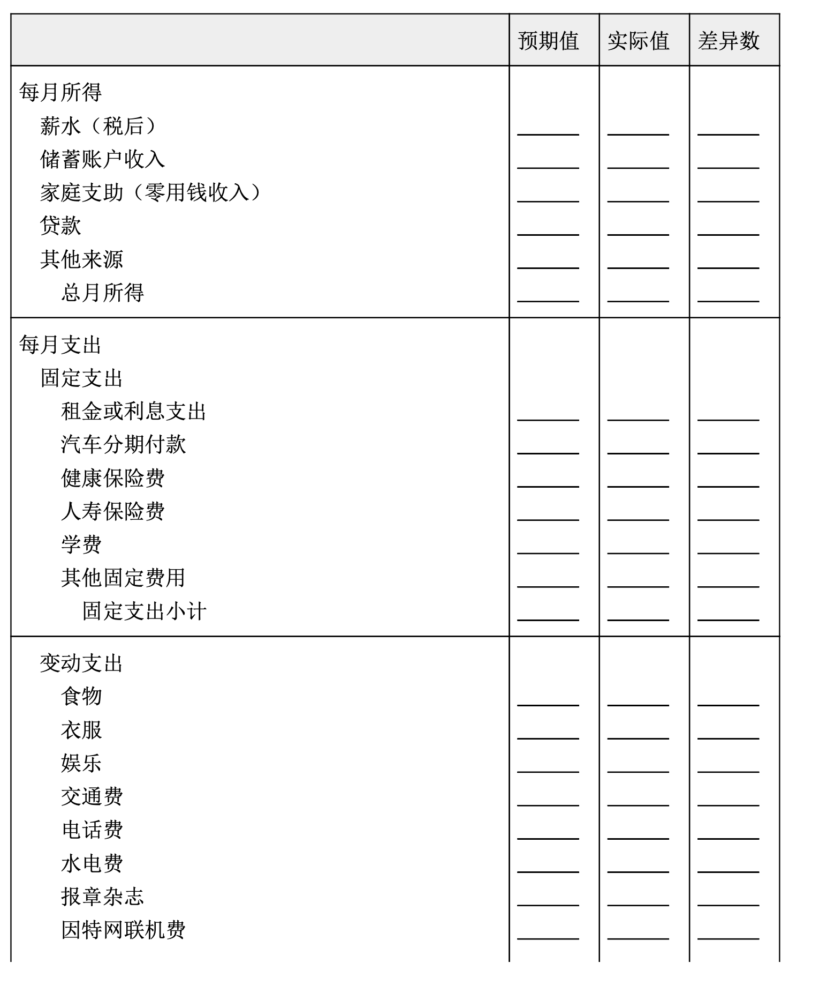

# 财务规划

**财务规划是指分析公司短期资金和长期资金的流入与流出。其自始至终的唯一目的，是使公司的利润最大化，并充分利用资金。**

财务规划包括三个步骤:

(1)预测公司短期和长期的财务需求;

(2)编制能满足这些需求的预算;

(3)建立财务控制机制以检视公司是否实现目标(参见图 17.2)。

以下将检视这三项步骤在改进组织财务健全度上扮演的角色是什么。

注意财务规划和预算的紧密关联。

## 预测财务需求

预测在任何公司的财务规划中都是非常重要的部分。**短期预测(sh ort-term forecast)指对未来一年以内的收入、成本及费用的估计，它是其他财务规划的基础**，因此准确度相当重要。部分短期预测可能是现金流预测(cash flow forecast)，亦即对未来几个月或几个季度内企业现金的流出与流入进行预测。其中所记录的现金收入和支出，是以预期的销售收入和各种应付的成本与费用为支付基准的。公司的销售预测指根据某一特定期间内的预计销售额进行评估。企业通常以过去的财务报表为基础来预测销售额、各种成本和费用。

**长期预测(long-term forecast)是对一年以上的一个时期内的收入、成本及费用所进行的估计，这个时期甚至可长达五到十年**。长期预测在公司长期的战略规划中扮演关键性的角色。还记得吗?一家公司的战略规划会探讨这样的问题:公司要投入什么事业?是否应继续在未来五年里继续投入?未来十年在技术、新厂房和机器设备上的投入为多少? 是否有足够资金用于支付长期的应付款项?在财务管理者处理这类长期预测时，创新的计算机网络软件往往能够提供有效的协助。

长期财务预测一方面能帮助管理高层和运营经理人对各战略规划的潜在获利机会进行评估，另一方面也能协助财务管理者编制公司预算。

## 预算编制程序

预算编制取决于公司财务报表的精确度。简单地说，预算是一种财务规划。更明确地说，**预算(budget)是表达管理高层收入期望的财务规划，并据以在企业内部分配资源**。公司过去的财务报表中的成本、收入信息是预测未来财务需求的基础，因此财务报表中最重要的资产负债表、损益表与现金流量表也就成为了预算编制的基础。公司根据短期预测和长期预测编制年度预算，这些财务预测必须尽可能精确，因此，公司会使用以前年度财务报表中的历史成本和营业额，作为估算公司预算的基准。既然预算是根据推估而来，财务管理者在估算时便要非常谨慎 。预算是公司财务运作和财务需求的重要参考。

一家公司的财务规划，通常包括下列三种预算:

* 资本预算。
* 现金预算。
* 营运(全面)预算。

**资本预算(capital budget)重点强调购置重要资产的支出计划**，这类资产的购置通常需要巨额资金。基本上，资本预算是为了购置房地产、建筑物和机器设备等固定资产而编制的。

**现金预算(cash budget)预估在特定期间的现金流入与流出量，以及期末现金余额(剩余或短缺)的预算**(例如，每月或每季)。现金预算是协助管理者预估所需的贷款、偿债、营业费用和短期投资的重要依据。现金预算通常是最后编制的预算(表 17.1 为非常素食公司的现金预算)。

表 17.1 非常素食现金预算表范例

**非常素食 月现金预算**

|                    | 1月     | 2月     | 3月     |
| ------------------ | ------- | ------- | ------- |
| 销售预测           | $50,000 | $45,000 | $40,000 |
| 收入               |         |         |         |
| 现金销售(20%)      |         | $9,000  | $8,000  |
| 赊销(上期的 80%)   |         | $40,000 | $36,000 |
| 月现金收入         |         | $49,000 | $44,000 |
| 支出项目           |         |         |         |
| 办公用品           |         | $11,000 | $10,000 |
| 薪资               |         | 12,000  | 12,000  |
| 劳动成本           |         | 9,000   | 9,000   |
| 税款               |         | 3,000   | 3,000   |
| 其他支出           |         | 7,000   | 6,000   |
| 月现金支出         |         | $42,000 | $40,000 |
| 现金预算           |         |         |         |
| 现金流量           |         | $7,000  | $4,000  |
| 原始现金           |         | -1,000  | 6,000   |
| 现金总额           |         | $6,000  | $10,000 |
| 减:最低现金余额    |         | -6,000  | -6,000  |
| 盈余转投资上市证券 |         | $0      | $4,000  |
| 融资               |         | 0       | 0       |

**营运(全面)预算(operating budget; master budget)指整合企业其 他预算并总结企业拟进行的财务活动的总预算**。更正式地说，它估算企业营运活动所需的各种成本和费用。全面预算也决定了公司在办公用品 、差旅、租金、技术、广告和薪资方面的支出额度，所以营运预算通常是最详尽的预算。

财务规划显然对公司经营来说非常重要。有了规划，便可以决定做哪一种长期投资、了解何时需要资金以及如何筹集资金。当公司做好长短期财务需求预测，并编制完成分配资金的预算后，最后的财务规划步骤是进行财务控制。在讨论财务控制之前，表 17.2 将通过编制“你”公司的月预算来检视你个人的财务规划技术。

在1.6章，学到如何为“你”公司编制简单的资产负债表，现在让我们来一起尝试 为“你”公司编列月预算。请诚实并详尽考虑到每个应列入的项目，为你自己编列出 精确的月预算!

**表17.2 “你”公司的月预算**

## 建立财务控制

**财务控制(financial control)是指企业定期对其实际收入、成本及支出和预算进行比较的过程**。为落实财务控制，大部分公司至少每个月审查一次财务。这种财务控制程序可以使管理者发现与财务计划的不符 之处，并在必要时加以纠正，还有利于追查出哪个特定账目、部门或个人偏离了财务计划。财务管理者可以判断这些偏差是否正当，是否应该相应地调整计划。经济变动和意料之外的全球事件也能改变财务计划。 例如，2011年中东局势的动荡和石油价格的不可预期让很多公司考虑要调整财务计划。本章的“法律实例”专栏强调了一个国家为了处理严重的财务问题是如何实施财务控制的。接下来，我们将了解为何企业必须常备足够的可用资金。

> **法律实例** 金融法规还是军事管制?
>
> 2008 年开始的经济衰退不仅让无数美国人遭遇了经济困难时期， 也暴露出许多州政府及其所在城市的严重经济问题。或许没有哪个地 方的经济衰退比密歇根州更严重了，整个州有一半社区陷入了财政困 境。严重的财政问题使得该州通过了《地方政府和学区财政问责法案》(Local Government and School District Fiscal Accountability Act)， 允许由州长挑选并经州政府任命的紧急状态财政经理(EFMs)接管市 、镇和学区。这些经理权力广大，他们可以宣布工会合同无效，某些情况下还可以撤销当选官员的职务。这一计划的支持者坚持认为很多苦苦挣扎的社区因为紧急状态财政经理采取的行动而免于破产。其他人则声称州长变成了独裁者，简直就是在实行军事管制。
>
> 根据州长办公室的解释，该法的目的是保护当地政府的健康、福利和安全。很多情况下，许多社区当选官员财政能力的不足备受指责，他们没有意愿或没有能力解决他们面对的财政问题。迈克尔·因伯( Michael Imber)是均富会计师事务所(Grant Thornton)的会计，他支持该法，并且认为很多为私营企业重新打造了坚实的财务基础的技术和流程，同样也可以用来让社区重回正轨。底特律大型公共养老基金的董事们并没有如此大的把握，他们已经提起诉讼，质疑该法是否符合宪法。
>
> 紧急状态财政经理很可能会扩大到密歇根州以外的地区。印第安纳州正在考虑类似的立法，建立适合本州的紧急状态财政经理队伍。在纽约和其他的几个州，税务人员和监管委员会已被授予类似的权力，以恢复当地社区的财政稳定。紧急状态财政经理是否是社区财政问题的解决方案还有待观察。但有一件事情是确定无疑的:对财政进行负责任的管理不可忽视。
>
> 资料来源:“Bankrupt Cities Using Emergency Financial Managers to Recover”, ABCNews.com, ac cessed May 2011; Jeff Green and Jonathan Keehner, “Muni Bankruptcy Threat Makes Michigan Trai n Financial SWAT Team”, Bloomberg Businessweek, April 18, 2011; John E. Mogk, “Emergency M anager Law No Mistake”, The Detroit News, April 15, 2011; and Susan Berfield, “Michigan’s Extre me Measures”, Bloomberg Businessweek, May 8, 2011.
