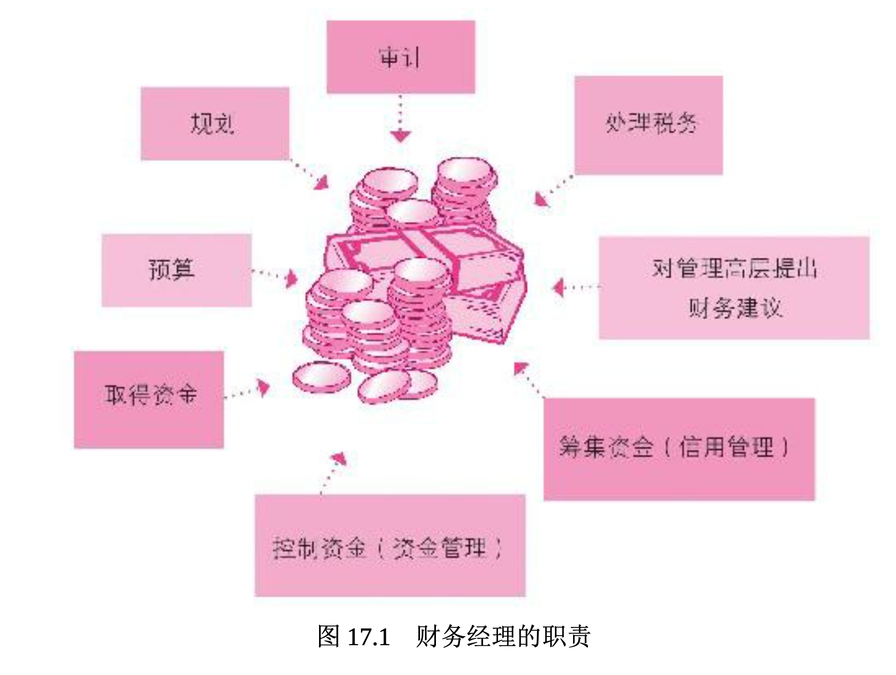

# 财务和财务管理者的角色

本章要回答两个主要的问题:“什么是财务?”以及“财务管理者的职责是什么?”**财务(finance)是取得企业所需资金并进行管理的企业功能**。财务活动包括编制预算、现金流分析、资金支出规划(诸如购置厂房与机器、设备)等。**财务管理(financial management)指为实现公司目的和目标而进行的资源管理工作**。如果企业缺乏精确的财务规划，不论产品或营销多成功，也将难以生存。在进一步深入讨论之前，我们先要简单了解会计师和财务管理者的角色。

会计师好比实验室里熟练的技术人员，通过抽取病人的血液样本和其他检测方法，了解其健康状况，并记录在检查报告中。在企业，会计师会编制反映企业经营体质的财务报表。企业的财务管理者则像医师，通过检查报告分析病情并对症下药。简言之，**财务管理者(financial managers)会分析会计师编制的财务报表，向最高决策者提出能改善、提升公司“体质”(财务绩效)的策略建议**。

如果财务管理者不了解会计方面的信息，便无法做出正确的财务决策，因此本书在第 16 章中先介绍了会计学。同样地，优秀的会计师也要了解财务，所以会计学和财务是息息相关的。在中型以上规模的企业 ，会计和财务部门都会设在首席财务官之下。然而，财务管理也可能由公司的会计主管或财务副总裁所掌管。**审计长(comptroller)指首席会计官(chief accounting officer)**。

图 17.1 指出了财务管理者的职责。最基本的职责是筹得资金并有效利用这些资金，包括管理现金、信用账户(应收账款)及存货。不论是营利组织还是非营利组织，财务管理都很重要。

论公司的规模大小，财务都很重要。你或许还记得第 6 章所述， 如果一家小型企业指望着能够在前五年这个重要时期存活下来，就必须进行资金筹措。为此要进行细致的财务管理，但对大小企业来说，审慎的财务管理仍旧是其存续期间必须面对的挑战。21 世纪头十年后期，金融危机威胁到了经济，美国企业已尝到了苦头。

通用汽车曾经是世界上占主导地位的汽车制造商，但因为严重的财务问题，2009 年到了倒闭的边缘。借助 70 亿美元的政府直接贷款和美国财政部额外提供的 430 亿美元纾困资金，该公司得以幸存。(430亿美元的资金使政府拥有 60% 的股权。)同年，政府也提供了850亿美元的贷款，用于拯救保险巨头美国国际集团(AIG)，并通过了7000亿美元的不良资产救助计划(TARP)，以帮助恢复对金融系统的信心 。

迈克尔·米勒(Michael Miller)借用营利企业的做法来对待非营利组织，彻底革新了于俄勒冈州的波特兰的善念机构(Goodwill Industries )的运营。通过逐个商店比较销售额，关闭经营不利的商店，在较好的 位置开设新店，并且降低配送成本，他将营业费用削减了 30%。销售额从 400 万美元猛增至 5000 多万美元。

## 了解财务的重要性

以下是三种最常见的不良财务现象。

1. 资本不足(缺少企业启动资金)。
2. 现金流控制不佳。
3. 费用控制不当。

在下面这个典型故事中你可以看到这三个现象。

> 伊丽莎白·贝坦尼(Elizabeth Bertani)和帕特·舍伍德(Pat Sherwoo d)是好朋友，以极少的资金创办了一家小公司帕瑟利·帕奇(Parsley Pa tch)。在数年前曾发生财务困难，面临集资、现金流量控制与费用控制等问题。起初，贝坦尼想为正在进行无盐健康饮食的丈夫制作无盐调味料，而她的朋友舍伍德认为贝坦尼的调味料好到可以在市场上出售。在获得贝坦尼的同意后，帕瑟利·帕奇公司成立了。5000 美元的初始投 资因设计商标与标签而迅速消耗殆尽，两人意识到筹资的紧迫性。最后 ，她们又投入了超过 10 万美元才摆脱资金不足的困窘。
>
> 最初事业进行得很顺利，数百家的食品店采用了她们的产品。当销售情形不如预期时，两人进行了检讨，认为保健品市场应比食品店的商机更大，因为许多进行节食计划的人正需要这种自然健康的无盐调味料 。这个选择被认为是正确的，公司的业绩突飞猛进，每月营业额直逼 3 万美元。奇怪的是，帕瑟利·帕奇仍未获利。
>
> 究其原因，贝坦尼和舍伍德发现自己根本不知道如何控制现金流和费用。事实上，她们还曾被告知不需重视成本，因此也就不加注意。最后，她们请了一位注册会计师和一位有经验的财务管理者，教她们如何计算制造成本、控制支出以及管控公司的现金流。帕瑟利·帕奇很快顺利地获得一年 100 万美元的利润，幸运地逆转了形势，免于破产的窘境。最终，她们把公司卖给了香料和调味品巨头味好美(McCormick)公司。
>
> 如果贝坦尼和舍伍德在创业前能先“了解”财务，或许可以避免很多麻烦。了解财务是非常重要的，你不必是财务专家，但是对于有志于创业、投资股市和债券或想存足养老金的人来说，具备一定的财务知识是必须的。简而言之，从事商业活动的人士都需要了解财务和会计两大领域的相关知识。第 16 章已经讨论过会计，本章将深入探讨财务管理。

## 什么是财务管理

**财务管理者负责在适当的时间偿付货款、催收未兑现的款项，并确认公司没有在应收账款方面蒙受不当的坏账损失(买方未能付款)**。因此，举凡赊购货品(应付账款)与催收客户货款(应收账款)等相关管理都是财务管理者的职责。因此，这些财务功能对于各类企业都非常重要，特别是中小企业，因为中小企业所拥有的现金和信贷缓冲能力不如大型企业。

**财务管理者必须对财务方面的变化与机会加以注意**，例如租税法规的变动，因为缴纳各项税款对公司而言是现金支出。财务专家还必须分析各种可能因管理决策而产生的赋税，以使企业所需负担的税赋降到最低。通常公司财务部门中的成员(即内部审计)会审查会计部门所做的日记账、分类账和财务报表，以确认是否所有交易都已遵照公认会计原则处理。如果没有经过这样的审查程序，会计报表的可信度就会降低。因此，内部审计师必须依据专业知识在审查过程中客观而小心地求证是否有任何不当处理和缺失。内部审计人员协助公司进行财务规划，这将在下一节讨论。
