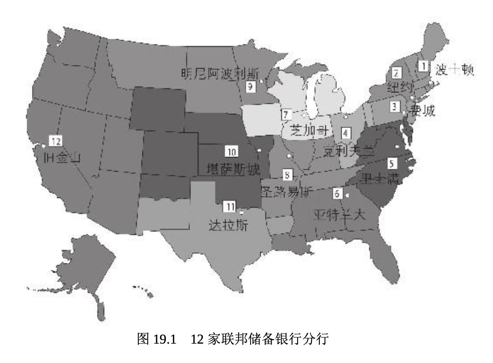
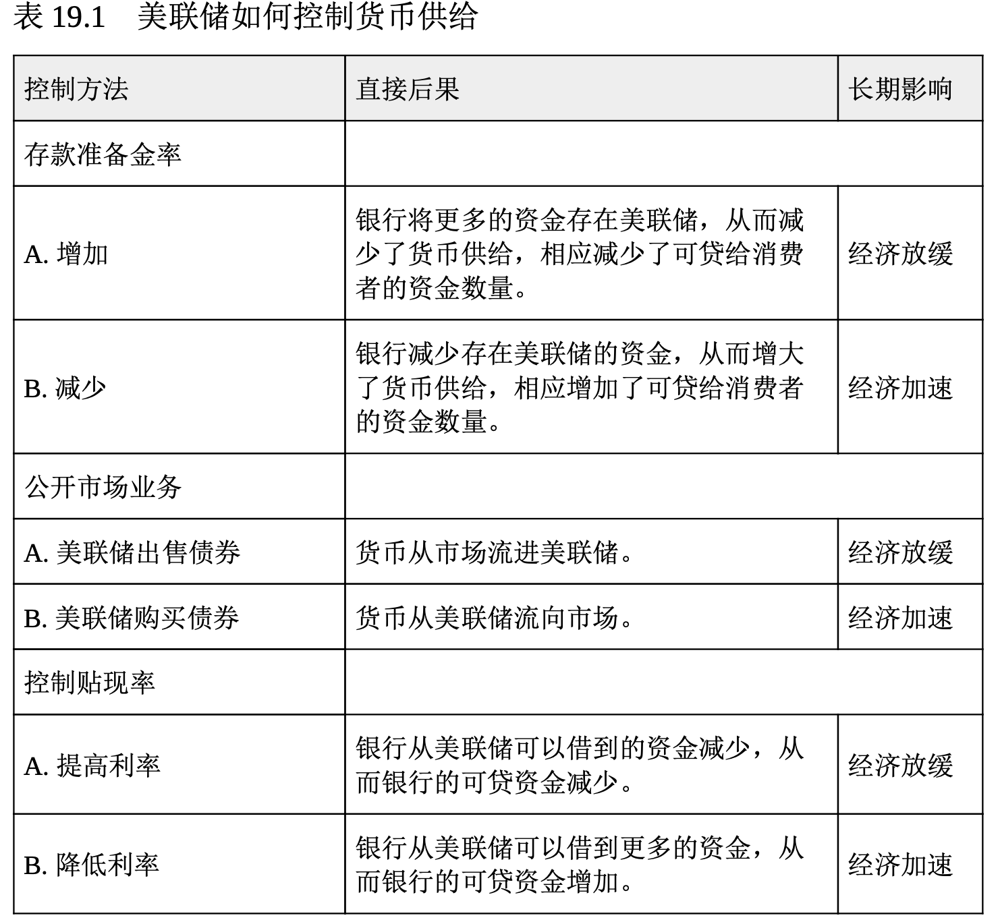
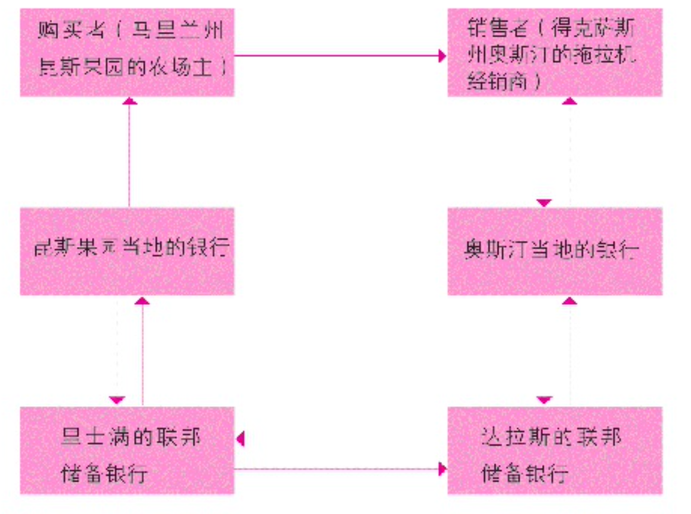

# 控制货币供给

从理论上讲，用适当的货币政策控制货币供给就可以保持经济增长而不会引起通货膨胀。(参阅第 2 章，复习一下货币政策的内容。)再说一遍，控制货币供给的组织是美联储。

## 美联储概述

**联邦储备体系**主要由(1)联邦储备委员会;(2)联邦公开市场委员会(FOMC);(3)12 家联邦储备银行;(4)3个顾问委员会;(5)联邦储备体系的成员银行组成。图 19.1 显示了 12 家联邦储备银行的所在地。

**联邦储备委员会**管理和监督着 12 家联邦储备银行。委员会中的 7 位理事由美国总统提名，并征得参议院同意后加以任命。该委员会的主要功能是制定货币政策。联邦公开市场委员会由12名有投票资格的成员组成，它是决策机构。该委员会包括联邦储备委员会的 7 位成员、纽约联邦储备银行行长和 4 位轮流出任的其他联邦储备银行行长。顾问委员会代表各个银行区域、消费者和成员机构发言，成员机构包括银行、储蓄和贷款机构以及信用合作社。它们向联邦储备委员会和联邦公开市场委员会提供建议。

**美联储买卖外币、管理各类信用、监督银行并收集货币供给和其他经济活动的数据**。作为货币政策的一部分，美联储决定**存款准备金率**，即所有金融机构在 12 家联邦储备银行的其中一家中必须储备的资金水平。它在公开市场中买卖政府证券。最后，它按照某一利率为成员银行提供借款，这个利率就叫**贴现率**。

如上所述，美联储用于管理货币供给的 3 个基本工具是**存款准备金率**、**公开市场业务**和**贴现率**(参阅表 19.1)。让我们逐一探讨它们是如何实施的。

## 存款准备金率

**存款准备金率** (reserve requirement)是商业银行的支票存款和储蓄存款必须在该银行内部(作为金库中的现金)或是在当地联邦储备银行分行中以无息存款的形式储存的比例。存款准备金率是美联储最有影响力的工具之一。当它提高存款准备金率时，货币变得稀缺，长期来看倾向于减轻通货膨胀。例如，如果奥马哈证券银行(Omaha Security Bank)持有 1 亿美元的存款，而且存款准备金率比如说是 10%，那么，银行必须有 1000 万美元的存款保证金。如果美联储将存款准备金率提到 11%，那么，银行必须将另外的 100 万美元缴存存款保证金，从而减少它可发放的贷款数量。因为存款准备金率会影响到所有的银行，货币供给将会减少，而物价有可能会下降。

相反，存款准备金率降低会增加银行可用于贷款的资金数量，因此，它们就可以更多地放贷，借款也易于获得。货币供给的增加会刺激经济高速增长，但同时也会带来通胀压力。也就是说，商品和服务的价格会上涨。你能明白在经济衰退时，美联储为什么要降低存款准备金率吗?

## 公开市场业务

**公开市场业务** (open-market operations)包括购买和出售政府债券 。为了减少货币供给，联邦政府会向公众出售美国政府债券。这些作为支付款项得到的资金不再流通，从而减少了货币供给。如果美联储想增加货币供给，它就要从愿意出售债券的个人、公司或组织手中购回政府债券。美联储为收购这些证券而支付的资金进入流通，从而增加了货币供给。这就是美联储的伯南克在最近的经济衰退期间购买债券的原因，其想法是使经济再次增长。

## 贴现率

因为成员银行可以从美联储借钱，并将借款以贷款的形式借给消费者，所以，**美联储经常被称为银行的银行**。**贴现率**(discount rate)是美联储为成员银行提供借款所要求的利率。贴现率上升会抑制银行借款， 减少可贷资金的数量，从而减少货币供给。反之，降低贴现率会鼓励成员银行的借款，增加可贷资金的数量，从而增加货币供给。在长达数月的时间里，美联储将贴现率降到几乎为零，希望以此增加银行借款。尽 管如此，许多银行仍然不愿意放贷。

贴现率是美联储控制的两个利率之一。另一个是**银行同业拆借利率** ，称作**联邦基金利率**(federal funds rate)。

## 美联储的支票清算

如果你给当地的零售商开了一张支票，而零售商和你的开户行是同一家，那么事情就很简单，只要根据支票金额在你的账户中减少相应存款，并在零售商的账户中增加相应存款就可以了。但如果你给其他州的零售商开支票，应该怎么办呢?这时就需要美联储的支票清算职能发挥作用了。

那位零售商会将支票存入他的开户银行。其开户行会将支票存入最近的联邦储备银行，该储备银行会将此支票送往你当地的联邦储备银行托收。然后该支票会被送到你的开户行，并按照支票数额在你的账户中扣款。你的开户行会授权你当地的联邦储备银行将支票金额从它在联邦储备银行的账户中扣除。此联邦储备银行会偿还这一流程起始的那个联邦储备银行(即零售商最近的那个联邦储备银行)。然后，起始的那个联邦储备银行会将支票金额计入零售商的开户银行在联邦储备银行的储蓄账户。然后，零售商的开户银行会将支票金额记入零售商的账户。(参阅图 19.2，图中显示了这种州际交易。)这一长而复杂的流程是有费用的，因此，银行会采取很多措施减少支票的使用，这些措施包括使用信用卡、借记卡和其他电子转账方式。

假定布朗先生，一位马里兰州昆斯果园(Quince Orchard)的农场主，从得克萨斯州的奥斯汀购买了一辆拖拉机。

>
> 图 19.2 联邦储备银行体系内的支票清算流程
>
> 1. 布朗先生将他的支票交给拖拉机经销商。
> 2. 经销商将支票存入其在奥斯汀当地银行的账户。
> 3. 奥斯汀的银行将支票存入其在达拉斯联邦储备银行的账户。
> 4. 达拉斯的联邦储备银行将支票送到里士满的联邦储备银行托收。
> 5. 里士满的联邦储备银行将支票转送布朗先生在昆斯果园当地的开户行。
> 6. 昆斯果园的当地银行从布朗的账户中扣除与支票等额的资金。
> 7. 昆斯果园当地的银行授权里士满的联邦储备银行扣减它在联邦储备银行中与支票 数额相等的存款。
> 8. 里士满的联邦储备银行偿付达拉斯的联邦储备银行。
> 9. 达拉斯的联邦储备银行将支票金额记入奥斯汀的银行在联邦储备银行的存款账户。
> 10. 奥斯汀的银行将金额记入拖拉机经销商的账户。

正如你看到的那样，整个经济都会受到联邦储备体系运行的影响。下面我们将简单地讨论银行业的历史，让你了解美联储存在的背景。然后，我们将探索当今银行业正在发生的事情。
