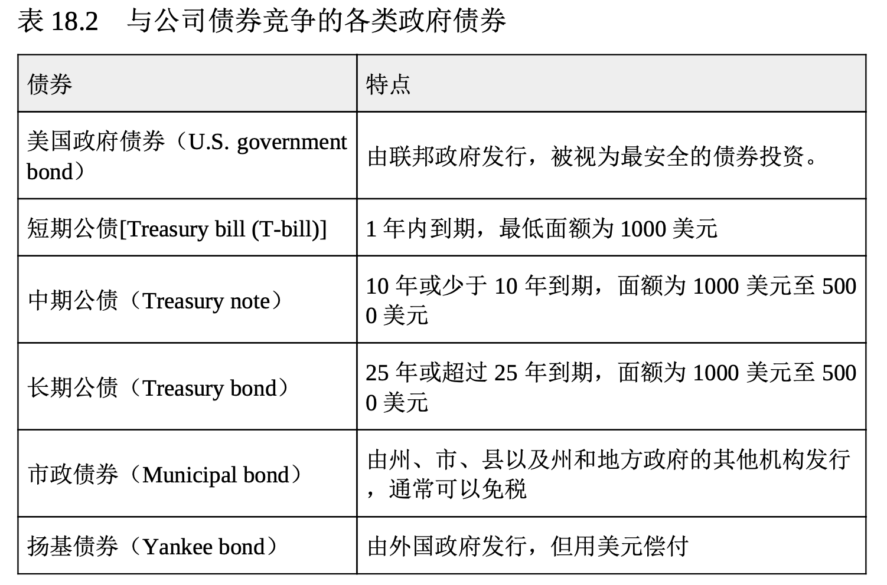
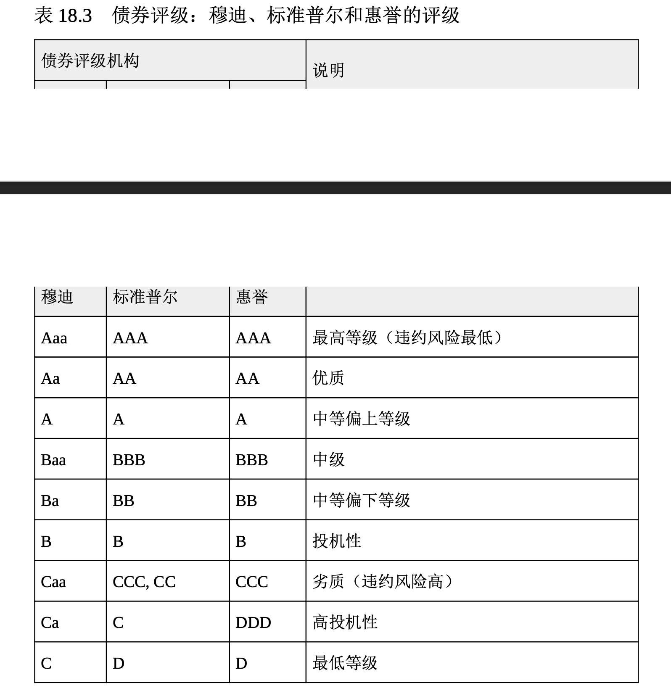

# 发行债券融资

**债券(bond)是表明投资者借款给公司(或政府)的法人凭证**。发行债券的组织有定期支付利息给投资者，并在规定时间偿付债券的全部本金的法定义务。以下将更深入地探讨债券的语言，让你对它有一个更清楚的了解。

## 学习债券的语言

公司通常以 1000 美元为单位发行债券(政府债券要比这一数字大得多)。本金就是债券的面值，按照法律规定，发行债券的公司要在债券到期日(maturity date)偿还债券持有人全部本金。**利息(interest) 是债券发行人向债券持有人支付的因借用他们的资金而做出的补偿**。如果非常素食餐厅发行面值 1000 美元、利率 5% 且到期日为 2022 年的债券，等于就是它同意每年支付给债券持有人 50 美元的利息，一直到 20 22 年某个特定的日期，届时再把 1000 美元的本金一次性偿还。到期日可以各有不同。像迪士尼、IBM 和可口可乐这样的公司就发行过 100 年才到期的债券。

**债券利率有时也称为债券票面利率(coupon rate)**，这个词可以追溯到债券以不记名债券(bearer bond)的形式发行的时候。债券持有人被当成所有人。当时，发行债券的公司并不记载债券所有权的转移，债券持有人若要取得利息，只需要将附于债券上的息票剪下，并送至发行公司即可。现在，发行的债券都是记名债券，其所有权的转移都会有电子记录。

美国政府债券给付的利率会对公司必须给付的债券利率产生影响。 美国政府债券被认为是安全的投资，因此，它可以支付较低的利率。表 18.2 描述了几种在美国证券市场与公司债券相竞争的政府债券。根据经济状况、发行公司的声誉和类似公司的债券利率，发行公司的债券利率也会变化。虽然债券利率的报价是以一年为期的，但通常分两期支付，而且利率一般不能更改。

债券评级机构会评估公司发行债券的信用度。标准普尔、穆迪投资 者服务和惠誉评级(Fitch Ratings)等独立的评级公司会根据债券的风险加以评级，其等级范围从最高级债券到垃圾债券(稍后会在本章讨论 )。表 18.3 给出的是债券等级的范围。

## 发行债券的优缺点

债券带给组织许多长期融资的优势:

* 债券持有者为公司的债权人而非所有者，对公司事务很少有投票权，因此，管理层仍保有营运公司的控制权。
* 债券利息属于公司开支，而且是免税的(参阅第 16 章)。
* 债券为暂时性融资来源，最终都要偿还，届时债务得以消除。
* 如果债券包含提前赎回条款，它可在到期日以前清偿，也可以转换为普通股。(下面将深入讨论这两个特点。)

但债券也有缺点:

* 债券提高了债务(长期负债)，而且不利于市场对公司的认知。
* 支付债券利息为法定义务，若未付利息，债券持有人可诉诸法律强制偿还。
* 债券面值必须在到期日清偿，如果缺乏周密的计划，到期偿还时可能会造成现金流问题。

## 债券类型

企业可以发行两种公司债券。**无抵押债券**通常称为无担保债券(de benture bonds)，它没有任何特定附属担保物(土地或设备)的支持。 只有信誉卓著和信用等级优良的公司才能发行，因为它们不给投资者提供担保。**担保债券**(secured bonds)有时叫作抵押债券，它有附属担保物作为支持，比如抵押给债券持有人的土地或房产，以防本息到期无法偿还。公司债券发行人可以选择包含不同特点的债券。以下将检视几种 债券特征。

## 债券特性

现在你应该了解到发行的债券有利率，分为无担保债券和由几类抵押物担保的债券，而且必须于到期日偿还。清偿的需要使得公司要设置一个准备金账户，它被称为**偿债基金**(sinking fund)，其主要目的是为了确保在到期日时有足够的资金支付给债券持有人。发行偿债基金债券的公司要在到期之前定期提取一部分本金，以便在到期日前积累足够的资金。偿债基金对发行债券的公司和投资者都有吸引力，原因如下:

* 可以为发行的债券有序提取还款资金。
* 降低债券无法清偿的风险。
* 通过降低债券的违约风险稳定债券的市场价格。

**可赎回债券**(callable bond)允许债券发行者在到期日前提前偿还本金。可赎回债券让公司在进行长期预测时具有一定的相机抉择权。假设非常素食发行了 1000 万美元 20 年期的债券，利率为10%，则每年利息费用为 100 万美元(1000 万美元×10%)。如果市场状况起了变化，同等债券的利率现在只有 7%，非常素食每年要多付 3% 或者说多付 30 万美元(1000 万美元×3%)的利息。该公司可以赎回(清偿)旧债券，并以较低利率重新发行新债券，从而受益。如果公司在到期前赎回债券 ，它常常要给投资者支付高于债券面额的溢价。

投资者可以将**可转换债券**(convertible bond)换成发行公司的普通股票。它对投资者有吸引力，因为普通股倾向于比债券增值更快。因此，如果公司普通股的价值一直大幅增长，债券持有人可以比较继续持有债券所获利息与转换成特定数量普通股的潜在利润，从而做出选择。

既然你从公司的角度了解了股票和证券作为融资工具的优缺点，下面就让我们探讨股票和证券给投资者带来的机会。
