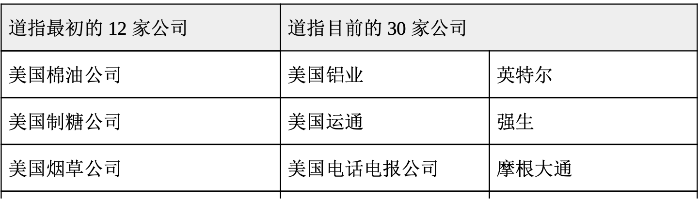
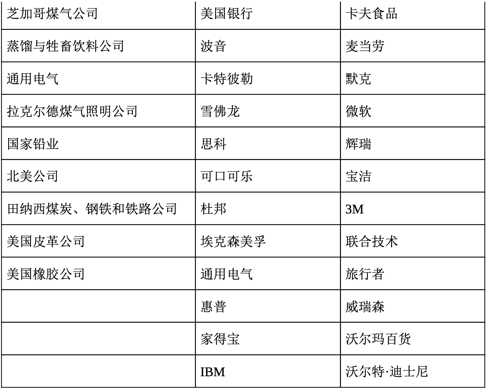

# 了解股市指标

当今的投资者可以获知大量的投资信息。像《华尔街日报》《巴伦 周刊》《投资者日报》和《今日美国》(USA Today)等报刊提供了大量的公司和全球市场的信息。微软全国广播公司(MSNBC)和全美广播公司财经频道等电视新闻网则提供每日投资分析和不同的观点，以帮助投资者做出决策。MSN理财和雅虎金融等网站免费向投资者提供理财信息，不久之前雅虎金融的信息还只对经纪人开放，并且收取很高的费用。但请记住，投资是一门不精确的科学。有人卖出股票，那是因为相信股价会跌，而其他人购买股票，是因为相信股价会涨。

在新闻报道的最后，你常常听到这样一条评论:“道指交易活跃，今日上涨 190 点。”你曾经纳闷过那是什么意思吗?**道琼斯工业平均指数**(Dow Jones Industrial Average，the Dow)是 30 只精选工业股票的平均价格。金融行业用来标识一段时间股市的走向(上涨或下跌)。查尔斯·道(Charles Dow)于 1884 年开始用 12 只重要股票的价格来衡量股票的平均价格。1982年，道琼斯指数扩大到 30 只股票。表 18.6 列出了道琼斯指数最初的 12 只股票和现在的 30 只股票。在这 12 家最初的公司中，你知道哪几家?

表 18.6 道指最初和 2011 年所包含的公司

现在，在某只股票被认为不再合适的时候，道琼斯公司会用新股票来替换它。1991 年，迪士尼加入了道琼斯指数，以反映服务业增加了的重要性。1999 年，道琼斯指数增加了家得宝百货和 SBC 通信公司， 以及第一批纳斯达克股票英特尔和微软。2004年，美国国际集团(AIG)、辉瑞制药和威瑞森电信(Verizon)取代了美国电话电报公司(AT&T)、国际纸业(International Paper)和伊士曼柯达。2005年，美国 电话电报公司和 SBC 合并后重返道琼斯指数。2008年，雪佛龙、美国银行和卡夫食品(Kraft Foods)取代了奥驰亚集团(Altria Group)、霍尼韦尔(Honeywell)和美国国际集团。2009年，旅行者(Travelers) 和思科(Cisco)取代了花旗集团和通用汽车。

有评论家指出，仅仅有 30 家公司的道琼斯指数样本量太小，无法就一段时间内市场的方向提供富有代表性的统计结果。许多投资者和市场分析员宁可追随标准普尔500(S&P500)之类的股价指数。标普500追踪了400 家工业股、40家金融机构股、40家公共事业股和20家交通股的绩效。投资者也密切关注纳斯达克平均指数，每个营业日它都会报价，以显示该重要交易所的趋势。

掌握股市最新行情有助于你判断什么投资最适合你的需求和目标。请记住有关投资的两个事实:**你个人的理财目标和需求会随着时间而改变，而且市场是波动的**。让我们看看市场的反复无常，以及那些为投资者带来新的风险与机遇的挑战。

## 市场的涨跌起伏

整个 20 世纪，股市都在起起伏伏，伴随着几次巨大的振荡。第一次大崩盘发生于1929年10月29日，星期二(因此被称为“黑色星期二 ”)一天之内股市的跌幅几乎达到了13%。黑色星期二和紧随其后的大萧条让人对市场波动的真实性有了更加切身的感受，那些只拿很少的保证金却购买大量股票的投资者感受尤其深刻。1987年10月19日，股票市场遭受了史上最大的单日下跌，市价损失超过22%。1997 年 10 月 27 日，投资者再度感受到了市场的狂怒。对迫近的亚洲经济危机的恐惧导致了恐慌和更广泛的损失。幸运的是，经历了短暂的下降之后，市场得以重振。

在20世纪90年代后期反弹之后，股市于21世纪头十年早期再次遭遇厄运。从2000年到2002年，投资者总共损失市值7万亿美元。21世纪头十年中期，股市开始恢复，但到 2008 年，复苏被打断，金融危机加剧了股市的大规模抛售，导致创纪录的亏损。

究竟是什么引起 1929 年、1987 年、1997 年、2000 年到 2002 年以 及 2008 年的股市动荡呢?在 1987 年，分析师认为原因在于**程序交易**(program trading)，在程序交易中，投资者会给计算机发出指令，股价跌到某一价格时即自动售出，以避免潜在的损失。到了 1987 年 10 月 19 日，电脑抛单导致许多股票在当天跌到令人难以置信的低谷。这次崩盘促使美国交易所建立起一套机制，即**限制交易**(curbs)和**熔断机制**( circuit breakers)，以便在交易日市场大幅涨跌时限制程序交易，届时主计算机会关机，程序交易会暂停。如果观看全美广播公司财经频道或微软全国广播公司播出的节目，你就会在屏幕上看到“**限制交易开始生效**” (curbs in)的短语。

熔断机制比限制交易更加猛烈，一天之内道琼斯指数下跌10%、20%或30%时它就会被启动。1997年10月27日发生过一次，当天，股市下跌接近 7%，于是股市在下午3点半被关闭，而没有等到4点。许多人认为，如果没有这个交易限制机制，1997 年由亚洲金融危机引起的股市崩盘可能会更严重。依据下跌的幅度和时段，熔断机制会停止所有交易半小时至2小时，以便让投资者有时间对形势做出评估。

20 世纪 90 年代后期，股市涨幅达到了空前的高度，不料 2000 年 至 2002 年竟会出现暴跌。主要原因是互联网泡沫的破裂。当太多的投资者将某种东西(此时为网络股)的价格抬高到不切实际的高度时就会导致泡沫的产生。

屋漏偏逢连夜雨，在互联网泡沫破裂的同时，世通、安然、环球电讯和泰科等公司的财务造假丑闻接连曝光。投资者原本相信这些公司的财务报表公正地反映了它们的真实价值。但当他们发现投资分析师经常提供过于乐观的评价和推荐，而这些公司并不值这么多钱时，这种信任也就烟消云散了。

在互联网泡沫引起的金融衰退之后，21世纪头十年中期，股市大涨，2007年10月道琼斯工业平均指数再创新高。市场的增长是戏剧性的，房地产行业的增长尤其激动人心。从2000年到2006年，现有房价上涨了 50%，然而，2006年至2011年，房价下跌了 6.3 万亿美元。房地产泡沫就像是之前的互联网泡沫一样:投资者认为房价会永远上涨。 金融危机可归咎于金融机构对住房贷款的收紧，建房者的过量修建，以及购房者的支出过大。政府也难辞其咎。它要求给低收入和中等收入的购房者发放更多的抵押贷款，其中很多人的信用评分不高，或者没有收入或资产的证明。这些次级贷款被集中起来，并被重新打包成为抵押担保证券，出售给投资者(将在 19 章中讨论)。随之而来的是大量抵押品赎回权的取消，政府扶持的抵押贷款巨头房利美(Fannie Mae)和房地美(Freddie Mac)倒闭了，350多家银行也宣布破产。

房地产市场的崩溃导致住房和商业地产8万亿美元的综合损失(超过了中国的国内生产总值)。雷曼兄弟等金融机构停业，华尔街的偶像美林证券(Merrill Lynch)被美国银行收购。自从大萧条和经济严重衰退以来，金融市场的处境最为艰难，鉴于此，联邦政府采取了行动。国会通过了 7000 亿美元的金融救市计划，叫作不良资产救助计划(TARP)，允许财政部收购或承保“不良资产”，以援助银行，帮助汽车制造业以及保险商美国国际集团摆脱困境。遗憾的是，2009 年经济仍在下滑，失业率上升到两位数。因此奥巴马总统推动通过了 8000 亿美元的经济刺激计划，它包含了减税和扩大政府支出，旨在降低失业率，“显著提振”羸弱的经济。

随着经济从始于 2008 年的危机中慢慢恢复过来，几个积极的经济信号已经显露。不良资产救助计划基金所花费的并没有达到国会所分配的 7,000 亿美元。而且，陷入困境的银行偿还了它们通过不良资产救助计划获得的资金，美国国际集团和通用汽车预期也要全额偿还政府资金 。然而，失业和缓慢的经济增长仍然是需要关注的主要问题。经济危机很有可能会对经济造成长期的影响。

> **法律实例**  为监管清理道路
>
> 为了应对这次历史性的经济崩溃，2010 年 7 月 21 日，美国国会通过了《多德-弗兰克金融改革和消费者保护法案》(Dodd–Frank Fi nancial Reform and Consumer Protection Act)。该法案远没有政治家和消费者所期待的那样具有神奇的疗效，尽管如此，它却体现了自大萧条以来金融监管方面的巨大变化，其条款会影响从住房购买者、商人直到大型投资银行的各个经济层面。
>
> 《多德-弗兰克法案》中的条款会对美国商业的未来产生重大影响。首先，新法让政府拥有了在崩溃的边缘占有和关闭大型金融机构的权力，努力防止局面进一步的恶化。它也将衍生品和复杂的金融交易(包括加剧金融危机的打包次贷)置于政府严格的监管之下。对冲基金必须要在证券交易委员会注册为投资顾问，并提供交易和投资组合的有关信息。对普通大众而言，在联邦储备体系内依法设立独立的消费者保护机构或许是最重要的事情。新的机构会防止出现与发薪日贷款、抵押贷款和信用卡相关的金融弊病，从而保护借款人的利益。
>
> 不过，该法案远没有完善。有些提倡者担心消费者金融保护局在联邦储备体系中的定位。大量汽车经销商这样的实体企业还没有纳入该机构的监管范围。该法最受争议的是，它几乎完全没有触及美国所有最大的金融机构，甚至是那些由纳税人支持的机构。尽管存在这些不足，《多德-弗兰克法案》至少解决了一些眼下经济面临的最为迫切的问题，同时也为更加健康的金融未来打下了基础。
>
> 资料来源:Brady Dennis, “Congress Passes Financial Reform Bill,”The Washington Post, July 16, 2010; Paul Davidson, Paul Wiseman and John Waggoner, “Will New Financial Regulations Prevent Future Meltdowns?”USA Today, June 28, 2010; and Phil Mattingly, “Dodd-Frank Consumer Protecti on Bureau Changes Approved by U.S. House Panel,”Bloomberg Businessweek, May 13, 2011.

## 21 世纪市场的投资挑战

如前所述，股票市场上涨跌起伏不定。金融市场在未来很有可能会经历变化，这种变化只会加大投资者的风险。金融危机会因世界经济的密切相连而进一步加强。美国并非是唯一受到金融危机影响的国家，欧洲、亚洲和南美的金融市场也感到了痛苦。进入 21 世纪，持续的挑战以及政治和社会的变革会让证券市场成为令人兴奋却不稳定的地方。本章的“法律实例”讨论了政府新实行的、旨在解决某些难题的监管措施。

把你的投资多样化，并当心风险。放眼长远也是一个明智的做法。根本没有容易赚到的钱或稳赚不赔的好事。如果你能认真研究公司和行业，密切关注新闻，并且充分利用投资资源——如报纸、杂志、时事通讯、网络和电视节目等，那么你的付出终会得到回报。
