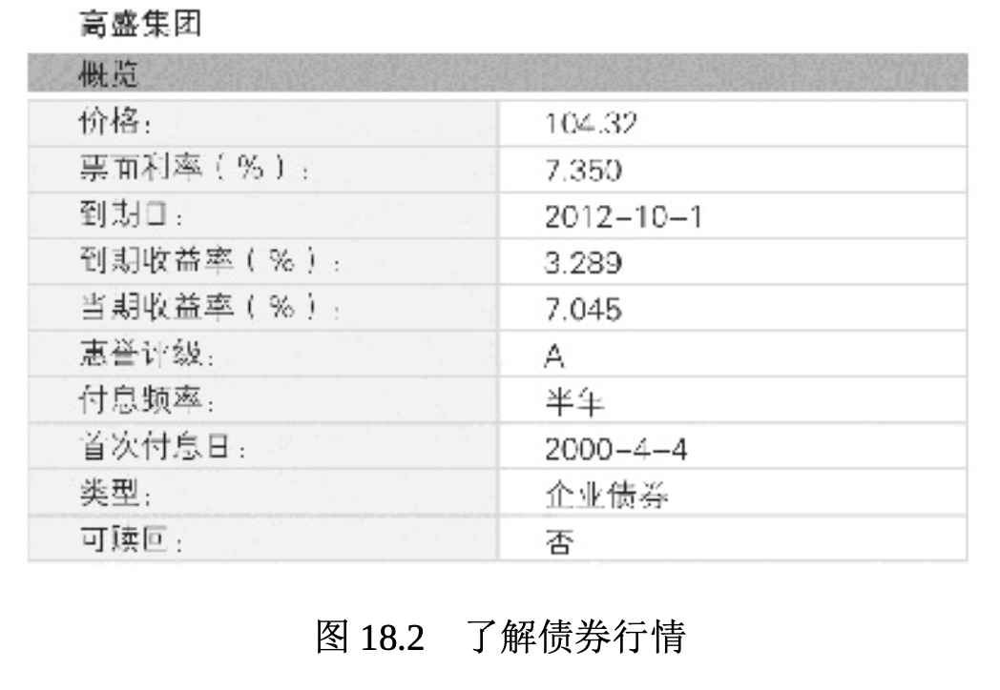

# 投资债券

寻求有保证的收入和有限风险的投资者常常转而购买美国政府债券。这些债券有联邦政府的财政支持和十足信用做担保。市政债券由地方政府发行，并且常常有利息免税等优惠。有些甚至会有保险。公司债券的风险和挑战性略大。

初次购买公司债券的投资者常常会问两个问题，第一个问题是:“ 如果我买了公司债券，我必须持有至到期吗?”你不必如此。大型证券交易所每天都在进行债券的买卖(前面我们探讨过二级市场)。不过，如果你决定在到期之前将债券卖给其他的投资者，你可能不会按票面价值(通常为 1000 美元)出售。如果你的债券没有吸引其他投资者的特点，比如利率高或到期日早，你就必须**折价出售**，即售价要低于其票面价值。但是，如果其他投资者很看重它，你也可能会**溢价出售**，即售价高于其票面价值。债券价格通常与当前市场的利率反向涨落。这表示利率上升，债券价格下跌，反之亦然。然而，就像所有的投资一样，债券也具有某种程度的风险。

第二个问题是:“我如何评估某个特定债券的投资风险?”标准普尔、穆迪投资者服务和惠誉评级等评级公司对很多公司和政府债券进行了评级(回顾表 18.3)。在对评级做出评价时，回想一下风险收益权衡: 债券的风险越高，发行者必须承担的利息越高。只有潜在收益(利息) 足够高时，投资者才会购买被认为是有风险的债券。事实上，有些人会购买垃圾债券。

## 投资高风险(垃圾)债券

虽然债券被认为是一种相对安全的投资，但有些投资者仍然试图通过购买风险比较高的债券来追求更高的报酬，这种债券被称为**垃圾债券** (junk bonds)。标准普尔、穆迪投资者服务和惠誉评级公司规定垃圾债券为高风险和高违约的债券。只有在公司的资产价值仍然较高，且其现金流仍然稳定的时候，垃圾债券才会给投资者支付利息。虽然利率有吸引力，常常还会很诱人，但如果公司无法偿付债券，留给投资者的就只是一张写着字的纸，换言之，就是垃圾。

## 了解债券行情

债券的报价以 1000 美元的百分比进行标注，利率的后面通常都会加上“s”，以方便发音。例如，2022 年到期的利率为 9% 的债券称为“9s of 22”。图 18.2 举的例子是雅虎金融中高盛公司(Goldman Sachs)的一个债券报价。该报价突出了债券的利率(票面利率)、到期日、债券等级、目前价格和其是否可随时要求兑付。对债券了解越多，你就越懂得如何与投资顾问和经纪人讨论你的理财目标，越能确保他们的建议与你的最大利益和目标一致。

