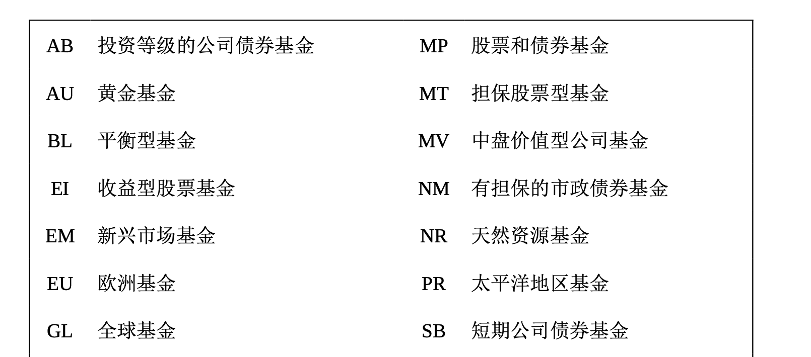
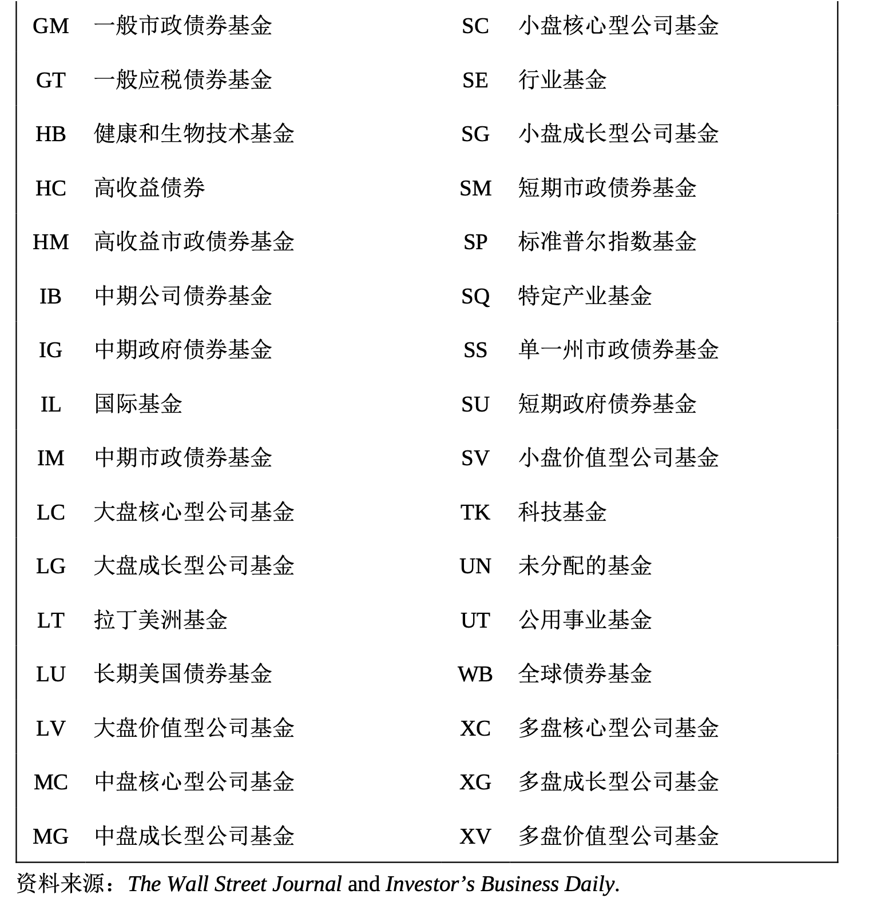
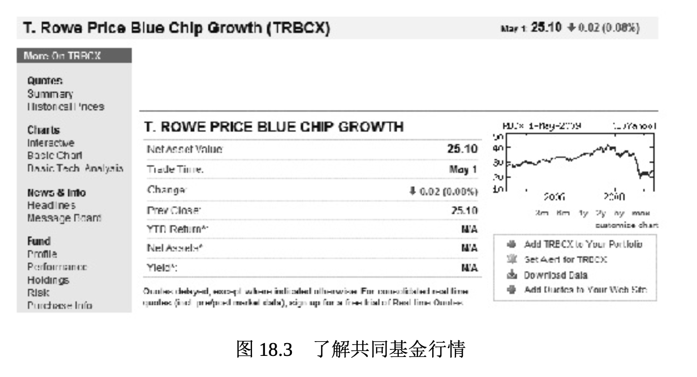

# 投资共同基金和交易型开放式指数基金

**共同基金**(mutual fund)购买股票、债券和其他投资，然后再将这些证券中的股价出售给公众投资者。共同基金类似一个投资公司，它先筹集众多投资者的资金，然后依据基金的特定目的，购买许多公司的股票和债券。共同基金的管理人都是专业人士，他们筛选他们认为最优质的债券和股票，帮助投资者实现投资的多样化。

共同基金的投资范围很广，从只投资政府有价证券的稳健型基金到专门投资于新兴生物科技公司、网络公司、外商企业和贵金属的基金，再到其他风险较高的投资，无所不包。有些基金是股票和债券的投资组合。今天，共同基金的数量多得惊人。例如，2011年，投资美国股票的共同基金有 3286 支。投资者在共同基金上的投资超过了 11 万亿美元 。表 18.4 为你列出了一些共同基金的投资选择。

表18.4 共同基金的投资目标。目标风险基金、稳健型基金到投资高风险行业的基金 一应俱全。表中列出的为基金的缩写及其含义。

年轻投资者或投资新手常常听从建议购买一些**指数基金**(index fund)，这些指数基金投资于某一种类的股票或债券，或者投资于整个市 场形势。指数基金可能专注于大公司、小公司、新兴国家或房地产(房地产投资信托，简称REIT)。投资多样化的方式之一就是投资各种指数基金。股票经纪人、注册理财规划师(CFP)或银行从业人员可以帮助你找到最能满足你个人投资目标的共同基金。时事通讯《晨星投资者》(Morningstar Investor)是评估共同基金的绝佳信息来源，同样你也可以参考《彭博商业周刊》《华尔街日报》《钱》、《福布斯》和《投资者商业日报》等报刊。

投资共同基金有一个好处，那就是如果你的理财目标改变了，你的投资目标也很容易改变。例如，很容易将你的债券基金改成股票基金，只不过是打一个电话或点击一下鼠标。共同基金的另外一个优势是你通常可以直接购买，从而避免了经纪人的手续费或佣金。不过，要核清共同基金的收费，因为收费的差别非常大。例如，**有佣基金**(load fund) 向投资者收取买和卖的佣金，而**免佣基金**(no-load fund)则不收取佣金。

核查基金经理人的长期业绩表现很重要，他们的业绩越稳定越好。名为**开放式基金**(open-end funds)的共同基金会接受任何感兴趣的投资 者的投资。然而，封闭式基金(closed-end funds)则限量出售投资股份 ，一旦募足了目标数量，新的投资者就不能再购买。

**交易型开放式指数基金** (Exchange-traded funds，ETFs)很像股票和共同基金。它们集合了股票、债券和其他投资，并在证券交易所进行交易，其交易更像是单只股票，而不像是共同基金。例如，共同基金只 许可投资者在收盘时买卖。交易型开放式指数基金可以在交易日的任何时间进行买卖，这一点与单只股票一样。

关于共同基金和交易型开放式指数基金，还有一个关键点要记住: 它们为小额投资者提供了一种分散股票和债券投资风险，并让收费的理财专家来管理他们的投资的方式。理财顾问会向投资者尤其是小额投资者或初次投资者优先推荐共同基金和交易型开放式指数基金。

## 了解共同基金行情

通过接触经纪人，或打电话、浏览网站直接接触基金公司，你可以调查各种共同基金的特性。商业刊物和网络资料也会提供有关共同基金的信息。

查看图 18.3，所举出的雅虎金融普信(T. Rowe Price)蓝筹成长型基金的例子。基金的名称以大写字母显示。**基金净值**(net asset value， NAV)是共同基金的每份价格。共同基金投资组合的市值除以已经出售的份额数即得到基金净值。该表也显示了基金的年初至今回报(year-to- date return，YTD)、前一天交易以来基金净值的变化和基金净值。

表 18.5 根据风险、收入和投资的成长性(资本收益)对债券、股票、共同基金和交易型开放式指数基金进行了评价。

表 18.5 投资比较

| 投资     | 风险程度 | 预期收益 | 成长性(资本收益) |
| -------- | -------- | -------- | ---------------- |
| 债券     | 低       | 安全     | 小               |
| 优先股   | 中等     | 稳定     | 小               |
| 普通股   | 高       | 易变化   | 好               |
| 共同基金 | 中等     | 易变化   | 好               |
| ETF      | 中等     | 易变化   | 好               |

