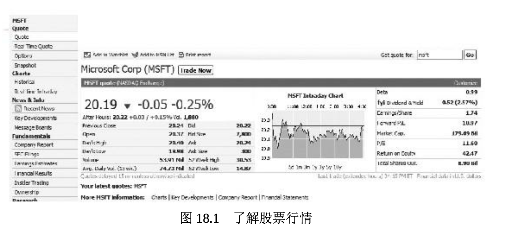

# 投资股票

购买股票让投资者成为公司的部分所有者。这意味着作为股东，他们可以分享公司的胜利成果。遗憾的是，如果公司经营不善，或者股市整体崩溃，他们也会跟着赔钱。始于 2008 年的股市狂跌就是证明。

根据对股市的直接感觉，股票投资者常被称为“牛”或“熊”。认为股票会上涨，并基于升值预期而购买股票的投资者是“牛”。**当股票价格整体出现上涨时，则称为牛市**。预期股价下跌，并基于跌价预期卖出股票的投资者是“熊”。这就是**当股价持续跌落，这样的市场称为熊市**的原因 。

多数股票的市价和增长潜力在很大程度上取决于公司的整体绩效。达成目标的公司就具有资本收益的巨大潜力，所谓**资本收益(capital gai ns)是股票买进价与卖出价之间的正差值**。例如，如果在 1965 年麦当劳公司首次发行股票时投资 2250 美元购买其 100 股股票，到 2010 年 1 2 月 31 日年终收盘时股份增至 74,360 股(经过公司 12 次股票分拆之后 )，市值大约为 570 万美元。现在它相当于多少巨无霸汉堡啊!

投资者常常基于他们的投资策略来选择股票。可口可乐、强生、宝洁等**高质量的公司发行的股票被称为蓝筹股(blue-chip stocks)**，这个词源自纸牌游戏，其中面额最大的筹码是蓝筹。这类股票通常会定期分 红，而且会不断地涨价。

新兴领域的公司大都为科技、生物技术或互联网相关的公司，它们发行的股票被称为**成长股(growth stocks)，其收益预期要比其他股票增长得快**。虽然风险较高，成长股却具有较高回报的潜力。公共事业公司发行的股票被当成收益股(income stocks)，因为它们经常给投资者以高额分红，并且通常也能赶得上通货膨胀的步伐。甚至还有低价股( penny stocks)，表示公司处于石油勘探之类的高风险竞争行业。低价股的售价低于2美元(有些分析师认为低于5美元)并且风险高。

购买股票时，投资者在下单购买时有多种选择。**市价委托(market order)是指示经纪人立即以当下市场上最好的价格买卖股票**。**限价委托(limit order)则是要求经纪人只在特定价格出现时买卖股票**。举例说明，某种股票每股售价 40 美元。你认为股价最终会上涨得更高，但上涨前可能会下滑至36美元。你可以设定一个36美元的限价委托，如此，你的经纪人会在价格跌至 36 美元时替你买进。但如果股票从没有跌 到 36 美元，经纪人就不会为你购买。

## 股票分拆

股票经纪人喜欢整数股(round lots)交易，也就是每次买卖的股票数为 100 股。然而，投资者常常买不起 100 股，而且每股可能要卖到 100 美元，因此，他们常常购买**零股(odd lots)**，或单次购买的股票不到 100 股。因此，高价股票通常让公司宣告**股票分拆(stock splits)**， 也就是公司将流通在外的每一股股票分拆成两股或更多股。每股的股价较高会引致公司宣布要进行股票分拆，它们会将已经发行的股票按两股或更多股来发行。如果非常素食的股票以每股 100 美元卖出，该公司可以宣告实行买一送一的股票分拆，拥有一股的投资者现在拥有了两股， 但每股的价值只有50美元(分拆前的一半)。

股票分拆不会改变公司的产权结构，也不会造成投资价值的立即改变。然而，投资者通常会赞同股票分拆，因为对每股 50 美元的股票需求会大于对每股 100 美元的股票需求，而且分拆后的股价可能在不久的将来存在升值的空间。公司不会被迫分拆其股票，而且时至今日，股票分拆也不再那么普遍。传奇的美国投资者沃伦·巴菲特的公司伯克希尔·哈撒韦(Berkshire Hathaway)就从未分拆过其 A 级股票，即使它的每股股价已超过了 15 万美元。

## 限界购股

**限界购股(buying stock on margin)指从经纪公司借一部分钱购买股票**。**保证金(margin)**是指投资者在购买股票时必须用自己的钱支付的那部分。美国联邦储备体系的联邦储备委员会规定美国股市的保证金比例。简而言之，如果保证金比例为50%，拥有保证金账户的投资者可以按最高 50% 的比例从经纪人那里借钱购买股票。

虽然限界购股听起来像是一种购买更多股票的简易方式，但它也有不利的一面，那就是投资者必须偿付借自经纪人的贷款及利息。如果投资者的账户市值下跌，经纪人会发出追加保证金的请求，要求投资者拿出资金弥补账户遭受的损失。如果投资者无法追加保证金，经纪人会依法出售投资者的股票，以降低经纪人的损失。追加保证金的请求可以强制投资者在几天甚至几小时之内偿还很大一部分的账户资金。因此，限界购股是一种有风险的投资股票方式。

## 理解股市行情

像《华尔街日报》《巴伦周刊》(Barron’s)、《投资者商业日报 》这样的出版物刊载了大量股票和其他投资的信息。你所在的地方报纸也会刊载类似的信息。像 MSN 理财、雅虎财经和全美广播公司财经频道等财经网站会发布公司的最新信息，更加详细，而且点击鼠标即可获得。图 18.1 显示的是 MSN 理财中的微软股市报价。微软在纳斯达克交易所的代号为 MSFT。优先股则在公司代号之后标注字母“pf”。请记住 ，公司可以发行几种不同的优先股。

股票报价中提供的信息易于理解。它包括当天股票交易的**最高价**和**最低价**、过去 52 周以来股价的高低变化、已付**分红**(如果有分红的话)、**股息分红率**(年度分红占每股价格的比例)、**市盈率(P/E，股票价格与每股收益之比)**等重要比率以及**净资产收益率**。投资者还能看到流通股的数量和公司的总市值。很多技术参数也会显示出来，比如股票的**贝塔系数**(β)。图 18.1 显示的是股票的日内交易(当天的交易)，但你也可以点击查看不同时段的曲线图。债券、共同基金和其他投资的类似信息也可以通过网络获得。

即使你缺少投资的资金，你可能也想追踪引起你兴趣的特定股票的市场走势。许多成功的投资者在大学就开始建立股票的假设投资组合，并追踪它们的表现。在真正冒险投入资金之前，对投资越了解就越好。
