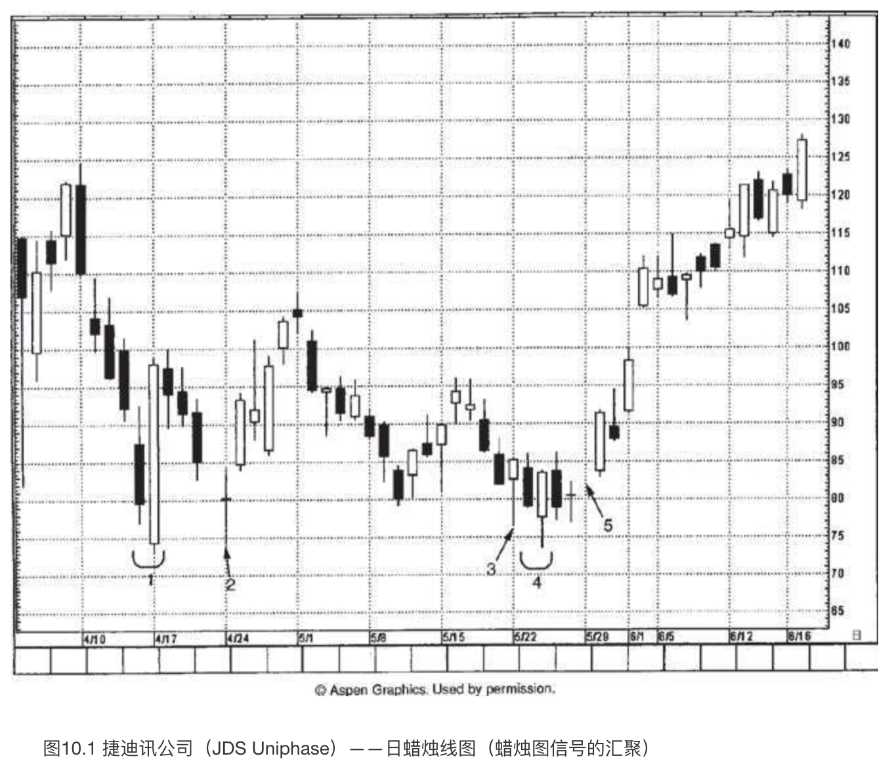
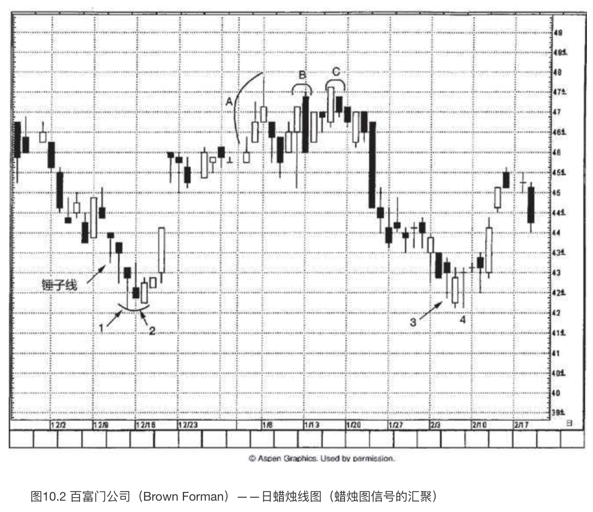
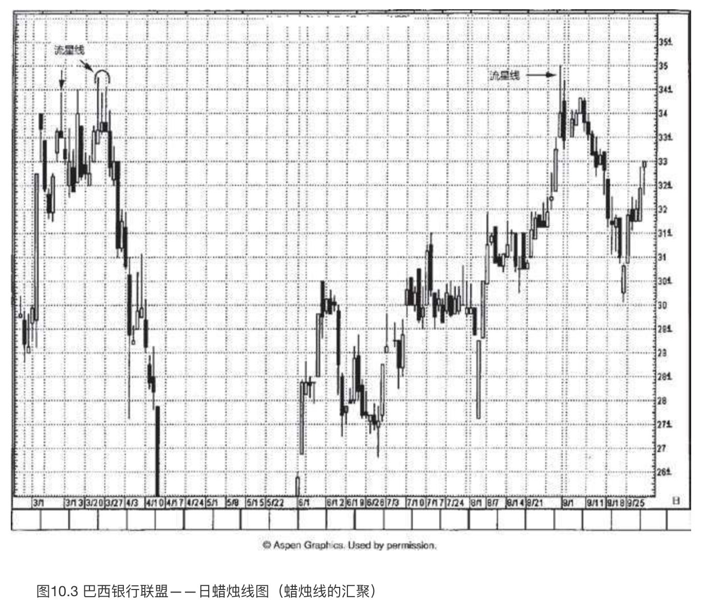

# 蜡烛图信号的汇聚

`“慎之又慎”`

本章将要研究，如果在同一个价格区内汇聚了一群蜡烛线，或者蜡烛图形态，那么此处作为支撑区域或阻挡区域的重要性将被放大，形成重要的市场转折点的可能性将上升。

如图10.1所示，分头出现的一群蜡烛图信号汇聚在75美元附近，这样一来，便突出显示了该区域支撑作用的稳固性。下面对这群信号逐一讲解。

1. 4月17日是一根极长的白色蜡烛线，它包裹了前一根黑色实体，形成了**看涨吞没形态**。由于这个**看涨吞没形态**中的白色蜡烛线如此巨大，意味着等到该形态最终完成时，股票已经离开其低点近25美元之遥了。于是，虽然**看涨吞没形态**为我们提供了反转信号，但当形态完成时，从风险报偿比的角度来考虑，并没有为我们带来有吸引力的买入机会。
2. 请记住一个重要概念，**看涨吞没形态的低点将转化为支撑水平**。我们把注意力转向本形态的低点，大约73美元处，以此作为潜在的支撑水平。从4月17日所在的一周开始的下降行情在接近这个预期中的支撑水平时终于稳定下来，形成了一根长腿十字线。
3. 5月22日的锤子线进一步加强了上述支撑水平。
4. 在3处的锤子线之后的两个时段里，完成了一个经典的**刺透形态**。该形态的低点从来自1处的**看涨吞没形态**的支撑水平附近向上反弹。
5. 如果我们还希望看到更多的底部证据，那么它出现在5处。这是5月底的一个小型向上的窗口。另外，如果您观察一下从5月15日所在的一周到5月29日所在的一周的行情变化，会注意到股票正在构筑一个**圆形底**。在这个**圆形底**的基础上增添上述窗口（位于5处），就得到了一个**平底锅底部形态**。

图10.2展示了一群蜡烛图信号汇聚起来，有助于确认支撑水平或阻挡水平。

* **一群蜡烛图信号汇聚起来作为支撑水平**。12月11日是一根锤子线。尽管这根**锤子线带有潜在的看涨意味**，但是在出现锤子线的同时打开了一个向下的窗口，使得趋势维持向下。当市场从这根锤子线开始上涨时，上涨过程通过三根带有长下影线的蜡烛线组成的一个系列来完成。**这些长下影线在一定程度上抵消了看跌的氛围**。1处的蜡烛线也是一根锤子线，但是与上面讨论的第一根锤子线不同，在之后的两天里，即12月16日和17日，这根锤子线成功地发挥了支撑作用。2处的两根蜡烛线构成了一个**看涨吞没形态**。在3处，2月初又出现了一根锤子线。这里是1和2处形成的支撑水平。4处的蜻蜓十字线进一步证实了大约42美元的支撑水平。
* **一群蜡烛图信号汇聚起来作为阻挡水平**。在A处股票上涨，上涨过程是通过一系列带有长上影线的蜡烛线形成的。因为这群蜡烛线具备**更高的高点、更高的低点、更高的收市价**，所以短期趋势保持向上。但是，**那些长上影线构成了警告信号**，**多方并没有完全站稳立场**。最后那根带有长上影线的蜡烛线出现在1月6日，这是一根流星线。几天后，在B处，股票形成了一个看跌吞没形态。在C处，小黑色实体出现在长长的白色实体之后，组成了一个孕线形态。于是，A处的流星线、B处的看跌吞没形态、C处的孕线形态，三者汇聚起来，强调了位于47.50-48美元的天花板。

蜡烛图为图形分析提供了十分有效的工具。这是因为我们可以运用蜡烛图很便捷地观察图形线索，评估市场的健康状态，识别不健康的市场状态。只要简单地看一眼某根蜡烛线的形状，就能立即看出当前的需求或供给状况。带着这些考虑，我们来观察图10.3。

3月中下旬，出现了一系列流星线，构成了接近34.50美元的阻挡水平。看看这群流星线，难道您对股票已经在34.50美元上下遇到了麻烦还有任何怀疑吗？当然不会，因为这群流星线通过其图形突出地显示，**每当股票接近本时段的最高点时，空方就会跳出来打压股价，最终使股价收市于本时段的最低点，或接近本时段的最低点**。到了8月底，对这群流星线构成的阻挡水平，市场向上发起了又一次冲击。无独有偶，在8月的上冲行情里也出现了一根高悬头顶的流星线。除了这根流星线带来的负面意味之外，**下一日的黑色实体雪上加霜，完成了一个看跌吞没形态**。
