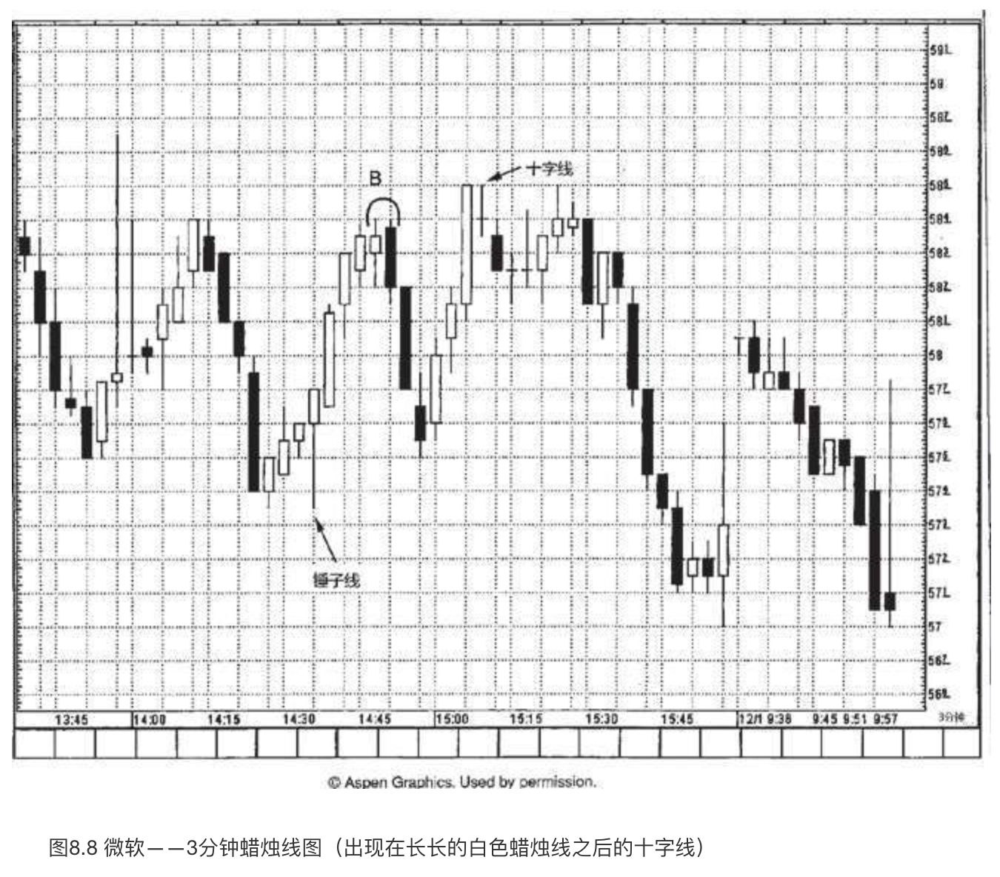
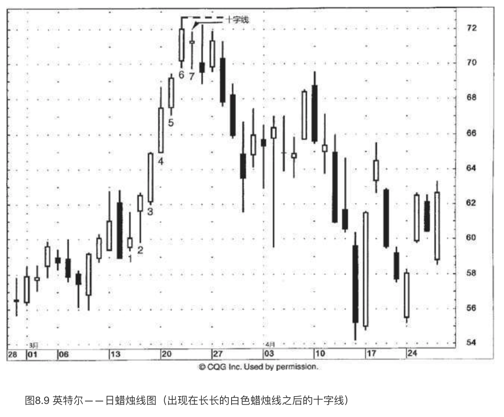
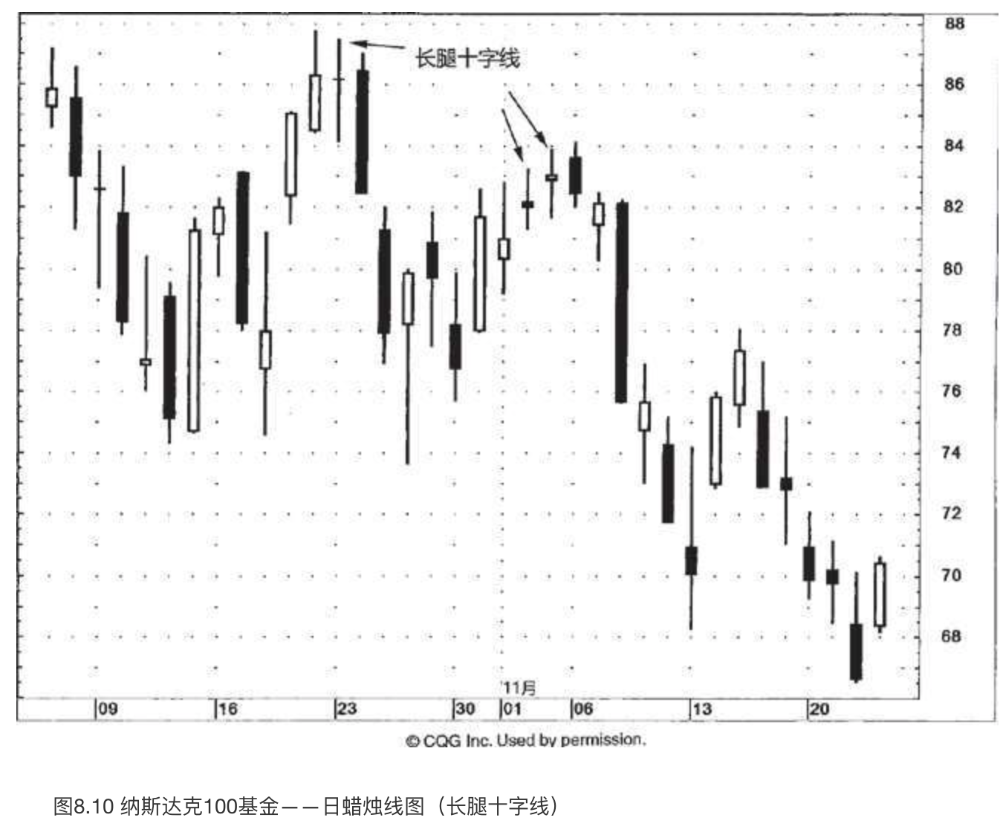
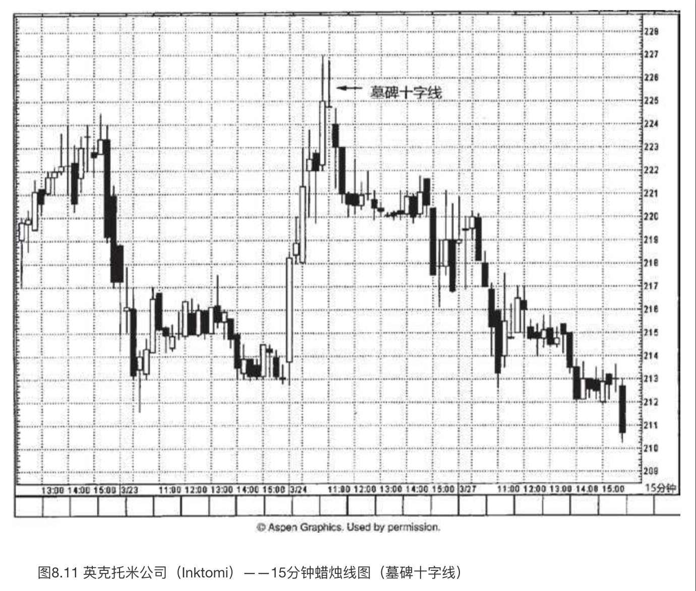
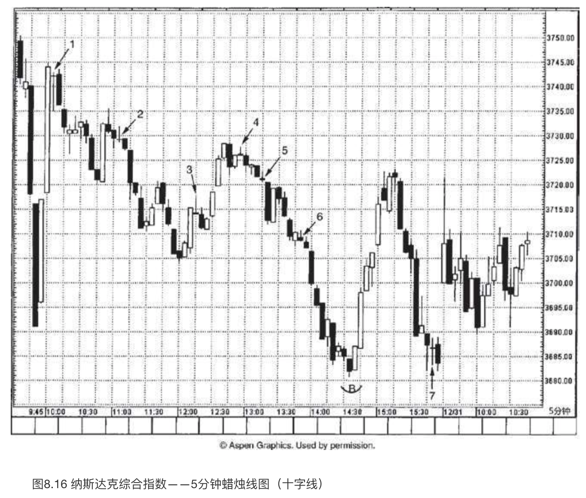

# 神奇的十字线

`“险从天降”`

正如第三章所介绍，**十字线**是一类特别的蜡烛线，其开市价与收市价处在同一个水平上。从图8.1到图8.6，显示的是十字蜡烛线的各种例子。因为十字线是一种极其重要的反转信号，所以我们专门辟出这一章来对其进行研究。在前面的各章中，我们已经看到十字线作为一些蜡烛线形态的组成部分所发挥的重要力量。这类形态包括**十字星形态**（参见第五章），以及**十字孕线形态**（参见第六章）。

***十字线是一种独特的趋势转折信号，特别是当它处在上涨行情时***。在十字线出现后，如果发生下列情形，则增加了十字线构成反转信号的可能性。

1. 后续的蜡烛线验证了十字线的反转信号。
2. 市场正处在超买状态或超卖状态。
3. 十字线在该市场出现得不多。如果在某个行情图上出现了许多十字线，则即使出现了新的十字线，也没有多大意义。

在一根完美的十字线上，开市价与收市价处于同一水平，不过，这一标准也有一定程度的灵活性。如果某根蜡烛线的开市价与收市价只有几个基本价格单位的差别（举例来讲，在股票市场上其差别仅为几美分，或者在长期国债市场上仅有几个1／32美元的差距，等等），那么依然可以把这条蜡烛线看成一根十字线。根据什么原则来认定，一根近似于十字线的蜡烛线（也就是说，它的开市价与收市价很接近，但不是严格一致）到底算不算十字线呢？这是一个带有主观色彩的问题，我们找不到严格的标准。下面列举了若干技巧，当我们遇到近似的十字线时，可以借助它们来判断，是否可以把它归结为常规十字线并采取相应的行动。

1. 看这根近似的十字线与其邻近的价格变化的相互关系是怎么样的。**如果在这根近似十字线的周围，还有一系列的小实体，那么就不应该认为这根蜡烛线有多大的意义，因为在它附近有这么多的小实体蜡烛线**。**然而，如果在若干长蜡烛线之后出现了一根近似的十字线，那么我们就可以说这个时段的变化具备与十字线相同的含义，因为本时段的变化与之前的行情显现出本质上的区别。**
2. 如果当时市场正处在一个**重要的转折点**。
3. 如果市场已经处在极度**超买或超卖状态**。
4. 如果当时已经有**其他技术信号发出了警告信息**。

这种做法的理论依据是，因为十字线可能构成了重要的警告信号，所以我们宁可错认也不能漏过。

本章要讨论十字线出现在**顶部反转过程**的情形、十字线构成**阻挡水平**的情形，**特定形式**的十字线，十字线与趋势分析，以及**三星形态**等。

十字线之所以很有价值，是因为它在揭示市场顶部方面有过人的能力。**在上升趋势中，如果前面先出现一根长长的白色蜡烛线，后面跟着一根十字线，这种情况尤其值得注意**（如图8.5所示）。为什么十字线出现在上升趋势中具有负面意义呢？这是因为**十字线代表着市场处于犹豫不决的心理状态**。在上升趋势中，如果买方犹豫不决、看不准市场方向，或者不能当机立断，那么当前上升趋势是维持不下去的。只有在买方立场坚定的条件下，上涨行情才能得到有力的支撑。在市场已经经历了长期的上涨之后，或者当市场处于超买状态时，如果出现了一根十字线（在这根蜡烛线上大书着“犹疑不定”），则意味着买方搭起来的脚手架马上就要垮掉了。

另一方面，虽然十字线在引发市场的顶部反转方面是相当有效的，但是根据我们的经验来看，**在下降趋势中十字线往往丧失了发挥反转作用的潜力**。其中的原因可能是这样的：**十字线反映了买方与卖方在力量对比上处于相对平衡的状态**。由于市场参与者抱着骑墙的态度，市场往往会“因为自身的重力而下坠”（这是市场参与者的行话）。这一点与下述情形有异曲同工之妙：**当市场向上突破时必须伴随着重大的交易量才能有效地验证向上突破信号，而在市场向下突破时，交易量是不是重大、是不是构成验证信号，就不那么重要了。**

因此，当十字线出现时，在上升趋势中市场可能向下反转，而在下降趋势中市场则可能继续下跌。因为上述这个原因，**十字线在构成底部反转信号时，比作为顶部反转信号需要更多的佐证**。举例来说，如果十字线的出现验证了支撑水平的作用，则即使这根十字线出现在下降行情中，也得留神。

为了区分上涨行情中的十字线和下降行情中的十字线，我称前者为**北方十字线**，后者为南方十字线（图8.6）。本部分集中讨论北方十字线。本章后面再研究**南方十字线**。

## 北方十字线（上涨行情中的十字线）

如果在高高的白色蜡烛线之后，或者在行情超买的状态下，出现了一根十字线，日本人会说市场**“疲惫”**了。这样看待十字线，真是恰如其分。十字线的出现不一定意味着价格立即掉头向下。十字线向我们揭示了市场的脆弱状态，可能成为行情转变的起点。

在一次现场授课后，我接到了一封听课者写来的信。这位听课者写道：“您的提醒真对，一知半解反倒比一无所知更危险。看到一根十字线，我们一伙人一边乱跑，一边乱喊十字线！十字线！十字线！”这个段子说的事毫不奇怪，因为十字线实在太容易识别了。当交易者看到一根十字线时，可能太兴奋了，往往不假思索立即拿它当作交易信号来下手。可是，别夸大十字线的意义。十字线本来的含义是，当前趋势可能由此进入转变的过程中。

举例来说，我从事的投顾服务为客户提供短期趋势分析。**如果出现了十字线，我不会把市场的短期趋势从上升调整为下降，但是会从上升调整为上升或中性**。**如果这根十字线同时与另一种技术信号相验证，就把趋势方向从上升调整为中性或下降**。（关于技术指标相互验证的概念是本书第二部分的重点内容。）单单凭着一根十字线就把短期趋势从上升调整为下降，我很少这么干。

在图8.7中，A和B两处的纺锤线提供了线索，表明它们之前的趋势现在**陷入僵局**。这类小实体代表了买卖双方正在**拔河拉锯**，相比之下，十字线则代表了牛熊双方达到了完全的平衡。

从B处开始，上涨行情形成了一系列长白色实体，反映出市场生龙活虎。随着十字线的到来，虽然只是单一一个时段，显示了市场已经与先前的趋势脱钩。十字线表明，当日行情已经发生实质性转变，与之前一系列收市价明显高于开市价的白色蜡烛线大不相同。

在本例中，**自从十字线出现后，指数从上涨转为横盘，再转为下降**。然而，十字线的出现并不必然意味着市场即将下降。不过，十字线的出现，尤其是在本例中如此超买的市场状态下，依然有理由多加小心。**轧平部分多头头寸，卖出看涨期权，上调止损指令的价位**，这几招都属于应对本例十字线的对策，可供抉择。

在图8.8中，在一个**看跌吞没形态**（位于B处）之后股票开始回落。过了几个时段之后，出现了一根长长的白色蜡烛线，表明多头已经执掌大权，因为这根线的收市价（58.50美元）超过了上述看跌吞没形态的阻挡区域。但是，**下一个时段是一根十字线，它改变了市场前景**。市场状态从多头掌控局面转为**多空双方势均力敌**，十字线表明供给和需求两方力量均衡。

请观察在十字线之后，大约58.62美元处，股票在若干个时段内陷入停顿状态。这引出了一项有用的技巧，我在遇到出现在长长的白色蜡烛线之后的十字线时经常使用这项技巧。具体说来，我在十字线和那根长长的白色蜡烛线中选择最高的高点（也就是最高的上影线顶点）。这个水平应当构成阻挡作用，以收市价作为判断是否突破的依据。在本例中，*十字线的高点和那根长白色蜡烛线的高点都是58.62美元。如此一来，它就成为我们的***阻挡水平**。

在图8.9中，从时段1到时段6，**依次具备更高的高点、更高的低点、更高的收市价**。时段7是自蜡烛线1以来第一根具备更低的高点、更低的低点、更低的收市价的蜡烛线。在通常情况下，这并不会带来严重后果，但是由于蜡烛线7也是一根十字线，在这方面进一步加强了它的技术意义。有时，一条条不起眼的技术线索叠加起来，便形成了市场重大转折的信号。正如古语所说：“不积跬步，无以至千里；不积小流，无以成江海。”于是，尽管单独一个不起眼的技术线索本身并没有多少分量，但是，一旦与其他技术线索结合起来，它们的意义便陡然增加了。

在十字线形成后，我们在图上用虚线标出了相应的阻挡水平。正如对图8.8的解说，如果在高高的白色蜡烛线之后出现了十字线，我们便**选取两根线的最高点作为阻挡水平，并按照收市价来判断市场是否突破了该阻挡水平**。在本图中，因为白色蜡烛线的高点高于十字线的高点，所以白色线的高点成为首要的阻挡区域（图上用虚线做标记）。在十字线出现后，英特尔变得“疲惫”了。如果英特尔的收市价能向上超越该阻挡线，我们就会说，市场已经休息好了，这是向上突破、重振雄风的信号。

## 长腿十字线（黄包车夫）、墓碑十字线与蜻蜓十字线

如图8.2到图8.4所示，某些十字线带有色彩鲜明的绰号，主要依据来自它的开市价和收市价（即十字线上的水平横线）位于本时段的高点还是低点，或者是否同时具备长长的上影线和长长的下影线。

**如果蜡烛线具有长长的上影线和长长的下影线，并且实体较小，就称为大风大浪线**。**如果这类蜡烛线是一根十字线，而不是小实体，就成了长腿十字线**（如图8.2所示）。它还有个诨名，**黄包车夫**（线）。

在长腿十字线上，十字的部分表示市场正处在**过渡点**上。**长长的上影线则说明，市场在本时段先是猛烈上推，后是急剧下滑，最后其收市价已经远远离开本时段的最高点了。拉长的下影线揭示了市场在本时段先是剧烈出货，后是强烈反弹，最后其收市价已经收复了相当部分的失地**。换句话说，市场上冲，暴跌，再上冲，不一而足，大幅动荡。这是一个混乱的市场。对日本分析师来说，非常长的上影线或非常长的下影线的形成——借用他们的话来描述——就表示市场“失去了方向感”。如此一来，长腿十字线就成为市场与之前趋势分道扬镳的标志。

还有一种非常独特的十字蜡烛线，称为**墓碑十字线**（也称为灵位十字线，如图8.3所示）。在某根蜡烛线上，当开市价和收市价都位于当日的最低点时，就形成了一根墓碑十字线。蜡烛线具有非常直观的视觉效果，这类蜡烛线便是很好的例子。哪怕您从未听说过墓碑十字线的含义，一看到它，您会以为这是一个看涨信号，还是看跌信号呢？**当然是看跌的**。由于它带有超长的上影线，并且收市价位于整个时段的最低点，我们能够一目了然，在该时段内股票曾经大幅上冲，但是到了本时段结束时，在空方的打压下，股票的收市价跌至最低点。可以把它看成流星线的极致版本。流星线带有长长的上影线和小实体。如果流星线的小实体收缩为十字线，就得到了一根**墓碑十字线**。

**墓碑十字线**的长处在于昭示市场顶部方面。从**墓碑十字线**的外形看，它的名称是颇为贴切的。我们曾经指出过，日本技术分析的很多术语都建立在类似的军事术语之上，从这个意义上说，**墓碑十字线恰恰标志着在市场上为捍卫自己的阵地而战死的多头的墓地。**

蜻蜓十字线是**墓碑十字线**的反面角色，**是看涨的**。在蜻蜓十字线上，开市价和收市价位于本时段的最高点。这意味着，在本时段内市场曾经下跌至很低的水平，但后来力挽狂澜，收市价已经回升到或非常接近本时段的最高点。**这一点与锤子线相像，但是锤子线是小实体，而蜻蜓十字线是一根十字线，没有实体。**

在图8.10中，10月23日出现了一根长腿十字线。在该十字线及其之前的白色蜡烛线之间，选择其中最高的高点，立即可以得到位于88美元的阻挡水平。指数从该长腿十字线开始下降，直到三天后出现一根锤子线才收场。11月初，**市场本来是上涨的，但是随着接连两根长腿十字线的到来，任何看涨的念头都打消了**。11月6日和7日组成了一个看跌吞没形态，这是市场进入困境的进一步信号。请注意，在10月初的下降过程中，十字线频频出现。正如之前曾经讨论的，据我的经验，**十字线适合揭示顶部反转信号，不适合底部反转信号。**

图8.11中有一个墓碑十字线的实例。由于十字线的高点与之前白色蜡烛线的高点相同，它们也构成了平头形态。虽然“墓碑”听上去不祥，但请不要误会，误以为墓碑十字线意味着即将出现大幅下跌行情。**尽管墓碑十字线具备拉长的上影线和收市于本时段最低点，这些因素的确增加了市场向下转折的机会，但是它并不能预测潜在的下跌幅度。**蜡烛图信号在及早提示反转信号方面无可匹敌，但是它不能预测行情变动的范围。恰如其分地运用蜡烛图，不要超出蜡烛图本来的功用。正如一句格言所说：“不可缘木求鱼。”

虽然十字线的出现提醒我们多加小心，但是我也不会仅仅根据这根墓碑十字线转而看空。为什么？请注意，**十字线的收市价依然高于3月22日下半天形成的阻挡水平**，大约在224美元处。正是由十字线下一个时段的收市价（向下突破了该水平）决定趋势向下。在该时段，收市价回落到224美元之下，证明了十字线曾经发出的信号——新高价位不能维持。

如图8.12所示，**4月中旬出现了一些长腿十字线，标志着之前下降趋势的力道正在消退**，位置在6.75美元附近。5月初的上冲行情造成了一个向上的窗口。不过，5月9日的向上的窗口遇到了一个问题：这一天也是一根长腿十字线。这就说明多头还没有完全控制局面。在长腿十字线的后一天，窗口的支撑作用被打破了。这证实市场已经打好了下一轮下跌的腹稿。之后，当股票下滑到接近前述来自4月中旬和5月23日的6.75美元的支撑水平后，方能用一根锤子线成功地稳住阵脚。从这根锤子线开始的上冲行情在1和2处形成了两个窗口。B处出现了一个**看跌吞没形态**，股票由此开始调整。从**看跌吞没形态**开始的下跌行情在8.25-8.75美元之间稳定下来，形成了一系列蜻蜓十字线。由于第三根蜻蜓十字线的开市价和收市价并不恰好位于当日的最高点，而是接近最高点，我把它归结为蜻蜓十字线的变体。**这群蜻蜓十字线证实了窗口1和2的支撑作用**。6月28日的锤子线对上述支撑作用进行了最终的确认。

在运用十字线时，一条具有普遍意义的规则（实际上对所有蜡烛图信号都适用）是，**应当首先观察信号之前的行情演变轨迹**。举例来说，**在行情上涨过程中出现十字线，属于潜在的反转信号**。因此，首先必须有上涨行情可以反转。这意味着，如果十字线出现在交易区间的环境下，便没有什么预测意义了，因为没有可反转的趋势。日本人贴切地形容局限在横向区间的行情为**“箱体”**。

在图8.13中，十字线从微观层面反映了当时市场宏观层面的交易区间环境：**市场正处在上下两难之中**。由于没有可反转的趋势，图8.13中的十字线没有预测意义，不过它揭示了一个事实，即确认了当时所处的无趋势的市场环境。上述分析有例外情形：**虽然十字线处在交易区间的环境下，但是它的位置处于区间的顶部或底部。如此一来，它在验证阻挡作用或支撑作用方面，可能带来有用的信号。**

让我们从图8.14中观察三根十字线与之前趋势的关系。十字线1处于箱体区间的中部。因此，这个十字线没有任何预测意义，因为没有可反转的趋势。十字线2是蜻蜓十字线，它也处于同样的情形下。十字线3的情形很不一样，因为它出现的位置完全不同。该十字线出现在一轮上涨行情之后，这轮行情把股票带入了**超买状态**。如此一来，它就具备了**反转意义**。十字线3之后还有两根十字线，呼应了它们之前的十字线3，这就告诉我们——股票已经**使尽了看涨的力道**。综上所述，十字线与之前趋势的关系具有决定意义。

图8.15展现了本章前面或多或少已经提到的一点：**处在下降行情中的十字线（我称之为南方十字线）常常起不到良好的底部反转信号的作用**。在本图中，从A到F的一群十字线或近似十字线出现在市场下降过程中。但是这些南方十字线通通不构成**底部反转**信号。**底部反转**的第一个征兆来自3月3日那根长长的白色蜡烛线，它覆盖了F处的前两根十字线。这就形成了一个**看涨吞没形态**，构成支撑区域。（C处曾经出现小型的看涨吞没形态，但是一旦之后的黑色蜡烛线收市于形态最低点之下，则消除了**底部反转**的预期。）从F处的**看涨吞没形态**开始形成上涨行情，这轮上涨行情一直持续到1处的近似十字线才陷入停顿。

在图8.16中，有一系列十字线的实例，可以用来说明市场环境是如何影响十字线的重要性的。下面逐一分析各个十字线。

* 十字线1。“八级大地震”，日本人这样形容十字线1之前的行情变化。先是两根强有力的黑色实体势如劈竹般地下跌，然后两根势均力敌的白色蜡烛线将所有的下跌幅度席卷收回。十字线1表明股票已经和之前的趋势脱离关系（由于那两根长长的白色蜡烛线的缘故，之前的趋势为上升趋势）。我们从十字线以及之前长长的白色蜡烛线中选择最高点作为阻挡水平（这里白色蜡烛线的高点为3745）。本阻挡水平在下一时段保持完好。
* 十字线2。十字线2出现在一段短线下跌行情之后。（哪怕在十字线之前只有几个时段的下降行情，由于十字线紧随其后，我依然认为这属于下降趋势。）因此，作为下降趋势中的十字线，无须过多担心它会成为反转信号。
* 十字线3。本十字线出现在一根长长的白色蜡烛线之后。这么一来，它的确暗示着自从3705点以来的上涨行情可能失去了动力。然而当这根十字线出现时，股票处在超买状态吗？据拙见，不是超买状态（可以把这里的情形与十字线1之前几乎垂直的强力上冲行情比较一下）。因此，本十字线相比在超买状态下的十字线，意义相对较小。一旦市场收市于该十字线之上，便消除了它可能带有的任何一点看跌意味。
* 十字线4。十字线4发生在横向延伸的价格环境下。既然之前没有趋势可以反转（因为十字线处在箱体区间中），那么它作为反转信号的意义便较为淡薄。本十字线有一点有用的方面，它有助于增强来自几个时段之前的看跌吞没形态的阻挡水平的作用。
* 十字线5。一根南方十字线。既然它没有与其他任何底部信号相互验证，也就无关紧要了。
* 十字线6。与十字线5相同。
* 十字线7。本十字线充分说明了蜡烛线和蜡烛图形态必须从它们出现之前的价格变化的大背景上来观察，才能把握分寸。本十字线出现在下降趋势之后。正如分析十字线2、5和6时曾经交代的，通常情况下，我不会把南方十字线视为底部反转的警告信号。然而，根据它所处的总体市场图像，**因为本十字线验证了之前的支撑水平，所以具备更重要的意义**。在B处曾经出现了一个看涨吞没形态，支撑水平大约在3680。十字线7的前一个时段是一根锤子线，它告诉我们，市场正在3680-3682上下构建底部。这正是7处的南方十字线带有超越同侪的额外分量的缘故，虽然它是在下跌行情之后出现的。它验证了看涨吞没形态和锤子线的双重支撑作用。

现在我们来看一看图8.17，从中理解为什么不应该孤立地看待十字线。本十字线出现在一根长长的白色蜡烛线之后，同时，它为当前趋势创了收市价的新高。无论它是不是十字线，收市价的新高总是正面的。许多交易者采用“收市价单线图”，完全基于收市价来观察分析。媒体也会报道股票收市于新高的水平。许多西方技术指标（如移动平均线、摆动指数等）是根据收市价计算的。如此看来，收市价的新高维持了趋势方向向上。带着以上考虑，我通常建议，**如果一根十字线为当前行情创了收市价的新高，就应该为它等待看跌的验证信号**。**验证信号可以是下一个时段的收市价下跌到十字线的收市价之下**。在本例中，十字线下一个时段的收市价为我们提供了这样的验证信号。这根黑色蜡烛线还表明市场向上尝试冲破阻挡水平的失败，该阻挡水平来自十字线的阻挡区域，位于45.50美元附近。

## 三星形态

三星形态是非常罕见的反转形态。如图8.18所示，三星顶部形态是由三根十字线组成的，它们位于当前行情的新高位置。在我研究蜡烛图技术的过程中，在提出某种形态或信号之前，总是遵循一个校验规则：至少需要两个方面的独立信息来源证实同一个说法。这有助于确认那些行之有效的分析技巧，有助于避免大家都可能想象出来的成百上千似是而非的形状。（这就是为什么我警告交易者，慎重对待讲述蜡烛图技术的其他资讯来源。）

对我的校验规则来说，三星形态是一个例外。我提出三星形态凭借的是单一的信息来源。它来自一位日本交易者，他在自己的职业生涯中始终运用蜡烛图技术。更重要的是，他曾告诉我，他的父亲于数十年前发现了这种特别的蜡烛图形态，并成功地应用在实践中。我的体会是，本形态拥有这样悠久的历史，值得放在这里介绍。

**理想的三星顶部形态由三根十字线组成，中间的十字线高于前一根和后一根十字线**。（这让我们回想起西方的头肩形顶部形态，其中头部高于左肩和右肩。）如图8.19所示，在1月3日所在的一周里有两根锤子线。这为之后的上涨行情打下了基础。1月10日是一根十字线，它发出信号，提示这轮上涨行情可能已经衰竭。在这根十字线之后，霍尼韦尔公司大部分时间处在横向区间中，并在这个过程中形成了一个三星顶部形态。虽然在**三星顶部形态之后股票行情陡然下跌**，但是我们应记住，蜡烛图技术不预测价格的变化范围。于是，尽管本形态极大地增加了顶部反转的机会，但它并不预测潜在下跌行情的目标范围。顺便说一句，在图8.14中，7月中旬也有一例三星顶部形态。

