# 蜡烛图技术术语及示意图小词典

## 弃婴形态（Abandoned baby）

这是一种非常罕见的顶部或底部反转信号。它是由三根蜡烛线组成的，中间一根为十字星线，并且在这根十字星线与其前、后两根蜡烛线之间，发生了价格跳空（包括所有蜡烛线的影线在内）。本形态与西方的岛形**反转形态**相当，只是这里要求岛部是一根十字线。

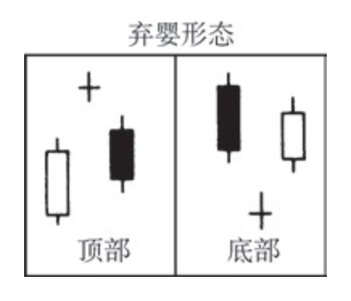

## 前方受阻形态（Advance block）

这是白色三兵形态的一种变体，其中后两兵（即后两根白色蜡烛线）显示出市场向上的驱动力正在减弱。从具体表现形式来看，其疲软性质既可能反映在长长的上影线上，也可能反映在逐步缩小的实体上。本形态标志着市场买进力量的衰退，或者卖出压力的增长。

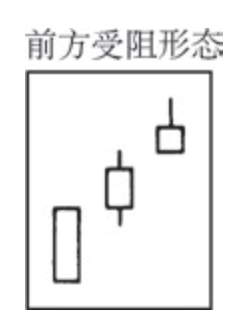

## 看跌捉腰带线（Bearish belt-hold）

参见“捉腰带线”

## 看跌吞没形态（Bearish engulfing pattern）

参见“吞没形态”

## 捉腰带线（Belt-hold line）

既有看涨的捉腰带线，也有看跌的捉腰带线。看涨捉腰带线是一根长长的白色蜡烛线，它的开市价位于它的最低点。这种形态也称作开市光（脚）大阳线。当它处于低价区时，构成看涨信号。看跌捉腰带线是一根长长的黑色蜡烛线，它的开市价位于它的最高点。本形态也称作开市光（头）大阴线。当它处于高价位时，构成看跌信号。

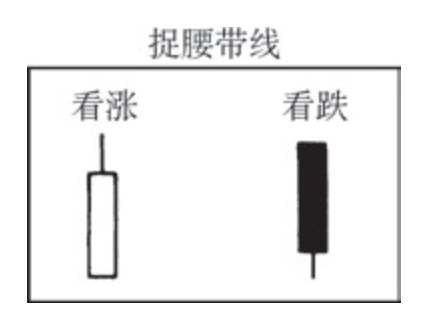

## 箱体区间（Box range）

市场处在横向交易区间中。日本术语

## 看涨捉腰带线（Bullish belt-hold）

参见条目“捉腰带线”

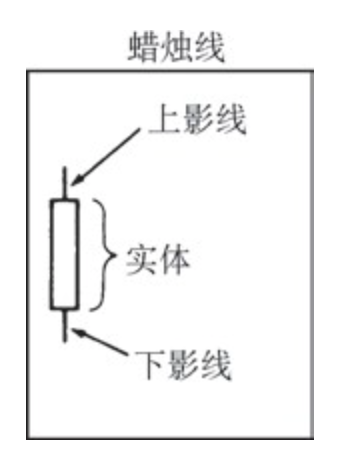

## 看涨吞没形态（Bullish engulfing pattern）

参见“吞没形态”。

## 蜡烛线与蜡烛图（Candlestick lines and charts）

在传统的日本市场图表上，其中的图线看起来像一根根蜡烛，由此得到了蜡烛线和蜡烛图的名称。蜡烛线是由实体部分和影线部分组成的。参见条目“实体”和“影线”。

## 反击（蜡烛）线（Counterattack lines）

也称“约会线”。在下降趋势（或上升趋势）中，在一根黑色蜡烛线（或白色蜡烛线）之后，市场在开市时急剧地向下跳空（或向上跳空），在收市时市场却与前一天的收市价处于同一水平，这就形成了一个反击线形态。本形态的出现，反映出牛、熊双方处于胶着状态，一时难分雌雄，说明形态出现之前的趋势力量正在衰减

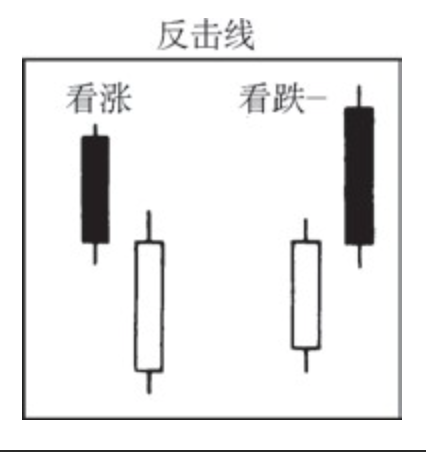

## 乌云盖顶（Dark-cloud cover）

这是一个看跌的反转信号。其形成过程是，在上升趋势中，先出现一根长长的白色蜡烛线，跟着是一根黑色蜡烛线。这根黑色蜡烛线的开市价高于前一个白色蜡烛线的最高价，它的收市价显著地向下穿入白色蜡烛线的实体内——最好达到其中线之下。与乌云盖顶对应的看涨的形态称为**刺透形态**（Piercing Pattern）。

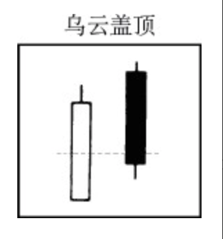

## 死亡交叉（Dead cross）

当短期移动平均线向下穿越长期移动平均线时，构成一个看跌信号，即死亡交叉信号。与死亡交叉对应的看涨信号称为黄金交叉（Golden cross）。

## 十字（蜡烛）线（Doji）

在某根蜡烛线上，开市价和收市价处于相同的水平（或几乎处于同一个水平），则构成了一根十字线。十字线具有各种形状（比如墓碑十字线、蜻蜓十字线或者长腿十字线），这取决于开市价和收市价相对于本时段整个价格范围的位置。十字线，居于最重要的单蜡烛线形态之列。同时，它也是一些重要的蜡烛图形态的一个组成部分。**北方十字线**（Northern doji）是出现在上涨行情中的十字线。**南方十字线**（Southern doji）是出现在下降行情中的十字线。

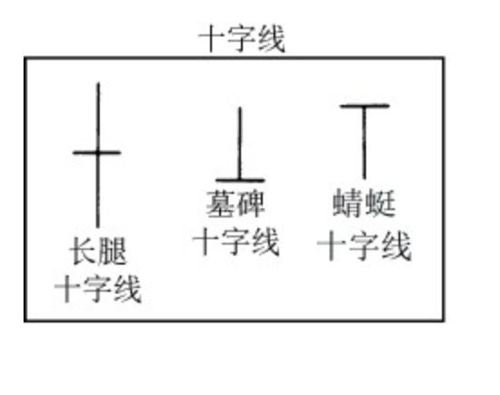

## 十字星（蜡烛）线（Doji star）

当一根十字线从前一根长长的白色蜡烛线向上跳空，或者从前一根长长的黑色蜡烛线向下跳空时，就构成了一根十字星线

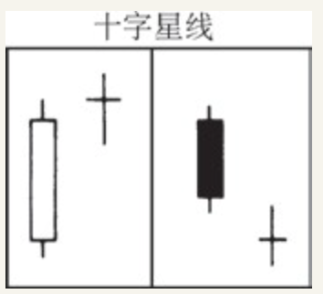

## 向下跳空并列黑白（蜡烛）线形态（Downside gaptasuki）

也称“向下跳空并列阴阳线形态”，参见“跳空并列阴阳线形态”

## 蜻蜓十字线（Dragonfly doji）

带有长长的下影线的十字线，其中开市价和收市价都处在本时段的最高点。参见十字线条目的示意图。与之对应的版本称为**墓碑十字线**（Gravestone doji）

## 圆形顶部形态（Dumpling top）

类似于西方的圆形顶部形态。在本形态中，必须出现一个向下跳空的窗口，以验证该顶部信号。与之对应的看涨的形态称为**平底锅底部形态**（Frypan bottom）。

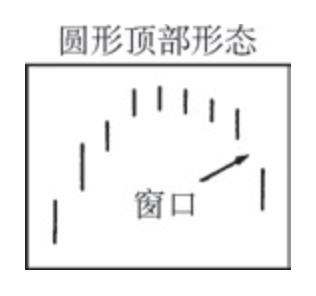

## 吞没形态（Engulfing pattern）

也称“抱线形态”。既有看涨吞没形态，也有看跌吞没形态。看涨吞没形态发生在下降趋势中，是由一根黑色的小实体与一根巨大的白色实体组成的，其中白色实体覆盖了黑色实体。看跌吞没形态（一种重要的顶部反转信号）发生在上升趋势中，此时卖出压力淹没了买进压力，反映在蜡烛图上，就是一根长长的黑色实体吞没了一根白色小实体
。

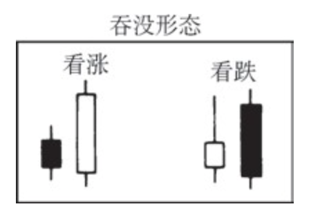

## 十字黄昏星形态（Evening doji star）

其轮廓与黄昏星形态相同，但是中间的那根蜡烛线（即其中的星线部分）是一根十字星线，而不是一个小实体。参见“黄昏星形态”

## 黄昏星形态（Evening star）

这是一类顶部反转形态，由三根蜡烛线组成。第一根是一个长长的白色实体；第二根是一个小实体（既可以为白色，也可以为黑色），并且它向上跳空，形成了一根星线；第三根是一个黑色的蜡烛线，其收市价明显地向下穿入第一根白色实体的内部。如果第二根蜡烛线为十字线，而不是纺锤线，则构成了十字黄昏星形态。与之对应的相反形态为启明星形态（Morning star）

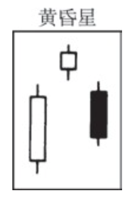

## 下降三法形态（Falling three methods）

参见“三法形态”

## 向下的窗口（Falling window）

参见“窗口”

## 平底锅底部形态（Frypan bottom）

本形态与西方的圆形底部形态相当。但是在本形态中，必须出现一个向上跳空的窗口。与之相对应的相反形态为**圆形顶部形态**（Dumpling top）

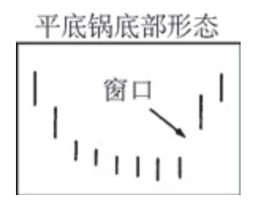

## 跳空突破形态（Gapping plays）

共有两类跳空突破形态：

1. **高价位跳空突破形态**（High-price gapping play）——市场在经过一轮急剧的上涨之后，通过一系列位于最近新高水平附近的小实体进行调整、巩固。如果价格从这个整固区域向上跳空，则构成一个高价位跳空突破形态。
2.
3. **低价位跳空突破形态**（Low-price gapping play）——市场在经历一轮急剧的下跌之后，通过一系列位于最近新低水平附近的小实体进行调整、巩固。如果价格从这个整固区域向下跳空，则构成一个卖出信号。

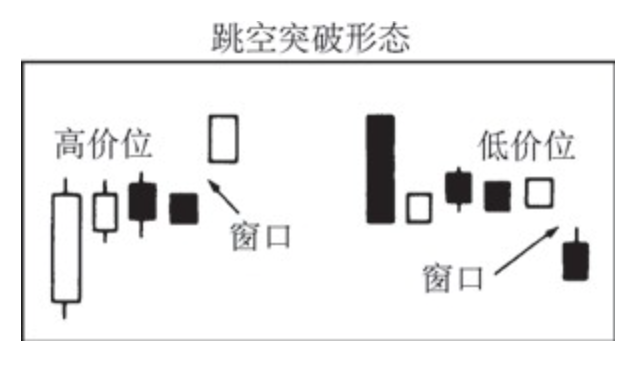

## 黄金交叉（Golden cross）

当短期移动平均线向上穿越长期移动平均线时，称为黄金交叉，构成一个看涨信号。与之对应的相反信号称为死亡交叉（Dead cross）。

## 墓碑十字线（Gravestone doji）

也称为“灵位十字线”。这是一种特别的十字线，其开市价和收市价均处于当日的最低点。本形态属于顶部反转信号。参见“十字线”的示意图。与之对应的图形称为**蜻蜓十字线**（Dragonfly doji）。

## 锤子（蜡烛）线（Hammer）

是一种重要的底部蜡烛线。锤子线与上吊线的形状是一致的，一般称为**伞形线**（Umbrella lines）。它具有一个小实体（既可以是白色的，也可以是黑色的），并且该实体位于当日价格范围的顶端；它还有一条极长的下影线，一条很短的上影线，或没有上影线。如果这种蜡烛线出现在下降趋势中，就成了一根看涨的锤子线。作为一根经典的锤子线，其下影线的长度应当至少达到其实体高度的两倍

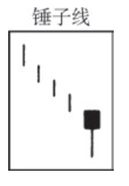

## 上吊（蜡烛）线（Hanging man）

是一种重要的顶部反转信号。上吊线与锤子线是同一个类型的蜡烛线。它具有一个小实体（既可以是白色的，也可以是黑色的），并且该实体位于当日价格范围的顶端；它还具有一条极长的下影线，一条很短的上影线，或没有上影线。但是，如果这种蜡烛线出现在上升趋势中，就成为一根看跌的上吊线。它的出现意味着市场已经变得脆弱，但是我们还需要下一时段进一步的验证信号（即之后时段的开市价低于上吊线的实体，最好其收市价低于上吊线的实体），才能得出一个顶部信号。从原则上说，上吊线的下影线的长度应当为其实体高度的2—3倍

## 孕线形态（Harami）

这是一种双蜡烛线形态，其中前一根是一个不寻常的巨大实体，后一根是一个小实体，并且小实体居于大实体内部。**孕线形态暗示市场的当前趋势已经结束，牛方和熊方目前处于休战状态**。其中小实体（即第二根蜡烛线）的颜色，既可以是白色的，也可以是黑色的。最常见的情况是，第二个实体的颜色同第一个实体的颜色相反

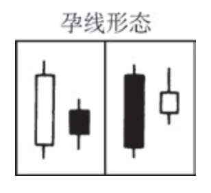

## 十字孕线形态（Harami cross）

在孕线形态中，如果第二根蜡烛线是一个十字线，而不是一个小实体，则构成了一个十字孕线形态。**这是一类重要的顶部（或底部）反转信号，特别是当该十字线跟随在一根长长的白色（或黑色）实体之后的情况**下。本形态也称为“呆滞形态（Petrifying pattern）”

## 高价位跳空突破形态（High-price gapping play）

参见条目“跳空突破形态”

## 大风大浪线（High wave）

这类蜡烛线具有非常长的上影线或下影线，以及一个短短的实体。这类蜡烛线的出现表明，市场已经丧失了在其出现之前原有的方向性基调。如果是一根十字线，而不是小实体，则成了长腿十字线

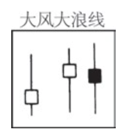

## 切入线形态（In-neck line）

在下降趋势中，在一根黑色蜡烛线之后，出现了一根白色的小蜡烛线，其收市价略微高于黑色蜡烛线的收市价，这样就形成了一个切入线形态。之后，当市场向下跌破这个白色蜡烛线的低点后，下降趋势就恢复了。请比较本形态与待入线形态、插入线形态以及刺透形态的异同

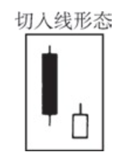

## 倒锤子（蜡烛）线（Inverted hammer）

这类蜡烛线出现在一段下降趋势之后，具有一根长长的上影线和一个小实体，并且它的小实体位于当日价格区间的下端。它应当没有下影线，或者只有十分短小的下影线。它的形状与看跌的流星线相同，但是如果它发生在下降趋势中，并且得到了后一日的验证（即后一日开市价高于倒锤子线的实体，特别是其收市价高于倒锤子线的实体），则构成了一个看涨的底部反转信号。

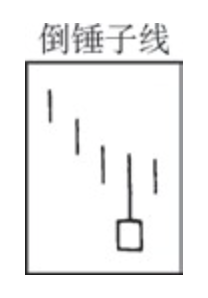

## 倒三尊形态（Inverted three Buddha pattern）

参见“三尊形态”

## 长腿十字线（Long-legged doji）

这是一根带有很长影线的十字线。如果长腿十字线的开市价和收市价位于当日价格范围的中点，就构成了一根黄包车夫线（Rickshaw man）。参见“十字线”的示意图

## 低价位跳空突破形态（Low-price gapping play）

参见“跳空突破形态”

## 下影线（Lower shadow）

参见“影线”。

## 拂晓袭击（Morning attack）

当市场开市时，有人挂出巨额的买入指令或卖出指令，企图明显移动市场的价位，日本人将这一现象称作拂晓袭击

## 十字启明星形态（Morning doji star）

其形状与启明星形态一致，除了其中间的蜡烛线是一个十字线，而不是一个小实体之外。参见“启明星形态”。

## 启明星形态（Morning star）

这是一种底部反转形态，由三根蜡烛线组成。第一根，是一个长长的黑色实体；第二根，是一个小实体（既可以是白色的，也可以是黑色的），并且它向下跳空，成为一根星线；第三根，是一根白色蜡烛线，其收市价显著地向上穿入第一根黑色实体的内部。与之对应的相反形态称为**黄昏星形态**（Evening star）。如果中间的蜡烛线（星线部分）是一根十字线，而不是纺锤线，那么本形态就成为十字启明星形态

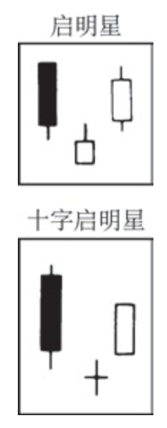

## 夜袭（Night attack）

当市场收市时，有人挂出巨额的交易指令，企图明显地影响市场价格，日本人将这一现象称作夜袭。

## 北方十字线（Northern doji）参见“十字线”

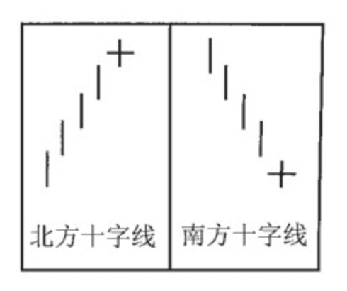

## 待入线形态（On-neck line）

在下降趋势中，首先出现一根黑色蜡烛线，后面跟着一根小的白色蜡烛线，并且其收市价接近黑色蜡烛线的最低点，这就构成了一个待入线形态。它属于看跌的持续形态。当市场向下跌破该白色蜡烛线的最低点之后，市场将继续向下运动。请比较本形态与**切入线形态**、**插入线形态**以及**刺透形态**的异同。

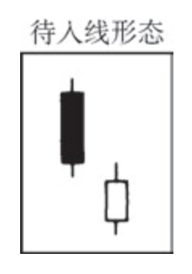

## 呆滞形态（Petrifying pattern）

这是十字孕线形态的另一种说法

## 刺透形态（Piercing pattern）

也称为“斩回线形态”，是一种底部反转信号。在下降趋势中，出现了一根长长的黑色蜡烛线。翌日，市场本来向下跳空，但是到收市时，形成的却是一根坚挺的白色蜡烛线，并且其收市价向上超越了前一根黑色蜡烛线实体的中点。请比较本形态与**待入线形态**、**切入线形态**以及**插入线形态**的异同。

## 雨滴（Rain drop）

参见“星线”

## 实体（Real body）

在蜡烛线上，通常有一段粗胖的部分，这就是蜡烛线的实体。它是通过当日的开市价和收市价定义的。如果收市价高于开市价，则实体为白色的（或者说是空心的）；如果收市价低于开市价，则实体为黑色的（或者说是涂满的）。参见“蜡烛线与蜡烛图（Candlestick lines and charts）”的示意图。

## 黄包车夫线（Rickshaw man）

参见“长腿十字线”

## 上升三法形态（Rising three methods）

参见“三法形态”

## 向上的窗口（Rising window）

参见“窗口”

## 分手线（Separating lines）

在上升趋势（或者下降趋势）中，某日市场开市于前一日的开市价的水平，收市于较高的（或者较低的）水平，并且当日蜡烛线的颜色与前一日的相反，由此就形成了一个分手线形态。在该形态出现后，之前的趋势即将恢复。

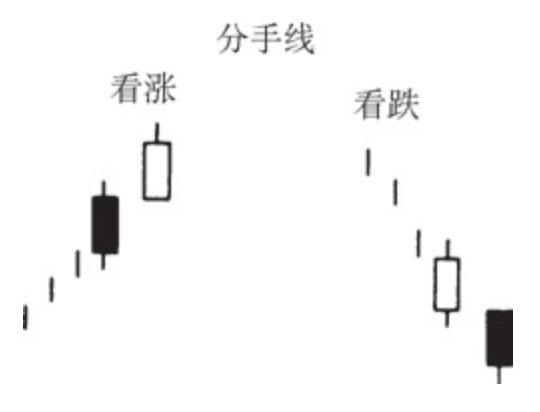

## 影线（Shadows）

在蜡烛线上，一般在其实体的上方和下方各有一个单线段，它们就是蜡烛线的影线。它们分别表示了当日的上、下极端价格。下影线是居于实体之下的影线，它的底端代表当日的最低价。上影线是位于实体上方的影线，它的顶端表示当日的最高价。参见“蜡烛线与蜡烛图”的示意图

## 光脚（Shaven bottom）

指没有下影线的蜡烛线。

## 光头（Shaven head）

指没有上影线的蜡烛线

## 流星（蜡烛）线（Shooting star）

在上升趋势中，如果一根蜡烛线具有长长的上影线；只有很短的下影线，甚至没有下影线；具有一个小实体，并且小实体居于当日价格区间的低端，就构成了一根流星线。这是一个看跌的蜡烛图信号

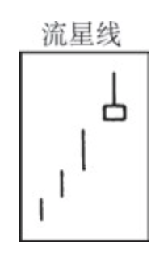

## 并列阳线（Side-by-side white lines）

也称为“并列白色蜡烛线”。本形态是由两根相邻的白色蜡烛线组成的，它们具有相同的开市价，并且它们的实体也具有差不多相同的高度。在上升趋势中，如果出现了一组向上跳空的并列阳线，则构成一个看涨的持续形态。在下降趋势中，如果出现了一组向下跳空的并列阳线，则是看跌的（尽管它们是白色蜡烛线，但它们出现在向下跳空之后）

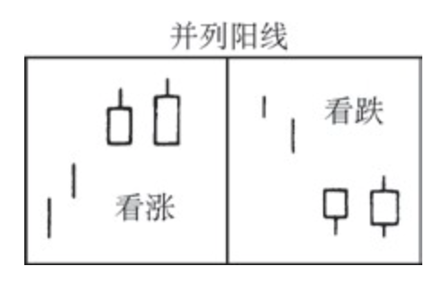

## 纺锤（蜡烛）线（Spinning tops）

指小实体的蜡烛线。

## 星（蜡烛）线（Star）

这是一根小实体的蜡烛线（即一根纺锤线），它从前一根长长的实体处向上或向下跳空。有时候，在下降趋势中，我们也将出现在一根长长的黑色蜡烛线之后的星线称作一个“雨滴”

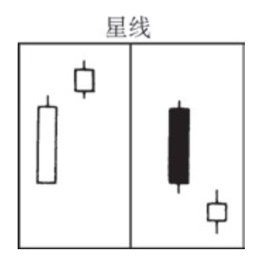

## 跳空并列阴阳线形态（Tasuki gaps）

也称“跳空并列黑白（蜡烛）线形态”。既有向上跳空的并列阴阳线形态，也有向下跳空的并列阴阳线形态。向上跳空并列阴阳线形态发生在上升趋势中，先是一根向上跳空的白色蜡烛线，然后跟着一根黑色蜡烛线，两根蜡烛线的大小差不多，并且黑色蜡烛线的开市价处于白色蜡烛线的实体之内，收市价低于白色蜡烛线的实体。黑色蜡烛线的收市价是多空双方交战的关键点。向下跳空并列阴阳线形态发生在下降趋势中，先是一根向下跳空的黑色蜡烛线，然后跟着一根白色蜡烛线，两根蜡烛线的大小差不多，并且白色蜡烛线的开市价处于黑色蜡烛线的实体之内，收市价高于黑色蜡烛线的实体。这是一种看跌的持续形态。跳空并列阴阳线形态是一种少见的形态

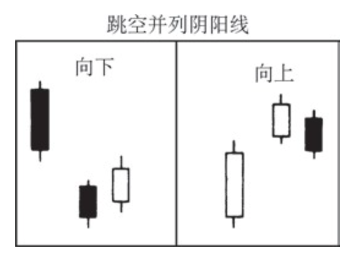

## 三尊形态（Three Buddha patterns）

三尊顶部形态与西方的头肩形顶部形态是相同的。在日本蜡烛图术语里，三尊顶部形态是三山顶部形态的一个特别的类型，因为其中间的山峰高于两侧的山峰。倒三尊形态与西方的倒头肩形形态是相同的，它是三川底部形态的一种特殊类型，因为中间的那条“河流”深于两侧的“河流”

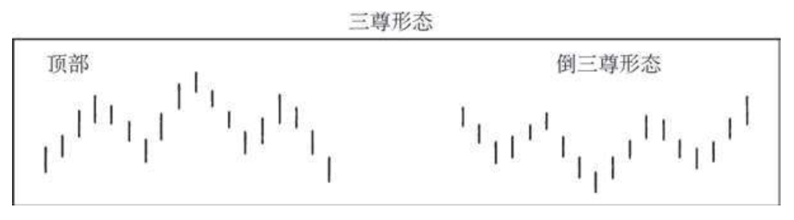

## 三只乌鸦（Three crows）

在本形态中，连续出现了三根相对较长的黑色蜡烛线，它们的收市价接近各自的最低点。如果它处于高价格水平，或者它出现在一轮拉长的上涨行情之后，则构成了顶部反转信号。

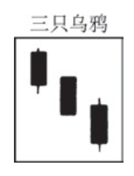

## 三法形态（Three methods）

三法形态有两个类型。一类是下降三法形态，这是一个看跌持续形态。本形态由五根蜡烛线组成。第一根是一个长长的黑色实体；接下来是三根小实体，它们通常都是白色的，并且通通局限于第一根蜡烛线的范围之内；最后是一根黑色蜡烛线，其收市价为当前行情创出了新低。另一类是上升三法形态，这是一个看涨持续形态。其中的第一根是一个长长的白色蜡烛线；接着是三根小实体，它们通常都是黑色的，并且通通局限于第一根蜡烛线的范围之内；第五根是一个坚挺的白色蜡烛线，其收市价为当前行情创出了新高。

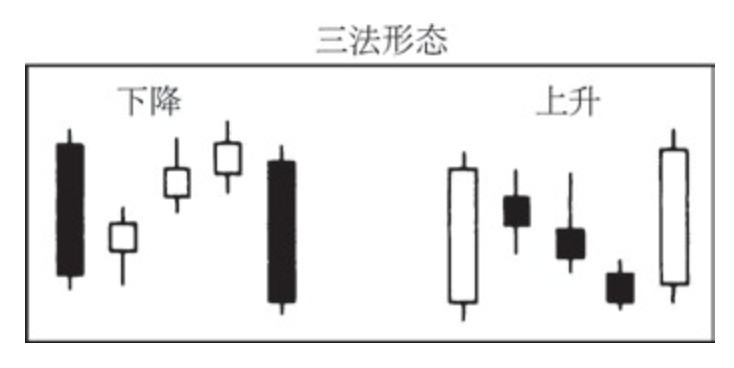

## 三山顶部形态（Three mountain top）

这是一类较长期的顶部反转形态。在这类形态的形成过程中，市场的三次上涨行情往往在同一个价格水平上，或者在其附近碰壁回落。

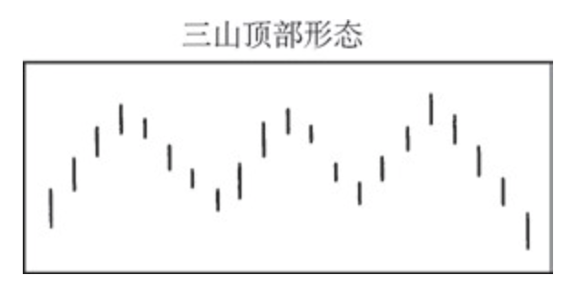

## 三川底部形态（Three river bottom）

在本形态的形成过程中，市场三次向下触及同一个底部区域

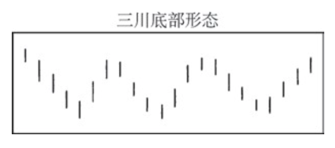

## 白色三兵形态或者白色三兵挺进形态（Three white or three advancing soldiers）

在本形态中，相继出现的三根白色蜡烛线组成一群，它们的收市价一个比一个高（并且每根蜡烛线的收市价均接近当日的最高价）。如果这样的三根白色蜡烛线出现在一个相对稳定的价格阶段之后，而且处于一个低价区，则预示着市场将进一步坚挺.

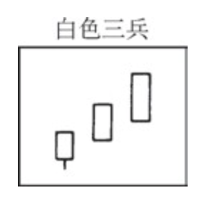

## 插入线形态（Thrusting line）

一根白色蜡烛线的收市价向上穿入了前一天黑色实体的内部，但是没有超过该实体的中点。插入线形态比切入线形态更坚挺些，但是不如刺透形态坚挺。在下降趋势中，插入线形态的出现，被视为一个看跌信号（除非在数日之内，市场接连形成了两个插入线形态）。如果本形态出现在上升市场中，则被认为是看涨的。

## 塔形形态（Towers）

既有塔形顶部形态，也有塔形底部形态。塔形顶部形态，属于顶部反转信号，其组成过程如下：先是一根或数根长长的白色蜡烛线，然后是一段整固行情，最后是一根到数根长长的黑色蜡烛线。在本形态中，整固区域两侧的蜡烛线貌似两个高塔，因此称之为塔形形态。塔形底部形态是一个底部反转形态。它的形成过程是：先是一根或数根长长的黑色蜡烛线，然后是一段水平整固行情，最后市场爆炸性地上冲，形成了一根到数根长长的白色蜡烛线。

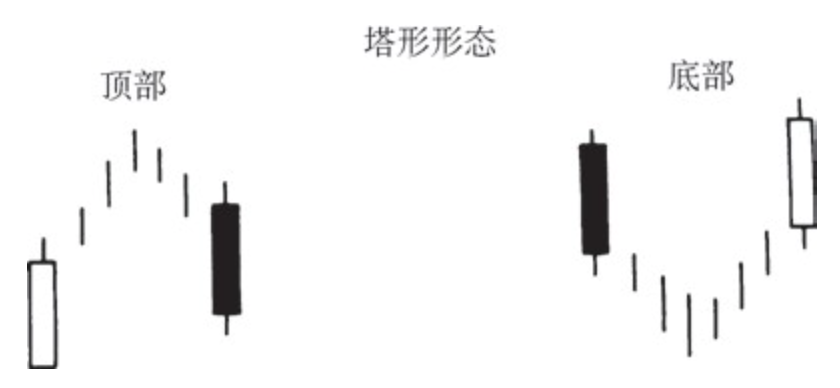

## 三星形态（Tri-star）

在本形态中，三根星线组成了一种类似于启明星形态或者黄昏星形态的构造。这是一种极为罕见的蜡烛图形态

## 平头顶部形态和平头底部形态（Tweezers top andbottom）

当市场在相邻的两个交易日，或者在数个交易日内，两度试探同一个高点或者低点的水平时，就形成了一个平头形态。这类形态本身仅属于小规模的反转信号，但是如果组成平头形态的两根蜡烛线同时还形成了其他蜡烛图指标的话，那么就增添了额外的重要性。举例来说，如果一个十字孕线形态的两根蜡烛线最高价处于相同的水平，那么这两根蜡烛线一举形成了两个蜡烛图形态：一个平头顶部形态和一个十字孕线形态。由此看来，这可能是一个更重要的顶部反转信号。

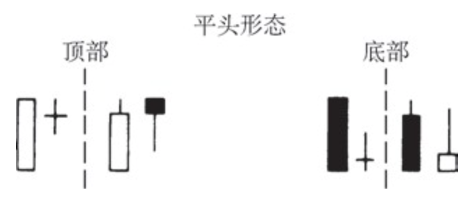

## 伞形线（Umbrella lines）

锤子线和上吊线共有的名称。伞形线名副其实，蜡烛线的轮廓像一把伞，因为它具有长长的下影线、小实体，并且小实体位于或者接近本时段交易范围的最高处。

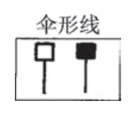

## 上影线（Upper shadow）

参见“影线”。

## 向上跳空并列阴阳线形态（Upside gap tasuki）

也称为“向上跳空并列黑白（蜡烛）线形态”，参见“跳空并列阴阳线形态”

## 向上跳空两只乌鸦（Upside gap two crows）

这是一种三蜡烛线形态。第一根，是一个长长的白色蜡烛线；第二根，是一个从白色蜡烛线的实体处向上跳空的黑色实体；第三根，也是一个黑色实体，其开市价高于第二根蜡烛线的开市价，并且收市价低于第二根蜡烛线的收市价。本形态很罕见。

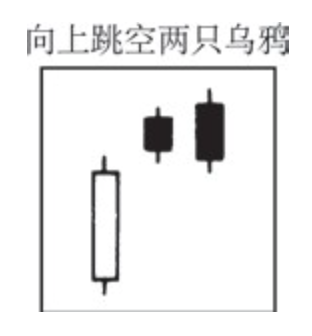

## 窗口（Window）

本形态与西方的价格跳空是一回事。窗口属于持续形态。在上涨过程中，如果市场打开了一个向上的窗口，那么这是一个看涨的信号。该窗口将构成一个支撑区域。如果窗口发生在一轮抛售行情中，那么这是一个向下的窗口，属于看跌的信号。该窗口将构成一个阻挡区域

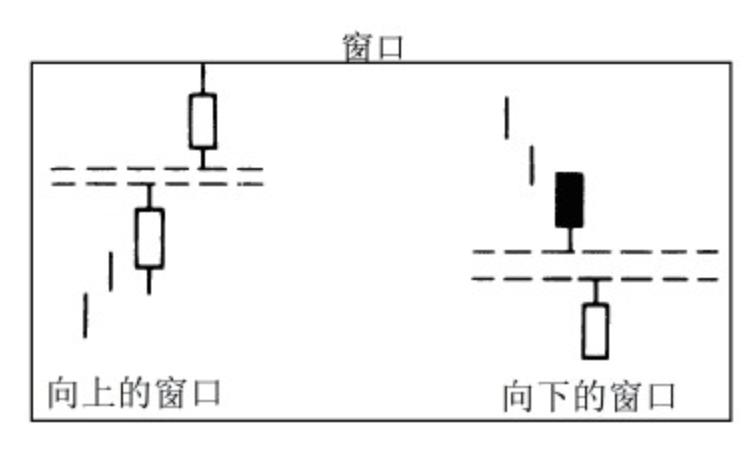

## 阴线和阳线（Yin and yang）

这是黑色蜡烛线（阴线）和白色蜡烛线（阳线）在中文里的名称。
