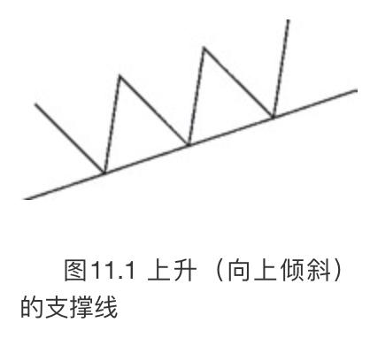
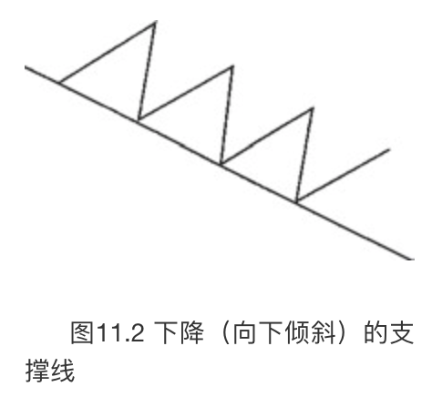
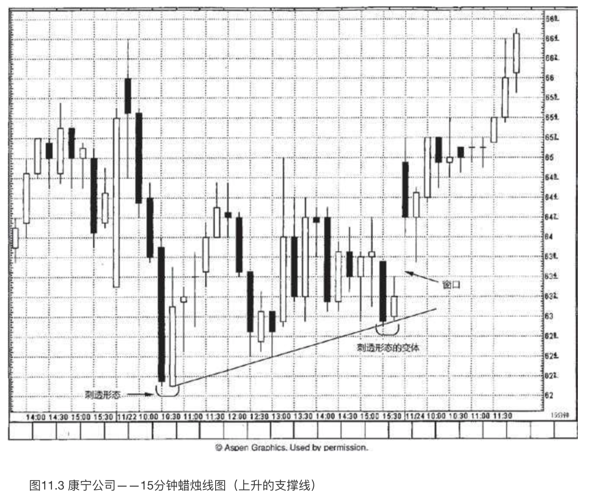
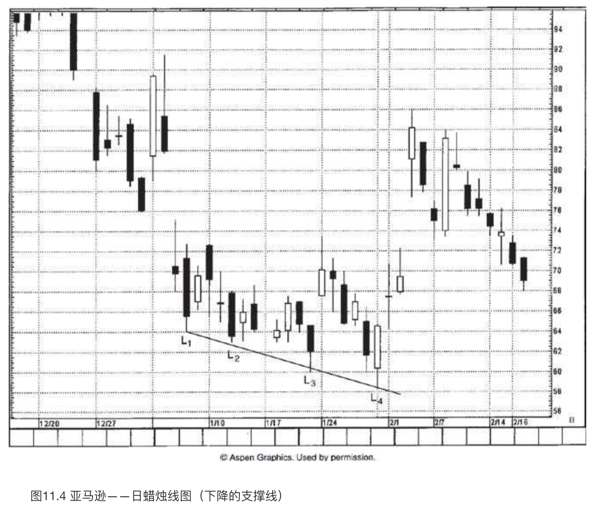
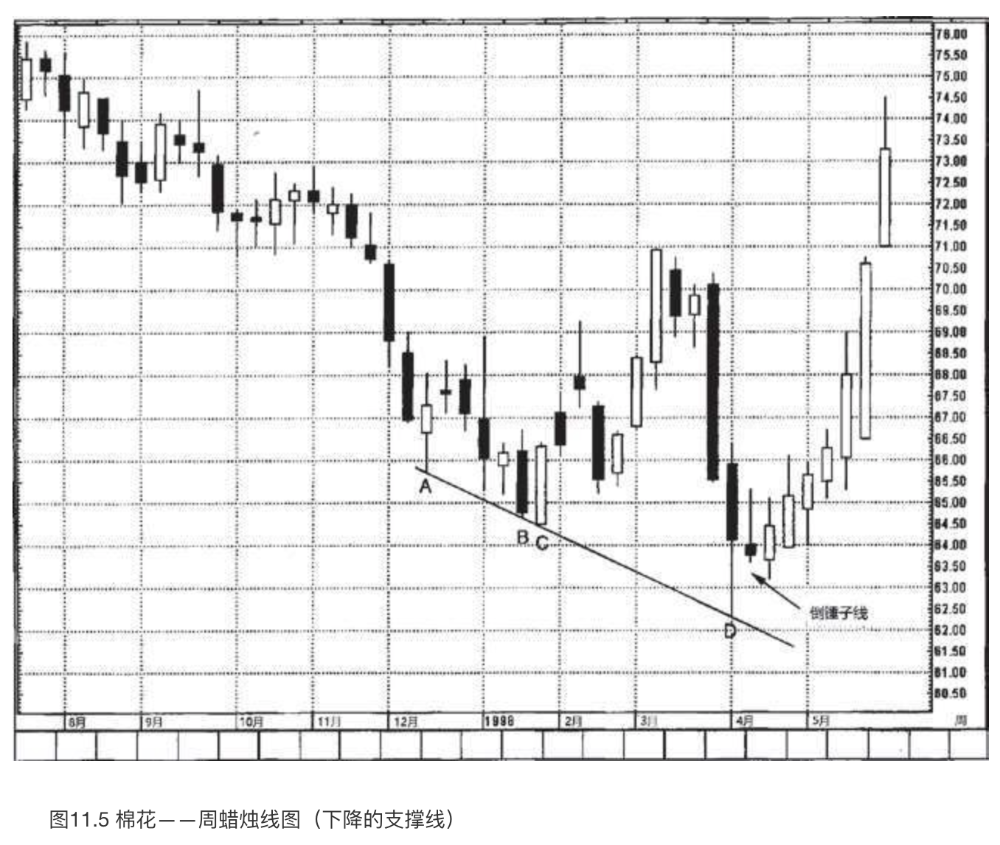
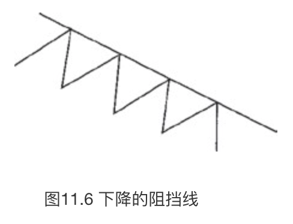
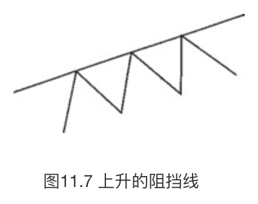
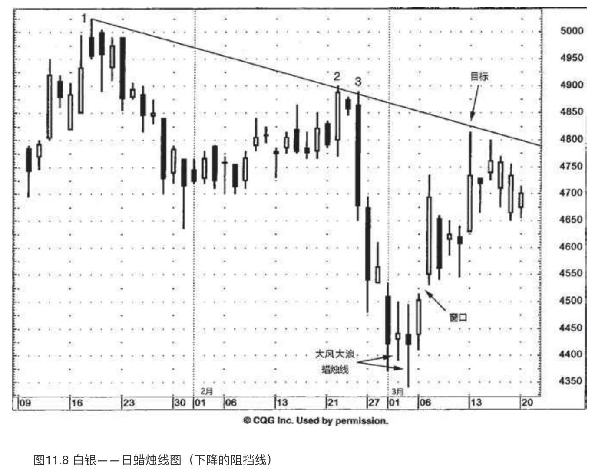
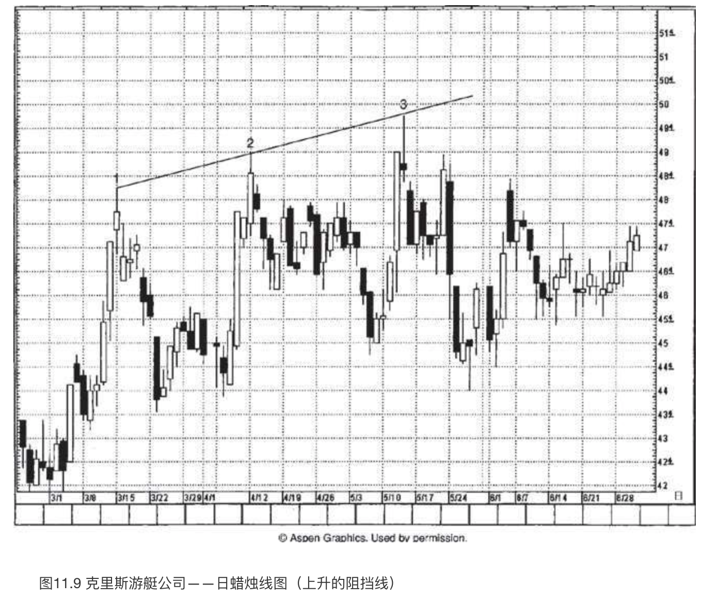
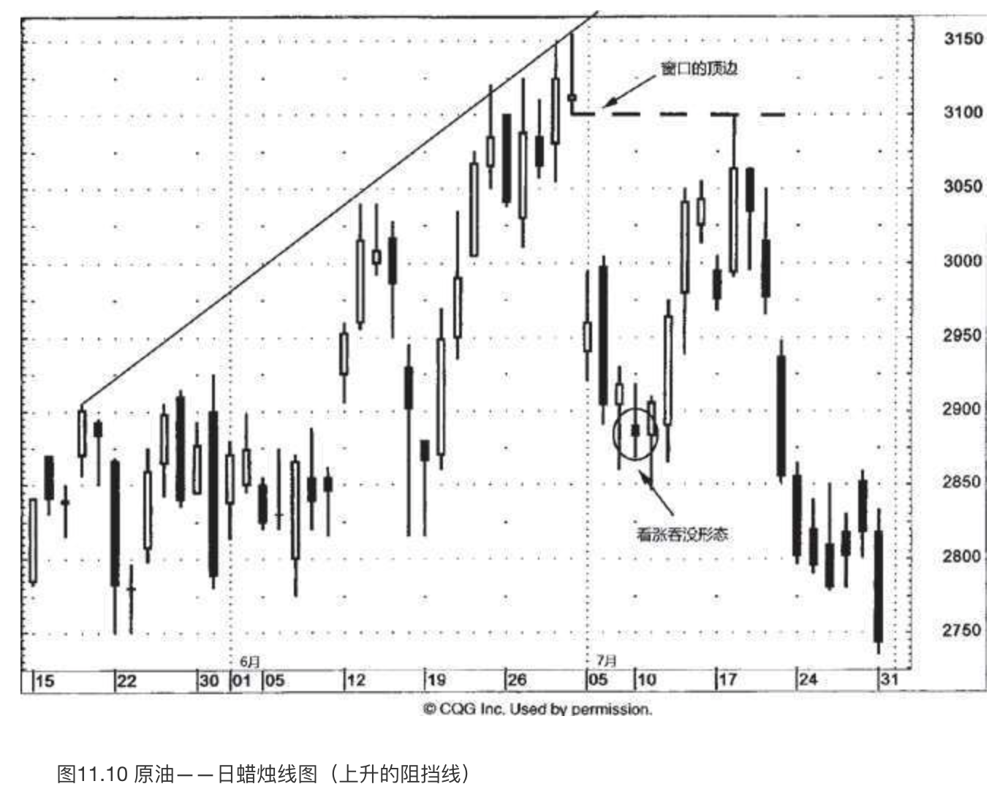

# 蜡烛图与趋势线

`“有备而无患”`

本章将把蜡烛图技术与**趋势线**、**市场对趋势线的突破**和**假突破**，以及**突破支撑区域**和**阻挡区域**等方面放到一起，进行综合研究。

## 向上倾斜的支撑线

如图11.1所示，是一条**向上倾斜的支撑线**。**至少需要两个向上反弹的低点才能连接出这样一条直线，如果通过三个或者更多向上反弹的低点，那就更好**。在蜡烛图上绘制上升的支撑线时，把蜡烛线下影线的低点作为连接点。这根支撑线表明，在这段时间里，**买方比卖方更为主动、积极，因为在逐渐提升的新低点处，还能够引来新的需求**。一般说来，这根线标志着市场上买方多于卖方。既然每一笔交易都同时需要一位买方和一位卖方，我更愿意认为，不是买方比卖方多，而是买方比卖方更为积极进取。

如图11.2所示，是一根向下倾斜的支撑线。正如在讨论图11.1时所说的，传统的支撑线是通过连接越来越高的低点得来的。不过，图11.2中的支撑线连接的则是越来越低的低点。下降的支撑线之所以有用武之地，是因为在市场上发生了许多实例，其价格是从下降的直线处向上反弹的。在缺少其他关于支撑水平的线索时，这样的直线给我们提供了潜在的支撑区域。**在什么样的情形下不存在明显的支撑水平呢？当市场为当前行情创新低，特别是创纪录的新低的时候。**

常规的上升支撑线因为向上倾斜，被视为具有看涨意义。**下降的支撑线因为市场正在创造更低的低点，可被当作具有看跌意义的支撑线**。如此一来，从这类支撑线上引发的向上反弹可能只是有限幅度的、不持久的。虽然如此，它可能构成了考虑买进的区域，特别是在若干技术指标在这类直线上汇聚起来的时候。

在图11.3中，11月22日的早晨出现了一个**刺透形态**。从这个**刺透形态**开始出现了一轮小规模的上涨行情，之后在12:30-13:00左右，市场回落到了62.50美元的区域。连接**刺透形态**的低点与几个小时后形成的接近62.50美元的低点，我们得到了一条上升的支撑线。这根线与11月22日晚间的某个时段相交，在相交处我们看到了一个**刺透形态**的变体（之所以说它是变体，是因为其中的白色蜡烛线的收市价没有向上超越之前黑色蜡烛线的中点）。本例说明，即便蜡烛图形态不太理想，但它依然可能提供行情反转信号。具体来说，虽然这不是一个理想的**刺透形态**，但是它来自那条上升的支撑线，因此其重要性得到了加持。对于多头已经控制市场，马上出现了进一步的增强信号，一个向上的窗口成功地测试了这条支撑线。该窗口在11月24日早间成为支撑区域。

在图11.4中，整个1月，根据图中一系列更低的低点来评估，亚马逊始终处在下降趋势中。连接低点L1和L2，提供了一条尝试性的支撑线。在L3处，当市场防守成功后，这条下降的支撑线的重要性得到了确认。于L4的低点处，市场对这条向下倾斜的支撑线试探成功了，并且形成了一个看涨的**刺透形态**。从本**刺透形态**开始的上冲行情在2月2日和3日之间打开了一个向上的窗口。一方面，在2月9日长长的白色蜡烛线之前，窗口的底边作为支撑水平保持完好；另一方面，在2月9日长长的白色蜡烛线之后，当前上冲行情遭遇了一根十字线（它也是一根流星线），被短路了。

如图11.5所示，通过A和B两处的低点连接成一条下降的支撑线，再加上C处的看涨吞没形态的低点。对该直线最终的试探来自D处，之后跟着出现了一根倒锤子线。倒锤子线的后一天是一根白色蜡烛线，两者组成了一个看涨吞没形态。事实上，如果看涨吞没形态的白色蜡烛线的收市价更高一些，就会形成一个**启明星形态**。尽管如此，由于**倒锤子线**、**看涨吞没形态**，以及下降的支撑线汇聚在一起，宛如一声“空头平仓！”的大吼。

## 下降的阻挡线

图11.6展示了一条典型的**下降的阻挡线**。至少需要两个向下反弹的高点才能连接出这样一条直线。当然，如果有三个或更多个高点，直线就更有影响力。它表示卖方比买方更为积极进取，因为卖方愿意在更低的高点上卖出。这条阻挡线表明，在这段时间中，**卖方比买方更为大胆、积极，因为在逐渐降低的新高点处，依然吸引了卖方的卖出意愿**。这根直线反映出市场正处于下降趋势中。在蜡烛图上绘制阻挡线时，方法是连接蜡烛线上影线的顶点。

常规的阻挡线是由一系列越来越低的高点连接而成的。但是，如果市场正处在历史的新高位置，不存在更早的高点可用来连成潜在的阻挡线，那怎么办呢？在这种情况下，我常常绘制上升的阻挡线。如图11.7所示，这是连接一系列更高的高点得来的（不同于下降的阻挡线通过连接更低的高点得来）。

在图11.8中，我们连接区域1、2和3，得到了一条经典的阻挡线。白银从区域2的孕线形态开始形成一轮下降行情，下降行情的底部形成了两根大风大浪蜡烛线。这是第一个征兆，表明市场向下的力量正在消散。在3月6日和7日之间，打开了一个向上的窗口，驱使趋势转而向上。窗口立即转化为支撑区域，随后几天的变化证明了这一点。

现在，蜡烛图上已经出现了反转信号，我们可以转向西方技术分析——这条阻挡线，来寻求价格目标。这构成了潜在的阻挡区域，3月13日所在的一周，市场陷于停顿，正说明了这一点。本图强调了我们离不开西方技术分析工具的原因，哪怕我们的注意力依然主要放在蜡烛图分析上。蜡烛图能够给出早期的反转信号，而西方工具能够提供价格目标和止损区域。

在图11.9中，4月12日（在2处）有一根长长的白色蜡烛线，其收市价创了新高，从而维持了多头趋势的力道。次日，一根小黑色实体成为组成2处的孕线形态的第二根蜡烛线，因而整个市场的基调都发生了转变。连接1和2两处的高点，得到了一条上升的阻挡线。该线5月中旬时在50美元左右与行情发生接触。接触点在区域3处，接近50美元的水平，另一个孕线形态与上升的阻挡线接触。（事实上，5月13日的上影线向上超过了前一天的价格区间，但是这一点并不否定此处的孕线形态，因为孕线形态只讲究实体的部分。）于是，蜡烛线为我们提供额外的证据（通过这个孕线形态和孕线形态第二根蜡烛线的长上影线），表明这条上升的阻挡线可能成为阻挡区域，即将发生防守性的行情。

看看图11.10，其中有一根向上倾斜的阻挡线。从5月中旬开始的价格变化表现为一系列越来越高的高点。然而，6月30日若干技术因素汇聚起来，在上升的阻挡线处，形成了一根近似十字线的蜡烛线（它同时组成了一个十字孕线形态），发出信号指示多头采取保护措施。请注意，在近似十字线的蜡烛线的后一天，在31美元和30美元之间打开了一个巨大的向下的窗口。市场持续下跌，直到7月初找到支撑区域才罢休。从该支撑区域而来的上涨行情杀了一个回马枪，到达上述窗口的顶边。

## 破低反涨形态与破高反跌形态
