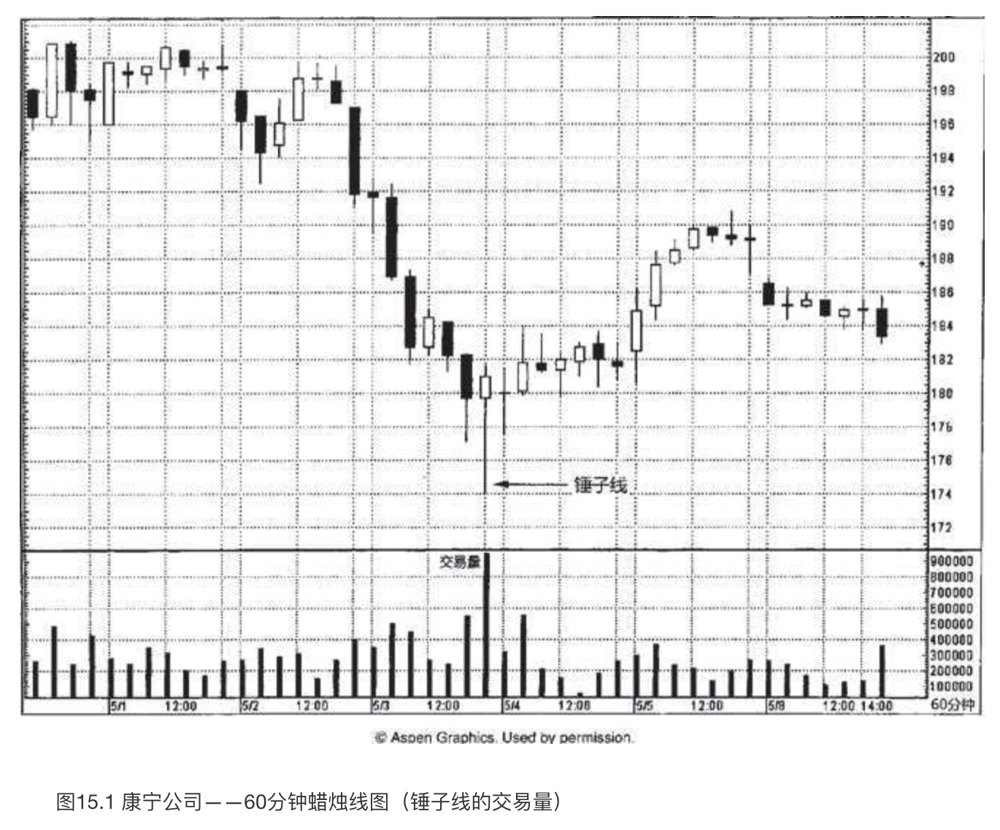
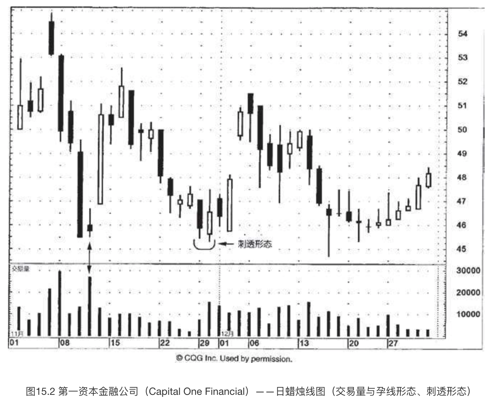
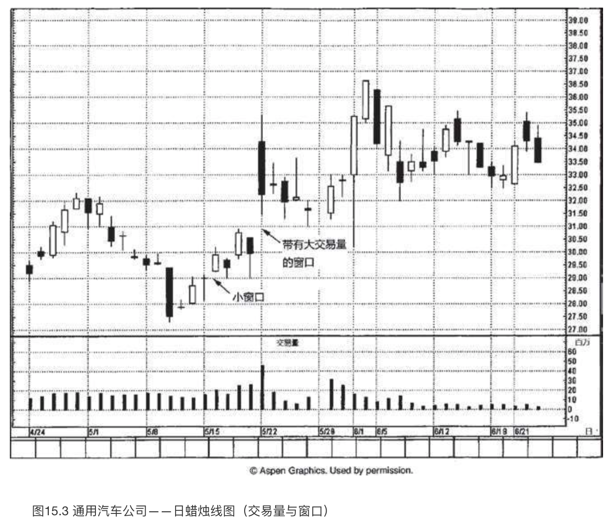
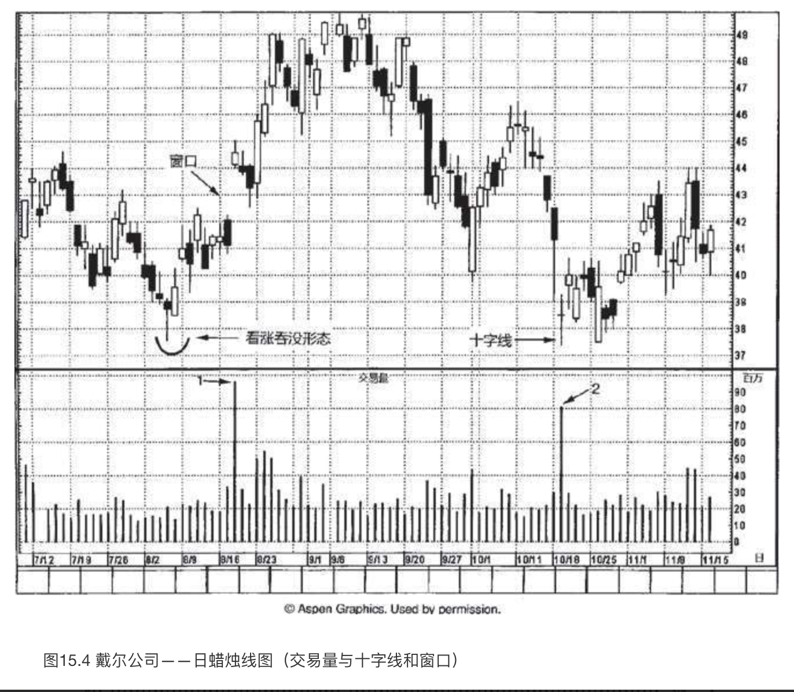
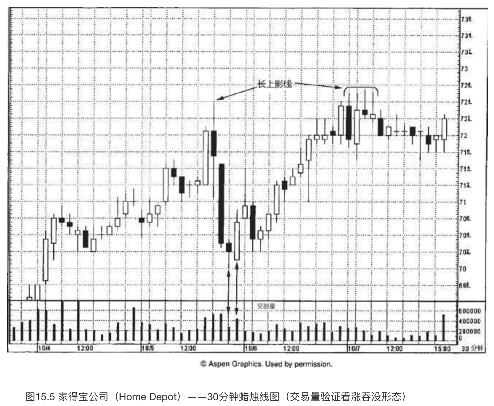
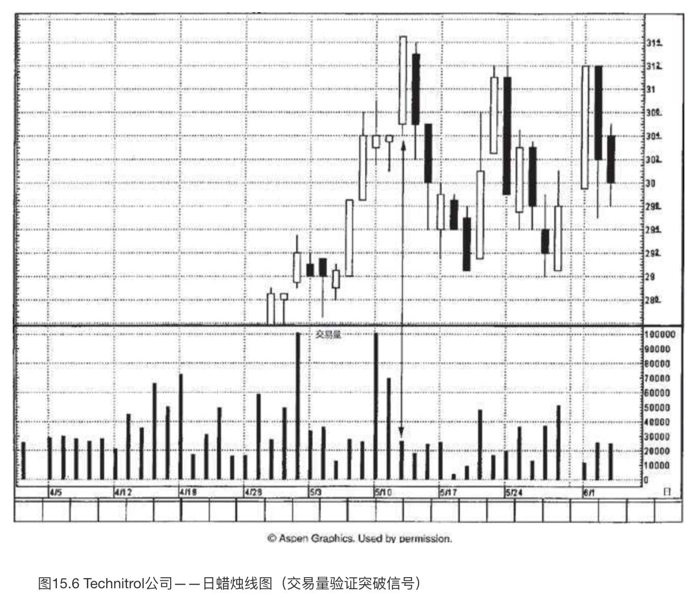

# 蜡烛图与交易量

`“一根筷子容易折，一把筷子难折断”`

交易量是市场发出的最重要的行情线索之一。**交易量就像自来水管里的水压。水压越大，则水流越有力量**。相应地，一段行情的交易量越大，则这段行情背后的市场力量越强大。

只要交易量按照趋势方向保持增长的态势，那么当前的价格趋势就将以更大的可能性持续下去。但是，如果在价格趋势发展时，交易量不增反降，那么判断当前趋势仍将继续发展的理由就不充分了。另外，我们还可以**通过交易量来验证市场的顶部或底部过程**。

本章并不探讨具体的交易量度量工具，例如权衡交易量、持仓量等。不过，无论您采取哪一种形式的交易量分析工具，都有助于提升蜡烛图技术的有效性。

在我的讲座中，听众经常问起将交易量与蜡烛图结合起来的一种绘图方法，即按照交易量的大小改变蜡烛线实体的宽度。也就是说，交易量越大，则蜡烛线实体的宽度越大。我个人的看法是，按照常规方法来查阅交易量同样简便易行——在常规图表中，交易量以竖直线段单独绘制在图表底部。按照交易量调整蜡烛线实体的宽度有其不利之处，假如一时间出现了许多个交易量较大的时段，那么电脑屏幕上就绘制不了太多的蜡烛线了。交易量的确十分重要，但是采用何种方式来显示它并不重要，重要的是，只要能够得到交易量数据，就一定要把它包括在我们的分析中。

因为不同市场的交易量数值各有其特点，差异较大，我们不采用绝对的交易量数值，而是采用相对的交易量。换句话说，在某只股票上，一个时段内成交5万股可能是一个不同寻常的超大交易量——与此同时，在另一只股票上，一个时段内成交1000万股可能还是较轻的交易量。如此一来，不论在哪个市场，我们观察的都是交易量的相对增减，尤其是交易量井喷的情况。

## 巨大交易量的十字线或纺锤线

在图15.1中，5月3日晚间该股票的交易量发生了井喷现象。我们看到，相比之前的各个时段，这一时段的交易量之大超乎寻常。如此一来，我们就应当对它多加小心了。这个时段不仅交易量异常大，而且是一根锤子线。这种情况我们喜闻乐见——**交易量验证了价格变化**。

本图还引出了另一个方面。如果锤子线带有非常长的下影线，就意味着等到锤子线完成时（我们需要等到收市时才能确定锤子线已经形成），市场已经处在远离低点的位置了。遇到这样的锤子线，如果在收市时买进，其风险与报偿之比或许并不具有吸引力，因为市场可能一波三折，再次回落到锤子线的低点，然后才恢复上升的征途。不过正如本图所示，**一根带有巨额交易量的锤子线，降低了市场回落到锤子线低点的可能性**。*因此，如果锤子线带有异常高的交易量，那么我们的态度可以更积极，更愿意在收市时买进；相比之下，如果锤子线的交易量没有发出相同力度的验证信号，那么我们的态度可能更为保守，倾向于等待更好的机会。*

在图15.2中，11月初出现了一轮自由落体般的俯冲下跌行情，由一群长黑色实体构成，它们触目惊心，在图形上大大助长了空头的气势。11月11日，单枪匹马的一个交易日，如中流砥柱一般，扭转了技术图像的乾坤。这一天属于**纺锤线**，*它同时作为***孕线形态***的第二根蜡烛线完成了形态*。然而，**真正带来巨大影响力的是纺锤线这一天的超级交易量**。*这就表明了，尽管此处供给量极大（从当天的巨额交易量可以得知当天的供给量极大），但是需求量与之不相上下，足以抵挡空方气势汹汹的打压——因此，形成了当天的小实体。*

市场从该孕线形态开始上冲。11月下旬，又是一轮抛售行情。11月底，遇到一个**刺透形态**，行情稳定下来。在看涨的**刺透形态**中，我们一般预期其中黑色蜡烛线的交易量较轻，而白色蜡烛线的交易量较重。*这样有助于加强其技术意义，即空头已经失去力量，而多头已经站稳了脚跟*。在本图中，第一资本金融公司上演的正是这一出戏码，*黑色蜡烛线交易量较小，白色蜡烛线交易量较大*。这样的交易量格局**进一步增强了刺透形态作为支撑水平的成功概率**。在本例中，12月15日的锤子线表明，本**刺透形态**的支撑作用得到了坚强的捍卫。

**交易量可以用来验证蜡烛图形态，这个概念适用于任何蜡烛图信号**。举例来说，这一点意味着**在看跌吞没形态中，第一根蜡烛线（白色的）应当具有较小的交易量，而第二根蜡烛线（黑色的）应当具有较大的交易量，这样的交易量分布加重了看跌吞没形态的技术意义。**

如果将交易量分析添加到向下的窗口或向上的窗口，那简直是“如虎添翼”。在图15.3中，在5月8日所在的一周里，市场形成了一个看涨的**十字孕线形态**。几天之后，在5月13日和15日之间打开了一个小小的向上的窗口。这个微不足道的小窗口在5月15日所在的一周里始终发挥了支撑作用。5月22日，打开了一个放大了的向上的窗口。这个窗口还得到了进一步的看涨助力，即，它带有格外重大的交易量。向上的窗口被看作潜在的支撑区域，而**巨大的交易量则提升了它作为支撑区域的有效性**（或者**在向下的窗口的情况下，提升了窗口作为阻挡区域的有效性**）。6月1日，一根看涨的长下影线确认了多头的力量，股票的收市价维持在30美元的支撑水平之上（这个支撑水平是根据5月22日的窗口的底边来确定的）。

小实体的出现可能是一条有用的线索，表明下跌行情或上涨行情或许已经是强弩之末。如果我们把交易量分析添加到小实体方面，就能得到更扎实的反转信号。让我们看一看图15.4，体会其中的缘故。在本图中，戴尔公司在8月18日交易量巨大，我们用“1”做了标记。另外，这一天还形成了一个向上的窗口。正如我们在图15.3中所介绍的，带有大额交易量的向上的窗口应当成为坚实的支撑区域。这正是戴尔公司在窗口之后的几天里所表现的情形。

10月19日，发生了另一个超大交易量的时段（图上用“2”做了标记）。这一天还是一根**十字线**。**这根大交易量的十字线很有意义，因为它出现在一轮陡峭的下跌行情之后，这轮行情将戴尔带到了由8月初的看涨吞没形态（其中第一根蜡烛线是锤子线）所形成的支撑水平**。在第八章曾经讨论过，我们对下降行情中的十字线通常不像对上涨行情中的十字线那么在意。*然而，因为这根十字线与支撑区域发生了协同作用，又带有巨大交易量*，见到它，我肯定是坐不住的，必然会盯住它。这是一根巨额交易量的十字线，**一方面，它揭示了此处曾经涌出沉重的供给压力（通过巨额交易量可以证明这一点）；另一方面，该股票在这里形成的是一根十字线，也就证明了此处的需求压力毫不逊色，也强大到足以吸纳所有的供给**。于是，在10月19日，我们得到了相互验证的数个技术要素，突出地显示了37.25美元支撑水平的重要作用：

1. 由8月的看涨吞没形态形成的支撑水平；
2. 十字线；
3. 十字线当天放大的交易量，表明全部沉重抛压都已经被吸纳。

请注意，在十字线之后的一周里，市场用一根高高的白色蜡烛线再次成功地守护了这个支撑水平。

## 小结

**发生在下降行情中的十字线，如果带有巨大交易量，那么与常规交易量的十字线相比，能增加市场反转的机会**。在这种情况下，即使不是**十字线**，而是一根**小实体**，上述理论也依然是成立的。（我们在图15.2中曾经领教了巨额交易量的纺锤线的厉害。）我们用下列几点来为带有巨大交易量的纺锤线或十字线做一个小结:

1. **在过度延伸的上涨行情之后，如果出现了一根带有不寻常的巨大交易量的十字线或纺锤线，则表明多头的驱动力被足够强大的供给所压制，上涨行情已经陷入停顿。这可能构成顶部反转。**
2. **在陡峭的下降行情中，如果出现了一根带有超大交易量的十字线或纺锤线，则显示沉重的卖压已经被分庭抗礼的积极买压所抵消。**

**无论是单根蜡烛线构成的反转信号，还是由一群蜡烛线构成的反转信号，只要交易量配合，从而验证了蜡烛图信号，那么蜡烛图信号促成市场反转的机会便得到了加持**。图15.5展示了一例**看涨吞没形态**，发生在10月5日晚间。该看涨吞没形态的前一个时段是一根纺锤线，透露出之前的下降行情失去了一些势头。该形态的第二个时段是一根长白色蜡烛线，表明多头已经夺得主宰权。不仅如此，在本**看涨吞没形态**中，**前一根纺锤线交易量较轻，后一根长白色蜡烛线交易量较重，这就加大了本形态看多的马力**。*交易量和看涨吞没形态相互验证、相互加强，因此增加了此处发生市场反转的可能性*。从该**看涨吞没形态**开始，市场上升。直至10月7日，在72.50美元附近，上升行情遇到了一个**看跌吞没形态**，以及一连串带有疲软的上影线的蜡烛线，才就此止步不前。这里还验证了之前的长上影线所形成的阻挡作用，该长上影线的高点位于同一个水平。

**作为一条普遍性的经验法则，我们可以认为白色蜡烛线的实体越长，则上冲行情持续的可能性越大。但是，交易量给上述法则增添了另一个重要的维度**。如图15.6所示，5月12日是一根超长的白色蜡烛线，将股票推上了新高水平。然而，虽然蜡烛线表现得牛气十足，但是其交易量太轻，将它的牛气打了折扣。当市场创新高的时候，我们更乐于看到交易量放大，从而验证价格变化。在本例中，交易量与突破信号背道而驰。虽然在市场向上突破时，仅凭缺少交易量这一条并不足以说服我们从看多转向看空，但是它足以构成理由令我们多加小心。这是因为以这样的**低交易量形成的上冲行情很可能后继乏力**。正因为交易量的缘故，这种前景发生的可能性增加了。就本股票来说，在5月12日的长白色蜡烛线之后紧随着一根长黑色蜡烛线，进一步增强了我们对多头控制力不足的判断。

