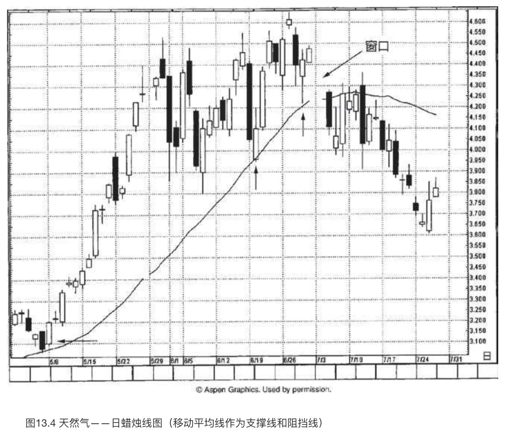

# 蜡烛图与移动平均线

`“十个人十个口味”`

移动平均线是最早采用的，也是最流行的技术分析工具之一。这种工具的长处就在于它构成了一套追踪趋势的机制，使得技术分析者有能力捕获主要的市场运动。因此，**当市场处在明显的趋势状态下，这种工具最能发挥效能**。

## 简单移动平均线

名副其实，最基本的移动平均线是所谓的**简单移动平均线**。计算出有关价格数据的算术平均值，就得到了这样的平均线。举例来说，假定某股票最近的5个收市价格分别为38美元、41美元、36美元、41美元、38美元，那么，上述收市价的5日移动平均值就是：

其一般公式为：

其中 **P1=最近的收市价；**

**P2=最近的收市价的前一个收市价**，余者依此类推；

**n=移动平均的数据点数。**

在“移动平均线”的术语中，“移动”的意思是，当我们计算新的平均值时，一般先从前一个移动平均值中减去最早的那个价格数据，然后再把最新的价格数据加到这个数值上。如此一来，随着新的数据不断加入，平均值也就向前移动了。

从上述关于简单移动平均线的例子中我们可以看到，每一天的股票价格在总的移动平均值中占有1／5的份额（因为这是5天移动平均线的例子）。在9天移动平均值中，每一天的价格在总的移动平均值中仅占1／9的份额。由此可见，**移动平均线的时间参数越大，则单个的价格数据对平均值的影响就越小**。

**移动平均线的时间参数越短，则移动平均线越是“贴近”价格图线。这类平均线对当前的价格变化更为敏感**，从这个意义说，这是其有利的一面。它也有不利的一面，那就是引发“拉锯现象”的可能性也同时加大了。**长期的移动平均线提供了较强的平滑效果，但是它们对当前的价格变化较为迟钝。**

在比较流行的移动平均线中，包括5天、9天、30天、50天等移动平均线。可能适用范围最广泛的是200天移动平均线。

使用移动平均线的市场参与者范围极广，其中既有日内交易商，也有保值交易商。前者对实时的交易数据应用移动平均线方法，而后者眼里的移动平均线可能是按月乃至按年来计算的。

在移动平均线的研究方法中，除了选择不同的时间参数之外，还有可能选择不同的价格数据来计算平均值。正如我们在前面的例子中所介绍的，绝大多数移动平均线系统采用收市价格进行计算。不过，利用最高价、最低价，以及最高价与最低价之间的中间价来计算移动平均线的也大有人在。有时候，人们甚至用上了移动平均线的移动平均线。

## 加权移动平均线

在**加权移动平均线**的计算方法中，先对每一个有关的价格数据分配一个不同的权重，再计算它们的平均值。几乎所有的加权移动平均线都属于前沿加重的方式。这就是说，最近价格数据的权重显著大于先前价格数据的权重。分配权重的具体做法，取决于研究者的个人偏好。

## 指数加权移动平均线

**指数加权移动平均线**是一种特殊的加权移动平均线。与一般的加权移动平均线一样，指数加权移动平均线也采取前沿加重的方式。不过，与其他的移动平均方法不同的是，在指数加权移动平均值的计算方法中，包括的不是一段数据，而是所有的历史数据。在这种移动平均方法中，对过去的价格数据分配了逐步减少的权重。每一个价格数据的权重都比后来的一个价格数据的权重按照指数形式递减，因此，我们称之为指数加权移动平均线。

指数加权移动平均线最常见的用处之一，是应用在MACD方法（移动平均线相互验证或相互背离交易法）中。我们在第十四章再探讨MACD方法。

## 移动平均线的用法

**移动平均线**能为我们提供客观的交易策略，其中包括界定明确的交易规则。许多计算机化的技术分析交易系统主要构建在移动平均线的基础之上。怎样应用移动平均线呢？这个问题的答案多种多样，不同的交易风格和交易哲学就有不同的取舍。以下，我们列出了移动平均线的一些常见的用法。

1. **通过比较价格与移动平均线的相对位置，构成一个趋势指标**。举例来说，如果我们判断市场正处于中线的上升趋势中，那么一个很好的衡量标准就是，价格必须居于65天移动平均线的上方。而对更长期的上升趋势来说，价格必须高于40周移动平均线。
2. **利用移动平均线构成支撑水平或阻挡水平**。当收市价向上超越某一条特定的移动平均线时，可能是看涨的信号；而当收市价向下低于某个移动平均线时，构成看跌的信号。
3. **跟踪移动平均线波幅带**（也称为包络线）。这些波幅带是将移动平均线向上或向下平移一定的百分比后形成的，它们也起到支撑或阻挡作用。
4. **观察移动平均线的斜率**。举例来讲，如果移动平均线在一段持续稳步的上升之后转向水平发展，乃至开始下降，那么可能构成了一个看跌信号。在移动平均线上做趋势线，是监测其斜率变化的一个简单易行的办法。
5. **利用双移动平均线系统来交易**。我们可以把一条短期移动平均线和一条长期移动平均线相互比较，通过观察短期移动平均线与长期移动平均线的交叉，获得交易信号。如果短期的移动平均线向下穿越了长期移动平均线，可能就是趋势向下变化的信号。在日本，这样的移动平均线交叉信号称为“**死亡交叉**”。如果短期的移动平均线向上穿越了长期移动平均线，在日本的术语中称作“**黄金交叉**”，因为它被视为潜在的看涨信号。有些交易者对双移动平均线方法做了进一步的改进，他们认为，如果要判断趋势向上，除了要求短期移动平均线向上穿越长期移动平均线之外，还要求两条移动平均线都向上倾斜。第十四章将进一步讨论双移动平均线的应用方法。

在下面介绍的实例中，我们采用了各种移动平均线。我发现，在股票市场上，**一般说来30天移动平均线和短期的5天移动平均线是一对良好的组合**。在期货市场上，40天和65天移动平均线较为实用。它们的时间参数并不是按照最优化的要求选择的。今天最优的移动平均线，明天未必还是最优的。具体应当采用什么样的移动平均线，并不是我们这里的核心问题。我们真正关心的是，如何将移动平均线与蜡烛图技术综合起来。

如图13.1所示，一条移动平均线成为表现精彩的支撑区域。8月以前（本图开始的时间），这条移动平均线的表现有时不如本图中那样有效。不过，一旦我们确认了这条移动平均线值得参考，正如8月底和9月底的情形所示，我们就可以将注意力转向这条特定的移动平均线，当市场回落的时候，脑子里就有了基本的预期，行情应当在这条移动平均线上得到支撑。从10月11日所在一周的看跌吞没形态开始，市场向下飘落，此时我们将这条移动平均线视为潜在的支撑区域。10月15日，股票回落接近了这条移动平均线，先形成了一根锤子线，跟着是一根白色蜡烛线，**两者组成了一个看涨吞没形态**。几方面的要素相互验证（移动平均线发挥支撑作用，锤子线，看涨吞没形态），限定了行情回落的低点，在48.75美元附近。**尽管移动平均线很有用处，但是我们不建议单纯从移动平均线——无论这条移动平均线曾经多么频繁地成功发挥支撑作用——出发，完全根据移动平均线信号来交易。借助蜡烛图信号验证移动平均线的支撑作用或阻挡作用，然后再采纳其信号来动手建仓或平仓，这是极为重要的考虑，不可轻忽。**

在图13.2中，我们看到了一条短期移动平均线。之所以能分辨它是短期移动平均线，是因为它如此贴近价格图线。这是一条9天指数加权移动平均线，这类移动平均线在外汇交易人群中比较受欢迎。我们看到，在从1月中旬开始的下跌行情中，这条移动平均线很好地发挥了上方阻挡线的作用。从2月初到2月中旬，曾经出现了不少蜡烛图底部信号，包括两个刺透形态、一个看涨吞没形态等。然而，移动平均线的阻挡作用始终发挥良好。相应地，为了确认这些潜在的蜡烛图信号的看涨意义，我们应当等待行情向上突破由这条移动平均线定义的阻挡区域。**既然突破的情形没有发生，我们就不应当买进。**

图13.3展示了一条短期移动平均线，它在从8月中旬开始的下降行情中发挥了阻挡线的作用。8月30日和31日，**股票曾经在日内行情中一度向上推进到这条阻挡线之上，却未能收市于之上，因此趋势方向保持向下**。9月7日和8日，发生了小小的拉锯现象，股票先是收市于移动平均线之上，后来又跌回其下。一般说来，我们应当重视这条移动平均线（它是5日移动平均线）的阻挡作用，因为它曾经发挥了良好的功效。从9月20日开始，股票构筑了一系列看涨的长下影线，其中9月24日的长下影线蜡烛线属于锤子线。虽然这些蜡烛线发出了图形信号，市场正在寻求底部，但是直到9月25日收市时，才能得到最终的看涨验证信号，因为这里完成了一个看涨吞没形态，并且收市价向上超越了这条移动平均线。请注意，**在9月底的上冲行情中，这条移动平均线发挥了支撑作用，而在10月初的下降行情中，它发挥了阻挡作用。**

**移动平均线既可以充当支撑线，也可以充当阻挡线**，图13.4显示了它的角色是如何转化的。在5月8日所在的一周里，天然气的上涨行情开始起步，之后随着行情上涨，移动平均线一直发挥着支撑作用（图上用箭头指出）。7月5日，移动平均线的支撑作用被一个向下的窗口所打破。于是，我们现在有了两方面的线索来寻求阻挡水平。首先是这条移动平均线。既然这条移动平均线曾经作为支撑线作用良好，那么现在有理由预期它将作为阻挡线，同样作用良好。其次，介于4.29美元和4.41美元之间的向下的窗口应当构成阻挡区域。7月初，天然气回升到了接近这条移动平均线的阻挡水平处，但未能收市于其上。7月初，天然气回升到了接近这条移动平均线的阻挡水平处，但未能收市于其上。7月初的上涨行情也没能向上克服该窗口的阻挡区域。

