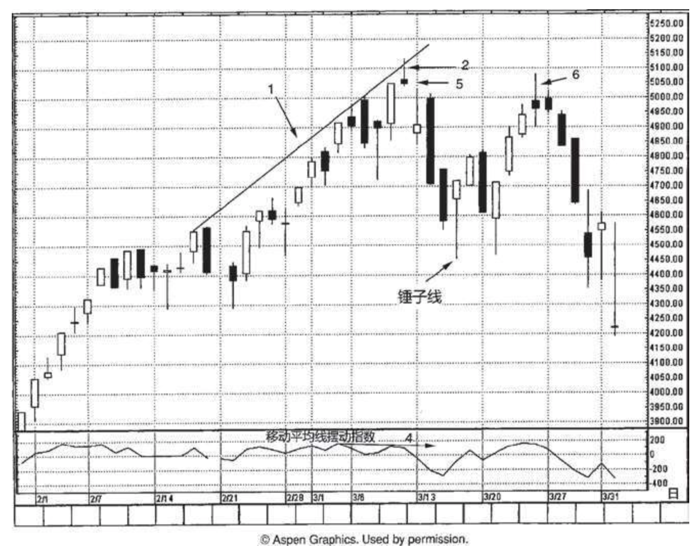
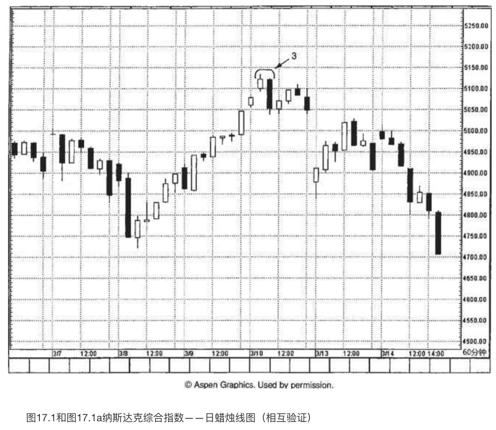

# 东西方技术珠联璧合：相互验证的力量

`“自助者，天助之”`

本章介绍了一个经典的案例，看看我如何将相互验证原则应用到纳斯达克指数，预测了一场即将到来的重大危机。

图17.1和图17.1a展示了我们采用的各种手段——既包括东方的，也包括西方的——以揭示纳斯达克综合指数即将形成一个主要高点。在同一个区域，集中了如此多的信号，这是十分难得的案例。我们将看到，尽管许多蜡烛图信号和西方技术信号相互验证，大大增加了出现顶部反转的可能性，但是这些工具并不能预测市场向下反转之后即将发生的调整过程的范围。

让我们逐一分析上述技术信号（本书前面各章已经对这些工具分别进行了研究）。以下讨论都是关于图17.1的，只有其中的第三点讲的是图17.1a。

1. 一根向上倾斜的阻挡线，通过连接2月14日所在的一周的高点与3月初的高点得来（第十一章讨论了相关技巧）。因为纳斯达克综合指数正处在过去从未涉足的新高区域，绘制这条**上升的阻挡线**是一项有用的技巧，在市场上涨过程中，这条线为我们提供了一个潜在的供给区域。
2. 3月10日，是一根**流星线**（第五章），这是蜡烛图信号，验证了上文讨论的上升阻挡线的作用。
3. 请参见图17.1a。这是一张60分钟的蜡烛线图，3月10日有一个**看跌吞没形态**（位于3处。第四章）。该**看跌吞没形态**出现在当日早间，而这一天在日线图上形成了一根**流星线**（上文第二点已经讨论了）。
4. 回到图17.1，就在纳斯达克综合指数于2处的**流星线**向上创新高的时候，摆动指数（第十四章）却是一个更低的高点。这属于看跌的相互背离现象。
5. 3月10日和13日的两根蜡烛线之间打开了一个很小的向下的窗口（第七章）。该向下的窗口在图17.1a的60分钟线图上更明显。一旦打开了向下的窗口，趋势便转为下跌。之后，此处成为潜在的阻挡水平。从该窗口开始形成下跌行情，下跌行情从3月16日的锤子线（第四章）处找到了立足地，稳住了阵脚。几天后，这根**锤子线**转为支撑水平，引发了一场上冲行情。
6. 这轮上冲行情始于3月21日，终结于上述窗口的阻挡水平（标记在5处），在阻挡水平处留下了一根**大风大浪线**（第八章）。在6处，虽然该蜡烛线的上影线一度向上超越窗口的阻挡水平，但是未能收市于窗口之上，这进一步增强了介于5050与5150之间的主要阻挡水平的分量。

根据上述分析，我们得到了多重重要的相互验证信号，既有蜡烛图信号，包括**流星线**、**看跌吞没形态**、**向下的窗口**、**大风大浪蜡烛线**，**也有西方技术信号**，包括**上升的阻挡线**、看跌的**相互背离信号**。在5050-5150之间集中出现了一群信号，它们相互验证，大大加强了我们关于纳斯达克指数已经见顶的预测。
