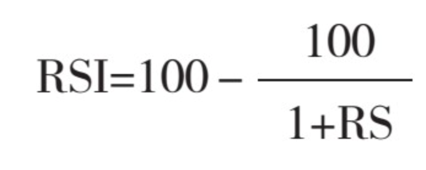
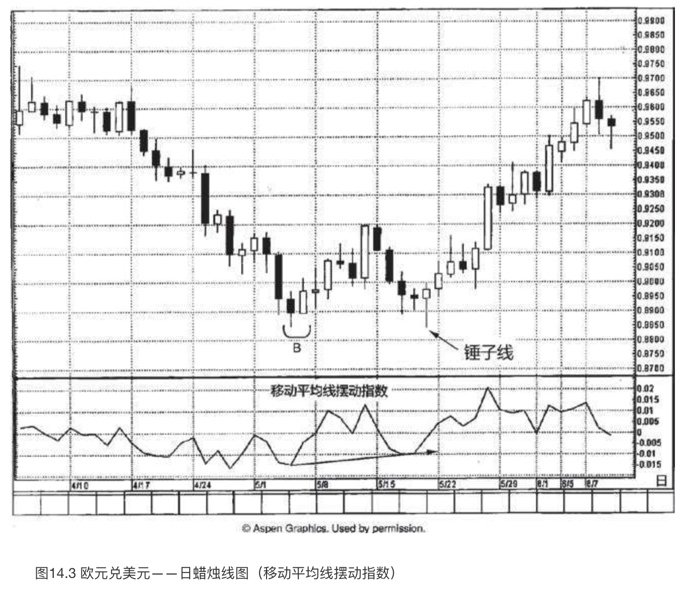
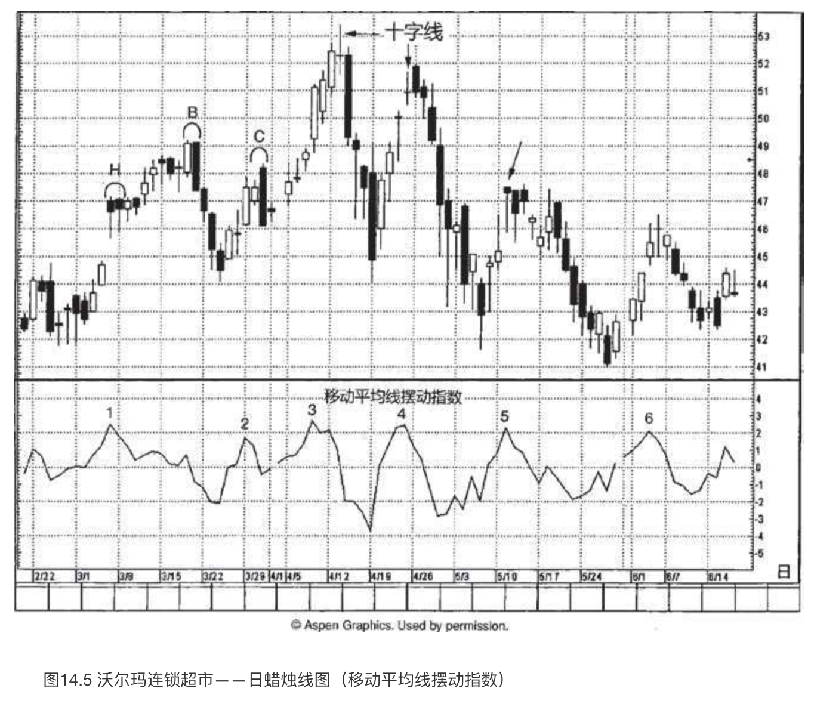
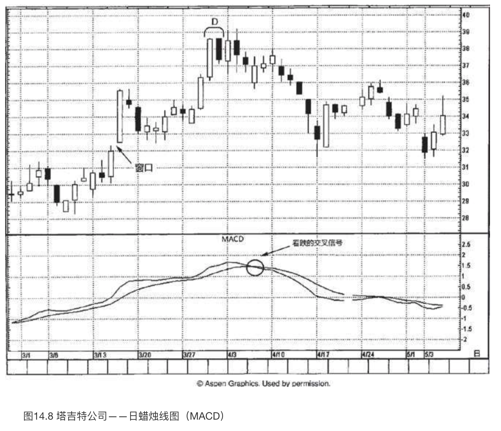
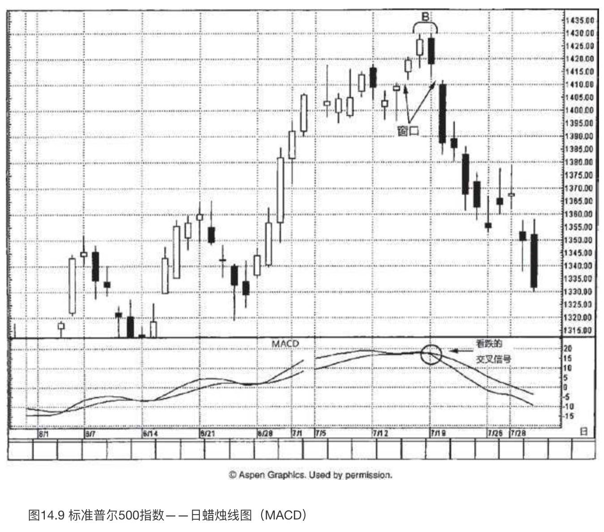
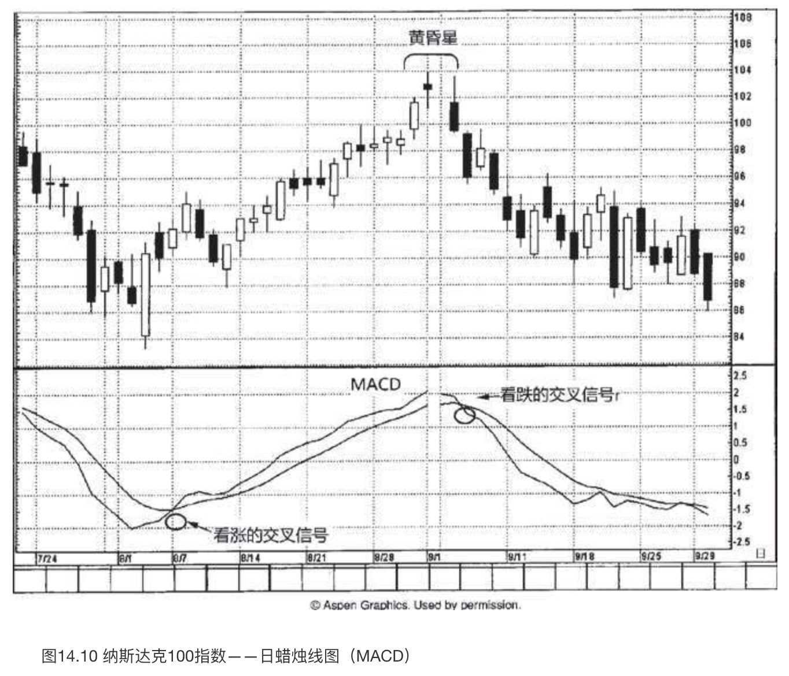

# 蜡烛图与摆动指数

`“尺有所短，寸有所长”`

图表形态识别技术常常带有主观色彩（这当然也包括蜡烛图技术）。不过，摆动指数是经过数学运算产生的一种技术工具，利用它来分析市场，能够得出更加客观的结论。人们广泛地应用这类工具，它们也成为很多计算机化交易系统的基础。

所谓摆动指数，包括下列各种技术分析工具：**相对力度指数**、**随机指数**以及**动力指数**等。摆动指数能够从以下三个方面为交易者提供帮助。

1. **摆动指数可以用作相互背离指标**。摆动指数与价格有两种相互背离的情况。一种是**负面相互背离**，或者说**看跌相互背离**（简称“**顶背离**”），即当价格创出新高的时候，相应的摆动指数却没有达到新高。这意味着市场在本质上是疲弱的。另一种是**正面相互背离**，或者说**看涨相互背离**（简称“**底背离**”），指当价格处于新低的时候，相应的摆动指数却没有形成新低。这意味着当前市场的抛售压力正在衰退。
2. **摆动指数也可以用作超买或超卖指标**。摆动指数能够告诉交易者，当前市场行情是不是向某一方向扩张得太过分了，因而容易引起行情调整。
3. **摆动指数还能用来衡量市场运动的力度**。因此，可以利用它们检验在一轮趋势性运动背后市场力量的大小。例如，动力指数通过对价格变化幅度的比较，显示了价格运动的速度。从理论上说，随着趋势的发展，价格变化速度也应当逐步加快。如果在趋势发展过程中，动力指数变成水平伸展，可能就构成了一个早期的警告信号，说明当前价格运动正在减速。

日本有句谚语：“不晓得哪片云彩能下雨。”我把摆动指数看成是会下雨的云彩，它是潜在的下雨信号。然而，要说清楚到底下不下雨，唯一的方法是，要么看见下雨，要么雨点打在头上。面对摆动指数，也是同样的道理。摆动指数好似积雨云，但是我们需要从蜡烛图技术得到最终的确认信号才能下结论。于是，我们**仅仅把摆动指数的超买或超卖状态看作警告信号**，这是一条线索，**此外还要观察是否出现了蜡烛图形态提供的最终验证**。

## 相对力度指数

**相对力度指数**（RSI）是最流行的技术工具之一。实际上，相对力度指数和通常理解的相对力度的概念并不是一回事。通常的相对力度概念指的是，某只股票或者若干股票的组合，与某一个行业指数或宽基市场指数相比较的相对表现，如道琼斯指数或标准普尔500指数等。

### 如何计算RSI

RSI计算的是，在一段时间内，同一个对象价格上涨的力度与下跌的力度对比。9天和14天，是最常用的两种时间参数。RSI的计算方法是，首先分别累加出一定时间之内上涨的价格幅度之和与下跌的价格幅度之和，然后再求得两者的比值。在其计算过程中，一般仅采用收市价作为价格数据。它的计算公式是：

其中 **RS=该时段上涨价格累计幅度的平均值/该时段下跌价格累计幅度的平均值**。

因此，当我们计算14天的RSI的时候，首先将这14天内上涨的收市价的上涨幅度相加（按照收市价对收市价的方式），再将所得的和除以14。然后，对其中下跌的日子进行同样的计算。从这两个数值就得到了相对力度的值，即RS。最后，我们把RS的值代入RSI的公式中去。RSI公式将RS的值转化为指数形式，并且使得该指数的取值范围在0到100之间。

### 如何运用RSI

RSI的两个主要用途是，构成超买或超卖指标、作为监测相互背离现象的工具。

* **RSI作为超买或超卖指标的使用方法是，当RSI向上趋近其取值范围的上边界时（即当它高于70%时），表明市场处于超买状态。在这样的情况下，市场也许变得比较脆弱，容易引发向下调整的过程，或者即将转入横向调整阶段。与此相反，当RSI处于其取值范围的下边界时（通常低于30%），则认为RSI反映了超卖状态。在这样的环境下，市场有可能形成空头买入平仓行情。**
* **利用RSI揭示相互背离现象的具体方法是，当价格向上创出当前趋势的新高时，RSI却没有形成新高，未能与之配合，这就构成了一个负面相互背离信号，可能是一个看跌信号。当价格向下跌出当前趋势的新低时，RSI却没有形成新低，则构成了正面的相互背离现象。在相互背离现象出现时，如果RSI摆动指数的数值正处在超买区或超卖区，则相互背离现象具有更强的技术意义。**

在图14.1中，11月下旬市场始终处于58美元附近的阻挡水平的作用下。一旦艾伯森公司在12月1日以一根长长的白色蜡烛线推升到该水平之上，我们便可以采用极性转换原则，将原先的阻挡水平转化为新的支撑水平。12月14日所在的一周，市场摇摆不定，但一系列看涨的长下影线表明，该股票在62美元处有牢靠的基础。12月21日，上涨行情恢复。之后，上涨行情遭遇**乌云盖顶形态**，陷入停顿。当股票形成该**乌云盖顶形态**时，价格处于新高位置。与此同时，RSI的读数为超买状态。不仅如此，RSI还形成了一个**负面相互背离信号**。具体地说，2处的股票价格高于1处，但是2处的RSI却低于1处。上述**乌云盖顶形态**构成阻挡水平，而1月10日和11日组成了另一个**乌云盖顶形态**，后者验证了前者的阻挡作用。1月中旬P处出现了一个**刺透形态**，它发生在超卖的市场环境下（根据RSI判断）。

**负面相互背离信号**与**乌云盖顶形态不期而遇、相互验证**，进一步增强了**乌云盖顶形态**潜在的看跌意义。我们还可以采用趋势线对RSI进行分析。图上用虚线表示了趋势线分析的情形。请注意，当这条上升趋势线被跌破时，构成了另一个负面信号。

分析蜡烛图必须心存一个关键概念，即市场的总体技术图像比单根蜡烛线重要得多。我们必须始终将蜡烛线或蜡烛图形态放到它所处的市场环境大格局中进行分析。

在图14.2中，1处和2处标出了两个**看涨吞没形态**。（虽然两个形态中的白色蜡烛线的开市价与前一根黑色蜡烛线的收市价处在同一个水平，但是我们仍然可以把它们视为看涨吞没形态，因为在外汇市场上下一个时段的开市价和上一个时段的收市价相同。）看涨吞没形态2比看涨吞没形态1更为重要，因为看涨吞没形态2得到了正面相互背离信号的验证。在第一个看涨吞没形态处，当股票价格创新低时，RSI也处在持续下降的过程中。如此一来，便表明看跌势头维持完好。

## 移动平均线摆动指数

### 如何计算移动平均线摆动指数

**以短期移动平均线的数值减去长期移动平均线的数值，得到移动平均线摆动指数的数值**。该数值可以是正值，也可以是负值。当它的数值大于0时，就意味着短期移动平均线处在长期移动平均线之上；当它的数值小于0时，就意味着短期移动平均线位于长期移动平均线之下。

### 如何运用移动平均线摆动指数

既然这个摆动指数采用了短期和长期的一对移动平均线，那么该指数的实质是，将短期的市场力度同长期的市场力度进行比较。这是因为短期移动平均线对最近的价格变化更加敏感，**如果短期移动平均线相对来说较大幅度地高于（或低于）长期移动平均线，那么我们就认为市场处于超买状态（或超卖状态）**。与其他摆动指数一样，移动平均线摆动指数也可以用作揭示相互背离现象的工具。

随着行情价格上升，技术分析者期望看到短期移动平均线相对于长期移动平均线更快地上升。这么一来，两条移动平均线的差值（即移动平均线摆动指数）将转为正值，且数值增大。**如果价格上升，而短期和长期移动平均线的差值却收缩，便指明市场上涨的短期动力正在衰减**。

在图14.3中，在5月的第一周，欧元兑美元汇率于B处构造了一个**看涨吞没形态**。从本形态开始，出现了一轮小规模的上涨行情。之后市场回落，得到了支撑。支撑水平位于该**看涨吞没形态**的低点，符合常规的预期。5月19日的锤子线一箭双雕，不仅表明市场把守住了上述支撑水平，而且发出了正面相互背离信号，因为欧元兑美元汇率在锤子线上稍稍创了新低，可是同一时刻的移动平均线摆动指数则处在更高的低点上。在锤子线之后，一旦市场向上推进到了0.9200之上，便确认了由**看涨吞没形态**和**锤子线**共同组成的**双重底形态**。第十六章将要讨论，交易区间的幅度为0.0350（即从0.8550到0.9200的距离），我们可以利用该幅度得到突破之后的价格目标，即0.9550（向上突破的位置为0.9200，交易区间的幅度为0.0350，两者相加便得到价格目标0.9550）。

在图14.4中，卡塔利娜公司正沿着一根**向上倾斜的阻挡线**上升。在7月13日所在的一周里，虽然股票正在当前趋势的最高点附近波动，但是一系列小实体透露了多头的进攻遭到了空头的制约。考虑到来自4月下旬的位于56美元附近的阻挡水平，行情在这里发生犹豫并不令人吃惊。

现在我们把注意力转向**移动平均线摆动指数**。就在7月中旬出现上述一系列小实体的同时，这里也出现了**负面相互背离信号**。于是，我们在56美元的水平附近得到了一个技术信号相互验证的经典案例。具体情况如下：

1. 股票处在阻挡水平处，阻挡水平既来自那条上升的阻挡线，也来自4月底的价格高点；
2. 一系列小实体表明市场的上升趋势已经脱轨；
3. **负面相互背离信号**。

关于市场出了问题的判断，如果我们还需要进一步的证据，那么当向下的窗口（图上箭头所指的地方）出现时便能如愿以偿。该窗口将成为阻挡区域。

关于蜡烛图和摆动指数的结合运用，图14.5展示了一项关键之处。在权益市场上，绝大部分交易者都是多头，相对而言，卖空者为数极少。弄清何时应当平仓退出，是多头面对的一大挑战。这正是摆动指数可以发挥作用的地方，尤其是当它得到了蜡烛线或蜡烛图形态验证时。正如我们在图14.4中所见，当股票行情过度拉长的时候，并且也具备蜡烛线转折信号的验证，那么此处就是要么平仓退出、要么平仓减磅的一个好地方了。带着上述考虑，我们来逐一分析超买状态下的各种现象。

1. 3月的第一个星期，H处有两根**上吊线**。它们出现在超买的市场状态下（根据摆动指数来判断），但是它们没有得到验证信号，即市场以收市价跌破它们的实体。请记住，看跌的上吊线得到验证后才有效。**在上吊线之后，需要以收市价向下突破上吊线的实体才能确认上吊线潜在的看跌意义**。不仅如此，出现第一根上吊线的那天同时打开了一个向上的窗口。如此一来，窗口成了支撑区域。因此，一方面市场已经向上过度延展；另一方面，虽然摆动指数在1处表明市场上涨速度已经形成了向下的拐点，但是根据上述蜡烛线，并不具备看跌的验证信号来确认。在B处，3月18日和19日组成了一个看跌吞没形态，这是一个反转信号，不仅因为该**看跌吞没形态**本身，而且因为在该形态出现的同时，**虽然股票价格已经创了新高，但是其移动平均线摆动指数出现了更低的低点**。这就形成了看跌的或负面的**相互背离现象**。
2. 摆动指数的读数显示超买状态，但在蜡烛图上没有反转信号，因为在此处的超买状态下出现的是一根长长的白色实体。在这根白色实体的几天后，我们看到了一个**看跌吞没形态**（位于C处），后来转化为阻挡水平。
3. 4月7日，沃尔玛向上超越了上面讨论的**看跌吞没形态**。如此一来，可以把它视为看涨的突破信号。在区域3，摆动指数处于超买状态，但是蜡烛线上没有反转信号，我们不能卖出。几天之后，可能出现了一个警示信号：**一根长腿十字线，紧跟在一根长长的白色蜡烛线之后**。
4. 在**摆动指数的超买状态**下，出现了一根**十字线**，两者相互验证，揭示可能发生行情转折。虽然在这个十字线处股票表现犹豫不决，但是在4月22日和23日之间，市场又打开了一个小规模的向上的窗口，构成了支撑区域。于是，我们需要进一步的看跌验证信号，**即收市价低于窗口**。4月28日，市场向下突破了窗口的支撑作用。
5. 5月11日，图上箭头所指之处是一根上吊线，**摆动指数显示市场处于过度延展状态**，因此，两者带给我们一个转折信号。后一天，**市场收市于上吊线实体之下，验证了上吊线的看跌意义**。
6. 一根十字线确认了市场的踌躇状态。与4处的情形相似，这里也有一个向上的窗口，需要市场以收市价关闭窗口之后，才能认为当前趋势已经遭到毁坏。6月8日，市场收市于窗口的支撑水平之下。

## 随机指数

**随机摆动指数**也是一种常用工具。作为一种摆动指数，它也提供了超买和超卖状态的读数指示；也能揭示相互背离现象；还提供了一套比较短期趋势与长期趋势的机制。随机指数把最近的收市价格同一定时间范围内市场的总体价格范围进行比较，计算其相对位置。随机指数的数值处在0到100之间。当随机指数的读数较高时，意味着当前的收市价格在一定时期的整个价格范围中接近其上端的水平；当随机指数读数较低时，意味着当前的收市价在一定时期的整个价格范围中接近其下端的水平。随机指数的设计思想是，当市场向上运动时，收市价格倾向于接近上述价格区间的高点；当市场向下运动时，价格往往集中在上述价格区间的低点附近。

### 如何计算随机指数

**随机指数**的图表由两根曲线组成，它们分别是%K线和%D线。其中，%K线称为原始随机线，或者称为快%K线。这条曲线最为灵敏。%K线值的计算公式是：

其中，**收市价=当前收市价**；

N天内的最低价=N天内总体价格范围的最低价；

N天内的最高价=N天内总体价格范围的最高价。

公式中的数值“100”将公式的数值转化为一个百分数值。因此，如果今天的收市价与我们所研究的时间范围内的最高价一致，那么快%K值就等于100。上述的时间范围既可以选择为若干天，也可以选择为若干周，甚至可以选择为若干个日内时间单位（比如若干小时）。14、19、21个时间单位是几个较为常见的时间参数。

因为快%K线十分起伏不定，所以我们通常以这条线为基础，每三个数值计算出一个移动平均值，得出一条较为平滑的三时间单位移动平均线。这条%K线的三时间单位移动平均线就称为慢%K线。绝大多数技术分析师用这条慢%K线代替那条变化无常的快%K线。下一步，我们对这条慢%K线再进行一次三时间单位的移动平均，得到了慢%K线的三时间单位移动平均线，称为%D线。实质上，这条%D线是移动平均线的移动平均线。如果想要弄清楚上述%K线与%D线之间的区别，那么我们不妨把它们设想为一个双移动平均线组合，其中慢%K线相当于一条较短期的移动平均线，而%D线相当于一条较长期的移动平均线。

### 如何运用随机指数

前面曾经说过，我们可以按照几种不同的方式来使用随机指数。其中最为常见的用法是将它用来揭示相互背离现象。绝大多数技术分析师在应用随机指数时，既从相互背离这一方面来跟踪随机指数的变化，也注意其读数是否显示了市场的超买或超卖状态。

有些技术分析师还采用了另一种研读随机指数的方法。这种方法约定，当慢%K线向下穿过%D线时，构成卖出信号；当慢%K线向上穿过%D线时，构成买入信号。这一点与双移动平均线的用法有相似之处。在双移动平均线系统中，当较快的移动平均线向上穿越（或向下穿越）较慢的移动平均线时，就形成了买入或卖出信号。

随机指数也可以用来评估市场是否处于超买或超卖状态。绝大多数交易者认为，80%或更高的读数表示超买状态，20%或更低的读数表示超卖状态。举例来说，为了构成一个买入信号，需要满足以下三个条件：**首先，市场必须处在超卖状态（随机指数的%D值为20%或更低）；其次，市场已经发生了正面相互背离现象；最后，慢%K线向上穿越了%D线。**

如图14.6所示，10月23日一大早，在B处出现了一个小规模的看跌吞没形态。通常，这样的小型看跌吞没形态是不太重要的，但是一旦与随机指数相结合——我们看到随机指数正处在过度延展的市场状态，同时发生了看跌的**交叉信号**（这里较快的%K线向下穿越了较慢的%D线），这就给**看跌吞没形态**增加了更大的影响力。我们预期该形态在105美元的高点构成阻挡水平。后一天早晨，股票一度回升到104美元，但后继乏力，表明该阻挡水平维持完好。

10月25日，打开了一个大幅的向下的窗口。10月26日早晨，出现了一根中规中矩的**锤子线**。在锤子线之前的几个时段，我们曾经在随机指数方面看到**一条试探性的筑底线索**。具体说来，在10月26日早间，随机指数已经处于超卖区域（也就是低于20%）。同时，我们看到了随机指数发生看涨的交叉信号，较快的%K线向上穿越了较慢的%D线。就在随机指数的反转信号出现之后，我们很快得到了一个看涨的蜡烛图信号，也就是前面所说的锤子线。该锤子线作为支撑水平维持稳固。如果股票回落到锤子线的低点之下，那么尽管随机指数出现了正面的相互背离现象，我们也应当考虑降低多头仓位。

在图14.7中，10月初出现了一系列带有长下影线的蜡烛线。在10月12日所在的一周里，我们看到随机指数显示了**超卖读数**，接近20%，并且发生了**看涨的交叉信号**。这就增强了**看涨的长下影线**的意义，即股票行情正在趋于稳定。

10月19日出现了一根近似十字线的蜡烛线，紧随在一根长长的白色蜡烛线之后。这将市场趋势从上升转为更加中性，因为这根十字线暗示市场已经“疲惫”了。在十字线之后，市场踩水了一阵子。后来，随着11月2日向上的窗口的到来，市场继续向高位推进。该窗口在11月2日所在的一周里发挥了支撑作用。在B处，11月6日和9日组成了一个看跌吞没形态，将当前趋势转向不那么坚挺。在该看跌吞没形态中，两根蜡烛线实体的尺寸差不多。通常，我们更希望看到**看跌吞没形态中黑色实体的长度明显超过白色实体**。这样才能表明空方从多方手中夺得了主导权。不过，在本例中，当看跌吞没形态出现的时候，随机指数同时出现了看跌的交叉信号。如此一来，将该看跌吞没形态与随机指数相结合，它便具备了额外的重要性。

## 移动平均线验证背离指数（MACD）

### 如何计算MACD

从图线来看，移动平均线验证背离指数（MACD）由两条曲线组成，实际上，它是由三条指数加权移动平均线构成的。MACD图线中，第一条线是两条指数加权移动平均线的差值（通常采取12和26作为时间参数的两条指数加权移动平均线来计算）；第二条线是第一条差值线的指数加权移动平均线（通常用9作为时间参数），用来平滑第一条线。显然，第一条线变化较快。第二条线称为信号线。

### 如何运用MACD

当变化较快的第一条线向上穿越变化较慢的第二条线（信号线）时，构成看涨的交叉信号；当较快的第一条线向下穿越较慢的第二条线时，构成看跌的交叉信号。MACD同样可以用来揭示市场处于超买状态或超卖状态的区域。因为MACD天生变化较慢，所以**一般不会用作短线交易工具**。

在图14.8中，3月16日是一根高高的白色蜡烛线，也打开了一个向上的窗口。后一天是一根小实体，收缩在这根白色蜡烛线的内部，两者组成了一个孕线形态。从这个孕线形态开始，市场回落。回落的过程得到了前述窗口的支撑，于是行情稳定下来。D处，3月31日和4月1日组成了一个**乌云盖顶形态**，提前发出信号，正如日本人所说，表明市场“上涨的机会不大”。从之后两天的行情变化可见，这个乌云盖顶形态构成了阻挡水平。后来，虽然在日内行情中股票一度推进到乌云盖顶形态的阻挡水平之上，但是收市价却不能维持在其上，于是阻挡水平保持完好。

在乌云盖顶形态之后的一周里，我们从MACD曲线上得到了看跌的验证信号，其中较快的曲线向下穿越了较慢的信号线。

请注意，从上述乌云盖顶形态开始的下降行情一直持续到市场在4月中旬形成的看涨吞没形态。该看涨吞没形态验证了3月15日和16日之间向上的窗口所形成的支撑区域。

本图是一个很有说服力的实例，说明蜡烛图带来了附加价值。蜡烛图所发出的转折信号，经常领先于西方技术分析信号。在本图的情形下，我们看到乌云盖顶形态发出的顶部信号，比MACD发出的反转信号几乎提前了一周。

在图14.9中，7月中旬标准普尔500指数创了新高。但是，B处的**看跌吞没形态**发出了前方出现问题的信号。MACD发出的看跌线索进一步压抑了市场的看涨前景，其中较快的曲线向下穿越了较慢的信号线。看跌吞没形态的次日，市场向下打开了一个窗口。因为市场在前面的一周里曾经出现了向上的窗口，向下的窗口与之一道构成了一个岛形反转顶。这么一来，雪上加霜，进一步增添了市场潜在的看跌前景。

如图14.10所示，8月3日完成了一个尺寸颇大的看涨吞没形态。过了几天后，MACD形成了看涨的交叉信号（这又是一个实例，蜡烛图信号领先于西方工具的反转信号）。从看涨吞没形态开始了一轮上涨行情，一直持续到图示的黄昏星形态。（黄昏星形态的中间蜡烛线也形成了一根大风大浪线。）与该黄昏星形态相隔一天后，MACD发出看跌的交叉信号，这是致命一击，给棺材盖钉上了最后一根钉。

