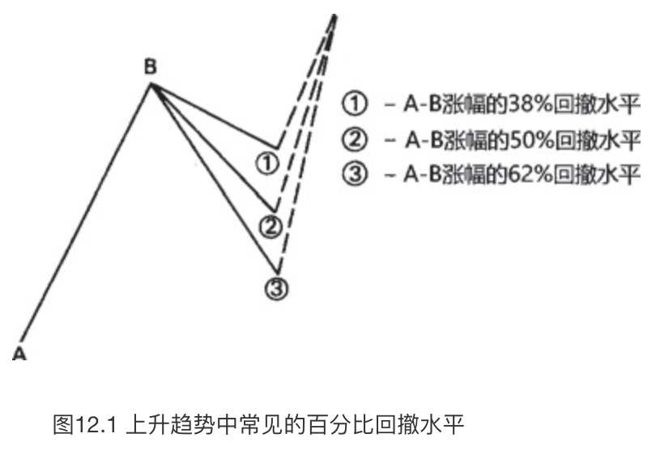
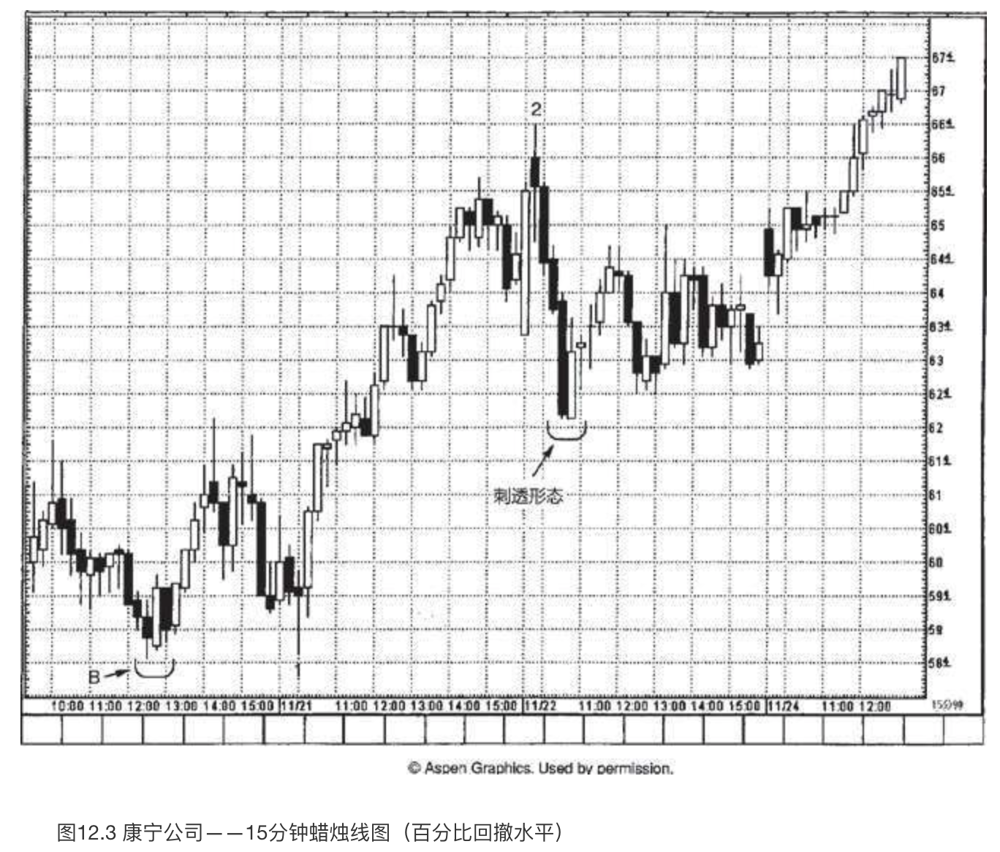
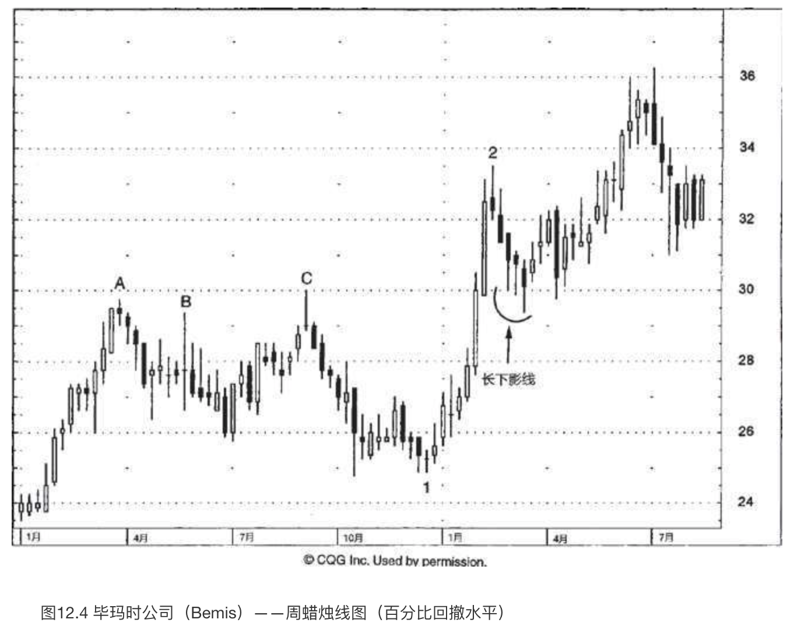
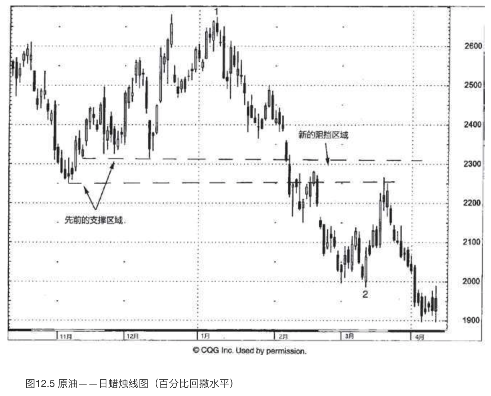

# 蜡烛图与百分比回撤水平

`“功到自然成”`

## 回撤水平

通常，市场既不会直线式地上升，也不会竖直地跌落，而是进两步、退一步。在当前趋势继续发展之前，市场通常首先要对已经形成的上涨进程或下跌进程做出一定程度的回撤。在这类回撤水平中，较为常用的是50%回撤水平，以及38%和62%的斐波那契回撤水平（如图12.1和12.2所示）。斐波那契是13世纪的一位数学家，他推导出了一组特殊的数列。用不着深入地研究，我们只要把这些数字相互除一下，就能够推算出一组比率，这就是斐波那契比率。在这组比率中，包括61.8%（或者它的倒数，1.618）和38.2%（或者它的倒数2.618）。这正是62%（61.8%取整）回撤水平和38%（38.2%取整）回撤水平广为流行的原因。常见的50%回撤水平也属于斐波那契比率。50%回撤水平可能是一个最受人关注的价格水平。这是因为，不论是信奉江恩理论者，还是奉行艾略特波浪理论者，或者道氏理论的拥护者，**通通应用了50%回撤水平**。

下面我们就来看一些实例。在这些例子中，百分比回撤水平同蜡烛图技术融为一体，为我们提供了重要的反转信号。

在图12.3中，B处的看涨吞没形态构成支撑水平，11月21日出现了一根看涨的长下影线蜡烛线，表明该支撑水平保持良好。从1处到2处的上涨行情推升股价的幅度达到8美元。如此一来，这段上涨行情的50%回撤水平便在从高点向下4美元的位置。这意味着期望的支撑水平在62.50美元上下（8美元涨幅的50%是4美元，4美元+58.50美元=62.50美元）。11月22日，股票回落到接近该水平处，形成了一个刺透形态。于是，蜡烛图形态发生在50%回撤水平，两者相互验证。**虽然百分比回撤水平可能演变成支撑或阻挡水平，但我并不建议在百分比回撤水平的位置买进或卖出，除非它还得到了蜡烛图信号的验证，正如本例的情形。**

如图12.4所示，从1处到2处的上冲行情将股价从25美元提升到了33.50美元。该上冲行情的50%回撤水平位于29美元左右，可能提供潜在的支撑作用。股票从2处开始，逐步向潜在支撑区域回落，在这一过程中形成了一系列长下影线，它们暗示空头正在丧失控制权。29美元之所以构成潜在的支撑水平，还有另一个原因。具体来说，如果我们注意到了先前位于A、B和C三处的价格波峰，就可以采用极性转换原则，当这个29-30美元的阻挡区域被向上突破后，便转化为潜在的支撑区域。因此，在本例的情形下，随着股票逐步接近29美元，50%回撤水平、极性转换原则、不约而同的一系列长下影线，三者汇聚，相互验证。

在图12.5中，从1月间1处的价格高点，到3月中旬2处的低点，是一轮下降行情，2处出现了一个看涨吞没形态。该看涨吞没形态的低点验证了2月底一根锤子线的支撑水平。从看涨吞没形态开始，行情上冲，但在遭遇一根大风大浪蜡烛线后便寸步难行，后者几乎恰好处在从1处（位于26.65美元）到2处（位于19.97美元）的38.2%斐波那契回撤水平上。该区域之所以构成阻挡作用，还有另一个理由，这里曾经在11月和12月充当了先前的支撑区域。既然该支撑区域已经被向下突破，根据极性转换原则，就成为新的阻挡区域了。

