# 持续形态

`“勇者天助”`

到目前为止，我们看到的所有蜡烛图形态都属于反转信号。事实上，绝大多数蜡烛图形态都属于趋势反转信号，不过还是有一群蜡烛图形态构成了持续性的技术指标。**所谓的持续性形态，意味着形态完成后，市场仍将恢复先前的趋势**。举例来说，如果在上涨行情之后出现了持续形态，那么我们预期上涨行情仍在发挥作用。（当然，这一点并不排除在持续形态出现后先发生调整行情，调整之后再恢复原先的涨势。）

用日本人的话来说就是：“有时当买进，有时当卖出，有时当休战。”在这类持续性形态中，大多意味着市场正处于休整阶段，需要喘息一下，然后市场仍将恢复先前的趋势。本章将要讨论的持续形态有**窗口**（以及含有窗口的一些蜡烛图形态）、**上升三法**、**下降三法**、**分手线**，以及**白三兵形态**。

## 窗口

日本技术分析师一般把西方所说的**价格跳空称为窗口**。按照西方的表达方式，我们说“回填跳空”；在日本，人们则说“关上窗口”。这一部分，我们先来阐述窗口的基本概念，然后还要探讨包含窗口（价格跳空）的其他一些形态。在我的讲座中以及在本书中，经常将术语“窗口”和“跳空”交换使用。

窗口有两种类别，一种是看涨的，一种是看跌的。**向上的窗口（如图7.1所示）是看涨信号**。在前一个时段最高点（也就是其上影线的顶端）与本时段最低点（也就是其下影线的底端）之间，存在价格上的真空地带。

图7.2展示了一例**向下的窗口**。它是**看跌信号**。在前一个时段最低点与本时段最高点之间，存在价格缺口。

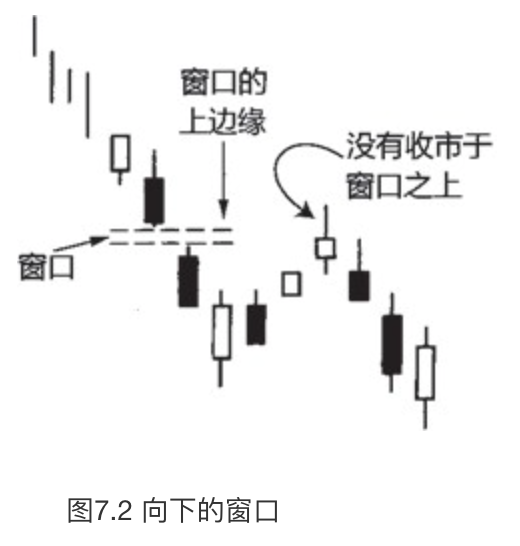

根据日本技术分析师的观点，市场参与者应当顺着窗口形成的方向建立头寸。这是因为窗口属于持续性质的技术信号。因此，**如果出现了向上的窗口，我们就应该利用市场回落的机会逢低买进；如果出现了向下的窗口，就应该利用市场反弹的机会逢高卖出。**

日本人还认为：“调整行情于窗口处终结。”这意味着窗口可能转化为支撑区域或阻挡区域。于是，如果出现了向上的窗口，则在今后市场向下回撤时，这个窗口将形成支撑区域（我们马上会看到，这是指窗口的全部空间）。如果市场在向下回撤时收市价达到了窗口下边缘之下的水平，那么，先前的上升趋势就不复成立了。请注意，在图7.1中，市场在日内一度下跌到窗口下边缘之下，但是因为不是收市价低于该区域，所以向上的窗口所形成的支撑区域保持完好。

同样，如果出现了一个向下的窗口，则意味着市场还将进一步下降。此后形成的任何价格向上反弹，都会在这个窗口处遭遇阻挡（指窗口的全部空间）。如果多方拥有足够的推动力，将收市价推升到向下的窗口之上，那么，下降趋势就完结了。

在西方，一般认为价格跳空总要被回填。我不知道这一点是不是正确的，不过如果采用蜡烛图技术的概念“调整行情于窗口处终结”，那么当行情试图回填价格跳空时，便可以考虑买进（在向上的窗口处）或卖出（在向下的窗口处）。

根据在我的公开讲座和机构培训班中大家提问的情况，对窗口最常发生的误解是，有些人误以为如果两根蜡烛线的实体之间不相接触，那么这两根蜡烛线便组成了一个窗口。举例来说，在图7.3中，在蜡烛线A和B的实体之间存在大幅的空白。可是因为蜡烛线A和B的影线是相互重叠的，所以它们并不构成窗口。正如图7.1和7.2所示，组成窗口的蜡烛线必须是其影线之间互不重叠。无论两根蜡烛线实体之间的“缺口”有多大，除非在它们的影线之间存在缺口，否则不构成窗口。

如图7.3所示，在7月22日的最高点和次日的最低点之间仅有4美分的空白，这是一个小型向上的窗口。无论向上的窗口多么小，它都应当构成潜在的支撑区域。对于向下的窗口，同样也应当构成阻挡区域。窗口不在乎尺寸大小。在图7.3中，向上的窗口形成了支撑区域，之后当行情回落到接近其支撑区域时，留下了一些长长的下影线，突出显示此处需求强大。正如本图所示，虽然向上的窗口构成潜在的支撑区域，但是市场并不需要精确地回落到窗口所在的支撑区域之后才能向上反弹，有时甚至连接近它都谈不上。因此，在市场朝着向上的窗口回落的过程中，如果您积极看好，那么甚至当市场接近该窗口的上缘时，便可以考虑买进了，无须等到行情进入该窗口之内。 如何运用窗口，取决于您的交易风格和交易的迫切程度。应当事先设置止损措施（做好思想准备或者其他措施），以防止行情收市于向上的窗口的下缘之下。

在图7.3中我们看到，如此微小的向上的窗口同样能够成为支撑区域。在图7.4中，在20.50美元和22.50美元之间存在一个幅度非常大的窗口。这么一来，它构成了一个幅度达2美元的支撑区域（从窗口的顶部22.50美元到窗口的底部20.50美元）。

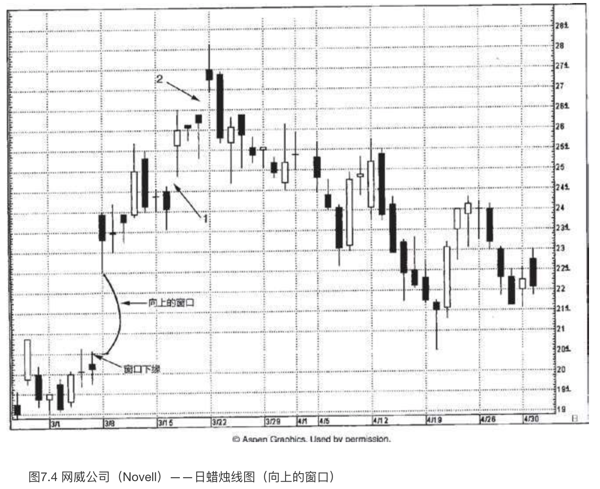

正如之前讨论的，向上的窗口的全部空间都是潜在的支撑区域。大窗口的不利之处是，整个区域都可能构成潜在的支撑水平。在这种情况下，就享受不到很小的窗口所带来的便利——紧凑的支撑区域（向上的窗口）或紧凑的阻挡区域（向下的窗口）。

在窗口幅度相对较大的情况下，请记住，向上的窗口的关键支撑水平位于窗口的底部（相应地，向下的窗口的关键阻挡水平位于窗口的顶部）。因此，在向上的窗口中，其支撑作用的“最后一口气”就是图上用虚线标注的窗口的底部（即价格跳空的下边缘）。在本图上，市场向下接触到了窗口的底边，20.50美元左右，然后从4月20日的锤子线开始向上反弹。

下面再看看另外两个向上的窗口，图上分别用1和2来做了标记。窗口1的支撑作用在其出现后三周之内一直维持良好，直到4月6日的蜡烛线才向下突破了该支撑水平。窗口2的支撑作用在其出现之后的第二天便被向下突破了。在窗口2被向下突破后，窗口1发挥了支撑作用。这就是我运用窗口的具体做法。举例来说，如果某个窗口的支撑被突破，那就在被突破的窗口下方寻找另一个窗口，以后者作为下一个支撑区域。在本图中，一旦窗口2被向下突破，下一个支撑位置便是窗口1。

单一的蜡烛图信号是否值得采信，必须首先从其所处的总体技术背景来考虑。图7.5的实例充分显示了这一点的重要性。3月1日的第一根蜡烛线是看涨的锤子线。但是更重要的是，看看这根锤子线是如何形成的——一个向下的窗口。一方面，锤子线本身立即构成了支撑水平；另一方面，切不可忘记，因为这个向下的窗口，窗口的整个空间现在都成为阻挡区域。果然，从锤子线开始的反弹行情到向下的窗口顶边时渐渐熄火了。

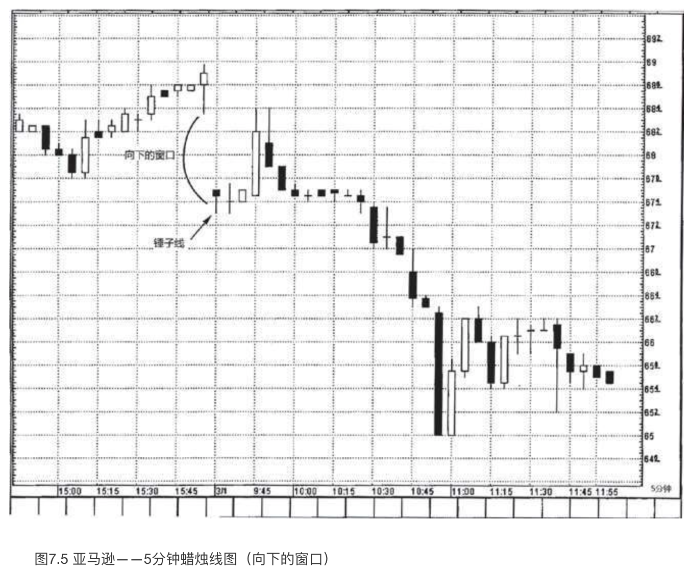

请注意在2月28日的最后一根蜡烛线与下一日（3月1日）的第一根蜡烛线之间形成了一个向下的窗口。本图揭示了在日内图表上形成窗口的场合，日内图表上绝大多数窗口出现在上一日的最后一根蜡烛线与当日的第一根蜡烛线之间。这并不奇怪，在日内图表连续两个时段之间出现价格跳空反倒是不寻常的，例如在5分钟蜡烛线图上，在一个5分钟时段与紧接着的另一个5分钟时段之间出现了价格缺口。

正如图7.6所示，6月底出现了一场冲劲十足的为期两天的上冲行情。十字孕线形态告诉我们，该股票已经脱离了之前的上升趋势。（7月1日是其中的第二根蜡烛线，它局限在前一根高高的白色实体之内。它的实体实在微不足道，无论从哪个角度来说，都可以归结为十字线，因此本形态便属于十字孕线形态。）下一日（7月2日）是一根理想的十字线，再次响应了前一根蜡烛线所暗示的信号，即市场在98美元上下，已经脱离了之前的上涨趋势。7月中旬形成的看跌吞没形态提供了进一步的证据，表明大难临头。

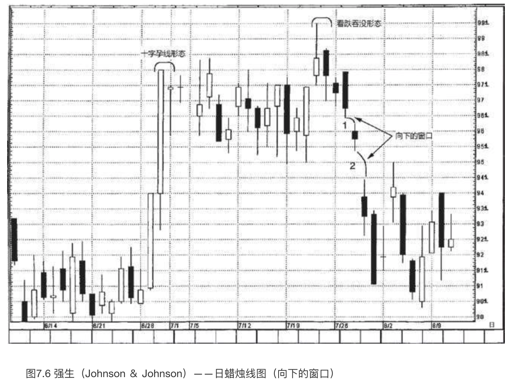

在7月27日与28日之间打开了一个小的向下的窗口（图上标记1处），29日接着出现了另一个向下的窗口（图上标记2处）。第二个向下的窗口带来了最大的损害，因为它向下跳空到了大约95美元的支撑区域之下，这个支撑区域曾经在7月的上半个月一直维持良好（这样的跳空在西方术语里属于“突破跳空”）。毫不奇怪，接近95美元的这个窗口成了关键阻挡区域。

蜡烛图常常可以提供线图不能提供的技术信号，蜡烛图之所以具有无可置疑的吸引力，这是其中最主要的因素之一。图7.7揭示了如何通过窗口来得到一个阻挡区域，但这个阻挡区域在线图上不可用。10月8日出现了一根锤子线。它可能是潜在的看涨信号，但是这根锤子线同时也形成了一个向下的窗口。于是，我们应当等待市场的收市价回到向下的窗口的顶边之上，以证实锤子线的确具有积极的指标作用。

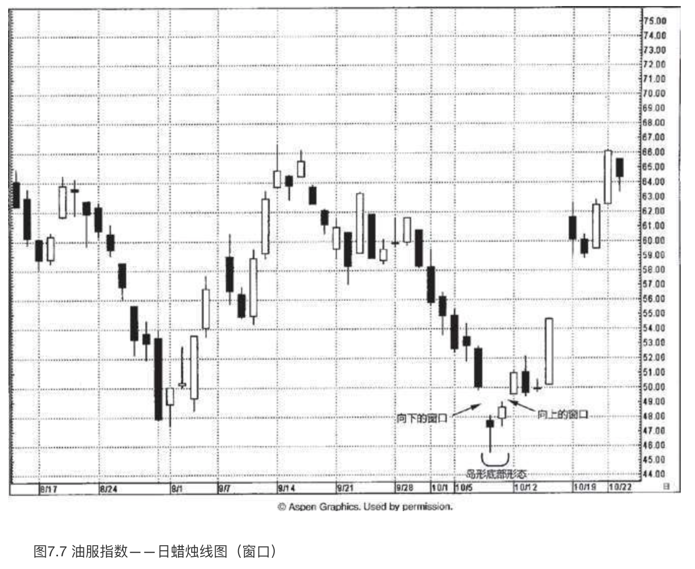

锤子线之后再过了两天，收市价向上超越了向下窗口的顶边，并且是以看涨的向上窗口来完成的，多方以此证明了其坚定不移的决心。在这个过程中，油服指数构造了一个西方术语所称的岛形底部形态。（在本形态中，市场先向下跳空，在低位留下一个或几个时段的图线，然后向上跳空。之所以称之为“岛形底部”，是因为留在低位的那一个或几个时段看上去像一座孤岛，两边都被海水包围着，两侧的那两个跳空就是海水）。虽然岛形底部形态的最低点自然地形成支撑区域（在本图上该支撑区域接近45.50），但是借助蜡烛图技术中的窗口工具，我们可以及时获得更接近当前行情的支撑区域。

采用向上的窗口构成支撑水平的概念，一旦岛形底部形态于10月12日完成（以向上的窗口），我们得到的第一个支撑水平不是45.50（岛形底部的最低点），而是接近49.00的位置。这是受惠于该向上的窗口。正是在这个窗口的支撑区域，行情在随后的几天里站稳了脚跟，然后便一飞冲天，形成一根长长的白色实体。这又是一个实例，说明蜡烛图技术工具有助于我们取得优势，领先单纯使用线图工具的那些人，因为单纯使用线图的人以岛形底部的最低点作为第一个支撑水平（位于45.50），而不是以蜡烛图的向上的窗口作为第一个支撑水平（位于49.00）。当然，万一市场向下突破了窗口的支撑区域，我们自然要看下一个支撑水平，近乎45.50处（即岛形底部形态和锤子线的最低点）。

传统的日本技术分析理论认为，**在三个向上的或向下的窗口之后，很可能市场已经处在过度超买状态，上升行情难以为继（在三个向上的窗口的情形下），或者处在过度超卖状态，下降行情无力维持（在三个向下的窗口的情形下）**。这一点可能与数字“3”在日本文化中的重要性有关。不过，自本书第一版问世以来，我已经对这个概念进行了一番精心调整。

窗口的地位如此显要，我发现无论已经出现了多少个窗口，当前的趋势都不受影响，直到最后的窗口被关闭为止。在上升行情中，可以有任意数目的向上的窗口。只要市场没有以收市价向下突破最高的那个向上的窗口，则趋势依然维持向上。在图7.8中，展示了这样的一个实例。8月中旬于B处形成了一个看涨的吞没形态，由此开始形成了一轮上冲行情。最终，这轮行情总共打开了六个向上的窗口。10月5日和6日组成了一个孕线形态，这是我们得到的最早的线索，表明债券市场喘不过气来了。但是，要等到收市价向下突破了第六个向上的窗口之后，这轮上冲行情才终结。后来的结果表明，债券期货行情此处的向下反转形成了一个主要的历史高点，之后市场多年保持下滑态势。

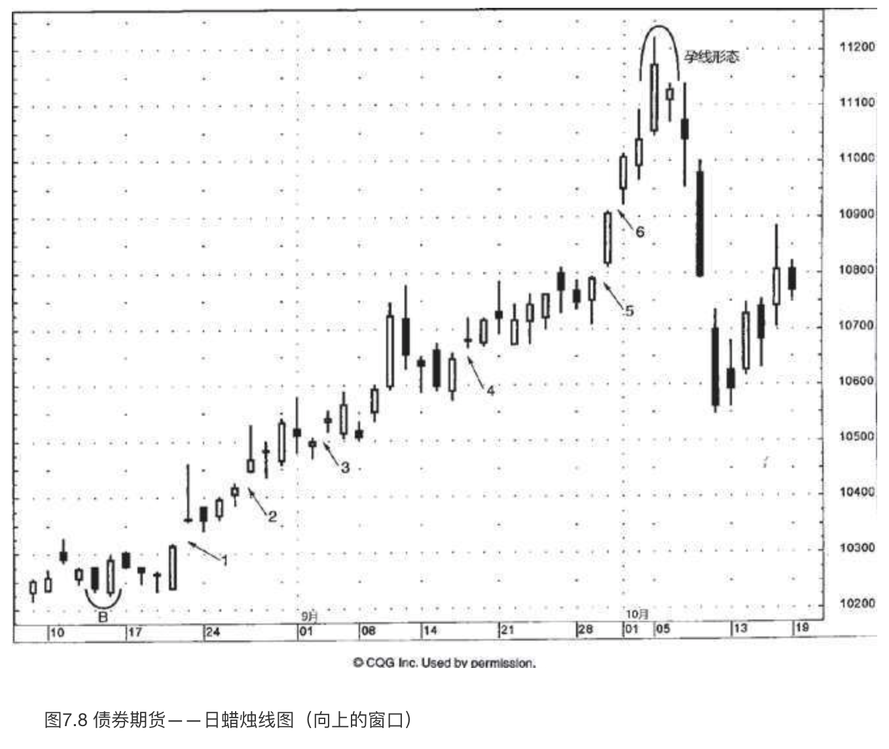

图7.9是另一个实例，说明了即使出现了3个向上的窗口，上涨行情仍然可以持续下去。向上的窗口分别以数字1、2、3、4进行了标记。上述的每一个窗口都作为支撑水平维持良好。A处向下的窗口给出信号，表明行情可能遇到麻烦，该窗口在46美元的水平发挥了阻挡作用。从向下的窗口开始形成了一轮下降行情，一直持续到5月的第一个星期。

5月4日是一根黑色实体，它向下突破了窗口4的底边，即位于42.50美元的支撑水平。对微软来说，向下突破窗口4的支撑作用，具有进一步看跌的潜在意味。然而第二天，也就是5月5日，出现了一根坚挺的白色蜡烛线（一根看涨的**捉腰带线**，开市于最低点，收市于最高点），并且组成了一个经典的刺透形态。这么一来，便部分抵消了前一天的看跌意味。

本图的实例揭示了灵活适应不断变化的市场环境的重要性：5月4日由于行情跌破支撑水平，我们持有看跌的预期；第二天由于刺透形态的出现，我们的观点转变为不太看跌了。

在接下来的两个交易时段中，5月11日和12日，出现了类似的情形：先是一根黑色实体，跟着是一根白色实体。关于41美元附近存在主要支撑，如果我们还需要进一步的证据，那么5月26日和27日的看涨吞没形态便是了。事实上，如果我们观察一下从5月29日到6月2日的三根蜡烛线，它们可以被视为一个启明星形态（虽然在典型情况下我们希望启明星出现在下降趋势之后，而不是像本图的情形出现在横向交易区间中）。尽管如此，本形态的确证实了41美元左右的支撑水平稳如泰山。

## 向上跳空和向下跳空并列阴阳线形态

如图7.10和7.11所示，**并列阴阳线形态是由具备特定形态的两根蜡烛线组成的，两者一起向上跳空或向下跳空**。图7.10为**向上跳空并列阴阳线形态**，其中一根白色蜡烛线和一根黑色蜡烛线共同形成了一个向上的窗口。这根黑色蜡烛线的开市价位于前一个白色实体之内，收市价位于前一个白色实体之下。在这样的情况下，这根黑色蜡烛线的收市价，就构成了买卖双方争夺的要点。如果市场以收市价向下突破到该窗口之下，那么这个向上跳空并列阴阳线形态的看涨意义就不再成立了。在**向下跳空并列阴阳线形态**（如图7.11所示）中，基本概念与上述形态是相同的，只不过方向相反。一根黑色蜡烛线和一根白色蜡烛线共同打开了一个向下的窗口。在向上跳空和**向下跳空并列阴阳线形态**中，两根蜡烛线的实体的大小应当不相上下。两种跳空并列阴阳线形态都很少见。

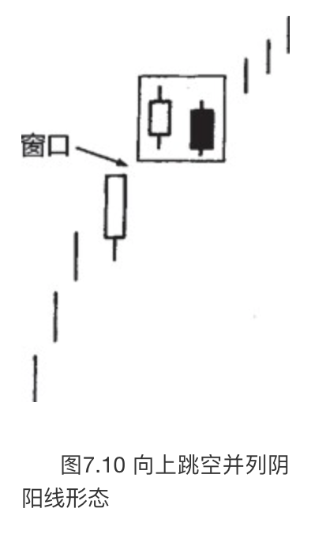
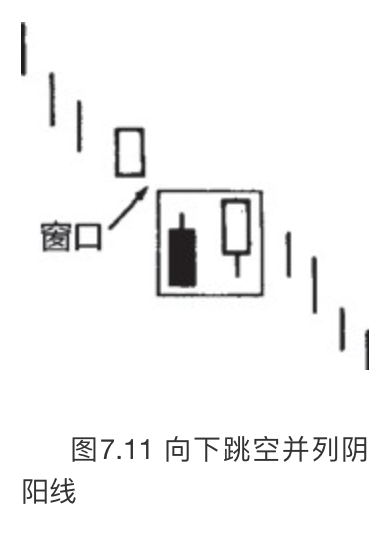

自从本书第一版出版以来已经过去12年了，根据进一步积累的经验，我在讲座中通常建议听众无须费脑子记忆并列阴阳线形态。在我看来，由于该形态中的窗口如此醒目，以至于在向上的窗口之后出现什么颜色的蜡烛线或者什么样的蜡烛线组合都没什么大不了的。窗口本身才是至关重要的。我们只要记住，如果出现了向上的窗口（例如在向上跳空并列阴阳线形态中），便构成看涨的信号，并且窗口应成为支撑区域。如果市场收市于该支撑水平之下，则导致趋势方向转向下。对于向下跳空并列阴阳线，道理一样而方向相反。也就是说，既然向下跳空并列阴阳线带有一个向下的窗口，那么它将构成阻挡水平。如果市场收市于向下的窗口的顶边之上，则消除了向下跳空并列阴阳线形态的看跌意味。

在图7.12中，9月底出现了一个小型向上的窗口。在向上的窗口之后有两根蜡烛线，组成了向上跳空并列阴阳线形态。之所以称之为并列阴阳线形态，是因为在向上的窗口之后，先是一根白色蜡烛线，然后是一根黑色蜡烛线。然而上面刚刚指出，依我看来，在向上的窗口之后，到底那两根蜡烛线是什么样子并不要紧。主要的考虑是把向上的窗口视为支撑区域，并根据收市价来判断其守与破。正如图上虚线所示，根据收市价来判断，该支撑区域无论如何总算维护住了。后来，10月底出现了一根看涨的捉腰带线，并且它包裹了之前的三根黑色实体，从而为该窗口的支撑作用给出了最终的验证信号。

## 高价位和低价位跳空突破形态

在上升趋势中，当市场经历了一轮急剧的上涨后，在正常情况下都需要一个调整消化的过程。有时，这个整理过程是通过一系列小实体来完成的。如果在一根坚挺的蜡烛线之后，出现了一群小实体的蜡烛线，则表明市场已经变得犹豫不决了。虽然这群小实体表示行情趋势已经从向上转为中性，但是它们的出现在某种意义上是健康的，因为通过踩水的过程，缓解了市场所处的超买状态。一旦后来某一天的行情从这群小实体处打开了一个向上的窗口，就是看涨的信号。这就是一个高价位跳空突破形态（如图7.13所示）。之所以这样称呼这类形态，是因为在这类形态中，市场先是在最近形成的高价位上徘徊，后来才下定决心向上跳空。

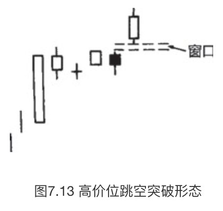
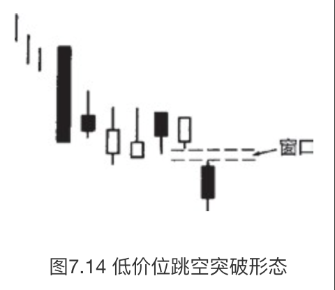

可想而知，**低价位跳空突破形态**正是高价位跳空突破形态的反面角色，两者对等而意义相反。低价位跳空突破形态（如图7.14所示）是一个向下的窗口，是从一个低价位的横向整理区间向下打开的。这个**横向整理区间**（一系列较小的实体）发生在一轮急剧下跌之后，曾经使市场稳定了下来。当初，从这群小实体蜡烛线的外观看来，似乎市场正在构筑一个底部。但是后来，市场以窗口的形式从这个密集区向下突破，打破了这种看涨的期望。

在图7.15中，7月31日是一根锤子线，结果成了之后上涨行情的低点，在这轮上涨中，8月初曾经形成一个向上的窗口。在8月7日所在的一周里，出现了一根长黑色实体，组成了乌云盖顶形态，在这轮上涨行情的前方添加了一块临时的挡板。

在8月21日所在的一周里，先是一根长长的白色蜡烛线，后面跟着一系列小实体，显示该股票行情已经进入调整阶段。8月28日打开了一个小型向上的窗口，完成了一个高价位跳空突破形态，证明多头完全控制了市场。

在本形态中，或者在任何高价位跳空突破形态中，一旦市场收市于其中向上的窗口之下，则消除了形态的看涨意义。对低价位跳空突破形态来说，道理相同而方向相反。

在图7.16中，6月29日出现了一根高高的白色蜡烛线。紧随其后，6月30日是一根十字线。长白色实体之后的十字线，两者组成十字孕线形态，表明股票已经从坚挺转为较中性。十字线之后的几个实体呼应了上述观点。请注意图表底部，由上述四根小实体组成了一个紧凑的交易区间，结果导致与之对应的摆动指数从指示超买状态的1处回落到了指示中性状态的2处。这正是本节开头部分讨论的跳空并列阴阳线的一个方面，即并列阴阳线形态中的一系列小实体有助于缓解市场的超买状态。在2处，股票不处于超买状态，这使得行情更容易上涨。7月7日，一旦股票向上打开了一个小型的窗口后，便形成了高价位跳空突破形态。7月中旬出现了一个圆形顶部形态。

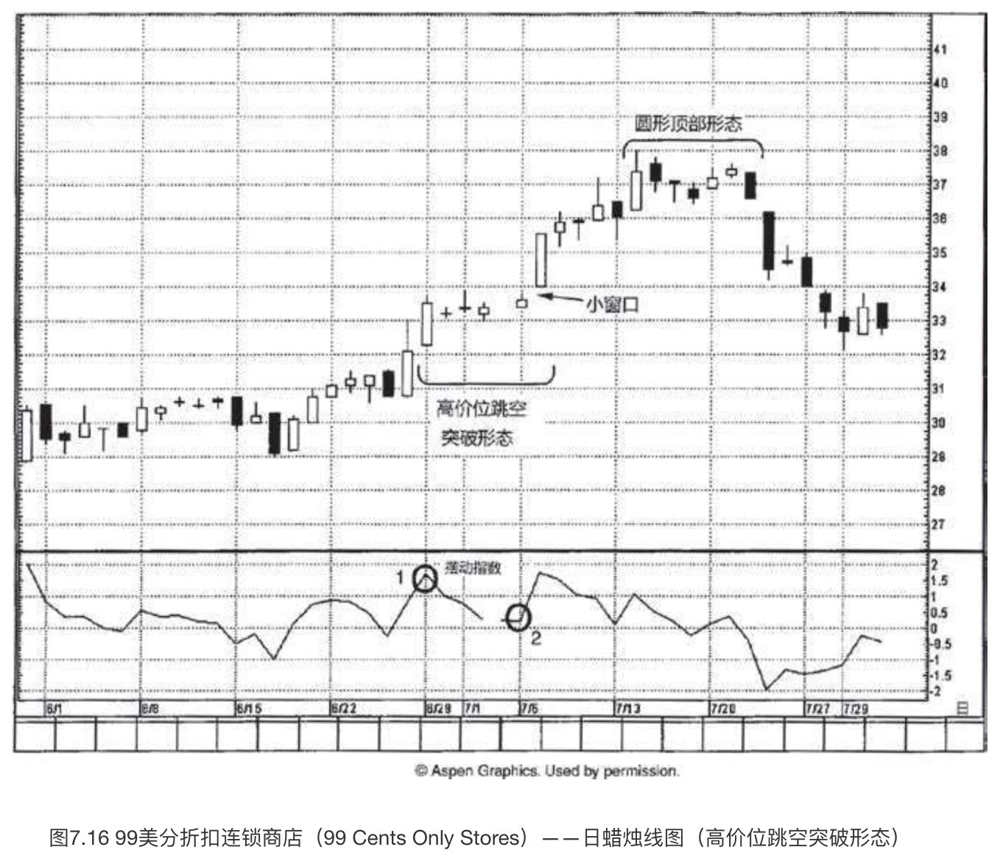

在图7.17中，4月初的孕线形态有助于终结当时的上涨行情。从本形态开始市场下降并逐步加速，特别是4月15日的超长黑色实体加剧了下跌的进程。之后的两个时段都是纺锤线，有线索显示股票正在努力稳住。然而，4月17日收市价再创新低，下一日又完成了一个低价位跳空突破形态，表明空头重新夺得全部控制权。

请观察5月初的小型窗口是如何转化为阻挡区域的。该阻挡区域很重要，值得牢记于心，因为在1处有一根锤子线，在2处又有一个看涨吞没形态，都是底部信号。但是在这两个看涨信号出现时，交易者对买进应当保持谨慎态度，因为根据该窗口的阻挡作用，潜在的利润空间有限。

## 跳空并列白色蜡烛线形态

在上涨行情中，先出现了一根向上跳空的白色蜡烛线，随后又是一根白色蜡烛线，并且后面这根线与前一根线大小相当，两者的开市价也差不多处在同样的水平上，这样就形成了一种看涨的持续形态。这种双蜡烛线形态称为向上跳空并列白色蜡烛线形态（或者称为向上跳空并列阳线形态，如图7.18所示）。

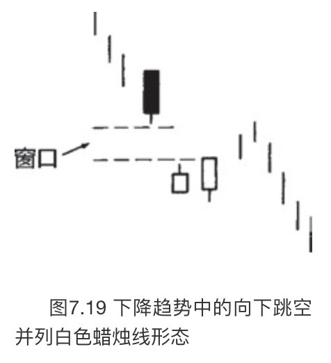

上面介绍的这种并列白色蜡烛线形态是很少见的。不过，更少见的还有向下跳空的两根并列白色蜡烛线。这类形态称为向下跳空并列白色蜡烛线形态（如图7.19所示）。在下跌行情中，尽管它们都是白色蜡烛线，因为之前向下的窗口，依然把它们归结为看跌信号。这是因为这两根白色蜡烛线被看作空头平仓的过程。一旦空头平仓的过程完成了，价格就要进一步下跌。这类向下跳空并列白色蜡烛线形态之所以特别罕见，其原因不难理解。在市场下降趋势中，当出现向下跳空时，如果形成跳空的蜡烛线是一根黑色蜡烛线，那么当然比一根白色蜡烛线自然得多。

虽然下面也为这些形态提供了实例，但是形成跳空并列白色蜡烛线形态的蜡烛线的具体情况并不重要，无须死记硬背。重要的是形态中所包含的向上或向下的窗口。正如本章在并列跳空阴阳线形态的部分曾讨论的那样，这两根蜡烛线的样式并没有多少影响，无论窗口之后的两根蜡烛线都是白色的（在跳空并列白色蜡烛线形态下），还是一根白色一根黑色的（在跳空并列阴阳线形态下）。唯有窗口本身提供了趋势信息，以及支撑区域或阻挡区域。

举例来说，在向下跳空并列白色蜡烛线形态中，尽管这是两根白色蜡烛线，依然构成看跌信号。这并不奇怪。其原因正在于本形态包含向下的窗口，它定义了趋势方向（在本例中，趋势方向向下）。市场必须收市于向下的窗口顶边之上，才能消除向下跳空并列白色蜡烛线形态的看跌意义。

这个例子意味着：我们不必费劲记忆神秘的跳空并列阴阳线形态和跳空并列白色线形态到底是什么样式。**窗口，才是关键因素。不论向上的窗口还是向下的窗口，窗口之后的两根蜡烛线的具体组合与颜色配合无关宏旨。向下的窗口推动趋势向下，向上的窗口推动趋势向上，并且窗口分别构成阻挡或支撑区域**。

如图7.20所示，5月的头两个交易日形成了一个向上跳空并列白色线形态。前面曾经说过，在该向上跳空并列白色线形态中，两根蜡烛线的颜色并没有什么大不了的，5月1日向上打开的窗口才真正决定了该形态的积极信号。

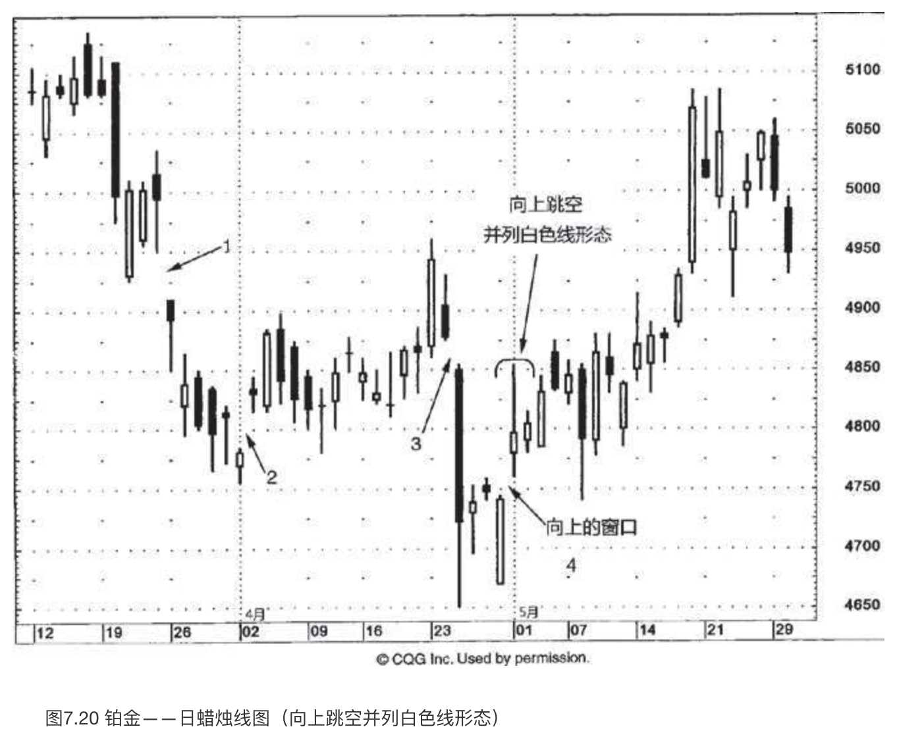

因为本图中包括许多窗口的实例，以下逐一分别讨论。

* 1处是一个向下的窗口，它维持趋势向下。尽管形成该窗口的3月26日是一根锤子线，也不影响上述判断。在窗口与其他形态之间进行取舍时，我通常选择窗口。就本例而言，是要在看涨的锤子线和看跌的向下的窗口之间取舍。向下的窗口所造成的看跌前景优先于锤子线。市场必须收市于窗口之上，才能确认锤子线的看涨前景。
* 2处是一个小型向上的窗口。在4月4日和5日形成的乌云盖顶形态之后，行情小幅回落，该窗口此时成为支撑。4月10日的十字线（正处在该窗口的支撑水平上）反映了两个方面的情况：第一，2处的窗口发挥了支撑作用；第二，十字线之前接连出现三根黑色实体，证明行情处在下降趋势，十字线的出现表明股票行情已经挣脱了之前的下降趋势。
* 经过4月10日成功捍卫窗口2的支撑作用后，行情开始上涨。上涨行情持续到4月23日，达到495美元的阻挡水平后停顿。该阻挡水平来自向下的窗口1的顶边。从该阻挡水平处引发的下降行情打开了3处向下的窗口。4月25日是一根长黑色实体，之后跟着一根小实体，后者居于长黑实体内部，形成了一个孕线形态。这表明空头正在失去动力。
* 5月1日形成了向上的窗口，之后是两根小的白色实体。（这就形成了之前介绍的向上跳空并列白色线形态。）在向上跳空并列白色线形态之后，行情演变成“窗口大战”，上有3处向下的窗口的阻挡作用（大约488美元），下有4处的向上的窗口的支撑水平（大约475美元）。我们看到，在一周多的时间里，上述支撑和阻挡区域都保持完好，直到4月17日，需求才足够强大，以收市价将市场推升到了向下的窗口3的阻挡水平之上。（4月14日，市场曾经在日内的行情演变过程中推进到了该窗口之上，但是未能收市于之上——这样便维持了窗口阻挡作用完好无损。）自从突破该阻挡水平之后，市场快速上涨，直到5月18日和21日形成了孕线形态，终结了这轮上冲行情。

## 上升三法（上升三蜡烛线法）和下降三法（下降三蜡烛线法）形态

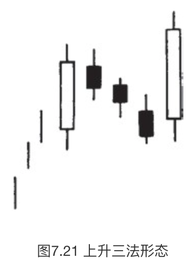

所谓**三法形态**，包括看涨的**上升三（蜡烛线）法**，以及看跌的**下降三（蜡烛线）法**。（请注意，这里我们又与数字3不期而遇了。）这两类形态均属于持续形态。也就是说，一旦看涨的上升三法形态完成后，之前的趋势应当恢复，行情继续走高。相应地，在看跌的下降三法形态完成后，之前的下降趋势继续有效。

上升三法形态（如图7.21所示）由以下几个方面组成：

1. 首先出现的是一根长长的白色蜡烛线。
2. 在这根白色蜡烛线之后，紧跟着一群依次下降的或者横向延伸的小实体蜡烛线。这群小实体蜡烛线的理想数目是3根，但是2根或者3根以上也是可以接受的，条件是：只要这群小实体蜡烛线基本上都局限在前面长长的白色蜡烛线的高点到低点的价格范围之内。我们不妨做这样的理解：由于这群较小的蜡烛线处于第一天的价格范围之内，它们与最前面的长蜡烛线一道构成了一种类似于三日孕线形态的价格形态。（在本形态中，所谓处于最前面的蜡烛线的价格范围之内，指的是这群小蜡烛线均处于该蜡烛线的上下影线的范围之内；而在真正的孕线形态中，仅仅是小蜡烛线的实体包含在前面那根蜡烛线的实体之内。）小蜡烛线既可以是白色的，也可以是黑色的，不过，黑色蜡烛线最常见。
3. 最后一天应当是一根坚挺的白色实体蜡烛线，并且它的收市价高于第一天的收市价，同时其开市价应当高于前一天的收市价。

本形态与西方技术分析理论中的看涨旗形或看涨三角旗形形态有相似之处。不过，上升三法形态的理论起源可以上溯到18世纪。一般认为，三法形态代表了买、卖之外的第三种情况——休息，也代表了牛熊之争的一次休战。用更时髦的说法来形容：市场通过这一群小蜡烛线，获得了一次“喘息的机会”。

下降三法形态（如图7.22所示）与上升三法形态完全是对等的，只不过方向相反。这类形态的形成过程如下：市场应当处在下降趋势中，首先出场的是一根长长的黑色蜡烛线。在这根黑色蜡烛线之后，跟随着大约3根依次上升的小蜡烛线，并且这群蜡烛线的实体都局限在第一根蜡烛线的范围之内（包括其上、下影线）。最后一天，开市价应低于前一天的收市价，并且收市价应低于第一根黑色蜡烛线的收市价。本形态与看跌旗形或看跌三角旗形形态相似。本形态的理想情形是，在第一根长实体之后，小实体的颜色与长实体相反。也就是说，对看涨的上升三法形态来说，应当是黑色的小实体；而对看跌的下降三法形态来说，应当是白色的小实体。虽然如此，从我的经验出发，2根，至多5根小实体都可以很好地完成形态。同时，小实体可以是任意颜色的。

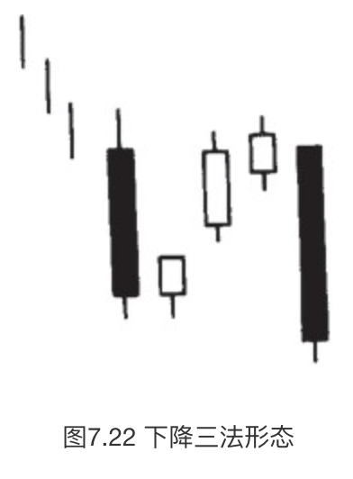

在理想的上升三法形态中，应有3根黑色小实体，且它们都位于白色实体的全部交易范围之内。在图7.23中，8月13日出现了一根看涨的捉腰带线。在它之后跟随着4根黑色小实体（其中一根是十字线），它们都位于8月13日的高点到低点范围内。8月21日的收市价完成了上升三法形态。

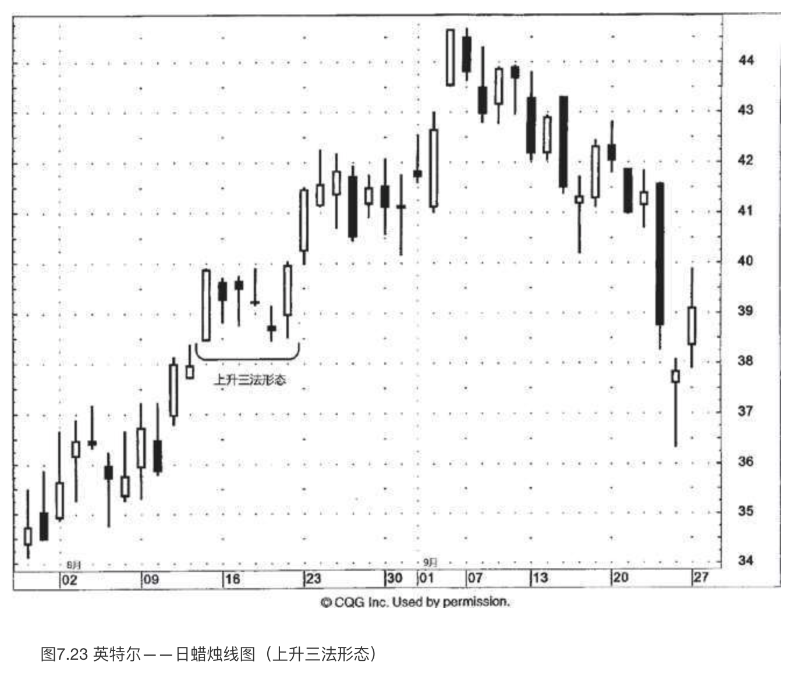

上升三法形态给我们带来的挑战在于风险报偿比方面。等到上升三法形态完成之时，股票行情或许已经远远地离开它最近的低点了。在这种情况下，如果等到三法形态完成时买进，或许不能带来有吸引力的交易机会。如此一来，一旦上升三法形态完成，交易者必须首先考虑到潜在的利润空间，把它与风险权衡一下（风险从买入点算起，到上升三法形态中开始的那根白色蜡烛线的最低点为止）。

如图7.24所示，10月的第一个周，橙汁市场是一根拉长的黑色蜡烛线，将行情打到新低。下一个时段，橙汁重新回升到69美分以上，表明前一周所创的新低不能持续。正如我们将在第十一章看到的，当市场向下突破重要的支撑区域（本市场向下突破了8月—9月的低点，这正是一个重要的支撑水平），后来却不能守住新低，这一现象常常具有看涨的意味。

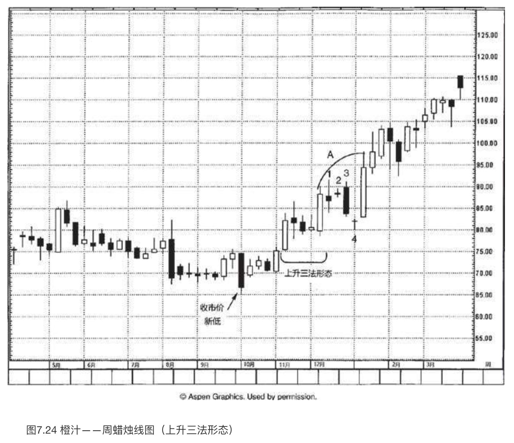

11月的第二周是一根长长的白色蜡烛线。接下来的一周是一根小实体，这就证明市场疲软了，此时市场正面临来自5月的接近85-87美分的阻挡区域。一群小实体通通躲在11月的第二根长长的白色蜡烛线的范围内。在12月出现了一根长长的白色蜡烛线之后，我们就得到了一个上升三法形态。（请记住，只要那群小实体维持在之前白色蜡烛线的全部交易范围内，即使它们的影线冒出白色蜡烛线的范围，也是可以接受的。）

在上升三法形态之后，市场在12月剩下的时间里横向延伸，直到一根拉长的白色蜡烛线将多头行情推回正轨。这根拉长的白色蜡烛线紧随着一根十字线（图上用数字“4”标记）。有人可能已经注意到，图上标注“A”的区域看起来与上升三法形态非常相似，因为从1到4的几根实体都藏身于之前那根白色蜡烛线的范围内。由于上升三法形态要求由小实体组成，长实体3不符合要求，意味着它不属于上升三法形态。

在图7.25中，3月30日和31日股票走低，不过下跌过程是一系列非常小的实体，几乎成十字线了。这使得当前趋势不那么悲观。4月1日出现了看涨吞没形态，显示多方现在主宰行情。之后的四天，市场进行了一定程度的调整，其中黑色小实体和白色小实体交替出现。4月10日的蜡烛线完成了上升三法形态。

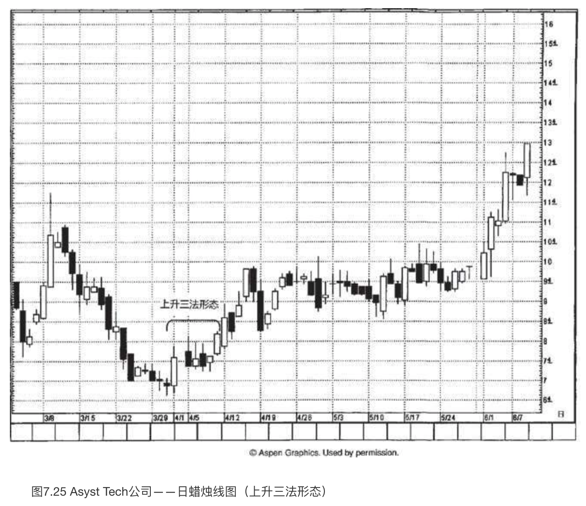

现在我们来观察一个实例，其中展示了交易量分析与上升三法形态相结合的具体做法。在理想的上升三法形态中，第一根蜡烛线和最后一根蜡烛线，即那两根长的白色蜡烛线，伴随着在上升三法的所有交易时段里最大的交易量。这一点为每一根白色蜡烛线都提供了验证信息，表明多方对市场的控制力更强大。在图7.26中，6月17日是一根长长的白色蜡烛线，伴随着相对强大的交易量。不仅如此，这根蜡烛线与之前的两根还组成了一个十字启明星形态。

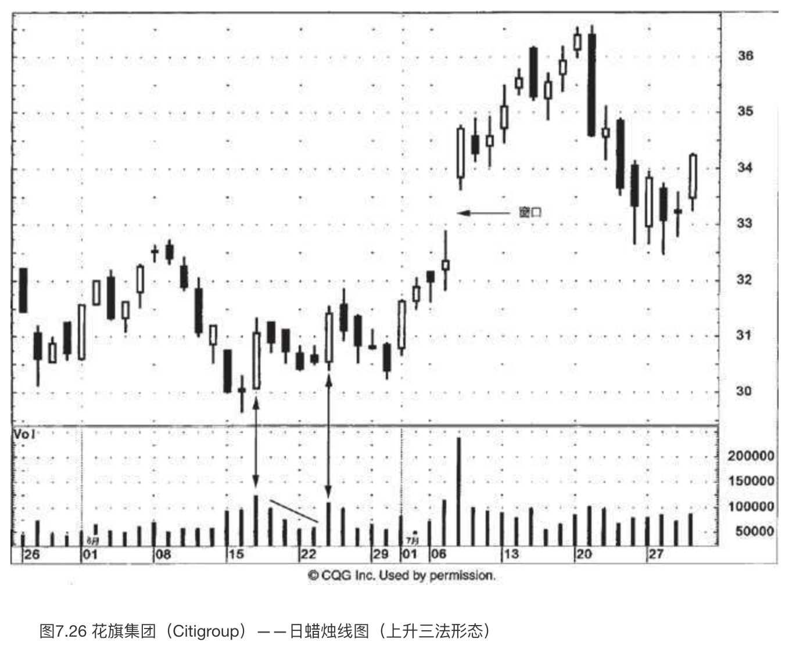

在6月17日的白色实体之后，一系列小实体向下缓缓飘落，同时伴随的交易量也逐步收缩。6月24日是一根高耸的白色蜡烛线，伴随着放大的交易量，将市场推向更高处，也完成了上升三法形态。本图是一个经典实例，说明将交易量分析与蜡烛图指标结合起来，可以进一步增大蜡烛图指标的成功概率。

在6月24日的白色蜡烛线之后，出现了一根黑色实体，两者形成了一个小型的乌云盖顶形态，引发了短暂的行情犹豫，之后上涨行情恢复。请注意，7月8日当市场向上打开窗口时，也伴随着巨大的交易量。伴随发生的巨大交易量提升了窗口的成功概率，窗口，特别是窗口的底边，将成为支撑区域。（交易量在第十五章讨论。）

在绝大多数情况下，上升三法形态发生在上升趋势或横向延伸趋势中。不过，有时候本形态也有助于界定在抛售行情之后出现的转折点。图7.27给出了本形态的另一个实例。9月初的上升三法形态有助于确认7500附近的支撑水平是稳固的。不过，在这个上升三法形态出现后，市场并没有立即开始上涨。虽然蜡烛图信号经常发出市场转折的信号，**但是它们并不意味着在信号出现后市场必定立即开始上涨**（在上升三法形态的情况下）。取而代之的是，许多蜡烛图形态的出现，正如本图的这个实例，可能加强了某个支撑区域。这正是道琼斯指数位于7500附近的支撑水平处发生的情形。9月中旬出现了一例刺透形态，10月4日出现了一根锤子线，累次证实了该支撑水平的有效性。

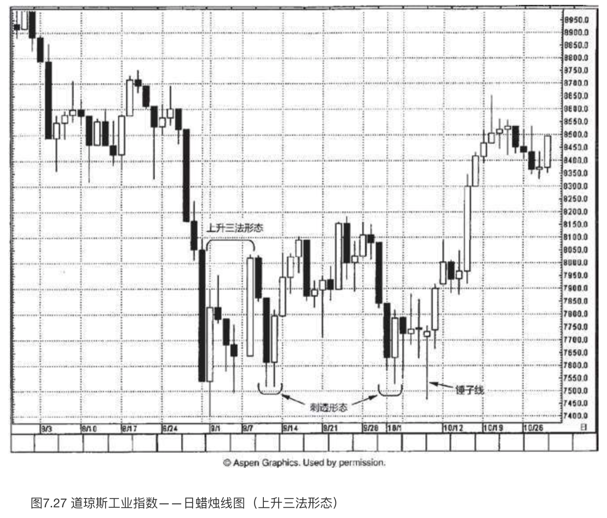

**蜡烛图形态或蜡烛线在更大的市场背景下到底出现在什么样的位置，常常比蜡烛图形态本身更为重要**。举例来说，如果一个看涨吞没形态出现的位置接近某个阻挡水平，那么从风险报偿比的角度来看，在形态完成时买入并没有多大的吸引力，因为这是在阻挡水平处买进的。

图7.28的实例揭示了总体市场技术图像与一个上升三法形态的相互关系。12月14日和15日之间形成了一个小型窗口，在之后的下半周内成为支撑区域。从12月20日开始出现了一轮上涨行情，它在到达60美元附近时遇到了一些问题，12月23日和27日组成了一个孕线形态。12月29日收市时，股票形成了一个上升三法形态（它包含2根小实体，而不是在常规情况下的3根小实体）。但是看看这个形态所处的位置，这正是60美元的区域——这是自12月7日以来的阻挡水平。于是，尽管上升三法形态被视为看涨信号，但是我们应当牢记在心，因为它出现在阻挡区域，所以不能构成有效的买入机会。1月11日，当市场收市于60美元的阻挡区域之上时，才能为市场继续上行扫清障碍。

图7.29展示了一个下降三法形态的实例。请注意，本形态的第一根小实体出现在5月18日，它已经超出了之前那根长黑色实体的界限。不过，这一点并不妨碍这个下降三法形态的成立，因为本形态要求的是小实体应当藏身于那根长黑色实体的全部交易区间之内，而不必限定在它的实体之内。

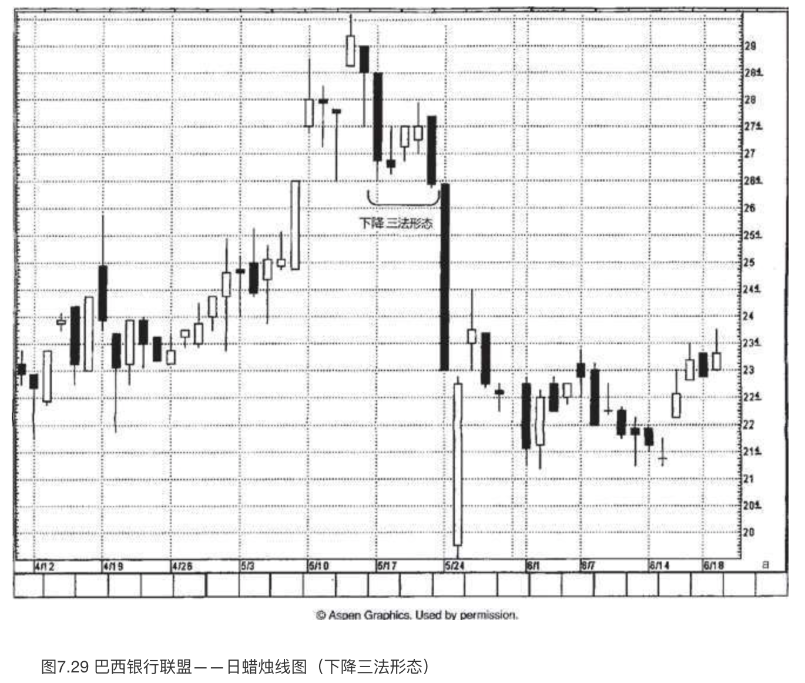

5月21日的黑色实体收市于5月17日的黑色实体之下，满足了下降三法形态的条件。5月25日的反弹行情令人印象深刻，当日股票的开市价急剧下跌，但是收市价与前一日相比几乎没有变化，几乎形成了一个反击线形态。虽然该白色蜡烛线的收市价并没有恰好处在5月24日收市价的同一个水平，但是5月25日从开市到收市的强力反弹足以具备与常规的反击线形态同等的技术意义。

在图7.30中，世通公司跌破了维持数月的接近38美元的支撑区域，它发生于8月的第一周。8月初出现了一轮小规模的上涨行情，将股票吃力地推回之前位于38美元的支撑区域处。但好景不长，反弹在此处化为泡影。（第十一章将介绍原来的支撑水平转化为新的阻挡水平的分析技巧。）9月的价格变化形成了一个下降三法形态。

## 分手线形态

在第六章，我们曾经研究了反击蜡烛线形态。回忆一下，反击线形态是一种双蜡烛线形态，前后两根蜡烛线颜色相反，并且后一根蜡烛线的收市价与前一根的收市价处于同一水平。这一形态属于反转信号。如图7.31所示的分手线形态也是由两根颜色相反的蜡烛线组成的，但是同反击线形态不同的是，**分手线形态**的两根蜡烛线具有相同的开市价。

分手线形态属于持续信号。道理很简单。在市场上涨的过程中，如果出现了一个黑色实体（尤其是相对较长的黑色实体）时，对多头来说，可能成为他们的一块心病。他们满腹狐疑，空头或许正在争得主动权。无论如何，如果后一天市场在开市时向上跳空，开市价回到了前一根黑色蜡烛线的开市价的水平，就能有力地证明空头已经失去了对市场的控制——特别是当天能够收市在较高位置，形成了一根白色蜡烛线。上述情形就是如图7.31所示的看涨分手线形态的演变过程。在这类形态中，白色蜡烛线同时还应当是一根看涨捉腰带线（即其开市价位于或接近本时段最低点，收市价位于或接近本时段最高点）。在图7.31中，看跌的分手线形态与上述内容完全对应，但方向相反。一般认为，这类形态属于看跌的持续形态。分手线形态难得一见。

在面对蜡烛图形态的时候，在绝大多数情况下我们希望遇到理想的版本，而不是变形的版本。不过，即使是变形的版本，结果证明也是有用的。图7.32说明了这一点。7月中旬出现了一个看跌吞没形态（B处），引领了一轮下跌。该下跌行情发展到8月3日完成的看涨吞没形态后才算罢手。紧随8月3日白色蜡烛线之后的两根蜡烛线差不多构成了一个看涨的分手线形态。这是因为8月7日的开市价几乎与前一天的开市价相同，但不处于同一水平。虽然如此，考虑到8月4日股票收市于46.25美元，而后一天（8月7日）在开市时便向上急剧跳空，几乎达到了8月4日的开市价的水平，毫无疑问，这一变化很引人注目。如果我们对这一点还不满意，还要求更多看涨的证据，8月9日它就来了——一个向上的窗口，证明此处需求压倒了供给。

在图7.33中，在8月的第二周里发生了看跌分手线形态。在该看跌分手线形态之后，股票在来自8月初的接近29美元的支撑区域稳住了阵脚。8月15日打开了一个向下的窗口，证实新的一轮下跌来临。

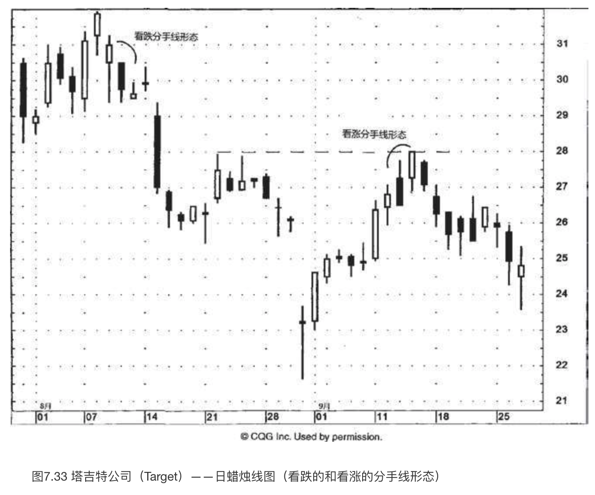

9月13日和14日组成了一个看涨的分手线形态。但是，它们发出的上涨行情持续的信号未能应验。当然，我们对这一点并不感到太大的意外，因为看涨分手线形态的白色蜡烛线处在28美元处。这里正是8月21日所在的一周里形成的阻挡水平，图上用虚线做了标记。这个例子再一次说明，在定夺是否根据蜡烛图信号来买卖的时候，蜡烛图信号发生的位置是主要考虑因素。在本例中，如果我们在看涨分手线形态完成时买入股票，就会在阻挡水平处买进。在这种情况下，稳妥的对策或许是等到股票收市于28美元以上，作为进一步的看涨验证信号。

看涨分手线形态难得一遇，它们通常出现在上涨过程中，然而也有少数例子表明看涨分手线形态有助于发出底部信号。如图7.34所示，3月24日和25日出现了一个看涨分手线形态。该形态出现后，股票行情陷入犹豫，位置接近43.50美元。4月5日，一旦股票在43.50美元的阻挡区域之上向上打开了一个小型的窗口后，就不再犹豫了。

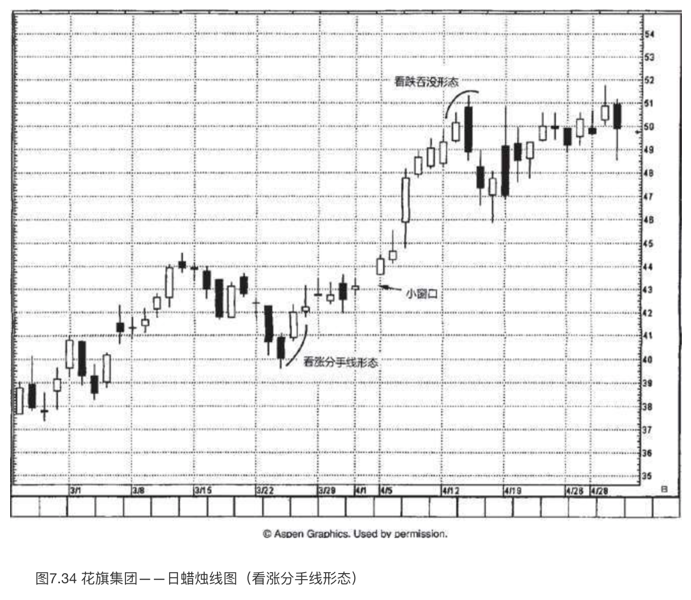

有趣的是，从3月25日到4月5日的向上跳空，这群蜡烛线组成了一个高价位跳空突破形态。4月的上冲行情一直持续到4月14日和15日的看跌吞没形态才罢手。
