# 测算价格目标

`“机不可失，时不再来”`

蜡烛图就像X光，帮我们透视出市场供给和需求双方的力量对比，因此有能力及早地提供市场反转信号。假定某位交易者已经按照蜡烛图信号入市（最好得到了其他蜡烛图信号或者西方技术信号的验证），那么下一步的挑战就是弄清楚何时应当出市。

我的公司的网址是<https://www.candlecharts.com>。我们用多种出市策略，根据客户的交易风格，因人而异地提供服务。运用常规的西方技术形态来预测价格目标，是我们的方法之一。之所以要把价格目标测算与蜡烛图技术相结合，还有另一个原因。无论蜡烛图形态多么理想，无论在某个区域发生了多少反转信号，蜡烛图技术都不提供对反转之后价格范围的预测。正是在这种情况下，我们转向西方技术工具，以寻求价格目标。

本章介绍了测算价格目标的手段，从前面介绍的许多形态中选择少数典型的案例来加以应用，包括箱体区间的突破信号、对等运动、旗形、尖旗形，以及上升三角形与下降三角形等。

价格目标并不等同于支撑水平或阻挡水平。举例来说，如果上方的价格目标为42美元，这并不意味着上涨行情将在到达42美元后戛然而止（当然，市场也可能甚至到不了42美元）。据我个人的看法，我们不应当根据价格目标来建立新头寸，而是应当把已经持有的敞口头寸适当平仓。在前面讨论的例子中，当市场上冲到42美元区域时，我会轧平多头头寸，但不会开立新的空头头寸。当然，如果除此之外还有看跌的蜡烛图信号，或者有其他技术分析信号与价格目标不谋而合，显示42美元是一个阻挡区域，我们就可以更进取一点，考虑卖出做空。

## 箱体区间的突破信号

在绝大多数时间里，市场并不处在趋势状态，而是处在横向的波动区间中。日本人称之为**“箱体区间”**。在这样的情况下，市场就达到了某种相对和谐的状态，牛方和熊方相安无事、平分秋色。在日文中，用来描述安宁和平静的词是“和”。当市场处于横向的交易区间中时，我喜欢将这种状态看成一种“和”的状态。

当市场处在横向的波动区间时，就像一根压缩了的弹簧，随时准备在周边压力撤除后立刻弹开。我们可以利用该形态储蓄的能量。当市场从横向波动区间突破时，往往具备充足的能量储备，能按照突破方向持续推进。

如图16.1所示，当行情突破到箱体之外时，意味着接下来行情运动的幅度至少等于箱体的垂直高度。具体说来，当行情推进到箱体顶部之上（属于看涨的突破信号）后，我们测量箱体区间的底部（支撑水平）到箱体区间的顶部（原先的阻挡水平）两者之间的竖直距离。该距离即为箱体的高度，图上用A—B做了标记。将A—B的箱体高度加到原先的阻挡水平上，推算突破后的价格目标。举例来说，假定箱体区间处于50-53美元之间，那么向上突破后的价格目标便为56美元。

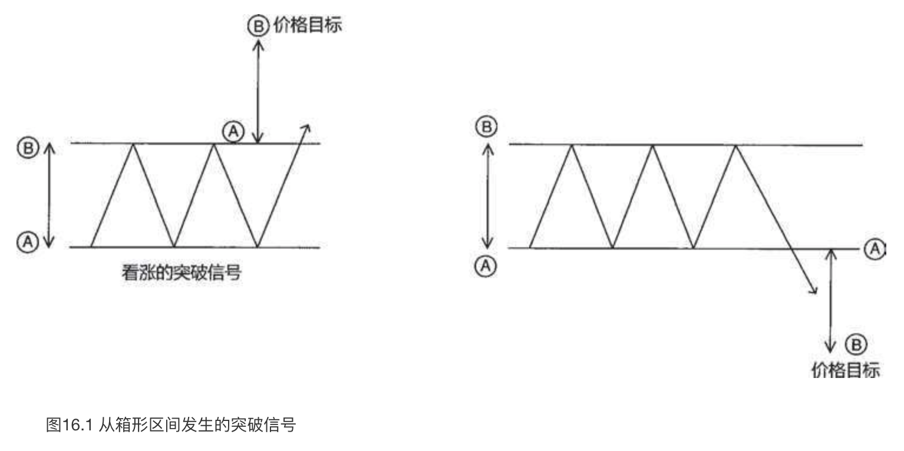

向下突破箱体区间的支撑水平属于相反的情形（在图16.1中显示为看跌突破信号的情况）。如果还是以处于50-53美元的箱体区间为例，那么在50美元的支撑水平处发生看跌的突破信号之后，价格目标为47美元。

在图16.2中有一处箱体区间，其中区域1和2构成了其区间的顶部。箱体的底部（支撑区域）用两条水平直线勾勒出来，它们分别位于3600和3500（一会儿再讨论区域A处的情况）。

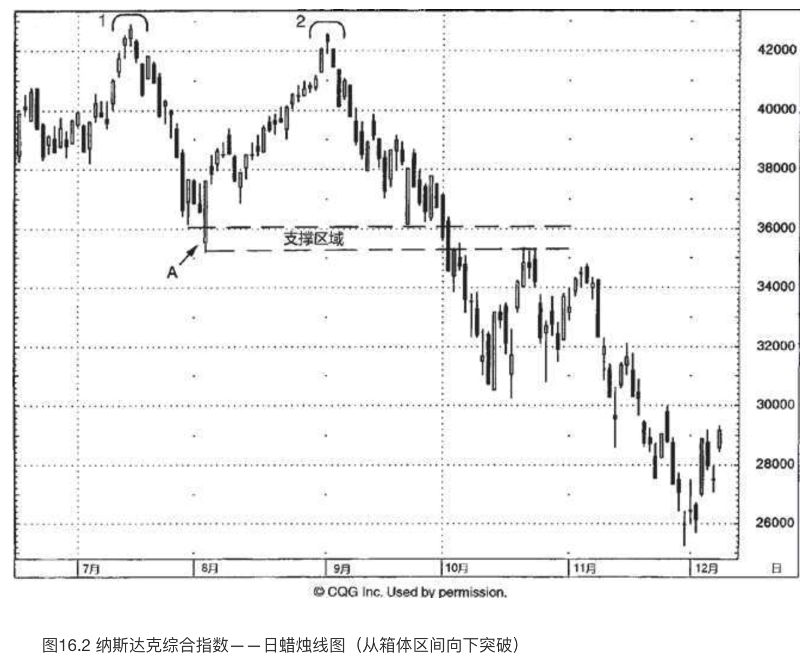

位于1处的顶部没有任何蜡烛线反转信号。这说明了不是所有的反转过程都具备蜡烛图反转信号。位于2处的顶部是一个理想的反转过程，一个黄昏星形态，因为其中的三根蜡烛线互不接触。此外，2处的高点是一根上吊线，并且它得到了次日行情的验证。

**一旦纳斯达克综合指数从2处折戟回落，因为这是从先前的高点1处发生的，我们就可以判断行情将进一步下降到高点1和2之间的低点处**。该低点是位于A处的一个看涨吞没形态。如此一来，我们就得到了大致位于3500-3600之间的价格目标。在9月的下半月里，该区域得到了良好的守护，在3600附近形成了几根高高的白色蜡烛线。

10月初，市场向下突破了该支撑区域，带来了双倍的破坏效应。首先，10月2日的长黑色实体向下击穿了位于A处的看涨吞没形态低点所构成的支撑水平。其次，可能更严重的是，上述巨大箱体的底部位于3500-4250，一旦底部被向下突破，则价格目标指向了2750。其测算过程如下：箱体高度为750点（从箱体的高点到低点的垂直距离），箱体底部接近3500，从箱体底部减去箱体高度得到了价格目标。几个月之后，市场到达了上述价格目标。

我们可以看到，后来的价格运动低于2750的价格目标，因此价格目标并不必然构成支撑水平。这一点非常重要，值得仔细推敲。尽管纳斯达克综合指数跌到了2750，但是绝不能仅凭行情达到了价格目标便买入做多。

本图还揭示了我喜欢箱体突破信号的原因。一旦某个支撑水平被跌破，我们便可以根据**极性转换原则**（请参见第十一章）来判断，该水平将转为阻挡水平。根据这项技巧，原先的支撑区域（在本例中位于3500-3600）应当转化为阻挡水平。这正是这里按部就班上演的情形。如果指数以收市价的方式回升到3600以上，那么我们对下方的价格目标设定为2750的判断便无效了。

图16.3展示了一例清晰定义的横向波动区间，其范围从66.25美元到67.75美元。A处的蜡烛线一度向下穿越了该支撑线，但是既然它的收市价并不低于支撑线，支撑水平依然保持完好。到了B处，市场终于以收市价形式向下突破了箱体区间的下边界。这是一个看跌的信号。在行情于B处向下跌破之前，我们曾更早得到线索，表明股票陷入了麻烦。线索来自图示的向下倾斜的阻挡线。这增加了位于66.25美元的支撑水平终将被向下突破的可能性。

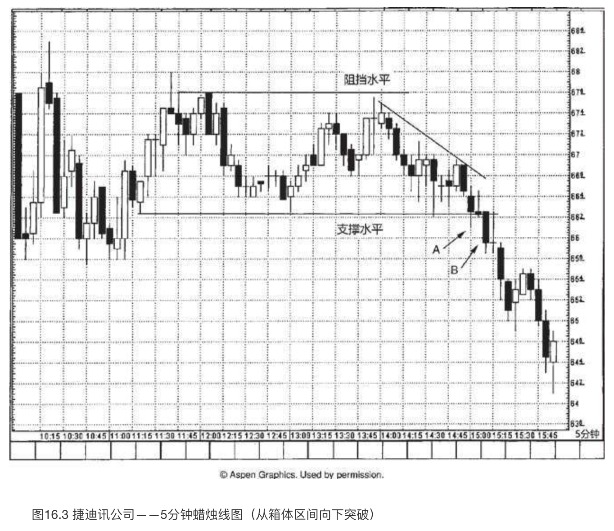

一旦在B处的蜡烛线表明支撑水平已经失守，我们便得知（根据极性转换原则），原先的支撑水平66.25美元，现在转变为阻挡水平了。于是，我们就有了一个阻挡水平，不过下方的价格目标在哪里呢？为了达到这个目的，我们采用了箱体区间的垂直距离，即从66.25-67.75美元的距离是1.50美元。从交易区间的下边缘减去上述距离，得到下方的价格目标为64.75美元。

如图16.4所示，标准普尔500指数曾经处在交易区间中横向波动，其低点大致位于1090（B处），高点大致位于1140（A处）。多头在6月24日将本指数推升到了1140的阻挡水平之上。箱体的A—B的垂直距离为50点，加到1140上，我们得到了上方的价格目标为1190。股票沿着一条向上倾斜的阻挡线（请参见第十一章）上升，向上稍稍超越了上述价格目标。在1200附近出现了几根**大风大浪蜡烛线**（所谓大风大浪线，指同时具备长长的上、下影线和小实体的蜡烛线。这类蜡烛线与长腿十字线有一定的相似性，其区别是长腿十字线是一根十字线，而不是一个小实体。第八章曾有介绍）。这些大风大浪线给我们带来了一种直观的感受：**市场失去了方向感**（而在这之前原本是向上的）。

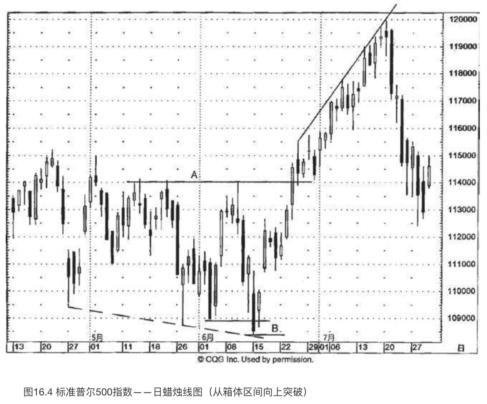

如图16.5所示，得克萨斯仪器公司一度局限在130-145美元的箱体区间中波动。2月17日和18日，当它向上接近该区间的顶部时，形成了一个看跌吞没形态。本形态应当构成阻挡水平。然而，下一个时段（2月22日）市场向上超越了这个阻挡水平。这构成了看涨的突破信号，既向上突破了看跌吞没形态的阻挡水平，也向上突破了箱体区间的顶部边缘。这意味着上方的价格目标接近160美元（根据波动区间15美元的垂直距离测算）。

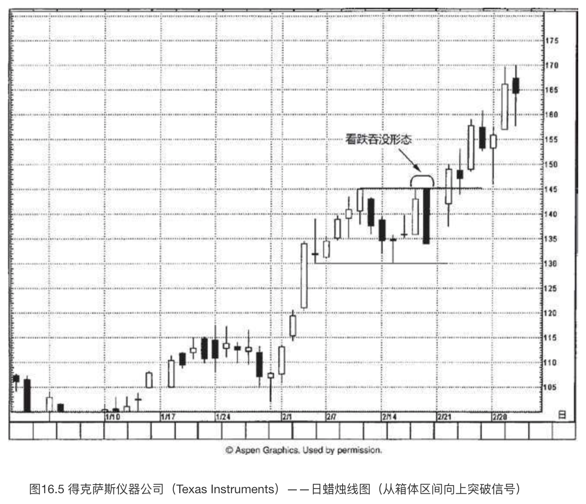

借助什么样的证据可以表明我们对上述价格目标的判断是错误的呢？市场在2月22日已经向上突破了145美元的水平，如果此后再以收市价形式跌回145美元之下，那么这种情形将打消上述价格目标的前景。换句话说，一旦市场已经创了新高，那么重要的一点是，牛方就必须维持上述新高，以此证明己方真正掌控大局。

## 对等运动、旗形与尖旗形（三角旗形）

对等运动、旗形与尖旗形都是由以下三个部分组成的。

1. 起初，发生了一轮轮廓清晰的快速运动（第一波）；
2. 在上述运动后，市场进入调整过程；
3. 调整结束，市场按照最初的方向恢复本来的趋势运动（第二波）。

首先，我们来看**对等运动的价格目标**，然后讨论**旗形**和**尖旗形**的情况。

所谓**对等运动的价格目标**（如图16.6所示），道理是这样的：**如果市场先是猛力地上涨或下跌，继而对上述运动展开调整行情，那么最终当原先的行情恢复后，下一波行情运动至少应当与起初的猛力运动所形成的轨迹不相上下。**

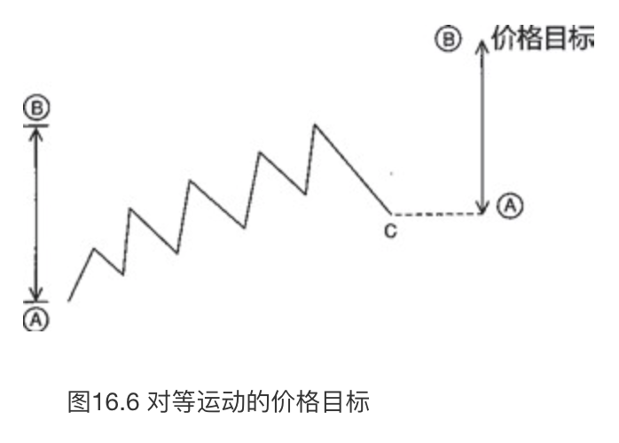

图16.6对上述过程做了解析，其中第一波的高度是从A到B的上冲行情的高度。之后，出现了调整过程，市场回落到C。一旦市场从C开始上升，我们就可以将起初第一波行情从A到B的高度叠加在调整阶段的低点C之上。由此得到了所谓的“**对等运动的价格目标**”。

**对等运动的价格目标**与**旗形**、**尖旗形**的概念颇有异曲同工之妙。主要区别在于，在对等运动中，调整过程回落的幅度远比旗形或尖旗形更重要。如图16.7所示，旗形出现在轮廓清晰的急速上涨或剧烈下跌行情之后，旗形的图形呈水平状，或者稍稍偏向与趋势相反的方向。这段密集区起到了减缓市场超买状态（在上冲行情中）的作用，或者起到了中和市场超卖状态（在急跌行情中）的作用。在这段短期调整过程之后，如果市场恢复了之前的趋势，我们就得到了旗形或尖旗形价格形态。

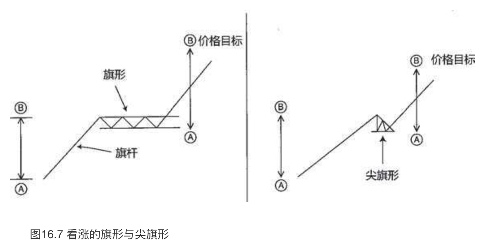

旗形与尖旗形的区别在于，在旗形中，“旗帜”的部分是一个水平的箱体区间；而在尖旗形形态中，“旗帜”的部分（也就是调整过程的密集区）看起来像一面三角旗，因为它带有更低的高点和更高的低点。

图16.7和图16.8分别展示了看涨的旗形、尖旗形，以及看跌的旗形、尖旗形的价格目标测算过程。它们的测算依据构建在与对等运动共同的理论基础之上。就旗形与尖旗形而言，我们采用的是起初的上冲行情或急跌行情的高度——其外号是“**旗杆**”。

在图16.7中我们看到，看涨的旗形和尖旗形的价格目标计算方式是：**先计算起初的急剧上涨行情（旗杆）从A到B的高度，然后把它加到密集区（旗形或者尖旗形均可）的底边上**。更传统的做法是，把旗杆的高度加到旗形或尖旗形的顶边上。我宁愿错在过早地平仓退出，也不愿意错在精确追求最后那一哆嗦行情。因此，我的测算方法是从旗形或尖旗形的底边起算，而不是传统的从顶边起算。

正如图16.8所示，**看跌的旗形和尖旗形的价格目标计算方式是：先计算起初的急速下跌行情（旗杆）从A到B的高度，然后从密集区（旗形或者尖旗形均可）的顶边减去上述高度**。（重申一下，这样的做法也出自我的主观选择，为的是保守起见。其他人或许采用更传统的做法，即把旗杆的高度从旗形或尖旗形的底边处减去。）

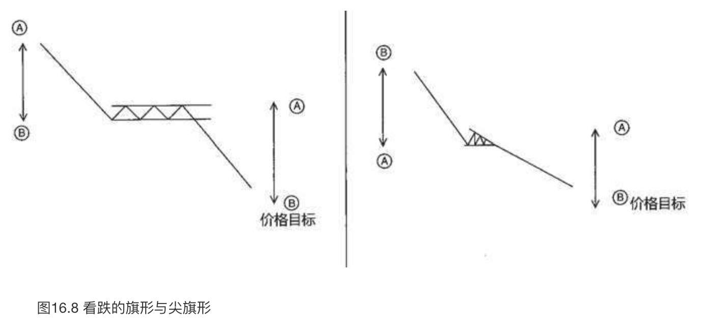

在图16.9中，从1处到2处形成了一波几乎垂直的上冲行情，把股票从22.50美元推升到27.50美元。从2处开始到A处的回落行情，几乎恰巧落在上冲行情的斐波那契比例61.8%的回撤水平上（请参见第十二章对百分比回撤水平的讨论）。从A处开始，股票开始了新一波上冲行情。

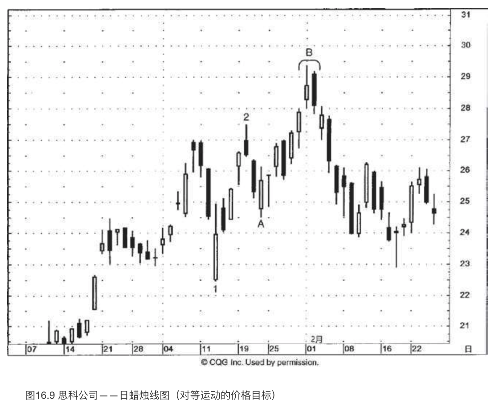

用1处到2处的上冲行情，以及随后发生的调整过程，我们可以得到对等运动的价格目标：从1处到2处的垂直距离为5美元，调整过程的低点A为24.50美元，把前者加到后者上，得到潜在的价格目标为29.50美元。

虽然测算的价格目标通常不会成为阻挡水平或支撑水平，但是在本例中我们看到，在B处，2月1日和2日组成了一个看跌吞没形态，正是出现在预测的价格目标29.50美元处。

在图16.10中，我们看到在从A到B的上升行情之后，股票大概花了一周的时间用来喘息。在这期间，市场进入了箱体区间，介于36.50美元到37.75美元。7月11日打开了一个向上的窗口（在蜡烛线C之后），将股票推升到前述横向交易区间之上。

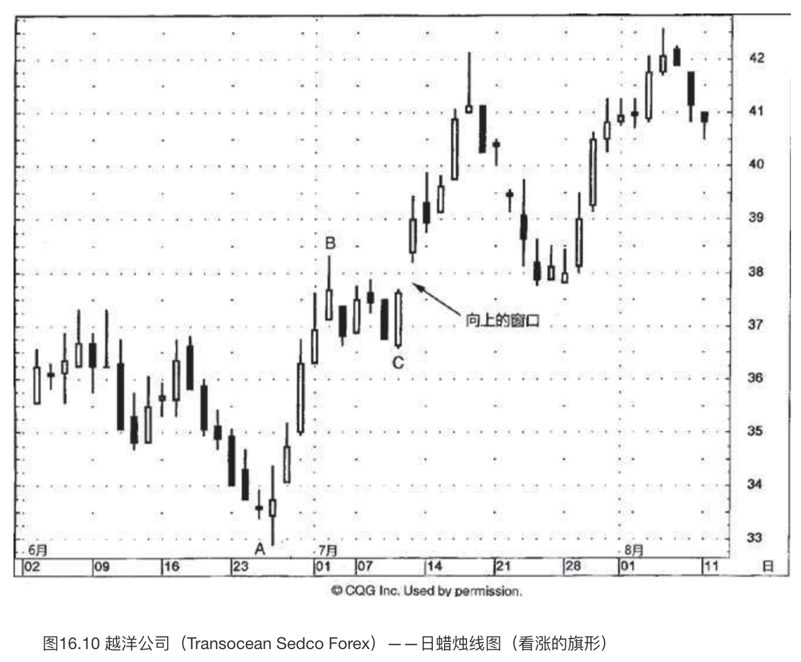

从蜡烛线的角度来观察，向上的窗口可谓一举两得：首先，它驱使趋势方向向上；其次，该窗口现在已经成为潜在的支撑区域。不过，虽然该窗口给我们提供了看多的基调，但是它并不提供上方的价格目标。为了解决这个问题，我们转向西方技术工具。仔细打量从A到B的上冲行情，以及回落到C处的调整过程，我们发现了一个看涨的旗形形态。现在，我们就能够得到一个价格目标了：将“旗杆”的部分（A到B的垂直高度）加到“旗帜”底部（C处）上。从A到B的上冲行情大约是5.50美元。把这个数值加到C处的低点之上，得到上方的价格目标为42美元。（前面曾经提到，在绝大多数讲授西方技术分析的书中，会将这里5.50美元的高度加到旗帜部分的顶边，接近38美元。但是，我们采取更为保守的测算方法，将之加到旗帜部分的底边，36.50美元处。）

在股票向上接近我们保守的价格目标42美元时，出现了一根流星线，使得价格目标成为阻挡水平。流星线之后的黑色蜡烛线完成了一个黄昏星形态，它是黄昏星形态的第三根线。由此开始，市场进入下降行情，持续到7月底，在接近37.75美元处找到支撑。这里是7月14日向上的窗口所形成的支撑区域。市场在此处形成了几根倒锤子线。从7月28日所在的一周开始，形成了一轮上冲行情，回升到前面讨论的黄昏星形态的高点，到大约42美元时，市场举棋不定。正如我们在黄昏星形态的部分所讨论的（还有其他许多蜡烛图形态），我一般根据收市价来观察市场在阻挡水平处的表现。股票在日内行情中一度向上推进到黄昏星的阻挡水平之上，但是在收市时却未能维持在其上，由此看来，该阻挡水平依然维持良好。

图16.11突出显示了A处的两根流星线。这标志着市场在925-950的区域陷入彷徨状态。从A到B的陡峭下跌遇到了B处的一根长腿十字线，从而转入徘徊。从这里开始，该指数稍稍有所回升。这有助于减缓之前市场的超卖状态。仔细看一下，从A到B的急剧下跌可以充当旗杆，从B到C的三角形波动区间可以作为尖旗形，于是，我们得到了一个看跌的尖旗形形态。

一旦尖旗形的底边被向下突破，我们就可以推算下方的价格目标，先算出从A到B的下降幅度，再从调整区间的高点C，接近775处，减去上述幅度。于是，下方的价格目标为525。后来，行情下跌超过了这个目标。

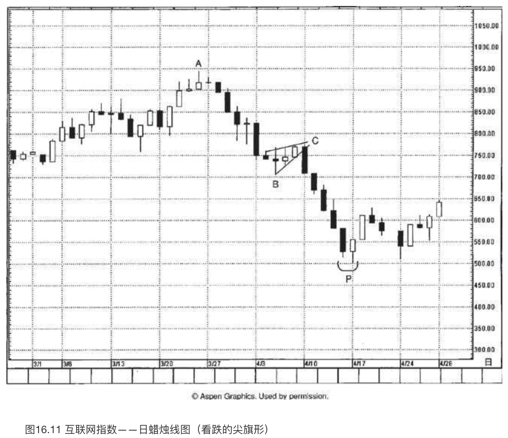

在P处，接近500的水平，出现了一个变形的刺透形态。之所以说这是一个变形，是因为其中的白色蜡烛线没有向上超越前一根黑色实体的中线。不过，在从C处开始的下降行情中，这是第一根白色蜡烛线，第一根收市价更高的蜡烛线，因此，我依然认为这个变体与常规的刺透形态同等重要。下一周，市场成功地捍卫了由该刺透形态形成的支撑水平，从而证实了上述判断。

在西方技术分析工具中，有多种三角形形态：**对称三角形**、**楔形**等。如图16.12所示，这里一个是**上升三角形**，一个是**下降三角形**。

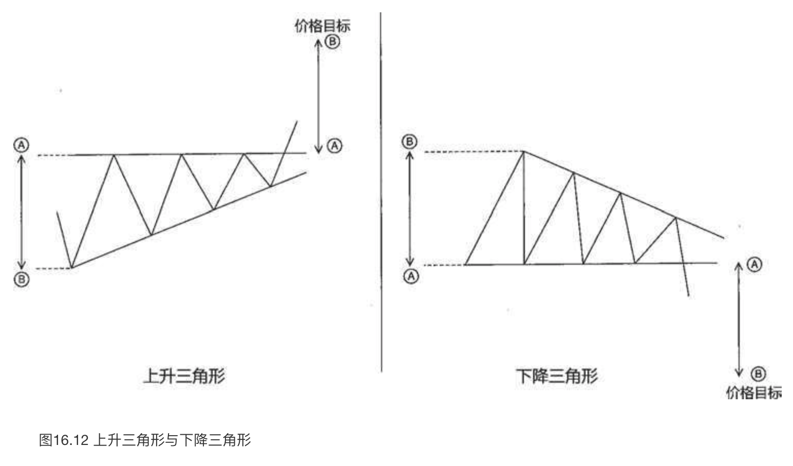

上升三角形的上边为水平的阻挡线，在形成形态的过程中被市场试探过多次。市场多次从该阻挡水平回落，形成的若干低点依次抬升。这种情形说明，虽然在阻挡线处存在供给压力，但是随着市场每次从阻挡线回落，需求逐渐增强。如果牛方能够推动市场向上超越水平的阻挡线，我们就得到了一个上升三角形形态。其测算方法是：**从水平的阻挡线（A处）出发，算出三角形最宽处（B处）的垂直高度，加到刚刚被突破的阻挡水平上。**

下降三角形的下边为水平的支撑线，曾经多次防守成功，但是每当市场从此处回升后，所形成的若干高点依次降低。这些依次降低的高点反映了熊方有能力控制牛方。一旦市场向下突破支撑水平，我们便算出下降三角形最宽处的垂直高度，从支撑水平处减去上述高度，得出下方的价格目标。

图16.13展示了一例经典的下降三角形。其水平线位于137，这条线定义清晰，曾经多次经受市场测试。这是下降三角形的底边。下降三角形的顶边是一条向下倾斜的阻挡线。

一旦空头一锤定音地将市场压低到137的支撑水平之下（图上箭头所指之处），我们就可以运用下降三角形的价格目标测算方法。三角形的最高点是从138.25开始的，三角形的底边位于137，于是我们得到了下方的价格目标是135.75。

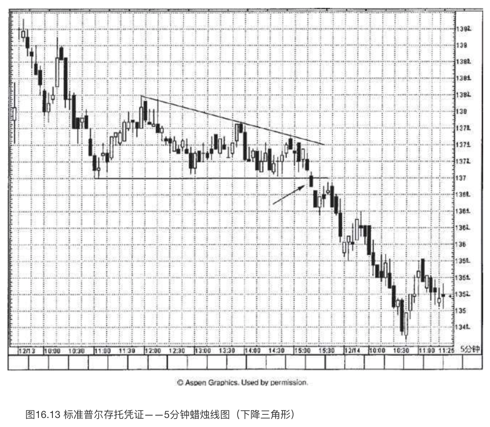

下降三角形有一个方面很有吸引力，即我们可以运用之前的支撑水平作为新的阻挡水平（极性转换原则）。因此一旦空头将价格压低到137之下（箭头处），如果市场果真是疲软的，我们就有把握得知137将成为阻挡水平。

在本例中，关于行情陷入泥潭还有进一步的验证线索，当价格移动到137之下后，后一日打开了一个向下的窗口。相应地，就137成为阻挡水平的判断，我们得到了相互验证的双重技术要素：**先前的支撑水平，以及向下的窗口。**
