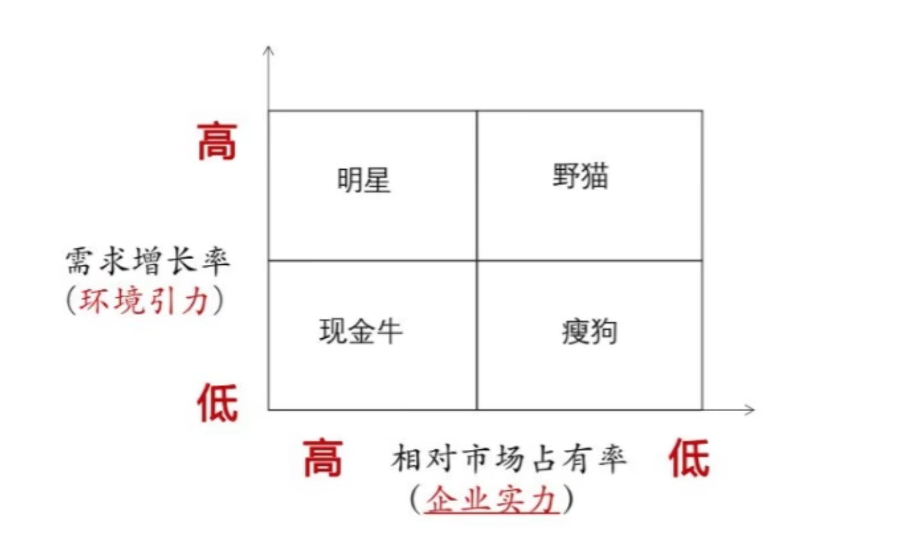
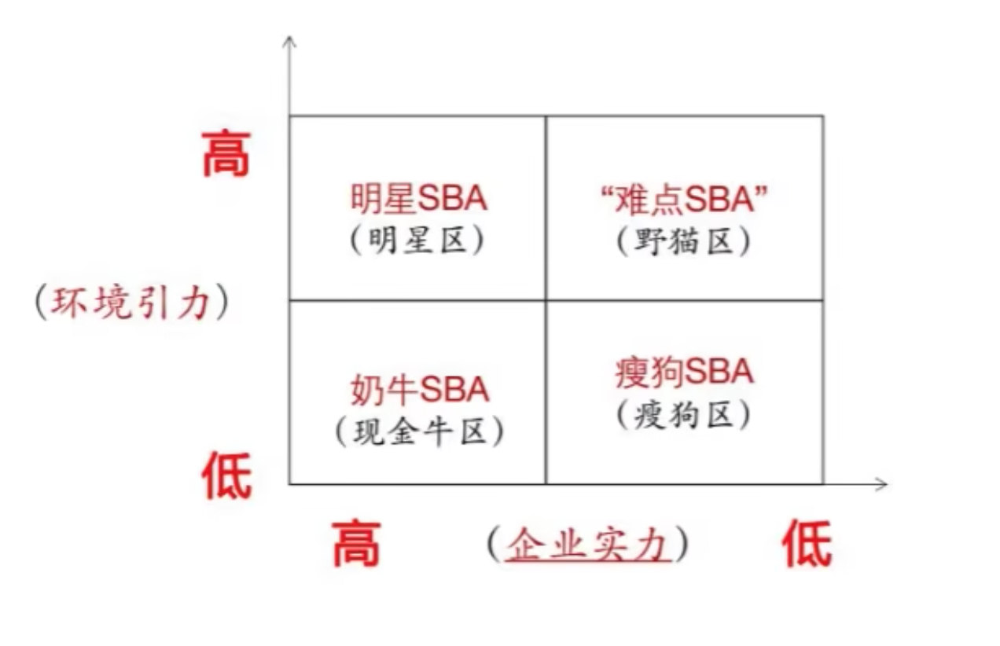

# 企业经营战略(00151)

## 第二章 企业经营战略环境分析

### 概述

**概念**

影响企业经营活动的各种概念和条件因素的集合。

**分类**

* 外部环境
    * 微观环境: 直接公众、相关顾客等。
    * 行业环境: 供应商、竞争者、替代品等。
    * 宏观环境: 政治、经济、文化、技术等。
* 内部环境
    * 企业本身

**特点**

* 客`观`性
* `复`杂性
* `不`确定性
* `层`次性
* `关`联性

易记口诀：官(观)府(复)不（不）曾（层）管（关）

**关系**

**企业**和**经营战略环境**：你中有我，我中有你，互相伴随，相互影响的关系

### 分析的内容

**外部环境分析**

* 宏观行业分析：政治、经济、自然生态、社会文化和技术。（**PEEST分析法**）【多选；简答；论述；】
    * 政治因素指对企业经营活动具有实际与潜在影响的政治力量和有关的法律、法规等因素。【国家社会制度、政治形式、国际关系、执政党的性质、政府的方针政策、国家法律和法令等】
    * 经济因素指对企业经营活动有主要影响的环境因素。
        * 宏观经济因素：国家经济结构、经济制度、产业布局、资源状况、经济发展水平、未来经济走势。
        * 微观经济因素：消费者收入的变化、消费者支出模式的变化、消费者储蓄和信贷情况的变化。
    * 生态因素指地理位置、气候条件和资源状况等自然因素。
        * 生态因素供应是企业进行生产经营活动所不可缺少的物质基础条件。
    * 社会文化因素指民族特征、文化传统、价值观念、宗教信仰、教育水平、人口规模、年龄结构、收入水平、消费结构、人口流动性等。
    * 技术因素不仅仅包括那些引起革命性的发明，还包括与企业生产有关的新技术、新工艺、新材料的出现和发展趋势以及应用前景。
* 行业环境分析：【多选；简答；论述；】
    * 行业的现状及前景分析：行业的寿命周期、行业规模、行业的技术状况、行业内战略集团。
        * 寿命周期：是由社会对该行业的产品需求状况决定的，当这种需求消失时，整个行业也就随之消失。
        * 行业规模：社会对本行业的产品或服务的需求总量是多少，行业目前总的生产能力的（设计能力、实际能力）大小，行业规模与社会对本行业产品或服务需求的对比。
        * 技术状况：重点分析本行业的总体技术水平状况、发展方向、技术革新的速度等。
        * 战略集团：行业中的企业在彼此竞争的同时，又相互配合，既有竞合性的特点，由此形成了战略集团，不同战略集团之间由于经济效益不同，采用的战略也就存在对抗的关系，同一战略集团的各个企业由于竞争优势上的不同，也存在竞争关系。了解行业内战略集团的结构，了解他们之间的相互关系，有利于分析行业的状况。
    * 行业竞争结构分析：迈克尔波特 “五力分析模型”
        * 同行竞争力：行业内现有企业间的竞争。
        * 供应商：讨价还价
        * 购买者：讨价还价
        * 潜在的竞争者：潜在进入者的威胁
        * 替代品的生产者：来自替代品威胁
* 微观环境分析
    * 微观环境：是指对企业经营活动构成直接影响的各种外部力量，包括`供应者`、`中介机构`、`顾客`、`竞争者`和`各种公众`。

**常见题型**

* 顾客环境（单选&名词解释）：
    * 现实需求：用户或顾客有能力支付的需求，即用户`客观需要`、`有能力购买`、也`准备购买`的需求。
    * 潜在需求：处于潜伏状态的需求，这是企业的用户未来的市场容量。
* 影响同业企业竞争激烈程度的主要因素（了解，选择）：
    * 同业企业的数量和力量对比。
        * 生产相同或相似产品的企业越多，竞争越激烈。
    * 行业发展的速度：
        * 行业处于成长阶段，竞争小。行业成熟阶段，市场企业饱和，竞争大。
    * 产品的差异化程度与用户的转换成本：
        * 同业企业产品的差异性越小，通用性越高，用户转换成本越低，企业竞争越激烈。
* 企业进入新的市场面临的进入障碍（了解，选择）：
    * 规模经济：指在一定时期内产品的单位成本随着企业总产量的增加而降低的现象。
    * 产品差异优势：原有企业的地位；市场声誉；顾客优势。
    * 资金需求：大量资金，有失败风险。

**内部环境分析**（多选，简答）

* 企业`一般情况`分析
    * 管理水平分析：各级管理者综合素质、管理知识与管理技能、企业组织机构状况、管理制度建立、管理职能设置。
    * 发展状况分析：上升/稳定/衰退；
    * 技术素质分析：设备、工艺设备、测试和计量仪器水平、技术人员和技术工人的能级、机器设备的役龄。
    * 生产条件分析：生产能力与需求是否适应、生产计划、现场管理水平。
    * 资源情况分析：各种人、财、物资源的情况。
* 企业`经营实力`分析
    * 技术开发能力分析：企业对新技术、新产品开发的难易程度。
    * 生产能力分析：企业生产规模和能力结构分析。
    * 产品竞争能力分析：产品的品种、质量、成本、价格、交货期、商誉。
    * 市场营销能力分析：营销机构建设、销售渠道。
    * 产品获利能力分析：量本利分析。

### 分析的方法

#### SWOT分析法（安德鲁斯）

* S（strengths） 优势  -》 内部
* W（weaknesses）劣势  -》 内部
* O（Opportunities）机会 -》 外部
* T（threats）威胁  -》 外部

#### 波士顿矩阵分析法 （选择）

将`需求增长率`和`相对市场占有率`作为衡量标准，形成矩阵图形，对企业的经营领域进行分析和评价的一种综合方法

* 明星区：需求增长率高，相对市场占有率高，专注机遇、加强力量、重点投资、促其发展。
* 现金牛区：需求增长率低，相对市场占有率高，严格控制投资、维持现有规模、设法获取更多利润、支持“明星”和“野猫”发展。
* 野猫区：需求增长率高，相对市场占有率低，有发展前度，应加以完善和提高，促使它成为明星区域。
* 瘦狗区：需求增长率低，相对市场占有率低，放弃和淘汰。

#### 麦肯锡矩阵分析法

麦肯锡矩阵分析法也被称为GE矩阵法、业务评估矩阵法，

它是以`战略经营领域的吸引力`和`企业竞争地位`两个综合指标进行组合，形成矩阵进行分析的综合性方法。

#### 内部价值链分析法

分析内部的价值运动，达到`成本最低而价值增值最大`的目标。

基本活动：

    内部后勤 | 生产作业 | 外部后勤 | 市场营销 | 服务  -》 利润

辅助活动：

    基础设施 | 人力资源管理 | 技术开发 | 采购 -》 利润

## 第三章 企业经营战略领域分析

### 经营战略领域概述

**概念**

战略经营领域（SBA): 企业在选定的行业中投放资源，提供特定产品或劳务，满足目标市场特定需求，迎接特定竞争，`施展特定战略`，追求理想效益的`经营场所`。

**结构**

### 具体类型

四种基本形式:

* 环境引力大，企业实力大 -- 称为明星SBA；  -- 实现了理想的引力实力平衡；
* 环境引力大，企业实力小 -- 称为难点SBA；  -- 实现了无前途的平衡；
* 环境引力小，企业实力大 -- 称为奶牛SBA；  -- 不平衡，呈逆差；
* 环境引力小，企业实力小 -- 称为瘦狗SBA；  --

### 运行规则

* **主观规定**：产业政策、法律文件。

* **客观规律**：消费者的需求偏好、产业的技术规律。不以单个人的主观意志为转移。

## 第四章 企业使命和战略目标

### 使命决策

**概念**

是指企业的目的、性质、任务及其在`国家经济发展`和`社会进步`中应承担的`社会责任`方面所作出的规定。

#### 企业使命及其重要性

* 企业使命指明了企业的经营领域，这就明确规定了企业的`发展方向`和`前进道路`。
* 企业使命是`确定`战略目标的前提。
* 企业使命是`战略方案制定`和选择的`依据`。
* 企业使命是`合理配置企业资源`的`基础`。

#### 企业使命决策的内容和方案

1. 关于`企业性质`的确定
2. 关于`社会责任`的确定
3. 关于`经营目的`的确定
4. 企业`经营哲学`的选择
5. 企业`经营方针`的选择
6. 关于企业`成长方向`的选择

> 逻辑：三确定：`性质`、`责任`、`目的`；三选择：`哲学`、`方针`、`方向`。

**两个词** （名词解释）

* 企业经营哲学：是企业经营者与广大员工在从事`生产经营活动中`所持有的`世界观和方法论`。
* 企业经营方针：是企业经营哲学的`具体反映`，是企业宗旨的表达方式。

#### 企业使命决策应考虑的因素和重要问题

**考虑因素：**

* 竞争态势
* 国家长远发展规划和产业政策
* 市场需求
* 企业实力

速记秘诀：“国企需竞争”

**重要问题：**

* 要以`顾客的基本需求`为中心确定企业使命。
* 正确的企业使命必须`具有约束力`。
* 企业使命要`具有鼓动性`。

### 战略目标决策

#### 企业战略目标的含义与作用

**含义：**

是`企业使命和宗旨`的`具体化`和`定量化`。它把企业经营的目的转化为多个方面的可以量化的具体指标，反映了企业经过一定时期的努力`达到的经营水平`。

**作用【辨析题：】**

* **战略目标**能够实现企业外部环境、内部环境和企业能力`三者`之间的`动态平衡`，使企业活动长期稳定和协调发展。
* **战略目标**能使企业使命`具体化`和`数量化`，使战略任务得以落实，避免落空。
* **战略目标**为战略方案的决策和实施提供了`评价标准`和`考核依据`。
* **战略目标**描绘了企业发展的远景，有利于更好地发挥全体员工的`积极性`、`主动性`和`创造性`。

#### 企业战略目标的构成及战略目标决策的内容

**企业战略目标决策的基本要求：**

* 战略目标必须有科学的`依据`。
* 目标必须`明确`和`具体`，并规定出完成`时间`。
* 目标必须切实`可行`。
* 目标应突出`重点`。
* 目标应形成一个完整的`体系`。

## 第五章 企业总体战略

### 发展型

#### 发展型战略的含义

使企业在现有的战略基础上`向更高一级的目标发展`的谋划与方略。

#### 发展型战略的特点与优势、风险

**特定：**

用词方面【选择】： `投入`、`扩大`、`提高`、`增强`、`改善`。 反面：`缩小`、`撤退`、`卖掉生产线`。

**优势：**

* 企业可以`通过发展扩大自身价值`。
* 企业能`通过不断发展变革创造更高的经营效率与效益`。
* 保持企业的竞争实力，`实现特定的竞争优势`。

**风险：**

* 在采用发展型战略获得初期的效果后，`很可能导致盲目的发展和为了发展而发展，从而破坏企业的资源平衡`。
* `过快的发展很可能降低企业的综合素质，使企业的应变能力在实质上出现内部危机和混乱`，这主要是由于企业新增的机构、设备、人员等还未能形成一个有机的、相互协调的系统。
* `有可能使企业管理者更多地注重`投资结构、收益率、市场占有率、企业的组织结构等`问题`，`而忽视产品的服务或质量`，因而不能使企业达到最佳状态。

#### 发展型战略的类型

【单选、多选、名词解释】

**密集型战略**

也称加强型成长战略，是指企业在`原有业务范围内`，集中力量，以快于过去的增长速度来`提高某种产品`的`销售额`或`市场占有率`以求得成长的战略。

* 市场渗透战略
    * 是指企业`通过更大的市场营销努力`，`提高现有产品或服务在现有市场份额`的战略。
    * 例如：可通过扩大生产规模、提高生产能力、增加产品功能、改进产品用途、拓宽销售渠道、降低产品成本、集中资源优势等单一策略或组合策略来提高市场占有率。
* 市场开发战略
* 产品开发战略

**一体化战略**

**多元化战略**

#### 发展型的适用条件

### 稳定型

### 收缩型

### 战略目标制定和选择的基本要求

## SBA(企业战略经营领域)

## 理论和作者

<table>
    <thead>
        <tr>
            <th> 理论</th>
            <th> 提出者</th>
        </tr>
    </thead>
    <tbody>
        <tr>
            <td> 企业核心能力理论</td>
            <td> 普拉哈拉德 和 盖瑞·哈默尔</td>
        </tr>
        <tr>
            <td> 竞争战略理论</td>
            <td> 迈克尔波特</td>
        </tr>
        <tr>
            <td> 知识经营战略理论</td>
            <td> 彼得·德鲁克 - 《后资本主义社会》</td>
        </tr>
        <tr>
            <td> 企业核心能力理论</td>
            <td> 普拉哈拉德 和 盖瑞·哈默尔</td>
        </tr>
        <tr>
            <td> 战略平衡理论 和 战略组织理论</td>
            <td> 阿尔福莱德·D·钱德勒</td>
        </tr>
    </tbody>
</table>

## 经营战略管理过程

战略环境分析阶段 -> 战略制定与决策阶段 -> 战略实施与反馈阶段

## 企业经营战略层次

* 总体经营战略 -> 第一层次的战略
* 经营单位战略 -> 第二层次的战略
* 职能战略    -> 第三层次的战略
