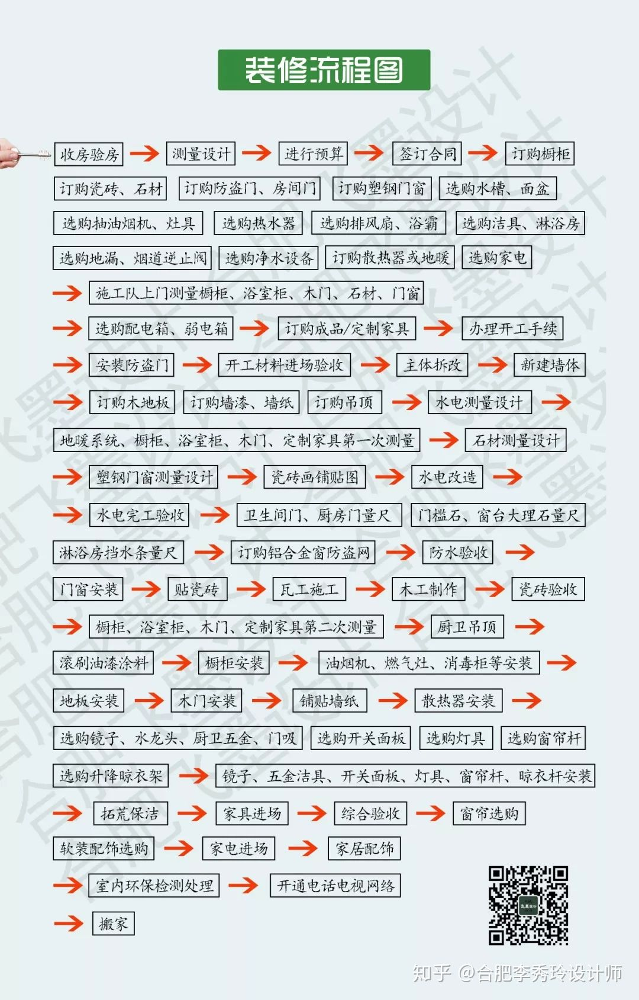

# 装修购买清单

* 创建: 2022-08-28 15:31:51
* 原文: <https://zhuanlan.zhihu.com/p/41923312>

## 硬装部分

### 水电清单

水管、强弱电线、空开、开关面板、电源插座、弱电箱

### 地面清单

水泥、沙子、防水涂料、地固、地板、瓷砖、石材、玻璃胶、填缝剂、门槛石

### 墙面清单

墙固、腻子、油漆辅材、乳胶漆、墙纸、糯米胶、硅藻泥、饰面板、踢脚线

### 天花清单

铝扣板、集成吊顶、石膏板、隔音棉、石膏线

### 门窗清单

木门、垭口、门套、窗台石、窗台板、合页、窗帘滑轨、门锁、门吸、拉手

## 家具部分

### 玄关清单

入门地垫、玄关柜、鞋柜、挂衣钩、衣帽架、换鞋凳

### 客厅清单

沙发、书柜、茶几、置物架、角几、电视柜、挂钟

### 卧室清单

床、床垫、床头柜、衣柜、梳妆台、电脑桌、电脑椅

### 厨房清单

整体橱柜、各种收纳架、沥水篮、五金（水槽、龙头、地漏、角阀、合页）、燃气报警器

### 餐厅清单

餐桌、餐椅、 餐边柜

### 卫生间清单

浴室柜、台面、镜子、镜柜、搁板、淋浴房、防腐木地垫、挡水条、洗面盆、马桶、妇洗器、五金（龙头、花洒、地漏、浴巾架、毛巾架、置物架）、伸缩镜、厕纸盒、马桶刷

### 阳台清单

洗衣柜、吊柜、晾衣杆、晾衣架

## 家电部分

猫眼、指纹锁、路由器

空调、暖气片、新风系统、电视、电话

抽油烟机、灶具、消毒柜、洗碗机、冰箱、微波炉、小厨宝、凉霸、净水器

换气扇、热水器、浴霸、洗衣机、吸尘器

## 灯具部分

主灯、射灯、筒灯、灯带、吊灯、落地灯、床头灯、镜柜灯

## 软装部分

地毯、抱枕、挂画、饰品、窗帘、绿植

## 购买顺序

1. 只知道购买清单还不够，你还要知道购买顺序：
2. 水电进场前先预定橱柜、烟机灶具、热水器、马桶、洗手盆等；
3. 水电开槽后预定墙砖地砖；
4. 水电结束后预定门；
5. 泥瓦工进场前预定石材；
6. 泥瓦工进场后预定吊顶；
7. 油漆工进场前购买墙纸；
8. 油漆工腻子刮完后购买铝扣板、浴霸、排气扇等；
9. 油漆工刷完底漆后通知安装门套和门，购买门锁、合页、拉手等配件；
10. 油漆工完工前预定地板、灯具、窗帘、挂件、开关面板；
11. 最后购买其他家具，软装进场，窗帘安装好，新房就装修完成啦。

上面这是大致的时间线，装修买材料要跟着工期走，在哪个步骤要买哪些可以咨询设计师或是装修师傅，没请装修公司的参考这张顺序图——

## 购买小Tips

最后给大家几个购买小Tips：

1. 地板和地砖都建议买多不买少，不够的话再补可能会有不同批次深浅不同、花色不同的问题。
2. 厂家送货上门时一定要拆箱检查，确认没有破损问题。
3. 定制门、定制衣柜、定制橱柜要提前一个多月就开始，这样才不会延误工期。
4. 买橱柜、衣柜时要询问清楚收费详情，不同商家有不同的收费标准，买之前问好价格，哪些配件是另外算钱的。
5. 灯具的规划要在水电改造之前就做，插座和灯光都要设计好。
6. 买主材时注意环保等级，胶水也是，要环保。
7. 买窗帘要注意遮光性，最好两层的，一层是薄纱。
8. 装修好还不算完，真的要入住了还要买更多的日用品，具体要买哪些，参考这篇文章——新房入住必买清单，良心整理！
