# 分时图表“V型”反转买点技巧

原文: <https://mp.weixin.qq.com/s/3IcHKaGxskJUO5a8pHbZSg>

闭眼也能在股市赚钱（附战法）

股票，就像人，也有自己的品格和个性。有的股票弦绷得紧紧的，个性紧张，动作呈跳跃状；还有的股票则性格豪爽，动作直来直去，合乎逻辑；总有一天你会了解并尊重各种证券的个性。在各自不同的条件下，它们的动作都是可以预测的。

市场从不停止变化。有时候，它们非常呆滞，但并不是在哪个价位上睡大觉。它们总要稍稍上升或下降。当一个股票进入明确趋势状态后，它将自动地运作，前后一致地沿着贯穿 整个趋势过程的特定线路演变下去。

当这轮运动开始的时候，开头几天你会注意到，伴随着价格的逐渐上涨，形成了非常巨大的成交量。随后，将发生我所称的“正常的回撤”。在这个向下回落过程中，成交量远远小于前几天上升时期。这种小规模回撤行情完全是正常的。永远不要害怕这种正常的动作。然而，一定要十分害怕不正常的动作。

一到二天之后，行动将重新开始，成交量随之增加。如果这是一个真动作，那么在短时间内市场就会收复在那个自然的、正常的回撤过程中丢失的地盘，并将在新高区域内运行。这个过程应当在几天之内一直维持着强劲的势头，其中仅仅含有小规模的日内回调。或迟或早，它将达到某一点，又该形成另一轮正常的向下回撤了。当这个正常回撤发生时，它应当和第一次正常回撤落在同一组直线上，当处于明确趋势状态时，任何股票都会按照此类自然的方式演变。在这轮运动的第一部分，从前期高点到下一个高点之间的差距并不很大。但是你将注意到，随着时间的推移，它将向上拓展大得多的净空高度。

炒股，是发财的途径吗？

什么叫发财？发财是相对而言。

十万变成100万，有人觉得发财了，上海人民撇了撇嘴，100万在上海只能买像样的厕所。

100万变成1000万，在上海能买三房两厅，算是个“正常公民”了。

所以，发财是相对的嘛，相对的是你的本金。本金小，再大的盈利，绝对值也不够。只有规模才能产生效益。

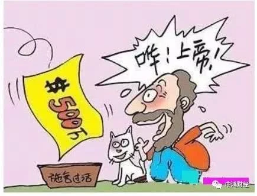

问题来了，你凭什么通过股市，把一百万变成一千万？

你是敢一把梭重仓贵州茅台呢，还是说你有惊为天人的天赋，比如杰西李佛摩尔，天生对数字极为敏感。或者说，你像威廉西蒙斯，从数学家转行投资，创建大奖章基金，年化收益45%，用数学模型投资？

都没有。事后诸葛亮好做。假如我当初重仓贵州茅台的话.......

所以说，股市要发财，大多数人不行，连可能性都没有。

股市只是一个工作区域，提供一个挣钱的机会。入门很容易，挣钱不容易。

要想挣钱，你必须要有两样武器，否则就是裸奔。

第一，你要有交易系统，做系统交易。

第二，你要有**优秀的个人品质**，并且这类品质符合博弈的需要。

关于第一点，绝大多数人没有，关于第二点，绝大多数人以为自己有，其实也没有。

交易系统就是用来做系统交易的。听着很绕，其实很简单。你有没有一套交易标准，让你知道什么时候买，什么时候卖？并且这个标准屡试不爽，从来不出大错，从来不产生巨亏，忠实滴保护你的本金，为你不断挣钱？

如果你有，你是高手。如果你没有，你要去学。

交易系统让你做系统交易，当系统发出交易信号的时候，你只要像机器人一样去执行，你信任它就像信任你麻麻。

关于优秀品质，不是助人为乐，乐善好施。

股市里的优秀品质是：冷血。

在生活里你冷血，你是动物。在股市里你冷血，你是王者。

你可能曾经是个王者，直到你遇到了股市......

股市的优秀品质只在股市里适用。系统交易会培养出你的冷血。

总结一下，能做到第一，就会产生第二。第二又会完善第一

## 认清股市的真实面目

**市场最不缺少的是机会，而缺少的是耐心**。市场不会关门，它一直在为投资者敞开着，给有准备的投资者以机会，给盲目的投资者以教训！现在你可以问自己一个很现实的问题：我凭什么在股市中赚钱？如果你还没有一个具体的答案，那么可以说，即使你在股市中赚了第一桶金也都是浮云，终究还是会“还”给市场。因为你不知道它如何而来，它必然同样让你不知道如何而去。可以说，你的投资计划越明确、越具体，那么你就越有可能赢，也越有可能赢得更久。

进入股市，就得把自己当作渔夫和猎户，要具备优秀猎户的品质，在狩猎不同的猎物时，要有针对性地选择适合猎物习性的方法。正如你想要钓到鱼，就得学会鱼的思考方式，当给予鱼以蚯蚓为诱饵的时候，它才会上钩。圆的世界、相通的事告诉我们道理就是这么简单，而掌握猎物的习性，却需要长时间的感悟修为。

## 分时图“猫腻”多多

分时图，对众多股民来说并不陌生，它呈现个股一天的走势趋势图。但就是这样简单的分时图，就能够在分时图的一些走势提前预知涨跌。

### 分时图基础知识

1、**黄色曲线**：该股票即时成交的平均价格,即当天成交总金额除以成交总股数。

2、**白色曲线**：该股票即时实时成交的价格。

3、**黄色柱线**：在红白曲线图下方,用来表示每一分钟的成交量,单位为手(100股/手)。

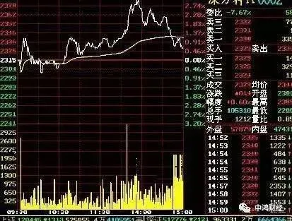

**注意事项**

一天的分时图上，可以找到股票走势较为简洁的形态，这种形态是区间是否清晰明显的分时形态。

股价呈上升或下降通道运行，走势是否明显，此区间多为观望区间，不宜进行操作;

分时图中股价走势溢出原势区间，改变了上涨或下跌的斜率，此区间内股价既有按原趋势运行的可能，也有形成反转的可能，此区间是重要的决策区间;

分时图中，股价走势对转势区间进行突破，方向可以向上，也可以向下，此区间是最为重要的操作区间。

## 分时图五种基本买卖点

### 一，平开高走型

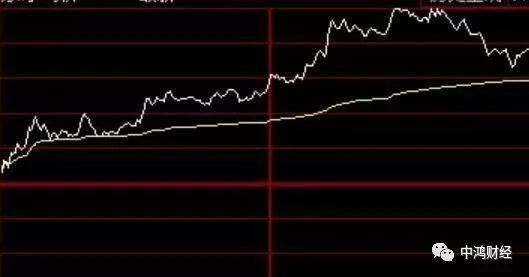

黄线跟着白线上行，白线回落黄线不破，再回落还不破，且黄线之中向上运行，那么，十点30分白线再上台阶就是买点!当天大概率有盈利。

### 二，平开低走型

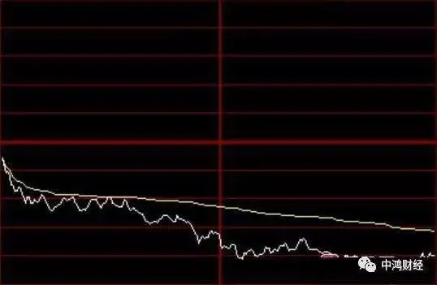

图二刚好与图一相反，开盘黄线就压着白线下移，十点半前白线反抽黄线两次三次精准的突破不上来，那么十点半后就是卖点!大概率就是一路出溜儿下去了。

### 三，冲高回落型

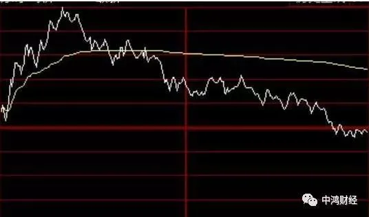

早晨走的好好的上扬，十点半前后白线回落黄线的时候破掉了，那么中午收盘前看能否站回来且站稳再上扬，如果不能站回或者站回再破或者站回也不上扬，则下午开盘后就是卖点!要站回上午就站回了，上午站不会的话下午大概率也没戏。

### 四，探底回升型

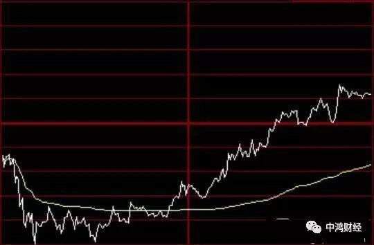

和图三刚好相反，早晨下探别急着恐慌，当十点后发现黄线走平之后就可以再看看，十点半后白线站回黄线且上扬，那么下午开盘后发现白线回踩不破又谈起，且黄线开始拐头向上了，就是加仓时机!

### 五，横盘震荡型

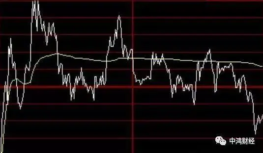

无论低开高开，十点半前后我们看到分时白线和分时黄线上下穿行，即白线回落时黄线撑不住或者白线反抽时黄线拦不住，反复，那么全天也就这样了。

### 总结两点

一是早晨没必要还没开盘就去赌，十点半看清楚趋势了再动手也来得及。

二是今天只是基本形态的规矩走势，且都是大概率情况，不要钻牛角尖!世界上唯一不变的就是变化。

对于短线操作者，分时图是很重要的一个指标，能直接反应股价波动的轨迹，在分时走势图中还会暴露庄家对股价未来走势的潜在意图。

每个人都想买股票的时候买在最低点，卖股票的时候买在最高点。可现实却很骨感，现实中大多数人都是在高点去买进的，一买进就开始跌，接踵而至的就是被套。虽然咱们做不到在最低点买入，但是也不能在最高点去追。笔者今天给大家讲下怎么看分时图买在低点。

## 分时图操作原则

### 1、 均线持续运行向上

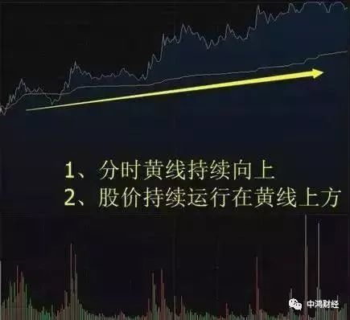

不管大盘怎么样，只买分时图均线向上并且持续运行在黄线上方的股票。

### 2、组织放量拉升

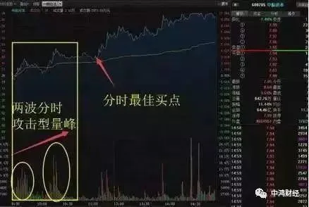

日内的分时组织进攻很重要，早上出现一两波有组织的分时放量拉升，之后产生第三波主升动作概率会很大。

### 3、突破日内新高

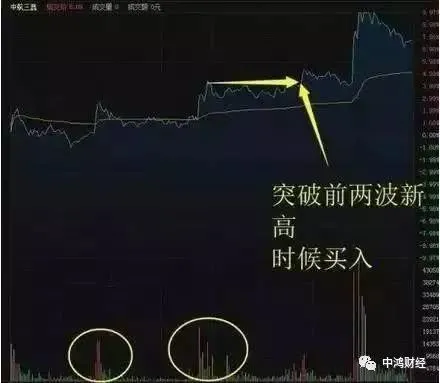

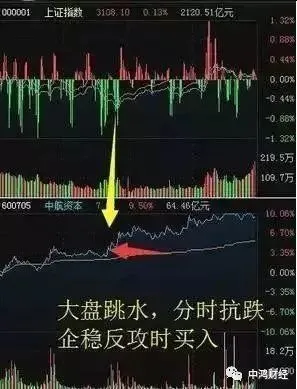

关键买入点位置，通常我选择个股在突破日内新高的位置买入，这时候涨幅最多在3-5个点内，如果刚好碰到大盘跳水，就形成了之前讲的分时起涨，在大盘跳水+个股抗跌+分时反攻的位置买入，这个时候成功率反而更高。

## 分时买入技巧

### 一、平开低走快速击穿均价线

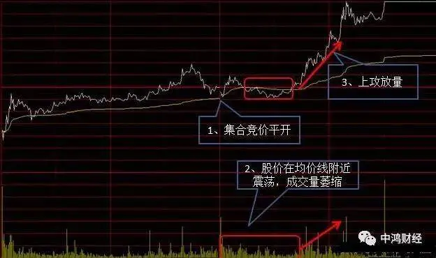

特征：

1. 集合竞价平开，随后击穿均价线，量能萎缩
2. 股价围绕均价线震荡，成交量依然萎缩
3. 上攻放量

**买点**：放量突破前高为第一买点

### 二、高开低走击破均价线

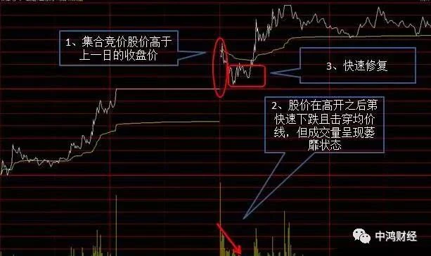

特征：

1. 集合竞价时股价即高于前一天收盘价格，高开幅度可大可小
2. 快速跌破黄色均价线，且成交量萎靡
3. 快速修复均价线

**买点**：修复均价线时快速买入

### 三、平台调整型

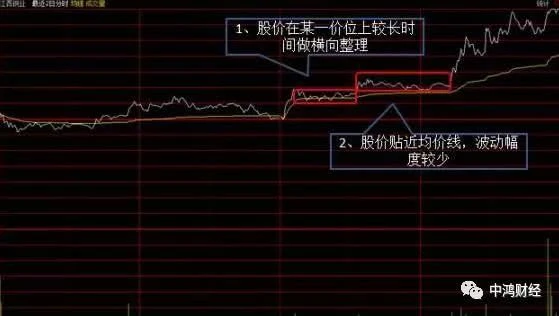

特征：

1. 股价在某一价位上进行较长时间的横向整理
2. 股价贴近均线，波动幅度较少

**买点**：在出先第一个“向上突破平台”时应该第一时间买入，第二个“向上突破平台”如果涨幅不大也可以买入

### 四、高开高走回调不破均线形

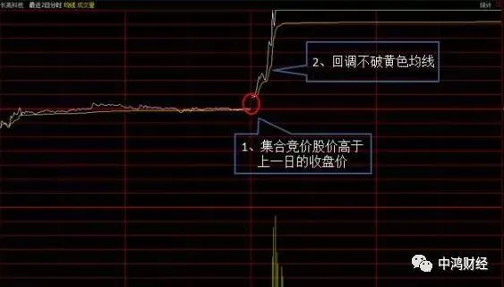

特征：

1. 集合竞价高于上一日的收盘价
2. 开盘后股价位于均价线上方，盘中出现回调不破黄色均线

**买点**：回调且不破黄色均线即为买点

## 分时V型反转选股公式

V型反转:=REF(C,4)>REF(C,2)*1.05 AND C>REF(C,2);

DIF:=EMA(DCLOSE,10)-EMA(DCLOSE,72);

DEA:=EMA(DIF,17);

AAA:=(DIF-DEA)*2*60;

牛股:=CROSS(AAA-REF(AAA,1),15);

DIF1:=EMA(DCLOSE,12)-EMA(DCLOSE,26);

DEA1:=EMA(DIF1,9);

AAA1:=(DIF1-DEA1)*2*60;

AAA上:=IF(AAA1>REF(AAA1,1),AAA1,DRAWNULL);

AAA下:=IF(AAA1<REF(AAA1,1),AAA1,DRAWNULL);

入线:=15;

反弹:=AAA1-REF(AAA1,1);

CROSS(反弹,入线);

## 是什么影响了 中国股市 ？

中国股市从90年开始，眨眼间已经有28个年头了，人说三十而立，中国股市从一个小孩逐步成长，现在也快到而立之年了，中国经济最近二十年飞速发展，但对于中国的股民来讲，却大部分没有享受到快速发展带来的 **股市** 红利，

反倒是大部分投资者在股市里吃了不少亏，七亏二平一赚，这是中国 A股 投资者的魔咒。最近我也一直在想这个问题，都说股市的是经济的晴雨表，最近几十年中国飞速发展，从原来的贫穷落后，到现在全民小康，话说股市应该也是长牛才对，但为什么中国股市会成现在这个样子，6124到1664的股灾，5178到2638的股灾，哀嚎一片，在很多科学技术上，中国能弯道超车，甚至是国际领先水平，但为什么中国股市却熊冠全球。

很多人说是中国股市体制问题，其实我个人认为是中国股民投机性太强，大部分投资者都想在这个市场赚快钱，

过度参与短线的交易，最终导致中国股市波动过大，资金之间互相盲目追风，中国股市参与者中80%都是 散户 投资者，虽然每个投资者资金量不大，但一亿多股民加起来的总量却是非常庞大，那么多资金参与短炒，最终影响上市公司股价。那到底短线炒作会有哪些不利的地方，为什么说是股市万恶之源？

首先，过度短炒，股价很容易短期涨幅过大，从而形成资金的跟风效应，大量资金集中买入，股价短时间远远脱离其公司价值，前面上涨炒作的资金当然能赚到钱，但股市里面就是上涨你赚钱了，下跌过程接棒的人就会亏钱，

大幅上涨脱离基本价值的后果就是会大幅下跌，这种情况在15年牛市中一些科技股，就是活生生的案例，现在大部分股价都只有原来高点的1/10。其次，我们大部分股民技术分析太薄弱，控制力不强，很多时候在赚钱心驱使下，

**盲目买股，不懂得投资法则**，有时候你会发现，大部分股民买股都是临时思考的决定，几十万，几百万就这样买了，但如果现实中让你投资一家公司几十万，几百万，估计你会全方面考量过后才会决定。再次，**短线操作，让投资者赚钱的时候心态膨胀，亏钱的时候心态奔溃，大起大落之后，容易走向极端**，这好比进赌场一样，你会发现进去赌场能全身而退的人非常非常少，这也是为什么那么多人忌讳 赌博 。

最后总结起来，短线操作我并不否认在行情好的时候赚钱快，但行情不好的时候亏钱也快，别想着行情好你做，行情不好可以不做，能这样控制得住的人很少，况且目前很多人对行情好坏，其实都还不会分析，更别说控制自己了，所以我觉得大家真想赚钱，简单赚钱，快乐赚钱的话，还是以投资的角度去买股票，起码别急于短期就要获利，随着公司发展享受股价增值红利，是最为简单，稳健的投资手段。
