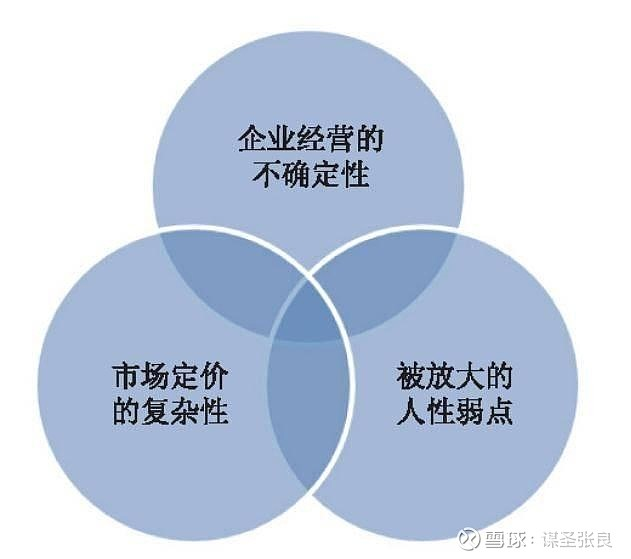
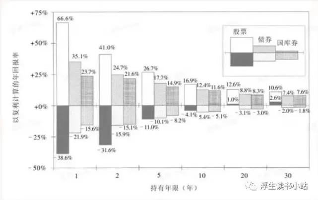
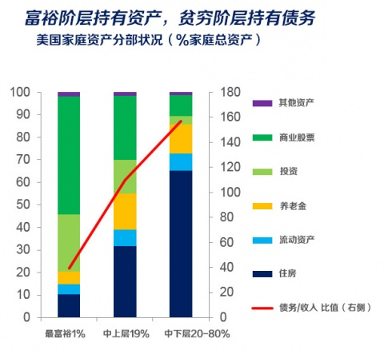

# 第1章　有关股市的事实

股市在很多人眼里一直披着一层神秘的面纱，每个人都听过几段和它有关的故事，但很少有人具正思考过它意味着什么。所以在本书的最开始，让我们以一个客观的态度对股市进行一个全方位的审视。在这个过程中，也将对如何在股市中生存以及如何在投资的道路上找到自己的位置展开一系列的讨论和分析。

## 1.1　低门槛与高壁垒

股市这个游戏的进入门槛非常低，任何年满18周岁的公民只要去开一个股票账户就能马上实现足不出户的交易。任何投资者都可以在几千只股票中自由地作出自己的选择 从决策到交易完成只需要敲几下键盘即。这可能是有史以来最”简单“ 的工仵，没有学历限制、不需要笔答面试。没有外貌和年龄段的要求、不受天气和地理因素的影响。可以说进入股市基本没有任何门槛。

但这个游戏的另一面却是，要想成为真正的获利者面临极高的壁垒。

### 1.1.1　少数人获胜的游戏

对于股市，不同的人有不同的认识和理解。**管理层**说股市是现代金融和市场经济不可缺少的重要组成部分；**学院派**说股票市场是已经发行的股票转让买卖和流通的场所；**理财顾问**说股市是理财的重要手段，股票是—种让资产随着时间增值的方法；**老百姓**传统上喜欢说股市就是一个圈钱的赌场。

以上说法我觉得都有一定道理用一句话来描还股市，我想它是“一个注定最终只有少数人获胜的财富游戏”。这是完全从结果下的结论，这个结果与我们认为股市是怎样的、抱着怎样的期待来股市以及股市具体处于哪一个发展阶段都没有太多关小。

随着近些年来巴菲特的名声在国内如日中天 一些投资者将巴菲特的话简单孤立地拿出来做宣传，频频提出“投资其实很简单”之类的论调似乎在股市中赚钱是一个非常轻松和容易的事。不得不说，这是与我个人的观察完全相悖的并且我认为这种论调对于投资者认识股市和投资客观上起到了极大的误导作用。

> 让我们看一些基本的事实 从1608年世界上最早的证券交易所在荷兰的 阿姆斯特丹成立至今，股票已经存在超过400年了。在这400多年中，古今中 外的各个证券市场经历了数不清的牛熊转换。以最成功的美国市场为例，其中最具代表性的道琼斯指数在 1906年 1 月时约为 100点，截至 2012年 12月末约 为 13200点， 106年间增长了132倍。具《上海证券报》的一个统计，过去30年美股涨幅排名前五的行业涨幅分别为;**【信息服务】229.77倍、【批发零售】 131.34倍、【生物医药】 77.86倍、【电子半导体电讯】57.65倍、【消费品】41.09倍**。

但即使是在这样超长期持续上涨、不断孕育出大牛股的市场里，我们又见到了多少获得良好长期回报的投资者呢?美国的股民们因此获得了投资普遍的成功吗?

答案是没有。不仅没有获得普遍的成功，在整个美国证券历史中反倒是充斥着血本无归的惨剧。那么，在还处千发展成熟期的中国股市中， 我们得以自信满满的理由何在呢?

{==可以说无论在任何市场投资，都注定了将是个最后只有少数人获胜的游戏。如果哪个阶段它让你看到了大多数人都在赚钱甚至大赚特赚。那我们最好小心，因为几百年的历史告诉我们每一次都没有例外， 我个人成为一个例外的概率就更低。==}

巴菲特确实说过"投资很简单"但他说这句话的时候我们最好想想这句话是否对所有人都成立?说投资很简单的巴菲特，是哥伦比亚大学经济学的研究生导师和毕业后的老板是价值投资的伟大开创者格雷厄姆，他在说“投资很简单"的时候已经从事投资很长时间并且取得巨大成功。 就像拳王泰森告诉你拳击很简单,梅兰芳告诉你京剧很简单,李宁告诉你体操很简单一样,恐怕大多数人听了后都会有自知之明。但创造了投资界神话的一位老人说这句话的时候，为什么很多人就欣然接受了呢?

何况巴菲特的原话是 “{++投资很简单，但并不容易++}"。太多人大大高估了前半句对自己的适用程度，而远远低估了后半句所隐含的**极高壁垒**。

也许有人看到这里已经满腹狐疑了, 哪儿有你说得那么难啊?我就觉得很简单啊, 股市的赚钱确实很轻松啊。好吧，如果这是一种真实的感觉，那么有三种可能性：

* **第一，阅读本书的时候恰逢—个大牛市，股市基本上已鸡犬升天；**
* **第二，正好处于个人运气非常棒的阶段，俗称的买啥啥涨卖啥啥跌；**
* **第三，确实是人中罕有的天才。**

第一种：在一个蓬勃的上涨市中，你确实会发现赚钱其实很简单，牛市就是一个分辨不出谁是傻瓜的环境。我向来认为牛市和熊市都是让人忘记历史和未来的特效药，比忘情水的效果好多了。所以第一种情况得出投资很简单是很自然的，而且说这话的人往往与说，股市是毒药，这辈子再也不碰了"的是同一批人。只不过在牛市喜欢说“简单”，在熊市喜欢说“毒药”而已。

第二种就更有迷惑性 明明股市并非鸡犬升天.但我的成绩就是好，这总不能用，“牛市”来解释了吧?很遗憾这依然可能是运气的眷顾而不是能力的结果。在—个不过几年的坏境内，由于市场偏好等因素的差别，股价是可以完全脱离其价值规律而呈现高度不规律的波动性的。在这种较为随机的环境里，一定会出现—些幸运儿。这就像那个著名的故 1000个人扔硬币，每次将扔到正面的人留下， 20次后真的会出现—些连续20次都扔了正面的家伙。但如果他认为自己能留下是因为技术好而不是幸运，那么可以试试继续以此为职业扔5年10年看看结果如何。

我也不否认第三种情况的存在。但常识告诉我们天才必然是一个极小的事件.特别是当一堆人都认为自己是天才的时候，这事儿就更不靠谱了。何况，我相信没有天才会需要和恰好翻开这本书.所以这种情况可以从统计意义上忽略不计了。

其实通过常识就会很清楚.就算是经营—个小百货商店或者小饭馆激烈的竞争中想获得很好的收益也是件非常不容易的事情。怎么—到了证券市场上就突然天上会掉钞票了呢?经济原理告诉我们，任何一个行业要想获得超额收益都需要有—个**壁垒**，股票投资不可能是个例外。

我曾经想到底怎么才能解救大众 一个超级牛市 或者开诚布公的股神，完美的制度? 最终答案是，什么也拯救不了。或者这样说，让大众都轻松地从股市中赚钱这个目的本身就是“反科学”的，如果实现，那么社会从此会—路倒退。那些因为大多数人赚不到钱而痛心疾首的人，其实自己还没走出认知的怪圈。

在我看来，只有充分认识到股市将注定是少数人获胜的游戏，充分理解投资“{++**简单但不容易**++}”的内在意义, 才算是开始正视了投资，开始有机会进入投资的大门，**因为认识到这一点的人, 很自然地会思考下一个问题:我凭什么才能在这样一个最终注定是少数人获胜的游戏中胜出呢?**

### 1.1.2　三重困难、四种层次

知道在股市投资获利是一件困难的事固然是件好事.但更重要的是知道它难在哪里。知道难可以让我们正视它，但只有知道困难来自哪里才能帮助我们更好地学习并自我提升. 从而提高成功的概率。

曾经有朋友问我怎样才能在股市获利，我想了想最终给的答案是 **低买高卖**。

朋友颇为失望，我理解他的想法但我认为他并没有清楚地理解我的答案。我并没有塘塞他，股市获利的本质就是低买高卖。任何一笔投资要想获利，其表现形式必然是卖出价高千买入价。但所有的困难和问题也就发生在这个环节中。

不妨想想股价是由什么构成的呢?很显然，是"**每股收益 X 每股估值**"。也可以理解为公司的业绩与公司在市场上所获得估值的乘积。那么由此事实推导，我们想要获利必然要通过以下几种途径:

1. 在估值不变的情况下，公司在未来卖出时的业绩**高于**你买入时的业绩;
2. 在业绩不变的情况下，令公司在未来卖出时的估值**高于**你买入时的估值;
3. 公司的业绩和估值**都高于**你买入时的业绩和估值。

由此可以推导出，在股市中获利的两个关键变量是 【**公司未来的业绩走向**】和【**市场给予公司的估值**】。

#### 1. 投资者的三重困难

那么问题来了，对这两个关键变量的判断和把握，是一件简单和容易的事情吗? 毫无疑问这远非那么简单。至少有三个最重大的困难是每一个投资者都要面对的。见下图。

第一道难关是 **“企业经营的不确定性”**。公司的业绩是一个结果. 其在特定商业环境下面对竞争交出的成绩单。但只要是竞争就没有 100%确定的，越是自由市场环境下竞争的强度就越高。所以要达到投资获利的第—个条件“**取得未来更高的公司经营业绩**”就需要对企业的商业前景进行推断，而这一过程融合了从*企业、市场营销到财务会计，甚至是特定的专业知识*的一系列学科的内容。仅仅是初级的，真正优秀的投资者必须具有敏锐的商业判断力，够对于其商业价值和竞争格局有一个前瞻性的认识和判断，这种能力的并非靠学院教育就可实现，往往还取决于一个人长期实际工作经验的积累，甚至是对社会发展规律的观察和感悟。

第二道难关来自于 **“证券市场定价的复杂性”**。如果仅仅是预料到一个公司未来的经营绩效将会增长就可以在投资中获利那么在股市的役资起码能简单一半。但很可惜，在股市中大量的实例表明，即使你准确判断公司未来的业绩还会增长，依然无法让你赚钱。{==因为股市从本质上而言并非是对企业业绩进行交易的场所，而是对企业业绩的预期进行交易的场所。==}市场定价的复杂性就表现在股价往往并不与企业业绩呈现同步，企业的投资价值也并不与其当期的业绩增长高低、规模大小呈现完全的对等关系。市场会以复杂但精密的方式对不同类别的企业和不同阶段的企业差异化定价，有的会溢价有的会折价，如果不理解其中的原理和逻辑，就会出现买了最伟大的企业却亏损的尴尬。

第三道难关就是 **”市场对人性弱点的放大“** 。我们经常见到这样的情况，某人对某只股票的判断最终被证明是正确的，但他最后却非常懊悔。为什么呢?因为他根本就没买，或者买了又扔了，又或者在牛股上只有很少的仓位。 **”看对做错“**这种事儿在投资上屡见不鲜。 ”看对“属于学识上的问题. ”做对“可就要面临克服人性弱点的考验了。股市在某种程度上于赌场很像，就是它们几乎都是精确瞄准了人性中最根深蒂固的弱点而设计的： 贪婪、恐惧、犹豫、自负、盲目、急躁、患得患失.... 它是一个人性的放大器，可以用最有效的方式让人失去理智。

常说喝酒和打牌能看清一个人的秉性， 但是我说，这和股市比起来简直就是小儿科了。一个人最真实的秉性其实是在股市中得以展现 -- 这里没有表演的成分，却有金钱这个现实利益的考验。所以**一个内心不强大、无法在压力下保持理性的人，哪怕才高八斗、智商超群，也注定只能成为这个市场中的失败者。**

#### 2. 投资能力的四个等级

我相信只要在股市中打拼过几年的人，恐怕都不难体会到这三个困难的厉害之处。反过来讲，这三大挑战也就成为了在股市中成功的最大壁垒。具体来说，拥有以下三种能力的人才有望在股市中成为最终获利的少数人也即七亏两平-赚中的"一"

1. **敏锐的商业判断能力**: 具有敏锐的商业判断力，对于企业基本面和发展前景能够深刻认识、准确把握的人。
2. **对市场定价机制的深刻认识**: 深刻理解股价的定价机制，对于风险和机会的动态转化具有敏锐嗅觉的人。
3. **具有强大的自我意识，可以克服人性弱点**: 具有强大自我意识，可以克服自身弱点、能在喧嚣和压力下依然保待理性的人。

如果用这三种能力去衡量股市中的各种人，可以分为以下四种投资能力的等级：

| 能力具备程度                             | 在股市中的结果和地位                                                                                                                                                                           |
| ---------------------------------------- | ---------------------------------------------------------------------------------------------------------------------------------------------------------------------------------------------- |
| 三大能力皆备                             | 必为一代投资大家。这种人属于可以穿越时间周期，创造业绩传说的投资人                                                                                                                             |
| 在某一项上很突出，其他两项没有太大硬伤   | 长期来看也能获得优秀的投资回报，实现财务自由不是是梦想。没有大的硬伤决定了这种人不容易受到致命打击，而复利的原理决定了，只要能在市场场中活得长，即使复合收益率并不是很高，也足以创造巨大的财富 |
| 在某一项上很突出，但其他两项存在太大硬伤 | 这种人的业绩容易大起大浴，运气在其中占的比重很大。碰到能力适合的好运气阶段往往突飞猛进，但碰到硬伤周期也易遭遇到致命打击。阶段性优胜者名，时间越长存活的越少。                                 |
| 三项能力都很弱                           | 属于股巾中水远的炮灰和大多数，即便是短期的运气也挽救不了长期必然的结局。见好就收往往是这种人最好的谢幕，可惜人性的弱点决定了绝大多数最终一定是不见棺材不掉泪。                                 |

在我看来第一种人在哪个市场里都属凤毛麟角，这个层次既需要深厚的专业素养、卓越的眼界、深邃的历史观，又要具有敏锐的风险嗅觉和超人的意志力。他们是普通人膜拜的偶像和学习的楷模他们不但大胜而且长胜。

第二种入是股市中优胜者的主力，学识修养较为完备又往往在某方面特别突出，性格上恰好又很适合在股市中生存。这种人只要不自己放弃原则去做危险的举动，实现财富上的满意回报只是个时间问题。

第三种人的结局会有非常大的分野。这种人往往在某一项能力上具有硬伤，也许是性格天生不适应股市投资的要求，对投资相关的理解上存在重大偏差(往往是过于偏执和极端)。这种缺陷很容易在某种市场环境下遭遇大败，甚至是一蹑不振。而又由于其在某些能力上的突出，并且由于偏执而敢于下赌注，在运气很好的时候很可能创造出阶段性的投资佳绩。

第四种人就简单多了，他们绝大多数会成为 “七亏"中的一员，运气较好的会在多年的折腾后收获“两平"的结局，长期来看基本不可能进入”一赚”的行列。

### 1.1.3　糊涂赚还是明白亏

很多股民都喜欢说：赚钱就是硬道理它然而在股市里，赚钱有时候会成为一件坏事，亏钱反而可能是个好的征兆，其实只不过是从不同角度来看而已。

#### 1. 糊涂赚的危害

如果是从糊里糊涂的赚，到明明白白的亏，那么不但是一个坏事反而是一个进步：因为从长期看前者必然会沦落到糊里糊涂的亏，而从后者才有机会走向明明白白的赚。所谓糊里糊涂的赚，就是把“偶然性”当做必然性。比如今天买了一只股票，其实无论明天如何也有50%的概率是涨的，但是如果真涨了，有人就不会考虑到其中的偶然性因素，而是认为自己的决策高明。

以一天的情况来看，似乎并不容易让人犯糊涂，那么不妨看看另一种情况，在一段期间内，甚至此期间可以长达几个月甚至几年，很多人可能都会保持某种“正确性”，但却忽略了“正确的结果”其实可能是被错误的“理由”所支撑 -- 这是股市所特有的一个现象，即“错误的奖励”。

> 如果你是一个汽车修理工，你不可能因为给客户更换错了一个配件而得到奖赏;如果你是一名理发师，你也不可能因为给客户理了个糟糕的发型而受到奖励。但在股市中，错误的行为有时候反而会得到阶段性的收获。
>
> 比如， 2007年从4000点开始“黄金 10年”的欢呼，至少可以“对“ 2000多点，而这期间所有逐渐警惕起来的人都会成为"傻子”。又比如，纳斯达克的疯狂并不是几个月而是长达4年多，连巴菲特在此期间也被认为"该扫入历史的垃圾箱了“。

所以，糊里糊涂的赚，其实是一大堆投硬币者之中处于幸运阶段的偶然表现而已，其最大的问题就是缺乏持续性。最弱小的糊涂分子。持续性差到每天可能都不一样，每个买入的获利概率都呈随机分布，稍微幸运些的糊涂分子，则可以保持一段时间的顺风顺水；而一旦特定的环境改变，他就将无法再持续一一甚至更糟。用错误的方法继续应对而导致最终的惨败....

当然这并不是说必须要有一种无论任何情况下都适用的方法。**其实恰恰相反，不妨认为其实根本没有这种方法一一因为市场的偏好和偶然性是无穷尽的，但是每个人的能力范围却总是有限的。**

#### 2. 明白亏的益处

明明白白的亏，其实就是一种反思 -- 是在不可持续的糊里糊涂的赚与亏之间，开始意识到自己的能力 “其实很有限”， 而市场 ”其实很复杂”；开始客观看待和分析总结自己每一笔投资胜败的原因所在；开始知道市场的什么部分是规律，而什么部分其实不过是随机事件而已；不会再将偶然性因素导致的"赚"归功于自己的英明神武，而将必然性因素导致的“亏”却归咎于所谓的市场不成熟。所以一时的赚和亏只是一个阶段性的节点，在我们永远退出市场前，这个游戏的结局都是不确定的。如何读懂这个游戏，才是最终结局的决定性因素。

只有经过了这个步骤，才有可能最终走向明明白白的赚，才能使得自己的投资绩效具备可持续性。这种可持续性，完全不是指在任何时期都可以赚钱，而是指找到一种可不断复制的、把握了市场长期核心规律的模式化投资方法。

虽然这种方法会阶段性地显得“无效“，但那不是投资方法的问题，而是**任何投资方法必然不可能覆盖市场的所有时间和特点的问题**.但是这与“幸运"的区别在于正确的投资方法即使是放在以几十年为一个单位的不断循环中也是经常有效且可重复的，而且时间越长越体现出必然性 -- 而幸运只存在于某个特定的时空背景下，且时间越长越显示出其偶然性的一面。

## 1.2　股市也没那么可怕

上面的内容也许会让很多人对股市的跃跃欲试冷静下来 但我无意于将股市描绘成一个洪水猛兽。事实上，股市也确实没有那么可怕，甚至其成功的道路比你想象的更清晰。关键是，走正确的道路。

### 1.2.1　小概率中的大概率

很多人都说股市像赌场，对很多人来说股市确实也就是赌场。但在我看来赌场根本不需要”场“， 赌徒到哪里赌场就在哪里。哪怕是一副扑克牌，几个石头子儿都可以赌。在股市里要想赌就更容易了，而且各方机构为了更好地服务于”赌民“，精心推出了各种各样的赌具：股票不够玩那就来股指期货，可转债和普通基金不够玩那就来杠杆基金，国内的不够玩那就到国外市场开户。

我经常说：做投资者还是做赌徒，是个自由的选择。股市就是一面镜子：你天天看到的是内幕消息，那么你就会成为消息追逐者，你天天看到的是赌博，那么你就会成为赌徒；你天天看到的是均线指标，那么你就会成为交易者；**你天天看到的是企业经营，那么你就会成为投资者。**没人规定在股市里一定要如何；自己种下”因“，自己收到”果“, 如此而已。

投资确实是一个艰难和高壁垒的游戏，但它不是真的青面撩牙吃人不吐骨头。一方面我们确实看到很多投民在证券市场中倾注了大量心血依然惨败而归，但另一方面却是市场的少数获利者简单的让人难以置信。

> 2010年初俄罗斯媒体报道了一则有趣的新闻， 有一只名叫鲁莎的大猩猩，从 30只股票中挑选出了8只，如果有人据此买入并持有 1年，那么这只大猩猩的“投贷组合”将带来3倍的回报。就是用这种谁也摸不到门路的投资法，猩猩将俄罗斯国内 94%的基金业绩甩在身后。更有趣的是《金融叶报》也公布了一项类似的研究，证明大部分经过计算机刺激的猴子在 1938~2011 年都能战胜股票市场一一-多么让人敬佩和不可思议的猴子啊!

如何看待这一现象? 这些猴子没有知识没有背景，甚至没有思维。它们所选择的公司基本上是随机乱点的，从这一点来看它们几乎毫无胜算。但它们相比人类也有一个容易被忽视的巨大优势，那就是它们根本没有财富的概念，所以面对股市的波动绝无任何贪婪和恐惧。

我当然不相信在家里养只猩猩并且靠它来扔飞镖就能成为股市嬴家，除非有事实证明成千上万只猩猩在任意一个5年间扔飞镖获胜的概率都非常高，否则这不过是一个不具有统计意义的偶然现象而巳。但这一现象也说明了，股市里的渗败其实大多数都是**“自我折腾”**的主动性行为所导致的。

在股市中取得优秀收益的确实永远只是少数人，但这是否真的说明证券投资是个结局完全随机、大家都是在里面拼人品和运气的赌博游戏?

答案显然是否定的。做投资某种意义上说是在寻求超额收益的“小概率事件”。但“概率小”不是因为投资真的毫无规律，完全就像六合彩一样呈现收益的随机波动。而是因为市场里真正明白**“什么是正确的事和愿意坚持做正确的事”**的人始终是稀缺的分子。所以只要踏出这一步，你就会发现沿着这条路走下去投资的成功事实上恰恰是某种“大概率事件“！

而且正是因为这个市场中不懂得、不愿意去做正确的事的人太多，这就给了真正觉醒的人更大的机会。就像在一个普通的商业市场中，也许最终的胜出者高度垄断了市场的绝大部分份额，其他大部分公司都以失败而告终。但你不能因为最后只剩下的几个垄断者就说这个行业不赚钱，是赌博。相反，正是因为他们的竞争对手太弱小，所以他们反而可以掠取市场收益的大部分，成为最大的嬴家。甚至可以这样说，如果一个市场中大多数的参与者越是不理性，越是缺乏专业知识，越是赌博心态浓厚，这个市场就越是提供了巨大的机会。

对此持怀疑态度的朋友不妨看看巴菲特是怎样说的。

> “投资者能否取得优异的的投资成果，这既取决于你在投资方面付出的努力和拥有的知识，也取决于在你的投资生涯中股市的愚蠢程度有多大。股市的行为越愚蠢，有条不紊的投资者成功的机会越大。遵从格雷厄姆的建议，你就能从股市的愚蠢行为中获利，而不会成为愚蠢行为的参与者。"
>
> -- 巴菲特在为格雷厄姆《聪明的投资者》一书作的序言

股市中确实充斥着各种愚蠢，对此我们无能为力。但关键的问题是，我们应该自问一下，自己是愿意成为愚蠢中的一员，还是与愚蠢的行为划清界限并从中笑纳收益呢?

### 1.2.2　虚假的安全感

在决定投资之前，有一个关键的问题需要搞清楚，股票到底是不是一份可靠的资产?我们来看—些相关研究资料。

下图是一个全球主要证券市场长期回报率的调查，在这个调查中并不是只有美国才有优秀的股市回报，几乎所有实现了长期发展的国家都具有非常稳定的回报率。在一个长达112年的时间周期内，各国股市统计中的平均回报率约为 5% 要注意到除了通货膨胀之后的真实回报率。

| 国家     | 股票年复合增长率 (剔除通胀后) | 自证券市场诞生以来的 总回报倍数 | 同期债券的年复合 收益率(剔除通胀后) | 同期债券的 总回报倍数 |
| -------- | --------------------------------- | ----------------------------------- | --------------------------------------- | ------------------------- |
| 澳大利亚 | 7.2%                              | 2459                                | 1.6%                                    | 5.7                       |
| 比利时   | 2.4%                              | 14                                  | -0.1%                                   | 0.9                       |
| 加拿大   | 5.7%                              | 492                                 | 2.2%                                    | 11.7                      |
| 丹麦     | 4.9%                              | 202                                 | 3.2%                                    | 33.2                      |
| 芬兰     | 5%                                | 237                                 | -0.2%                                   | 0.8                       |
| 法国     | 2.9%                              | 24                                  | -0.1%                                   | 0.89                      |
| 德国     | 2.9%                              | 24                                  | -1.8%                                   | 0.14                      |
| 爱尔兰   | 3.7%                              | 60                                  | 0.9%                                    | 2.8                       |
| 意大利   | 1.7%                              | 6                                   | -1.7%                                   | 0.14                      |
| 日本     | 3.6%                              | 53                                  | -1.1%                                   | 0.3                       |
| 荷兰     | 4.8%                              | 193                                 | 1.5%                                    | 5.4                       |
| 新西兰   | 5.8%                              | 531                                 | 2.1%                                    | 10.5                      |
| 挪威     | 4.1%                              | 88                                  | 1.8%                                    | 7.5%                      |
| 南非     | 7.2%                              | 2440                                | 1.8%                                    | 7.5%                      |
| 西班牙   | 3.4%                              | 43                                  | 1.3%                                    | 4.3%                      |
| 瑞典     | 6.1%                              | 765                                 | 2.6%                                    | 17                        |
| 瑞士     | 4.1%                              | 93                                  | 2.2%                                    | 11.4                      |
| 英国     | 5.2%                              | 291                                 | 1.5%                                    | 5.4                       |
| 美国     | 6.2%                              | 834                                 | 2.0%                                    | 9.3                       |
| 世界平均 | 5.4%                              | 334                                 | 1.7%                                    | 7                         |

在这个调查中，债券这一让人感到安全和愉快的“避风港"的长期收益率却非常低，几乎产生不了什么回报。如果手握现金或者仅仅是存在银行里的话，长期来看更是无异于对资产的自杀。

这是因为每个家庭的财富都面临一个共同的敌人一一**通货膨胀**。 30年前，万元户算是大富翁了，但现在1万元可能只是一次出国旅行的费用。长期来看，通货膨胀就像一个持续散发着巨大热量的太阳，而储蓄和现金资产就像一座不断在融化的冰山。所以现金是一种看起来很安全但实际上非常脆弱的资产。对此《国富论》的作者亚当·斯密在200多年前就一针见血地指出 **“纸币只服务于那些有权操纵纸币发行的人，而让那些辛苦挣钱储蓄的人看起来像傻瓜”**。

在这一点上股票却显现出与常人观感完全不同的一面。下图是《股市长线法宝》的作者杰米里 J. 西格尔对于股票、债券、国库券在不同持有周期下盈利及亏损幅度的一个统计。

-- 来源：《股市长线法宝》一书 21 页

根据这项研究，如果仅以1~2年的持有周期来看股票的波动范围确实常大。它有从66.6%的正收益到 -38.6%的亏损这样宽的波动区间。这与人们印象中股市总是暴涨暴跌的印象比较接近。但如果将持有周期提高到 5年 那么股票最坏的回报率也只有一11% 其波动的区间已经与债券非接近。但是当投资周期上升到20年时即使是最差的股票投资回报率也是正数，而此时债券和国库券的最差收益率已经是负数(跑输通货膨胀) 要小看这-3%的亏损放在20年的时间积累下这相当于损失了一半儿的实际购买力。当时间拉长到30年，股票的收益显示出更大的优越性。

请注意这里的投资年限并不是指持有特定的某只股票,而是只要持有的是股票资产即可，无论在这一过程中其投资组合进行了怎样的更替。

这个重要的统计揭示了一个让人震惊的事实：如果基于家庭资产的长期增值和保值，股票才是最为可靠的中流砒柱。在西格尔教授的另一个研究中，统计了各类主要资产在1802-2006年的实际总体回报率(以美元计，考虑到这期间的物价指数的变化，反映的是实际购买力)。如果在1802年每样资产投资 1美元，到2006年时的实际购买力结果如下：

| 1802年投资1美元 | 到2006年时的实际总体回报率（单位：美元） |
| --------------- | ---------------------------------------- |
| 股票            | 755163                                   |
| 债券            | 1083                                     |
| 国库券          | 301                                      |
| 黄金            | 1.95                                     |
| 美元            | 0.06                                     |

可见在经过了漫长的时间洗礼后，现金的实际购买力已经缩水到了原来的6%。也就是说原本的千万富翁将只剩下 60万元的购买力。黄金大体还保持着原本的购买力水平，能够也只能够“保值"。国库券和债券的情况要好得多，但相比股票而言所有的资产回报率都不在一个水平线上。在长远的视角下，股票成为追求资产增值极具吸引力的选择。与这个事实相对照的是近期对于美国家庭资产分部情况的一个统计， 如下图：

  

-- 图源自网络

从统计中可见，越是富裕的阶层其财产中商业股票和投资所占的比重越高(最富裕的 1%其商业股票+投资占资产比重近 80% ，中上层这—比例为45%左右，中下层只有不到 20%），经济水平越低反而越缺乏投资的意识。对大多数人来说早早的高负债买入房产的心理，或者把钱干脆花掉的愉悦感都是难以克服的。意识，是财富分化中最首要的区别。如果说智商决定了人对复杂知识的学习能力，情商决定了社会化活动的能力，那么财商就决定了一个人能否借助大势积累财富的能力。

因此，对待股票一定要有长远的眼光，股票作为一项资产选择是不容忽视的拥有优秀公司的股权将是普通人实现资产长期保值和大幅增值的最佳选择之一。而现金这种能带来虚假安全感的资产.长期来看必然会使你成为通货膨胀的最大受害者。当然，股票投资的专业化要求很高.对于绝大多数人而言定期投资于指数基金可能是一个最合理的选择。

最后还是特别强调一下，所谓的现金输家是站在“长期”的角度而言，就两三年的周期来看，通货膨胀一般不会给现金持有者带来太大的伤害。{==一年的通货膨胀率扣除银行利率后的损失不过几个点。但如果一笔不明智的投资，则很可能在短短几个月内就给你带来30%以上的损失。==}**所以，通货膨胀可能是促使我们正视股票资产配置价值的”长期理由"，但却不是盲目冲向市场的借口。**

## 1.3　远离“大多数人”

如果有人问我在股市中怎样才能成功?我可能很难用一句话确切地讲清楚。但如果你问我在股市中怎样才可以确保失败?那我可以很直接地回答：当你的思维和行为模式与股市中的绝大多数人都一样的时候，你就可以确保失败了。

熟悉我的朋友知道，在我的博客或者微博中经常出现一个叫“大多数人“的对象。我对他们的重视程度并不会低于各个投资大师们， 因为读巴菲特千百遍也未必成得了巴菲特，但读懂股市中注定失败的绝大多数人都怎么搞砸的，然后避免他们的共性，至少可以立于不败之地。那么看看
下面这些人的特征，是否似曾相识呢?

* 大多数人总是在捉摸明天的涨跌，希望看透下个月的轮动机会，却从没考虑过长期而言持有什么样的资产或者以什么样的收益率背景下取得一笔好的资产对于自己一生财富的意义。
* 大多数人总是用最多的时间未研究最容易变化的东西，比如政策、经济数据、技术指标、专家观点等，却从来没意识到投资中“不变性”的因素其实才是股市荻利最重要的因素。
* 大多数人总是抱怨指责或者抄作业或者干脆什么都不干，却从来不愿意自己翻开书学习或者找找资料做功课。对他们来说， 鱼竿、鱼钩和渔网都是废物，他们只想要天上掉下来的鱼。
* 大多数人可以忍受被套 50%而 5年都一动不动却经常在被套 5%的时候就焦躁不安了，更不愿意在这时仔细理清楚这笔投资的初始理由和头绪。
* 大多数人可以对几十个甚至任何一个股票看上5分钟就夸夸其谈，却从来没有对任何一个企业有哪怕稍微深一点点的研究和分析。
* 大多数人总是说“适合自己的投资方法就是好的"，却没想想这其中的荒谬之处:规律就是规律，只有你顺应不顺应它，哪里有“规律"跟着你的喜好来走的道理?
* 大多数人总是在市场最热闹的时候信心满满并将收益归功于自己的明智，又在市场最低迷的时候绝望悲伤并将亏损归咎于管理等外部因素，却从来不去审视自己真实的分量和档次。
* 大多数人既怕亏钱也怕赚钱，亏了惊慌失措，赚了手足无措;同时大多数人既怕空仓也怕满仓，总之市场无论如何总是让他没有自在从容的时候。
* 大多数人总是盯着过去和现在，却不知道更重要的是着眼未来。
* 大多数人要么对市场根本不闻不问，从来不关心自己的投资;要么必须天天甚至时时刻刻看着走势图才安心，总之不走极端就不算是“股市玩家”。
* 大多数人要么认为投资根本就是一场赌博所以干脆闭眼上拼人品吧;要么就认为一定存在什么百战百胜的葵花宝典甚至数学模型(不管是技木上的还是估值上的)，并且为此孜孜不倦，却不明白投资其实是科学性(企业分析及市场规律)与艺木性(价值观及对得失把握)的结合和平衡，既不是赌博也没有什么完美的招数。
* 大多数人能说出很多个股神、专家的名字和语录甚至生平，却说不出自己买的任何一个企业的毛利率和净资产收益率是多少。
* 大多数人喜欢传诵各类股市奇谈和传奇故事，喜欢追逐各类神奇的 概念和故事，却似乎不知道这个世界上有种东西叫“常识”。
* 大多数人今天羡慕价值投资的好， 崇拜技术分析的妙，后天又被其他某个新鲜的方法汲引，却从来没明白这个世界本没有十全十美，不懂得失的必然也将患得患失。
* 大多数人天天骂股市，但是你跟他说他不是这块料干脆远离股市的时候，他却可能转过头来骂你。
* 等等...

投资大师巴菲特的搭档查理·芒格曾说 “我想知道我会死在哪里，这样我就永远不去那个地方。“这个有趣的想法确实对投资有很大的启迪。很多时候我们思考更多的是怎样成功，而不是如何避免失败。我们学习了太多站在金字塔顶端的成功人士的传记，却对数量庞大但悄无声息的失败者视若无睹。这有巨大的隐患：{++**成功可能是多种因素的共振并且可能包含了某些偶然性因素，而失败往往具有更多的共性因素和必然性。**++}

所以在股市中, 一定要注意“**绝大多数人**"。他们的行为热度是市场中的一个指针，他们的特点是每一个成功的投资者都需要竭力避免的，他们忽略的正是投资者应该重视的，他们难以忍受的正是我们需要坚持的，他们感到舒适快乐的反而是需要警惕的，他们狂热聚集的时候我们远离，他们黯然神伤并发誓再也不碰股票的时候，千载难逢的投资机会往往就在眼前。

这听起来确实有些残酷，但确实是避免失败的一个有效方法。对于高度度符合“绝大多数人“特征的人来说令股市确实是可怕和凶险的。但对于能够认识到这点，并且走出“绝大多数人“行为秷桔的人来说，股市将开始呈现出完全不同的一片天。
