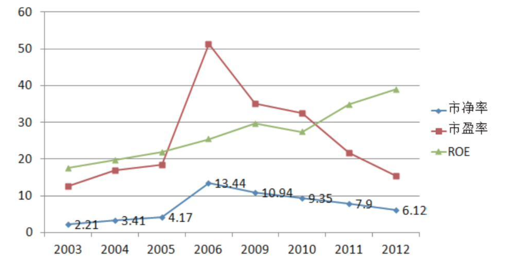
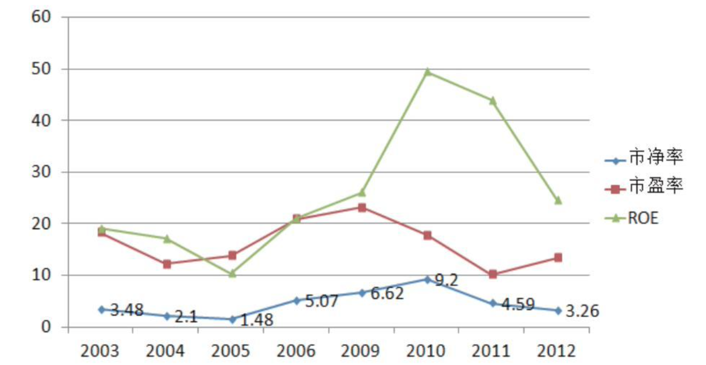
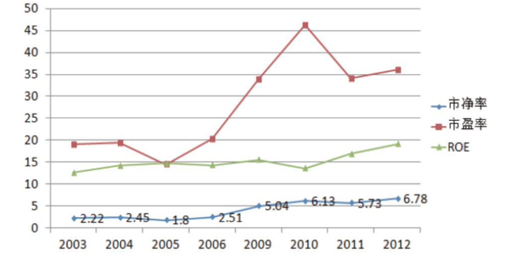
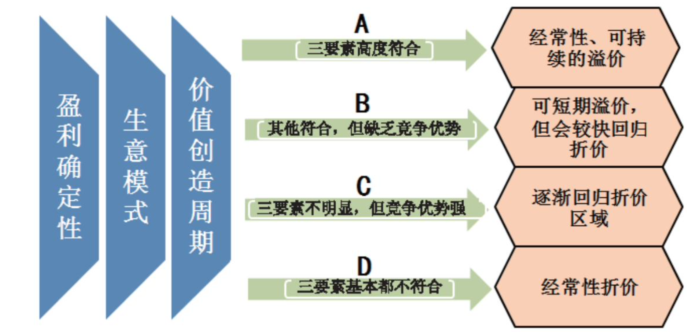
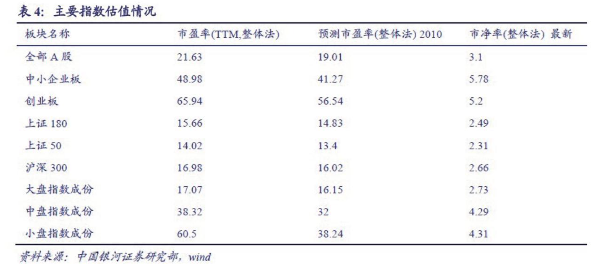
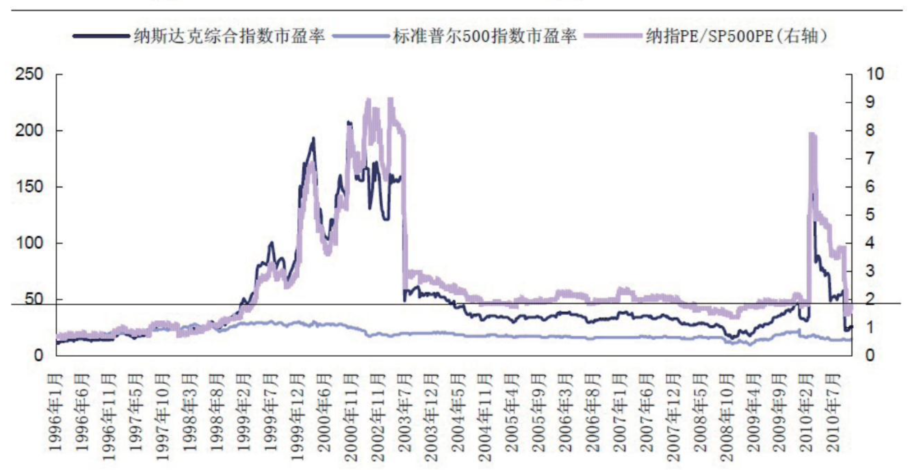
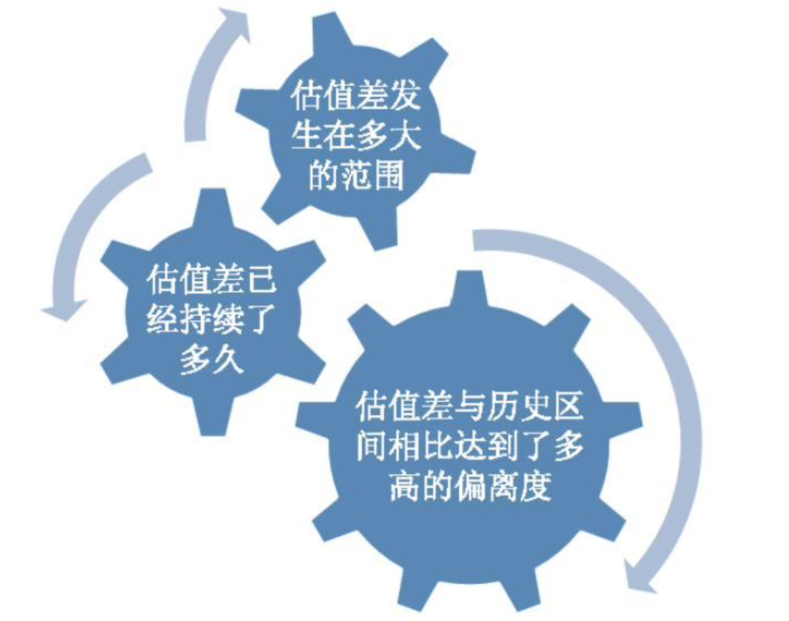
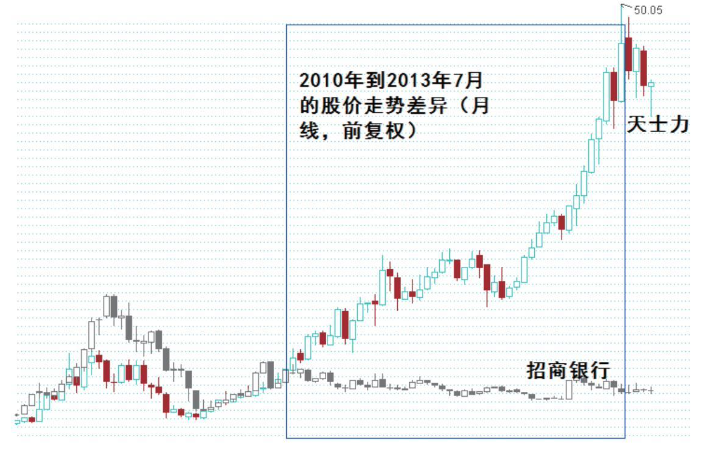

# 第12章　市场定价的逻辑

!!! note ""

    对于到底要不要倾听市场的声音，不同的人有不同的答案。我想，如果市场的声音是指各种纷繁的新闻热点、板块潮流、股评杂谈之类的话，那么确实是没必要理睬。{++**但如果我们将市场定价作为一种具有集体智慧的判断结果，那么不但需要倾听和观察，而且还需要思考**++}。原因很简单，我们的投资最终需要通过股价来变现。
    
    市场定价的逻辑将很大程度上影响到我们的投资收益。企业的内在价值最终也需要得到市场的认可，而不仅仅是投资者个人的青睐。其实**理解市场定价的逻辑，会反过来进一步有助于我们理解价值本身**。我们可以不在意市场短期的涨跌波动，但如果不理解甚至误读了市场定价的原理，则可能既无法“买好的”也很难“买得好”。

## 12.1　有效还是无效

在考虑市场定价问题时，首先需要弄明白的就是市场到底是有效还是无效的？因为这将直接决定对定价机制甚至是投资基本原则的认识。但在这个问题上，投资领域的专家学者们已经吵了几十年了。那么为什么会在这个基本的问题上产生这么多争论呢主要原因就在于它似乎怎样都是说得通的。

### 12.1.1　矛盾和争吵

市场是有效的吗？好像是这样的。

我们通常可以看到市场能对企业相关的信息给予正确和迅速的反应：**一个公司业绩预增，市场会给予其正面的反馈**；**公司如果亏损或者同比下滑了，则股价也会下跌**。除了最直接的业绩因素，市场同样对于与业绩并不直接相关但却 ^^具有潜在重大意义的事项^^ 有非常明确的反映：**如一项重大的研发获得阶段性成功**、**一个重要管理层的任职或者离职**、**某个产业政策的调整等**。

更令人惊奇的是，市场不仅仅对于短期的盈利状况进行有效反应，而且还非常关注公司的长期状况。在《价值评估》一书中作者引用了一项对美国1992年至1997年间上市公司季度盈利报表的大型样本分析显示，在信息发布四周之内盈利未达到预期水平对股价波动的影响不到2％。在对2002年137家美国公司的股价对盈利报告的反应调查中显示，只要有证据显示短期的盈利下降并不影响公司的长期盈利时对股价的影响就并不明显。因此可以认为市场的有效性不仅仅局限在短期的利润相关性因素上，而是同样考虑、甚至更加重视与企业的长期盈利相关的信息。比如，对于以下几种对短期盈利构成负面影响但可能有利于长期业绩的信息，市场就通常做出正面的反馈。

- **为了开拓市场、增强长期竞争力，增加收入来源和规模而采取的费用支出**。比如研发费用、营销和广告促销费用、关键人才的工资及激励费用等。
- **为了扩大规模和占领市场而增加的资本性支出。**
- **将非主业资产、短期虽然贡献收益但长期来看会是包袱的不良资产的剥离。**

从这些角度来看，市场的共同智慧让人赞叹。有效市场的赞同者认为：由于市场已经将所有已知的可影响价格的因素充分反映在了当前的股价中，因此任何试图通过主观努力获取超额收益的行为是不可能的，最强有力的证据是长期来看能够战胜市场的基金非常稀少，绝大部分倒在了市场指数的脚下。

那么市场还可能是无效的吗？这么说似乎也并非空穴来风。

如果市场是有效的，那么如何解释历史上那些惊人的泡沫？美国20世纪70年代的**“漂亮50“**股票普遍被炒到八九十倍的市盈率，而其他不符合当时主流成长理念标准的股票，却不论素质如何一律坠入深渊；
到了20世纪纪80年代，**生物技术**股又成为了新泡沫盛宴中的主角，一些生物技术概念的股票的市值卖到了销售额（而非盈利）德50倍。
而这些与1990年的互联网泡沫相比似乎又不值一提了。在纳斯达克的激情顶点时期，一个没有任何利润甚至是大幅亏损的股票可以仅仅因为公司的名称中含有“.com”，就轻易地被追捧到惊人的价格。
**市盈率**和**市销率**乃至于PEG都成了过时的老家伙，**市梦率**这一“创造性”的估值方法开始浮出水面。再想想48元的中石油或者回头去看看日本股市泡沫时期的光怪陆离吧。这一切发生的时候，有效的市场在哪里呢？

如果市场是有效的，又怎么解释对同一个公司，在同一个基本面状况下，市场却在很短的时间内给出相差高达百分之几十甚至几倍的定价区间呢？
50年代IBM和德州仪器公司的市盈率达到了80倍以上，而仅仅1年之内它们的市盈率就分别变为20多倍和30倍。
也就是说，在同一个基本面基础上它们的市值变化相差3～4倍——这么宽阔的价格区间中，到底哪一个节点才是反映了市场的合理定价呢？
再看看一个名叫“美国地球物理”的公司，它在1960年12月上市发行股票，发行当日的收盘价就达到了27元。
而1年后的1961年它的股价更是直冲上58元的最高点，然而仅仅又过了1年它的股价再次发生变化。这次的股价是多少呢？答案是：9元。
如果说1960年的27元或者1年之后的58元都体现了共同智慧对这个公司的合理定价和理性的期望值，那么仅仅是1年之后市值最大缩水85％又该如何解释呢？

巴菲特曾说过：如果市场是有效的，那么我早就沿街乞讨了。

### 12.1.2　捡钞票还是鉴宝

有效市场理论有大量的统计数据和案例的支持，无效市场假说也有数不清的例子和投资大师的背书。
那么到底哪一个才是市场定价的真相呢？在我看来，其实两个都是真相，只不过它们都是真相的一面而已（看，这个世界上太多的事物和问题具有这种多面性。可太多人已经习惯了一根筋式地看问题了）。
我更赞同霍华德·马克思对这个问题的阐述： ^^“没有一个市场是完全有效或者无效的，它只是一个程度问题……最终我得到一个有趣的答案：**有效性并没有普遍到我们应该放弃良好业绩的程度**。”^^

关于有效市场理论有一个著名的故事：一个金融学家和他的朋友在大道上散步，朋友突然说“看，地上有100元钱！”
金融学家说：“这是不可能的，地上如果真有100块钱早就被人捡走了”。
当然通过这个例子有效市场理论的赞同者并不是说绝对不可能有钞票掉在地上，但是钞票是不可能经常性地掉在地上而没人捡的，所以如果你希望通过去捡钞票发家致富只能是个幻想。

这个例子似乎很有道理，但仔细想想却并不很恰当。首先捡钱是没有成本的，其次钞票一般来讲也比较容易辨别真伪。但证券市场的所谓无效性现象，更像是有一个人在路边以100元售卖一颗宝石的行为。看起来这是个非常好的大便宜，但是大家未必都会蜂拥而上的原因在于：

**第一，对宝石鉴别真伪需要非常专业的技能；**

**第二，你至少需要付出100元的成本（如果你买得多，你付出的成本也就会直线上升）。**

如果宝石是真的，当然赚了个大便宜，但如果是假的，那即使100元的价格也是亏本的。所以这两点导致了一些看起来似乎人人都不应错过的投资机会，确实具有被忽略和放弃的逻辑基础。
在我看来，市场首先一定是有效的。否则我们所有的投资失去了起码的基础 ———— 试想一下，如果市场不能对企业的经营结果进行正确的反应，我们还有什么理由站在企业经营的角度进行投资呢？
{++**但市场的终将有效与市场始终有效、充分有效有着天壤之别。**++}这点我们可以借助市场有效论的基本假设前提，来理解市场无效出现的基本条件。如下表所示。

|           市场有效的基本假设和前提           |                       市场出现无效的基本情况                       |
| :------------------------------------------: | :----------------------------------------------------------------: |
| 投资者都是理性的，并且具有可靠的投资分析技能 | 投资者并不总是理性的，他们容易受到情绪的影响或者缺乏足够的分析技能 |
|    信息被广泛充分的披露以及得到迅速的传递    |        信息并不总是被充分的披露或者信息的传递不是同步完成的        |

在有效市场论者看来，投资者总是可以得到需要的信息并且对这些信息进行充分的解读。
然而**事实上并非如此**，通过常识我们就知道， ^^在股市中的绝大多数人是缺乏自我的情绪控制能力的，并且更缺乏投资分析的专业技能。^^ _此外，即使从总体上而言，信息得到了详细披露的强制性要求，并且由于互联网的存在而使得信息的传递确实可以瞬间完成。但具体到每一个股票身上，显然其所受到的**关注度不可能是均等**的，必然有一些股票更加受到关注而被研究得较为充分，而另一些股票却关注者寥寥，从而一些有意义的信息被忽略。_

更关键的一点在于，市场在将已知的信息转化为定价表现形式的估值时，是具有很大的局限性的。
通过现金流折现模型可以确信，一个股票最终的市值是取决于其遥远将来的长期经营结果的。
但这一过程中涉及大量的估计成分，市场不可能对这么长区间内的精确数值达成共识。
再考虑到”折现率”这一体现不同保守程度的变量条件的介入，
{++**我们几乎可以肯定地说：市场对于任何股票的定价即使是准确的，也仅仅是反映了当前可见状况的阶段性评估而远远谈不上对一个股票全生命周期的充分定价。**++}
这正是为何可以有这么多的股票可以在上涨了十几倍以后继续上涨十几倍（比如沃尔玛），而不是一次性体现在价格内的根本原因所在。

理解了这点后，我们可以回过头来再一次重温投资要具有历史感和前瞻性这个话题。无论多么聪明的市场，也无法充分预支一个具有远大发展前景的优秀企业的未来。**谁洞悉了未来谁也就领先了市场。**

### 12.1.3　*后谁说了算

但另一方面，不论什么原因导致了市场无效定价的出现，只要这种价格与价值的偏离到达一定程度，则市场必然会产生反应，将其纳入合理的范畴——这就像不管一个皮球被扔到多高，最终等待它的是地心引力一样可靠。

这是因为，虽然市场从整体来说绝大部分的参与者是容易情绪失控或者缺乏专业技能的，但确实又存在着一个群体具有足够的理性和分析评估的能力（我称之为成功的少数派）。
在市场的大部分时候，投资者都是在一种市场趋势下来回奔波，这种时候“成功的少数派”往往既不参与这种趋势博弈的游戏也无法起到作为逆转的力量的作用。
但当趋势运行到某种足够的程度（不管是上涨还是下跌），当这个资产的吸引力开始出现足够的保障和确定性时，即所谓的获胜的概率和赔率都极具吸引力的时刻，这些’成功的少数派”就会断然出手，并且一出手相对于其他的群体而言就是大手笔的 --
这也很好理解，既然是“成功的”，自然具有更大的实力。与此同时，趋势经过大力度的释放也运行到了这个方向的衰竭阶段，投入这种趋势的力量也就越来越少，这就越来越无法阻止“成功少数派”的力量来改变趋势。
而一旦趋势改变，**新的方向性确立会吸引新的趋势跟随资金的介入，从而实现股票的价值回归。**

我认为这就是格雷厄姆所说的{==**“市场短期来看是个投票机，但长期来看是个称重机”**==}的实现过程。{++**短期市场的起伏和定价相对更加随意，更加容易受到一些偶然性、突发性、短期性、情绪性因素的影响。但市场的长期定价在趋势与价值偏离达到一定程度后必然被一股强大的理性力量推动回归到合理范围内。**++}

!!! note ""

    蒂姆·科勒针对趋势交易型投资者和内在价值型投资者的一项交易数据调查可能对这一过程提供了佐证：在这项2006年的调查中，所有大型交易投资者买卖了11万亿美元的股票，而内在价值投资者仅为3万亿美元，这显示日常价格波动中活致的主角是前者。然而，当统计两种投资者中每个投资者每次交易的额度时，内在价值投资者约为700～3000万美元，而交易投资者只有100万美元左右。

这显示，{++**内在价值投资者出手的时候往往坚定而更具决定性**++}。^^虽然他们每年的总交易很少，但却更为集中在有限的时间内的有限的股票上，从而对股票在极端偏离价值区域内后的回归具有决定性的影响^^ -- 这其实也解答了一个疑问：为什么投资大师们说市场中的绝大多数人往往是错的，但市场本身却经常是有效的？^^**正是因为真正决定市场定价关键话语权的，不是占绝大多数但情绪化而且弱小的人，而是相对数量很少但精明和拥有决定性资本的人。**^^【关注大机构和著名游资的动向】

### 12.1.4　发现错误定价

既然已经对于市场定价有效和无效产生的原因有所了解，那么接下来更具有实际意义的一个问题就是如何利用这种现象来服务于自己的投资。我们已经知道，在市场非常有效的部分中是很难取得超额收益的，{==**所以投资的关键是找到市场暂时失效所带来的错误定价的机会。**==}

市场有效与无效各自所占的比例是多大？这个问题显然非常难以量化。但按照我的经验，^^**市场在70％的时间里是不具有重大的操作意义的，25％的时间里可能出现有意义的操作机会，而只有5％的时间是具有重大操作意义的**^^。^^这是否间接地说明在绝大多数的时间内，市场还是处于较为有效或者说不是处于重大无效的状况下？这是以市场整体为评价标准，作为个股而言我们将看到另外一种情况：{++**上市的几千家公司里，即使处于一个市场整体非常有效的背景下，只要其中有10％的股票处于错误定价的位置，1％的股票处于严重的错误定价的位置，那么提供的机会也己经足够多了。**++}^^

【也就是一年中有255天不操作，91.25天可以操作，18天重要操作机会，平均下来，一个月21天不操作，7.6天可以操作，1.75天重要操作机会】

任何一笔交易其实是正方和反方同时做出的决定（既买和卖），那么谁是错的？为什么我会确信这是一个错误定价，而不是我自己的判断失误呢？我想对此可以沿着以下的思路来提高成功率。

<table>
<thead>
    <tr>
        <td style="width: 160px;">错误定价的前提</td>
        <td style="vertical-align: middle;">市场有效性的局限</td>
        <td style="vertical-align: middle;">重点关注</td>
        <td style="vertical-align: middle;">自我审核</td>
    </tr>
</thead>
<tbody>
    <tr>
        <td style="vertical-align: middle;">市场无法对企业的远期经营结果充分定价</td>
        <td style="vertical-align: middle;">企业的长远未来经营结果涉及大量的变量和估计，市场无法对这些变量因素充分预估并达成共识</td>
        <td style="vertical-align: middle;">具有广阔成长前景、仅仅处于发展生命周期的初中级阶段的企业</td>
        <td style="vertical-align: middle;">我为何能比市场更具有远见? 
            我发现了哪些市场忽略的因素和证据? 
            这种估计是否过于乐观?我是否已经充分聆听了反方的意见，并且依然觉得上述判断成立</td>
    </tr>
    <tr>
        <td style="vertical-align: middle;">市场情绪失控的时期</td>
        <td style="vertical-align: middle;">市场往往夸大一些阶段性的信息，越是短期的股价波动越可能是情绪性的反映</td>
        <td style="vertical-align: middle;">受阶段性的重大负面信息打击，已经连续大幅下跌，价格已经充分反映了现有负面因素甚至潜在负面影响的股票</td>
        <td style="vertical-align: middle;">真的只是短期的影响吗? 
            会不会低估了这一影响的程度? 
            有多少证据证明这不是经营态势趋势性的改变</td>
    </tr>
    <tr>
        <td style="vertical-align: middle;">信息的掌握或者解读不充分</td>
        <td style="vertical-align: middle;">市场的注意力总是过分集中在那些主流品种上，而那些受到冷淡的品种则可能存在已知信息传递不充分、从已知到可知信息的解读不充分的问题。另外，业务过于复杂也会影响市场的有效解读和共识的形成</td>
        <td style="vertical-align: middle;">不要在研究已经极其充分的地方浪费时间，多找找那些市场毫无兴趣的、无人关注、缺乏调研报告、机构持仓量小的公司</td>
        <td style="vertical-align: middle;">我所得到的信息是否真的是有价值的? 
            这些信息被市场忽略的原因是什么? 
            有什么证据证明，这个股票处于严重的缺乏关注和研究不充分状态</td>
    </tr>
</tbody>
</table>

除此以外值得注意的是，市场总体上更喜欢对近期绩效做出夸张的预期，并在日常性的估值中所占的权重过大。如果公司当年的业绩增长率是80％，那么下一年的预期往往认为增长50％就算保守估计了；相反如果当年业绩增长只有10％，那么下一年似乎20％的增长率也是过于乐观的。这一方面将只不过是偶然或者短期业绩快速增长的公司错误高估为具有长期的超额收益能力的公司，另一方面对于那些真正具有长期竞争力和商业价值，但仅仅是阶段性业绩平庸的企业也有进行低估的可能。显而易见，这两点很容易造成重大的错误定价。

但坦率地讲，市场确实在大多数时候是非常精明的，要想等到市场重大失效的时机确实很不容易。个人智慧超越市场的共同智慧不是不可能，但做出这个判断确实需要非常地谨慎。降低这一判断风险的最好办法，还是牢记**安全边际** -- {==**耐心的等待永远是美德**==}，^^将未来需要验证的不确定性用当前可见的价格予以对冲永远是有利的。^^

在一个企业业绩非常突出并且市场预期很高的时候，多考虑一下可能的小概率事件。而在一个企业经营平淡或者低迷而市场预期很差的时候，{++**多去审视一下它长期发展的大概率情况**++}。这种抽离出市场情绪和企业静态业绩表现的思维方式，往往能够让我们更好地规避风险、把握机会。

其实在市场中去寻找错误定价就像是一个永远不停止的**探宝游戏**，激动人心而又困难重重。在这一过程中，{++**投资者对市场状态的敏感和耐心往往是成功的必备前提。但我个人认为，仅仅这样是远远不够的。在捕捉错误定价的过程中，最为关键而且相互之间具有内在关联性的因素是：第一，理解价值产生的源泉；第二，理解估值溢价和折价的本质**++}。因为市场的定价并非是盲目和想当然的，定价的背后是深刻的价值规律在起作用。并且市场定价从来就不是一刀切，而是存在着明显的{==**差异化定价**==}。如果不能理解这种差异产生的本质原因，那么捕捉错误定价往往会变成投奔价值陷阱，会简单地将"估值指标低"等同于“价值偏离”。

!!! note ""

    这里我想起一位证券分析师的反思索例：他回忆10年前曾关注的葡萄酒企业，王朝酒业（0828.HK）在香港上市，张裕（200869.SZ）在B股市场上市，长城没有上市。2003年这位分析师认为张裕的股价太贵而王朝很便宜，因此更看好后者。然而半年后张裕的股价大涨，王朝却原地踏步，虽然那时他已经感到哪里错了，但那时的张裕却更贵了，只好干脆放弃。之后的整整10年张裕成为标志性的大牛股，而王朝和长城却要平庸得多。事后这位分析师反思到：很多时候贵和便宜真的是有道理的，市场的精明往往超出我们的预料。

总之，市场的有效性让我们相信以企业经营的视角看待投资绝对是一个可信赖的方法，不管短期内股价因为什么原因偏离了企业的内在价值，偏离了多大的距离，它一定会回归到合理的范畴。并且市场大多数时期的有效性也告诉我们：不要无谓地瞎折腾，要么安心地持有，要么耐心地等待。而懂得市场也会失效，并且理解导致市场失效的主要因素，可以让我们知道股市中的**“狩猎场”**都在哪里，**“猎物”**在什么情况下才会出现，以便在时机来临之时果断地叩响扳机——记住：^^**猎手的优秀从来不是取决于他多么精力旺盛，而是取决于他有多了解自己的狩猎场和猎物，以及掌握了多少狩猎的基本规律和经验。**^^

## 12.2　折价、溢价与泡沫

证券市场对上市公司的定价主要是以倍数指标体现的，无论是以盈利指标为倍数的**市盈率**还是以净资产指标为倍数的**市净率**等都是如此。那么一个有趣又非常有嚼头的现象是，为什么同样的一个市场却会对不同的对象或者在不同的时间对同一个对象给出差异极大的定价呢？

### 12.2.1　三个影响因素

对市场的估值存在很大差异这一现象很多投资者简单认为是市场的不理性所致，在这些人看来整个市场最好给出整齐划一的估值。然而，这样的“完美”市场似乎从来没有出现过。

^^其实我认为当想不通这种定价的差异化的时候，不妨就思考一下社会分工的不同所带来的收入差，道理是一样的。收入差本质上越是创造更多商业价值的（商人的交换价值、科学家的研发创新），越是进入壁垒更高的（比如飞行员、精算师），越是随着时间的增长越宝贵的（律师、医生、会计），越是存在自由市场化定价的（国防科研人员就不行），定价就越高，否则就会带来定价的扭曲，就会带来问题（比如医生工资与劳动价值不匹配所导致的一系列问题）。而相反，如果这项技能很容易被复制而可替代的人众多，虽然不可或缺，但是创造的相对价值较低，以及不存在可持续积累增厚的无形资产的工作，**则可能虽然辛劳却未必获得高的社会定价**。^^

这样反过来想想，难道整个社会以一刀切的收入水准来分配才更合理吗？显然并非如此。如果说收入是社会对于职业价值的一种估值的话，那么证券市场的定价也存在类似的差异化估值的**”价值观”**。

!!! note ""

    申银万国曾做过一个长期数据研究：研究的10个国家中有8个国家医药板块相对全市场溢价，其中5个国家溢价超过30％。1980～2008年，美国医药板块相对美国市场平均溢价20％，印度医药板块相对印度市场平均溢价49％。在医药经济快速发展或者美国经济减速阶段，美国医药板块相对大势估值溢价幅度在30％～50％，印度在向国际市场快速发展的1997～2002年，相对印度大势估值溢价幅度达到50％～200％。2005～2008年4月中国医药板块估值相对大势平均溢价34％，溢价处于国际市场中间水平，2007年3月和2008年1月由于市场对中国医改的预期以及板块风格变化，溢价水平开始超过50％。^^英国和日本是全民免费医疗卫生体制，且政府价格管制严厉，导致企业盈利降低，其医药板块枯值溢价最低。^^

**估值差并不仅仅是不同行业和生意之间才有区别，同一个公司在不同的价值阶段估值也可以相差很大**。我们看看银行的例子：

!!! note ""

    招商银行2005年大熊市底部收盘价的市盈率也在18倍左右，市净率大约2.6倍，之后两年牛市涨幅十几倍。而2008年大熊市下降到只有9倍市盈率和2.4倍市净率，之后的4年却涨幅连1倍都不到并且市盈率继续下滑到5倍，市净率也仅有1.5倍左右。即使不考虑牛市的涨幅，为什么同样在熊市的2012年和2008年，在大盘指数比2005年的998点高得多的时候（2008年的最低点是1664，2012年的最低，点是1949），银行股的市盈率却大幅下降呢？^^前面提到的美国医药股曾在某个阶段享有高溢价，_但近几年由于营业规模已经极其巨大、化学药研发摸式遇到瓶颈、其依存的卫生保障模式也压力日趋增大且重磅药陆续超出专利期等重大因素的影响_，化学药巨头辉瑞的估值已经回落到15倍市盈率左右。^^

如果只是一两年的偶然现象还可以以市场偏好来解释。如果这个特性在10年甚至几十年里，在中国也在世界其他国家中都出现，那么这个客观事实的背后逻辑恐怕就值得重视了。我的理解是，在一些特定的阶段，一些特定的行业以及公司，会在整个商业环境上体现出远远超越其他行业（或自身的其他阶段）的经营优越性。这种优越性进一步体现在行业业绩增长水平的提高以及相当长时期内业绩维持的高确定性。下表是对溢价和折价因素的一个归纳。

<table>
<thead>
    <tr>
        <td style="width: 160px;"></td>
        <td style="text-align:center; vertical-align: middle;">溢价因素</td>
        <td style="text-align:center; vertical-align: middle;">折价因素</td>
    </tr>
</thead>
<tbody>
    <tr>
        <td style="vertical-align: middle;">不同的价值创造阶段</td>
        <td style="vertical-align: middle;">
            处于长期价值创造的初、中级阶段，具有广阔的发展空间和巨大的资本复制扩张潜力。 
            从ROE的表现来说就是收益密有持续提升到优委水准的潜力，且保持在较高水平的时间预期较长或者在保持较好收益率的前提下净资产具有规模上的持续大幅度扩张潜力
        </td>
        <td style="vertical-align: middle;">
            已处于价值创造的末期和成熟期，其固有业务的发展空间接近饱和，缺乏大规模新投资的潜力(或不得不投资进入高风险的陌生领域)。 
            ROE特征表现为进入高峰回归均值的过程或者高收益率将失去稳定性 (行业变迁或者竞争加剧)，资产的规模扩张逐渐遇到瓶颈
        </td>
    </tr>
    <tr>
        <td style="vertical-align: middle;">生意模式的差别</td>
        <td style="vertical-align: middle;">
            高度符合DCF三要素，属于典型的资本开支少、现金创造力强利润丰厚又接近永续经营的好生意
        </td>
        <td style="vertical-align: middle;">
            长期来看难以积累自由现金，利润微薄、资产负债表始终处于高风险状态或者生意模式决定很容易归零，难以永续经营
        </td>
    </tr>
    <tr>
        <td style="vertical-align: middle;">盈利预期的确定性</td>
        <td style="vertical-align: middle;">
            一个高度确定的盈利预期将大幅降低投资中的不确定性。在投资的世界中，市场更愿意为了获得较高的收益确定性而承受较低的收益预期（其反面正是相对估更高）
        </td>
        <td style="vertical-align: middle;">
            盈利的前景被众多不确定性所包围:技术的变迁、行业竞争的混乱、市场需求的难以捉摸、大量经营变量因素的干扰，这一切决定市场须道求更高的回报预期来补偿承担的高风险 ———— 其反面正是估值的折价
        </td>
    </tr>
</tbody>
</table>

看到“不同的价值创造阶段”，可能有读者会提出疑问：在本书中我已经多次强调了“前景”的重要意义，这是否有过于强调成长性而违背了价值投资安全保守性的一面呢？我的回答是：这种想法可能既误解了价值投资也误解了我。我们可以看一下作为价值投资开山鼻祖的本杰明·格雷厄姆在《聪明的投资者》第11章中“确定未来的价格”一文中所谈到的观点：

!!! note ""

    是什么使得一家公司的价值达到其利润的10倍，而另一家公司则达到20倍？你如何保证自己不会因为明显乐观的未来转变为一场噩梦而支付过大的代价？格雷厄姆认为，有5种因素具有决定性的作用。他将其归纳为：
    
    （1）**企业“总体的长期前景”**
    
    （2）**企业管理层的水平**
    
    （3）**企业的财务实力和资本结构**
    
    （4）**企业的股息记录**
    
    （5）**企业当期的股息支付率**

请注意，即使被称为极其保守谨慎的格雷厄姆，在考虑市场定价因素中的首要一条竟然也是“长期前景”（其实第二条也是公司前景决定性的因素）。实际上对于价值原理有所思考的朋友，对这个现象不会感到奇怪。正如在《揭开价值的面纱》一章中讨论过的，企业价值的源泉主要来自于两点：**资本回报率**和**业绩增长力**。{++上市公司与普通商品最本质的区别在于，上市公司具有持续创造价值的可能，而普通商品只是用于消费。++}**这一点决定了，对后者而言价格最关键，而对前者来说品质更重要。**

对于长期未来（或者说增长的前景）判断的困难与判断的必要性是两个截然不同的问题。显然普遍而言，对公司长期增长前景的判断都是具有一定难度的，但这并不能成为不判断的理由。或者这样说，这是一个“困难但必须要做的工作”。因为必要，所以须高度重视并且掌握相关的研究技能：因为困难，所以在得出结论的时候要做到谨慎而留有余地，要重视用较好的价格对冲不确定性的风险。这两者从来就不是谁替代谁的关系，而是水乳文融的。

注重成长性与保守谨慎有冲突吗？一个注重公司的成长性但10年才投资了5个公司的人，与一个专找便宜股票，5年就能交易50个公司的人相比，谁更谨慎保守些可能本身就是个问题。当然，根据投资者具体能力倾向的不同，有些投向前景判断的权重更多，有些更偏向市场给出低价格，这很好理解。但在我看来，优秀投资者的基本特征之一就是能在这两个方面进行恰当的平衡。

#### 1.表彰过去还是面向未来

我们经常会看到一个似乎非常强大、营业规模非常高的、被公认为伟大和管理优秀、并且财务状况良好的所谓大蓝筹，却偏偏估值比较低。而一些规模较小、经营的稳固性看起来并没有那么强健、还需要不断通过融资等途径支撑增长的企业，却经常享有较高的估值。对于这种估值的差别，很多**“价值投资者”**愤愤不平地认为这是中国市场非常不理性而喜欢炒作的表现。然而事实真的如此吗？

首先从投资的原理来看，二级市场的报价到底是对过去历史的一种表彰还是对未来发展和回报的一种预期？历史辉煌的企业也许可以证明其在企业发展史中配得上“伟大”这个称号，但却不足以证明这种辉煌将是未来的重现。对于一个在既有的业务领域中发展到高度成熟阶段的、将绝大多数经营绩效变得提升到了极佳水准的企业而言，它要在未来创造更高的经营高峰实际上不是变得更简单了，而是更困难了。一个只能跳过0.5米横杆的人经过良好的训练和刻苦的努力，也许可以达到1.5米（3倍增长）的较好水平。但已经达到2.2米高度的优秀选手，即使再努力也要面临2.45米这个世界纪录的巨大天花板。从表彰角度来看我们可以给予后者更多的鲜花和掌声，{++**但在投资角度而言回报不是来自于过去的成就，而是来自于未来的增量。**++}

这也并非是中国市场的特例。我们可以看到在美国这个世界上最大也被认为是最成熟的市场中，那些让整个人类都如雷贯耳的伟大企业微软、可口可乐、苹果、思科、沃尔玛等都不过只有十几倍的市盈率，而在它们早期的成长阶段的市盈率却远高于今天（那时它们的营业规模还很小、事业处于高速增长但同时也面临相应的不确定性，其经营管理远未像今天一样被广为赞叹）。这是否也是“不理性”呢？

其实这恰恰说明了市场的理性。{==**市场对于一个企业的定价并非是针对其当前的状况，更不是根据其历史的表现，而更多是基于其所处的价值创造的大周期的定位**==}。如果我们从价值的根本源头“现金流折现”来看这个问题，可能会看得更清晰一些：就像人们事业成长的抛物线一样，也许事业最辉煌、地位最高，最受人尊敬的时候是60岁，但这个时候其在未来可继续创造的现金流已经非常有限，再提升的可能性也越来越小。而30岁虽然绝对收入规模远小于前者，但只要具有优秀的外部前景（职业选择）及个人素养（竞争优势），那么其在未来可创造的现金流的总量和增量都可能远远大于前者。以现金流折现的原理来看，后者的估值更高是很正常的。

事实是最好的证明。2012年堪称最伟大软件企业的微软只有15倍左右的市盈率，而名不见经传但依然处于上升发展阶段的塞纳（美国著名医疗信息软件提供商）却享有着近40倍的市盈率，这种定价的差异是否可以简单归于“非理性”呢？苏宁上市的第一天市盈率就在30倍以上，但据媒体统计，如果上市当天买入，一直持有到2009年，则回报率高达700多倍。2012年末苏宁的市盈率只有17倍了，看起来很便宜，但这二者之间哪个时段更具有投资价值呢？{++**企业的生命周期所蕴含的价值创造周期，恐怕并不能简单地以市盈率来衡量。**++}

#### 2.ROE与估值的反差

净资产收益率（ROE）作为企业价值创造的最综合性展示指标对于这一问题也有观察意义。通常我们会认为越高的ROIE应该匹配相对高的估值。但如果我们观察一个企业的动态估值分布，却会发现其估值的中枢并非完全是随着ROE的抬高而线性走高。恰恰相反，^^对于一个实现了ROE从低到高的完整走向的企业而言，其ROE的高点可能反而对应着估值的下降^^。我们来看三个典型的案例，如下表所示。

!!! note ""

    ~贵州茅台~

    

    这是贵州茅台的ROE与PB、PE的结合趋势图（股价均取当年收盘价；由于2007、2008年的波动过于剧烈，属于极端态。因此将这两年的数据予以了刨除，下同）。可以看到2003年以来它的净资产收益率扶摇直上，到2012年达到了历史高点的38.9％的惊人水准。但其估值从2003到2006年随着ROE的上升而不断上移，并在2006年见顶，随后一路下移，2012年其市盈率下降到只有16倍不到，基本上只与2004年的水平相当（而2012年净利润的增速却依然高达50％）。虽然这其中有遭遇会款消费管制、经济转型等诸多因素影响，使得其多年来施行的连续大幅提价的“印钞机”经营态势遇到麻烦，但这只是触发的表象。真正更本质的原因还是在于它已经进入了价值扩张的中末端。又如下表所示。

    ~三一重工~

    

    三一重工的市盈率也出现了剧烈的回归现象，而这种回归也正是发生在其净资产收益率达到历史高点的2010年（当年净资产收益率49.4％）与贵州茅台相似的是，三一重工的高收益率受益于行业景气，并且也已经进入一个较大规模的基数。当然，细心的朋友可能会发现三一重工与贵州茅台的市净率变化相差非常明显，在下面我会揭示其中的原因。又如下表所示。

    ~天力士~

    

    天士力的情况却截然相反。其ROE开始向上爬升出现在2010年，2012年达到19％左右。但自2006年开始其估值就稳定攀升并至今依然保持在历史的最高水平。这其实正是由于正在进入创造超额收益阶段，处于企业价值创造的中期而非末期。并且随看2010年FDA2期认证的通过，其原本潜在的竞争优势开始逐渐发挥效益，并且这种态势还将保持较长的一段时期。所以2010年我曾在一篇博文中谈到“自此天士力进入一个经常性的估位溢价阶段，我对此并不会感到吃惊，正是这个逻辑下的结论。当然，最终它的估值随着逐渐进入企业发展成熟期的过程而回归的结局只是个时间问题，但对投资者来说抓住这种**未来优势型企业**的超额收益阶段正是意义所在。

这些案例给予我们一个重要的启示：对于那些刚刚经过了什么”黄金十年”之类的长期行业景气繁荣、企业已经将各方面经营要素运作得登峰造极且达到资产收益率极高水准的要特别小心。很简单的道理，这个世界是均值回归的，否则几个巨头公司早就占领全世界了。超额收益的长期持续其实是一种对均值的偏离现象，达到一定程度一定会遇到阻碍而回落（要么是行业景气因素的稀释，要么是产业竞争导致了新陈代谢，又或者是企业在优势领域内已经业务饱和而不得不进入竞争性更强和不确定性的新领域）。{++**对于这种各方面堪称完美的大市值（相对行业而言）企业，给予高溢价反而是一种昂贵的错误。恰恰是那些当前看来还不那么完美，数据还没那么漂亮，但其业务具有远大发展空间并且具有强大差异化竞争优势的企业才应该享有更多相对的溢价的机会。**++}

#### 3.好生意就是不同

企业的生命周期和价值创造周期虽然重要，但却不是唯一影响到市场差异化定价的因素。我们经常可以看到，一些已经步入缓慢增长和市场成熟期的企业，其估值却显著地高于市场的平均水平甚至是那些依然处于较快速增长阶段的企业。

!!! note ""

    好时糖果公司的收入增长率已常年处于5％以下的水平，但其2009年底的市盈率却接近20倍，超过了70％的美国400家最大的非金融公司。又比如金宝汤公司与折扣零售商科尔士公司的市盈率非常接近，但前者仅实现了4％的增长而后者的增速却是15％。同样我们可以看看东阿阿胶与北新建材的比较，从业绩状况来看北新建材过去5年的复合增长率为22.8％，而东阿阿胶为29.34％，相差并不很大且都依然具有很大的发展前景。但东阿阿胶过去5年的市盈率运动区间最低也有22倍最高在45倍倍以上，北新建材却最高也不过20倍左右的市盈率，最低只有10倍。

显然，在成长空间和企业生命周期之外，另有一个影响到企业溢价还是折价的关键性因素存在，那就是生意特性。在本书的第二部分曾经重点探讨了不同生意特性在财务和业务特征上的巨大差别，对于那些更符合DCF三要素（比如好时糖果和东阿阿胶）、资本收益率更高的（比如金宝汤的资本收益率高达50％而科尔士只有15％）生意，在相似的条件下其享有更高的估值溢价机会。

虽然俗话说“36O行，行行出状元”，而且现实世界中确实每一个行业都可能出现优秀的经营者和大牛股，但是普遍意义上来讲生意这个东西真的是天生就很不公平的。依然从“现金流折现”这一基本的估值理论源泉出发，我们会发现所谓的好生意确实更容易孕育和积累价值：更低的资本支出、更高的资本回报率、更好的现金流水准、可预期的持续的需求、更容易差异化而导致的高进入壁垒……这一切成为其持续孕育价值并形成长期壮观复利的温床。

在前面贵州茅台和三一重工的ROE与PB、PE趋势图中，我们也可以看到显著的差异：首先作为强周期企业的三一重工收益率波动极为剧烈，收益率呈现阶段性特征而不是趋势性特征。其次，我们看到其市净率在2012年由于行业景气市场回落它的市净率基本上跌回了2003年的水平，甚至长期来看跌回最低水平也并非不可能。而贵州茅台虽然市盈率下降较迅速，但市净率却相对于10年前高得多。这其实反映了两者生意特性上的巨大不同——茅台毕竞是具有极高的差异化壁垒和强大的现金创造力，即使进入价值创造的终末期也仅仅影响的是增长率，它本质上的高资产收益率和现金流的稳定性是工程机械企业所无法比拟的。所以一个在行业景气下降后市净率就跌回最低区间，而另一个长期来看依然可以享有中高水准的市净率估值。从这个角度讲，即使两个企业处于相似的价值创造周期，完全不同的生意属性也足以使得他们分别显现出溢价和折价的不同特性。

另据麦肯锡的一项统计，资本支出与资本回报率是影响市盈率的一个关键性指标。

!!! note ""

    假设两家公司当前的营业规模均为1000万元盈利均为100万元，未来5年的收入增长和盈利增长率都是5％。a公司的资本性投资较少（假设5年共计资本性支出占盈利总额的25％），而b公司具有较高的资本性投资需求（假设5年共计资本性支出占盈利总额的50％），那么这两家公司在完全相同的营业收入、盈利水平和增速的前提下，a公司比b公司要多创造出50％的现金流。这个时候，如果我们采用10％的资金成本来对这两个公司进行贴现，并将这些现金流进行加总得到a公司的数据是1500，而b公司只有1000。用1500和1000分别对两家公司的当前盈利100万元相除，就会得出a公司的市盈率为15，而b公司的市盈率只有10。

    在这个案例中，a公司的低资本性支出属性是建立在其较高的资本回报率基础上的。A公司第一年的盈利是100万元，而支出占盈利的25％也就是25万元。又由于第二年其收入和利润都上涨了5％，所以其投入的资本回报率约为5/25×100％=20％。而相同情况下b公司的资本回报率则只有10％（同样带来5％的盈利增长却需要多一倍的资本性投入）。

“从这份调查进一步得出的结论是：当投入的资本回报率较高时，业绩的高增长将推动价值的增加。但资本回报率较低时高增长却会导致价值的下降。而一旦资本回报率低于资金成本时越大的增长就将越破坏价值。而且，考虑到现实的商业世界中两者的应收和盈利的未来确定性会有更大的差别，因此具有不同的资本支出和资本回报率的企业在模拟计算中所体现出的估值差异会更明显。”

#### 4.确定性的来源

越是低风险的投资品种回报率越低，相反则必须提高回报率才能形成平衡。比如银行存款是几乎没有风险的，所以只能获得3.5％的年利率。相比较而言，企业发行的债券的信用风险就要高得多，因此必须付出更高的利息吸引投资者。一些企业债的票面利息可以达到8％左右，如果企业的信用很低，那么利息还要更高。我们知道，市盈率是收益率的倒数，所以如果将银行存款和企业债务作为两个企业来估值，那么前者的估值就是28.57倍，而后者只有12.5倍左右。前者这种溢价就是来自于更高的回报确定性。

当然，确定性本身其实是一个定义模糊的词，在股票投资的语境中，确定性永远是相对的、暂时的，而不确定性其实才是绝对的、永恒的。但毕竟不同的公司的内外部环境相差很大，这确实导致一些公司的经营前景相对于另一些公司而言更具有可预期性。那么经营前景的可预期性来自哪些条件呢？我想包括以下几条，如下表所示。

!!! info "有力的供需关系"

    - 供不应求的产业格局
    - 长期需求扩张而进入壁垒极高

!!! info "独特竞争优势"

    - 业务具有某种“利基”
    - 高度差异化的竞争优势，不容易被重置

!!! info "经营变量因素少"

    - 产业或者地域竞争烈度较低
    - 没有大量对经营构成严重影响、波动剧烈的变量因素

严格意义上来讲，供需关系可以归纳入不同价值创造周期中，因为供需情况的演变往往是企业生命周期变化的一个外部表现。但由于这个因素在日常定价中占据很明显的权重，因此予以单独提列。

在第二部分“让视角回归本质”一章中已经就市场供需格局的不同状态和意义进行过讨论，供不应求显然是市场最青睐的一种局面。对于处于这种局面下的企业，需求处于爆发性增长中而供应则由于进入壁垒或者先发优势等因素而有利于当前的行业领先者。在这种情况下市场也非常喜欢给予高溢价。从表面来看这一点似乎也无可厚非，因为供不应求预示着企业订单的源源不断和未来可预期的几年内营收的突飞猛进。所以较高的估值有望被快速提升的业绩所熨平。

市场对于供需失衡这个因素往往非常敏感，这确实要比前两个因素更加直观并且具有话题的刺激性。但这个估值溢价因素隐含着巨大的风险，因为当期盈利的优秀并不代表真正的盈利能力的卓越。吃市场景气的顺风宴往往最热闹火爆，但这种宴席也经常最快曲终人散并留下一片狼藉。所以特别需要注意的是，这种供需的失衡必须至少在3～5年左右的区间来看是非常明确的趋势性的驱动，而不是那种一两年突然兴起的短期行业景气的波动。

!!! note ""

    天富热电是一家拥有独立电网的发电企业，从生意特性上来看没什么亮点。但其所在的石河子市恰逢新疆经济开发和内地制造业转移的大潮，大量的高污染及重工业企业在很短的时间里密集进入石河子经济开发区。这就导致了石河子市的发电供应量在短期内远远跟不上用电需求的“供需失衡”。而且这种失衡随着迁入的企业越来越多有加剧的可能，此外天富热电拥有石河子地区唯一的发电和供电行政准入壁垒。这两个因素一结合，就是这家企业在未来几年内的业务提升量都只取决于其发电能力的建设速度上了，而这种建设的计划又几乎是公开的，由此带来很高的业绩增长的确定性。

    也因此，跟发电的同行业进行比较，天富热电差不多是发电行业中估值最高的公司——2013年上半年发电行业的市盈率普遍只有8～10倍左右（有些高市盈率是因为盈利太低），市净率在1.5（以2012年末净资产为基准，下同）以下为多，而天富热电在业绩高增长后还保持在15～20倍的市盈率和2.5倍的市净率。这种估值溢价可以说完全建立在供需失衡所导致的业绩增长的相对确定性上。

竞争优势的作用显得有些复杂。并不是所有泛泛而言的竞争优势能够带来溢价，比如格力电器在国产家电行业中具有明显的竞争优势，但其相对于青岛海尔、美的电器却并无什么溢价（2013年4月都在10倍市盈率左右），甚至还低于小天鹅a和九阳股份。同样，天士力独树一帜的竞争优势也并未换来其在中药制造业乃至于医药制造业中明显的估值溢价，甚至在2010年之前还处于相比同行业的折价状态，仅仅是在2010年正式通过了FDA2期试验并且反馈到了业绩的高增长之后才形成较为明显的溢价。

对此我个人的理解是，首先竞争优势是一个非常个人化的主观判断得出的结论，相对于整个证券市场的判断力而言，它并不那么直观和容易形成共识。另一方面，“竞争优势”只是一个手段，目的是超额收益——而脱离整个行业发展阶段和生意属性谈竞争优势也可能有点儿形而上。是否有优势一定会反映在企业的经营结果中，无论是在生意特性的优化上还是业绩的持续表现力上。当这一点表现出来后市场通常会给予相应的反映，只不过从表面看来这种反映更像是针对当前业绩和可预期的未来业绩而已。

但反过来看，如果企业丧失了竞争优势其对于估值的杀伤力则是明显的。竞争优势的丧失，意味着盈利能力走向平庸，企业开始陷入不确定性的沼泽，市场对此的预期下降并不难理解。

!!! note ""

    苏宁电器（已更名为苏宁云商）是一个典型的案例，本来在家电连锁店业态中它已经成为无可置提的王者，并且以原来的业态来看要想颠覆它也确实不容易，竟争对手仅仅是复制它的店面数量就需要数年时间。但电子商务的爆发式增长瞬间改变了这一切，原本苏宁引以为傲的店面优势却反而成了全面转型电子商务企业的一个麻烦。随之而来的则是竞争烈度的提升，业绩的下降和枯值的大幅下滑。如下表所示。

    |                | 2009年  | 2010年  | 2011年  | 2012年  |
    | -------------- | ------- | ------- | ------- | ------- |
    | 业绩增速       | +32.32% | +37.37% | +19.01% | -48.72% |
    | ROE            | 19.88%  | 21.88%  | 21.59%  | 9.4%    |
    | 年收盘价市盈率 | 32.46   | 22.98   | 12.41   | 17.97%  |
    | 年收盘价市净率 | 6.66    | 5       | 2.16    | 1.72    |

    其实在2012年，我对已经大幅杀跌后的苏宁电器产生过浓厚的兴趣，但经过仔细的研究和思考后，我认为它面临的不是普通的景气或者转型问题，而是面临颠履性商业模式的挑战。更要命的是这场战斗的烈度极高，而且平台商的战争结果往往是赢者通吃，输的却可能连粥都没得喝了——也就是说一旦竟争失利，业绩的下降几乎是无底线的（这种特性下所有的“低估值”是脆弱和不堪一击的）。从各方面衡量，我都得不出苏宁能高概率取得胜利的结论，或者说它完全处于我能力圈的范围之外，因此还是冷眼作壁上观吧。

似乎可以这样认为：竞争优势的强弱和是否清晰体现了公司实现预期收益和增长的风险程度。竞争优势越强大，越能免于与市场竞争，越具有实现目标的可预期性和可持续性，就越会巩固其他几个因素的牢靠程度，使得其溢价更为明显和可持续。

“利基”一词源于法文，原指宗教信徒在墙壁上凿壁而建的，摆放圣像的小洞窟。英文解释有登山时着力的牢固支点的含义。彼得·林奇首次将其引入作为一个投资上的概念，我的理解是形容为某个企业在特定领域拥有的某种行政准入壁垒。这种权利由于市场垄断地位、独特的资源禀赋等因素，可以免于市场竞争的袭扰，从而为企业带来丰厚和高确定性的回报。

!!! note ""

    盐湖钾肥（现已更名盐湖股份）就曾经是一个典型的拥有利基的公司。它掌控了对青海湖所产钾肥的独家生产经营权。特别是在七八年以前，钾肥在国内只有这样一个出产地。并且从总体的供需格局来看国内大部分所需的钾肥需要进口。这样一个利润丰厚而又独家经营的生意，成就了盐湖钾肥在2005～2007年间的超级牛股走势。值得注意的是，2011年公司完成集团资产注入，但注入了大量劣质资产的盐湖股份不但被稀释了盈利，并且还需要为注入的化工项目持续资本支出弥补窟窿，加上钾肥价格由过去几年的飚升变为下跌，由此公司的业绩和股价都大幅下挫。由此可见，“利基”并非一成不变，要随着形势的发展而动态评估。

经营的变量因素还是一个不确定性的问题。我们经常会发现有的公司的业务简单、好理解，有些公司的业务却让人云里雾里摸不着头脑。越是经营复杂的公司其涉及的变量因素就越多，也越发不可捉摸——这对于喜欢玩猫腻的公司是好消息，因为很难去证伪。在《经营观测与守候》一章中的“警惕这些业务特征”中已经列举和讨论了相关的问题，这里不再赘述

### 12.2.2　四种溢价程度的处理

似乎可以这样认为：竞争优势的强弱和是否清晰，体现了公司实现预期收益和增长的风险程度。竞争优势越强大，越能免疫于市场竞争，越具有实现目标的可预期性和可持续性，就越会巩固其他几个因素的牢靠程度，使得其溢价更为明显和可持续。

溢价的原理是基于DCF理论并且结合经验性的判断，但不能期望市场时刻都具备这种准确的定价能力。这点我们在前面的市场有效无效中进行过讨论。认识到这种关系的意义在于，这种定价基准的理解可以帮助投资者更好地锁定错误定价。

溢价原理的另一面就是折价机理。理解了经常性溢价的本质，就不会盲目给予当前市场热捧的明星一个高的买入价位。特别是对于那些本质上属于折价的企业，由于市场偏好给予了高估值的泡沫化危险，可以非常明确地予以规避。如果不理解溢价和折价的机理，就很容易陷入用过于细节化的视角看问题，而缺乏一种原则性的价格判断体系。这其实是非常危险的。

估值溢价的存在不代表调整不会发生——溢价与折价原理不是市场走势的指南针，而不过是内在价值差异性的一种外化表现形式。就短中期而言，决定股价走势的还是资金偏好和市场情绪。这就会出现一种情况，股价短期被推升到一个很高（低）的价格水平，对于这种情况该如何处理呢？我想依然需要具体情况具体分析。对照着上图中A、B、C、D四种溢（折）价特征的思路如下，如下列图表所示。

<table>
<thead>
    <tr>
        <td style="text-align:center; vertical-align:middle; width:100px;">类别</td>
        <td style="text-align:center; vertical-align:middle; width:150px;">市场定价情况</td>
        <td style="text-align:center; vertical-align:middle;">处理思路</td>
    </tr>
</thead>
<tbody>
    <tr>
        <td rowspan="2" style="text-align:center; vertical-align:middle;">A类</td>
        <td style="text-align:center; vertical-align:middle;">给予很高估值</td>
        <td style="vertical-align:middle;">如果确信其价值创造周期还非常长，且其他溢价因素和竞争优势明确而牢靠，以坚定持有为主要原则</td>
    </tr>
    <tr>
        <td style="text-align:center; vertical-align:middle;">给予很低估值</td>
        <td style="vertical-align:middle;">属于本质上高溢价企业被赋子折价的重大错误定价，坚定并且有力度地买入(当然可以根据市场形势设定分段买入的区间和度)</td>
    </tr>
    <tr>
        <td rowspan="2" style="text-align:center; vertical-align:middle;">B类</td>
        <td style="text-align:center; vertical-align:middle;">给予很高估值</td>
        <td style="vertical-align:middle;">测算一下这个估值水平已经透支了其未来正常估值水准多久的业绩，若透支较多以卖出和减仓为原则</td>
    </tr>
    <tr>
        <td style="text-align:center; vertical-align:middle;">给予很低估值</td>
        <td style="vertical-align:middle;">属于较明显的定价错误，可予以增持或者买入</td>
    </tr>
    <tr>
        <td rowspan="2" style="text-align:center; vertical-align:middle;">C类</td>
        <td style="text-align:center; vertical-align:middle;">给予很高估值</td>
        <td style="vertical-align:middle;">市场高估了竞争优势并低估了折价因素在未来的不断强化属于高估性错误定价，以卖出为原则</td>
    </tr>
    <tr>
        <td style="text-align:center; vertical-align:middle;">给予很低估值</td>
        <td style="vertical-align:middle;">历史的良好口碑往往吸引投资者面对表面的低估值而蜂拥买入，实际上这不过是回归正常估值水平。除非出现负面因素的持续引爆导致的极低估值，否则原则上不构成交易吸引力</td>
    </tr>
    <tr>
        <td rowspan="2" style="text-align:center; vertical-align:middle;">D类</td>
        <td style="text-align:center; vertical-align:middle;">给予很高估值</td>
        <td style="vertical-align:middle;">属于典型的泡沫，大多短期的行业景气和概念性炒作都是此类，坚决卖出以及规避</td>
    </tr>
    <tr>
        <td style="text-align:center; vertical-align:middle;">给予很低估值</td>
        <td style="vertical-align:middle;">这类企业大多数并无稳固的价值创造基础，低估值中往往还隐藏着陷阱。只有当出现极度悲观的极低估值时，才可考虑构筑一个分散化的组合并作为套利性的头寸</td>
    </tr>
</tbody>
</table>

投资是一个原则性和灵活性结合的游戏，上述提供的是一种处理的原则但具体操作显然在不同的个人情况下可因地制宜予以灵活处理。比如a类的高估值状态原则上是坚定持有，但如果你已经持有了它很大的仓位比重，又或者有更好的选择或希望加大现金的比例以应对突发情况，当然可以卖出一部分仓位。这些细节可以在大原则的基础上进行符合个人投资心态、预期、资金状况、持仓结构的优化，不再赘述。

### 12.2.3　溢价与安全边际

需要说明的是，所谓溢价和折价其实是一个相对的概念而不是一个绝对值。溢价和折价也不能仅仅以某一个时点的市场平均估值为参照物，特别是不能以某个市场极端态为参照，而应该是一种具有可持续性的经常性状态——比如我们不能以6124点或者1664点作为正常的估值参照，因为在极点状态的价格中包含了太多非经常性的情绪因素。而且由于三个溢价要素之间可能出现矛盾，因此溢价本身需要具体情况具体分析。比如，火力发电行业本身的商业特性和总体的价值创造周期决定了其本质上难以获得溢价，但如果其中某个地域出现阶段性的供需不平衡则可能导致这个区域的受益企业得到一定的溢价。但这种溢价仅仅是相对于同行业估值水平而言的，你不可能仅仅因为“溢价”两个字给予它和成长期的品牌消费企业一样的估值。

遗憾的是，对于高度符合高溢价原理的企业到底该以什么估值水准来认为其“合理”恐怕很难有个标准化的答案——或者换一个问题：投资是不是一定要精确到算出一个明确无误没有商量的“标准估值”才行呢？我认为不是。最重要的不是刻舟求剑地探寻10PE还是20PE才是铁律，而是理解溢价与折价所反映的内在价值的区别，以及由此体现在具体操作上指导思想的不同。如果我关注的股票确实价格很贵，那么要么我会把它放入重点股票池中等待，要么就只买一点儿放在那里作为安慰奖。幸运的是买入的好机会在定性层面相对明确些：被阶段性的、短期的、一次性的坏消息所集中打击或者被系统性的下跌所株连的恐慌时刻，就是最好的时机。

在以往讨论溢价原理时经常遇到一种误解，认为探讨市场定价的溢价原理是为泡沫寻找一个体面的理由，并且将置投资者于忘记安全边际的危险境地。然而事实果真是如此吗？

以贵州茅台为例，如果可以很早地理解估值溢价的原理，那么完全有机会在很低的估值状态下买入它（其实绝大多数的好企业都曾经给出过一个很便宜的价格）。毕竟，2005年之前的3年，其年收盘价的估值都不过十几倍的市盈率。恰恰是不具备这种意识的人，才会在茅台暴涨成为一个神话之后，再去盲目歌颂其护城河如何强大、资源如何的不可复制。但若那时以几十倍的市盈率接盘的结果，恐怕就要在之后的估值下滑周期忍受多年无回报甚至亏损的局面了。所以理解估值溢价的重要意义，首先就是可以更好地把握好公司在合理甚至低估期间的买入机会。

研究估值溢价的内在逻辑也丝毫未改变“安全边际”原则。安全边际、错误定价是“买入”时的第一原则（内在价值评估是前提）没错。但是，如果将买入看做是一个只有类似2008年那种大股灾中才能出现的机会，是否会犯另一种推向极致的错误呢？人这辈子还有几次买入机会呢？这不显得过于荒谬了吗？所谓的安全边际是否仅仅是价格这单一因素？一个看起来估值很低，但实际上却处于价值毁灭状态的公司会安全吗？而一个看起来估值稍高相对溢价的公司，如果高度符合上面的溢价原理难道就不安全？我想，更好的安全首先来自于选择一个价值创造属初中阶段，有良好的生意属性和强大竞争优势的企业，其次才是选择这个企业被市场错误的定价的时机。

这样才可能在合理价格出现时果断地拥有一个好的生意，而不是只能永远感叹“太贵了”。总之，溢价现象不是兴奋买入的理由，正如同高企的价格也不是慌乱卖出的理由。只有看懂这背后的逻辑，才有可能尽量做出正确的决策，尽量避免做出错误的决策，从而使得投资这一本质上的概率游戏，形成更加有利于自己的局面。

## 12.3　估值差的影响

估值差作为一种客观存在，对于我们的投资会有什么样的影响呢？投资者有没有可能将估值差作为一个经常性的套利手段呢？

### 12.3.1　弹簧总是有极限的

既然市场定价存在着折价与溢价的现象，那么必然会呈现出不同股票群体的估值差现象。从现金流折现的角度来看，处于不同价值创造周期、不同商业特性和不同市场供需态势，不同竞争牢靠程度的企业其估值基准的差异化是合理的。但在实际应用中可能需要注意两个问题：

第一，估值差虽具有相对的合理性，但不具有无限的拉伸性。

第二，估值差受到各种因素的影响而处于不稳定的状态。

第一个问题是显而易见的，即使是一个应该属于折价状态的股票，我们也不能由此就认为它应该无限地接近于毫无价值。同样，一个方方面面看起来非常符合高溢价原理的公司，并不代表给予它任何价格就是合理的。原因也很简单，企业的未来都是一个估计值，只不过由于各种可知条件的不同而产生出不同的确定性。但只要存在着不确定性因素的安全边际都必然是一个牢不可破的原则，如下图所示。

~2010年末A股各主要指数的估值差异，图片来自网络~

2010年末时正好是自2008年末的一轮熊市大反弹的末期，几大指数分别在当时见顶。随后的两年市场出现所有指数的整体性调整，但由于2010年末各自估值水平的不同（创业板市盈率是上证50市盈率的4倍），这种调整呈现出较明显的差异，如下表所示。

|          | 2010年最高点位 | 2012年最低点位 | 调整幅度 |
| -------- | -------------- | -------------- | -------- |
| 上证50   | 2584           | 1528           | -40%     |
| 沪深300  | 3597           | 2102           | -41.5%   |
| 中小板综 | 8017           | 4013           | -50%     |
| 创业板   | 1239           | 585            | -52.78%  |

从这个统计中可以看到，2010年之后两年的调整中估值最低的上证500和沪深300指数调整幅度也是最小的，而中小板和创业板的高估值获得了更大幅度的调整。考虑到2012年末，中小板和创业板的平均估值依然非常高，而上证50等都纷纷创下了新低，所以这一调整从指数的角度来看幅度的差异比想象的要小得多。如果从不同指数中的具体股票来看，则分化更加明显。一些不具有高溢价本质而被错误高估的股票跌幅极其惨烈（如金风科技的跌幅高达86％），一些虽然应具折价属性但已经被市场赋予了极低估值的股票在这轮大跌中并无超额损失（如银行股的跌幅大致等于或小于上证50的跌幅），而一些具备突出高溢价特征的企业反而在持续两年的跌势中不断创出新高（如一些医药股）。

当然仅仅一两年的情况也确实并不具有说服力，从估值差的极端表现和长时间周期下的视角来看，也许美国的纳斯达克是最为典型的案例。下图是美国纳斯达克指数与标普500指数的一个市盈率估值差历史走势。

从图中可见，在1999年到2002年期间，纳斯达克综合指数相对于标普500指数的溢价高达9倍！且其最高点的市盈率已经达到200倍的惊人水平。但经过了长达4年（1998～2002年）的极高估值差之后，这一历史上著名的泡沫还是在2003年破裂，随后纳斯达克指数出现瀑布般的大调整。经过这一轮惨烈洗礼后，两者的估值差迅速回归到一个相对更合理的范围。

因此，估值差虽然是市场先生定价艺术的体现，但它显然并不对估值差的幅度具有无限的容忍力。弹簧是具有弹性的，但没有哪根弹簧可以无限地拉伸。

### 12.3.2　从偏离到回归

当由于某种原因出现极不寻常的市场估值差价时，高估值与低估值的各自方向性走向首先会放缓，接着进入胶着状态，最终将就这种极端情况，寻求一个妥协的方案，恢复到一个为市场各方所能接受的程度，从而进入新一轮的博弈。这种估值差的收窄至少有3种表现形式，如下表所示。

!!! note "高估值下跌向低估值靠拢"

    - 下跌市背景下出现
    - 或者高估值难以为续

!!! note "低估值上涨向高估值靠拢"

    - 上涨市背景下出现
    - 或低估值已经跌无可跌

!!! note "业绩差填平估值差"

    - 高估值品种的高增长预期被证实估值降低
    - 低估值品种的担心被证实，估值升高

上述3种估值差的演化情景可能反映了市场的基本特征：低估值向高估值流动，更多是上涨式背景，表现为所谓的轮涨；高估值向低估值流动，多出现在弱势环境下。此二者的拐点是牛市再无低估值而高估者登峰造极，熊市几乎无绝对高估值品种而低者逼近极限。业绩差抚平估值差则是市场有效性程度较强的体现。在对估值差进行方向性判断的时候，可以从3个方面思考，如下图所示。

显然，当估值差达到甚至创了历史上的最高水平，且已经持续了很长时间，并且这一现象已经是大范围的普遍现象时，这种估值差向均值回归的概率也就越大。既然估值差所导致的方向性判断是可能的，那么有没有可能对这种估值差的流动状态进行套利呢？比如在估值差明显的时候，卖出高估值的股票而买入低估值股票以获取收益并规避风险？我想理论上这是可行的，但实践中可能面临的问题会比较复杂——这正是“估值差受到各种影响处于不稳定状态”的体现。

### 12.3.3　不稳定性和复杂性

首先我们知道市场环境会影响估值差的幅度，但遗憾的是没人能预知接下来会是什么样的市场环境。就算对未来有一个大概的方向性的判断，也没人知道估值差的极限点（拐点）到底是多少？宽阔的估值差会保持多久？以及最终合理的平衡点到底在哪里？

比如上例中2010年末上证50的估值最低，创业板的估值是其4倍，但接下来两年的总体走势却是同步下跌而不是低估值品种能够在高估值品种的杀跌中保持稳定甚至上涨。更糟糕的是，随着2012年末创业板的大幅持续反弹，到了2013年中的时候，它们之间的估值差反而更加突出了。虽然从理性的角度衡量这种估值差未来必将大幅地收窄，但到底是什么时候呢？没人知道——不要小看时间的作用。即使方向是清晰的，但如果时间远远超出预料和准备之外，那么它所造成的负面影响和实质性损失同样会让人终生难忘。

板块性的估值差流动状况已经很复杂，如果考虑到个股的情况这种做法就更加困难。如果一个人选择在2010年招商银行15倍市盈率（当年价格大约12.5元）而天士力30倍市盈率（当年价格大约26元）的时候卖出天士力买入招商银行，那么接下来的两年半时间里招商银行的收益率大约是0，而天士力的收益率接近300％。这个在估值差高达100％的时候进行“主动优化”的选择，带来的却是让人很沮丧的结果。如下图所示。

所以我的看法是估值差可能在短期内驱动某个市场波动的产生，但长期来看最重要的还是各自的价值创造能力。如果不是特别纠结于中短期内投资业绩的波动性（实际上这也不是一个重要的问题，总是试图以平滑净值波动做无谓的努力其实才是得不偿失的），那么对这个因素最好还是“迟钝”一些的好，不要过于自作聪明地去做加法，更不要将这种行为常规化。

但从概率的角度来看，达到某种极高程度的估值差依然应该引起重视，这毕竟还是表明了市场的偏好达到了某种盲目的地步，一部分资产相对于另一部分资产至少具有更好的防御性。比如2012年的银行股即使来年业绩下跌50％也不过是从PE5、PE6上升到PE10以上而已，这实际上在股价中已经提前反映了。而一个已经持续走牛了四五年并且享有四、五十倍市盈率的资产再向上超预期的可能性较低，一旦出现意外的负面因素却可能引起较大幅度的下跌。毕竟，没有什么东西能够一直享有好运气。

所以买入并长期持有的股票虽然以未来优势型品种为主，但在一笔长期持有的中后期阶段却可以考虑在不降低整体预期收益率的前提下用更低的风险来实现。比如一个10倍的收益可以怎样达到呢？一种方法当然是通过从头到尾来持有1个10倍股来达到，但问题是在这个股票还未达到10倍的时候已经陷入了某种程度的泡沫化状态，对此投资者是该继续坚定持有还是干脆卖出呢？也许借助估值差的再平衡思路可以提供另一种选择。

!!! note ""

    假设一笔投资已经获得了7倍的收益（本金10万地增至到70万元），这个时候其实只需要当前净值再增长50％就可以实现10倍的收益（70万元+70万元×50％=70+35=105万元）。所以如果这时市场存在大幅度的估值差，可以考虑卖出已经极高估值的当前持仓，而买入大幅折价的低估值品种。因为对于后续上涨的要求并不高（50％即可），这对于极低估值但只要不被证实奥的无可救药的品种来说并非过高的预期。而已经大幅上涨的品种虽然也许长期来看依然具有吸引力，但如果确实已经经历了巨大的涨幅、市场预期已经极其高且其业务规模也已经很大，这个时候随便调整个20％～30％也是非常正常的，但相对于总收益率来说这30％的调整就相当于从7倍的收益瞬间降低到了5倍。

一个是5～10倍的波动范围，一个是7～10倍的波动范围对于投资的目标实现阶段而言（注意这个前提）后者显然提供了一种回撤风险更小而实现目标要求更低的方案。
