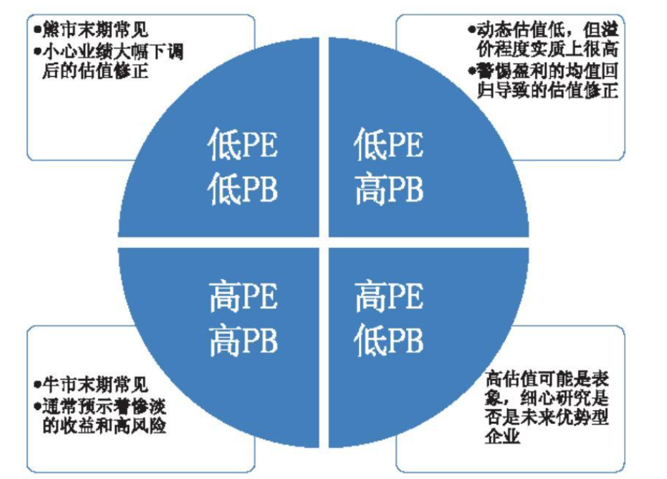
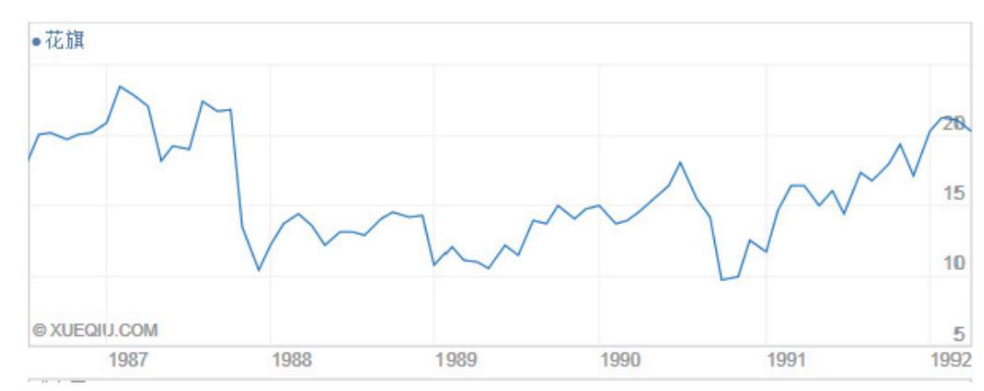
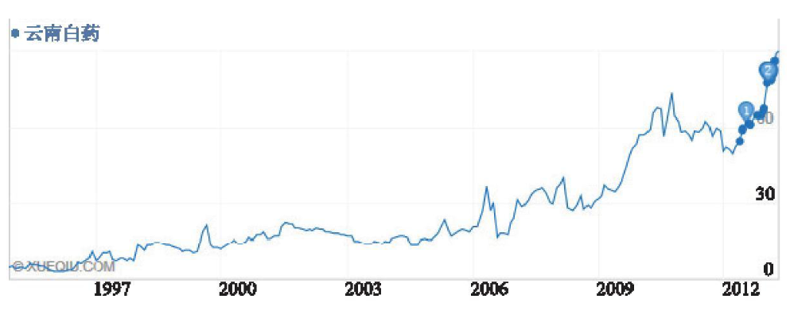
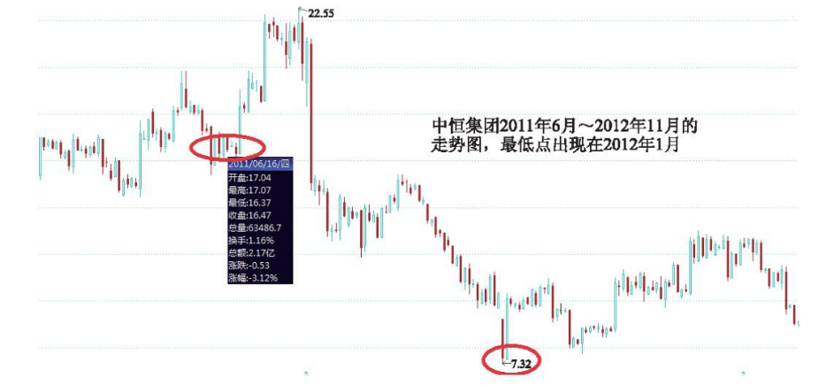
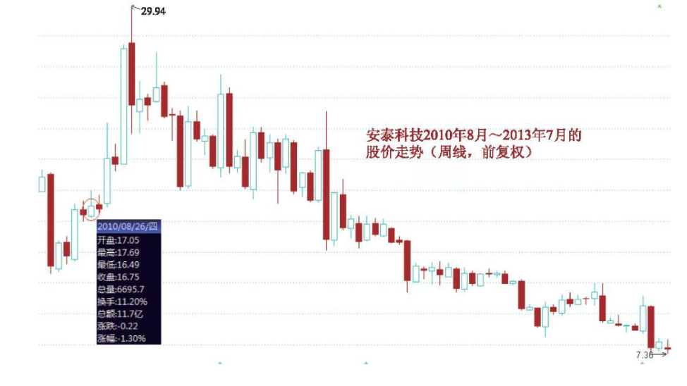
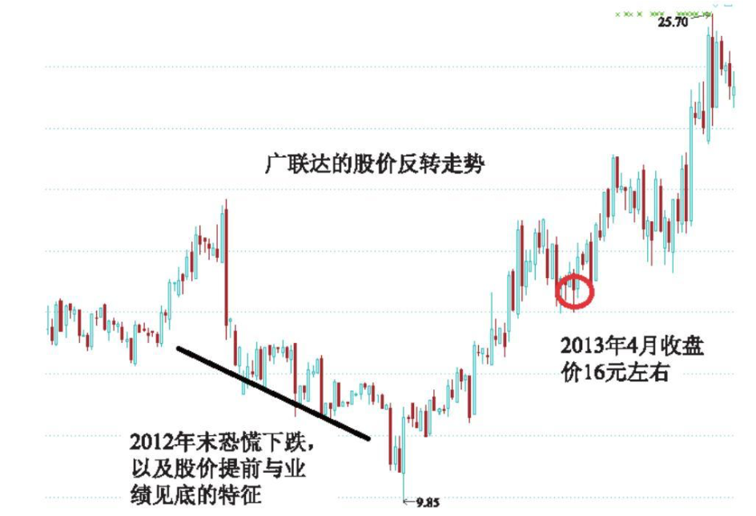

# 第15章　估值的困与惑

!!! note ""

    我曾经在博客上就“投资中你最大的困惑是什么”发起过一个网络调查，结果网友将最多的票投给了“不知道内在价值如何评估”，占第二位的就是“不知道如何给企业估值”，这两个问题占了总投票数的56％。考虑到理解内在价值也是合理估值的一个前提，所以与枯值有关的问题确实困惑了一大批人。本章将深入到估值指标的本质内涵，并且探讨如何灵活地运用它们。

## 15.1　“指标”背后的故事

虽然企业的内在价值的经典衡量方式是DCF（现金流贴现法），但这种方法的天然限制因素（比如计量比较复杂、只适用于价值稳定类别的企业、引入的变量条件较多等）使得其在实际的估值中并不好用。第三大道资产管理公司甚至这样说：“DCF就如同哈勃望远镜，只要你再推出一英寸，你就会看到另外一个完全不同的星系。”这种情况就使得投资者更经常参考一些较为直观简单的估值指标。这里将探讨几个最常用指标的内在意义和相互区别，特别是当几个指标之间发生某种组合情况时，其隐含的风险与机会的衡量思路。

### 15.1.1　市盈率（PE）

最为广泛应用的市盈率指标（PE），其实质是相对于公司利润的一种溢价形式。对会计报表有基本了解的朋友会意识到，”利润”本身是一个可人为调节和涉及大量主观推算的产物。如果“利润”本身存在水分或者并非体现出真实的业绩状况，那么以此为基数经过“放大倍数”后的市盈率估值，显然就会严重放大这种偏差所造成的负面结果。

市盈率法要特别注意损益表的修饰空间和变动弹性远大于资产负债表。最通常的错误在于，将“当期业绩”与企业的“盈利能力”混为一谈。即便是持续几年的历史优秀业绩，也不代表企业的未来盈利能力。PE法（特别是在此基础上进一步形成的PEG法）经常造成“企业动态低估”的假象其实可能早已透支了未来的盈利。如果我们愿意回顾一下2007年底的券商报告，当“时各类分析在静态PE已经高达60以上的时候，就是以充满“投资乐观主义精神”的动态PE及PEG法来证明大把的股票依然是“低估”的。

市盈率法更隐蔽的危险在于它容易放大”偶然性收益“的作用而产生误导。假设一个公司的当期每股收益是2元，其当时的股价20元即市盈率是10倍。这看起来很低，但如果该公司的主营业务产生的每股收益只有0.5元，剩下的每股1.5元业绩是由其可交易性金融资产的公允价值提升，或者收到的一次性政府补贴所贡献的，那么这种“便宜”就有很大的假象。公允价值变动是随行就市的处于持续的波动中。政府补贴是偶然性的，显然并不能将他们与主营业务混为一谈。因此如果单看主营业务，其估值就上升到了40倍之高。这就提醒我们使用市盈率法时要搞清楚企业的业绩结构是基本前提。

除此以外还有一种更为隐秘的“会计失真”。两个同样的房地产开发商，如果采用不同的费用资本化规则（详见《穿越财务迷宫》一章的相关介绍），那么即使它们当期的业绩完全一致也没有可比性。同样的，两个重资产的公共事业企业，对于重要资产的折旧细节的不同，也会隐蔽地影响到利润的可比性。此时，如果仅仅看到其中一个公司的估值更低就认为“被低估了”，就可能会掉入一个陷阱。

同业绩结构一样重要的，还有识别清楚什么是经常性的业绩水准，什么是异常的业绩阶段。行业景气轮回是经济正常现象，以景气高峰和低谷最极端点的业绩来衡量PE估值显然是设定了一个错误的基准。这种轮回波动越剧烈，当时所显示的PE值就越不可靠。

但在投资的实践中，我发现这是一个主要的难点。要清晰地判断企业当前到底处于一个业绩周期的什么阶段，以及未来的经营态势会向着哪个方向去演变确实有难度。大多数的针对某一投资标的的争执，与其说是在辩论估值的高低，不如说是在争论其经营前景的变化。幸运的是，我们不需要对所有的股票都搞清楚这点，找到能看懂的股票就可以了。

### 15.1.2　市销率（PS）

市销率（PS）与市盈率（PE）没有本质的区别，但是在企业当期阶段性亏损的时候市盈率是无效的。在确保企业长期盈利能力有底线或者行业反转可能时：市销率在这个时刻的“历史比较（即与以往的历史市销率的比较）”有一定的参考意义——当然前提是这家企业的资产负债表和经营格局足够强劲，还能“活着”一挺过低谷。

有时候我们会看到一些投资者简单地将不同生意属性的公司进行市销率的比较，进而轻率地得出“贵了或者低估了”的结论。然而仔细想想就会发现，市销率与不同生意的净利润率有很大的关联。

!!! note ""

    比如两个企业拥有同样的1亿净利润且市盈率都是25，则两个企业的市值都是25亿。假设其中一个企业的净利润率为10％，那么它的市销率约
    
    为2.5倍（25亿市值/10亿的销售额）；另一个企业的净利润率如果为33％，那么它的市销率就是8.3倍（25亿市值/3亿销售额）。两个企业具有完全一样的市值规模，完全一样的当期净利润额，只是由于净利润率的差别而出现市销率的大幅差异。这就是生意特性的天然差别所造成的。显然不能就此判断8倍市销率的公司太贵了，2.5倍的那个被低估了。只有同样生意特性和同行业间的这种比较，才有一定意义。

说到底市销率反映的其实还是一个损益表预期的问题。市销率高一方面说明每单位销售收入的盈利能力更高，另一方面也说明市场对于其销售额的成长空间及保持每单位盈利能力的预期很高。那么，企业分析无非就是沿着这两条线索去展开并回答这种预期是否合理而已。我们通常可以看到，利润率最高的企业往往PS是最高的，比如软件类企业。对于高市销率的企业来说，能否保持住这一利润率水平，并且在此基础之上实现销售额的规模化是最关键的。

而市销率很低的企业，特别是对已经占有了强大市场地位和巨大销售额基数的公司而言，有一点特别值得注意：其净利润率的变化趋势。因为一旦其原本很低的净利润率发生向上的拐点（由于市场趋向寡头垄断，竞争烈度下降带来费用率的下降或者定价能力的提高，从而推高净利润率），那么在极大的销售额的基数上可能出现净利润增幅远高于同期销售额增速的现象。

!!! note ""

    由于净利润率很低（4％），2011年初伊利股份只有1.04倍的市销率（相对于2010年销售额）。但2013年以来，其业绩的上升远超销售收入的增幅，其中的一个很大原因就在于利润率的提升。另外，苏宁电器以2010年计的市销率大约是1，而永辉超市的市销率则为1.77。但同时苏宁电器的净利润率已经提升到了5％以上，永辉超市的净利润率则只有2.4％。这种反差（包括2011年视角下苏宁只有15PE而永辉则大约为40PE以上）可能反映了市场这样的预期：要么更加看好永辉的成长空间，要么不看好苏宁向着电子商务的转型，要么两者兼而有之。

我个人不很看重市销率，因为它的基本内涵与市盈率并没有差别，也具有同样的基准波动较大的缺陷（但相比净利润，一个企业的销售额反映的东西更加“硬”一些，变化的敏感性也相对净利润要小一些）。不过它在一些市盈率失效的时刻，以及对一些特定的生意（大销售额，低利润率）具有一定的参考性。

### 15.1.3　市现率（PCF）

市现率（经营性现金流净额与市值之比）是一个极少被提到的视角，但是我喜欢这个指标。在这个视角下，一些貌似并不便宜的企业以更具价值（现金流创造力）的形式体现出来，而另一些业绩爆发中动态PE貌似很低的企业则显示出惊人的经营风险——毕竟，生意的最终目的是真实的现金，而不是会计意义上的利润。

|                    | 万科A  | 中国建筑 | 三一重工 | 广联达  | 北新建材 | 电科院  |
| ------------------ | ------ | -------- | -------- | ------- | -------- | ------- |
| 2011年末每股收益   | 0.88   | 0.45     | 1.13     | 1.03    | 0.9      | 1.09    |
| 2011年末每股现金流 | 0.30   | -0.25    | 0.3      | 1.18    | 1.93     | 1.11    |
| 2011年末市盈率     | 8.48倍 | 6.46倍   | 11.09倍  | 32.03倍 | 11.44倍  | 29.17倍 |
| 2011年末市现率     | 24.9倍 | 无效     | 41.8倍   | 27.96倍 | 5.33倍   | 28.64倍 |

~注：股价的计算均以2011年末收盘价格为准。~

在上面的统计中当换了一个视角后显示出来的结果很有意思。原本非常低的市盈率在市现率的角度却并不便宜，而看起来好像并不便宜的一些股票从现金流的角度衡量似乎又没有那么贵了。当然，如果仅仅以1年的情况来下结论肯定是偏颇的，因此可以着重就“经营性现金流净额/净利润”的比值进行多几年的比较，并且排查一下其中有无主营业务之外的因素影响。更进一步来讲，可以加上资本性支出和融资支出，用自由现金流的角度去衡量。

但需要注意的是，经营性现金流的情况要与企业的具体经营情况结合起来，并不是说出现经营性现金流或者自由现金流低的情形就一定很差。如果一个企业拥有很强的竞争优势，其资本收益率也较高，那么这个阶段的高速扩张往往表现为资本开支多融资多，甚至是经营上更倾向于销售信用的放松（应收账款提升，存货也提升），这样经营性现金流或者自由现金流当然没那么“好看”。但这种情况反而是成长期的表现而不是衰败或者业绩泡沫的表现——所以事实总是无数次的证明，对一个企业经营情况的认识是运用好任何一个估值指标的前提，对一个企业经营态势的定性是定量的基础。

市现率提供了一个新的角度来认识估值和市场中估值差形成的内在原因：看起来很低的市盈率，以未来的现金创造能力来看未必便宜：而看起来较高的市盈率，以未来的现金创造能力来看未必很贵。投资的世界里到处都充满这种辩证的现象。

### 15.1.4　市净率（PB）

市净率（PB）自格雷厄姆和多德时代便备受重视。格雷厄姆曾说：“（我们）认为公众在买卖公司股票前至少应该关注下它们的账面价值……对于购买者来说，如果他认为自己足够聪明的话至少应该告诉自己实际成本到底是多少，而且还要明白他将自己的货币换成了何种资产。

市净率（PB）与市盈率、市销率的最大不同，是前者反映的是这个公司净资产的溢价程度，而后者反映的只是这个企业当期利润额和销售额的溢价程度。很显然这里比较的基准是有巨大差异的：净资产的稳定程度相对较高，而企业当期利润及销售额则是敏感性很大的基准，其不但受到当期市场状况的影响，甚至一些会计上的调节都可能造成很大的观察篇差。这一不同的特性使得在估值的衡量上市净率相对具有更好的稳定性和连续性。

但市净率的考察依然面临一些问题。首先是资产的水分。一些资产项目可能是高风险的在高风险的高净资产所表现出的低市净率，也可能造成一种便宜的假象。

!!! note ""

    众业达在2012年3月底的股价约为15元当时其净资产就高达8元。从PB来看它不到2倍似乎并不是很高。但进一步查看其资产负债率就会发现，在其总共25.69亿的资产中以应收账款、应收票据及存货形态存在的资产就高达18.29亿，占总资产的比重达71％！从会计角度而言这些确属资产，但从商业常识而言则是具有高度风险性的资产——我们可以想想，这与一个表面看起来5倍市净率但是其中资产中现金占到80％的企业相比，哪个更安全呢？所以市净率的引用首先要考察清楚净资产构成中的这个“净”字。除存货和应收账款外，还应考虑到无形资产和商誉占比过高的企业，特别是后者往往是对外收购付出的高溢价形成的，如果收购对象出现亏损等问题将导致资产价值的修正。

PB中的“B（Book value，净资产）”到底是否坚实可靠是运用这个指标的前提。但要想在一些企业的资产负债表里弄清楚这个问题还真不是那么容易。资产负债表越庞杂这个问题就越突出。所以当看到一个便宜得离奇的PB时，先别忙着欢呼，还需要到资产负债表中仔细去排排雷。

资产安全性比较好理解。但是决定一个企业在资本市场的经常性市净率高低的另一个属性就不那么容易理解了。这个属性就是净资产收益率（相关内容参见前面关于净资产收益率讨论的章节）。为什么很多投资者，往往更重视企业的“成长空间”，却对企业的差异化竞争优势的重视程度却并不高呢？我认为就是因为没理解PB的这个隐含的、但却是实质性的含义。

由于市净率反映的是净资产的溢价，所以净资产的溢价水平自然直接与净资产的收益率紧密挂钩。考察市净率其实就是考察ROE的态势，而考察ROE的态势则不能不考察3个维度（详细请参考《高价值企业的奥秘》一章的相关论述）：竞争优势充分展现后的收益率高度，竞争优势所能达到的持久度，净资产基数的复利增长。显然，这比仅仅考虑企业的利润增长率要全面深刻得多了。

!!! note ""

    举一个简单的例子：若一个人能用100元净资产创造出30元收益，且这种收益水平可以保持多年。另一个人只能用100元净资产创造出5元的收益，而且这一收益水平还不稳定。如果你是他们的老板，会给他们开同样水平的工资吗？显然是应该有差异的。工资水平就可以看做一个企业的市净率。一个企业市净率的高低，就取决于它利用股东委托给他的净资产能创造出多高的收益，并且这种收益是否具有可持续性。

因此，企业的ROE综合展现了这个企业在资本杠杆、销售利润率、总资本周转率三大方向上的“现有水平和未来潜力”，如果说当期业绩表现是“知其然”，那么搞懂企业的ROE长期态势和特征则就是“知其所以然”了。

当公司的ROE不断提升并达到较高水准的时候往往伴随着其市净率的扶摇直上。从这方面来说，市场确实是“有效的”——但是问题在于，市场又往往是短视的：市场往往只看到“现在的权益收益率很高”，但却很少能够准确评估其“持久性”。正如《市场定价的逻辑》一章中所描述的那样，市场的有效性只局限在对当前信息的“解读”上，而不是对企业长期内在价值的评估上，并且这种解读也经常性地受到情绪波动的干扰。

## 15.2　PE与PB组合的暗示

上述任何一个单一的估值指标都反映了某一个角度市场定价的状况，但也受限于一个狭窄的角度内，如PE主要的比较基准是敏感性强的当期利润，而PB的比较基准是稳定性强的净资产这两者视角不同但估值指向的是同一个主题。正是由于溢价比较基准的不同，以及企业业绩和经营态势的不同步性，同一个企业往往会呈现PB与PE状态的不同组合模式，其背后往往对于未来的投资收益分布态势有直接的关联，反映了深刻的投资内涵及风险机会逻辑。具体来讲经常见到下属4种估值的组合：

### 15.2.1　低PB，低PE

低PB、低PE的情况往往发生在熊市的末期，反映了市场的“去泡沫化”卓有成效。有时，其也反映在一些经历了经营拐点的企业同时达到了价位调整的低点。比如，巴菲特自1989年开始购入富国银行时候的股价只有5.3倍的PE和1.2倍的PB。需要注意的是，这种“低”有时是建立在企业的业绩还未充分反映经营困境基础上的。就以富国银行为例，在巴菲特买入的3年后，其业绩比1990年大幅下降了70％以上——这种业绩的一次性大幅下降，这自然就将原来极低的市盈率向上抬升了。

这一点思考同样适用于当前的A股市场。在本书撰写过程中，银行、地产为首的极低估值的板块引发了市场的激烈争论。在2010年的博客中我曾经对这一现象提出过一个疑问：作为典型的周期性行业，地产和银行企业在当前依然保持着很好的盈利增速和历史最高水平的ROE。从常识来看，这是否代表了真实经营环境的“底部”？而如果这种典型的高杠杆型生意尚未表现出必要和某种程度上必然的业绩回归，那么当前的这种“低估值“又是否真的能得到很好的估值修正呢？

在此后的两年多一直到撰写本书时，这些企业经过了更加低估值的压迫。对此现象，我也曾在与朋友的交流中，谈到市场有效性和无效性的问题。我仔细回顾了巴菲特投资富国银行及涅夫投资花旗银行的过程，他们都曾以极低的估值（首次购买分别是5倍PE和7倍PE左右）买入，但之后几年富国和花旗银行都确实遭遇到大幅的盈利下滑。虽然之后多年两个企业最终恢复了生机并带来巨大的回报，但这也说明当时市场给予的低估值确实是”有效的”。而目前持续了近4年的银行股的低估值却并未遭遇真正的盈利危机，这么看来市场似乎非常的”无效”。

!!! note ""

    从花旗和富国的投资案例来看，对于遭遇了困境（或者至少是含有困境的预期）的极低怡值的投资也要有充足的后手准备。以约翰·涅夫投资花旗银行为例，从1987年拉丁美洲放货失败导致的买入机会，以7、8倍的低怡值买入。到1991年业绩不佳，股价已经从买入的成本价33元下跌到了14元，4年收益率为-57％。然而紧接着花旗又遭遇亚洲挤兑风波等危机，股价一度下跌到8元。直到1992年和1993年花旗的股价才开始回升。

~花旗银行在1987年到1992年间的股价走势~

试想，一个重仓了的普通投资着，本来觉得遇到千载难逢的低估值买入机遇却换来近5年亏损75％的结果，会作何感想？涅夫的最终成功，不仅仅在于强大的抗压力，也在于仓位的控制（在大幅下跌后始终有加仓的能力）。从这里可以再一次领悟到，以精明和对价格极度挑剔的格雷厄姆在投资低估值的困境型企业时，不止一次地提醒要分散投资的意义所在。

不过截至2013年6月，市场在历经几年的持续调整后指数仅为2000点上下，出现大面积的低PB低PE群体，这就表明绝非仅仅是银行股的不确定性问题，而确实存在对传统产业过度悲观的情绪。我相信在此时构建一个低PE低PB（除此之外再加上高股息率这一条件）的较为分散的持仓组合，长期来看大概率的会带来较好的回报。

下表列出一些符合特征的典型股票，均以2013年6月收盘价、以2012年年末资产盈利及分红指标为准。

|          | 市盈率(倍) | 市净率(倍) | 股息率(倍) |
| -------- | ---------- | ---------- | ---------- |
| 大秦铁路 | 7.8        | 1.27       | 6.5%       |
| 中国建筑 | 6.34       | 0.97       | 3.18%      |
| 招商银行 | 5.52       | 1.24       | 5.43%      |
| 五粮液   | 7.66       | 2.43       | 4%         |
| 鄂武商A  | 14.17      | 2.33       | 1.78%      |
| 伟星股份 | 12.6       | 1.28       | 6%         |
| 万华化学 | 16         | 4.16       | 4.37%      |
| 长江电力 | 11.12      | 1.52       | 4.78%      |
| 格力电器 | 10.12      | 1.52       | 4.78%      |
| 陕鼓动力 | 10.71      | 1.95       | 5.18%      |

### 15.2.2　低PB，高PE

低PB，高PE有几种情况，强周期股出现这种现象往往是由股价的大幅下跌＋企业盈利的大幅降低甚至亏损导致的。很低的净资产溢价水平表明接近了经营周期的底部区间，但需要注意的是，经营周期的底部区间未必一定是企业股价的底部区间，过于高昂的PE水平虽然反映了业绩下滑的因素，但是有可能价格的调整只是在初中期阶段。比如，2011年业绩大幅下滑的比亚迪，虽然股价呈现的PB很低（仅有1.5～1.8PB），但是2011年预期PE高达100倍以上。除非其迅速地完成业绩反转，否则这一态势下可能意味着较长的股价调整周期（虽然其间肯定有各种大大小小的反弹）。这种情况下需要分析该企业是否具有收益的高弹性特征。因为如此一来，虽然PE高达上百倍，但一旦盈利反转可能马上就会出现业绩同比暴增的情形，这样就可以很快抹平高估值从而具有更大的上涨空间。

!!! note ""

    我们还是看看比亚迪的例子，其所处的汽车制造业具有典型的资产和劳动力密集特征，经营中固定资产折旧和员工工资、财务费用构成的刚性成本占比非常大。这种特征一旦道遇到市场萎靡，销售收入下降就会带来净利润率的大幅下滑，表现在财报上就是业绩的基跌（行业景气时正相反，迅速升高的营业收入将总成本和费用分摊到巨大的销售量中，净利润率明显上升，单位销售额的盈利能力呈倍数级提升）。此时股价也大幅下挫，并呈现出典型的低PB和高PE特征。但一旦市场转暖，生产设备的利用率明显提升，业绩也呈现出同比的暴涨（见下表）。如果市场持续向好，业绩的这种高弹性将持续下去，从而很快抹平吓人的高估值，随着景气周期的到来而转化为“低PB低PE”的状态。

    | 比亚迪   | 2008年  | 2009年  | 2010年  | 2011年  | 2012年  | 2013年第一季 |
    | -------- | ------- | ------- | ------- | ------- | ------- | ------------ |
    | 净利润   | 4.6%    | 9.91%   | 6.02%   | 3.26%   | 0.45%   | 1.21%        |
    | 业绩增长 | -25.06% | +219.7% | -28.43% | -45.34% | -86.65% | +315.63%     |
    | 市净率   | 无      | 无      | 无      | 2.54    | 2.26    | 3.31         |
    | 市盈率   | 无      | 无      | 无      | 38      | 2543.75 | 600          |

    上面这个统计中都是取当年收盘价作为计算依据，2013年1季度取上半年末的收盘价为依据。股价的实际走势波动很大，比如2012年业绩最低和市场最不看好的时刻比亚迪的股价只有13.5元左右，大约相当于1.5倍市净率（有趣的是，这个估值水平大约也是巴菲特当年买入比亚迪的市净率）。之后随着股票市场在2012年末的走强，以及汽车行业的集体回暖，并且在2013年1季度财报中显示出增长的拐点倾向（根据已经公布的半年报预告，2013年上半年公司业绩同比增长23.58～29倍之间，实现反转确认），股价在短短半年内上涨到了最高38元。截至2013年1季度，它已经呈现出“极高PE和较高PB”的特征，未来走向将取决于其业绩反转的确认和增长的爆发性。

    

    比亚迪的这个表现完美地体现了经营杠杆很大的生意是如何产生巨大波动的。假设从2008年到2013年间他的营业收入完全一致，其净利润之间也有高达近10倍的差别（净利润率从最低的0.45％到最高的9.91％）！这种特性下，200倍的PE可以在业绩突然暴增10倍后马上降低为20倍，相反也一样。所以投资者需要注意几点：

（1）像这种行业景气波动剧烈，经营的杠杆较高从而带来业绩极高弹性的周期性企业，从PE视角来看反而容易在行业最萎靡并接近拐点的时刻被高PE吓跑，而在行业景气程度最高、业绩暴增的短暂景气高点被看似很低的PE迷惑而买在山顶。

（2）也正是由于这种巨大的波动性，以及从本质上来讲属于低差异化程度的业务，所以类似这样的公司其市净率本身也不该给予过高的溢价。当市场上的这类公司普遍处于很高的溢价水平时（在牛市泡沫期有达到6、7倍以上甚至接近10倍市净率的记录），往往预示着市场已经进入高度的泡沫化，需要异常警惕。”

（3）当看到一个公司当期业绩暴增数倍甚至十数倍的时候，千万不能将这种增长当成一种常态。反而要意识到，这种业绩表现已经说明这个公司在生意特性上具有巨大的不稳定性因素。对于这类企业要多从“周期”的角度来看问题。

另一种“高PE低PB”的情况更值得注意。这种企业当期的业绩并不十分突出，这时其PE看起来并不便宜（比如30PE）。但是如果这个企业符合下述3个明显的特征：

第一在市场上已经具有明显的甚至是独一无二的强大竞争优势，且这种竞争优势将可能支撑其未来长期的广阔发展前景。

第二，当前平淡的业绩或者净资产收益水平，是由于目前正处于经营的积累期。其当期闲置资本较多（比如募集资金、正在建设的重大项目等）。随着未来这些闲置资本陆续地投入高价值业务，将有力地促进业绩增速和净资产收益率水平。

第三，市场并未清楚地认识到其可观的前景，因此只给予其较低的净资产溢价（低PB）。静态来看并不便宜的PE，实际上只不过是其尚未进入业绩回报阶段的暂时性现象。一旦公司完成积累进入大面积扩张，随之而来的超额收益能力将很快抹平当前的PE水平，而且强劲的业绩持续增长能力更将为估值较长时期保持在较高水平上提供强大支撑。

此时的“不便宜的PE”实际上并不对其未来的长期投资回报有大的冲抵。特别是，如果这种企业由于系统性波动的原因导致跟随性调整，逐渐成为“低PB，低PE”态势，往往就成为了一个典型的“低风险，高不确定性”的绝佳投资机会。

!!! note ""

    在1995年之前，云南白药还属于业绩平庸和不引人瞩目的公司，当时它的PB仅有2倍左右，PE也仅有23倍，这个时侯投资它是绝对意义上的黄金时间。即使将条件放宽一些，将买入时间挪后到1997年深证指数产生7年大顶部，在云南白药高达50PE的时候买入，持有至今的收益率也依然让人羡慕。

<table>
<thead>
    <tr>
        <td>云南白药</td>
        <td>1995年收盘价</td>
        <td>1997年深成指牛市顶端</td>
        <td>2012年末</td>
    </tr>
</thead>
<tbody>
    <tr>
        <td>市盈率</td>
        <td>23.73倍</td>
        <td>51.05倍</td>
        <td>29.82倍</td>
    </tr>
    <tr>
        <td>市净率</td>
        <td>2.99倍</td>
        <td>6.16倍</td>
        <td>6.71倍</td>
    </tr>
    <tr>
        <td>股价增长</td>
        <td colspan="3">以后复权方式，1997年最高价19.05元2012年收盘价829.56元，以1997年50PE价格买入截至2012年的收益也高达43.54倍</td>
    </tr>
    <tr>
        <td>说明</td>
        <td colspan="3">
            1. 1995年时刻是典型的“PB高PB”特征，后随1997年大市顶的到来而进入到“高PB高PB”特征  
            2. 由于云南白药在1997年时依然展于典型的未来优势型高价值企业，其后续强劲的业酬增长、净资产规模的扩张和净资产收益率的提升，都使得即使在较高的估值水平买入后，长期来着依然可以获得良好的回报</td>
    </tr>
</tbody>
</table>

### 15.2.3　高PB，低PE

出现高PB，低PE特征的企业往往特别值得警惕。这可能反映了市场对于这个企业阶段性的高增长背后的实际长期盈利能力有过度高估的倾向。“当期业绩”的爆发使得市盈率的动态推算值似乎很低，但这是建立在业绩极高增长的高预期之下的“低”。一旦该企业的竞争优势与这种预期并不匹配，就会出现典型的“把阶段性高增长的幸运”错认为“长期盈利能力超强“的问题，这时一旦中招就会’伤筋动骨”。

为什么要对高PB采取谨慎态度呢？

试想，如果一个企业的PB极高，则反映这个企业的盈利基本上靠无形资产驱动，该企业属于虚拟化经营级别的公司。但是这得靠多么强大的无形资产的竞争力才能够达到呢？10倍以上的PB表明的这个公司的盈利中有形资产的贡献率已经不到10％，如果这是一个可以持续的盈利能力，那么是什么东西使其如此坚挺？这种特性真的已经到了“长期来看都高度确定其地位难以被颠覆“的程度了吗？

通过实际的观察，我认为这种企业如果发展像预期那样顺利，其投资回报率也在高昂市场预期的消化中明显降低（等于或者低于企业实际利润增长）。而如果稍有不慎出现明显低于预期的业绩走向，其下跌的幅度往往远超普通投资者的预料之外。

!!! note ""

    2011年6月，笔者在分析中恒集团时指出其当前高达12倍的PB与其竞争优势的牢靠程度（即ROE的可持续性）长期来看并不匹配。虽然当时来看“动态PE”很低，但是结合经营上的一些重大不确定性，其在当时价格（大约17元）所隐含的风险已经远高于机会（半年后，随着业绩高增长预期的破灭中恒集团的股价跌到最低不足8元）。

    

    记得当时的这篇分析引起了轩然大波，很多人对基于“净资产溢价”的分析逻辑完全无法接受，并且对笔者的文章报以愤怒的回应。确实，在当时中恒集团的业绩增速确实堪称市场中的佼佼者，而且在其前景的描绘中更是充满了令人遐想的美好未来。但理性的投资者的一个基本特征，就是不太容易相信“特例”而更看重“常识”。
    
    仔细想想，这个高达12倍PB的公司即使当前的业绩再出色但其本质上依然只是个医药制造企业，不具有任何商业模式上接近虚拟化经营的特征。何况，其业绩的高速增长不过是建立在单个产品的热销基础上而已，并非依靠着多么强大和不可动摇的无形资产竟争力。甚至细究一番，这个公司在经营的一些要素上具有明显的弱点甚至疑点。具有这样性质的企业如果其估值可以稳定在10倍PB的程度，会是一个合理的市场价格区间吗？虽说世事无绝对，但站在概率和赔率的角度来看，理性的投资者并不难做出正确的判断。

但在一种情况下较高的PB价格可能是合理的，即这个企业具有持续地将融资能力转换为高盈利业务回报的能力。这种情况下，持续的大额融资会急速提升企业的净资产规模这样原本看起来很高的市净率就会被剧增的净资产所拉低。而又由于它可以将融入的资产持续地投入到高价值的业务中，转化为远高于融资成本的收益，这样的良性循环对于净资产的溢价而言具有更坚实的支撑力。

不过符合这种情况的公司非常少。因为这不但需要企业有强大无比的无形资产壁垒（资金只要投入，就高确定性地转化为高收益，想象一下那需要竞争优势多么强大的业务？这与拿到钱就有很多项目搞的乱投资是两个概念），而且还要关注到底其业务是否是资金投入敏感型的比如茅台和五粮液，属于典型的强大无形资产壁垒企业，但是另一方面大量的现金难以在核心业务上放大（受制于资源限制和高端定位与规模间天然的矛盾）也极大地影响了其资产收益率的最大化。所以，能同时达到这两条的公司少之又少。

归根结底，商业世界的规律是有限而不是无限，所以无论有多美好的预期，在面临类似估值组合态势的时候都需要慎重检验。特别是这种情况，“很低的动态PE”非常容易迷惑人，尤其是对估值体系不甚了了的投资者，过分高估了企业的持续成长能力（往往仅是由于行业性的繁荣导致的阶段性业绩爆发）。

忽视低PE背后的高PB，不对其进行进一步的审视推敲，风险迟早会来敲门的。

### 15.2.4　高PB，高PE

高PB，高PE的情况比较单纯，一是市场全面泡沫化，完全靠一种情绪亢奋支持，类似2007年大牛市末期，地产、普通制造业、银行等一大批强周期性或者高度同质化的公司都被给予慷慨了7、8倍以上的PB和四五十倍以上的PE。可以这样说，市场在多大面积和多大程度上达到这样的估值水平，是判断市场是否已经泡沫化的重要指标。

二是一些完全靠故事被疯狂炒作的个股，比如前一阶段某些稀土概念。再者就是从“高PB低PE”的明星地位跌落凡间的——即通常所说的其高增长的预期被“证伪了”。很高的PB表明市场定价相对于其资产的实际盈利能力而言还是高估（回归之路漫漫无期），而其业绩的一落千丈，甚至是大幅亏损也导致原本“很低的动态市盈率”转眼之间迅速升高。

## 15.3　扩展估值的思维边界

最常用到的估值指标基本介绍完了，但仅仅用这些指标加加减减依然不足以应付复杂的情况。下面将尝试着进一步的扩展思维的边界，去进一步体会估值的艺术。

### 15.3.1　存在“万能指标”吗

对于一些读者朋友而言，非常希望在有关估值的方面找到某些“应用诀窍”，比如“在几倍的市盈率就可以闭着眼睛买了，到了多少倍的估值就应该卖了”等。因为这也曾经是笔者在学习过程中试图寻找的一个答案。

但看得实际情况越多，对估值的思考越深入，笔者就越是认定了一个事实：那就是根本没有哪一个估值指标是所谓的“万能指标”。那种抱着寻找一个万能的估值计算方式以驰骋天下的想法，是注定要失败和吃苦头的。与这一愿望相反，研究这些估值的意义是什么？其实就是为了从本质上去理解各个指标的适用范围和限制条件，就是为了不再简单地生搬硬套，就是为了建立起多角度的观察窗口。

在一些投资名家的著作中曾经揭示过一些较为详细的估值公式：
本杰明·格雷厄姆提出过一个内在价值的计算公司：

**每股内在价值=每股收益×（2×预期未来的年增长率＋8.5）**

!!! note ""

    假设一个公司当前每股收益是0.5元，预期未来的增长率是15％，那么计算得出公司的内在价值应当是：0.5×（2×15+8.5）=19.5元。这里的“预期未来的增长率”是指5～10年的一个较长时期的平均增长率，8.5是格雷厄姆认为企业的增长率为0时的合理市盈率。

约翰·涅夫提出过总回报率与市盈率之间的一种评价关系：

**（预期的增长率＋股息率）/市盈率>0.7时，开始符合其掌管的温莎基金的传统标准。**

!!! note ""

    假设一个公司未来5年的预期增长率是15％，股息率是2％，那么总回报率就是17，当前的市盈率如果是15倍，那么结果：17/15=1.13，其结果就将符合涅夫低市盈率选股法的入选标准。

约翰·邓普顿也曾表述过一个寻找股票的标准：

用当前每股价格/未来5年的每股收益，股票的交易价格不超过这个数字5倍。

!!! note ""

    假设一个公司当前的每股价格是15元，未来5年的每股收益每年增长10％，5年后的每股收益将是1.77元（以当前市盈率15倍为基础推算），以15元/1.77元=8.47倍。显然按照此标准来看该股票缺乏吸引力。

这些公式确实能够展现这些投资家的一些投资倾向和特点，也可以提供一个粗略的参考。但如果试图以这些公式去包打天下其后果恐怕堪忧。其实仔细看看这些公式就会明白，最重要的变量因素依然是对企业未来几年增长情况的预估。没有任何一个估值方法可以脱离开对这个主要问题的研究，但如果投资者可以很好地解决这个增长的估计问题，那么最困难的工作已经完成了。

至于为什么0增长的市盈率应该是8.5而不能是9或者7，为什么总回报率与市盈率的比必须大于0.7而不是0.5等，很难说这是什么铁定的标准，笔者倾向于认为这是反映不同投资者的经验和对风险的容忍度的不同而已。但坦率地讲，笔者认为任何一个过于量化的估值标准都有教条的嫌疑。

### 15.3.2　多维视角下的“称重”

从某种意义上而言，我们面对市场时就像盲人摸象。任何人都很难看见事物的完整全貌，这种时候围着研究对象多转几圈从不同的角度去审视一下，才有助于我们对估值到底处于一个什么状况建立更理性的认识。下面介绍一些笔者个人在实践中“围着转圈”时常用的方法以供参考，由于估值毕竟是带有很强经验性和艺术性的课题，所以这些小经验权当是头脑风暴吧。

<table>
<thead>
    <tr>
        <td style="width:150px;">估值的角度</td>
        <td>解释及要点</td>
    </tr>
</thead>
<tbody>
    <tr>
        <td style="vertical-align:middle;">组合估值法</td>
        <td>前一章节中PE、PB组合的不同状态的指向性在实战中非常有用，这种方法可以用来为估值高还是低进行一个总体的定性</td>
    </tr>
    <tr>
        <td style="vertical-align:middle;">历史区间法</td>
        <td>
            如果一个股票有5年以上或者经历过牛熊市转换的历史，那么其历史的估值运行区间可以作为一个参考。  
            但这个方法有两个问题: 
            1. 企业在不同发展阶段的估值基准会有很大偏差(不可能期望已经进入成熟期的白酒企业重新回到历史上四五十倍市盈率的水平); 
            2. 一些极端市场状况下出现的价格记录会有误导性，比如2007年超级牛市大顶部的记录也许永远不会重现;  
        </td>
    </tr>
    <tr>
        <td style="vertical-align:middle;">风险机会配比法</td>
        <td>假设以当前的价位买入，通过设定乐观、中性、悲观等不同的企业经营结果，测算这笔投资到底具有多大的吸引力</td>
    </tr>
    <tr>
        <td style="vertical-align:middle;">重要案例法</td>
        <td>对一些著名的投资案例的回顾，特别是具体在什么环境下，对什么情况下的标的做出过什么样成功的估值，可以帮助我们更好解决对类似情况的处理</td>
    </tr>
    <tr>
        <td style="vertical-align:middle;">终值评估法</td>
        <td>根据自己能预计到的企业前景，以最终企业可以达到多大的市值来衡量长期的投资机会。这种视角有利于跳出暂时的估值数据而将重点转为企业的长期价值，但风险在于这种估计的主观性太强</td>
    </tr>
</tbody>
</table>

组合估值法和历史区间法都已经有过较多的论述，这里着重谈谈后三种方法的运用。

#### 1.风险机会配比法

风险机会配比法的优势是可以跳出非要精确算出合理价格的牛角尖，而更多从不同情境下的选择会导致什么后果这一角度上思考问题。下面来看一个运用的实际案例：

!!! note ""

    2009年安秦科技的非晶合金带材产品终于研制成功，前景似乎一片光明，随之股价大幅度上升。当时笔者进行了一个小测算如下：假设公司的6万吨非晶带材全部投产且100％销售出去，以税后20000元/吨（与当前市场垄断者日立的报价基本相当），净利润率15％（当前业务的净利润率只有6％）计算，每吨的净利润约为3000元。6万吨的净利润总体贡献额为1.8亿（6万吨产能完全释放并且全部销售出去这一前提本身面临的不确定性暂不理会）。

    即便假设今年这1.8亿利润就产生，并且假设2010年的原有材料业务利润增长40％（这一增长率在其过去上市10年的业绩历史中从未达到过），那么2010年的“完美业绩”将是：1.8+1.7×40％=4.18亿，其EPS=4.18亿元/8.54亿股=0.489元。以当时17元的价格计算其动态PE约为34.8倍，PB约为5倍。也就是说即使将当前乃至于未来几年内最有看头、最具有爆发力、最有弹性的非晶带材产品目标产能全部在今年贡献利润，并且旧的业务实现很好的恢复，其当前估值也显得毫不便宜。

    那么，能够让估值现在来看“显得便宜”的答案就只剩下了：

    （1）传统材料业务实现很好的增长。

    （2）非晶带材业务屡破最好的预期，产能继续大幅度扩张（比如到10万吨以上）并且畅销。

    （3）其他业务方向如收购的德国薄膜电池等实现突破性的爆发性增长（因为业务小幅增长带来的贡献不够）。

    （4）连续不断地被装入最优良的资产。

通过上述分析，笔者当时判断安泰科技已处于一个被未来美好预期和概念支撑的阶段。未来面临两种可能：

第一，概念和预期被证实，那么其长期的价格走势有望在业绩的支撑下持续向上。但是当前高达50倍的2010PE（基于券商一致性预测业绩）在业绩正常释放中也难以保持，只有业绩屡屡超出预期才可延续，否则长期来看将受到估值向下修正的负面影响。

第二，被证伪，未来几年的业绩的向上弹性并未达到预期，或者非晶带材及薄膜电池项目出现意外，则将面临严重的戴维斯双杀风险。

而在被证实与被证伪都未出现之前的时间内，市场资金的偏好、新能源类的政策异动和公司阶段性公告等消息，将左右其股价的中期表现。

!!! note ""

    两年后，截至2012年的答案是：传统材料业务持续低迷、非晶带材业务依然处于“紧张的试产”而没有实现真正的大规模运行，收购的德国薄膜电池公司正式破产直接损失5000多万，其他消息更是连影子都没有。与之相对应的，股价从本文分析时2010年8月的17元左右（曾持续攀升最高达到2010年11月的近30元）跌回到2013年7月的7.3元，持有两年半的时间换回的是净值损失57％。

在这一案例中，笔者并未纠结在安泰科技当时到底多少钱才是合理价格这个问题上，而是顺着市场定价的现状去倒推，如果以这一价格买入，将面临什么样的回报局面。在很多时候，合理价格是一个“公说公有理婆说婆有理”的麻烦事儿。所以跳出这个坑，从“多少钱我才愿意下注”的角度去思考，往往更容易帮助我们理性地决策。

#### 2.重要案例法

重要案例法是对历史上一些经典投资案例进行回顾并从中得到启发。前面对于巴菲特、涅夫分别在银行股的低市盈率买入后遭遇的复杂局面，就是一个典型的运用。下面再看一个例子：

!!! note ""

    喜诗糖果是巴菲特的经典投资案例之一。从他买入后的35年间利润的复合增长率只有8％，其中销量的复合增长率只有2％。这体现出喜诗糖果具有较强的持续定价权、超长期的经营可持续性和优异的资本回报能力（高达60％的ROE）。巴菲特收购时的估值大约是3.1倍的PB和12.5倍的PE——需要注意的是这是在私人市场而不是二级股票市场，通常私人市场的出价要比股市低很多，这是因为出得起价整体收购的对象往往更少。这个案例对于那些增速不会很高，但具有强大市场号召力和持久定价权的消费品公司该如何估值，也许是一个不错的参考。

在2012年末和2013年上半年，高端白酒由于行业景气遭受环境变化的打击，并且这一情况引起市场的强烈担忧而股价大幅下挫。笔者自2010年起就一直不看好白酒企业，因为其低PE的低估值是以高PB为基础的假象，且其高速增长的业绩环境正在面临重大的转折威胁。但当2013年五粮液、沪州老窖等下跌到只有七八倍的市盈率和两倍多的市净率时，我想长期来看这已经是一个具有吸引力的投资机会。即使高端白酒企业的销量高速扩张已经告一段落，但长期来看稳定的提价能力应该是可信的——这一点与喜诗糖果常年靠提价驱动增长（年均销量增幅仅增长2％）的特征有所相似。作为资产负债率极低，现金极其充沛（如五粮液有257亿的现金在手，占420亿总资产的61％），净资产收益率即使下降也可维持在较高水平线（20％左右，“如果将多余现金分红则可以大幅提升ROE）的企业，虽然很难获得暴利，但3倍PB与7、8倍的市盈率水平确实也具有了投资的吸引力。

但也有一点需要注意，那就是巴菲特收购了喜诗糖果取得了对经营现金流的全权处理，持续大量的现金流为巴菲特的其他投资提供了充沛的能量。但如五粮液等公司，投资者没有办法将多余的现金强制分红，这显然对其投资价值构成了不利的因素和一定的隐患（如公司将现金用作低效的多元化开发，将折损其内在价值）。

广义来看，案例法也包括了借鉴国外同类企业的估值经验。相对于纵向看企业自身的历史波动范围，横向参考美国等成熟股市中同类企业在相似发展阶段的估值区间可以克服本地市场的一些局限性。很多美国上市企业已经具有几十年的完整产业发展变迁和牛熊市转化的历史经验，这种比较往往可以带来很好的启发。

#### 3.终值评估法

终值评估法的基本思路与风险机会配比法相似，对理论上的所谓合理价格并不纠结，而是从投资回报的吸引力角度去看问题。但相对于只考虑未来几年的风险机会配比法终值评估法要求把眼光放得更远。要对这个企业在5～10年后所能预期达到的经营成果及市值进行一个判断。如果缺乏对企业的深入研究，这种判断很容易想当然，这是这种方法的致命缺陷。但之所以在实践中依然应用的原因在于：静态的估值往往让投资者过于拘泥在细节中，这种强迫投资者将眼光放长远，强迫投资者去深入研究的方法，实际上更贴近估值的本质意义——理解企业，而不是精于计算。

!!! note ""

    2013年上半年有一只涨势非常好的股票卫宁软件，仅半年时间就涨了75％。卫宁所从事的是医疗信息化管理软件行业，截至2013年6月底其市值大约为40亿，相当于76倍的2012年业绩的市盈率和50倍的2013年动态市盈率。市场看好的理由主要在于国家医疗体制改革将促进医疗信忽化投资的加剧，并且从美国的经验来看行业龙头的成长将受益于这种进程而进入高速的发展。
    
    那么我们不妨就用美国医疗信息巨头cenner的情况来类比，假设卫宁可以像cenner一样迎来“黄金十年”达到10年25％的复合增长率，那么以2012年5200多万的净利润为基数，10年后利润大约为4.63亿。考虑到公司进入较为成熟阶段，以及市场在10年后对其未来的成长预期不可能像今天这样强烈，“我们给予30倍市盈率这样一个也很不低的怡位，那么最终的市值将是139亿左右。这样来算，相当于今天买入后10年获得的回报大约是3.47倍，10年的复利回报率约为13.24％。应该说这一结果，并不特别具有吸引力但也不算很差。
    
    现在再来分析一下得到这一回报率的一些基本前提：首先行业必须确实在各项利好的刺激下进入快速发展阶段，其次卫宁公司需要像cenner一样构建起强大的竞争优势（特别是在软件研发的柔性平台方面），最后市场必须在10年后依然保持对医疗信息化产业的较高关注度。但事实上仔细去分析就会发现这些前提的基础都并不牢靠：行业过去几年的快速发展能持续多久尚有疑问，且行业的快速发展也导致了激烈的竞争。而卫宁公司在差异化竟争力上的积累还远谈不上鹤立鸡群，以10年这样长的跨度去审视很难得出其将在竞争中胜出的确定性。最后市场在其成功占据较多市场空间和已经具有较大营业规模后，能否再给予较高的估值溢价也非常不确定。如果我们对盈利预期或者估值预期打7折（作为起码的安全边际），那么结果就会变为97亿左右，10年的投资回报率将仅有2.43倍——这还没有算上不能排除的更悲观的局面。这样来看，除非发现更强有力的理由，否则目前的价位从终值的角度来看并不具有吸引力。

可见估值根本不存在什么包打天下的“金指标”。好的投资标的的一个重要特征就是越用多种角度的估值方式来审视，它就似乎越能体现出性价比所在。而不靠谱的企业正好相反，在某一个估值指标上可能极其诱人，但越是多角度衡量就越能发现潜在风险的迅速聚集。

#### 4.透彻了解企业是估值的前提

采用不同的估值视角固然有帮助，但要想正确地衡量企业的价值最关键的还是透彻理解财务数据所反映的真实状况。在没有对企业业务特点和发展战略有深入跟踪和理解之前，投资者很容易只专注于数字而忘了企业分析的本质。”

!!! note ""

    2013年4月，广联达发布了一个看起来很惨淡的年报：2012年净利润增长只有9％左右，每股收益0.76元，每股净资产5.11元，而4月份收盘的股价约为22.5元（考虑到配股和分红，现在以前复权方式看为16元左右），对应的静态市盈率达到30倍，这样看起来好像挺贵的。然而，如果我们仔细研究这份年报并梳理企业发展的脉络就会发现如下问题：

    第一，当年业绩不佳的主要原因并非销售不畅——2012年即使在建设施工行业受到宏观经济负面影响的背景下，广联达的收入增长依然达到36.3％。净利润不佳的主因在于当年大批量的招聘和薪资上调，由此导致费用的大幅上涨。
    第二，软件公司享受国家的增值税退税政策，但截至2012年年末公司只收到了8个月的退税（而2011年同期已经收回了11个月的退税）。退税额与销售额成正比，所以占2012年全年销售收入达49％的第四季度的退税并未到账。
    第三，公司的资产负债表非常强大，现金占总资产的比重高达65％，几乎没有任何债务，现金流也异常充沛，客户也高度分散，不存在大客户的相关风险。
    
    通过这几点可以大致推测：2012年这个公司实际的经营状况要远远好过当前可见的数据。首先在行业低迷期间大肆网罗人才正说明了公司的长远眼光，如果仅仅是为了粉饰业绩完全可以减少费用压缩成本，如此利润增速起码会与收入增速保持一致，那就是36％的业绩增幅。其次，如果算上法定的、从权责发生制来看（但目前要求必须是收付实现制记账）已经属于公司的那4个月的增值税退税额（从后来公司公告计算应收的退税高达5000多万），那么将是一个相当漂亮的业绩增速了。如果以那个数字为依据，那么估值其实连20倍市盈率都不到！对于一个依然具有广阔增长前景、在行业内又具有独树一帜竞争优势，同时商业模式属于典型轻资产高现金流、高客户粘性的生意来说，这意味着什么呢？

    “以上述内容为基础，假设其在未来经管不再继续恶化（事实上从第四季度销售收入已经大幅增长，显示出相当强劲的回暖趋势）、公司对费用合理控制（公司在访谈和调研中已经确认未来几年将保持员工人数稳定和加强资用控制）的前提下，考虑到应收的5000多万退税肯定将算入新一年业绩中，因此可以对其未来1年的业绩增速有相对乐观的预期，这样动态来看该股票不但没有被高怡，事实上是隐蔽地明显低估了（自4月份之后，2013年广联达业绩反转逐渐显性化，几个月间股价便上升超过50％。

    

值得注意的是，在我们所看到的很多案例中都显示出股价提前于公司业绩的表现，这似乎再次印证了股市确实具有敏锐性和伟大的前瞻性。

我清晰地记得女儿能独立完整讲的第一个故事是《小马过河》，在这个故事中，一匹小马由于不知道河水的深浅而求助旁边的老牛和小松鼠。老牛说河水很浅只到小腿，但松鼠却说河水很深淹死了它的同伴。最后亲自下水的小马发现河水的深度与它们的答案都不一样，是正好到它的大腿。某一天我突然意识到，其实这个故事很有深意：它说明一个事物放在不同的参照系下可能得出差异非常大的结论，选对参照的指标不仅仅对于估值至关重要，对于我们认识世界和理解很多事物同样重要。

我曾计划未来慢慢地教授女儿一些投资的知识，却没曾想在那之前，女儿竟已经给我提供了投资思想上的启发。这是种美妙的感觉。

### 15.3.3　市值冗余与市值差

卫宁的案例解释了以“终值”来衡量一个企业的长期投资价值是对“成长性幻想”的一种制约机制。有人会说，对终值的评估很可能是错误的，比如某企业的市值在成长了几十倍后又再次成长了几十倍，如果“恐高”就会因此而错过。这种说法有一定道理，但笔者这样分析：首先，“终值”的视角并不是考虑其过去翻了多少倍的“恐高”，而是对其成长必然面临的天花板的一种评估。

这种思路可以强迫投资者对于企业发展的各个主要驱动力进行深入的思考，对于市场的容量、企业在其中的可能占有率，以及行业竞争均衡态势后的盈利能力进行审慎的评估。另一方面，要考虑到越是接近这个可能的成长天花板的范围，市场将提前给予其折价。同时考虑到这两方面，将能够勾勒出一个大致的最终市值的“量级”。

其次，终值的评估并不是为了精准而是为了弄懂投资的基本逻辑是否在自己的把握内。也就是说，在无法进行基本的成长空间的“量级”层面的估算时，这笔投资已经开始脱离自己的能力范围之外。这种估算并不需要精准到与最终事实分毫不差的地步。不妨想想那句话：最好的投资，来自于简单估算也能看到的显而易见的大机会。

正因为无法精确化的评估一个企业的最终市值，所以对待一笔长期持有的投资标的，就非常需要结合其产业特性和企业特点，来考虑到底有多大的市值冗余存在？所谓市值冗余，可以简单理解为“市值成长的余地”。假设站在较为乐观的背景下估计，其市值就算未来再翻10倍，相对于其可能的市场地位和盈利规模而言依然不离谱，就是一个很好的市值冗余。这种情况下，就算估值方面或者企业竞争动态中有所偏差而打了折扣，可能依然有3～5倍的市值增长弹性。

除此之外，对市值的视野更加扩展一些，也有利于我们更深刻地认识市场的环境和未来机会所在。2010年，笔者曾经提出投资既要考虑近两年来市场分化所形成的“估值差”但更需要思考“市值差”的现象及长期来看这一现象的变化趋势。

!!! note ""

    2011年12月20PE，笔者曾在博客中做了一个小对比，当天按证监会分类的计算机应用服务业的前十大市值企业，其市值之和恰好等于五粮液（000858.SZ）的1310亿元；医药制造业的前十大市值企业总市值2300亿元略高于贵州茅台（600519.SH）的2100亿元。用两个酒厂，就可以买下中国最具有竟争力和实力的20个IT软件集成企业和医药制造企业，这是市场在这一刻的局面。毫无疑问，我们可以为这种现象提供很多存在的理由，但结合未来中国经济发展的大背景，这种“合理性”下的“不合理性”是否可以对投资带来一些启示呢？

截至2013年7月底，五粮液的市值下降为7301亿，茅台的市值下降到到1800亿。而计算机应用和医药制造业前十大公司的市值之和分别增长到1900多亿和3900多亿。当然这么短的时间还不能说明什么，也许再过5一10年，这一对比的结果会更有趣。

## 15.4　估值的本质指向

在此，对于估值技术性的探讨暂告一段落。笔者希望上述的介绍能引起读者更深入地去思考一个问题，那就是：估值的本质到底是什么它不是一堆数学模型或者几个公式的堆砌而是对“什么东西才值得溢价，以及溢价的程度与投资回报率之间的关系“进行评估的过程。

估值既可以说得很复杂，也可以说得很简单。往复杂了说，笔者看过一本专门讨论各种估值模型的书，整本书详细地解释了各种估值方法的理论基础、数学模型的演化逻辑以及相关统计数据，差不多有600页厚。往简单了说，不管是笔者自己的经验，还是笔者曾经有幸交流过并让笔者印象深刻的那些优秀投资者，在投资决策中的估值环节却又往往是很简洁的。

估值的简单体现在它完全不需要高深的数学知识和金融背景，其基本逻辑是简单清晰的。但它的复杂反映在投资者必须对一个生意有着透彻理解才能做出这种判断。越是了解一个企业的经营实质和这个生意的特性、了解市场定价的基本规则，估值就越简单；越是对企业的认识模糊不清、对生意的理解不够透彻、对市场的定价茫然不解，估值就越体现出它不可捉摸的复杂性。

所以我认为大多数对估值的困惑，与其说是不了解某个估值指标的原理和算法，不如说是始终徘徊在企业经营态势和市场定价原理的大门外而不得入的原因。任何一个估值行为都不能脱离对这个企业基本面的定性。不能忘记，所谓的估值都是在特定的前提条件下才成立的。所以越是接近理解主要几个估值指标的本质意义之后，我们发现估值的主要困难其实越是指向一个老问题：你对这项生意到底有多了解？

投资者在对一个企业进行估值时容易陷入一种“复杂计算的安全性假象”，即喜欢算得特别细，用各种复杂的计算公式并且力求精确估算企业经营的每一个变量。似乎这种大量的演算能带来某种心理上的安全感，但这毫无疑问是一种心理上的海市蜃楼。真正好的投资机会应该是大致算算就呈现出非同一般的吸引力，也即体现出明显的“大概率和高赔率”特征。

总之，估值可能是最能体现投资中艺术性一面的领域。任何一个投资大师都没法给出一个标准化套用的估值公式——如果这种公式存在，市场就没有无效的时候了。估值的艺术性集中反映在，不同的情况下投资者需要决定选取什么样的指标组合并且妥当地分配这些指标在决策中的权重。但不管用什么样的方法，理解价值的规律都是估值的基础。
