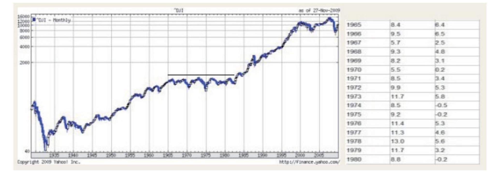
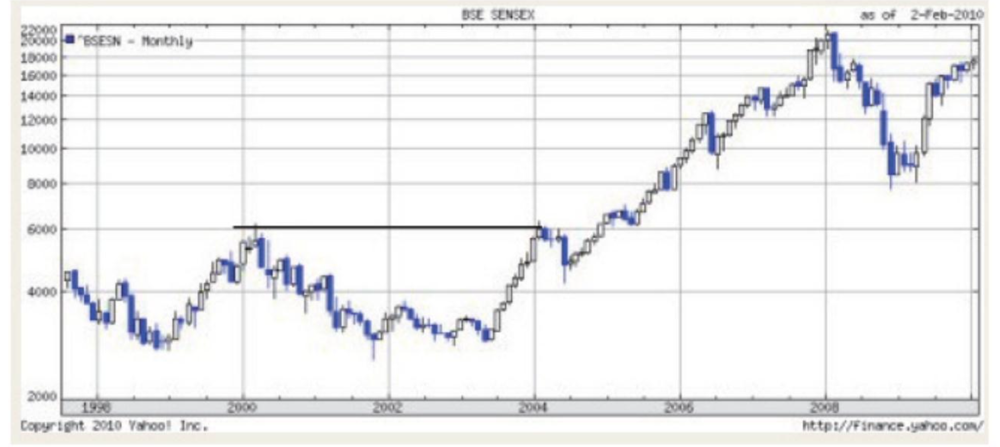
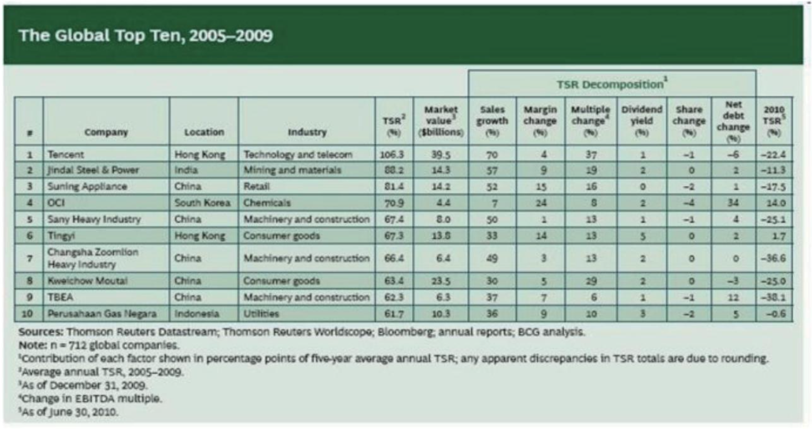
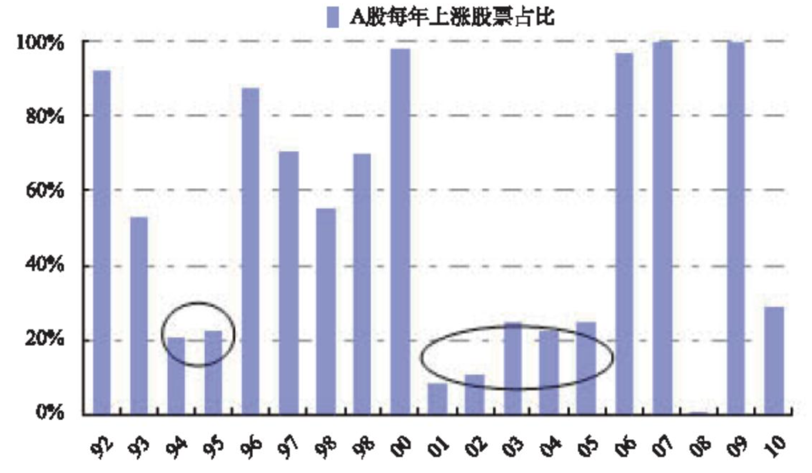
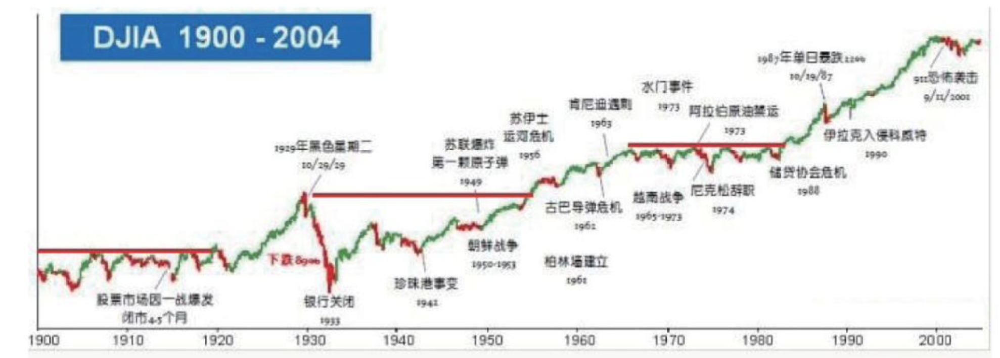
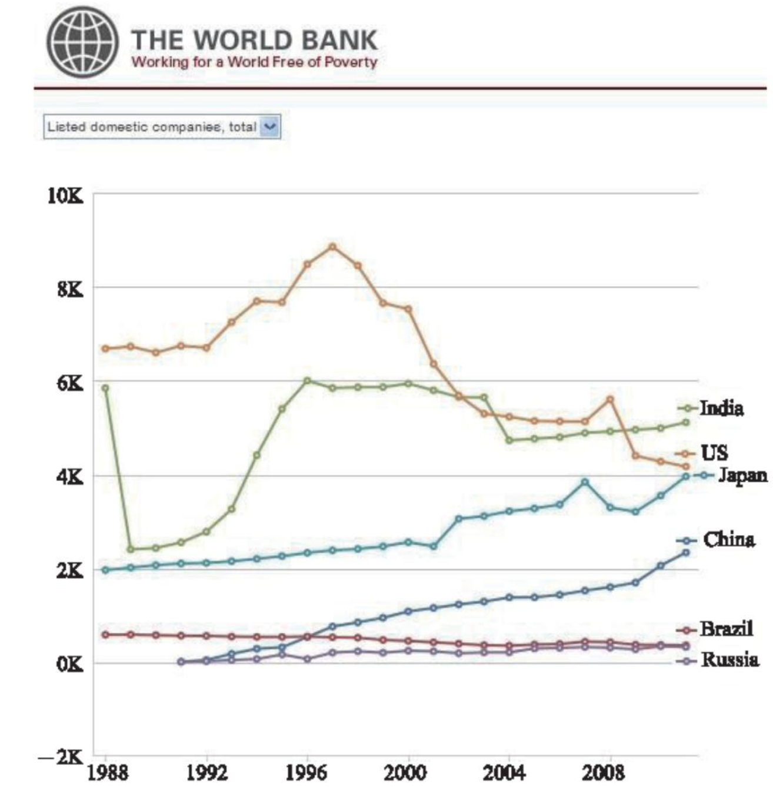
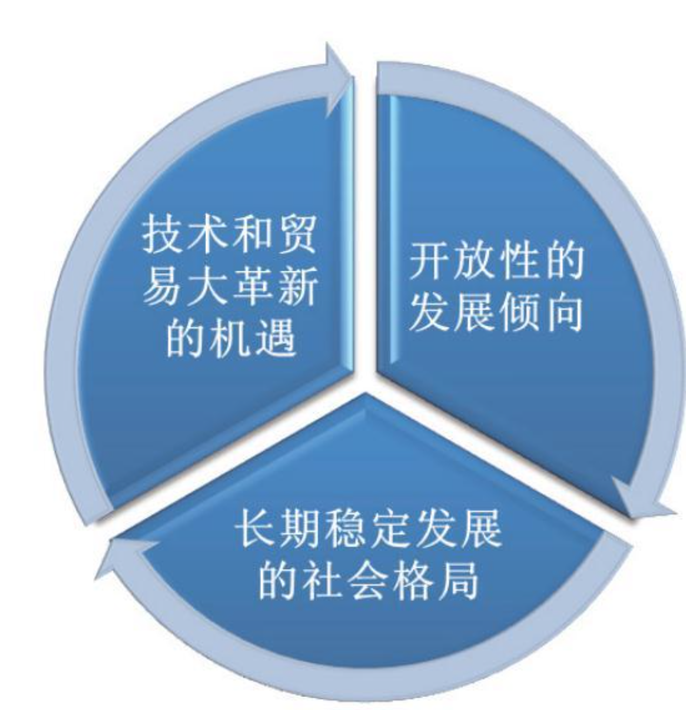

# 第16章　客观理性看A股

!!! note ""

    前面谈了很多企业价值分析层面和市场运行特征方面的问题，一些读者可能会抱有一个疑虑：你说的那些可能很好，但那只是国外成熟股市的成功经验吧？A股市场被专家们称为“连赌场都不如”，这里的市场管理体制也还很不完善，在这样的市场中就算再好的价值分析技术恐怕也无用武之地吧？那么下面就来探讨市场的独特性和普遍性这个话题。

## 16.1　最好的投资市场之一

作为一个诞生仅仅二十多年的资本市场，我国投资市场放在全球资本市场发展史中虽然充满了活力但确实不可能那么完善成熟。但这并不妨碍它成为当今世界上最好的投资市场之一。如果读者对此感到诧异和惊奇，那么请继续往下看。

### 16.1.1　毫不逊色的回报率

首先来分析市场整体的回报率情况，下图是截至2010年年末几个市场的指数收益率比较：

| 指数       | 过去22年走势（当年收盘计价）   | 指数涨幅 | 年复合收益率 |
| ---------- | ------------------------------ | -------- | ------------ |
| 上证综指   | 1990年127点～2012年2269点      | 17.86倍  | 22年13.99%   |
| 深证成指   | 1991年963点～2012年9 116点     | 9.46倍   | 21年11.29%   |
| 沪深300    | 2005年923点～2012年2 522点     | 2.73倍   | 7年15.42%    |
| 中小板综   | 2005年1415点～2012年4 840点    | 3.42倍   | 7年19.2%     |
| 美国道琼斯 | 1990年3 000点左右～13400点左右 | 4.45倍   | 22年7.03%    |
| 香港恒生   | 1990年3000点左右～23 300点左右 | 7.76倍   | 22年9.76%    |

可见在过去20年里A股主要指数的复合收益率都远远高于香港和美国（而且选取的截止日期正是A股的几大指数均自2010年之后大幅下跌后的低迷阶段，而2012年年末的美国道琼斯和香港恒生指数均有较大幅度的指数上涨回升）。在此期间，其他如伦敦市场、德国市场、东京、韩国、新加坡、中国台湾等市场主要指数也均没有明显超越上证的涨幅。当然有人会说他们之前已经有过几次很大的牛市了，这话没错，但之前中国尚未有证券市场所以确实难以进行比较。至于未来的情况也具有各种可能性，可以留给时间去解答。但有一点是可以明确的：**在过去的20年，即便只以指数化的形式在中国A股的投资，与世界主要证券市场相比其收益率也是一个相当出色的成绩。**

在我国的媒体上有一个经久不息的话题，那就是专家总喜欢在股市阶段性低迷的时候高呼“中国的证券市场没有反映出宏观经济，不然GDP-直增长股市为什么还下跌呢？”。“股市必须与经济发展同步”吗？笔者对此持怀疑态度巴菲特在1988年致股东的信里就说过：”市场有效与不总是有效对投资者来说，其差别如同白天与黑夜。而我们63年的成功经验表明，有效市场理论是多么的荒唐透顶！”
还是让事实来说话吧。

!!! note ""

    看一下美国1965～1980年15年间道球斯指数都在原地打转，而同期美国的GDP增长非常好并且始终在稳定上升。不知道那些“股市要与经济发展同步”的经济学究们对此该作何感想？左图为道琼斯指数，右图为1965～1980年间美国GDP增长率（按两种美元值分别计算的结果）。

印度股市过去几年的涨势风生水起。但如果把历史拉长一下来看，从1997年到2005年的长达8年时间里，其指数都没能突破高点并一直在一个宽幅的箱体中震荡。然而，这8年中印度的GDP总量却始终是增长的。

GDP可以用来衡量经济总量的增长情况，但证券市场往往并不直接与这种总量增长同步调地行动。这似乎不好理解，实际上如果将整个国家看做一个公司实体，那么这个公司的股价终将反映其业绩的情况但却未必时刻都准确地予以反映，似乎就不难理解了。

上述分析的是指数级别的市场整体情况。但毕竟大多数人投资的不是指数而是个股，那么下面我们再看看具体个股的投资回报又是怎样的。事实上，过去20年以来涨幅超过几十倍甚至上百倍的股票绝非罕见，几乎在每个主要的行业领域都诞生了大牛股。下面是财经媒体截至2010年12月的一个统计：

<table>
<thead>
    <tr>
        <td colspan="2">过去20年分红超过募资额最多的15只股票</td>
        <td colspan="2">过去20年果计涨幅最多的15只股票</td>
    </tr>
    <tr>
        <td>股票名称</td>
        <td>分红总额/募资总额</td>
        <td>股票名称</td>
        <td>股价累计涨幅</td>
    </tr>
</thead>
<tbody>
    <tr>
        <td>伊泰B</td>
        <td>3 813.92%</td>
        <td>云南白药</td>
        <td>31 257.72%</td>
    </tr>
    <tr>
        <td>东电B</td>
        <td>2 304.43%</td>
        <td>美的电器</td>
        <td>20 765.15%</td>
    </tr>
    <tr>
        <td>宁沪高速</td>
        <td>1 052.19%</td>
        <td>贵州茅台</td>
        <td>5 177.23%</td>
    </tr>
    <tr>
        <td>深赤湾A</td>
        <td>777.23%</td>
        <td>粤电力A</td>
        <td>5 043.16%</td>
    </tr>
    <tr>
        <td>杭汽轮B</td>
        <td>582.51%</td>
        <td>东软集团</td>
        <td>4 832.78%</td>
    </tr>
    <tr>
        <td>烟台万华</td>
        <td>573.2%</td>
        <td>山东黄金</td>
        <td>4 744.05%</td>
    </tr>
    <tr>
        <td>三精制药</td>
        <td>516.36%</td>
        <td>烟台万华</td>
        <td>4 491.49%</td>
    </tr>
    <tr>
        <td>新城B股</td>
        <td>468.43%</td>
        <td>苏宁电器</td>
        <td>4 124.98%</td>
    </tr>
    <tr>
        <td>耀皮玻璃</td>
        <td>407.32%</td>
        <td>东阿阿胶</td>
        <td>3 672.15%</td>
    </tr>
    <tr>
        <td>皖通高速</td>
        <td>407.11%</td>
        <td>辽宁成大</td>
        <td>3 515.68%</td>
    </tr>
    <tr>
        <td>江铃汽车</td>
        <td>372.44%</td>
        <td>中天城投</td>
        <td>3 152.58%</td>
    </tr>
    <tr>
        <td>s上石化</td>
        <td>352.18%</td>
        <td>万科A</td>
        <td>3 064.15%</td>
    </tr>
    <tr>
        <td>双汇发展</td>
        <td>332.35%</td>
        <td>兰花科创</td>
        <td>3 061.51%</td>
    </tr>
    <tr>
        <td>充州煤业</td>
        <td>313.14%</td>
        <td>海通证券</td>
        <td>3 036.59%</td>
    </tr>
</tbody>
</table>

实际上这个表单所涵盖的面还是有限的，如果统计的数据更多会发现几乎每个主要的行业都有优秀的投资机会出现：消费的**双汇**，**苏宁**，**茅台**，**老窖**；医药的**恒瑞**，**白药**，**华兰生物**，**天士力**；工业的**格力**，**天地科技**，**美的**，**天威保变**，**置信电气**，**伟星股份**：文化传媒的**博瑞传播**；资源的钾肥，**山东黄金**；银行的**招商**、**平安**，地产的**万科**、**保利**，运输的**中集**，公共事业的**国电电力**等。

再看看这个2005～2009年间全球主要股市股票的涨幅榜。令人惊讶的是，在此期间的全球十大最牛股票中居然有50％来自中国大陆的A股市场（按顺序依次是苏宁电器，三一重工、中联重科、贵州茅台、特变电工）。还有20％的牛股虽然在香港上市但其主要市场也在中国大陆，分别是排名第一的腾讯和第六的统一。

这些大牛股中的很多公司，无论从营业收入和净利润的增长，还是净资产的回报率方面来衡量，都完全可以和世界级的企业进行比拟。在中国，只要是真正优秀的企业一样会得到市场的奖励，难道这不是最好的证明吗？

另外，即使从每年股市的上涨概率来看，1992～2010年18年间每年股票上涨占比达到50％的年份就有10年之多，也就说有一大半的年份中每年有超过5成的股票是上涨的。在过去的20年里，A股市场不但主要指数大幅战胜同期的其他主要市场指数，而且其中的个股投资机会也层出不穷。甚至即使我们没有指数投资，也不会价值投资，而只是每年“扔飞镖”的乱点，也可以在近一半儿的年份中有7成以上的概率买到上涨的股票。但为何这个数据与我们的观感差别很大呢？原因很简单，因为大多数人太“聪明”和喜欢折腾，这样本来从全年看应该是上涨的股票，也很容易在追涨杀跌后变为亏损的结果。

### 16.1.2　天堂只在梦里有

在2013年的伯克希尔股东大会上，巴菲特说：“我通常不理会宏观预测。无法想象在一只正发生宏观讨论的股票上做出决定。为什么要花时间讨论你并不了解的事情？我们谈论的是生意。”对此消息，一位非常有名望的经济学家在微博中评论说：“我的理解是巴菲特的风格是长期投资，所以不用去理会短期的宏观波动。但实际上巴菲特幸运地生活在一个政治，社会，宏观经济和股市都较为稳定的国度，所以他能专注于‘生意’而忽略‘经济’。换了时空，也许就不灵了。”

然而真的如此吗？好吧，让我们看看现实中美国所经历过的政治、社会、宏观经济历史，以及股市历史的发展和走势情况，是否真的如传说中的那样“平稳”？下图显示了美国股市的代表性指数道琼斯1900～2004年间的走势情况：

在美国股市的历史上，经历了5次大规模的对外战争，多次的重大政治危机和经济危机。这个过程中，股市大幅的波动司空见惯，甚至出现过创纪录的断崖式下跌。这些政治和经济危机都是世界级的重大危机，被一些人津津乐道的A股20年来所遭遇的政治和经济波折在这张图面前显得微不足道。在美国道琼斯指数的长期走势中，我们也可以看到至少出现过3次超长的指数停步不前期：1910年到1920年、1929年到1950年，1965年到1980年期间道琼斯指数都在原地徘徊和波动。之后在2000年道琼斯指数首次达到11000点左右之后又进入了长达5年的指数震荡期，直到2006年才再一次达到11000点并创出新高。

这种横跨几十年的统计图可能过于概括，那么我们就来看看具体的风险问题。如果按结果来衡量，在股市中最大的风险是什么呢？恐怕没有什么能比退市更恐怖的了，因为那意味着所有的股票都成了废纸。我们先来看看纳斯达克的退市比例：1999年纳斯达克的上市公司数为4829家，而2009年底则只剩下了不到3200家，也就是说在10年间有33.73％的公司完全“消失”了。这还是在新股IPO不断上市过程中的结果如果以当年的老公司来计算可能更加骇人。不仅纳斯达克如此，美国道琼斯指数自编制以后几十年还存在于指数内的“当年大蓝筹”已经寥寥无几。

与之对比，A股的中小板向来是高风险的代名词，其中大族激光更是第一批上市时最被爆炒的企业，最高价炒到48元并连续下跌两年多。但即使这样一个名不见经传的公司，以上市最高价48元拿到现在，也是赚4倍多的。而过去20年A股市场真正退市的企业有多少？很多的ST不但没有退市，反而被借壳后乌鸦变凤凰了，这与上述的大比例下市相比，哪个风险更大？再来看看香港股市在熊市中可能出现的私有化这一A股不存在的风险。A股一个股票从100元跌到10块，只要企业优秀，从理论上而言投资者未来还有翻本的机会。但在港股投资者必须保证这个公司不会启动私有化进程，否则强制性地以一个价格收购投资者的股票退市投资者就可以彻底“泪奔”了。

最后别忘了，资本利得税在海外市场的普遍存在会对投资产生多大的影响。即便是长期投资的资本利得税也高达15％甚至20％，而对短期频繁买卖——我国股民挚爱的行为的杀伤力更大，每一笔交易的摩擦成本都将成倍增加，大幅吞噬掉利润。在股民大谈羡慕“成熟市场”的时候，请不要忘记，这个”成熟”的代价是20％以上的资本利得税——扪心自问，谁愿意为成熟（要知道所谓的“成熟”完全不代表股市的稳定和盈利的概率提高）付出这样的代价呢？

再看其他分红回报率等问题，首先可以看到A股现在就存在一批年分红收益率高过3％甚至达到5％以上的大蓝筹股票。其次，分红率其实也根本不是判断一个市场或者一个企业投资价值的指标。微软之前十几年都极少分红谁能否认他的投资价值？巴菲特的公司更是几乎从来都没有分过红（只有一次小额分红），连送股都没有。只盯着分红率或者融资规模来谈投资价值的，大都不懂得“只要留存利润或者再融资后的盈利能力高于融资成本，那么对于企业和老股东不但不是伤害反而是最有利的选择”这一最基本的道理。

对比了这些后，还有人还会认为A股是当今世界上“风险最高”的证券投资场所吗？还会觉得海外的投资者占了多大的便宜吗？

### 16.1.3　监管是个伪命题

有很多人说A股的监管不健全，并且上市扩容太快完全是圈钱的市场。好吧，继续让事实说话。笔者完全同意A股市场远远谈不上监管完善。但是这并不表明国外市场的监管就如想象般的完美无缺，或者国外的市场就真的像个成熟的智者一样波澜不惊保持着“理性的有效性”。

!!! note ""

    如果评选证券史上最大的丑闻案件那么安然恐怕有很强的竟争力。安然在2000年的总收入高达1010亿美元，名列《财富》杂志“美国500强”的第七名；掌控着美国20％的电能和天然气交易，是华尔街竞相追捧的宠儿；安然股票是所有的证券评级机构都强力推荐的绩优股，股价高达70多多美元并且仍然呈上升之势。但安然的丑闻在掩盖多年爆发后股价最后跌至0.26美元，市值由峰值时的800亿美元跌至2亿美元。不但安然公司本身，全球五大会计师事务所之一的安达信也绝难逃脱干系。

在《聪明的投资者》中，格雷厄姆列举了大量的事实证明“华尔街分析师大肆推荐一些股票，但其实私下里承认这些股票是垃圾；一些大公司的高官侵吞公司数亿美元资金而被指控；会计事务所炮制报表，甚至销毁记录以帮助客户误导公众”。的记录，拿到A股市场来恐怕也是名列前茅吧？类似的例子并不鲜见。看过《大时代》的读者应该还记得，港股从1700多点直落到450点，歇了口气后又砸到150点的恐怖事件吧？而港股市场上40％左右的大波动次数毫不逊色于A股。

!!! note ""

    再来看看一些股票的“波动”记录吧。Valinux公司1999年上市每股最高239元，而3年后的价格是多少呢？1.19美元。北电网络2000年上市后达到113.5美元，最高市盈率达到100PE以上，3年后则变为了1.65美元。这样的记录，拿到A股市场来恐怕也是名列前茅吧?类似的例子并不鲜见。看过《大时代》的读者应该还记得，港股从 1700多点直落到 450点，歇了口气后又砸到 150点的恐怖事件吧?而港股市场上40%左右的大波动次数毫不逊色于A股。

再说说上市扩容。证券市场存在的基本意义就是为企业的上市融资和发展服务这本是天经地义的。是否具有强大的上市融资的能力，甚至体现出一个证券市场的活力和影响力。美国无疑是全世界最成功的证券市场，我们看到它不但为美国本土企业的上市提供了良好的条件并且还积极地吸引全世界的企业上市发行股票。

当然在一个特定阶段内，由于市场存在供需关系的制约因此上市发行的股票数量和规模确实有可能对市场行情造成影响。那么我们就来看看，A股市场在上市发行的规模和节奏上是否过于激进。

!!! note ""

    根据投中集团2011年发布的统计报告显示，2010年共有491家中国企业在全球资本市场实现IPO，总计融资规模1068.75亿美元，无论是IPO数量还是融资金额均达到年度历史最高水平。由于2009年10月份创业板的推出，2010年深交所共有322家公司上市，占比65.6％。我们就以这个A股1年上市322家公司的“历史最高水平”为例来对比一下其他市场的情况。

    在《香港股史》中曾经有一个香港市场每年上市公司数目的统计，自1976年之后香港股市每年上市的公司数目就一直保持在270家左右，在1992年到1997年间的上市发行数量则一路提高到500多家，在最高峰的1996和1997年分别上市583家和658家。可见，A股市场作为一个总规模比香港市场大得多的证券交易场所，目前历史最高发行数量也不过300多家，仅比香港市场80年代的年均上市数量多一些，而相比其最高发行数量还差得远呢。

把视野放得再远一些，看看世界银行对金砖四国和美国日本股市过去24年（1988～2011年）本土上市公司（指的是在本国证文所上市且在本土组建注册的股份制公司，各国统计数据不包括投资公司、共同基金或其他集合式投资实体）的数量变化图：

~图片来自世界银行~

据这一统计，近年来本土上市公司最多的其实是印度，2011年已经拥有上市公司数量高达5112家。美国在2008年前长期占据6国的首位（仅有极少数年份被印度超过），2009年后则被印度彻底超越。日本国土面积虽小但经济和股市较为发达，本土上市公司数最整体而言稳步攀升，至2011年已快赶上美国。1991年以来中国股市的发展迅速，本土上市公司数量一路走升，近两年更是加速增长，至至2011年达2342家。巴西和俄罗斯的本土上市公司较少，巴西呈逐渐减少态势，而俄罗斯的数量也长期低迷不振。美国本土上市公司数量最新数据为2011年4171家日本为3961家巴西366家，俄罗斯327家。可见。无论是从总的上市公司数量与国家经济规模的对比，还是从年上市公司的数量和规模来看，A股都只能说是规规矩矩，完全没有脱离国际规律。

当然有人又会说，发行的数最规模没问题，但是发行的估值贵得离谱啊。比如48元的中石油套了多少人？讨伐新股发行价格高不算错，但话说回来，新股发行再贵也没有人拿枪顶着脑袋通股民买。何况，上市发行的股票普遍昂贵几乎是全球股市的通病，不少投资大师如彼得·林奇和邓普顿等都曾大声疾呼“不要买新上市的股票”，这点即使在美国市场也不例外。

!!! note ""

    纳斯达克泡沫期间的“市梦率”的故事就不说了，就说说最近一个叫Tableau（DATA）的公司吧：2012年营收只有1.27亿美元，净利润仅仅142万美元。那么给它多少倍的估值才是“成熟理性市场”应有的发行价呢？答案会布：仅仅因为“大数据”概念的光环和商业模式上的受推崇，2013年5月公司的IPO大受市场热捧，在将发行价由23～26美元大幅上调到31美元后，该公司IPO首日仍然大涨63％至50.75美元。按照29亿美元估值，市销率已经23倍，市盈率高达惊人的2029倍的天文数字。与之相比，中石油又算什么呢？

毫无疑问，笔者无意去做所谓的“比烂”。但我们应该更客观地看待世界。那种想当然地将A股视为一无是处，将国外的资本市场视作美丽天国鸟语花香的看法，显得很幼稚。当然我从来不认为A股市场有多么完善成熟，同时我也承认在监管上确实需要继续提高以更好地维护投资者权益——我个人最反对的是对公司现金分红收税，以及迟迟不推行正式的退市制度，此外就是对于违规造假者的惩罚还需要极大加重。

另外，总是抱怨市场环境和监管，并且强调中国并不适合价值投资的人似乎忘了一个问题：从价值投资大师格雷厄姆写下《证券分析》和巴菲特进入美国股市开始投资，都距今足有七八十年了。80年前的美国股票市场未必会比今天的A股更规范、更适合价值投资。

对于抱着“监管不完善所以不能投”逻辑的朋友，我经常提出的一个问题是：如果说到监管水平和市场成熟度，请问是现在更糟糕还是十几年前更糟糕？毫无疑问是以前。那么，有没有人愿意穿越到10年前，回到那个只有几十亿市值的茅台和苏宁，十几亿市值的万科和招商银行、云南白药、格力电器和三一重工的时代呢？

## 16.2　看好未来的逻辑

说了很多A股已经存在的成功，那么对于现在的投资者而言，未来还有机会吗？未来的机会又会在哪里呢？我的回答是：我非常看好未来10～15年之间A股的投资机会，这是基于从历史和现实两个方面的衡量后得到的结论。

### 16.2.1　历史的借鉴

我向来认为学习历史对做好投资有莫大的帮助，这不仅仅局限在证券市场的历史也包括人类社会兴衰轮回的大历史。历史视角的缺点是往往过于宏观，而且在具体间题上由于时代环境的极大不同而难以直接借鉴。但历史视角的优点在于，它能屏蔽掉很多噪音和过于关注眼前现象的浮躁，让一个事物发展变化的本质动力和因素显现得更加清晰，从而让人更加善于从长期的根本规律的角度来思考问题。汗或者海地通过股票市场赚取财富，哪怕他比巴菲特和芒格更聪明、更勤奋。

那么当今的中国对于投资者而言到底是一种幸运还是无奈呢？在我看来，当前乃至至少未来10～15年间经济和社会发展的大环境正是最有利于普通人通过资本市场积累财富的黄金时期。

从历史的角度来看，一个国家的运行往往有巨大的惯性。如果站在历史的视角并用股市的语言来描述中国的发展，自春秋时期始标志着中华文明进入一个漫长的持续上升期到汉、唐的顶峰期，又自宋的短暂辉煌后开始进入漫长的下降期。历经数千年到康乾盛世的阶段性反弹后再次迅速下跌。从1840年的第一次鸦片战争开始中国进入一个剧烈快速的跳水周期其中历代不乏能人志士试图力挽狂澜，但这个惯性其实一直延续到改革开放才真正见底，历时200多年。我们需要思考的是：**如果我们认为自改革开放起，标志着中国的一个历史性长期转折点，那么这种又一次的上升惯性会在短短30多年就完结吗？我们正处于历史上的上升期还是又一个见顶回落期呢？**

我的判断是，这一次的上升期还远远没有看到尽头甚至还没有到达高潮阶段。一个国家和民族的兴衰轮回往往有许多复杂的因素共同导致，但在我看来有三个非常重要甚至决定性的判断条件：

#### 1.开放还是闭塞

闭塞的国度往往走入故步自封并在自己的小天地里徘徊不前，开放的国家更易具有全球性的视野并且在频密的国际交流中快速学习成长。在这一点上中国人得到的教训可谓痛入骨髓，“中国”由人类历史上的超级蓝筹股到最著名的＊ST甚至差点被摘牌，最重要的因素在于由农业文明向工业文明升级的战略机遇期自我封闭，自我陶醉，极端排斥外来文明。实际上第一次鸦片战争前夕，中国与日本的文明程度基本没有区别（后者幕府末期）。但前者沉醉在一天朝上国”的梦中无法自拔而后者则猛然警醒主动向先进文明靠拢和自我改造，这才导致了后来200多年的巨大命运差异。

以“改革开放”作为中国近代历史见底并向上拐点的意义是十分确切的。这是中国历史上第一次开始主动、全面向世界开放门户，并越来越快、越来越彻底地融入当今世界的一个最标志性事件。中国人吃够了“闭关锁国”的亏中国也就不会再走回封闭的老路。开放和与世界的交流频密，乃至于逐渐在经济血脉中你中有我我中有你，将更进一步断绝中国重回封闭愚昧的悲惨命运。这种长期的趋势不是在弱化，而是在进一步加强。

一个非常有意思的现象是，现在一些老牌的发达国家倒是越来越表现出经济上的贸易保护倾向，而那个当初被大炮轰开港口被迫给予外国自由贸易权利的东方古国，却越来越在世界范围内要求相互间更大的自由贸易。

世界贸易组织发布的报告显示，2012年我国在全球货物贸易额排名中位列第二，货物贸易额为38670亿美元，仅比美国少150亿美元。另据美联社对相关贸易数据的分析显示，2006年，美国是全球127个国家最大贸易伙伴，中国则为70个。如今该现象完全逆转，2011年中国是124个国家最大贸易伙伴，美国则是76个。在2002年，他国与中国的贸易平均占其GDP的3％，与美国的贸易占其GDP的8.7％。2011年，其他国家与中国的贸易占其GDP平均为12.4％，30年来连美国也从未达到过这样的比例。

可以这样讲，过去十几年中贸易全球化的最大受益者就是中国，而中国的全球利益越大越普遍，国家的开放主基调就越不可能改变。

另据《国际人才蓝皮书：中国留学发展报告》显示，2011年中国出国留学人数达33.97万人，占全球总数的14％，居世界第一。自1978～2011年，中国已经送出了224.51万名留学生，成为全球最大留学生输出国。而同期留学回国人员总数达到81.84万人，回归率为36.5％。大规模的对外交流学习和贸易依然将是中国未来几十年的不可动摇的大趋势。而这正是中国未来几十年保持向上发展的一个最基本条件。

#### 2.稳定的发展环境

从历史上来看中国曾经遇到过不止一个国家发展的战略机遇期，但每一次要么视而不见，要么就在惨烈的自我折腾中擦肩而过。它的结果有两个：第一是大大地阻塞了国家的发展；第二是终于折腾到了一个举国上下都心有余悸的地步。可以说，保持总体的社会经济格局的稳定并且在稳定中求得持续的发展，并不仅仅是官方的口号也是国民切身利益的理性选择。

虽然从具体来看似乎整个社会拥有无穷无尽的问题，到处都是需要迫切解决的挑战。但客观来看，任何国家的发展其实都要经历这样的过程和阶段，没有哪个国家是在发展前能先解决了所有的社会问题而一步跨入较成熟阶段的。{++**这就像一个公司的发展，中小规模快速成长期其实往往都是问题最多的时候，但聪明的公司都是一边发展一边解决问题，因为发展本身往往就会解决一些矛盾或者给一些问题带来解决的本钱。**++}{==那种期待解决了所有问题再往前走的想法，**只能说是不符合客观规律的**==}。从没有一个公司是在发展的初期，就设立出了一个类似世界500强的严密规章制度的。这并不是对问题的视而不见，其实只是一种普遍的客观规律而已。

在不断发展的过程中，一些潜移默化的东西都在慢慢地但明显地重塑着我们的生活环境。仅仅是几十年前，我们的父辈还在为温饱而担忧，而现在越来越多的城市正在为汽车实在太多导致的交通拥堵和大气环境苦恼。仅仅几十年前，“旅游”这个词还与中国普通人的生活没有任何关系。今天中国的国内旅游市场规模已经居全球第一，出国旅游人数2012年已经达到7800万人次。

是的，如果我们将眼光转向最落后的地区会看到赤贫的状况几乎没有改变，这是事实——就如同至少几亿人口的生活确实发生了巨大的改观一样，同样是事实。忽略哪一个事实，都是片面的。但就投资而言，却是更侧重在“发展的观点对比的观点”来连续地观察问题，而非钻牛角尖式地抓住一个“正确但片面”的衣角不放。

我们需要思考的是，这种改变其实正在潜移默化地反向影响国家局面的演变。随着经济的发展，越来越多的人将成为某种程度上的有产阶级，而教育的不断普及及网络信息技术的彻底平民化也正前所未有地改变着中国普通人的发言欲望与权利。这些因素都在形成一种新的民众和政府之间的博弈局面——不要认为这很可笑，实际上过去几年由网络引起的重大社会事件的解决和改善，孤立地去看确实不过是新闻事件而已，但是联系对比起来，我们不难想象15年前这可能吗？那么问题就是，15年后呢？

{++

在我看来，**社会阶层的成长和结构优化才是重塑社会模式的根本基石**。任何一次所谓的“革命”都无法代替这一过程。因为前者是一个必须依靠在必要的经济基础之上的渐变过程，后者只不过是推倒重来回到起点——以过去200年来看，中国诞生的各种革命可能是最多的了，但哪一次不是在付出了巨大成本后又从原点轮回？

++}

从公司价值分析的DCF原理可知长期发展的可预期性是一个公司价值的核心源泉。对一个国家而言这一点同样适用。能否保持稳健和可持续的发展环境，不在又一次的自我折腾中再次与战略机遇失之交臂，某种程度上而言决定着中国和中国人未来的命运。我不否认要改善的问题太多，但我同样充满信心。因为我环顾身边，发现绝大多数的人都在为自己的未来而奋斗，社会总体而言对于勤奋和有才干的人也确实提供了广阔的机遇。普通人的朴素的梦想，渐进式的在发展中的持续改革，仅是这两点已经足够中国内生性成长再延续20年。

对于稳定发展环境的另一大危险是大规模战争。考虑到中国周边局势的复杂不能排除这种可能性，但是确实比过去几十年的机会要小很多。这就类似股票投资上的一句话“大到不能倒”一样，当交流频密的几个最大经济体缠绕到了今天这种地步，并且由于中国的自卫能力已经达到可以确保相互摧毁的能力，**所以除非发生极其重大的生存底线型冲突，否则大规模战争很难打起来。因为成本已经高到不可承受。**

#### 3.重大技术和贸易机遇

前面谈到了抓住战略机遇。战略机遇这个话题过大，但从机遇的角度至少我们可以判断成功崛起是否具有必要的技术和贸易机会。机会当然不代表必然成功，但试想如果这个世界死气沉沉处于生产力发展的停滞周期，那么一个国家的发展也就少了很多的可能性。

无论是网络带来的前所未有的知识传播，还是信息科技、生物科技、新能源科技带来的可能的革命性的社会发展驱动力，又或者人类历史上最大规模的全球化的贸易网络和产业链结构其实都给中国的发展提供了重大的机遇。这正如农业文明孕育了四大文明古国，工业革命开启了欧洲的百年辉煌，金融和信息技术驱动了美国的空前强盛。每一个大国的崛起的背后实际上都离不开生产力跨越式发展蕴含的这种驱动力。

假设现在还是农业文明或者工业文明延续期，世界缺乏重大生产力变革或者经济结构变革的机遇，并且整个世界非常分割交流不便。那么一个后进国家实现跨越式发展的机会是很小的，必须要靠自身完成缓慢的积累。而当前世界交流频密，知识的传递极其迅速，资金的流动非常便捷，经济结构和利益结构的转移也远比旧的农业工业社会快速。这在客观上为像中国这样具备竞争的综合优势（劳动力、市场、资金、基础设施、社会环境等）的国家分享最好的经济发展效果提供了条件。

幸运的是，人口的红利虽然正在逐渐消失，但这一过程是渐进的发展中。对于转变经济结构还有时间。

对于国家而言，几十年不过是短短的瞬间，对人而言那可能就是一辈子。想想看，在中国5000余年的历史长河里，我们有幸的恰好在这个时期拥有了投资的物质能力和主观意识。哪怕再早30年，空有大好年华却根本无投资的任何现实土壤。再晚30年.经济发展最为精彩的阶段告一段落（据一些研究预计，从2020年起中国的劳动人口将开始减少，这无疑将对其后几十年的经济发展带来重大负面影响），恐怕也要面临“钱比主意多、社会上升通道越来越狭窄”的尴尬。所以，今天的投资可谓正当其时！

### 16.2.2　现实的潜力

历史角度的借鉴令人遐想，但投资最终还是要回到现实进行客观地衡量。中国到底是否具备成功的现实潜力呢？特别是当前大家普遍担心中国经济的增速放缓，在这样一种大背景下，股市还可能产生良好的回报吗？笔者的回答是肯定的。

#### 1.增速放缓非噩耗

还是先回到历史中，看看数据能够给予我们什么启示。从经济占世界的比重来看，按照著名经济历史学家安格斯·麦迪森的计算，在公元元年时中国的GDP占世界GDP总量的26％，在公元1000年时占22.7％，随后一直在20％以上，于1820年达到32.9％。然后1870年回落到17.2％.1913年进一步下降到8.9％，从1950年到1980年一直处于历史最低的4.5％左右，但自1998年又上升到了11.5％。这些数字告诉我们什么呢？说明中国作为一个经济体，在历史上一直就占据着举足轻重的地位。在几千年的世界经济史上，中国在绝大多数的时间都是“绩优股”。仅仅是在近200年的近代才一路崩溃。从历史的角度来看，只要中国恢复“正常”，成为一个超级的经济体是丝毫不应让人惊讶的。

那么这几十年的趋势又是怎样的呢？从中国和美国经济的对比来看，1990年美国GDP是中国的15倍多：1995年美国GDP是中国的10倍多；2000年，美国GDP是中国的8倍多；2006年，美国GDP是中国的5倍多；2008年，美国的GDP只有中国的3.3倍了。如果中国经济保持在8％左右的增速，那么预期在未来10年左右中国就将成为世界第一大经济体。

也许有人会有疑问：随着中国经济体量的增大，GDP增速的放缓是不可避免的。在这样的背景下股市还会有好的回报吗？《股市长线法宝》中有很多耐人寻味的研究。其中特别值得注意的一点，是GDP特征与股市投资回报的一种惊人的反差。这种表现就是：过去几十年全世界主要国家的统计研究情况表明，GDP增长越快，投资者获得的股市回报就越低。

~发达国家以美元计价股票长期回报率与实际年均GDP增长率的关系（1900～2006年12月）~
<table>
<thead>
    <tr>
        <td>国家</td>
        <td>实际GDP增长率</td>
        <td>股票市场回报率</td>
    </tr>
</thead>
<tbody>
    <tr>
        <td>日本</td>
        <td>3.8%</td>
        <td>3.8%</td>
    </tr>
    <tr>
        <td>意大利</td>
        <td>2.9%</td>
        <td>2.7%</td>
    </tr>
    <tr>
        <td>德国</td>
        <td>2.7%</td>
        <td>4%</td>
    </tr>
    <tr>
        <td>美国</td>
        <td>1.8%</td>
        <td>6.5%</td>
    </tr>
    <tr>
        <td>西班牙</td>
        <td>1.4%</td>
        <td>3.2%</td>
    </tr>
    <tr>
        <td>.....</td>
        <td></td>
        <td></td>
    </tr>
</tbody>
</table>

笔者个人认为其中主要的原因是两点：

（1）由于GDP增长的强劲导致了投资者对于未来过高的预期，进而支付了过高的价格直接导致回报不佳；

（2）高速增长的GDP的伴生现象是高度的波动性，其中特别是由于经济发展处于工业化过程的国家，第二产业及工业产量的扩展是其重要表现。这造成了3个方面的影响。

第一，大规模的生产制造行为推高了GDP增速，但是各种基础设施及大宗商品的建设一旦遇到经济波动就容易反应剧烈。而较为发达国家的GDP结构中第三产业比重较高，经济的稳定性反而较强。

第二，整个国家的经济实体在这一进程中往往需要大额的资本支出以确保高水平的投资来带动经济发展，这虽然带来GDP的增长，但却降低了经济实体盈利的现金流并且导致了更高比例的固定资产折旧率。

第三，宏观经济的不稳定性，经济发展初中期社会保障措施的缺失，都会降低人们参与股票投资的意愿，特别是长期投资并不可避免地放大了“一日暴富”的投机性。

美国自1980年代中期到1999年一轮史上最长最大的牛市，自1982年算起足有1300％的涨幅。但那个时期恰是美国工业生产量处于历史上波动最低的周期。就美国本身的不同发展阶段来看，也体现出GDP增幅与股市回报的负相关性（当然前提是GDP保持增长，而不是衰退）：

~美国不同时间段经济增长与股票盈利、股利增长的对比~

| 时间段        | 实际GDP增长率 | 每股实际盈利增长率 | 每股股利收益增长率 |
| ------------- | ------------- | ------------------ | ------------------ |
| 1871 ~ 2006年 | 3.57%         | 1.88%              | 1.32               |
| 1871 ~ 1945年 | 3.97%         | 0.66%              | 0.74               |
| 1946 ~ 2006年 | 3.09%         | 3.40%              | 2.03               |

日本股票市场的整体走势也曾表现出与经济增长背离的特征。在20世纪60年代，日本经济增长的中枢为9.7％，而20世纪70年代其增长中枢为6.5％，可以说是大幅下挫。但是，股票市场却与经济周期走出背离的走势，日经225指数从20世纪70年代中期开始启动，持续高速上涨至1973年，此后维持高位震荡上行的格局。即便是20世纪70年代末期的第二次石油危机爆发之后，股市仍然坚持高位格局。

综合来看，长期影响股票投资回报的最重要因素，实际上取决于“经济长期平稳发展”。在GDP高速但粗放发展的阶段反而不容易产生高的投资收益，进入GDP略低且波动性明显降低的’风调雨顺”时期，反而更容易产生长期的良好投资回报。

反过来讲，实际上最让人担心的反而是经济继续沿着老的模式一路狂奔。粗放和低水平的增长在特定的历史阶段是必要和合理的，因为从差异化定位的角度来看那是后发国家唯一的竞争优势，并且快速增长的规模确实在解决就业和配套基础设施方面是不可或缺的。但时至今日，粗放发展的负面结果已经越来越明显，主动的以一定程度的增速放缓来实现整个国家经济质量的提升，与真正的经济萧条和衰退完全不同。这一过程中的波折在所难免，但方向性的正确反而更值得期待。

#### 2.足够的空间和余地

我们都知道，一个拥有结构化优势的好公司好过一个顶级CEO管理下的山穷水尽的企业。

中国未来无论从经济还是股市的结构来看都还有广阔的机会，远远没有将发展的潜力充分发挥出来。即使中国的GDP在未来10年左右成为世界第一（结合实际增长率和人民币对美元的升值），人均GDP也不过1.3～1.5万美元。这一水平以2010年的人均GDP国际排名来看，大致只处于45名左右，排在捷克、斯洛伐克、爱沙尼亚、巴巴多斯、克罗地亚等国之后。

这说明什么呢？说明中国要达到这一目标并不需要在产业升级上出现重大的奇迹而只需要在国际的产业分工中稳步上升达到中等偏上水平即可。如果拿日本来比较，日本在经济发展高峰期也曾强烈希望成为世界第一大经济体。但客观来看，如果日本要成为最大的经济体，按2012年数据计算需要达到人均11万美元GOP（15万亿美元/1.27亿人口）的水平，试想，这需要日本在国际产业链中占据多么高的位置？需要掌控多少高利润率而且规模巨大的生意才能做到？毕竟占尽国际市场高端领域的美国，人均GOP也不过4.7万。小国可以靠规模很小但极高产值的生意制造出更高的人均GDP，但要想兼顾总规模和利润率，就远远没那么简单了。

所以从常识来看人口不足是很难在总规模上达到超越美国的总量的。但至少对于中国的基本面而言，达到世界第一的经济体从历史来看不过是’回归正常”，从现实来看也并不具有产业升级上遥不可及的困难。而且这个GDP的世界第一与清朝时的世界第一却被列强轻松打倒的虚弱毕竟不可同日而语。清时期的GDP规模虽然巨大，但绝大部分产值完全是农业和基本服务业，几乎没有任何科技含量。而今天乃至未来的中国GOP的根基则是完整的工业化体系。事实上，中国现在是世界上唯一拥有联合国产业分类中全部工业门类的国家（美国位居第二）。从我国出口产品的结构来看，历史上都是茶叶、香料、瓷器工艺品以及衣帽为主，而现在对外出口中机电产品占比已经占到出口总值的57％以上。

我曾经看到过一个统计数据：截至2012年年底，美股前100大市值公司的最后一名大概是550亿美元（近3500亿人民币）的规模。假设未来10年中国GDP追平美国（考虑人民币升值的因素），且股市市值恢复到与GDP相当的程度，那么是否可以认为届时A股前100大公司的市值起码应该是1000亿甚至2000亿人民币起步？而当前（2013年中）A股第100大公司的市值只有300亿出头。所以我们也许该想想，哪些公司有机会在这一市值盛宴中成为未来十年的赢家？

对此问题，我曾经在2011年以中美两国之间一些典型的蓝筹企业的当前市值进行过一个粗略的对比（见下表），以当今中国的产业龙头在老牌的世界级企业帝国面前大致处于一个什么发展阶段为视角，有时能带来一些有趣的启发。下列美国企业主要选取的是金融、高端制造业、高科技、医药、日常消费品，以及文化创业等几个建立了全球经济优势的关键领域。中国的对应企业也是市场中广为人知的蓝筹股（数据截至2010年年末）：

~图片来自作者博客~

| 美国公司 | 市值(亿美元) | 对应中国企业 | 市值(亿人民币) |
| -------- | ------------ | ------------ | -------------- |
| 富国银行 | 1343         | 招商银行     | 2331           |
| 花旗银行 | 1 011        | 中国银行     | 6 452          |
| 高盛     | 831          | 建设银行     | 1 702          |
| 摩根大通 | 1 548        | 工商银行     | 11 354         |
| 福特汽车 | 541          | 上海汽车     | 1414           |
| 卡特彼勒 | 552          | 三一重工     | 1070           |
| 杜邦     | 439          | 烟台万华     | 311            |
| 波音     | 485          | 中国南车     | 678            |
| 西门子   | 1 036        | 美的电器     | 504            |
| 戴尔     | 267          | 联想集团     | 558(港元)      |
| 苹果     | 2 863        | 无           |                |
| 微软     | 2 399        | 无           |                |
| SAP      | 579          | 用友软件     | 210            |
| 罗氏制药 | 1 210        | 上海医药     | 498            |
| 辉瑞     | 1 126        | 恒瑞医药     | 419            |
| 星巴克   | 241          | 无           |                |
| 强生     | 1 725        | 云南白药     | 433            |
| 麦当劳   | 866          | 味千中国     | 150(港币)      |
| 可口可乐 | 1 502        | 汇源果汁     | 82(港币)       |
| 耐克     | 428          | 李宁         | 231(港币)      |
| 宝洁     | 1820         | 上海家化     | 157            |
| 谷歌     | 1 810        | 百度         | 380(美元)      |
| 迪士尼   | 695          | 无           |                |
| 亚马逊   | 765          | 阿里巴巴     | 746(港币)      |

从上述的对比中我们看到，就市值而言最为接近的是金融领域。中国在此领域可谓是“东风压倒西风”：工行稳坐世界第一的宝座，其他如中行、农行、招行、建行、兴业等也都动辄几千亿的市值（不算H股）。在制造业、高端化工材料等领域，中国企业与国际龙头的差距还很明显。但是最近十多年的追赶让中国的龙头企业与原来的国际巨头已经大幅缩短了距离，一些领域的企业市值基本上达到巨头的30％左右了。差距最大的在于医疗、消费品和IT，龙头企业市值不到人家的10％，完全是大象与蚂蚁的对比。从中我们能读到些什么呢？

与这个对比相关联的另一项数据也很有意思。中国证监会2012年5月31日发布的数据显示.A股上市公司中民营企业占比超过50％。具体来看，主板上市公司中民营企业占比近1/3；中小企业板上市公司民营企业占比近80％；创业板上市公司民营企业占比超过95％。

我个人认为，如果说过去多年中国的证券市场主要解决了国企和央企的融资和脱困（应该承认，这一目标完成得非常出色），那么未来10年乃至更长时期内中国股市主要的服务对象和将在其中大放异彩的将一定是民营企业。如果说国企的强项在于整合资源及获取不同程度的垄断经营资格，那么民营企业的优势就在于创新和企业家精神。

如果说过去十几年中，那些解决了中国的基本消费短缺和基础设施匮匮乏的企业成为了时代的宠儿，那么在中国经济从粗放增长向着更高产业链的升级的阶段，那些以创新为核心竞争要素、能够对提升中国人的生活品质、提升经济运行效率和产品质量的产业将获得突破性的增长机会。也许在未来的10年中我们会看到医疗健康、软件及互联网、环保和休闲娱乐等领域将持续崛起一批构成中国股市中坚力量的”新蓝筹”。

## 16.3　该听谁的呢

不管历史曾经给出过多少可参考的数据和案例，现实又具有多少逻辑推理上的发展潜力，未来总是不确定的。这既是投资必须面对的问题，某种程度上而言也正是投资最大的魅力所在。诚然，从一个个具体问题来看似乎到处都是难缠的挑战甚至是解不开的死结。一些长期活跃在大众视野中的经济学家也靠着对这些问题激情四溢的发言而引来巨大的关注。

当然，学术领域的激烈争论是好事，至少它让议论问题不再是少数人才能具有的特权。但对于投资者来说，陷入这种“各有道理”的大争论中去却不那么明智。这一方面是因为经济学家在历史上对于宏观经济的预测从统计案例中来看是非常不可靠的——美国的一项研究表明过去的几十年总体来看经济学家几乎没有预测到任何一次重大的经济转折。经济学家更趋向于在一种情况出现后，再引经据典地对此进行一番塞满了各种专业术语的解释——事实上，这一行为在很大程度上并不是学术研究的需要，而是一门不错的生意了。虽然每次总是不乏几个准确预计到重大事件的学者，但他们几乎都会在之后的问题上“失灵”了。这种“概率上的幸存者”现象在股市中早已有之，并不让人奇怪。

另一个投资者没必要太关注经济学家的高谈阔论的原因，在于从他们所谈论的各种宏观问题到落实到一个个具体的投资决策上还差着至少“十万八千里”。除了凯恩斯外，宏观经济界的学者甚少有用自己的理论指导实践从而在证券市场里获得巨大财富的例子。像美国长期资本管理公司那样拥有1997年诺贝尔经济学奖获得者、原美联储的副主席和一大堆哈佛商学院教授的投资公司，在短暂的辉煌后也遭受了灭顶之灾。

所以我个人对经济学家并不感冒，我的体会是可以听听启发一些思维但有意义的参考并不多。与这些学者相比，我更看重的是具有长期成功的实际投资经验并对经济大势具有敏锐直觉的投资大师的观点。这些从实战中获取了巨大财富，亲身经历过多轮的经济环境转换，又具有全球视野的投资大师往往并没有那么多让人眼花缭乱的数据和专业术语，但他们的观点往往更加直指问题的本质，简单、直白而深邃，并且更少带有意识形态和情感上的干扰。那他们对于中国的未来又是怎样看待的呢？

!!! note ""

    在几次的伯克希尔股东大会中和后续的采访中，巴菲特都对中国发表过评论：“中国正在发生巨大的变化。中国人正在开始释放他们的能量。过去几个世纪，中国人有能力，但体制不允许人们做事。现在中国人的能量开始被释放出来了，你们也看到中国经济增长的速度。我认为，这种增长还会持续。

    我认为中国经济在一段时间内还会高速增长。但并不表示每个月每一年都增长，中间也会遇到障碍。想想过去二十年中国所发生的好事情，想想有多少发展，就知道发展不会停止，经济将继续增长。但是，也可能会有不好的情况出现，或者几年经济都不是很好，所有经济体都出现过这样的问题，不过那将是距离现在10年或20年的时候”。

    作为巴菲特的完美搭档，芒格也对这个问题发表过看法：“很多人对中国的不完美感到苦恼。我倒要问问，与几十年前相比，中国是更好了还是更差劲了？答案是，中国正在朝正确方向发展，那是好事。我认为，那种因为你不喜欢一个人，就死死揪住他最大缺点不放的做法是错误的。中国正在把几亿人带出贫穷，这是很了不起的。那些对中国变化步伐不够快的批评，真是太疯狂了，因为中国正在做一项史无前例的事情。”

    （值得注意的是，他们都同样谈到中国房地产市场的泡沫，认为“像个大赌场”）。
    
    作为最成功的全球投资者之一，约翰·邓普顿曾早在20世纪90年代就预言中国将成为下一个崛起的强国。邓普顿具有对日本、韩国等多个国家快速发展阶段的丰富的和成功的投资经验，他认为一个国家成功的关健要素来自三点：高储蓄率，出口和贸易顺差，勤劳及进取心，而中国完全符合这些条件。中国今天所经历的一切在他们曾经的发展历程中都似曾相识：日本曾被看作一个落后廉价的小商品制造者，韩国在发展重工业之前仅仅以纷织和很发的出口闻名。

当然对任何人的言论最多只能当作参考而不能对其迷信。对我来说投资家的思维方式更容易被我接受。实际上他们提到了我长期以来的一个基本感受，那就是“人”的因素。随着前面讨论过的历史进程向着“开放”的特征持续前进中国人的活力将越来越被激发出来，这才是根本性的因素。客观地讲，中国人不笨，相比之下又非常勤劳。用最朴素的观点来看，财富的创造不正是来自于智慧和勤劳吗？

其实放大一点视野来看，过去几十年中经济的发展最为成功的地区就是东亚，重点是日本和传统的四小龙（韩国、中国台湾、新加坡、中国香港）。而这些地区基本上都属于儒家文化圈的范围，这是否仅仅是一个巧合呢？勤奋、节俭、贵任感、上进心、纪律性等品质加上觉醒之后饥渴地对外学习，共同造就了至今为止的亚洲奇迹。沿着这个思路来看，实际上中国的前景方向并非是一条无人走过的路，很多东西其实都是有前车之鉴的“规定动作”而已。

所以从具体问题和发展过程来看，中国的经济转型之路注定不会一帆风顺。但从历史的比较和现实的条件来看对未来10到15年的经济前景笔者个人还是很乐观的。

## 投资感悟：微博摘录（三）

- 投资不是平地赛跑，而是垂直攀登。比别人更快并不代表成功，因为一个失足下坠就可以抹平所有的成绩。对于一个几乎没有尽头的高峰而言，领先的意义很小。最重要的是确保每一个动作都符合安全规范，避开危险的线路和不利的环境。为了争取阶段性的排名而忘了脚下的万丈悬崖，是最蠢的做法。
- 由于投资总体上是处于不确定性中，因此在我们的判断在“被证明是正确的”之前并无定论。而不管清晰还是模糊，这种判断大体都包含了一个被验证的时间预期。当市场表现与个人时间预期不一致甚至背道而驰的时候，将考验一个人忍耐力的极限。这正是投资的结果起源于学识但决定于人性的原因。
- 最近两年从珠宝到猪肉，全都在狂涨，只有股票不涨。但大家都忽略了，这些东西里只有企业（当然是优秀的）是可能持续长期创造更多现金的！历史已经证明，而且必将再次证明“长期来看优秀企业的股权是世界上跑赢通胀的最佳武器”。我相信，20年后人们如果有一次穿越的机会，他们会希望回到今天。
- 对于证券投资人而言，最终的成果只能靠市值的增减来衡量，这是最客观的标准。但最终靠它来衡量，与时刻都用它来衡量有着天壤之别。成熟的投资人相信市场必将有效反应内在价值，但不认为市场定价时刻都是会允的。投资过程中确实充满了偶然性，但是一个人长期投资的最终结果却都是由一点一滴的必然性所决定的。偶然性虽然可能绽放出瞬间的华彩，但大多数人最终一定都是回归其必然的那一面。
- 投资者对企业基本面将如何反应在最终价格上通常都有一个心理预期，但即便基本面的判断准确，市场实际的走势节奏和力度可能依然远远超出你的所料。这事实上证明了要想精确的对市场预测是多么的困难——即使他依据于被证明正确的判断。因为如果市场的波动是盘大菜的话，那么“事实”只是其中的作料之一而已。
- 看市场时脑子里起码要有两条线：一条是价值线，一条是价格线。就像地球围着太阳的走势诞生了“春夏秋冬”，价格线围绕价值线的复杂波动也产生了“低估、合理、高估”等状态。投资思考的核心第一是对企业价值线的未来走向进行评估，第二就是对2条线“当前偏离度”对未来收益率的影响进行评估。
- 很多人总是关心波动性，而忽略了总目标的达成。就像总是对技巧性的东西着迷，却意识不到最值钱的是规律性的东西。看问题是就现象研究现象，还是从现象看到本质，是能否进步的关健性差异。赌实不是来自短期的收益率，而是每年自己是否都在进步？看不见的努力，总有一天会以看得见的结果显示出来。
- 当出现一个出奇好的阶段业绩的时候，可能更需要的不是自信而是谨慎。出奇好的业绩往往体现出投资人一种危险的倾向：追求极端态。但极端态的成功背后有巨大的风险：漠视其中重要的运气成分，难以重现的市场环境，过分自信甚至习惯于赌身家等等。别忘了，风险总是喜欢在你忘记它的时候来串门。
- 对历史的认知直接影响到对未来的前瞻。人类的文明史实际上是一个互相影响和模仿的过程、一个先进驱动力不断渗透和复制的过程。纠结在报表的小小天地里，是不可能在思维和行为上实现超越的。为什么长期比短期在某种意义上更容易预测？是因为时间过滤了大量偶然性后，你会看到一些更具确定性的东西。
