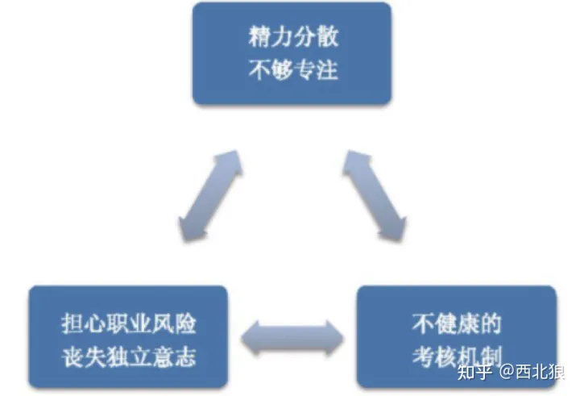
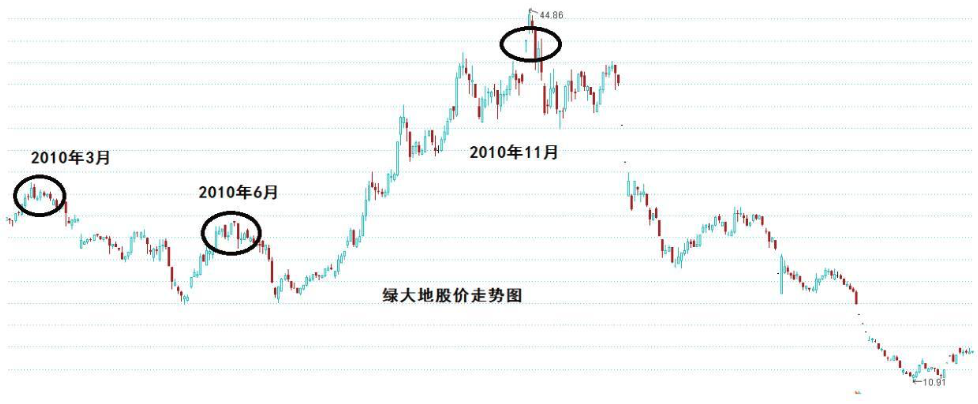
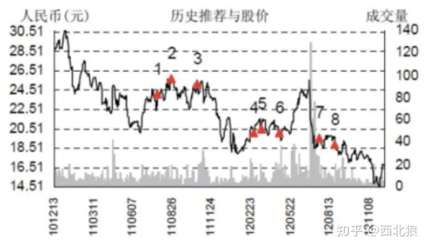
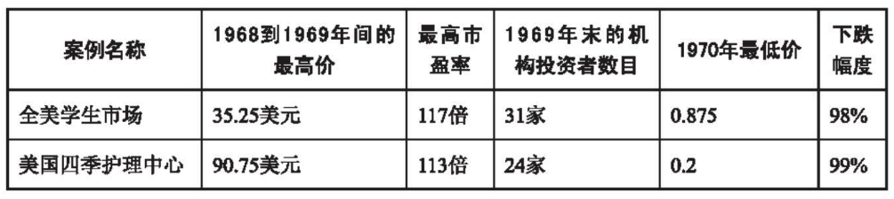
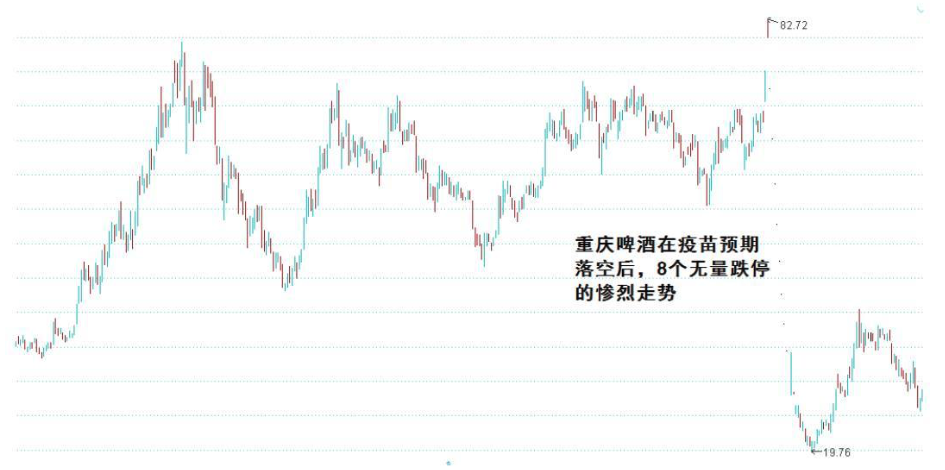

# 第2章　你其实也有优势

前面说了很多投资的困难，估计给一些跃跃欲试的朋友当头浇下了一盆凉水。但其实很多人没有意识到，作为一个昔通散户其实是具有机构投资者所缺乏的优势的，而且这种优势对于投资 绩效的影响是不可低估的。本章中我们将探讨如何认识和运用这 些优势。

## 2.1　学会扬长避短

我遇到的很多个人投资者都曾有这个疑问作为普通散户，我们既没有基金券商们豪华的研究团队，也打听不到公司的内幕消息，甚至还缺乏对金融学上各类专业名词和术语的理解，也没有专门的相关数据资料的获取渠道。在这样的市场中，我们有希望吗?我们能成功吗?

答案是肯定的，但前提是：我们必须懂得扬长避短。机构投资方的优势确实在于豪华的团队和各种专业资源。但是这种优势的背后也有着被忽视的巨大的弱势，如下图所示：

### 2.1.1　专注也是竞争力

我们都知道, 虽然机构投资者有庞大的研究团队, 但它们的精力却被分摊在几百个公司上, **因此具体到某一个公司上反而并没有什么专注性。**这是由机构的基本特点决定的: 由于掌管着巨大的资金和发行了很多的产品，所以从产品易管理的角度绝大多数的机构都遵循着-些程序化的东西， 比如“单个持仓比重限制” 等。 同时，其所雇佣的庞大研究团队也让他们有一种“我可以研究得很宽"的自信。整个团队不但要顾及几乎所有行业，同时也对于每一个行业的公司进行了广泛的覆盖。这种现象的结果，就是在具体某一个企业身上其研究的深度和投入的精力并不一定明显超过普通投资者。因为专注和长期的跟踪研究，一些普通投资者对某个公司的整体认识，对其经营规律的理解和价值内涵上的把握都超过了大多数机构的研究人员，这已经不是一个少见的现象。

### 2.1.2　时间与长期利益

另—个重要的问题，就是**机构投资者的业绩考评机制的短期化逼迫所有人都身不由己地追逐“短期业绩"。**由于各种基金排名向来是最吸引市场眼球并且对于基金的销售具有重大的推动作用，因此如何在各类基金排名和评比中名列前矛就成了一件优先级非常高的事。基金用业绩说话本来无可非议，然而遗憾的是这种排名往往过于推崇那些在短期(如半年或者1年)获得耀眼成绩的对象，这通常也是各类媒体竞相追逐的新闻题材。 因此，基金经理们在这种利益驱使下不得不将大部分精力用来研究“下个季度，下几个月，最长也不过是下1年这种周期上谁能涨得更多“这种问题。在这一过程中，”投资”也就慢慢地走向了“投机”。而且这一行为导致了两个明显的结果：

**第一，企业基本面上任何短期的变动因素都会被市场填补得非常迅速。**

**第二，企业长期竞争优势和价值创造能力在很多时候都会被机构忽略或退居次要。**

这反映到市场上的表现就是：市场经常因为一些短期消息(业绩增长、亏损、公司并购、政策鼓励或者收紧、货币政策等)而大幅波动。这些机会的背后，拼的恰恰是研究的宽度和获取信息的速度。很显然，作为一个个人投资者，如果真的去和基金们拼对短期基本面的反应能力，拼收集消息的能力是非常不明智的。

但另一方面，一个企业即使其长期前景非常的值得期待但只要短期内它似乎缺乏强烈上涨的诱因，也会被机构投资者们抛弃。 这也许不是因为他们完全没有意识到企业的价值，而是因为每个月的排名都需要他证明“自己当下的能力”，而不是对未来的洞悉。也许他们同样很无奈，但是他们无力改变。由于整个证券投资市场竞争激烈，机构投资者大多数都是通过做大资金规模之后靠着管理费盈利，所以就必须在证券市场的业绩夺战中争分夺秒甚至“火中取栗"。

我们可以看看”绿大地“的例子：2010年3月底的时候，绿大地只有3家基金进驻。就在3月底公司发出了旱情影响业绩的公告.在公告中管理层的逻辑非常荒谬怪诞(只因为一个旱情就决定要卖出其业务赖以为生的林地资产)，且在这之前已经出现业绩预告大幅变动、会计事务所被变更等典型的高危现象。然而就是这样一家已经显示出情况非常不妙的企业等到6月的时候进驻的基金却大幅提升到了15家。而仅仅是因为绿大地发布了全面转型进军绿化工程领域的公告一--当时市场正好在热炒绿化工程板块，这个公告带来了短期的”股价驱动因素”。

但结果如何呢?仅仅过了几个月，绿大地的董事长便因涉嫌欺诈被依法拘留，公司也被*st.股价自2010年末最高的44元一路狂跌到最低的 10元。 这个故事里机构投资者的行为与其说是其专业水准的过失，倒不如说是对短期股价的过分看重和由此导致的赌博心态造成的。

下图是一个著名券商对于某只股票的评级历史，图中三角形的标记都代表其“推荐买入”的时机。我们可以看到，几乎每一次的推荐都出现在阶段高点，而每一次的阶段低点都没有推荐。这并非孤例，事实上如果你愿意回头去翻翻牛市顶部区域和熊市底部区域的券商报告，就会发现越是上涨越乐观、越是下跌越悲观已经成为一种“惯例”，这种事实是否值得每个个人投资者深思呢？

专业机构参与建造空中楼阁并非只是中国的专利，实际上这种情况在华尔街也是屡见不鲜。看两个让人印象深刻的例子：

可见，大型专业投资机构远非像普通人想象的那样“明智”。这其中的原因主要就是被不健康的各种制度扭曲了投资的本来面貌：**从投资于一个实业和一份资产从而获得可靠的长期盈利，变为了追逐市场风潮并且在你追我赶的博弈中胜出。**

与之相比，个人投资者的最大优势就在于“自由的时间”——不需要参与各种业绩排名，因此也就没有必要太关注短期的净值波动，从而有可能更多的思考一些长期决定性的问题。

### 2.1.3　不必随大流

除此之外还有一个仓位的限制问题。**股票型基金等产品对于仓位有严格的上下限规定**，这就导致就算你对于2008年的暴跌有所预料也必须最少以6成的仓位去硬扛，你发现了一个最看好的企业却最多只能以1～2成的仓位买入。而个人投资者并没有这种限制完全可以根据市场机会和风险的总体状况来选择最有利于自己的仓位结构。

另一个影响机构获得长期优秀业绩的障碍来自于**对职业风险的自我保护**。很显然，站在基金经理和资产管理者的角度来考虑，最高的职业风险并不是平庸的业绩——反正大家都不好的时候，只要我不是最糟糕的就可以了。如果是在熊市，世道不好正好是业绩差劲的绝佳借口；要是在牛市，反正是鸡犬升天更不需要什么好点子。相反，为了优秀的业绩而去特立独行可是具有高度风险的。一个大家都看空的板块你去逆向买入，你不但要确保方向性的正确，而且在业绩排名短期化的压力下还必须在一个有限的时间段内就得到业绩的证明。否则，即使最终证明你是对的，但在那天到来之前可能你早就被下岗了。

具有独立的想法就要冒风险，然而人都是利己和理性的，当可以用很正当的理由来维护自己的职业利益的时候为什么要冒这个风险呢？

对此现象彼得·林奇也曾说“在饭碗的压力下，只有极少数的专业投资者才有勇气购买不知名的股票。华尔街有一条不成文的潜规则：如果你因购买的是IBM的股票而遭受损失，你永远不会丢掉饭碗。而我将继续尽可能像一个业余投资者那样思考选股”。可以想象，如果以确保职业利益和降低职业风险作为主要目的，而总是去购买那些被市场青睐和毫无争议性的股票，怎么可能获得超额收益呢？

最后让我们设身处地想想机构投资者们的工作环境吧。当你每天上班就被一堆财经信息包围着，老板时刻在盯着你的组合净值的表现并且因此而脸色风云变幻，吃个午饭或者到走廊去抽根烟也被“某个大牛股又被谁谁给挖到了、谁谁真倒霉，这个季度又要排名垫底了”的议论包围着，在这种环境下，想保持一个淡定的投资心情可真是不容易。

事实上我们看很多投资大师本身的投资模式就是非常“反机构化”的。巴菲特与芒格的伯克希尔管理着数百亿美元的资金却只有十几名员工，费雪的办公室和规模也很小，邓普顿专门躲开热闹的华尔街而把办公室设在一个偏僻的小镇，罗杰斯基本上就是一个个人投资者。这些投资大家们的行为，难道不能带给我们一些启示吗？

## 2.2　专业知识是天堑吗

也许有人会说：我不追求机构那样的覆盖面，我也可以对上述问题扬长避短。但有一个绕不过去的东西就是“专业知识”。比如我不像那些投资经理有过金融或者投资方面的专业学历背景，也不像研究员是医药或者化学、机械制造等专业出身，那么是否在研究相关企业的时候会面临一堵专业知识构成的牢不可破的墙？答案很简单：不会。

> 我们还是先从一个实际的例子讲起：重庆啤酒。
>
> 重庆啤酒花费了多年的时间要研发一种对乙肝有治愈作用的疫苗，如果成功，这将是一种革命性产品。对于疫苗是否可行，某家墓金的医药研究主管进行了完整的医学专业的逻辑推理分析，也进行了大量的实地调研。特别是这位研究主管曾是病毒学硕士，后师从我国治疗性疫苗专家、乙肝病毒分子生物学与免疫学学科带头人攻读博士，期间还参与了著名院士治疗性乙肝疫苗“乙克”项目的研究。他似乎已经专业到了无与伦比的地步了吧？可事实又怎样呢？
>
> 最终被强烈推荐的这个疫苗产品，经过临床试脸其有效性“与安慰剂基本一致”，并且在结果爆出后遭遇了连续8个无量跌停的惨烈走势。值得注意的是，这并不是简单的“黑嘴”事件，实际上这家基金也根据这个强烈推荐真金白银地购买了大量的股权，甚至一度成为重庆啤酒的前十大流通股东之首。

所以说对企业研究和理解的能力，实在是不能与“学位”“专业”简单画等号的。就算是一个金融投资领域的博士，他可能确实掌握了相当多的理论和扎实的基本功，懂得最深奥的学术概念并且可以写出极其复杂的各种模型，但这是否等于投资的能力？恐怕不能。

因为首先投资不是自然科学，它并没有确定无疑的标准化定性指标和数学模型（其实就算是自然科学也存在着量子力学这种充满大量不确定性和概率描述的领域）。**投资主要面对的是不确定性，而如何面对这种不确定性虽然毫无疑问需要一些基本的相关知识，但更重要的却是一种思维方式。而一个人的思维方式并不是由专业知识打造出来的**（显然我们可以看到拥有相同专业知识背景的人在思维方式上相差极大），**它是某种先天加后天因素共同锻造的结果。**

另一方面，即使一个人学贯中西、满腹经纶，但如果没有长期的市场和商业实践，要想对企业有深刻的认知和理解我认为也是相当困难的。但商业的领悟力并不等于商学院的理论研究，相反学历教育往往教授了过多的条条框框。其实在我看来，投资的基础专业知识自学完全没有问题，然后再多阅读一些心理学、历史方面的书籍并静心地思考沉淀远比学院教育中如填鸭一般被塞进无数理论的贪大求全要有用得多。

令人难以置信的是，投资的秘密其实早就摆放在了书店的书架上了，但人们总是轻视那些唾手可得的东西而更愿意相信一些自己得不到的传说和想象。作为投资者，能够在已经出现了这么久的证券市场和这么多投资大师的经典著作之后才接触股市，是一件异常幸运的事。这将让每一个人都有机会站在巨人的肩膀上思考，用前人的教训和宝贵经验作为自己成长的肥料。

事实上，我见过的不少具有优秀投资能力和绩效的个人投资者，他们的工作经历都是完全与金融证券不沾边的。如果这些还不够有说服力，那么不妨这样看：如果投资者的专业背景是决定性的因素，那么这个世界上投资银行最成功的应该是银行职员，投资医药最成功的应该是研发工程师，投资白酒最成功的应该是调酒师，投资机械设备最成功的应该是技术员，可事实是这样吗？

每个人都可能对特定领域的专业知识、人脉及信息方面有特定的优势。这种优势在相关企业分析中无疑是加分的。但如果没有对投资基本规律这个“1”的充分掌握，则类似专业知识这种无数的“0”就都没有太多的意义——千万别忘了，投资本身就是一个专业性非常强的领域。投资看待向题的方式，评估企业的方法是与一般的行业从业人员完全不同的。何况从我有限的职业经历来看，不管是哪个行业，真正具有深刻理解的都是极少数人。绝大多数的从业人员也许是比我们多懂一些专业名词，多知道一些业务细节，但对行业发展和企业发展的判断力上并不一定具有更深的思考。

另外，互联网的发展和信息平台机构的发达也使得获取必要的专业信息变得不再那么困难。无论是收集相关的行业数据，还是研读一些企业基本面的调研报告都已经很方便这就使得专业知识不再被垄断在一个很小的范围内。

从财务报表方面来说也是如此，少数不良公司的高管们可以费尽心机地做几个财务数据的会计调节，可以尽量控制一些事件的发生时机，可以人为地制造一些兴衰的烟幕弹，但是所有的这一切都是短效而表面化的。{++一个行业的发展态势一个企业的竞争优势的本质是很难被“表演，装饰”出来的++}。这也是很多“财务数字专注者”容易翻船的原因。**将企业活生生的经营环境和经营要素评估，与调节余地较大且只反映当期情况的财务数据脱节，将带来巨大的风险。**

所以，个人投资者不必产生一种学历或者背景上的盲目崇拜和敬畏。一种错误的意识是很多人认为行业专家、企业内部高管是知道企业命运的，由此总喜欢站在揣测其行为和心理的角度来看问题。实际上他们虽然在具体运营和业务细节的了解上远胜普通投资者，但其实远谈不上掌控了竞争中的一切要素。与其做他们的蛔虫，不如**回到商业的本质来看问题——有时“不在此山中”反而是一种优势。**

## 2.3　宏观到底怎样研究

个人投资者往往缺乏专业系统的宏观经济学训练，由此也让很多人心生怯意：做投资是否必须要对宏观经济有很深的研究？

个人觉得对宏观经济的研究当然是需要的，原因很简单：没有哪个企业是活在真空中的，整个社会经济和外部环境的变迁必然对企业造成巨大的影响。但是如何关注宏观经济，却是个问题。关注宏观经济，就是总盯着准备金、利率、CPI、PPI、M1、M2、PMI、发电量等经济指标然后靠它们来引导着做决策吗？在我看来这其实很荒谬。

不妨这样想，对于整个宏观经济而言，包括宏观经济专家在内也都是某种程度上的盲人摸象。如果谁相信市场就是1+1=2的简单游戏，看见1就能推测出2.并且知道再实施3就可以得到5.那么他就是得出一个结论：世界上最棒的经济体系就是计划经济——因为一切皆可条理清晰地精确推测和控制。可事实是怎样的呢？计划经济之所以行不通，首先还不是因为缺乏足够强的经济掌舵人，而主要是因为**整个经济系统运作的复杂程度远超出人们可以精确掌控的范围**（虽然人们大致知道其基本原理——但这就像你知道核裂变的原理是E=MC2，可又有谁能根据这个就造出原子弹呢？），2可以是1+1得出，但也可能是0.5+0.8+0.7得出，还可能是（1.8-0.7）×3-1.3得出……仅仅根据一次的1+1等于2，就推导出原来”2就是1+1”啊结果会怎样？

何况，对于证券投资来说，仅仅是“预测”到了宏观经济在未来的某种状况，距离一个有效的投资决策还差得远呢。宏观经济与证券市场之间的反馈互动过程本身就是极其复杂的、不同步的（而且往往是大幅不同步的）。预测到了某个季度的某种经济现象，也未必就代表着证券市场某种特定情况的出现，更不用提再进一步落实到具体的股票上了。那么，这种花费了极其高昂精力所取得的“预测”意义又何在呢？在股市中我们经常看到宏观经济学家们的高谈阔论，但如果细心观察会发现他们的言论对于投资的价值基本趋近于零。

> 这里说一个真实的案例：在2008年9月我参加了一个规模非常大的私募机构的投资策略报告会，我们现在知道那个时候市场已经跌到1900点左右马上接近1664的历史大底部了。那个投资经理也认为当前的怡值已经非常具有吸引力了。但是他们当时研究了一圈宏观经济指标，发现“全国用电量”指标突然出现大幅度的下跌。这个指标隐含的意思就是全国工业生产的崩贵，这让他们非常恐惧，认为经济的黑暗前景简直深不见底。因此，他们放弃了原定的建仓计划而准备“等到经济的底部”。结果如何大家都知道了，后来据我所知他们的建仓成本是在2500点以上。

所以我觉得投资还是简单点儿，回归**企业经营和风险机会比**这个根本就好了。大环境的波折必然或多或少影响所有的企业，对于企业外部环境进行一定的分析和推测也是不可避免的。不过值得注意的是，有一些特定的行业或者企业对于宏观经济波动的敏感性较低，其发展更加取决于自身差异化优势的壁垒，或者虽然其也受到经济波动的波及，但其具有坚实的扛过经济低谷的能力，并将在经济再次回升时大幅度地提升竞争力（这正是本书在后面章节将重点研究探讨的企业类型）。这种客观现象，为“不去追着宏观经济指标走”的投资创造了坚实的土壤。

只要我们不认为暂时的经济困难将是这个社会发展的“句号”，那么一切都将延续。**优秀的企业会在危机过后更大幅度地确立优势。**特别是由于外部环境和市场情绪导致这类优质企业已经非常廉价的时候，再试图更多地跟踪宏观指标来精确把握“完美时机”不但是自信心过高而且多余。

那么投资者就完全没必要思考宏观经济了吗？也不是，这又是需要辩证思维的地方。试想一下，如果整个国家未来5年或是10年的经济发展大势和特征，与你所要投资和长期持有的股票所需的发展环境正好南辕北辙，结果会如何？所以我想所谓的关注，是需要一种思想上的穿透力，**要对未来5～10年以上社会经济发展的大趋势有一个前瞻性的认识，而不是试图去预测每个季度的经济指标的波动。**

投资者尽量少地去关注市场运行中每天都必然发生的一些涟漪，而对于社会发展的大势（比如不同经济发展阶段所对应的行业兴衰）和经济运行的一般规律（比如萧条、复苏、过热、冷却的循环）进行更多的思考，将企业商业价值这个“根”与社会经济变迁这个“势”结合起来，可能更有利于投资的判断。当然，这其中的关系是：

* “根”是主，“势”是辅；
* “根”是纲，“势”是目；
* “根”是范围，“势”是侧重。
