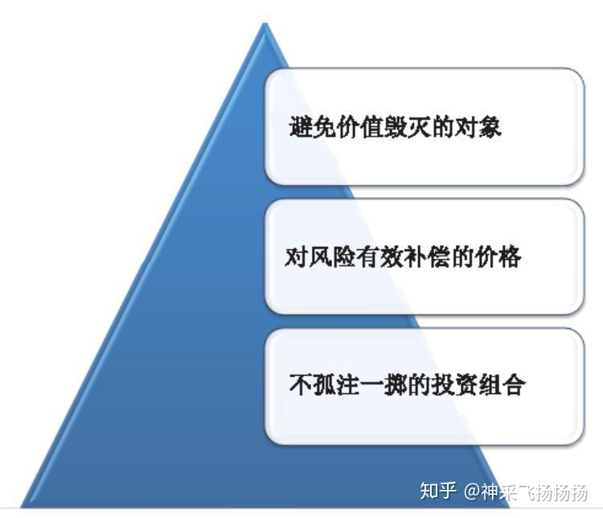
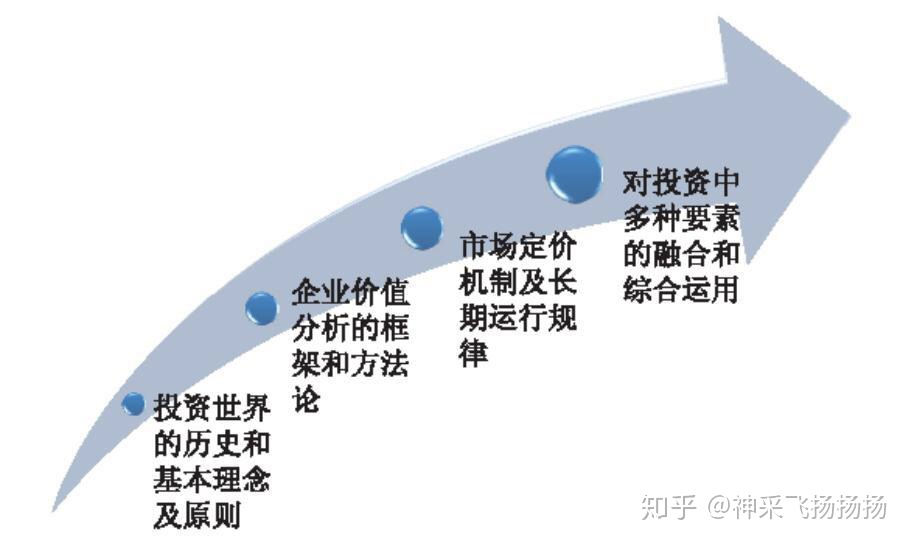

# 第3章　捅破投资的“窗户纸”

在第一章中曾经说过，绝大多数人从来就没想过以“投资者”的身份进入股市，这是很多股市悲剧的开场。那么，如果一个人确实决心以投资者的心态进入市场，又该怎么做呢？我想无非是以下几点：

第一，理解什么才是真正的投资行为；

第二，认识到投资中必须严格遵循的原则；

第三，小心地避开坑害了无数人的行为陷阱；

第四，知道如何循序渐进地提升自己的能力。

## 3.1　投资、投机与赌博

首先我们有必要理清一些基本的概念，比如投资、投机和赌博。关于投资与投机之间的差别，格雷厄姆在《证券分析》一书中有过如下的定义：“投资业务是以深入分析为基础，确保本金的安全，并获得适当的回报：不满足这些要求的就是投机。”从这个定义来看投资与投机的分别来自于：

1. **投资需要深入的分析，而投机缺乏这一严谨的过程：**
2. **投资的回报预期是以本金的安全为前提的，而投机并不将安全性放在首位；**
3. **投资对于回报具有理性的预期，投机则瞄准暴利。**

在《聪明的投资者》一书中，格雷厄姆对这一话题提供了一些新的解释：”**投资者和投机者之间最现实的区别，在于他们对待股市的态度。投机者的主要兴趣在于预测市场波动，并从中获利；投资者的主要兴趣在于按合适的价格购买并持有合适的证券。**“从这个补充的解释中，可以看到对待市场的态度是主要的区别。

就个人而言，我更倾向于第二个解释。这里的区别在于：投机很多时候并非不需要严谨深入地分析，比如一些基于宏观经济波动进行投机的人，同样需要就他们所关心的领域进行深入和细致地分析。并且很多投机者也并非完全忽略本金的安全。同时，如何衡量“适当的回报”呢？我们很难用模糊的概念去定义一个人在投资还是投机。

但从对待市场的不同态度来划分确实是一针见血的。在我看来，投资的核心在“资”上，决策是基于某种“资产”的性价比。而投机的“机”可视为所有“机会一的统称可以与资产本身的价值毫无关系。比如石油价格的上涨或者利率的一次调整，虽然未必会真的对某个公司的盈利能力造成实质性的影响，但却可能引发市场相关的情绪而带来短暂的波动。在投资者看来，这种波动毫无意义。但在投机者看来，这种波动是可以利用的。

显然，**投机者更看重能带来”扰动”的因素，无论这种因素是宏观经济指标的变化，还是某种突发事件的影响，只要有足够的”扰动”产生就有相应的机会可以把握。**{++而投资者更关注资产所含有的稳定价值，一个最不容易或者最小幅度受到意外扰动的资产，才是好资产。++}**所以，对投资者来说成功的关键是理解资产价值和衡量的某种普适规律，而对投机者而言则需要敏感于各种变化和转换中稍纵即逝的机会。**

如果要我来评价投资与投机的优劣，那么我想投资需要厚积薄发，而投机需要敏锐的直觉。它们在本质上都有苛刻的要求：投机贵在善于捕捉变化，投资贵在领悟不变性的东西。所以前者弹性必然高于后者，而后者可持续性必然高于前者。从现实的层面来衡量，投资者生活在一个更安稳的世界里，而投机者就要繁忙得多了。但这两者要想做好的要求却有不少相似之处：耐心、善于控制情绪、扎实的专业知识、严密的交易规划等。

严格来讲，投资与投机存在重合的部分。如果说企业内在价值的增长是投资的回报那么由市场波动导致的估值变化带来的回报其实也含有一定的投机成分，只不过是主次关系而已。投资和投机并不具有道德上的高下之分，但投资脚踏的是更为坚实的土地，并且相关知识也更容易被普通人掌握。而投机却似乎需要更多的天赋，并且其获利也更容易出现大起大落。

除了投资和投机之外，另一种参与者的行为是赌博。

赌博是一种非常“纯粹”的活动，这种活动完全与资产衡量无关，与真正投机所需要的环境分析也无关，就是幻想着一个傻瓜从自己的手里接过股票的接力棒。更不幸的是，很多在进行着赌博行为的股民都或多或少地以为自己在投资或者投机。他们认为看看k线或者更高级一些按一下股票软件的F10看看最新的资料，又或者把每天的财经热点翻翻就不是赌博了——这就像一个赌马或者买六合彩的人，也会去仔细翻翻往期的中奖记录和名嘴们的评论然后再下注，但这能改变赌博的本质吗？”

**以一个较长的时间周期来看，在股市中会有成功的投机者，必然存在更多成功的投资者，但没有成功的赌徒。**但为什么人们清楚地知道十赌九输的结果，却依然乐此不疲呢? 心理学家通过对老鼠的试验解释了这点。简单说人们（包括老鼠）倾向于获得即时的回报而不是延时的回报。赌博和投资行为完美地体现了两者在这一属性上的不同，赌博可以马上带来结果（无论输还是赢），而一笔严肃的投资行为却需要相当长的时间才能知道最终的结果。

| 赌博                                                                     | 投资                                                                   |
| ------------------------------------------------------------------------ | ---------------------------------------------------------------------- |
| 个面要艰苦和基础知识的学习                                               | 需要投入大量的精力用来进行持续、广泛的阅读和学习                       |
| 羸钱的极度快感和输钱的强烈刺激会对大脑形成高级别刺激并带来激烈的情感体验 | 基本上都是平淡无奇和乏味的，甚至很多绝妙的投资在初期都会带来痛苦的感受 |
| 无论输嬴都是即刻回报                                                     | 无论对错都是延时汇报                                                   |

所以，不善于等待，焦虑，急于求成，不劳而获的幻想，在刺激的体验中无法自拔，都是堕入赌博深渊的强大推力。

## 3.2　易学难精的价值投资

我一直觉得，股市中亏损的那7成人其实都是聪明人。正因为自恃聪明，所以总在想怎样能够“在最短的时间里赚最多的钱”，总在探寻”最接近顶点的地方跑路，最靠近底部的地方抄进”，总是喜欢“不用下太多笨工夫就能轻松赚大钱”。盈利的少数分子看上去倒常常像个傻瓜——他们一般都具备一点儿偏执狂的基因，都更信奉朴素的道理，很有自知之明，还有点儿一根筋。他们觉得“赚大钱、赚快钱”不是自己能力范围内的事儿，他们认为”股市同样具有很高的壁垒，需要持续刻苦的学习”。他们傻傻地在别人的嘲笑声中买入，在别人的嘲笑声中守住，又在别人的嘲笑声中卖出。最后，他们在所有聪明人回头一看傻眼的时候微笑。

所以真正具有智慧的人会做一些短期看来很傻但长期会成为赢家的事情，小聪明的人会做一些短期看来有利可图但长期必成为输家的事。要么确信自己真的聪明绝顶，要么最好不要经常耍小聪明而应该憨厚一些。

> 郭德纲曾经说过一段话：“京剧看起来就很难，唱念做打翻，样样都要下苦工，这是看得见的，所有人一看到就会被吓住了。相声看起来是最简单的工作，谁都会说话，所以我凭什么要买票听你说话呢？问题就在这儿，京剧就像一座大山你能一眼看出高来就不敢往上爬了。但相声你乍一看就是个小土坡，但你爬上去发现后面有一个高的坡，再爬又有一个更高的，再爬还有……”某种程度上而言，投资和相声的状况很相似。

我发现和不太了解证券投资的人聊天，如果你讲的话是属于从企业经营角度谈的，往往不会引起什么重视甚至会被认为比较虚伪——虽然未必说出来，但表情和态度大致是这样的潜合词。相反，如果你大谈一些技术指标的诀窍和所谓的独有秘籍，或者能就各种热点的财经消息和政策热点发散开去滔滔不绝，则往往被追捧和视为高手。

仔细想想其实这种现象并不奇怪，技术分析也好，宏观经济也罢，都是刚听起来像天书，初学者很容易被唬住。但其实长时间就会发现，其研究领域其实是不断收敛的，所需要关注的信息一定是越来越集中到几个最简单的反馈指标上，否则更容易紊乱和互相发生冲突。而价值投资则正相反，初时都是一些最朴实的大白话，没有一句是你完全听不懂的。但越学越发现所涉及的知识面急剧膨胀，从最基本的财务知识的掌握，到企业经营规律的认识，到客观与主观偏离的影响，到市场定价机制的复杂性，再到价值的动态性和相对性……可以说每一部分都涉及大量的知识点。更困难的是，**这些知识点本身还都在动态的扩张之中，随着投资对象的更换，很多原先积累起来的经验和知识很可能都要重新再次更新。**

麻烦的是，即使掌握了上述的知识也并不能确保成功，因为投资者还需要战胜自己的贪婪和恐惧，必须在时刻都在制造麻烦和诱惑的市场中保持理性。学到了什么只是一个方面，始终保持理性的存在并且运用这些知识，才是成功的关键。

我向来认为要真正认识一个事物，不是看能说出多少它的优点，而是能不能充分认识到它的缺陷。对于股民来说，价值投资不但要经过大量的学习，而且整个投资过程是索然无味甚至艰辛的。没有那么多的激动、忐忑、狂喜、沮丧的情绪轮回。互相之间的交流也都是些财务数字、经营状况等让人乏味的内容，远远比不上股民间一个个爆炸性的内幕消息或者对技术指标的神秘挖掘来得刺激和吸引人。如果谁想体验股市的跌宕和五彩斑斓，那么价值投资的传统保守和简单重复肯定是不适合他的。

所以只有了解了这么多“缺点”之后依然愿意进入价值投资大门的，才算是真正的有缘人吧。

## 3.3　不可动摇的基石

不管叫价值投资也好，叫投资价值也罢，这种在国内外的证券市场都已经经过了长期有效性验证的方法，是普通投资者在股市中最有效的依靠。但怎样才算真的价值投资？怎样才能真正地投资价值呢？如果仅仅从各个投资大师的具体行为来看，似乎具有相当大的差异：他们有的喜欢成长股，有的喜欢价格便宜；有的长期持有，有的短期套利；有的仓位高度集中，有的非常分散：有的倾向传统行业，有的偏爱新兴产业……但在这一切表象的背后，其实所有的价值投资者都遵循着以下几个不可动摇的原则。它们是价值投资这座辉煌大厦的奠基石。

| 价值投资的行为基石   | 解释和说明                                                                                                                                                                                    |
| -------------------- | --------------------------------------------------------------------------------------------------------------------------------------------------------------------------------------------- |
| 从企业经昔视角看投资 | 这是与其他方法最为本质的一个区别。站在企业经营的角度去认识价值的来源，是价值投资基本的立足点。这种视角下，股票不再是赌博的筹码，而是企业资产及经营结果的一种所有权                            |
| 谨守安全边际原则     | 安全边际是对投资所涉及的要素进行谨慎性估计，以最终保障本金安全的一种思维方式。安全边际的思维模式是区别于所有赌博行为的最明显的标志                                                            |
| 确定自己的能力边界   | 优秀的价值投资者从来不认为自已无所不能，相反，他们总是耐心地在自己的能力范围内寻找可靠的机会，而不为能力圈外的浮华和诱惑所动。这种定力是不犯大错的基本保障                                    |
| 了解“市场先生”       | “市场先生”是对股市所包含的情绪性表现的一种拟人化表述. 市场先生每天都在不停地与无数人交易，他有时精明有时糊涂: 有时极端保守，有时奋不顾身。不了解“市场先生”的脾气，很难成为一个精明的投资者    |
| 建立有效的自控能力   | 既然都是吃五谷杂粮的，怎么可能一点儿不食人间烟火?但优秀投资者与一般股民的区别，就在于其更善于控制自己的情绪。再高的学识也拼不过浮躁，无数聪明的脑瓜最终败在自己的腺体上，都是因为缺乏自控能力 |

在这五大行为基石中，从企业经营视角看投资是一切的起源，建立并识别自己的能力圈是最重要的依靠，在这两条的基础上进一步理解了“市场先生”的脾气，才可能做到让每一笔投资具有较高的安全边际。而这一切能否持续地运行在高水准下，能持续多久，将完全取决于每个人不同的自控能力。

> 台湾经营之神王永庆曾经说过，一根火柴不够一毛钱，一栋房子价值数百万，但一根火柴可以烧毁一栋房子。那么投资中的这“一根火柴”是什么呢？我想，如果**把上述这几个投资的最根本原则倒过来做，恐怕就是那根最容易烧毁财富大厦的火柴了**。

### 3.3.1　从企业视角看投资

*当股票是筹码的时候，它只能用来赌博。*但当股票成为一个公司所有权的一部分时，你就会发现原来自己的投资收益与企业的经营之间有如此紧密的联系。前面说过投资取得收益的根本在于“低买高卖”，而所谓股价高和低的决定因素之一，正是企业经营的绩效。

我们都知道，企业经营是需要时间来改变的，但证券市场却往往由于各种原因，在基本面没有大变化的情况下产生股价的明显波动。这样看来似乎利用市场波动来赚钱有其基础（波动是客观且频繁存在的事实），但正因为股价波动极其快速且缺乏可遵循的逻辑关系（很多波动是毫无理由的），因此难以出现持续有效的方法。相反，**投资的时间越长，企业经营的结果对投资者收益的重要性就越大、确定性越强。**

罗伯特·G，哈格斯特朗在《沃伦·巴菲特的投资组合：集中投资策略》一书中，曾试图找到股价与经营业绩之间的关系到底呈现怎样的紧密程度。他以1200家公司作为样本，并将经营结果与股价走向的相关性进行研究。结果是：

* 他们发现当持有股票3年时，企业收入和股价的相关程度在0.3左右；
* 持有5年时，两者的关系是0.374～0.599；
* 若拉长到10年的持股期，两者关系上升到0.593～0.693；
* 延长到18年持股期，收入和股价的关系就稳定在0.688以上。

是否站在企业所有者的角度、从企业经营的基本面情况来看待股票和股市，是价值投资者（与其他所有股市获利方法最根本的区别。在企业经营分析领域，可以进一步细分出一些重要的价值投资守则，比如**护城河概念**和**均值回归理论**等，这些我们都将在后续的章节中展开并详细探讨。

### 3.3.2　谨守安全边际

**安全边际**也是价值投资中一个独有的概念。但实际上这一思想在其他学科也广泛存在，比如在桥梁建设的时候要有足够的设计冗余，以避免意外情况的发生。又或者日常生活中，从家里到机场通常只需要1个小时的交通时间，但为了避免偶发性的交通堵塞所以留出充足的1.5个小时。这些其实都是安全边际。

当然在证券投资中，安全边际有其特定的含义。一般认为安全边际主要指为了弥补某些投资中必然包含的不确定性因素，因此需要由股价给出足够的风险补偿后才能买入。简单讲，就是要足够便宜。我个人认为可以将这个内涵进行一下扩展，安全边际可以分为三个层面来考虑，见下图：

安全边际的第一个层次是{==**投资组合**==}。任何一只股票都包含着风险，区别只在于风险的大小。仅仅通过低价也并不能将这种风险降到足够低。因为人的判断力总是有限的，错误是不可避免的。区别只在于：有些错误不会伤筋动骨，有些错误却足够让人再也爬不起来。如果一个人的投资组合包括了10只不同类别、行业，相关性较弱的股票，其中1只发生将本金完全亏光的极端错误，总的投资损失不过10％。这与全仓一只股票而出现严重错误所导致的后果不可同日而语。

当然，并不是说持仓越分散越好。分散对风险稀释的另一面就是单只股票上涨对收益的驱动力也微不足道。何况，一个几十只股票构成的组合，实在让人很难想象投资者能对这么多企业的经营状况有真正深入的理解，这反而会使对每一只股票的选择都更加不慎重。所以投资组合到底该多分散是一个度，即与每个人不同的风险承受力有关，也取决于对投资对象的了解程度。但总之极端化并不可取，我个人的建议是{++**对资金量不超过1000万的个人投资者而言，5只左右为宜，不要少于3只也不要超过10只。**++}

安全边际的第二个层次是{==**价格**==}。这是比较传统也最根本的角度。到底什么价格才算是足够便宜是一个无法有标准答案的问题。10克黄金500元可能就非常便宜了，但10克黄铜这个价位就太离谱。所以{++**搞清楚投资对象的具体情况，衡量对其未来经营的基本期望值，以及达到这一目标的不确定性程度，综合考虑这些后才能大致得出一个可以接受的价格区间。**++}

安全边际的第三个层次是{==**避免价值毁灭的对象**==}。严格来讲这个问题包含在了价格衡量所考虑的范围内，但因为太重要还是单拿出来说一下。当评估物的基本价值是稳定的状态，比如100克黄金，这个时候只根据报价的情况就可以评估。但如果这100克黄金是泡在（或者有泡入的危险）硝基盐酸（俗称王水）当中，这时{++**任何看似便宜的报价都可能会打水漂。有些企业也会面临类似的问题，看似异常便宜的股价（甚至公司的净现金都高于公司的市值），但如果这个公司依然处于经营局面的扩大性恶化趋势中（比如公司并不将现金分红而是投入到根本不可能产生回报的项目里），那么静态来看非常便宜的价格也可能是一个巨大的陷阱。**++}

如果换一种说法，也可以认为**价格提供了交易阶段的安全边际，但*企业不断创造价值的能力才是长期持有的安全边际*，而股票组合乃至于资产大类的平衡提供了财富的安全边际。**所以安全边际是一个看起来很简单的概念，但要想对安全边际的理解更深入，实际上既需要对企业价值创造规律的认识，又需要对市场定价特点和估值有深刻的理解，这些内容我们在后面的章节都将有大量的篇幅进行讨论。

### 3.3.3　确定自己的能力圈

如果我说大多数人不可能既成为优秀的工程师，又成为成功的画家，再在文学创作领域做出一番成就，还练就一身专业网球运动员的本领，我想对此大家不会有太多异议。但一到了股市这个常识就会被股民忘得一干二净。**在股市中有上千家公司，它们的行业和业务情况千差万别，影响它们经营的内外部环境因素各不相同，它们的财务特征各有特点它们所涉及的专业知识五花八门。**但很多投资者却好像很有信心搞懂任何东西，事实上这种自负要么是过高地估计了自己的能力，要么是过低地估计了所涉知识面的难度。

其实从古至今，如何正确地认识自己的能力和局限性就是智者们热衷的话题。老子说：“知人者智，自知者明”：苏格拉底说：“知道自己无知的人才是最聪明的人”；哲学家爱比克泰德说：“人生幸福最重要的是弄清楚：什么事情是属于我们能力之内的事情，什么事情不是。”可见，正确地认识自己从来不是一件轻而易举的事。

为什么确定自己的能力圈如此重要？因为在股市中，投资者将面临的诱惑是无穷无尽的。一个不懂得自己能力边界的人，会轻易地被各种诱惑引得偏禽了熟悉和安全的轨道，进而踏入未知的陷阱。所谓人贵有自知之明，实际上如果一个人认为自己可以弄懂所有公司或者捕捉所有的股市机会，正好说明他完全不知道自己真正懂些什么。

每一个希望在股市中长期存活的投资者，都应该谨记巴菲特对此作出的忠告：“对投资者来说，最重要的不是能力圈的范围大小，而是你如何能够确定能力圈的边界所在。如果你知道了自己能力圈的边界，你将比那些能力圈虽然比你大5倍却不知道边界所在的人要富有得多”。

在投资界我们经常会看到非常多的分歧，比如是该集中投资，还是分散投资？是该更关注企业未来创造盈利的能力，还是当下可见的硬资产价值？其实这些路都有成功者，问题并不在于哪条路是完美的，而是认识到自己的能力倾向是怎样的？当真正了解每种方式的优点和局限以及自己的能力特质后，自然会对这种争吵没了兴趣。

那么到底如何确定能力圈呢？我想需要考虑**自我认知**和**投资对象认知**两个方面：

| 需要考虑的因素          | 解释和说明                                                                                                                                                                                                                                                                                                                                                                                                                   |
| ----------------------- | ---------------------------------------------------------------------------------------------------------------------------------------------------------------------------------------------------------------------------------------------------------------------------------------------------------------------------------------------------------------------------------------------------------------------------- |
| 自我认知： 性格因素 | 我认为没有完全脱离性格的能力圈，每个人在能力上的倾向总是与性格特征有所关联的。今比如有的人对于商业价位非常敏感，但可能略微急躁；有的人可能并不善于深入企业，但非常善于等待，不见兔子不撒鹰。**清楚地认识到自己是一个什么样的人，自己的优势是什么，自己最大的弱点是什么，是构建投资能力圈的前提**                                                                                                                             |
| 自我认知： 知识背景 | 每个人知识背景的差异必然导致在研究中注意力和理解程度的差异。但相对于性格因素，知识是可以扩展的。对于那些具有狂热的学习热情和高理解力的人而言，基于知识圈的扩张而提高能力圈的范围是可能的。但需要注意的是，**知识的扩张并不必然导致能力圈的扩张**，将外部知识应用于具体的投资判断是一个复杂和容易受到诸多于扰的过程，这点在后面的认知偏差部分会有分析。                                                                       |
| 投资对象认知            | 能较清晰地看到对象{++**所属行业在中长期的发展演变**++}，理解影响行业格局演变和形成的几个关键性因素     对于投资对象的{++**竞争优势**++}有着超越市场普遍水准的深刻认识，能简单地回答 “为什么最终它能胜出“     能对于其{++**净资产收益率**++}在中长期的未来演化、结构变化有清楚的认识     对于这笔投资{++**最核心的原因及最大的风险了然于胸**++}，在获胜的概率和赔率上已经精心算计并且有满意的估算结果 |

对于上述问题中所涉及的知识点，将在本书的后面部分循序渐进地展开。希望当读者朋友通篇读完后再回到这一页时，已经对这个问题有了更深的感悟。需要注意的是，并不是每个人一定都具有能力圈，很多人可能并不具有任何可靠的投资能力。**所谓的能力圈，是指对于已经具备了基本投资素养的人来说划定一个更加熟悉和高成功率的行动区域，对于缺乏基本投资素养的人来说，就先不要奢谈什么能力圈了。**

从我个人来看，{==研究的深度远比广度重要==}。强调广度的研究更不适合个人投资者。当然在投资的初期阶段广泛的尝试不同的领域是必要的，因为知道自己真正能把握什么东西，其前提是知道哪些东西是非常难以把握的，这是建立在较广阔研究实践基础上才能认识到的。我认为广泛研究的目的在于通过大量的观察，最终**抽象出高价值企业的特征**，并且通过基础性的广度研究，在实践中不断观察自己对于哪一个领域和哪一种投资机会更加易于理解和掌握，然后专注于这种机会——别忘了，就算是在海面上广撒网，最后要想捞起鱼来网口也必须是收紧的。

### 3.3.4　了解“市场先生”

"市场先生"是价值投资理论的开创者格雷厄姆在《聪明的投资者》中创造的一个拟人化的形象。下面这一段文字对于股票市场的形象描述，既生动又让人印象深刻：

> “设想你在与一个叫市场先生的人进行股票交易，每天市场先生一定会提出一个他乐意购买你的股票或将他的股票卖给你的价格，‘市场先生’的情绪很不稳定，因此，在有些日子市场先生很快活，只看到眼前美好的日子，这时市场先生就会报出很高的价格，其他日子，市场先生却相当懊丧只看到眼前的困难，报出的价格很低。另外市场先生还有一个可爱的特点，他不介意被人冷落，如果市场先生所说的话被人忽略了，他明天还会回来并提出他的新报价。市场先生对我们有用的是他口袋中的报价，而不是他的智慧，如果市场先生看起来不太正常你就可以忽视他或者利用他这个弱点。但是如果你完全被他控制后果将不堪设想。”

还是回到“低买高卖”这一投资获利的基本原理上。除了企业经营业绩外，另一个决定股价高低的决定性因素就是{++估值++}，实际上就是市场给出的报价。市场定价是一个复杂而又迷人的话题，为什么有些股票市场先生喜欢给予溢价，有些却只能折价交易? 什么情况下市场先生给出的报价是合理的？当出现什么迹象时，表明市场先生正在进入周期性的癫狂或者低沉? 要想清楚的理解这些，必须对市场先生的脾气摸透。更确切地讲，了解市场先生包括了**认识市场定价的根本机制**，**理解估值的本质及相关运用方法**，以及**认识到市场情绪和预期对于基本面的放大作用**等，这些重要的知识点正是将在本书的第三部分详细探讨的内容。

### 3.3.5　有效的自控能力

如果说前面的几点都更偏向于硬知识的话，那么这一点就主要体现出投资者的软实力。不要小看这点，那些具备了丰富专业知识的金融领域的高材生们为什么照样摔跟头？其中一个重要的原因就在于缺乏情绪的自我控制能力。

成功的投资当然需要足够的智力为基础，因为这是学习相关知识的基本前提。但聪明人在股市中并不一定占有优势。从智商的角度来讲，相信很少有人能超过牛顿。但在1720年，牛顿在当时炙手可热的海南公司股票上却做了并不明智的选择：高位买入这只股票并最终亏损20000英镑（按现在的货币价值大约相当于300万美元）。对此，这个可能是地球上最聪明之一的人只能感慨“我可以计算天体的运动，却无法揣摩人类的疯狂。"

我们可以参考下某些骗术的奥秘。对于绝大多数的骗局来说，是否让人上当往往并不取决于骗子们的技巧有多高明，而是取决于我们内心深处某个未获得实现的欲望有多强烈。**骗子只是根火柴，深层次潜藏的欲望和诉求才是一大堆的干稻草，而理性是这两者之间唯一的防火墙。**所以最高明的骗子不是去表演，而是去诱发你内心隐秘的需求。股市让人失去理智的道理与之很相似，把饥渴的欲望扔进一个充满神话并且行动极其自由的环境，其结局如何并不难料到。”

所以自我的情绪控制其实用两个字就可以概括，那就是**“理性”**。所谓理性，基本的特征是不易冲动、不被情感而影响判断力、重视证据和逻辑、不易受到外界压力的影响而失去正常的思维判断力。在我看来，理性之所以难以保持的一个重要原因就是失去了平常心和患得患失。而造成心理失衡的原因多半是面对多变的市场难以遏制的恐惧及贪婪。

**现代金融业的发达以及各方利益共谋下的合力，为投资者提供了空前的交易便利性和资讯覆盖度。但是这种技术层面的进步并未使得大众在证券市场中的黯然结局与几十年前相比有任何改观。相反，触手可及的交易按钮和全方位轰炸的“财经要闻”，只让绝大多数人在传统的“恐惧与贪婪”之外，又新加了“焦躁”。**看看我们的周围吧，媒体最热衷的是哪个人在最短时间里又创造了财富神话，大众最热捧的博客几乎全都是预测市场涨跌的（甚至最热门的博客已经预测到了下一分钟市场的涨跌），商场的书架上充斥着“捕获涨停板”“至尊选股术””轻松赚1000倍”等宣扬轻松赚大钱的书刊。股市中永远是你追我赶、热火朝天的气氛。不少人正是被这种气氛所感染，心情随着K线的起伏而跌宕，最终失去了理智。

> 1942年巴菲特为姐姐买了3股城市服务公司。之后股价从38.25美元一路下跌了30％到27美元。从此在每天上学的路上巴菲特都会受到姐姐的“提醒”，显然这让年少的巴菲特感觉到了巨大的压力和烦躁。因此当股票终于回升到40美元的时候他立刻卖出，以此结束这段痛苦的投资。不过，就在他卖出之后城市服务公司的股价很快就涨到了202美元。由此可见，即使是少年时期的股神也会受到压力的困扰。而且恐怕这种外部环境、市场噪音对情绪的负面影响即使对于成名后的投资大师们也依然构成一定的烦恼。这就难怪连逆向投资大师邓普顿也说自热闹的华尔街搬到清静的拿骚以后，他的业绩表现就越来越好了。

要想成为在股市中最终胜出的那10％，就**必须跳出情绪的旋涡，把持住自己的理性**。当然，情绪管理能力与投资者的学识有一定的关系，试想一个完全不懂投资为何物，也从没明白正确的投资该秉持怎样的原则，更没想通最终是如何获利的人又怎么可能理性得起来呢？但除此之外，我越来越倾向于认为善于自我控制的投资者确实具有某种“不可学习”的因素，这可能既与天生的性格有关，也与后天长期养成的价值观和思维方式有关。如果确实性格上就是缺乏这种自控力怎么办呢？我想，唯一的方法就是让自己离市场远点儿吧。

## 3.4　把预测留给神仙

在价值投资领域中其实也存在不同的风格，著名的投资大师们在一些具体问题上的倾向性也有明显的差异。但几乎所有的投资大师们都会有两个完全相同的忠告：

**第一，不要预测市场；**

**第二，不要频繁交易。**

预测市场和频繁交易，基本上是普通股民的最典型特征。甚至可以这样说，只要能避免这两种愚蠢的行为，长期来看就有希望战胜大多数人了。我一直搞不懂，是什么给了预测市场者这么好的自我感觉？如果看完了下面这段还有人认为自己可以以预测市场作为长期盈利的手段，那么我就无话可说了。

> 证券分析之父格雷厄姆曾说：“和果说我在华尔街60多年的经脸中发现过什么的话，那就是没有人能成功地预测股市变化。” 巴菲特说：“我从来没有见过能够预测市场走势的人。” 彼得·林奇说：“不要妄想预测1年或2年后的股市走势，那是根本不可能的。”
>
> 耶食大学的经济学家和现代资本理论的创始人、投资大师费雪，在1929年的一次演讲中对当时的市场做出如下评价：股票价格看起来已经达到了一个永久性平稳的高水平。就在他演讲之后的2个星期，股票市场进入了美国证券历史上最著名的大崩清，接下来的3年市场都陷在恐怖的崩盘和直线跳水中。这次与事实相距甚远并且损失惨重的预测让这位投资大师的声望受到了打击，尽管费雪曾经成功地预测到了20世纪20年代早期的牛市。
>
> 2008年3月中下旬，当市场展开反弹浪后，亚洲股神李兆基对市场感到颇为乐观并认为在4月前指数可以进一步升至27000点。结果是恒生指数在5月5日上涨到26387点后便进入了新一轮的调整。而2008年的最低点是多少呢？11015点，也就是说，距离李兆基表示后市乐观的4月的收盘点位25755点，后面还有57.23％的下跌。
>
> 索罗斯1987年预见到日本股市进入泡沫化，因此在华尔街评论上发表观点认为美国股市将坚挺而日本股市将崩盘。结果日本股市一直牛到了1989年，而美国股市却发生了崩盘。此役索罗斯旗下的量子基金当年损失了32％。有趣的是，如果放长时间来看索罗斯的判断完全正确。但做空不但要求方向正确，还要求在预测的时间内发生。这正是做空者最大的挑战。

我猜想，之所以对预测市场乐此不疲的人，大多数都是因为确实对某个时期的市场猜得很准，由此感觉到自己“找到了真谛”。好吧，市场上也确实有不少因为一两次准确的预测而名声大噪的人，但如果你愿意将他们5年中所有的预测都打印出来然后对照走势，你肯定会发现他们预测的准确率低得惊人。我一直认为那些迷恋于市场走势预测的人，都有严重的自恋情结。不幸的是大多数人对此非常追捧，而且预测的周期越短就越受追捧。我惊讶地发现，最受追捧的市场预测者已经精确到了下一分钟市场的走势了。我不能100％的否认天才的存在，但我可以肯定一点：每天有这么多的天才出现，这肯定是一个让智商正常和神志清醒的人难以理解的现象。

那么预测具体公司的股价走势是不是容易些呢说到对具体公司的了解，没有人比老板更有发言权，对吗？那么我们看看一些案例：

> 2009年长江实业（00001，HK）董事局主席李嘉诚连续7次增持长江实业达342.9万股，合计涉资约3.39亿港元，几次增持的平均价格约为98港元。那么作为精明过人的亚洲首富的李嘉诚，他对自己公司的大手笔增持是否远远胜过普通投资者的判断？在其增持后，长江实业最低跌到过55港元，也就是说距离李嘉诚自己购买的平均价98港元下跌幅度为43.8％。
>
> 2012年苏宁电器大手笔定向增发，其中，张近东全资拥有的润东投资以现金认购本次非公开发行股份超过2.84亿股，合计约35亿元。北京弘毅认购了9756万股，认购金额约12亿元；新华人寿认购了6504万股，认购金额约8亿元。定向增发价格12.3元，比当时市场价还高些。公司创始人及资本大鳄的大手笔溢价增发，并且之后苏宁电器二股东苏宁电器集团有限公司再次高调宣布斥资不超过10亿元增持公司股票。这比一般股民的判断要有说服力得多吧？那么结果呢？2013年6月，公司的股价是5元不到，距增发价已经跌了58％以上。

需要澄清的是，**不要预测股市**是指{++**不要将自己的投资押宝在股市某一具体时间内的具体走势，而不代表可以对股市的方向完全没有判断。**++}做投资就是判断未来，某种程度上对股市未来的发展方向进行判断是不可避免的。但成功的投资不会将宝押在对股市的精确判断上，投资面向的核心只有一个：{==资产的性价比==}。对市场的大致观点对了固然好，错了也不影响对资产长期价值的衡量和判断，这是投资者与市场预测者最根本的差别。

其实对于很多初学者而言，这些如果能想通当然好，实在想不通就照着大师的忠告做就行了，以后会明白的。

## 3.5　跨过“投资的万人坑”

如果说认识到投资中不可动摇的基石可以帮助我们更好地理解成功的必要基础，那么总结导致了成千上万人在股市中失败的主要诱因就是避免我们遭遇同样命运的前提。下面归纳一些最容易犯的投资错误供读者参考：

| 导致失败的原因   | 解释和说明                                                                                                                                                                                                                                                            | 如何解决                                                                                                                                                              |
| ---------------- | --------------------------------------------------------------------------------------------------------------------------------------------------------------------------------------------------------------------------------------------------------------------- | --------------------------------------------------------------------------------------------------------------------------------------------------------------------- |
| 追求一夜暴富     | 把股市当成赌场的一个重要表现就是期望进来后能很快赚一大票，暴富的心理可以完全让人失去理智，完全无法忍受“等待“和“波动”，也就完全与财富无缘了                                                                                                                            | 学习复利的原理，认识到时间对财富积累不可或缺的作用。保持一颗平常心                                                                                                    |
| 分不清运气和能力 | 在股市中最危险的事情莫过于用错误的方式赚到了钱，这会让人误以为自己很有天赋、很精明。搞不清什么是能力所得，什么是运气使然，注定将滑向黑暗的深渊                                                                                                                        | 认识到投资是个时间越长与个人能力才越相关的游戏，短期结果中运气的成分远大于能力                                                                                        |
| 患得患失         | 很多人总是把投资当成一种竞技运动而不是一个理财行为。自己赚钱了也不高兴，因为别人赚得更多。总是希望能得到所有的好，躲过所有的下跌。这种人总是在徘徊和东张西望从来没有主心骨。不知道自己想要什么，最终也很难得到什么                                                    | 别总追求完美，不能世界上所有的好都让你得了。搞清楚自己真正的需要是什么？愿意以什么为代价。                                                                            |
| “这次不一样”     | 这可能是投资历史上最贵的一句话，无数惨痛的教训都是来自于这种想法。投资如果没有对历史和大规律的了解及认识，就很容易被时髦的现象冲昏了头脑，其实太阳底下无新鲜事，无论新鲜的热闹喧嚣多久，”价值“终主导一切                                                              | 多去研究一下投资的历史，看看各个时期重要的事件，更重要的是真正理解价值从生产到发展、高潮再到毁灭的客观规律                                                            |
| 以投资的名义投机 | 投机并不可耻，但如果不知道自己在投机， 反而认为自己在进行严肃的投资行为，那就很可怕了。这主要是因为不了解投资与投机的区别，这种误解会导致行为与预期结果的完全不同                                                                                                     | 分清楚投资、投机、赌博之间的区别。然后别欺骗自己                                                                                                                      |
| 羊群效应         | 一个异常精明的人一旦进入一个具有强大感染力的群体，其智商和判断力就很容易直线下降。 群体状态下人的思维非常容易受到相互影响，在股市中每天投资者都会自觉不自觉地接收到大量的信息，但其中的绝大多数都是无意义甚至有害的。不学会远离这些噪音，就很容易成力乌合之众中的一员 | 去读一下《乌合之众》这本书，了解一下**个体是如何受到群体影响**的。当然，{++**独立思考也有前提，那就是持续的学习和思考，否则大脑一片茫然“独立“有何用**++}              |
| 思维极端化       | 所谓“话到极处理自偏”，不管多好的理念一旦被推向极端化就会成为有害的思维。价值投资是一个要求将多种要素相互融合和平衡的理论整体，但一些投资者只是盯住一两个要素并将其意义极端化，这种情况往往比什么都不知道更危险                                                        | 看清自身性格中是否有偏激的因子？学会辩证地看问题，也要扩大一下阅读的范围，增长一些眼界，让思维更加开阔些。                                                            |
| 被股价牵鼻子走   | 每天盯着股价波动的人总是容易被股价的走势所暗示，股价走强他们欢欣鼓舞认为公司要大展宏图了；股价走弱马上认为业务没前途，眼里到处都是让人担心的风险。这种挥之不去的心理暗示，是做出正确投资决策的一道天堑                                                                | 大多是因为不理解市场短期波动与长期走势是由不痛的因素推动的，多学习市场定价及运行规律方面的内容。当然， 也有纯粹是性格因素，那么创造原理市场的条件，一个月看一次足矣。 |
| 运用杠杆         | 杠杆是这样的一个东西：真正有能力的人不需要它也可以获得足够好的回报，缺乏能力的人动用它只会死得更快。无论在任何情况下，我都不建议动用杠杆。当你以是否拥有杠杆作为能否成功的前提条件时，你已经不可能成功                                                                | 大多是对自己过于自行的反应。不妨问两个问题：（1）如果自己真这么棒，不用杠杆为何不能成功？（2）钥匙自己错了怎么办？损失能否承受                                        |
| 做空             | 某种程度上来说，做空需要遵循严谨的投资逻辑，但它有一个巨大的危险在于：既需要判断正确，更需要预计到正确的结果会在一个限定的时间内出现。但遗憾的是，对的结果未必在你所预期的时间发生。做空+杠杆，是死的最快的一种组合，财务自杀人士的必备                               | 当一个人可以同时准确判断“要发生什么?何时发生”这两个要素时，世界上的钱就都是他的了。自问一下自己是否是这种百年难遇的天才                                               |
| 爱上自己的股票   | 所有的股票的买入只有一个目的：卖出。对此没有例外。爱上自己的股票纯属感情泛滥，这回严重降低自己的判断力，而且永远不要成为任何股票的代言人--最终因为面子问题死扛的结果，既没了面子也没了银子。                                                                          | 去洗把脸清醒一下。买入这个企业的目的是赚钱，而不是感情。当你爱上它的时候，也问问它是不是也爱你                                                                        |
| 成为”强制卖出者“ | 股市中最大的遗憾在千不得不卖出自己看到而且也在未来被证明确实好的股票。这种情况大多是因为现金流断裂。不要让投资影响正常生活，永远为资金的流动性留好后手，是避免成为”强制卖出者“的基本准备。这也是我不建议轻易成为职业投资者的原因                                      | 安排好资金的流动性，安排好仓位。吧情况考虑得复杂点儿再复杂点儿。永远给自己留好后手。股市只相信缜密，不相信眼泪。                                                      |

说上述这些问题是股市中的“万人坑”一点儿也不过分，栽倒在这里的人不计其数。人生苦短，投资生涯更是如此。要是一个人的智慧必须靠自己的摔打来获得，其结果要么是还没凝结产出智慧前就粉碎了，要么就是等明白过来了已经太晚。人与人的差别，很大程度上在于学习上的三个层次：

{++

1. 最低层次是既无法从别人的错误中得到经验，也无法从自己的错误中得到教训，简而言之永远不知错；
2. 其次是学会了从自已的错误中学习经验，但不会从他人的错误中学到东西，别人已经说了这里有一个大坑，他还必须要再掉进去一下才相信；
3. 最后是从别人的错误中学习，不用亲自试错就得到经验教训，这样既能走得快又能走得稳。

++}

其实上述的这些“万人坑”说到底都不是技术问题，还是**人性的障碍**。在股市中，凡是违背一般人性的、让人觉得艰苦或者不够诱人的办法，未必一定是好的方法；**但凡是特别顺应一般人性的，让人觉得心花怒放，浮想联翩，手到擒来的，则一定是害人的陷阱**。普通人面临的最大问题，在于不懂得对**“得失”**安然处之，所以总是患得患失，永远处于不平衡状态。因为没有认识到“得失”是必然而不是偶然，选择的区别只在于“得什么？失什么？”，也就永远难以泰然处之。

我以前说过，价值投资某种程度上而言其实就是对有特定性格特征和价值观的人的一种奖励。能否进入投资的这道大门，其实就取决于能否突破那层“窗户纸儿”。有的人一秒就迈过去了，有的人却一辈子也无法冲过去。

## 3.6　投资修炼的进阶之路

投资的能力不是一蹴而就的，而且投资所涉及的知识面也非常宽。因此如果胡子眉毛一把抓，很可能事倍功半。学会将与投资相关的知识点分层次组织好，然后再持之以恒地学习积累，并在实践中将对投资的理解循序渐进地向深处推进，可能是一个不错的办法。

### 3.6.1　投资素养的进阶之路

我个人认为，在投资的漫长道路上，一般需要跨过以下四个主要的阶段：

| 投资素养的进阶                   | 简单介绍                                                                                                                                                                                                                                                                                       |
| -------------------------------- | ---------------------------------------------------------------------------------------------------------------------------------------------------------------------------------------------------------------------------------------------------------------------------------------------- |
| 投资籵界的历史和基本理念及原则   | 投资史能让我们了解在这个世界里都发生过什么？以及这些主要事件的启示。不了解这些方面。会缺乏穿透历史迷雾的能力，会错把早已循环发生的故事当做开天辟地地头一回而重蹈覆辙。对基本理念和原则的理解，是突破投资这层”窗户纸“的基础，也是正确区分赌博、投机与投资的基本前提。                           |
| 企业价值分析的框架和方法论       | 在投资世界中最根本的依托毕竟还是企业，所有的理念和原则要想 “落地”，就必须掌握正确的企业价值分析方法。这包括了从基本的**财务知识**到不同特点**企业运营特征的抽象**，再到**企业经营态势的判断**等一系列的知识                                                                                    |
| 市场定价机制及长期运行规律       | 对于不懂得企业定价机制的人来说，“市场先生“总是莫名其妙和难以捉摸的，由此导致判断对了业绩却依然无法盈利的尴尬。市场定价机制和长期运行规律是投资成功的另一个重要知识点，某种程度上而言它甚至比企业价值分析更重要一一虽然严格来讲，这两者不可分离                                                 |
| 对投资中多种要素的融合和综合运用 | 投资是一项对综合能力的长期考验，仅仅在某一知识点上出类拔萃是不够的，任何重大的缺陷都可能让人一败涂地，甚至陷入偏执的思维难以自拔。如果打一个比方，那么投资不是奥运会中的某个单项金牌的竞赛，而是整体竞技体育实力的比拼。单项金牌就像某心一个知识点，整体实力则是所有重要知识点的融合和运用能力 |

我很想告诉读者有什么提升投资素养的捷径，但我必须对此给予一个诚实的回答：**没有捷径**，**唯有大量的阅读、持续的观察和勤奋的思考及练习**。这就像我曾向朋友咨询过怎样才能既轻松又快捷地熟练掌握英语，但回答也都让我失望一样。

其实能站在巨人的肩膀上已经是一种捷径。我并不认为需要读书破万卷或者以阅读量的大小来说事儿，但对一个智力处于正常水平的普通人而言，起码的经典著作的阅读量还是必备的（我个人在投资领域的阅读量在30本左右，反复精读的有三四本）。我经常说，{++**读书有一个”从薄读到厚”再“从厚读到薄”的过程，也许最终凝结在你脑海中的只有几句话，经常需要翻阅的不过十几页的内容，但这一切都是以一定的阅读量和消化理解后才能精炼出来的。**++}

### 3.6.2　四个阶段的关注点

阅读提供了基本的关注点和知识点，但要想将这些书本上的内容运用自如，就一定要结合案例进行实际的操作。阅读一定不能读成书呆子，永远停留在书本上或者钻牛角尖。至少在投资这个行当里，学以致用才是最重要的。毋庸讳言，“悟性”会在这个过程中对投资者产生很大的分野。我理解的悟性，实际上就是一种**透过表象看本质，通过不同看共性的抽象和总结能力。** 特别是**恰当的分类和总结**是一种非常重要的能力。

在上述的进阶过程中，对于投资者的挑战也随着阶段的不同而持续上升。

**第一阶段**只需要认真地阅读，做一些重点的笔记，基本上都可以过关。但即使这一关也能淘汰掉5成以上的人——他们无论如何是不愿意翻开书的。

**第二阶段**的难点在于有很多“硬知识”需要去啃，比如**财务会计知识**，**年报的阅读方法**等。对于相关知识像一张白纸样的学习者而言，这个过程显然不像逛商场那么让人愉快。更困难的在于对不同行业公司经营特征的抽象和归类，以及如何将学到的各种财务知识变成一把顺手的小刀，最终实现拿到一个公司就可以庖丁解牛般干净利索地将其分解并找到最有价值的部分，这是挺考验悟性的。

**第三阶段**也很困难，但难点与第二阶段有所不同。第二阶段更强调硬知识，第三阶段则更突出思维方式。市场定价是一个非常复杂而迷人的系统，相比较企业经营管理和财务分析领域，证券市场定价和运行方面的现成研究还太少也很不完善，比企业经营的波动频率也更大。如何在这样起伏不定的波涛中从容应对，进退有度？一方面需要透过表象看本质的深度和对价值与价格关系的辩证思考，另一方面也需要对人性的善变与不变有深入的洞悉。

**第四阶段**是一个从单项高手向全能选手的进阶。严格来讲这一过程是可以贯穿在上述阶段内的，但由于太重要并且现实中也确实出现很多晋级失败的情况，所以单独提列出来。卡拉曼说“成功的投资者总是能将各种要素融为一体”。所以，投资之道比的不是某一个方面谁能犀利到“极致”，而是对都能够在一定程度上决定投资结果的不同方面的主要能力（内在价值的分析能力、对于风险和机会评估的能力、保持耐心和理智的能力、对自我能力边界和市场规律的认知能力等）的融会贯通和集成，是一种深入骨髓的**辩证思维**和**不盲从的独立思维**相结合的结果。

当然，投资要兼容并蓄，但不要把黑色、红色、黄色、蓝色全混在一起——那就不知道会得到什么了。找自己真正理解的，从心灵的深处真正认同的，然后努力去学习才是重要的。需要注意的只是，学习的这种思想有没有极端的地方有没有偏激之处？对这些地方多听听相反的意见和理由，对一个让人崇拜和热爱的理论多了解些不被提及（但必然存在的）的缺陷和限制因素，才能让人养成一个客观和理性的认知习惯，才不容易陷入盲目的追捧（或愤怒）并最终沦为乌合之众的一员。

其实，何止投资如此，生活中不也一样吗？
