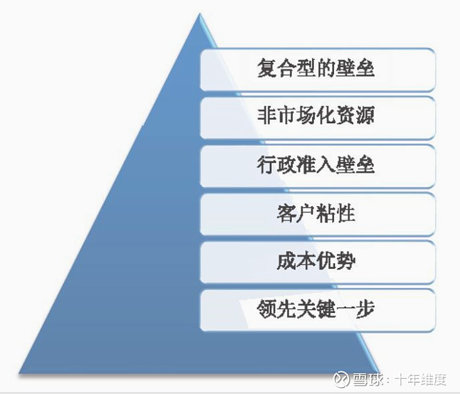

# 第7章　让视角回归本质

> 作为投资者，理解基本的价值内涵和价值创造的评估指标当然是必要的。但仅仅这样是否足够呢？基本的概念和理论知识，每一个金融或者财务专业毕业的学生都经过了充分的学习，但显然不是每一个人都能够成为合格的投资者。其中的一个原因就在于，**将广泛流传的可轻易复制的硬知识转化为一种有效的判断力并不那么简单**。这种判断力需要我们从市场、商业和投资更本质的角度来看待问题。
>
> 什么是它们的本质呢？我认为，{++**市场的本质是供需，商业的本质是竞争，投资的本质是前瞻。**++}

## 7.1　透过供需看市场

### 7.1.1　六种供需格局

首先考虑下什么是市场？有买有卖的交易才有“市”，所谓的“有价无市”就是典型的空有报价却无法达成交易。而交易的频次多了、规模大了，自然就形成了较为固定的“场”。所以市场就是个买家和卖家的纽带。买家代表需方，卖家代表供方，两者之间的关系决定了这个市场的交易状态，所以所谓的市场研究最核心就是供需的研究。

> 20世纪80年代，改革开放初期，一批人只是简单地将南方的货品运输到北方就赚了大钱，电脑刚刚兴起时中关村有一批人靠给人组装和批发电脑就捞到了第一桶金。如果从生意的属性来看，它们没有任何的护城河，属于最无技术含量的职业了。但就是这样的生意，在特定的阶段却造就了可观的财富。这种机会的共同之处就在于，**供需的失衡**。比如改革开放初期随着国家对经济管制的放开，老百姓的消费需求迫切需要提升。但另一方面全国的工厂、商店完全无法满足这些需求且存在明显的产能不均衡，这就给那些脑筋灵活的小商人提供了巨大的商机。

了解一个企业的未来，不首先从“供需”层面入手去搞清它的市场将面临什么状况，是很难建立起完整的认知的。供需当中，**需求就是蛋糕将维持在多大的测量，供给则决定了蛋糕被分享的结构**。显然，当发现蛋糕可能越来越大，分享者却可能长期减少的行业时，很可能就挖到了一个投资的富矿。其中，需求的**有效期**、**确定性**、**刚性**、**弹性**等变量因素的考察是重点。基本上供需关系的格局有以下六种：

| 供需格局类别             | 不同类别的说明                                                                                                                                                                                                                                                                                                                                                                                                                                                             |
| ------------------------ | -------------------------------------------------------------------------------------------------------------------------------------------------------------------------------------------------------------------------------------------------------------------------------------------------------------------------------------------------------------------------------------------------------------------------------------------------------------------------- |
| **需求扩长，供应也扩张** | 这种态势往往发生在一些刚刚催生的新兴行业，也是市场最喜欢热捧的类别，比如新能源领域或者互联网初期的状况。通常这种格局是故事最多、行情最热闹的，但是其中的不确定性极大而行业普遍享有高溢价。巴菲特所说的“退潮后没有泳裤的“大多来自这种情况                                                                                                                                                                                                                                   |
| 需求扩张，供应稳定或减少 | 这种态势可谓是黄金格局。这样的行业特别需要关汪两点，**一是**行业的这种需求扩张有多持久?是否有较为长期的态势? **二是**供应减少的主要原因是什么?一般而言，如果是进入的门槛(无论是资金、技术还是政策上的)极大的提高且这一进程不可逆，那么就真的值得好好多看一下了。比如**医药行业**很有形成这种态势的潜力，但前提是药监部门的门槛要大大提高，且医疗体制改革能真够“改变”以药养医、以回扣定处方” 这两大顽疾                                                                     |
| 需求稳定，供应明显减少   | 这往往发生在一些成熟期的行业，多年的惨烈竞争已经杀灭了大多数的市场参与者而逐渐呈现出寡头垄断格局，比如一些食品或者家电制造领域。这种行业往往容易受到市场的低估，因为其表象的行业增速很小。但实际上寡头在这一时期的盈利能力却反而可能提升。如果优先者相对于市场整体的份额还较小，这种被忽视的状况很可能成为优质的投资机会                                                                                                                                                   |
| 需求稳定，供应稳定       | 一般这种行业属于需求非常广阔，但是由于进入的壁垒也非常低，所以不可能产生垄助性的行业。比如餐饮、理发店、普通服装鞋帽等。这种行业最要命的就是进入的壁垒实在过低；无论是经历多少个经济波动周期，依然无法足够有效地使供给大幅度下降。在这样的行业中，关注的重点是那些拥有鲜明的差异化定位，且具有某种新的商业模式从而克服了定位同质化、难以待续扩张弊端的对象。比如日本的优衣库、美国的星巴克咖啡、国内的海底捞等，又比如苏宁、国美的出现逐渐取代了传统的分散式的家电销售格局 |
| 需求稳定，供应明显增加   | 显然这种格局并不大有利于企业的发挥，供应的增加和需求的稳定会让市场的竞争度明显增强。如果这种态势是从过去的“需求增长，供应稳定”所转化而来，那么往往标志着从卖方市场向买方市场的转变。比如烟台万华的MDI产品，其产能从2000年的4万吨/年扩至2012年的10万吨1年，竞争对手也相应扩张了产能。这就导致整个MDI市场从六七年前的严重供不应求转变为供略大了求。对于这种情况，最值得关注的是新需求被开拓的潜力有多大，二是是否可以通过市场竞争而逐步将竞争对手挤出市场。                  |
| 需求减少，供应减少       | 这是个不太妙的信号，供应的减少看似可以降低竞争的压力，但这种减少并不是以其中某个企业的大获成功将同行挤出了市场来实现的，而往往来自于需求层面的大幅萎缩已经无法保障其中的企业获得最低程度的生存需要，更不用说吸引新的竞争者进入了。这属于真正的产业落日，比如缝纫机、自行车、卡拉OK、收音机等曾经风光一时，但只属于某个特定时段的阶段性需求或者完全可以被其他产品所替代的功能                                                                                               |

_值得提醒的是，我们上述所谈的供需一定要站在一个**长期的角度**，至少是5年的前景来评估，而不应该以一两年甚至更短时间内的行业景气度来判断。在我看来，**对于供需结构的长期理解属于能力圈验证的第一关。如果无法对一个行业的长期供需态势及其背后的原因产生清晰的认识，很难想象能称之为在能力圈内。**_

### 7.1.2　典型问题和误解

在企业面临的供需格局中经常碰到两种截然不同的格局。

（1）一种是面对着一个现实的巨大需求，但似乎这个市场过于分散化。

（2）另一种则是似乎在一个行业中占据了明显的竞争优势，具有压倒性的市场占有率，但问题是这个行业的需求到底有多大似乎并不清晰。

**前者**一般出现在传统行业比如装修、百货零售、品牌服装或者食品饮料等，**后者**以一些细分市场的科技型企业为多，比如行业应用软件、特殊化工材料等方面。

这两种局面下要想做大的企业其实都需要**创新**，但对于前者我认为更需要关注的是经营模式和特色上的创新，在传统行业中最具有杀伤力的往往是新型商业模式的出现而这种模式又可以有效克服“做不大”的行业共通问题。比如**金螳螂**在装修项目管理的标准化、人才培养的梯队体系、通过工厂模块化降低现场施工时间和材料耗费等方面的努力，都正好切中这个行业一直以来无法做大的弊病。

另外这种格局中的企业生态，可能是有多个各自稳固占据一方的诸侯共存局面（因为各自都在某一特定细分领域或者特色领域占有强大的品牌认知而不易被颠覆）。那么如果想在这样的环境中诞生一个大市值企业，必然要通过兼并收购这个重要手段。典型的比如广告业或者食品香料行业，由于客户粘度极高且差异化程度很大，所以在这种大行业中寻找真的可以“长大”的公司，就需要思考谁更具有这种整合力，谁更具有整合行业的行政资源和资本实力是比较重要的。

与之相对的“大市场占有率，需求潜力却较为模糊”的，则更需要关注教育市场扩大需求，以及通过不断开发新的产品和服务挖掘客户需求的能力。典型的像安琪酵母，市场占有率极高，同档次的竞争对手很少，但一直面临着为酵母产品拓宽应用面、打破天花板的课题。

又比如北新建材的新型石膏板，相对于大量小企业来说竞争已经不是最主要的问题，最大的课题也是如何不断扩大石膏板的市场应用面。对于这类公司，就特别需要关注它们通过什么策略来拓展挖掘需求？实现替代或者更新的驱动因素在哪里？对这些问题有没有明确的战略和有效地推进？

在{==**供需格局分析中，要特别小心一些被催肥的需求，这种情况往往来自政府主导的某些“经济运动”。在催肥过程中虽然可以创造耀眼的经济效益，但这种催肥的不可持续性也决定了企业业绩的脆弱性，一旦政策“断奶”，往往是触目惊心的大滑坡。**==}前几年的太阳能行业就是如此。这种情况在自由市场环境下也会发生，一些需求的迅猛扩张可能是时代的某种红利，看看身边的例子高端白酒将近10年的连续提价还供不应求，商品房开盘前居然需要彻夜排队、买号，甚至要走关系购房，这些真的正常吗？这是历史的常态还是具有某种鲜明的时代特征？存在的当然是“有理由”的，但未必是“合理”的。具有这种特征的“供需失衡”需要慎重考虑其可持续性，以及可能的“回归”对企业盈利和市场估值造成的影响。

除此以外还要当心把“需要”误解为“市场需求”的问题。“需要”是一种欲望，而“市场需求”却是“需要＋消费能力”。这几年房地产商和一些学者创造出来的所谓**“刚需”**就是一个典型的营销概念。每一个人都有住房的需要，但不是每一个人都具有相应的支付和消费能力。当房价越来越脱离了普通人消费能力的时候，再强烈的需要也无法变为购买行为。

有些时候，投资者也容易产生将社会需求与企业存亡简单挂钩的倾向。比如很多人喜欢说“这是一个xx年内都不可能消失的行业，因此其龙头企业必然……”，然而事实真的是这样吗？电视机依然没有消失，但长虹却早已是过眼云烟。通信将始终是人类的重大需求，但BP机和摩托罗拉已经退出历史舞合。**某种社会的需求也许确实将是长期存在甚至加剧的，但这种需求的表现形式却可能出现翻天覆地的变化。**企业融资的需求也许在未来100年都会生机勃勃，但这个业务却未必只能靠银行贷款这个传统渠道来满足，互联网平台商（如阿里巴巴）在小微企业贷款上的优越性已经初现萌芽。

所以需求与当前看来某个代名词式的企业之间可不能草率地画等号，需要对需求的本质以及供应方业务的特征及竞争环境的微妙变化保持持续的关注。

如果说企业的成长壮大是一座高耸入云的商业大厦，那么市场需求就是这座大厦得以建立和稳固的大地。研究清楚这片土壤具有多高的承载力、是否足够坚实、是否在广阔的表面下具有脆弱的隐息，可能是每一个投资者进行企业研究时最基础也最首要的工作。

## 7.2　商业竞争定生死

虽然供需关系很重要，但光研究市场供需是远远不够的。**如果说供需关系是一个生意的开头那么{++商业竞争++}才决定了这个故事的结尾。很多遭受重大失败的投资，其实都是猜到了开头却没猜到结尾。**

即便是在一个需求快速扩张，供应明显减少的市场格局中也未必就能成就真正的业绩结果。因为市场格局本身也是不稳定的，现阶段的市场格局能否巩固甚至进一步强化，取决于第二个研究要素’竞争”。站在企业所有者的角度来看，竞争可谓是万恶之源。芒格说过：1911年纽约股票交易所50只最重要的股票中，现在只有通用电气一只尚存。这就说明竞争的摧毁力何其强大。从历史的长远角度看，企业要按照其所有者希望的那样无限存活下去，可能性极小。”

竞争之所以不可避免的根本原因在于，社会资金的逐利性将驱使其进入一切有利可图的领域，任何一个崭露头角的高利润商业机会一出现都将很快吸引资金的注意力。这个时候，如果后进者很快复制起先发者的一切，而行业内大家都高度雷同，则整个行业将面临投资收益的极大下滑，虽然这可能反而会促进社会效益的大幅度提升。

企业只要存在一天，从绝对意义上而言就难以逃脱竞争的“地球引力”。但聪明或者伟大的企业，就能够获得相对的竞争优势并将其不断巩固。所以，商业的本质就在于“竞争”，换句话说商业世界的自然法则就是以竞争为代表的优胜劣汰。

> 《中国好声音》虽然短期内靠着节目的火爆和话题撬动了供需格局缺口并成功捧红一批选手。但这些暂时的成功到底能否持续，或者这些走红选手能走多远却还有很大的疑问。这是因为商业竞争依然在继续。且不说别的选秀节目可能异军突起，就是它第二季的开播本身也会推出更新一批的选手来抢夺有限的注意力和市场需求。说到底，真正决定他们未来成就的不是短期的供需缺口，而是其自身的竟争力。
>
> 又好像前面举过的20世纪80年代商品贸易的淘金热和90年代的中关村装机淘金，确实热闹一时，但也正是由于这种生意确实缺乏壁垒，随着财富效应的出现各路英雄蜂拥而上，这种轻松赚钱的商机也很快就消失了。

### 7.2.1　竞争的烈度差异

竞争从绝对意义上来看是不可避免的完全缺乏竞争的企业未必代表着多高的价值。这种企业要么是某种特定的自然条件所形成的，要么是某种行政管制的产物。前者如两个城市间唯一的高速公路，后者如某区域内行政指定的唯一质量检测机构等。这种垄断首先具有适用领域上的极大局限性，其次行政垄断既带来了排他性往往也带来定价自主权的丧失。

另一方面，即使是寡头垄断，也仅是在一定范围内才可能存在，一旦超出它的优势范围照样可能面临激烈的阻击——比如即使是两地间唯一的高速，也可能面临同线路高铁、飞机的竞争。茅合的高端酒几乎没有竞争对手，但同样是茅台集团推出的中档次酒依然面临各种中档品牌产品的激烈竞争。或者从更大范围来看，全部的白酒也都面临着红酒等替代性酒精饮品的冲击，所以对所谓的“护城河”需要辩证看待。

虽然竞争不可避免，但是不同的竞争烈度却会让企业的生存状况有天壤之别：高烈度的竞争就像拼刺刀，不但惨烈血腥而且经常杀敌一千自损八百。低烈度的竞争却像是隔空对招，虽分高下却不过是点到为止。如果从激烈程度来讲竞争基本分为以下几种类别：

| **竞争的激烈程度** | **基本特征**                                                                                                                                   |
| ------------------ | ---------------------------------------------------------------------------------------------------------------------------------------------- |
| **低烈度**         | 企业具有高度的定价权，市场格局很难被颠覆，企业需要犯巨大的错误才可能导致市场地位的下滑，客户对市场中的企业有极强的差异化认知                   |
| **中等烈度**       | 价格竞争虽然存在但不是主要因素，市场份额会发生变化但又未到那种随时洗牌的程度，企业需要兢兢业业不能犯大错，客户已经对不同的企业产生了明显的偏好 |
| **高烈度**         | 激烈的价格战，市场变化节奏很快，形式随时发生颠覆性的变化，企业的任何一个微小失误都可能造成不可挽回的损失，客户对各个企业的选择随意且多变       |

低烈度有的来自于竞争已经尘埃落定，进入了所谓的寡头垄断，或者至少是少数几个龙头之间的均衡状态。

> 一份来自麦肯锡的研究资料（麦肯锡员工论文，2005年7月）表明，仅有两个竞争者的行业可以避免破坏性竞争；有6个或6个以上竞争者的行业破坏性是前者的两倍；有3～5个竟争者的行业可能是以上两种结果之一。

当然，这个研究可能更多是对几个强大竞争者之间的状况的统计。如果一个市场中除了几个强者之外还有大量的弱小竞争者，那么这些弱小者恰好将成为强者继续成长的食物。另一种竞争的低烈度不是由寡头垄断导致致的，市场可能非常分散，但是如果这个**市场的需求差异化程度非常高**，各个供应商的产品或服务不具有价格、标准上的可比性时，这种竞争可能也是低烈度的。典型的如国内的电气检测机构，各自服务领域有差异，又具有地域上的限制性（电气厂家倾向于选择就近的机构进行检测，可以降低成本），所以虽然**集中度很低**，但各自却都活得挺滋润。

**高烈度的竞争往往发生在同质化严重，市场更新节奏很快，并且最终格局可能是赢家通吃的行业。**互联网无疑是这种情况的代表，近几年京东、淘宝、苏宁易购间的生死时速般的厮杀，团购网站的激烈火拼都是这种状况的写照。另一个让我印象深刻的是三一重工和中联重科之间的争斗，甚至已经进入间谍案和诉讼指控层面，竞争烈度之高让人可想而知。除此之外，消费电子行业、工程建筑行业等都属于此类高烈度竞争的情况。

**中等烈度的竞争介于上述两者之间，既不像低烈度竞争那样逍遥自在，又不像高烈度竞争一样需要生死相搏。**由于市场已经形成少数几个强大的龙头企业，对于价格形成了某种默契，一般情况下不进行主动性的攻击，因为这对全体成员都不是好事情，最终获益的只是消费者。同时这种情况也往往是因为消费者的可选余地不大，企业具备了一定的差异化。比如美的、格力、海尔之间，竞争虽是针锋相对的但并不时刻剑拔弩张，价格战也打，但又并不是竞争的决定性因素。

竞争的烈度对于我们的投资决策的重要性显而易见，也与DCF三要素中的第一要素一 **"企业的经营存续期评估"** 紧密相关，毕竟将很大一部分的资金都投入到高烈度、企业前景莫测、最终的竞争格局非常不确定的对象上像是种赌博。但问题又没有那么简单。虽然低烈度竞争企业的生存环境优越，但最需要考虑的是能否把生意做大或者这个生意还有多大的增长弹性的问题。这种环境中的企业往往已经是某个行业的巨无霸，竞争对手目前找不到，但它自己的业务天花板也近在眼前。又或者竞争烈度低是因为市场需求的差异化程度太高，如果没有企业能完成对产业的收购兼并，它也只能缩在自己的小天地里。

高烈度的竞争也未必一定要退避三舍。比如软件行业、电子商务和互联网的竞争往往是高烈度的，但也应看到这些行业同样处于爆炸性的增长中。关键是这个行业是否容易产生差异化的竞争优势，以及哪些企业能够构建出这种优势。成功建立起强大优势的企业可以从高烈度的竞争中脱颖而出，既享受到行业快速增长的盛宴，又通过击败对手获取广阔的市场份额，成为最大的赢家（比如从过去的家电连锁高度竞争中胜出的苏宁电器），这种企业往往成为带来丰厚回报的大牛股，无论是百度、腾讯还是苏宁、格力，其实都是典型的例子。而且用发展的眼光来看，高烈度的竞争往往也会随着市场格局的尘埃落定而逐渐转入中等烈度，甚至是低烈度状态。

### 7.2.2　不同类别的护城河

竞争的烈度只是为投资的确定性提供了一个角度，关键还是搞清楚这个行业竞争胜出的核心要素是什么，以及哪个企业已经显示出了这种强大的竞争优势。我认为竞争优势主要集中在以下几类：

| 竞争优势的类别 | 主要表现形式                                                                       | 存在形式   |
| -------------- | ---------------------------------------------------------------------------------- | ---------- |
| 成本优势       | 高额的历史投入、超大规模导致的低单位成本、区域经济性、创新商业模式带来成本结构变化 | 以有形为主 |
| 非市场化资源   | 独占的资源禀赋、难以复制的地理位置、 独特的客户关系或股权结构                      | 以有形为主 |
| 客户粘性       | 高品牌认知度、高转换成本、强网络聚集效应、 高业务嵌入性                            | 以无形为主 |
| 行政准入壁垒   | 某些业务的许可证、受保护的知识产权及专利权                                         | 以无形为主 |
| 领先关键一步   | 相较同业的高效经营、商业模式创新、关键业务的know-how                               | 以无形为主 |

**成本优势类竞争**主要是以有形资产的方式获得的。比如一些制造业高额的历史投入和极大的产量及市场占有率，使得产品的单位成本较低而获得优势，典型的如格力电器的空调制造和双汇发展的肉制品，只有在极大的规模下，才能支撑这么低毛利的产品每天在央视黄金时段做广告。双汇1年高达14亿的销售成本可以支撑这种级别的营销，这些费用也不过只占其销售额的3％左右，换了另一个小肉制品厂，这种营销方式是想也不敢想的。{++**规模优势的关键不是企业的绝对规模多大，而是相对竞争对手大多少，以及这种领先能造成成本上的多大优势。**++}

**区域经济性**是指一些商品因运输不便、不经济导致无法建立集中的超大规模生产中心，而必须在各个地区建立独立生产营销基地，由于每个地区的市场有限只能支撑少数几个大规模企业的产能，这些企业将在每一个地区建立起自己的成本优势（相对当地小企业和跨境的企业），典型的如有运输半径限制的水泥企业（海螺水泥）。

**商业模式的创新**往往带来一种崭新的成本优势。历史经验表明，{++**在那些传统行业中，能够通过商业模式的创新而成为“成本杀手”的企业往往非常可怕。**++}相对以往的百货商店，超市和家电连锁大卖场的出现使得百货业不再具有上述业务领域的经济性。以一些传统的制造业为中心的企业，通过制造外包而将更多的注意力聚焦在产品研发、品牌营销两方面，也使得企业的成本结构发生了巨大的变化。戴尔和优衣库都是这种模式的成功案例。

**非市场化资源**是最明显的一种壁垒，如盐湖钾肥和贵州茅台对稀缺资源的占有和大秦铁路难以复制的铁路运输线资源，都是一目了然的’拿钱买也买不来”的非市场化资源。除此以外，一些公司**独特的股权结构**或者**客户关系**是一种不明显的非市场化资源。前者如电科院的中检集团的二股东地位，置信电气的国网控股地位，它们不但自身在行业中有垄断的特殊身份同时又对两者在业务发展上具有举足轻重的地位，这种股权形式的整合并不是简单的投资收益而是业务的战略整合，同样具有非市场化可获得的特征。

**客户粘性**是一种极其重要的竞争优势，能够获得这种优势的行业往往是高度差异化的，如软件、医药或者化妆品等。一些企业通过建立鲜明而强大的品牌和感官熟悉度获得客户认可，比如可口可乐、贵州茅台、高档化妆品。还有一些企业通过业务上的学习成本高，或者转换过于麻烦而建立起客户粘性，如客户不愿意重新学习新的复杂办公软件和操作系统，重新更换银行账户、使用多年的手机号或者电子邮件等。网络效应属于一个自我强化的资源网，一旦进入这个网络就成为其中的资源之一并吸引更多的人进入，从而形成循环。典型的像大众点评网、QQ（兼具高转换成本和网络效应）、百度知道等。

> **军火生意**是对“粘性”这个词的有力解释。这门生意不完全是纯粹技术或者消费方面的竞争，而是融合了政治因素、后勤保障体系、历史习惯、技术路线等多种因素。某个独立的装备再优秀可能也没办法采购，因为考虑到历史装备体系的标准不一致，单独买来一个新体系装备可能要花10倍的资金去重新建立全套保障，还要融入到不同标准下的指挥作战体系里。随着新一代武器装备越来越昂贵技术门槛也越来越高，已经发展到在研发阶段就大家一起出资去搞（比如美国的f35项目，以及欧洲的欧洲联合战斗机项目），这样完全相绑在一起后谁想变都很困难。所以除非是考虑到某些重大的政治因素，否则上了贼船再想下来的决心一般不容易下，哪怕另一个单件装备的技术更优、价格更好。

还有一种企业通过**将自己的业务与客户的业务结成紧密的合作关系，从而使得客户非常难寻找到新的替代者**。比如百润股份的食品香精业务，虽然占饼干、饮料等客户产品的成本极低但起到的味觉效果非常关键，往往需要在某款食品开发之初就由双方共同协作研发，这种业务的粘性可想而知。同样的例子来自IBM的it咨询，每一个项目的实施都需要与客户组建实施团队，梳理复杂的业务细节，这样客户再次系统升级的时候更倾向于找已经相互很了解的合作。

**行政准入壁垒**也是一种明显的壁垒。公共事业往往都是具有很高的行政审批壁垒。如军工或者石油、电信等国家战略性资源涉及的产业。专利药品、高端制造业等的知识产权也能在一段时间内带来类似的特征，但这需要较为严厉的监管体系和以品质决定份额的市场机制作为前提保证。与非市场化资源相比，行政准入壁垒大多来自于自上向下赋予的某种特殊权利，而非市场化资源则来自于先天占有的资源。前者可能被剥夺或者放宽，而后者具有更高的自主性。

**领先关键一步**严格意义上并不算是真正的竞争优势，更谈不上多高的壁垒。因为先进的经营模式是可以模仿的一些特殊工艺或者制造技术、复杂工程的know-how（主要指经验和诀窍）也是可以被学习传播的。但如果这一步的领先恰好满足两个条件：第一，行业已经开始爆炸性增长；第二，领先的这一步恰好可以极好地捕捉到这种快速增长的契机，这一步往往就是“制胜一击”了。比如戴尔和丰田的模式当然是可以模仿的，也确实被广泛地学习了，但当年它们却正是凭借新颖的商业模式或者管理优势快速做大。捕捉这种领先带来的机会，需要对行业景气有非常敏锐的洞察力，在我看来确实难度比较高。

> 是否具有竞争优势最终应该可以在财务结果上体现出来。比如我们不能因为双汇30％的ROE水平，以及一些投资资金频频进入养猪或者肉制品等行业来说明整个肉制品或屠宰行业很好赚钱，因为这其实是竞争导致的行业盈利能力不均衡的表现。首先，双汇的盈利水平完全不是行业的平均水平，恰恰相反，高的ROE在其所在行业中并不多见。同为肉制品及屠宰行业的得利斯（连年亏损，净资产收益率长期保持在5％以下）和高金食品（业绩不佳，ROE甚至经常出现负数），这就是竟争的差异。而仔细去看双汇的高ROE，那是建立在低利润率水平和高资产周转率基础上的。设想一下，一个新的进入者如何一边扩大产能（导致高的固定资产投资，以及经常性的高库存），一边极快地将这些资产转化为销售收入呢？这是需要在销售渠道和品牌打造上长期持续的投入，以及高超的管理经验才能做到的。

类似的例子可以看看格力空调，它也曾达到过30％以上的ROE，但据此是否可以说，造空调、卖空调赚钱很容易？如果仔细看看就会发现，格力的高ROE一方面来自寡头垄断格局下的相对定价权保障了利润率（净利润率从2007年的3.4％左右一路上升到2011年的6.3％以上），另一方面来自对产业链下游大量资金的占用而取得的高经营杠杆（资产负债率始终在75％以上，而负债中70％都是应付类款项和预收款）。这两个条件是只要愿意投钱都能做到的吗？是这种低差异化的行业中普遍可以做到的吗？总之，做几箱肉肠并不难，造几台空调也很容易，但把这个数字乘以几百万的时候，还容易吗？那将是极大的规模效益，要求整个经营链条的高水准运营，从生产到营销，从质量一致性到经销渠道的管控，实在不是空有雄心壮志或者舍得扔钱就能做到的。

### 7.2.3　护城河的宽与窄

在上述类别的竞争优势中，显然其护城河效应的强弱程度是不同的。我们可以把更难以被模仿、更难被剥夺、更容易持久、具有更高自主权这几个因素作为衡量护城河宽与窄的关键要素。总体来看，不同类别护城河的宽与窄，可以自上而下排列如下：

**领先关键一步是最容易模仿的**，单纯的成本优势也属于较窄的“护城河”，除非有其他因素让竞争对手无法或者不愿去模仿（比如市场已经基本成熟，集中度太高等）否则厉害的竞争对手依然可以模仿甚至做得更好来翻盘。非市场化资源和行政准入壁垒自然好，它们都基本不是竞争对手有主观愿望和决心就可以模仿的，但也需考虑这种“独特性”给企业留了多大的发展空间？特许权和特许资源的获得，不能以丧失重要的经营自主权（比如定价能力、自主扩张或者经营的能力）为代价，也不能仅仅是稀有却难以获得足够的规模扩张, 否则这种独占可能并不能带来足够的回报。

显然，最强的竞争优势是多种因素复合的壁垒。比如电科院既具有进入检测行业的牌照壁垒，“一站式”服务平台的特性使其又具有很好的客户粘性，“独立第三方”的独特市场定位使其在市场竞争中相对竞争对手易获得更高的信任度，位于电器设备制造业重镇的华东区使得其对周边客户形成了区域经济性，民营体制的灵活性让其获取高素质人力资源具有优势，同时独特的股东结构带来的可扩张性又是一种非市场化的资源。这就使得其业务发展具有了更强的保障。

需要注意的是，上述竞争优势的高下之分是泛泛而言，主要根据是竞争对手通过主观愿望来复制的难度。但具体到商业价值上则复杂得多。通过自由市场竞争建立起高度客户粘性的公司，往往要比一个背靠着行政垄断或者资源垄断赚钱的公司有价值得多。巴菲特提到的“特许经营权”，以我的理解主要来自于客户粘性（可口可乐、IBM、华盛顿邮报），行政准入壁垒（中石油）和非市场化资源（伯林顿北方铁路）。

总之，护城河是企业商业价值的一个要素，但其并不等同于商业价值。而商业价值又只是投资价值中的一个要素。那种将护城河强度直接等同于投资价值的看法，将会不断付出代价。

### 7.2.4　行业和个股哪个优先

在投资中经常有一个争论，企业研究到底是该“自上而下”还是“自下而上”？前者代表了先看行业发展前景再在其中选择优质企业，而后者是更多关注企业自身的素质和优势而不太关注行业增长快慢等问题。在我看来，这种争论的产生是因为总有人喜欢把事情推导到极致以至于偏激化了。

{==

**"自上而下”**是对的，因为没有任何一个企业是生存在真空中的，一个行业的基本生意特性和长期增长前景、供需格局当然会对企业的未来产生重要的影响；**“自下而上”**也是对的，因为再快、再有前景的行业也会有大量的失败者，缓慢而不被追捧的行业中的优秀企业照样可以创造巨大的价值。错的是极端化，“自上而下”变成追逐行业热点，“自下而上”成了目光短浅。

==}

实际上对于这点在波顿的《竞争战略》中早已开宗明义地谈到过：**“竞争战略的选择由两个中心问题构成。第一个问题是由产业长期盈利能力及其影响因素所决定的产业吸引力。并非所有产业都提供均等的持续盈利机会，产业固有的盈利能力是决定该产业中某个企业盈利能力的一个必不可少的要素。第二个中心问题是决定产业内相对竞争地位的因素。在大多数产业中，不论其产业平均盈利能力如何，总有一些企业比其他企业获利更多。”**

如果说“自上而下”的供需格局的分析是思考蛋糕最终能做多大以及将有几个人来分的话，那么“自下而上”的竞争格局和优势分析就是搞清楚这个公司凭什么吃到、能吃到多大的一份。所以，不用对某个名词教条的理解，更综合地看待这个问题可能才是明智的。

## 7.3　前瞻把握未来

市场供需以及商业竞争是一种客观现象，但想要准确的判断却非常困难。困难的关键在于投资的判断都是关于未来，所以投资的本质其实也是对未来的前瞻。这既是投资最困难的地方，也是投资的魅力所在。

> 继续引用前面《中国好声音》的例子。这个2012年大红大紫的节目在制作之初却并不被看好，节目冠名权的销售迟迟没有进展，其中某国际大企业下的商业评估团队一通精心计算后觉得节目没戏放弃。而加多宝却经过与节目组一顿饭的沟通时间就敲定了合作。

当然，一个案例具有很大的偶然性和随机性。但这种现象放在证券市场中却并不鲜见。

> 1992年，做房地产的万科的营业收入不过6.6亿元（还是集团收入），苏宁电器2001年的销售收入也就是16亿元多。而今天，做小小纽扣和拉链的伟星股份差不多也要有18亿元的收入了，万科和苏宁的销售额更是突破了1000亿元。

可见，如果不具有对其商业前景的超前认识和前瞻性，怎么可能把握住这种投资机会呢？

> 我们再看看巴菲特的例子，以其最为著名、为其赚得最多账面利润，同时也是在其持仓中长期处于第一重仓的可口可乐为例：1988年时，巴菲特以14.5倍的PE、5倍的PB买入（当年每股收益是0.36美元，买入均价5.22美元、每股净值是1.07元），如果纯粹从格雷厄姆的角度衡量，不但不便宜甚至可以说很贵了。要知道，当时美国的国债利率就有10％左右，而可口可乐的股价在过去几年已经上涨了4倍，且市盈率相比市场平均水平要高出30％左右。这个估值水平即使在今天的A股也并不便宜了（2012年年11月全部A股的平均市盈率只有10倍出头，市净率不到2倍）。如果不是对其前景具有很大的信心，不是前瞻到了其潜在的巨大商业价值，巴菲特的这个经典之作显然不可能上演。

这样说，也许有人认为“前瞻”仅适用于发掘具有广阔发展前景的伟大公司，但这并非事实的全部。就算是最典型的“捡烟蒂”式投资，难道其本质不是前瞻吗？正是前瞻性地认识到了当前极度低迷的情况已经不可持续，认识到了市场的极度恐惧已经掩盖了其未来可能的改善前景或者低于了其安全资产的现值，所以才具有投资价值。所以我认为逆向的本质实际上还是提前认识到事物某种回复性的规律或者是某种未被当前市场察觉的、必然的发展方向。

一份资产能够仅仅因为大家都在抛售就去买入吗？不能。投资者必须分析认识到了这种抛售已经超越了其价值，光这样还不行，还必须确定这种价值未来大概率地能够回归。{++**所以，这时的所谓逆大众而行动的表象下其实是在大众的恐慌迷乱中提前认识到了其价值运动的未来轨迹。如果仅仅强调逆向，则就很容易掉入“为了逆向而逆向”的极端。**++}只要“足够逆向”就一定能胜出吗？香港股市上有大量无人问津的低价股，如果我们抱着”没人要所以我要”的心态去就可能踩上一堆老千股。

让我们看看被公认为逆向投资大师的邓普顿是怎样做的。《邓普顿教你逆向投资》一书中写道：在某种意义上可以说，约翰（邓普顿）对未来有种特别的偏好，因为他能够把重心放在长远的前景上，而对当前流行的观点不予理睬。这种专注于未来可能出现的事件，而不是根据当前事件采取行动的能力。正是成功投资者和平庸投资者之间一道清晰的分水岭。

> 1939年的美国股市正笼革在第二次世界大战的阴云下。美国的经济复苏遭到市场质疑，投资者认为美国将进入衰退而纳粹即将摧毁现代文明。美国和欧洲的股市在短短12个月内下跌了49％。而邓普顿却在冷静的观察局势，他认为美国也将被抱入战争。进而他得出结论：美国的工业企业将会因此受到大力推动，即使是最普通而无效率的企业都将从即将到来的大生产中获得极大的收益。这些判断并非灵光一现，而是来自于他对第一次世界大战中局势的发展和战时美国经济的历史研究。根据这个判断，他向前任老板借款1万美元用以购买美国两市交易的所有1美元以下的股票。最后事实印证了他的判断。美国卷入战争，而各种工业材料和物资的需求激增。由于这笔成功的投资，1年之内他的借款就还清了，随后的几年他的投资翻了3倍。

从这个案例可以清楚地看到，作为公认的逆向投资大师的邓普顿的思维方式。惨烈的价格下跌只是引起他关注的原因，但真正支持他下决策的关键则是前瞻性地认识到了未来大概率会发生的转折。如果说作为整体的局势判断证明了他的前瞻性思维的话，那么其中一只股票的选择就更让人叫绝。

> 密苏里太平洋铁路公司是他这次行动的持仓之一，并且以3900％的惊人收益被称领。但当时摆在邓普顿面前的并不只有1家铁路公司可供选择，为什么恰好要选择这家几乎是当时业绩最差的濒临破产的密苏里太平洋铁路呢？一方面在于邓普顿之前“哪怕是最差的公司也将受益”的基本判断，但更重要的是根据细致的历史研究，**他发现平时效益良好的企业在战时可能会被政府课以高达85.5％的税收。**
>
> 因此，像当时业绩很好（该公司50年来从未亏损过）且价格便宜（同样受到大市一个月内暴跌49％的负面影响）的诺福克一西方铁路公司被他排除在买入的清单之外，最后事实果然如此！这种惊人的洞察力甚至已经不仅仅局限在商业前景的判断上了，其政治判断之老练更让人印象深刻，并且进一步证明逆向投资的内核依然在于前瞻性。

由这些案例也可以更好地理解，为什么芒格这位当今最具智慧的投资家认为，对于投资者而言更重要的知识往往来自于对历史和哲学的学习，而不是金融专业课堂上的那些课本知识和专业理论。简而言之，便宜货猎手必须付出极大的努力去判断一个企业相对其竞争对手所具有的竟争优势。

> **在《邓普顿教你逆向投资》的最后部分，这位便宜货猎手发出如下忠告：“现在以长远眼光选择股票比以往任何时候都更加有利。过去，他主张以未来5年的每股收益作为基础计算市盈率，但到了2004年后期，他又强烈建议将估算的时间延长到10年……因此，如果要预测一个公司长达10年的前景，便宜货猎手就不得不仔细思考这个公司在市场上的竟争地位。**

显然，即使在最伟大的逆向投资者和便宜货猎手看来，价格便宜也只是投资的一个必要条件，而保持“向前看的习惯”和注重“竞争的影响”才是更加本质的决策因素。虽然从投资这个游戏的根本特点来看，概率才是最本质性的特征，但企业投资毕竟不是玩彩票，提高胜率的关键还是靠前瞻性的把握价值所在。{==**特别对于“长期持有型投资”模式，我认为前瞻性和洞察力是安全边际的最重要因素，没有之一。因为在长时间跨度下错误可以毁灭一切。不具有这种前瞻力，当然也可以做投资，但不要去“长期持有”。**==}任何原则都是有边界条件的，不在一个边界条件谈原则往往是僵化教条的。

**当然，我无意无限夸大前瞻性这个词汇的意义。投资这个世界里的规则就是这么有趣，很多东西都有道理，但如果你将这个道理推导到一个极致，或者以一个道理去排斥其他的道理，你会发现这个原本有道理的东西会慢慢地将你推入绝境。**

简单讲，投资者要做的就是**“前瞻未来，活在当下”**——既要努力看清未来发展的轨迹，又要耐得住寂寞、沉得住气，{++**不为仅仅是可能性的美妙未来提前支付昂贵的入场券**++}。
企业的基本面分析必须同时发散到3个视角，**即“市场的本质、商业的本质和投资的本质”**。只推崇其中的任何一个而忽略其他，都会为投资分析带来潜在的风险。**从市场的本质{==”供需“==}来理解一个行业长期的发展态势和最终的格局，从商业的本质{==“竞争”==}来理解这个行业的根本决胜要素以及产生差异化竞争优势的能力，再从投资的本质{==“前瞻“==}来衡量市场对他们的认知和预期是否产生了足够吸引力的偏离度，这三者环环相扣，才有利于我们用全面的视角来审视投资机会。**
