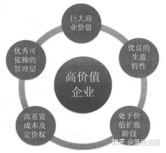

# 第8章　高价值企业的奥秘

> 在我们谈高价值企业的时候，不妨先想想糟糕的企业是怎样的？我想大体是包含了这些特点：市场需求萎靡而供应严重过剩，企业的经营需要大量的投资和资本性支出，根本无法从正常经营中获得足够的自由现金流，毫无竞争优势可言只能靠惨烈的价格战苟延残喘，经营者不但能力低下甚至还毫无信誉、欺作成性、财务漏洞百出、脆弱不堪等。
>
> 这种逆向的思考实际上已经为高价值企业提供了简洁的推导，我们可以反向凝结为几个要素：
>
> 
>
> 这五个高价值的衡量因素具有内在逻辑上的联系：
>
> * 商业价值是一个企业得以存在和发展的基本前提和墓础。如果说企业的经营和发展需要脚踏实地的话，那么商业价值就是衡量它所站立的土地到底有多广阔和坚实。
> * 生意特性主要突出的是这个企业的生意能在多大程度上符合DCF三要素。是否具有较好的资本收益水平，以及是否存在业务上过于脆弱或者难以持续成功的硬伤？
> * 如果说第一点突出的是这个生意的“总量”，第二点突出的是其盈利的“质量”，那么价值扩张阶段就是强调它实现这个量的“效率”。
> * 重置成本和定价权代表了这种增长和扩张具有多高的确定性，企业是否有办法避免竟争对手的模仿和破坏，从而为其商业价值建立起强大护城河？
> * 管理层因素强调企业有无将“优势”转化为最终的“胜势”的素质，以及对于这笔投资可以予以多大的笠信空间。
>
> 上述原则中如果说第一条和第二条属于这个生意从娘胎里带出来的“先天因素”，那么第三条至五条则更像是靠不断实践和在竞争中锻造得来的“后天因素”。至于先天与后台之间谁更重要？幸好没有一把枪顶在我们的脑门上威胁只能选择一个，所以何不两全其美呢？

## 8.1　巨大的商业价值

在以前的高价值企业探讨中，我曾经将“难以被重置”作为首要条件，但之后的观察和思考使我对此作出了修正。护城河当然是极其重要的，但护城河到底是目的还是手段呢？{++**在我看来所谓护城河是手段而不是目的，目的是经营的超额收益。**++}巴菲特曾将投资形容为在一个长长和湿滑的雪道上滚雪球的游戏，那么超额收益其实既取决于滚雪球的相对能力（企业竞争优势），更取决于雪道是否湿滑（是否容易差异化）和长短（优势复制扩大的空间）——竞争优势是可以锻造的，但行业的发展空间和行业基本特性却是无法通过主观努力改变的。**为什么很多“公认伟大“的企业往往成为投资陷阱？就是因为忽略了“价值创造的大坐标”而盲目歌颂“护城河”**。

我们都知道固定资产有折旧无形资产也有摊销。那么“护城河”有没有折旧和摊销呢？其实也是有的，虽然它不在会计科目上直接反应，但却会在价值创造力上得以体现。任何优势自有其边际，无论是业务领域的局限还是经营要素潜力的殆尽，迟早**均值回归**，学会判断企业价值创造的周期和节奏，是以往的书本不太提但非常重要的部分。

护城河是价值的一个关键要素而非充分条件，在某些情况下甚至不是必要条件。举个简单的例子，房地产行业的蓬勃发展诞生了万科、保利、华侨城等长期大牛股，但如果细究起来这些公司都不具备真正的难以模仿、不可复制的竞争壁垒。当然它们各自具有一定的经营特点和较高的经营水准，但决定性的因素其实是房地产行业过去十几年的蓬勃发展，以及当初它们无论在资产规模还是业务布局方面都只处于一个很初期的阶段。与之相比，具有专营权的高速公路、水电站等公共事业往往具有更强大的进入壁垒，一些具独特稀缺地理资源的旅游景区更是不可复制，但价格管制、业务领域的狭窄、缺乏持续增长的潜力等因素却使得这一群体很少出现真正的大市值企业。**所以护城河是保护的作用，商业价值才是真正的城堡——缺乏护城河的城堡固然容易被洗劫一空，但高高的护城河内如果空空如也，又有什么意义呢？**

商业价值是一个挺抽象的词，有人将其理解为具有巨大的社会效益和经济效益，我个人认为不尽然。社会效益和经济效益并不完全等同于投资意义上的商业价值，比如盖一个豪华的体育场馆并且免费向市民开放，这具有很好的社会效益同时也拉动了就业产生了较高的经济效益（建设过程中的采购、就业、赋税，以及未来的出租收益等），但它对投资者就未必具有多大的商业价值。

我个人认为一个业务的商业价值首先需要具有现实或者潜在的巨大社会价值，只有建立在能对人类社会产生积极影响和具有重要意义的基础上，这个业务才有长期成长壮大的根基。但这样还不够，它的这种社会价值还必须能够得以货币化的形式反馈到业务所有者，而不仅是有利于了最终使用者或者参与构建的各利益方。最后，巨大的商业价值还必须反映在其依然处于长期大发展的初中级阶段，业务空间远没有饱和，否则这项业务已经处于收割期而不是投资期。

> 微博诞生所产生的社会意义可以说是划时代的，它构建起了一个全新的社会信息发布和沟通平台。从这一点来说它很好地体现了商业价值的第一个要素。但另一方面，几亿微博用户的海量市场却并没有以同等级的财务结果反映到新浪公司（据媒体报道截至2012年8月的对报微博广告收入只占新浪广告总收入的10％左右，收入只有几千万对报微博广告收入只占新浪广告总收入的10％左右，收入只有几千万美元而年投入却高达1亿美元以上）。它的价值大多数被微博用户和社会取得了，并且还未看到彻底改变这一状况的商业逻辑。如果这种局面不改变，很难说它是具有巨大的商业价值的。

这个特性其实提醒了我们一点：**在不同的社会发展阶段和经济水平阶段，商业价值是处于动态的迁移中和变化中的**。100年前。钢铁制造也许是最具有商业价值的领域，但在今天却普遍地陷入困境。商业价值不是个空中楼阁，它是建立在一定的社会和经济水平之上的——也可以反过来说，看看一个国家最蓬勃的产业是什么，大致就可以知道它处于怎样的社会发展阶段。

在一个连温饱还没解决的社会中，你很难期待娱乐产业创造出什么商业价值。同样，在供不应求和劳动力极其充沛而廉价的时代，满足基本质量水平的大规模制造往往得到更多的回报，但**在供过于求和劳动力越来越昂贵的时代，那些能够真正提升品质形成高附加值产品的企业，以及可以帮助企业更好提升劳动生产率的生意就必然会越来越重要。**所以，商业价值的判断其实首先来自于对社会和经济发展的大视角看待这一问题可能需要相当的历史感，这其实是一个更高素养的锻炼了。

所以对企业商业价值的评估需要具有历史视角。某汽车公司的总裁曾说：“如果当初你去调查消费者需要什么，他们会告诉你要一匹更快的马，而不是汽车。” **现成的数据可以作为佐证、参考、启发，但不是主宰。**{==掌握按钮的是人，而不是数据库。**对于一些研究报告给出的某些行业发展的调查数据，一定不要不假思索地全盘接受或者静态的来看待。要学会用动态和发展的角度思考问题。**==}

另外，近年来一些似是而非的口号需要警惕，比如“第一”和“唯一”。似乎某个企业只要做到了某个领域的第一或者唯一，就是确定无疑的高价值企业。瑞贝卡是假发制品行业的第一，安泰科技曾是国内唯一实现了非晶合金新材料规模化生产的企业，但它们平庸的业绩和极不稳健的经营状况显然与高价值企业不沾边。“第一”和“唯一”虽然显示出竞争上的某种暂时领先，但如果缺乏足够的商业价值，或者竞争优势无法长期牢靠。又或者在生意特性上存在硬伤，那么叫得再好听也别期望它真给投资者带来优秀的回报。

## 8.2　优良的生意特性

### 8.2.1　生意的三六九等

除了商业价值这一因素外，优良的生意特性也是重点关注的对象。以前面提到的万科、保利等房地产企业为例，从历史角度而言它们无疑都曾拥有巨大的商业价值并且也确实带来了很好的回报。但如果我们以DCF三要素以及资产回报率与增长的关系的角度衡量，就会发现地产开发这个生意的特征并不太符合超长期持有（请注意这个前提）的要求。

> 因为这个行业需要持续的大额资本性开支，每年赚来的钱需要持续地投入到买新的地皮、周转新的开工建设等用途上去。从现金流的角度来看它们的生意最终很难在手里存下现金，而无法留存积累现金的生意往往是个击鼓传花的游戏。特别对于房地产行业来说，高负债率是不可避免的。高负债率与经营所得现金需要再次大额投资就会出现一个问题：投错了怎么办？而这恰恰是很难准确判断的，这是因为首先房地产市场在全世界都是个较高波动的市场，这种规律不可能改变。其次，地产市场越景气企业往往越有壮大的冲动，这就导致企业开发完旧项目后再拿地会更贵，上新项目后的存货预估值也会更高。这从本质上使得房地产企业的风险系数始终处于较高的状态。

从运营特点来看，房地产企业的运营周期极其漫长。从决策拿地到开发建设再到销售完成，起码两三年。这就要求企业对于未来的行业要有很精准的预测，预测错了要么太谨慎没拿地赚不到钱，要么浮躁冒进只能期盼老天保佑顺利出货。这种生意模式就决定了，顺风时候（比如过去＋几年的快速发展）诸多杠杆要素都是有利的。逆风时候正相反，诸多要素都会层叠累加，最终对利润表的摧残往往超出预料。而其中最大的引爆因素就是前期拿地开发的规模和价位，其次是资金拆借及周转能力，出现其一则立刻非常难看，两者同时出现则巨无霸也很容易毁于一旦。

巴菲特曾谈过要避免投资“轮子上的生意”，显然也是出于生意特性的角度。**极高的资本投入、始终处于高负债水平、随着经济景气和石油价格变动的行业剧烈波动、很难得到高的ROIC和ROE水平等。**

> 类似的如航空公司，曾经看过几个航空企业的数据，确实感觉很恐怖：第一，固定资产投入极高，投入期也几乎永无止境，负债额度同样保持直线上升和最高限度。光是巨额资产和负债每年的折旧、财务费用，就可以是个天文数字，并且刚性很强；第二，利润波动性极大，上游油价波动全盘接收，下游游客波动紧跟宏观经济，中游竟争高度趋同且呈现越来越激烈态势，最可怕的是规模的扩张和巨额的投入却换不来抵御利润波动的能力；第三，经营模式复杂，涉及昂贵的对飞行员的培训，与机场的协调，航空线路的开辟，票务渠道的开展等，对于管理层的挑战很大。

虽然要在这种行业中寻找优秀的长期投资对象并非不可能（比如确实出现了西南航空、丰田汽车等长期大牛股），但确实更加困难——关于这个问题让我们记住巴菲特的教诲：“我从不试图去翻越7英尺高的跨栏我只是专注于寻找1英尺高的跨栏，然后很轻易地跨过去”。生意模式上具有潜在硬伤的企业当然可以投资，实际上如果对行业景气波谷的捕捉足够敏感这甚至是最能带来暴利的对象，但确实要意识到其难度并且要慎言“长期持有”。

在“揭开价值的面纱”一章中，我们已经讨论过了企业价值的源泉和表现途径。{++**不得不承认，生意或者说行业特征真的是分三六九等的，是天生就不公平的。**++}有些生意就是更容易形成差异化的竞争优势从而提高确定性，它的生意具有更加稳定和持久的需求特征而且行业的更新换代频率很低，又或者总是能够带来饱满的现金流，并且不但能够增长还可以保持优秀的资本回报率，而有些生意无论如何努力也不可能做到这些，或者只能做到某一方面而难以兼顾。所以一个高价值的企业，首先从业务领域来看必须具有巨大的商业价值，其次从生意的特性来看高度符合价值创造原理（DCF三要素、高价值均衡导向）。

### 8.2.2　寻找“印钞机”

我们可以注意到，过去的世界闻名企业诸如通用电气、丰田汽车、沃尔玛、麦当劳等都经过了数＋年甚至上百年的经营才取得全球性的影响力和巨大的营业规模。《财富》杂志也曾统计过世界500强的平均企业寿命长达四五十岁。但近一二十年来，一批企业却以极快的速度成长为无论从营业规模还是影响力都达到世界级的巨头，比如微软、谷歌、亚马逊、Facebook等。而随着电子商务的迅猛发展，即使是最传统的领域也出现了类似的特征比如淘宝和京东商城。这种商业上的奇迹是如何产生的呢这些令人瞩目的时代宠儿背后有没有共同的特点呢？

《浪潮之巅》的作者吴军曾提出过一个“商业印钞机”的概念，指那些拥有近似坐地收钱商业模式的公司。无论是谷歌的广告系统、腾讯的虚拟社区和商品交易，又或者在线游戏的王者魔兽世界，都具有“即使什么都不做，钱依然会源源不断”的印钞机特征。我们可以发现上述传奇企业都或多或少有这样的特点。那么这种优秀的商业模式有什么具体的特征吗？我想，至少具有“一低一高”两个特征：

| 印钞机特征     | 简单介绍                                                                                                                         |
| -------------- | -------------------------------------------------------------------------------------------------------------------------------- |
| 低扩张边际成本 | 每增加一份营收就要增加一个人（或者一套机器设备）的生意不是好生意。能够实现收入规模扩张高于成本增长的模式，才能产生最大的规模效益 |
| 高客户粘性     | 扩张的快和好只是第一步，如果非常容易就被竞争对手模仿和颠覆也无法成就最终的高价值。能够牢牢黏住客户的生意才是好生意               |

#### 1.低扩张边际成本

**扩张的边际成本低**就是“边际利润递增”——销售价格减去边际成本后即为边际利润，边际利润递增表明企业在大幅度的生产规模扩张后，其成本不会跟随销售规模的扩大而同步提升，甚至会急剧下降从而带来高回报。这就要求企业生产过程中的“**刚性成本**（比如各类固定资产折旧）”较低。

从常识来看，重资产类别的企业（总资产中固定资产的占比高）显然扩张起来需要极高的边际成本。一个汽车制造商要想扩大规模首先需要建更大的厂房、买昂贵的装配生产线，销售到哪里工厂就要跟到哪里。所以我们经常看到这样的情况：新车上市消费者热捧，但供货量总是跟不上：等产能完全铺开，热潮可能已经过去了。相反，轻资产的企业规模扩张就不存在这个问题，软件公司生产10万张光盘和100万张的成本并没什么区别。同样是轻资产的软件公司，那些项目型的公司面临不断增加项目经理和技术支持的高成本投入及复杂培训，而标准化的工具软件就没有这样的间题。更高一级的平台型软件企业，连印售光盘的程序都免了，直接通过互联网向客户提供服务，这样既免除了盗版又降低了销售服务成本，并且将一次性的光盘购买转化为了持续性的服务收入，显然不但利润率更高而且业务的稳定性也更佳。

{++**轻资产在两个条件发生的时候更易发挥其威力：第一，企业的市场需求已经大规模启动，当前经营的重点是需要快速的占领市场：第二，企业已经建立起了较为明显的竞争优势。**++}在这种情况下，较低的扩张边际成本有助于公司快速占领市场，其价值实现具有更高的效率。目前来看，这样的特征更容易在科技行业中出现。当然，这种高科技类企业的缺点在于更新速度往往非常快，技术的路线也非常复杂而难以鉴别，所以一般很难长期持有。但它的优点是创新性的供给一旦成功创造或者激活了某种巨大的需求，扩张上极低的边际成本就会产生出十足的爆发力。这样的企业也许确实活不了20年，但它5年产生的爆炸性收益可能就超过了传统企业20年的成就。所以这类企业并非不能投资，只不过会非常考验投资者对行业的认识深度和买入卖出的敏感性。

但轻资产本身只是个资产特征并不代表价值高低，特别是缺乏足够的竞争优势下轻资产的企业远比重资产的企业更加危险和不确定（要打败一个汽车制造商起码要投入以亿计的真金白银，要打败一个软件商可能只需要几个聪明的脑瓜）。**所以轻资产的必要保障是优秀的无形资产**。管理学上讲的所谓“微笑曲线”不就是将最“重”的制造环节外包出去，而重点强化设计研发、品牌营销两方面吗? 巧合的是这两方面都是企业无形资产最集中的部分。【苹果公司就是】

#### 2.高客户粘性

在前文中已经讨论过客户粘性的特点及重要性，客户粘性的可贵之处在于，首先它往往是市场自由竞争的产物。最强大的壁垒往往不是由行政特许或者资源独享得来的，因为那些壁垒阻挡了资本的进入，但那些壁垒能存在多久却不是企业可以自己决定的。而通过自由竞争和资本的优胜劣汰而实现的优势，是真正经过了考验和挑战的优势，在这种情况下如果还难以撼动就非常可贵。客户粘性的关键之处在于，企业通过一系列的办法真正地在客户身上扎了根。

从商业印钞机的角度来看，仅仅是低的扩张边际成本只能决定这个企业成长的快与慢，但却不能确保在其形成一定规模后让客户的钱源源不断地送上门来。企业必须想办法把客户粘在自己的业务里，并且把这种业务上的高客户流量变为现金。

> 百度原本只是一家搜索引擎公司，虽然市场占有率高并且成功实现了广告竞价的高利润率商业模式，但搜索业务本质上是个纯技术竞争的领域，技术竞争节奏快并且客户随时可能流失，这显然不利于其长期前景。但是通过推出百度贴吧、百度音乐这些看似并无多高技术含量的辅助业务，它聪明地借助超女选秀等热潮实现了对大批互联网客户的网罗并增强了用户粘性。

**客户粘性**的建立当然也不仅仅是个主观愿望问题，而首先是个生意特性问题。一些行业可能永远也无法建立起任何客户粘性，无论企业经营者有多优秀和努力。试想一下餐巾纸和普通的桌椅板凳该如何建立客户的使用忠诚和确保下一次不被替换呢？所以客户粘性的建立需要这个生意具有必要的前提特征。

另外值得注意的是，在竞争优势的构成中，由企业的无形资产所贡献的成分似乎越来越高。在上述的竞争优势类别中，以无形资产为主要构成要素的优势占了一多半。我们将在后面的章节中继续探讨这个现象。

## 8.3　处于价值扩张期

对于一个企业经营情况的判断固然具有诸多的要素和视角，但如果一定要选择一个最重要的视角的话，我认为就是判断它到底是处于价值创造的哪一个阶段？企业的经营是很不均匀的，在不同的阶段其业绩会呈现出不同的特征。比如我们常“说的超额收益和均值回归，前者表现为企业盈利的加速和高增长而后者表现为从一个极高或者极低的业绩水平逐渐回归长期均值。关键就在于，你的这笔投资会碰上哪一个阶段？

{==如果投资的企业将进入一个较长时期的超额收益或者从极低向均值回归的阶段，显然将可能带来丰厚的回报。而如果不幸你的持有期正好赶上这个企业从盈利的高峰向历史均值区域回归的阶段，恐怕就不乐观了。我将这三种状态分别称为**价值扩张**、**价值回升**和**价值回归**。==}

**价值扩张期**的企业无疑是最具投资吸引力的标的，但如何对此进行判断呢？我想如果一定要将问题简单归结到一个指标的话，那无疑就是ROE。对企业价值周期的评判可以从ROE的三个主要维度：在竞争均衡状态下（即市场竞争格局趋于稳定、企业的竞争优势充分展现时）净资产收益率的高度、竞争优势所能维持的持久度和净资产本身的扩张幅度。

一个企业进入价值完全释放的阶段其净资产收益率到底能多高。显然将决定一个企业的经常性估值区间。越高的净资产收益率（ROE），其净资产的相对溢价（市净率PB）也必然越高，这就像能带来更多利润的员工必然薪资越高一样。但仅能维持一个高的ROE却难以持续也是个大问题所以这种较高的ROE状态能够持续多久是第二个重要的问题。除了ROE的收益率高低，净资产本身能够多大程度上进行扩张也是个关键性的问题。如果一个生意可以获得极高的ROE，但只能限制在一个很小的资产规模下，那它可能会是个精致的贵族型小生意却很难成为真正的大生意。这就构成了衡量ROE的3个基本维度：

| ROE衡量纬度             | 判断标准                                                            | 重点分析要素                                                                                                                            | 价值酝酿的内在逻辑                                                                                                                                                                                                 |
| ----------------------- | ------------------------------------------------------------------- | --------------------------------------------------------------------------------------------------------------------------------------- | ------------------------------------------------------------------------------------------------------------------------------------------------------------------------------------------------------------------ |
| ROE能达到的高度         | 在企业的竞争优势完全发挥时，其越能达到较高的ROE水平则价值越高       | 构成ROE的三项基本要素(销售净利润、总资 产周转率、财务杠杆) 在未来的演变趋势如何?最重要的潜力来自哪里? 推算企业可达到的ROE高点大约是多少 | 未来的ROE将从低到高不断攀升并达到优秀水准，表明公司目前仅仅处于竞争优势构建过程中。随着竞争优势的发挥，其ROE构成中的主要因素具有明显的向上推动力，净资产的收益率水平将逐渐从平庸走向优秀。风险是这个过程的不确定性 |
| ROE维持在高水平的持久度 | ROE维持在高水平区间的可持续性越长、确定性越高则价值越高             | 企业的竞争优势所带来的超额收益（表现为较高的ROE水平）是否具有可持续性？可以持续多少年                                                   | ROE可以在高水平区异常稳定的情况，表明公司的生意特征优秀，一方面可以获得较高的ROE, 另一方面具有强大的护城河，从而可以长期保持这种经营的超额收益。风险是业务已经接近成熟期                                           |
| 净资产的增长能力        | 在保持ROE较高水平前提下，净资产可增长越快、可放大规模越大则价值越高 | 企业是否具有融资扩张的需求?更重要的是融资扩大了净资产规后，它是否还具备在更大的资产规模下依然保持高水平ROE的能力                        | 净资产规模具有极大的扩张空间，且ROE在增大规模后依然保持一定水准，表明这个生意具有厂阔的发展空间和起码超越融资成本的收益率。风险是行业的景气波动具有直接将ROE拖入极低水平的风险                                     |

这3个要素可以帮助我们更好地判断企业到底处于哪一个价值创造周期。{==**所谓高价值企业中的皇冠，就是那种既能实现净资产规模的大幅度扩张（表明其业务仅仅处于发展初期，具有广阔的资本复制空间，企业可以通过利润增长后的留存收益和额外融资来实现资产规模的持续扩张），又在资本扩张的同时使得更大规模下的资本收益率（即ROE）不断攀升到优秀水准（如20％以上），并且这一过程的持续时间很长的（比如大于5年）投资对象。**==}

| 不同价值创造阶段 | ROE高度趋势                     | 高ROE的持久度                   | 净资产扩张增厚潜力         |
| ---------------- | ------------------------------- | ------------------------------- | -------------------------- |
| 价值扩张阶段     | 未来的ROE远高与当前水平         | 可维持较长时期                  | 具有广阔的净资产扩张空间   |
| 价值回升阶段     | 未来的ROE将从当前的极低状态回升 | 不确定                          | 不确定                     |
| 价值回归阶段     | 未来的ROE将从当前水准下滑       | 已经进入高ROE的维持末期，将下滑 | 基本不具有再大幅扩张的空间 |

价值回升阶段的公司，虽然在ROE的表现上也具有由低向高的发展态势，但这种回升到底是趋势性的还是阶段性的还需要结合具体行业环境和企业特征来分析，其与持久度和净资产扩张并不呈现必然的相关性而可能仅仅是行业周期性的波动导致。真正处于价值扩张期的高价值企业则会明显体现出3个维度都向上的强烈特征，我们可以看一下云南白药的例子：

> 云南白药在1995年时的净资产只有2亿元出头，而2012年的净资产已经扩张到了70.2亿元。在此期间，公司的ROE从8.75％一路上升到最高的28％，并且在212年依然保持在22.5％的优秀水准。在17年的跨度中，云南白药的净资产增长了35倍，而同对间其净资产的收益率却一路上升。想象一下，这就像一个投资者在十几年中，从本金100万元做大到1个亿（如果公司很少融资那么意味看这个人几乎完全靠自己的本金做到了这一点；如果公司同时还有较多的分红，这一结果就更加让人敬佩），并且在1个亿的资本规模下他的投资收益率反而比100万元时更高。这显然是一个令人钦佩和激动的成绩。无论是从ROE的提升趋势以及绝对水准，还是竞争优势充分发挥后在高ROE水准可保持的持久度，又或者是长期净资产的增厚和扩张的幅度上，云南白药的表现都堪称是杰出企业的模板。

像这样的企业，成为长期的大牛股实在是理所应当。实际上如果我们多留意一些长期大牛股的相关数据，往往都可以发现与上述情况高度吻合的特征。**什么是高价值企业？怎样寻找长期大牛股？这不就是从最根本的价值原理和可衡量的角度解读出的“DNA”吗？**当然，回顾总是简单的，{==**而要想在结果出现之前具备这样的慧眼，则需要良好的商业洞察力和具体的经营及财务分析能力。**==}这一切如何入手呢？正是我们在后面的章节要具体探讨的内容。

较高的ROE水平、较长时期的优势维持度，但是净资产规模已经很难再大幅度提升的，往往属于强护城河但发展已经进入成熟期的企业，不宜被表面的强大护城河迷惑给予高溢价，但其稳定性加上较高的分红收益率，在低估值时也是不错的选择。而如果ROE很难达到高水平竞争优势和持续期不明确，但净资产规模具有很大扩张空间的，往往属于拿受行业景气驱动的周期性龙头企业。这类企业在行业景气周期往往非常耀眼，但一旦行业景气度下行则需要非常小心，需要强调买入卖出的时机性。上述特征都不具备的，基本属于低价值企业没必要投入过多精力。

**所以，对一个企业的分析首先和最关键的问题就是定位其处于什么样的价值创造周期？这从根本上来说属于一种商业洞察力。但ROE的三个维度的视角为这种模糊的判断提供了一种相对逻辑化和可衡量的手段。**

## 8.4　高重置成本及定价权

一个企业的高价值，既是先天赋予的（商业价值、生意属性），也是后天锻造的。再大的潜在商业价值和再好的生意属性，也会在商业的根本规律“竞争”过程中面临凋零。在前面已经对竞争烈度及不同类别的竞争优势有过一些分析，这里重点强调一个关键性的特征：{++**难以被重置和强大的定价权。**++}

难以被重置的企业总能安享市场收益，因为它们的地位不是竞争对手的决心或者资金的投入力度就可以复制的。一个很容易就被复制的公司，哪怕将行业开拓得再成功也注定成为后来者的垫脚石。定价权是一种“市场特权”，当客户宁愿花更高的价格而义无反顾地投入一个企业的怀抱时，这样的企业简直是让竞争对手羡慕嫉妒恨但又无可奈何的，你永远不会希望成为它的竞争对手。

### 8.4.1　无形胜有形

**前文所述的高客户粘性，以及竞争优势难以被复制的秘密，往往来自无形资产**。这也就很好解释了，为何很多长期的大牛股，其PB（市净率）总是看起来很高——这并非是市场先生的昏庸，而恰恰是其长期有效性的一种体现。这种对净资产的长期大幅溢价，我们很少会在**钢铁**、**汽车**、**船舶**、**机械制造**等重资产和高趋同度企业身上看到（如果出现，{==往往预示着牛市末期的来临==}）。

> 1917年美国最大的公司有美国钢铁公司、标准石油公司、国际收刻机公司、菲尔普斯·道奇公司等，它们都拥有大量物资资产并以此作为经营核心。然而到了今天，美国最大市值的企业群中充斥着微软、苹果、IBM、强生、辉瑞这种依赖无形资产创造对富的案例。{==**无形资产在现代商业世界中所占的比重将越来越重要，是个不可抵挡的趋势。**==}
>
> 在武侠小说中，江湖人士一旦碰到少林、武当的弟子轻易都不敢招慧。那并不是因为这些弟子本身武功如何了得，而是背后依靠着武林中响当当的招牌。这也算是无形资产威力的一种生动体现。

无形资产的叫法经常将视线误导到“资产”这个会计概念里。其实我认为更准确的叫法是“软实力”。它不但远超出商誉那点儿确实很虚的东西，有时甚至是通过费用、摊销等支出项目形成的（如稀缺的关键岗位人才）。软实力的塑造可能会影响当期损益（如较高的工资、研发费用），它也很难以会计概念来量化（每一元钱的研发支出无法肯定对应几元钱的收入），但它对于轻资产型生意越来越具有决定性的作用。

评估无形资产的难点在于无法量化，有形资产至少有一个可度量的会计账户，无形资产的识别却往往依靠投资者的经验性认识。

**“可积累的无形资产”**特别值得关注，比如检测行业的信誉和权威是关键性无形资产，随着它做过的重大检测案例越多，它的信誉和权威也就越来越有说服力，随着时间不断的积累自会让竞争对手望洋兴叹。从业务特征上而言，越是标准化、对客户不关键的产品越难形成高无形资产，越是差异化的业务就越容易。毛巾基本上都一个样而且也不关乎生活大问题，在它之上建立独特的价值是很困难的。但药品的差异就非常大，也关乎人的生老病死这种顶级问题，自然更容易建立独特的客户影响力。

美国财务会计标准委员会（FASB）曾对无形资产进行过一个分类，但较为偏向学术化。我对这种分类进行了一定的修改，如下表：

| 无形资产类别 | 主要包括的内容                                                                                                                                                |
| ------------ | ------------------------------------------------------------------------------------------------------------------------------------------------------------- |
| 与市场有关的 | 商标品牌、市场销售网络、外观等视觉设计、特定的价值观设计(比如谷歌的“不作恶"，迪士尼营造的狂欢氛围、海底捞的有求必应，宝马的驾驶乐趣)等                        |
| 与客户相关的 | 与客户有关的机密信息、长期合作的默契性、对客户业务的嵌入、对客户的说服力 特许经营许可权、排他性合同、共同利益方（如特殊的股权结合、结盟打击共同的对手等） |
| 与内部相关的 | 关键性人力资源、企业文化、独特的管理诀窍、关键的技术诀窍                                                                                                      |

{==与市场相关的无形资产是企业市场影响力的形象化，这种无形资产对于**最终客户是普通消费者的企业**最为重要==}，比如`食品`、`饮料生产商`、`零售企业`、`服装生产企业`等。企业价值的很大一部分都依赖于其独特市场形象的建立和强化，特别是在当今媒体碎片化的时代，要塑造一个全国性甚至世界性的品牌所需要投入的成本实在是太高了，而且这不仅是个资金投入的问题，秦池酒当年在央视投入巨资也并未在高档酒阵营里谋得一席之地。品牌往往是独特的渊源甚至是不可复制的历史机遇所奠定的（如《本草纲目》中对东阿阿胶的滋补圣品的描述，国家几代领导人对茅台酒的赞誉，理肤泉曾经治愈第二次世界大战时烧伤士兵的美誉等）。**对这种企业而言只要品牌熠熠生辉，其他的一切困难可能都不算大问题**。另外，庞大的销售网络往往是这类企业的另一个壁垒，优秀的经销商被他们瓜分殆尽，新进入者要想在广阔的市场上建立全面覆盖的销售网点耗时又耗力。

{==与客户相关的无形资产更多体现在商业模式上，通常是那种**客户也是企业的商业服务型、工业配套_生产型企业_**==}，比如`企业管理软件`、`食品饮料调味剂`、`工业材料`、`工业设备制造`等。这类企业通过与客户业务建立紧密的合作关系，让客户用得舒心换起来闹心（如管理软件公司通常将产品嵌入客户的日常核心业务，并且通过提高客户的学习成本来维持自身的优势），这个类别的企业的最高境界是将客户逐渐引入自己主导的产业生态系统内——比如现在所谓的平台化，就是对客户需求的一网打尽，也可以归入此类。淘宝的商家已经很难离开淘宝平台，所有的经营规则和交易环境甚至客户资源全都带不走，这就是平台化的魅力。这类企业的核心策略就是与客户的业务紧密捆绑，强化粘性。

而与内部相关的无形资产就很好理解了。**就这三层无形资产的强度而言，显然最强和难以剥夺、复制的是市场类，其次是客户类，最末是内部相关类。**

### 8.4.2　定价权的层次

**另一种观察企业竞争优势是否强大的视角是从定价权的角度来看**。有人说定价权是企业价值判断中最重要的因素，我认为谈“最”可能值得商榷（因为企业的内在价值除了定价权所代表的“稳定性，确定性”之外，还有其经营的生命周期等因素，况且并非所有的竞争优势都以“定价权”来表现）。但定价权确实是对竞争分析提供了一个非常综合性且相对直观的观察视角：因为价格是供需双方最终达成交易的妥协点，某个企业的定价能力相当程度上确认了其对于上游供应商、下游客户以及同层竞争对手之间所处的地位。如果客户愿意以更高的价格购买某项产品和服务，可以想象这个公司一定具有竞争者所不具有的差异化价值，以及很难轻易夺走的客户影响力。

如果将定价能力分成不同的层次，可以分为以下几种，其中真正意义上具有“定价权”的往往来自于第四和第五类别，有时第三类别也会出现（如具有创新性的化学制品）：

| 定价层次                  | 主要特点及行业分布                                                                                                                               | 竞争的关键点                                                                                                               |
| ------------------------- | ------------------------------------------------------------------------------------------------------------------------------------------------ | -------------------------------------------------------------------------------------------------------------------------- |
| 层次1：定价没有自主权     | 是亏是赚主要取决于政策，价格制定被严格管制。银行、铁路运输、石油、天然气等                                                                       | 基本取决于政策调整，除非给予越来越大的经营自由度                                                                           |
| 层次2：定价主要看对手     | 与竞争对手紧紧咬住，谁也不敢轻易同对手拉开距离，哪怕已经无法覆盖当期的成本也要咬牙挺住。啤酒、电子商务、钢铁、液态奶、建筑施工、超市零售等       | 规模效益、成本控制力往往是第一竞争力，靠对手忍受不了持续的亏损或者低利润退出而赢得市场。创新的商业模式和高效经营是竞争利器 |
| 层次3：定价主要看成本     | 能顺利传导成本，但不可能超越成本太多，一旦多了优势就开始明显下降。家电产品、房地产、大众食品、标准件制造业、化学制品等                           | 规模效益依然是极其重要的，但除此之外差异化的附加值也变得可能且举足轻重                                                     |
| 层次4：定价主要看附加值   | 附加值高且具有独特性，定价与直接成本几乎不相干，产品相互间的价格虽然矮明但往往不可比。软件、影视作品、高档化妆品、医药                           | 独特强烈且难以模仿的特殊附如值是关键，能否建立起客户粘性至关重要                                                           |
| 层次5：定价主要看供应缺口 | 由于需求稳定甚至趋于扩张，而供应却受制于某种严格的壁垒而难以同步扩大，供需缺口几乎永远存在，缺口达到一定程度就可以提价。奢侈品、珠宝、高档烟酒等 | 倡导的是“唯一”，成功者一定要建立起某种产品文化或者价值观的认同感和领导力                                                   |

高价值企业往往相对于竞争对手具有更好的定价权，层次4和5的定价权也更多来自于企业的无形资产。**企业的定价越是基于无形资产和软实力的，就越具有潜在的高价值。**

层次1的定价权完全取决于政治许可这种企业如果具有潜在的政策红利会提升其价值含量（比如大秦铁路的特殊运输价格多年未调整，如果这一抑制因素得到明显改善，毫无疑问其内在价值将出现一次较大的提升）。层次2和3往往需要先“大”再“强”，其定价权是通过规模效益扫清市场后才逐渐得以提高。层次4和5的企业则即使在较小规模时期已经具有鲜明的差异化特色和很高的盈利能力，属于’小却强”。这种企业如果恰好又具有广阔的业务扩大和复制的空间，那这一过程几乎肯定会成为一个高价值企业的典范。有些企业可能同时具有不同的定价特征，比如医药企业中的普药不具有定价自主权属于层次1，但重要的原研药品虽不具有自由定价权却享有政府的保护性定价，这种定价更接近于层次4的特征。

**值得注意的是，定价权并不代表无限的提价权。**任何定价权都是相对的，相对于竞争对手在一定时间内享受一定程度的溢价能力，但这种提价的能力受到客户购买力水平、客户兴趣和偏好的转移、竞争对手的模仿、价格差异与产品实质差异的幅度等因素的动态影响。

我不认为哪个公司可以一直躺在原地等着提价赚钱就可以维持下去，最强大的公司是拥有定价权但却不滥用定价权，定价权实质上是占有客户心理倾向性之后的结果，优秀的公司应该是在努力提升这种心理倾向性，而不是竭泽而渔。

**对于那些目前看来拥有强大定价权的公司来说，更值得思考的是越来越高的价格和销售量之间的关系。高溢价本质上必然是以稀缺性为前提的，而稀缺性本身则是销售规模的大敌。如果一个业务确实可以通过持续的提价能力保障极高的利润率，但其业务规模很难放大，这种业务最终可能会变为现金流极度充裕的贵族型小业务。这种生意舒适稳定但却很难做成大生意，与之相反，一些业务虽然定价高度市场化，但具有海量的业务规模扩展空间，相比之下，后一种业务其实往往才是股票市场中大市值企业最密集的地方。**

## 8.5　优秀可信赖的管理层

与内部相关的无形资产是一个原动力，它推动着一些企业成功地建立起与市场和客户相关的无形资产。所以从逻辑来说，企业的内部经营因素显然也是至关重要的，合格的管理者也许成事不足，但糟糕的管理者绝对败事有余。怎么判断企业是否处于优秀的管理状态呢？我想这确实很难量化，但如果一定要浓缩为几个关键要素的话，我认为有以下几点：

* **企业家精神**
* **卓越的战略视野及规划**
* **坚强有力的组织**
* **创新的魄力和活力**
* **值得依赖的商业道德**

### 8.5.1　企业家精神及产业抱负

著名管理咨询公司麦肯锡曾经对美国2009年收益排名最好的50个公司进行了一项分析 其中只有3个公司是其业务包含了大量不同领域的企业，比如通用电气、美国联合技术、巴菲特的伯克希尔·哈撒韦。另有7个公司有适度的多元化业务，比如强生、迪士尼、美国银行、惠普等，这些公司有超过1/4的收益不是来自单一的行业和客户。剩下的大多数则都是业务高度专注于某个特定专业领域中的。

这种专注力如果没有一个梦想支撑恐怕是很难实现的，那其实就是扎根在企业领导者心底的某种产业抱负。当一个企业的领导层只是完全停留在一逐利”这个层次的时候，你很难指望他做一些长期有利但短期有压力的战略性举措，这样的后果是在短期报表很好看的掩盖下以竞争力的逐渐流失为代价。

在观察一个企业的时候，我经常在脑海里衡量的就是：**这到底是一个企业家还是一个商人？**后者完全以经济利益至上为最高追求，所以什么来钱就去做什么；前者则以”产业雄心”为至高目标，十年如一日追逐着内心的理想，不断精益求精。当企业领导者在上市后普遍都早已进入了财富仅仅是数字的阶段，当财富已经不能成为其奋斗的动力的时候，除了梦想，我们还能期待他为什么而战斗呢？所以耐得住寂寞和顽强的企业家精神，以及不对快钱动心的产业抱负，是一个企业得以长远发展最基本的根基。

### 8.5.2　卓越的战略视野及规划

梦想的实现光靠拼搏是远远不够的，成败往往取决于有没有战略视野，以及是否具有卓越的战略规划？战略听起来很学术化和空洞，但实际上它非常具体。一个好的战略在我看来必须清楚地回答几个问题：

**第一，行业的当前发展特点和长远趋势将是怎样的？**

**第二，企业在这一进程中所确立要达到的目标是什么？**

**第三，为了达到这一目标企业需要建立怎样的能力？**

**第四，企业将通过什么方法和步骤来实现这个目标？**

这四个问题实际上可以反映出企业对于经营发展的最根本认识。{==**一个具有战略思维的企业你经常可以看到它就此作出论述，并在企业发展中按部就班执行。**==}一个有前瞻性并且坚定不移的企业往往比同业者看得要远得多，也因此你会发现它始终在对未来进行意义深远的布局——也许短期并不明显，但是回望的时候一定可以清晰地体现出“沿着主线逐步渐入佳境”的迹象：要么是相对于同行在差异化的竞争优势上有了显著的区别，要么是经营的格局和局面越来越宽广。

> 马云在接受采访时说：“我的工作主要是思考，想未来5年、10年以后，整个世界或者说中国的经济格局的变化对我们会有什么影响。我们跟别人不一样，我们对于3年、5年和8年的战略更关注。我们很少把竟争当作主业，消灭竞争对手未必就会赢。老想打败竟争对手，这个公司就成了职业杀手。对手可能在你走向成功的过程中给你增加些麻烦，但那不是关健。关健是怎样帮助客户成长。这个只有企业家会思考，做企业家确实要考虑社会，要解决社会问题才能持续发展”。

你会发现没有战略意识的公司总是在追逐潮流并且呈现出典型的机会主义者特点。他们往往贸然就制定一个“宏大目标”，又突然下马一个曾经的伟大设想。这类企业表面上豪言壮语，热火朝天，但是细细考虑其产业基础以及商业逻辑，会发现其基本上被一种盲目的革命乐观主义驱使进行着毫无确定性的赌博，对于行业和自身没有任何深思熟虑的思考。甚至，有时宏大的产业抱负再走过头一步就成了巨骗。

另外我发现{==**具有战略思维的企业非常注重差异化竞争优势的建立，是否理解差异化的价值以及能否构建起差异化的战略，是区分企业家层次的关键**==}。成龙曾说：“别人踢高腿我就踢低腿，李小龙永远是铁金刚我被打到也会疼”。其实这就是典型的差异化战略，无数模仿李小龙的都倒下了，卓别林式打斗的成龙却成为新的功夫之王。

> 别的传统中药厂商在已经无力推出新药而顺势“明智地”转向食品保健品市场的时候，天士力反而走向“华山一条路”的现代医药体系，以十年磨一剑的气魄和努力构建出全新的中药创新研发和品质管理体系，从而创造出企业得以大发展的蓝海；当竞争对手都在通过代理销售追求，短平快”的时候，广联达却坚定不移地建立起自己遥布全国的销售和服务网络，并靠它支撑起后续一纵一横的全业务覆盖产品群，道路越走越宽。
>
> **低头走路的耐性和坚韧固然很重要，但抬头看路的方向性选择和前瞻力有时更重要**——特别是在产业面临巨大环境变化的时候，谁站得更高、看得更远、规划得更严谨，往往会在出发前就确定了胜负。

### 8.5.3　坚强有力的组织

**如果说企业家精神是灵魂、战略视野和思维是大脑，那么坚强高效的组织就是企业的躯干和四肢了**。企业经营毕竟不是一个纯哲学思辨的学术课题，最终是需要在市场上真刀真枪干出来的。就算考虑得再宏大缜密，具有再坚定的产业抱负，如果缺乏一个具有战斗力的组织体系去执行，那最终只能是个轮椅上的智者而不是商业上的胜利者。

基于这点，我特别喜欢具有“狼性基因”的公司，它们攻击性十足又具有高度的组织性，能呈现出一个组织强大的战斗力。华为如果缺乏了狼性文化，实在难以想象能取得怎样的成就。那么一个组织的战斗力从何而来呢？我觉得它是**良好激励机制**、**适当企业文化**和**健全组织结构**的综合。

**良好激励机制**

* 充分发挥出员工的创业激情
* 使组织处于 “良市驱逐发市，的正楯环
* 以结果导向驱动成长，降低官僚化程度

**适当企业文化**

* 让組织建立起健康竞争的氛围
* 确立组织的核心价值观
* 建立起“利益”之外的组织精神上的凝桑力和认同感

**健全组织结构**

* 确保具有达到战略目标的必要职能机构
* 通过职能细分实现足够高的专业程度
* 建立高效和适应企业特点的现代化管理模式

激励体系是确保组织活力的有效手段。健全的机制是一个企业逐渐走向成熟的必要一步，而企业文化则是企业凝聚力的重要保障。很多有冲劲的企业家没有处理好发展中如何建立优秀的企业运行机制来代替自己的能力延伸的问题，就会出现在某一规模下非常好，一旦成长到一个较大的规模后却越来越不灵光了。

优秀企业机制最朴素的观察标准，就是是否能够越来越好地聚集到并留住优秀人才？利益分配是否具有激励性以实现良币驱逐劣币？是否能创造大量条件让员工不断成长超越自我？诚然，在企业创业初中期领导者个人的作用无法替代，我们需要关注的是他能否居安思危？马云说：”企业最佳的改革时期一定应该在企业最顺的时候，而不是最困难而不得不做的时候。”**一个负责任的企业家，应该意识到并且确实有能力、有方法将个人的王国向着优秀的现代企业机制去靠拢，而不是陶醉在自己的事业中难以自拔。**

**企业文化与企业特征之间是否匹配也很关键**。比如一个极其强调创新的公司，它要想成功必须在组织内洋溢着自由、平等、愉快的氛围，从工作环境到制度细节都要体现出人性化的措施，比如谷歌。而一个人力和资金密集型的制造业，虽然工作环境也很重要，但更重要的却是严谨和一丝不苟，是高度的纪律性。**如果一个公司的文化氛围与其产业特征极其不匹配，那么它恐怕很难让人有信心去押注其未来。**

> 明朝郑和下西洋与葡萄牙、西班牙大航海时代相比，无论是从探索的时间还是船队的规模来看，都远远超过瓦斯科·达·伽马、哥伦布、麦哲伦的探险船队，但最终两者的结局和在人类历史上的作用却是大相径庭，原因何在呢？
>
> 明永乐时期的航海项目既缺乏明确的利益需求和战略规划，也没有合理的激励机制。郑和船队的庞大豪华全部体现为朝廷的会款支出，成本开支巨大而几乎没有任何收益，最终只能天折。从郑和本人而言也仅仅是一种个人兴趣和梦想的满足，丝毫不存在功利上的强烈野心和抱负。反观葡萄牙和西班牙的航海探险，首先是为了打破香料贸易被伊斯兰世界垄断的致命弱点，其次也是基督教文明在当时伊斯兰文明强大压力下寻求出路的现实需要，由此他们的航海不是心血来潮或者卖弄威风，而成为一种国家利益的突破口并形成明确的战略。此外，他们为这一战略的实施也安排了合理的机制（探险家与国王签仃合约明确利益分成），这两个重要因素最终决定了，前者浩浩荡荡威风一时但很快偃旗息鼓，而后者前仆后继、延绵数百年并改变了人类文明的版图。

### 8.5.4　创新的魄力和活力

在现代经济中，创新已经成为高价值企业不可回避的课题。在我看来，创新并不是狭义的”技术革新”而是一种意识。很多企业从业务和产品上来看可能几十年几百年都没什么变化（比如酿酒），但这就不需要创新了吗？**营销和管理同样需要持续的创新**，否则轻则企业活力消失殆尽，重则落得坐吃山空。云南白药的核心配方也许恒久不变，但延伸产品的研发和市场推广却始终没有停下创新的步伐。在可口可乐的伟大经营历史上，人们看到的是不变的口味和配方，但其营销理念的与时俱进和经营模式的几次重大改变却是其青春常驻的深层次奥秘所在。

> 我现在观察一个企业时会特别注重它有没有什么“出格”的举动，比如别的家电厂商都走家电连锁平台，格力却将专卖店搞得风生水起；别的汽车制造商完全克隆欧美的生产线，比亚迪“大踏步地后退”回人力装配线反而获得成本优势；别的装修公司热衷于搞工程转包，金螳螂却杜绝任何转包而一心一意发展自己的工程标准化、工厂化体系.... 与众不同未必成功，但墨守成规肯定没希望。

### 8.5.5　值得信赖的商业道德

最后，企业家的商业道德（而非私生活的个人道德，对个人道德我不加评断）对投资者意味着什么？也许意味着一切。一个能力超强的坏人远比平庸的人更具有破坏性。企业的管理者对待客户和股东是否诚信？在商业竞争中是否尊重商业准则？会不会不择手段——即使打着“正义的大旗”。我喜欢的管理者，是那种**可以客观评估自己，永远用合法的途径追逐利益，把所有的精力都用来努力工作而不是夸夸其谈的人。他并不需要精于权谋，但他善待自己的员工和客户，视诚信为最可珍视的美德，对股东的信息披露及时准确。**长期来看，那些聪明但是道德水平堪忧的人是不会给投资者带来任何好处的。我个人最不喜欢3种类型的经营者：

**第一，没有道德底线，喜欢说谎欺骗成性的人**

**第二，在权力舞台上长袖善舞，享受翻云覆雨的红顶商人；**

**第三，非常喜欢在媒体前出风头，动辄以导师自居，表演欲旺盛的人。**

也许他们能量确实很大，能力确实出众，但这种人的一切优势往往是用于成就个人的野心而很难有为股东和员工考虑的责任感。同时由于能量太大、脑子太灵活、出路太多，所以也就不屑于去做踏踏实实的“傻事儿”。所以简单点儿，与其永远防着一个人不如只与值得信赖的人做朋友。

### 8.5.6　好管理和好生意的选择

虽然管理问题很重要，但对企业管理者确实很难准确评估，这一方面来自于信息的匮乏，另一方面也在于管理本是个没有标准答案的问题，不同的人自有不同的解读。对企业家的认识，如果没有投资者自身对于企业经营管理甚至是行业发展的一些认知，没有”从细微见真实”以及对信息的综合处理能力，是很容易浮在表面上的，甚至比这更糟糕——由于自身阅历不足，很容易在近距离接触中被高管的个人魅力或滔滔不绝的雄辩而误导。所以，识人说白了不如说是{++**自己层次的映射**++}了，这个问题除了不断提升自身层次外恐怕无解。

考虑到管理评估的困难性，另一个思路就是寻找可以大幅度降低对经营者素质要求的企业，显然风险会明显降低。从直观来看，一个傻子都能经营的“好公司”，当然比好的管理更重要。而且巴菲特也早就说过了“划的是什么船要比怎样划船更重要”。事情似乎已经可以到此为止了，但是，真的那么简单吗？我们不但要看他说了什么，而且还要看他’还说了什么”。巴菲特不但说过“划船”的言论，也说过“要投资的公司领导人必须是让自己能放心将女儿嫁给他的人”。那么如果只是船重要，何必多此一举非要找一个女婿那么高标准的划船手呢？

投资这枚硬币经常具有两面性甚至多面性，一个完全不依赖管理者的企业除非在其他方面具有强大的价值创造源泉，否则可能仅是“鸡肋”罢了。如果我们观察一些长线牛股，如格力、中兴通讯、中集集团又或者腾讯、百度、伊利、双汇、青啤……很多都是那些对管理非常敏感的、从激烈竞争中胜出的企业。

即使是白酒、传统中药这种看来有一定资源察赋的行业，仔细回顾也发现无论是云南白药还是沪州老窖，都是从更换了新的管理层并且在企业经营上做出重大战略调整后才从没落和绩差股成为绩优股和公认的大白马股的。伟大如可口可乐，在糟糕管理下也上演过多元化噩梦和改变配方的错招，并遭受惨痛后果。{++**一个真正可以通过持续创新而不断扩展自己的经营边界、打破其经营天花板的企业，在竞争的环境中创造出了难以撼动的优势的企业，其实才是具有最强大的经营延续性的企业，也才是真正的“伟大的公司”。**++}

当然站在投资者角度，这是一个“度”的把握问题。所谓过犹不及，创新和卓越管理当然好，但如果它已经严重到一个不慎就可能导致公司的突然死亡、管理者一旦犯错这个行业就不可能再给它改错的机会的程度，那这种机会还是让给风险投资基金去做吧。{==**好管理可以充分调动起企业的全部潜力，但管理再好也难跨越生意特性和价值创造阶段上的差别，所以我的看法是首先要选好的生意，其次要兼顾好的管理。**==}

需要说明的是，真正的高价值企业确实是稀少的，特别是完全符合上述条件的企业更是可遇不可求。但大多数情况下，一个吸引人的企业至少某几个方面表现出突出的素质，如果恰好在另外几方面也还可以（虽然不那么确定），往往应该投入更多的精力去研究。在我的经验里，真正的高价值企业一定不是需要几个月的研究去判断好不好的，一定是在很短的时间里，有时候甚至是经过几个小时的研究就产生强烈的买入欲望，属于越研究越兴奋的。有人说，一见钟情的爱情才是最完美的。那么也许，一见钟情的投资也是最美妙的。

## 8.6　放下傲慢与偏见

在谈到高价值企业的时候，国内近来流行一种观点：只有消费股和医药股才是长期投资的首选。这个论断的依据是西格尔教授的一项调查。在这项对1957～2003年间回报率最高股票的统计中，**消费品**、**医药研发**占据了统治型的地位，如下表：

| 排名 | 2003 年公司名称      | 1000 美元初始投资的 积累金额（美元） | 年化收益率（%） | 每股利润增长率 | 平均PE | 股利率 | 行业分类 |
| ---- | -------------------- | ---------------------------------------- | --------------- | -------------- | ------ | ------ | -------- |
| 1    | 菲利普. 莫里斯公司   | 1626402                                  | 19.75%          | 14.75%         | 13.13  | 4.07%  | 消费品   |
| 2    | 雅培制药公司         | 1281335                                  | 16.51%          | 12.38%         | 21.37  | 2.25%  | 制药     |
| 3    | 百时美施贵宝公司     | 1209445                                  | 16.36%          | 11.59%         | 23.52  | 2.87%  | 制药     |
| 4    | 小脚趾圈实业公司     | 1090955                                  | 16.11%          | 10.44%         | 16.80  | 2.44%  | 消费品   |
| 5    | 辉瑞公司             | 1054823                                  | 16.03%          | 12.16%         | 16.19  | 2.45%  | 制药     |
| 6    | 可口可乐公司         | 1051616                                  | 16.02%          | 11.22%         | 27.42  | 2.81%  | 消费品   |
| 7    | 默克公司             | 1003410                                  | 15.9%           | 13.15%         | 25.32  | 2.37%  | 制药     |
| 8    | 百事可乐公司         | 856068                                   | 15.54%          | 11.23%         | 20.42  | 2.53%  | 消费品   |
| 9    | 高露洁棕揽公司       | 761163                                   | 15.22%          | 9.03%          | 21.60  | 3.89%  | 消费品   |
| 10   | 克瑞公司             | 736796                                   | 15.14%          | 8.22%          | 13.38  | 3.62%  | 机械制造 |
| 11   | 亨氏公司             | 635988                                   | 14.78%          | 8.94%          | 15.40  | 3.27%  | 消费品   |
| 12   | 箭牌公司             | 603877                                   | 14.65%          | 8.69%          | 18.34  | 4.02%  | 消费品   |
| 13   | 富俊公司             | 530025                                   | 14.55%          | 6.22%          | 12.88  | 5.31%  | 消费品   |
| 14   | 克罗格公司           | 516793                                   | 14.41%          | 6.21%          | 14.95  | 5.89%  | 零售     |
| 15   | 先灵葆雅公司         | 537050                                   | 14.36%          | 7.27%          | 21.30  | 2.57%  | 制药     |
| 16   | 宝洁公司             | 513752                                   | 14.26%          | 9.82%          | 24.28  | 2.75%  | 消费品   |
| 17   | 好时食品公司         | 507001                                   | 14.22%          | 8.23%          | 15.87  | 3.67%  | 消费品   |
| 18   | 惠氏公司             | 461186                                   | 13.99%          | 8.88%          | 21.12  | 3.32%  | 制药     |
| 19   | 荷兰皇家石油公司     | 398837                                   | 13.64%          | 6.67%          | 12.56  | 5.24%  | 能源化工 |
| 20   | 通用磨坊             | 338125                                   | 13.58%          | 8.89%          | 17.53  | 3.2%   | 消费品   |
|      | 上面20家公司的平均值 | 942749                                   | 15.22%          | 9.7%           | 19.17  | 3.40%  |          |
|      | 标普 500 指数        | 124486                                   | 10.85%          | 6.08%          | 17.45  | 3.37%  |          |

图片来自网络

这个表中用蓝色底色标记的是11家消费品公司，此外还有6家医药研发公司，合计占排名的85％。由此看来这两个类别的企业必然具有某种生意特性上的优越之处，这方面我们在“透视内在价值”部分进行过讨论。但是否可以根据这个统计就简单地说，消费品和医药研发企业都具有高价值的特性？

我想是不能的。对这一问题有必要辩证看待：首先要避免统计上的“幸存者偏差”，这个榜单统计的是收益率的排名，就是说它只统计那些成功实现超长期经营并且带来回报的案例。但是在这背后，到底出现了多少同行业中的失败企业，或者说这些成功的企业如果放在整个行业背景中占有多大的比例？对此缺乏统计。以这个收益率排名数据得出“投资消费和医药股更安全，更容易成功”的结论恐怕与榜单真正透露的信息是谬之千里的。不妨想想，巴菲特最知名并且也是长期以来持仓最大的可口可乐，是1988年买入并在1989年大幅增持的。而那个时候可口可乐已经诞生了106年，距离1950年上市也已经过去了近40年。作为著名投资大师，对于从小自己就消费的可口可乐，巴菲特依然保持了多年的关注和研究才大举买入，这一行为难道证明消费品的投资很简单吗？

另外应该注意到，这个数据是一个超长期的统计，时间跨度长达46年。也就是说，在一个10年或者更短的时间周期内，这一现象规律可能并无什么参考性——比如在A股市场过去的20年里，有统计表明回报率最高的很多就是一些**强周期性企业。**

另外，资本性支出虽然从长期来看一定是对企业利润有害的（因为任何行业总会最终步入成熟甚至衰退期，而之前资本性支出建设的大额固定资产的折旧等费用则是不可避免的。这时企业会同时受到销售额下降和费用升高两方面的打击而对利润形成重创），**但是如果正好处于一个行业的快速发展期，这种资本性支出反而会阶段性地提升企业的业绩弹性并且更加好地实现扩张——前提是它所获得的资本收益率大于其获取资本的成本**。比如过去10多年房地产市场的蓬勃快速发展和房价的持续快速攀升，使得众多的房地产企业连续不断地大额融资和资本性支出能够得到很好的市场消化，因此业绩和股票表现都极为靓丽。
如果我们将统计的时间周期改变一下改为美国最近30年和20年的大牛股排名，就会发现另一些有趣的事实。下表是美国股市30年间主要行业的牛股排名：

| 行业               | 代表公司股价涨幅                                                                                                                       |
| ------------------ | -------------------------------------------------------------------------------------------------------------------------------------- |
| 零售业             | 家得宝1963倍、天尔玛409倍、好事多批发25倍、Kroger公司37倍、百思买236倍、劳式118倍、Target百货67倍                                      |
| 信息技术           | 微软578倍、甲骨文576倍、英特尔173倍、思科1025倍、雅虎77倍、电子湾30倍、ADP公司48倍、 摩托罗拉38倍、高通159倍、戴尔547倍、应用材料238倍 |
| 生物医药           | 安进508倍、美敦力98倍、雅培41倍、辉瑞53倍、默克42倍、联合健康202倍、天尔格林179倍、快捷药方258倍、强生43倍                             |
| 金融服务           | 伯克希尔哈撤韦48倍、美国运通25倍、富国银行37倍、花旗集团31倍、美国银行26倍、摩根士丹利12倍                                             |
| 娱乐传媒           | 时代华纳731倍、纽约时报26倍、迪士尼47倍、麦格劳-希尔33倍、维亚康姆13倍                                                                 |
| 石油能源           | 埃克森美孚20倍、戴文能源40倍、雪佛龙德士古10倍、斯伦贝谢7倍、Valero能源10倍                                                            |
| 交通运输           | 波音17倍、联合技术25倍、西南航空59倍、福特汽车31倍、帕卡59倍、联邦快递17倍、卡特波勒11倍                                               |
| 电气行业、化学技术 | 通用电气50倍、艾默生电气17倍、江森自控40倍、杜邦10倍、陶氏化学7倍                                                                      |
| 消费品             | 可口可乐58倍、百事可乐54倍、麦当劳62倍、星巴克57倍、耐克25倍、高露洁44倍、宝洁29倍、雅芳8倍、蒂芙尼30倍                                |

美国股市过去20年10大牛股排名：

| 排名 | 公司名称             | 总回报率 | 所属行业                 |
| ---- | -------------------- | -------- | ------------------------ |
| 1    | Kansas City Southern | 19 030%  | 铁路运输                 |
| 2    | Middleby             | 14330%   | 厨房用品及设爸制造       |
| 3    | 武陆公司             | 10 423%  | 激光光学元件及设备制造商 |
| 4    | EMC公司              | 9 624%   | IT工数据存储公司         |
| 5    | 高通公司             | 9 232%   | IT芯片制造商             |
| 6    | 甲骨文公司           | 8 571%   | IT软件及数据库公司       |
| 7    | Diodes               | 8 601%   | 生产半导体设备的制造商   |
| 8    | 百健艾迪公司         | 6 334%   | 生物科技公司             |
| 9    | Celgene Corporation  | 6 244%   | 生物科技公司             |
| 10   | Astronics            | 6 004%   | 商用航天设备供应商       |

在过去20年的收益率排名中我们甚至见不到一个传统意义上的消费品公司，仅有的两个生物科技公司也与传统的化学药企业差别很大。反而是it类及电子元器件类的企业占据了半壁江山，这一特征在30年统计中更为突出——而对于这种高科技的企业传统的价值投资者多嗤之以鼻。二三十年已经是个相当长的时间周期，这可不能用市场的情绪性来解释。

彼得·林奇曾经列出过美股20世纪90年代的20只大牛股，以用来说明那些从身边变化可以捕捉的投资机会。在这个名单中，很多的高科技股由于距禽日常生活较远而没有被纳入。但即使如此，我们也可以看到这个统计中所包含的领域已经十分广泛，并且其中包含了不少的软件等非传统行业，而纯正的能源、医药、日常消费品公司却并不多，见下表：

| 序号 | 公司名称               | 所属行业        | 1989~1999年间回报率及排名 |
| ---- | ---------------------- | --------------- | ------------------------- |
| 1    | 戴尔电脑               | IT制造-电脑整机 | 890倍，第一名             |
| 2    | Clear channel comm     | 广播电台        | 810倍，第六名             |
| 3    | Best buy               | 家电连锁        | 99.5倍，第九名            |
| 4    | 微软                   | IT软件-操作系统 | 96倍，第十名              |
| 5    | 嘉信理财               | 证券经纪        | 827倍，第十三名           |
| 6    | NBTY                   | 维生素及食品    | 78.2倍，第十四名          |
| 7    | MCI worldcom           | 通信技术        | 69.4倍，第二十名          |
| 8    | Amgen                  | 生物技术        | 57.6倍，第二十一名        |
| 9    | Prepaid legal services | 法律服务        | 41.6倍，第三十名          |
| 10   | 英特尔                 | IT制造-芯片     | 37.2倍，第三十三名        |
| 11   | 家得宝                 | 建筑材料供应    | 37倍，第三十四名          |
| 12   | Paychex                | IT软件-工资报表 | 34倍，第四十名            |
| 13   | Dollar general         | 折扣零售        | 27倍，第四十六名          |
| 14   | 哈雷                   | 摩托车制造      | 25.1倍，第四十九名        |
| 15   | Gap                    | 服装零售        | 23.2倍，第五十二名        |
| 16   | 史泰博                 | 办公用品        | 18.6倍，第六十九名        |
| 17   | 西部银行               | 银行            | 17倍，第七十五名          |
| 18   | Medtronic              | 制药            | 16.8倍，第七十七名        |
| 19   | Zion's Bancorp         | 银行            | 16.1倍，第八十二名        |
| 20   | Lowe's                 | 建材            | 15.2倍，第八十七名        |

{==诚然，选取不同的统计周期我们可能就会看到不同的结果，这属于统计上的一个技术问题。但我想说的是，**不要被一些统计数据牵着鼻子走，甚至形成对某些行业的盲目崇拜和对另一些企业的无端歧视**。寻找价值的脚步只需要以事实为依据，以价值的本质源泉为根本，以高价值企业的原理和特征为准绳，保持尽量客观和开放的心态，可能才是最有利于投资者的。==}

不明白这个道理的人往往会表现出一种典型的症状，好像只有特定的某一类型企业是可以投资的，而且只有投资这样的企业你才算是价值投资，其他所有都是歪门邪道。从A股最早时候的五朵金花，到2006年开始的万科、招商银行的“皇冠论”，再到2008年后强周期股跌惨之后的“消费品、医药股崇拜”。总之每过一段时间，你就会发现有人竖起一个大旗并自诩为“正宗的巴菲特门徒、纯正的价值投资”，其实这都不过是盯着表面现象的借题发挥而已。

总之，投资不关乎口号，只在乎事实，高价值企业也不是城头上的大旗，而是实在的商业特征和数据。
