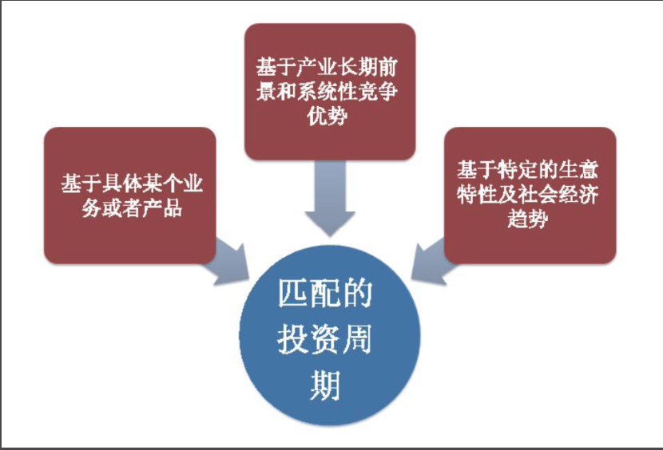
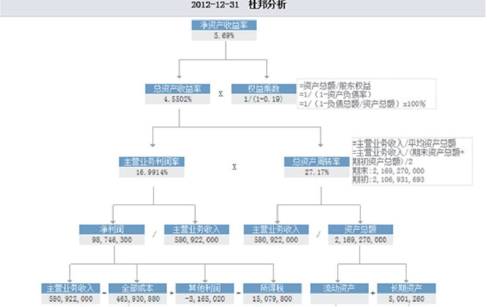

# 第9章　经营观测与守候

> 在选择了股票后自然进入持有阶段。那么投资的主要问题就从“寻找”进入了“观测”。特别对于以长期持有为主的投资者，大多数的时间其实都是在观测状态。在此状态中，如何评估企业的经营是否正常，是否如之前预期的一样向着有利的轨道发展，不但是至关重要的事，有时甚至就是唯一重要的事。
>
> 企业的分析有时候需要用放大镜，有时候又需要用望远镜，关健是把放大镜和望远镜的关系搞清趁，知道什么时候和什么局面下必须依靠大的视野，什么情况和什么问题上应该聚焦在具体的细节中。企业经营的分析主要建立在更接近科学性的专业知识和体系上，但是否懂得恰当地把握这种关系却又是投资中莱种艺术性的体现。本章将就这两个方面的问题进行一个探讨。

## 9.1　建立逻辑支点

在前面我们曾经讨论过，一个企业在1年中的股价就可能产生极大的波动，如果连续几年来看这种高低点之间的波动幅度就更大。推动这些波动的，既有**纯心理因素**或者**市场的系统性波动**，也经常有基于企业发展过程中的一些沟沟坎坎、一些时而正面时而负面的消息。这些消息出现的密度可能很大，或者突然出现的某个细节问题可能会完全出乎你的意料和掌握之外。

在这种时候，如果我们对企业的投资只是基于一些非常具体的细节信息，或者基于一些静态的基本面情况，就很容易被迅猛而至的各方消息和突然波动加速的股价而击溃情绪。{++**对一个企业的认识越是只限于细节，就越是容易受到噪音的干扰。能够做到长期持有的前提，是必须建立起一个足够的认识宽度和深度，从各种烦琐的细节中构建起一个符合投资周期的核心支撑，称为“逻辑支点”。**++}

### 9.1.1　先找树干再看树叶

企业的具体分析中我向来不倾向做厚厚的一本作业，而更在乎关键逻辑和证据上的不断回顾和评估。事实上，几万字的投资分析和各种花花绿绿的统计表格的制造过程，会让投资者误以为自己已经对公司的一切了如指掌，进而产生过渡自信甚至自负的倾向这是我希望极力避免的。这并不等于放弃对公司相关信息地收集和持续关注，但在这一过程中的关键是各种信息要融合到投资的逻辑支点上去，用来评估企业经营与自我判断是否一致，而不是将海量的信息简单堆砌并形成一种“我什么都知道了”的危险潜意识。

这就像把一本书读完，也许真正有用的话就3句，理解了这3句话，比把整本书背诵下来要有效得多（某位数学家说过：典型的1200页的微积分包括2页的思路和1198页的实例和应用）。如同没有必要将每字、每句都在重要性上赋予平均的权重一样，我们对企业的理解也需要建立起俯瞰全局的提纲式的“3句话”。我对此提列了一个基本的思考提纲，见下表：

| 逻辑支点                                 | 主要包含的问题                                                                                                                                                         |
| ---------------------------------------- | ---------------------------------------------------------------------------------------------------------------------------------------------------------------------- |
| 投资这个企业的战略理由是什么？           | 对这笔投资总体的期望是什么？这些期望是否立足于长期的产业发展环境和竞争格局中不易改变的因素？这些因素本身的牢靠性和相互联系的逻揖性是否足够                             |
| 投资这个企业的战术安排是什么？           | 按照什么步骤来建立头寸，在什么时机背景下分别执行买入、补仓、持有、售出、清空？在整个投资组合中所承担的角色是进攻性的还是防御性的？是看重高弹性的潜力还是高确定性的一面 |
| 影响企业发展成功和失败的关键要素是什么？ | 哪些因素是所预期的前長能否实现的生死存亡的前提笑件？在持有的过程中哪些是可以容忍的现象，哪些是需要高度敏感的问题                                                       |

建立逻辑支点的关键，在于一定要从更长远的角度来看待这个生意和这笔投资，而不是仅仅局限在当前。要将支撑这个企业得以发展壮大、这笔投资得以延续持有的核心逻辑归纳出来。这里有3个重点：

**第一是这种逻辑必须具有叠加和递进关系；**

**第二是这几个逻辑支点必须包含企业发展经营的最核心要素；**

**第三是这些逻辑支点必须建立在较为明确的可观察事项和较为稳定的因素上。**

我们先来看看{==**巴菲特对于比亚迪这笔投资的点评**==}。在谈到这笔投资的时候，巴菲特多次提及的原因有以下3点：**第一**，谁也无法预知未来，但是他们在严肃地从事着一件对于这个星球非常重要的事业；**第二**，他们（比亚迪）自1995年以来的记录很好，从30万美元起步短短7年进入汽车市场。并做到了别人没有做到的事情；**第三**，芒格多次和我说王传福是爱迪生和韦尔奇的综合体，我承认我不懂他们的产品，但我喜欢这个人（注：巴菲特没有就以上3点做过专门的排列和解说，这是我个人根据其几次采访以及伯克希尔年报中的相关信息所提炼的）。

这3点其实已经构成一个完整的逻辑支点：**首先**这笔投资是基于一个可能的大生意。我们用数字来把巴菲特的原话翻译一下：在2010年的世界企业百强榜中，共有10家汽车企业上榜，占榜单比重的10％，是仅次于石油化工、金融行业的第三大占比行业。而比亚迪所涉及的业务恰好是能源和汽车的交集，是这两个最容易产生大市值企业的行业，并且他们在二次充电电池以及汽车领域都占据一个较好的竞争位置。**第二点**，则说明历史的经营记录证明了其实现伟大目标的能力。在这个大行业中只有优秀的企业才能成功，而他认为比亚迪做到了这点；**第三点**更进一步证明，这笔投资实际上除了看重这个生意的前景同时也押宝在王传福身上，他和芒格认为王传福具有伟大企业家的特质并且愿意为此去等待。

这样的逻辑支点建立后，**巴菲特才会说“长期持有”，除非上述3点发生大的变化**——比如比亚迪的经营领域不再具有吸引力，比亚迪的经营能力不断下降，以及王传福被证明无法胜任或者由于意外因素而无法再继续领导。除此之外的其他因素，比如暂时的业绩波动、周期性的行业景气等，都无法撼动这笔投资的延续。在巴菲特首次买入比亚迪后短短的几年内，比亚迪的股价出现了10倍的暴涨和之后剧烈暴跌的大幅波动，然而在市场的一片不解之中巴菲特却依然淡定如初，最主要的原因我想正是因为这是一笔有着完整规划和定位，清晰的逻辑支点的战略布局，而不是简单的套利性投资。

{==**巴菲特对IBM和伯林顿铁路的投资**==}同样具有这种简洁但切中要害的逻辑归纳。比如对伯林顿铁路的归纳；**第一**美国未来的繁荣状况在很大程度上取决于在国内是否存在一套高效并且维护良好的铁路系统，这次收购是对美国经济前景的一次豪赌：**第二**，与主要的竞争对手汽车运输相比，铁路存在巨大的成本和环境优势；**第三**，伯林顿铁路在美国西部货运及能源运输上具有独特的地位；**第四**，高度城市化的美国已经难以大肆修建新的竞争性铁路线路。

{==**而在对IBM的投资介绍中则谈到**==}：在今后数十年内，全球的信息技术基础设施建设业务都具有很大的增长空间；对于一家大公司来说，改变审计公司和律师事务所都是大事，让IT部门停止使用IBM的产品也同样是大事；IBM在规划未来路线图方面表现出色。IBM在留住现有客户的同时，还能在全球范围内实现较大的增长：到2015年，IBM计划使运营利润达到至少每股20美元（2013年末其每股收益约为14美元）。自2003年以来，IBM已经支出了超过1000亿美元用于支付股息和股票回购。

短短几句话已经勾勒清楚了这两笔投资的核心逻辑，不但层次递进关系清晰而且每个都切中长期持有的关键因素。我们对比伯林顿铁路、IBM和比亚迪的投资依据，可以明显感觉到差异所在。比亚迪更像是一个充满希望和可能性的风险投资，很大部分的理由来自于对管理者的青睐。而另外两个的逻辑则主要建立在长期的业务发展前景具有吸引力、高度的客户粘性（IBM）、不可复制的市场地位（伯林顿铁路）、良好的财务和股东权益安排和由此带来的在未来繁荣时期的大概率的良好回报。这种差别直接反映在了投资的额度上，对比亚迪的投资额只有2.5亿美元左右，而对伯林顿铁路和IBM的投资额则高达260亿（首次之后又增持过）和107亿美元，显然对它们在投资中的定位是截然不同的——比亚迪是高不确定性又高弹性的突击队员，IBM和伯林顿铁路则是相当合算和高确定性的主力部队。

当然，逻辑支点作为投资决策的一个高度概括，更多是体现在支撑**“投资理由和持有周期”**的意义上，而不是决定买入的时机。就像上述的所有理由，都不是马上买入一个企业的理由，买入的理由只有一个：{++**不但好，而且便宜。**++}

逻辑支点的建立，绝非对基本面信息的简单罗列和股评式摘抄，而是对这笔生意得以延续、对这个企业得以发展的深刻洞悉。它建立的前提是对行业和企业基本面的详尽研究，并且建立在深刻的洞察力基础上。这一点并不容易，也正因为此，所以长期持有才永远是说起来简单做起来难。如果缺少投资的逻辑支点，很容易陷入“就事论事”的状态：_**企业的任何信息都可能引起惊慌，把每件事都孤立起来看待，持有的一路总是被各种意外撞击小心脏用不了多久就会忘记这笔投资最初的理由。**_

### 9.1.2　长期投资的层次

另一个值得注意的是，逻辑支点的建立要与投资的周期相匹配。这笔投资到底应该投资多长的时间？是该见好就收还是终生持有？这恐怕不能凭感性来决定，而必须思考投资的逻辑支点是建立在什么基础上的？如下图：

在我看来，一笔3～5年的投资必须基于对这个企业某项决定性业务（或产品）的发展认识，因为重大业务及产品从酝酿、试点到大规模推广大体需要一个这样的时间段，市场从供需失衡到逐步均衡也大体在这样一个时间段内可实现。

**对一笔5～10年的投资则除了产品业务层面的认识之外还必须判断出这个企业是否具有系统性的优势**——在竞争的各个主要经营节点上都具有鹤立鸡群的、相互呼应和可持续的能力，并且不存在重大的短板。因为这个时间周期内仅靠单个产品一直景气是很难的（即使这个行业本身还是朝气蓬勃的，但是产品的更新换代和竞争均衡导致原来的明星产品或业务已经趋于平庸），最重要的是企业具有持续地推出重磅业务和开拓空间的系统性能力。

**而巴菲特意义上的“终身持有”性质的十几年甚至几十年的投资，则必须是对特定生意特性和社会经济发展规律的良好结合。**因为在这么长的时间里，只有符合经济发展大势和规律的生意能够长期存续，更只有特定的优质生意模式能穿越多个景气轮回。一些企业即使曾经再优秀但往往在景气轮回中容易受到致命打击，又或者行业的竞争中有太多难以预期的变量，以及一旦失败就归零等特性，对这种特征的企业进行超长期的持有要非常谨慎。

所以，如果一笔投资的逻辑支点仅仅是基于**看好某个业务和产品的发展**，却声称要“持有10年”恐怕就草率了，相反，如果确实发现了难得的高价值生意也不应因某个业务暂时的困难而放弃之前更大局面的判断。

认识到这些，也许我们才既能学会更严肃和有层次地制订投资计划，又不至于过于草率、机械和盲目地理解长期投资吧。

## 9.2　经营特性分析

逻辑支点可以让我们在持有中得到一个基本稳定的衡量线索，但更重要的是通过日常的公开信息来切实观察企业的经营状况是否顺利。而要判断一个企业的经营是否向好，首要问题是识别这个企业的经营特性。

### 9.2.1　三种经营特性

经营特性听起来是个很学术化的词，但实际上我们对这个概念应该一点儿也不陌生。俗语说的**“薄利多销”**和**“三年不开张，开张吃三年”**就是一种对经营特性的精彩总结。具体来说企业的经营特性可以从财务特征和业务特征两个方面来把握。

财务特征通过对**净资产收益率**的结构分析（杜邦分析法）是最简洁直观的，下图便是一个公司净资产收益率的杜邦分析：

在这个结构中最主要的项目有3个：**销售净利润串**、**总资产周转率**、**权益乘数**。销售净利润串反映的是公司单位销售收入所能带来的利润率，体现业务的利润丰厚程度；总资产周转串反映的是公司总资产转化为销售收入的能力，是公司对资产运营水准和效串的体现；权益乘数则是公司利用外部资本以放大经营成果的能力，是资本利用是否聪明的体现。根据这3个指标可以大致将企业的经营特性分为以下3大类：

| 经营特性类别 | 表现形式                                                                                  | 代表企业                                         |
| ------------ | ----------------------------------------------------------------------------------------- | ------------------------------------------------ |
| 高利润低周转 | 高净利润和较低的总资产周转率为特征                                                        | 医药、软件、奢侈品、高端制造业、商业服务业等     |
| 低利润高周转 | 低净利润和较高的总资产周转率为特征                                                        | 零售、家用电器、低价食品、低端制造业、建筑施工等 |
| 杠杆型       | 经营主要且必须以负债为基础。高额的负债率既是其经营持续所必需的，又是其ROE水平的决定性因素 | 银行、房地产、券商、保险等                       |

#### 1. 高利润低周转

**高利润低周转型**企业一般来自于行业需求和产品差异化明显的领域，凭借着业务的独特定位和高附加值的产品他们可以获得很高的净利润率。但也由于这种业务的独特性及对客户必要的细分，销售面一般较窄，资产的利用和周转率很难达到100％，如下表：

| 截至2011年末 | 百淘股份 | 远光软件 | 杰瑞股份       | 东阿阿胶     |
| ------------ | -------- | -------- | -------------- | ------------ |
| 净利润率     | 40%以上  | 33%左右  | 30%以上        | 31.5%        |
| 总资产周转率 | 0.3      | 0.65     | 0.53           | 0.7          |
| 行业         | 食品香精 | 管理软件 | 石油设备及工程 | 中药及保健品 |

这类企业往往具有极高的毛利率和净利润率，毛利率是体现一个企业的产成品的市场价值相对于原始制造过程的成本的溢价能力。高毛利往往反映了这种业务或者产品对于原材料及制造成本予以了相当高的附加值。

一盘杭椒牛柳在家自己做只需要15元左右就搞定，而在一个简餐性质的小饭馆里可能需要30元，到了较高档的餐厅里就需要60元以上。这就是这盘菜从基本需求到方便快捷再到环境气氛享受的附加值递增的过程，当然随之的毛利率也递增。

**但毛利率的高低并不是决定净利润率的唯一重要因素。**毛利润还需要经过3项费用的扣除（管理费用、销售费用、财务费用）、营业外收支影响、税收等一系列“盘剥”后才能剥出净利润来。如果高毛利所对应的是更高的3项运营费用，那么其净利润率可能还不如毛利率较低但成本更低的生意。比如定位中高档餐饮的湘鄂情、全聚德的毛利率高达70％以上，但净利润率却不过10％左右，这中间大部分的钱都被**运营费用**吞掉了。所以你可以说他们在原始食品材料上创造的**附加值**很高，但不能说他们的利润率很高。

这类企业的观察一方面是看业务发展能否保持住其差异化的优势地位，也就是高利润率能否维持？高利润率到底是暂时性的供需失衡所导致的还是这种生意的常态？对于高利润率的生意，最需要思考的就是这么高的利润会不会引来竞争？而竞争又会不会导致利润率回归走低？缺乏强大竞争壁垒的高利润率生意，往往只是昙花一现。

另一方面就在于随着业务的发展其总资产周转率能否得到明显提高。如果公司的业务发展前景广大（从而可以实现较高的营业额规模），其生意特性不需要在扩张中频繁的融资和资本性支出（资本规模增速低于营业规模增速），再加上聪明地利用一点儿资金杠杆，就有可能达到优秀的ROE水平。

#### 2.低利润高周转

低利润高周转类企业与上一类刚好相反，通常属于差异化程度不高，主要靠规模效应取胜的企业。较低的利润率表明其难以通过建立强差异化获取强的定价权，而必须从成本优势角度考虑问题。但这类企业的业务也往往具有宽泛的客户面，如果能够充分建立起高效的内部运营和管理机制，其资产的周转率往往可以弥补利润率的不足。

| 截至2011年末 | 苏宁电器 | 美的电器 | 金螳螂   | 双汇发展     |
| ------------ | -------- | -------- | -------- | ------------ |
| 净利润率     | 5%       | 4.88%    | 7.3%     | 3.61%        |
| 总资产周转率 | 1.81     | 1.83     | 1.72     | 5.8          |
| 行业         | 商业零售 | 家用电器 | 装修施工 | 肉制品及屠宰 |

**扩大销售额，扩大规模，提高资产的利用率水平，以实现每一单位销售收入成本的最低，是这类企业的经营命脉所在。**如果是重资产型的企业，产能的利用率更是至关重要，因为高固定资产导致的固定成本极高，销售量一旦下降每个产品所担负的平均成本就急剧上升导致亏损。美国通用汽车的创始人斯隆在他的回忆录中说，在市场高速发展的行业景气期，他最担心的是3件事：过分投资、库存积压、现金短缺。仔细想想，这3点对于资产负债表规模庞大，重资产特征明显、利润率又很低的规模竞争型企业而言，确实是最惊险的局面。

这类企业中最值得关注的是外部因素属于“大行业，小公司”，在一个广阔无比的市场中只占有很小的份额；内部有独创或者领先的强大经营机制，或者通过创新的商业模式，或者通过高效卓越的运营水平，实现销售规模的长期增长和资产周转率的高水准。更重要的是通过这种增长，获得规模效应和一定的品牌差异化后进一步将竞争对手挤出而肃清市场，从而获得一定的定价权或者为之前的高烈度竞争所支付的各项费用的削减。这将意味着净利润率的提升，而在极大的销售规模下，净利润率每一个点的提示都会带来利润的迅猛增加——苏宁、格力电器、双汇发展、伊利股份、金螳螂、青岛啤酒等一批成功企业的净利润率趋势都是如此。

这种企业中具有可持续的成本优势的，往往是鬼见愁一般的产业杀手。为了达到这种成本上的优势，需要企业在整个运营链条和产业布局上都先人一步并精耕细作，最终迅速抬升整个产业的盈亏平衡点（比如制造空调要想盈利已经从十几年前的几十万产销量抬升到了几百万合），用规模摧毁对手。对这种企业运营观察最核心的一点，恐怕就是这种由规模效益带来的利润率提升何时能够出现以及能提升到何种程度。利润率的提升既可能来自击败对手后在相对垄断市场的提价能力，也可能来自规模效益所支持的更低的费用率。

#### 3.杠杆经营型

杠杆型企业经营的突出特点就是“以小博大”——整个运营中的关键资源都是“借来的”，并且这部分借来的资源，不但规模相对于其利润而言非常庞大，而且借资源的能力通常还反映了这个公司相对于同业的经营优势。

借来的资源是指通过负债等渠道获取经营的原材料。以地产行业为例，一个公司是否有能力获得低息的庞大贷款，是否有本事在市场中大额融资，决定了它有无足够的资金去购买自己获利的原材料，即土地。银行也是如此，商业银行的竞争力之一就表现在用更低的存款利率吸收储蓄的能力，其所拥有的储蓄款也就是它的生产原料。因此，这类企业的首要表现是资产负债率很高。

如上所述，负债只是手段，目的是什么呢？便是获取扩大经营的原材料。而这部分原材料更成为了它的“关键风险资产”——也就是占资产比重极大、相对于净利润规模极高、随经营波动可能产生估价变化的资产。虽然从会计关系来看这部分是自己的资产但其实如果没有了之前的负债这部分资产几乎不可能存在。因此。从经营的逻辑上而言，**说这些资产也是借来的并不为过。**

> 以万科A和招商银行为例，2012年万科的净利润是125.5亿元，只有其当年存货2550亿元的5％。招商银行2011年净利润361亿元也只占当年发放的客户货款1.64万亿元的2.2％，与它们相比，格力电器2011年净利润与存货之比占到了30％。

这种特性说明了什么呢？{==**说明这类企业经营的最核心问题其实就是风险管理**==}。_因为无论是地产商高额的存货，还是商业银行大额的对外放贷，如果遭遇到意料之外的行业性波动_（如房地产价格大幅度下滑，当前存货贬值；坏账剧增，放出的贷款遭受巨大损失），**那么这些“关键风险资产”只需要几个百分点的贬值核销，就可以一把抹平1年甚至多年的净利润。风险意识和风控能力，永远是这类企业长期生存的第一原则。**

### 9.2.2　定位主要矛盾

需要说明的是，**对于指标的“高、低”并没有一个约定俗成的标准。**利润率和总资产周转率到底多少才算高属于一个经验值。{==**我个人定义的高利润率是指净利率25％以上，高周转率在1以上；低利润率是在10％以下，低周转率在0.5以下**==}。介于这之间的都属于中等水准，当然可以根据个人喜好再细分为中高、中低等情况。不过我的看法是不必过于细分，真正的高价值企业应该是在某一个指标上具有极为突出的表现，而在另外的指标上也具有较高的水准。如果利润率和周转率水平都较低，并且从业务结构和发展看不到未来明显提升改善的因素，这样企业的净资产收益率就既难以达到高水准（20％以上）更难以在这个高水准上长时间保持住。这样的企业很难称之为高价值企业。

当然在现实中很多企业并不像上面举的例子一样那么典型，可能兼顾各方面的特点。即使是同一个企业，也许由于行业景气程度的波动也会在具体指标特征上有所变化。但这种判断并不是基于一时一刻的情况，而是本质上的特征。抓住这种本质的生意特性，才能更好地理解这类企业经营的重点，前面提到的理解公司的战略才有一个立足点。比如，一个本质上是低利润率高周转特征的企业，如果提出的战略是不断提价增加差异化程度，而一个本质上是高利润率低周转率的企业的战略却是越来越“去差异化”，用拼价格竞争来走量，这就很难理解。

在搞清楚了企业的经营特征和当前的ROE分解指标后下一步就是分析它未来经营所面临的最大挑战来自哪方面，以及具有多大的提升潜力。在内在价值部分我们讨论过，一个企业的价值最终要反馈到净资产收益率水平，那么一个当前ROE是10％的企业，未来是否有能力提升到20％甚至更高呢？这就需要沿着上面对企业经营特性的定性继续深入下去。从总体而言，一个企业的盈利能力的提升，同样来自于利润率或者周转率及资金杠杆3个方面的挖掘：

**与利润率相关的方面**

* 产品提价的能力
* 降低原材料成本，生产过程中的成本
* 降低销售费用，管理费用，财务费用等
* 降低少数股东权益
* 减少存货等资产的贬值
* 更多的政府补助、投资收益等非业务收入
* 更低的税收

**与周转率相关的方面**

* 扩大销售规模
* 将多余的现金转入生产或者分红
* 减少资本性支出带来的固定资产
* 将留存的利润更多的分红
* 提高劳动生产率(单位产出增高）
* 提高存货周转率(库存调度能力)
* 提高应收账款周转率(尽快收回货款的能力)

**与杠杆相关的方面**

* 使用更便宜的借债
* 通过应付、预收项提高对上下游的占款
* 提高财务杠杆的比率

**对一个企业的分析和观察需要抓主要矛盾，而不能胡子眉毛一把抓。这种主要矛盾从什么地方来体现？就是首先对这个企业的经营特征进行定性，并且分析未来潜力在那里？提升的关键要素是什么？然后再深入到具体的业务和发展战略中去思考它的发展态势是不是正好瞄准了这些关键要素，力度够不够？**

> 比如我们看到广联达2011年的ROE只有14.6％，其中净利润率约为37.8％，总资产周转率为0.37，资产负债率只有10％\[资金杠杆=1/（1-0.1）=1.11\]。那么未来是否具有提升的空间以及这个提升力来自哪里呢？我们进一步研完它的发展方向和资产、业务结构后发现，当前极高的净利润率未来可能面临下降（因为其未来几年将面临推广的项目管理软件的利润率要明显低于当前的工具型软件，但更长期来看，如果公司向着平台化转型成功，那么利润率还将回升），总资产周转率可能有较大提升（一方面因为其总资产中占比70％的是现金，而这主要是因为两年前上市时期的超募资金，不属于经常性现象。较高的分红以及随着业务更大规模展开，其现金存量可能持续下降；另一方面其轻资产的特性使得业务规模扩大，同时，再投资扩张资产的需求很小；最后项目管理产品的单价远高于工具软件，从业务属性上看很容易做大销售规模），同时由于其当前几乎没用杠杆，未来业务景气期间具有提升负债率的冗余。

在清楚上述情况后，我们对它未来的观察就高度聚集在几个方面了：第一。项目管理软件的推广进度，各类新产品占收入的结构比重变化，以及这种变化对净利润率的影响有多大？第二，是否持续的高分红，现金是否能在业务中更具效率的使用，项目管理系统的推广将对周转率带来多大提升（由于资产结构中流动资产占比极高，因此主要就是流动资产的周转率提升）？

> 而同样是行业应用软件企业，用友软件所体现出的主要矛盾就截然不同。2011年用友软件的ROE为18.16％，其中净利润率为13.4％，总资产周转率为0.8，资产负债率45％即财务杠杆1.81）。比较广联达和用友，表面上看用友的ROE更为出色，但广联达的总资产收益率（净利润率x总资产周转率）是13.4％，而用友只有10％，其更高的ROE实际上是来自财务杠杆的贡献，如果简单将广联达的财务杠杆加到相同的水平，那么ROE将变为24.25％。这说明用友的真实盈利能力要远低于广联达。
>
> 盈利能力低的原因主要在其净利润率太低。由于其总资产周转率的水准从“高利润率低周转率”特征企业和软件企业同比来看已经算不低了，未来提升的余地不大甚至有下滑风险。而其当前的财务杠杆在同类中也已经很高，未来继续加杠杆提升ROE，首先，余地不大。其次，会加大财务风险。所以唯一的关健变量就来自于净利润率的提升。
>
> 对照上面的潜力挖掘表，深入到其利润表的状况和业务发展情况后，发现提升的途径只能是降低3项费用——因为其所在的通用管理软件市场竟争激烈，低价在目前阶段还是国产软件竞争的重要因素，大幅提价不现实。而从其利润表结构来看，2011年的3项费用占营业收入比重的73.2％。虽然软件企业的高费用率不足为奇，但深入观察后发现用友的产品需要大量的咨询和项目实施工作，确实单位成本要比标准化程度高的软件企业高得多。经过比对，用友软件的人均创利（净利润/员工人数）只有3.9万且长期排徊不前，而广联达的人均创利却高达9.4万。
>
> “由此我们可以基本得出结论，用友软件以往那种走中高端用户，靠性价比优势的产品和庞大的实施售后服务支持的模式已经进入末路。其净资产收益率的进一步提升，需要建立在新的产品和服务模式上。从其业务构成和规划中，我们可以发现面对小微企业的畅捷通利润率极高（40％以上），虽占销售收入比不到10％，但在扣除非经常性损益后的利润中的占比却超过了25％。**而用友规划大力投入的云计算业务，其特征恰好是大幅度的降低实施运营成本**。所以，对用友的关注可能就需要特别聚焦在这两方面业务发展的优势所在、确定性以及对盈利能力的影响上了。

### 9.2.3　财务不仅仅是数字

有时候在分析“财务特征”时甚至可以引起对社会问题的思考。比如“瘦肉精危机、奶制品食品安全”等食品安全问题屡屡爆出诚信危机，让这个社会出离愤怒。但作为一个投资者，这个现象却引发了我在简单的道德批判之外的思考：单独发生一起这样的问题，可能是企业道德败坏。但屡屡发生这样的问题，甚至一出问题就是整个行业大部分企业都难幸免，这真的只需要企业管理层道德高尚就可以杜绝吗？

食品安全在一个投资者或者企业家眼里看来，首先是一个成本问题。然而，在一个净利润率不到5％的行业（肉制品、奶制品都是典型的低利润率），继续升高的成本该怎样分摊？答案是：**有足够定价权或者足够的规模优势。**定价权，在类似这种差异化很小的行业中是几乎不存在的，而只能靠获得更大的销售额规模来“平摊单位成本”。但如果一个市场由于{==**监管松散**==}而使得那些不诚信经营的企业总也无法退出市场，那么诚信经营的企业就无法收获必要的份额，这种状态持续下去就尴尬了。为什么在一些行业发生问题的时候，你会发现几乎所有行业龙头全部沦陷？就是因为行业性的“劣币驱逐良币”现象，而不能完全将问题归咎到企业本身（虽然企业肯定也有问题）。

国外食品药品厂商并不是天然道德水准更高，而是面临严苛的市场监管和违规处罚。这种更{==**严格的市场环境**==}，客观上大大提高了行业的准入门槛。如果仅靠几个企业自律提高成本，但是行业大量的低劣小企业依然不受制约（行业进入门槛太低，你今天惩罚了他明天他注销了老公司注册一个新公司，马上就可以又开工了），最后的结果不是行业升级，而是承担起义务的龙头先死。所以，要想真正杜绝此类问题，必须在源头的行业监管上大幅度提高准入壁垒才能实现多赢：龙头企业负起责任，足够的投入确保质量和安全，而大量作坊式公司退出市场也让企业可以收获高投入后的果实；而消费者的成本虽然可能有所提高但可以获得满意的食品安全保障。这样的问题其实在国内的农药、医药市场都普遍存在，这也使一些原本具有技术和品质优势的企业无法获得相应的市场地位，迟迟无法做大做强。

当然，企业的财务特性不可能只是ROE的特性，实际上包含的内容很多。通过对费用和成本结构的观察，一些生意与我们想象中的样子会有些差别。我们可以看看餐饮企业的例子：

> 餐饮企业常识上来看属于“坐商”，是坐等着客人上门的生意，不需要什么销售开支。但我们看到全聚德、湘鄂情的报表，却发现销售费用居然高达27％和39％。一般出现这种与常识极大相悖的情况，通常都是由于数据结构上与我们的理解有偏差。详细查看湘鄂情的年报就会发现，在其销售费用中占主要比重的是工资、租货费以及长期待摊费用（这3项占所有销售费用的67％），**费用高并不是促销和销售行为复杂耗费的，而是服务员工资、经营场所的租货费，以及各个新开店面的大额装修费用（长期待摊）较多造成的。**
>
> 由此可以看出中高档餐厅的维持费用是很高的，在其近70％毛利率的背后，只有不到10％的净利润率，原因之一就是**经常性的费用率太高**。又比如我们一谈到啤酒的**毛利率波动**，第一直觉应该是麦芽成本的变化导致的。但仔细去看年报的财务数据附录，会发现营业成本中**包装费用占成本构成的50％以上**，麦芽却只占成本的12％左右。所以麦芽原材料的走势并不会对毛利率有很大影响。

### 9.2.4　财务与业务的结合

**ROE的杜邦分析是从经营的财务特征上去理解一个企业，但企业的经营特征不仅仅是财务角度的，也有业务角度的。即使同样的经营财务特征，在业务特征上也可能相差极大。**双汇发展和金螳螂，都是“低利润率高周转率”的典型，但它们的业务对象和业务发展的特征都差别很大。又如同样是做药物的，不同领域之间的业务成功的关键点就截然不同：

> 人用药物的成功企业通常需要靠几个重磅药驱动成长。比如辉瑞的立普妥、天士力的复方丹参滴丸，而兽用药物的成功企业却靠的是宽阔的产品线，单一产品很难做大。因为对于人用药物来说，首先安全性上的要求极其苛刻，这将在研发、制造过程中相比兽药产生更高的成本。其次，药品对于人类而言是关于生老病死的大事，只要能确切医治重大的病痛，甚至只要是存在这种可能性，人们都不会吝音于金钱，因此巨大的人口基数加上高昂的单价（在专利保护期内）以及高额的研发投入，就决定了成功的人用药企业主要是靠重磅药获利。而兽药正相反，单个养殖品本身的经济价值就有限，养殖户不可能为了治疗它而投入太多成本。此外，兽药针对的一般是常见传染病而非重大疑难病症，其药物的单位价格必然极低。因此只能靠繁多的产品组合来提供增长的驱动力。

**学会将业务特点与财务特征结合还可以帮助我们思考企业经营深层次的问题**。比如下面这个例子：

> 瑞贝卡是一个专业的假发生产商，从财务特征来看利润率不高（毛利率20％左右，净利润率10％以内），总资产周转率一路降低（6年间从1到0.65）。在其业务中，正在大力发展的国内假发业务定价在2000～6000一顶，接近奢侈品概念了。近几年财报显示国内业务发展迅猛，但其净利润率却没有明显提升，原因在毛利率微幅上升（从以往25％左右上升到30％）而3项费用率大幅上升（从过去10％上升到17％）。已经如此高的售价却没有带来相匹配的利润率的直线上升，这就说明它的业务在产业链的价值传导过程中必定发生了某种扭曲（比如为了在激烈竞争中实现销售不得不向经销商过多的让利）。再考虑到假发不是个经常性消费需求，总资产周转率是很难大幅提升的。这样利润率、周转率都上不去，未来的预期就不明确了。

**拿到一个企业的时候，集中火力去思考体现这个企业关键运营水平的“点”在哪里，这个生意未来发展的关键逻辑和观测指标是企业研究环节最为重要的功课。**所谓对一个生意的理解，除了对其商业价值的理解之外，其实很大程度上就取决于对关键运营点的认识。如果说前者属于“上得去”的话，那么后者就算是“下得来”；前者让投资者定位大的方向，后者帮助投资者监控具体的过程。

> 对于商场、家电连锁超市等企业来说如何将拥有的营业面积转化为收入是最关健的，所以坪效（营业额/柜台所占平方米数）和单店盈利指标的同比和环比体现了重要的经营状态。而对于软件企业来说核心资源和主要成本都在人身上，人均创收和人均创利就是一个非常核心和高度综合性的指标，对它的连续跟踪和横向对比往往解释了经营的改善和恶化。又比如一些重资产如铁路、发电企业等。其收入很大程度上被固定资产的大额折旧扣除了，而由于不能自由定价和扩张，其成长性往往乏善可陈。但这类企业中，有的折旧分摊期限远低于其实际运营期限，在折旧完毕后很长时间都不用立刻购置断设备。这样，收入规模可能还是原来的样子，但每年所需要扣减的固定资产折旧却大幅度下降了，这就导致出现业绩增幅由于成本骤降而突然大幅上升的可能。

总之，财务和业务的结合分析要注意“普遍性与特殊性”问题。所谓普遍性，就是甭管什么企业，都大致遵循的财务规律。比如**利润率与费用率的此消彼长**; 所谓特殊性，就是一些企业特定的业务特点或者发展阶段决定了，其某几个经营指标特别具有参考性。

总之，普遍性问题是每份年报都必然要关注的，特殊性问题则更加直接地揭示了特定类别，或者特定阶段企业的健康状况或者持续需要关注的重点。对公司的财务数据（不仅是数值，更包括其构成）看得越细，越不容易想当然。

### 9.2.5　警惕这些业务特征

如果不理解一个企业的业务特征，一方面容易在业务分析中有偏差（比如盲目地幻想某个兽药品种像人用药一样带来海量的销售额），更重要的是容易忽略一些业务上的风险。对这个问题总结的困难之处在于，每一个行业都有自己的业务特色，不可能全都排开来一一罗列。说到底，业务特性就是搞清楚这个公司是怎么赚钱的？它的经营中具有哪些业务的独特性？经营所面临的最困难的地方是什么？这些特点会对业务发展产生什么影响？根据个人投资中曾经的经验教训，我认为对于以下的业务特征需要更多普惕如下表：

| 业务特征                                                  | 可能的风险                                                                                                                                                                                                                                                                                                                                                                                                                                                                                                                |
| --------------------------------------------------------- | ------------------------------------------------------------------------------------------------------------------------------------------------------------------------------------------------------------------------------------------------------------------------------------------------------------------------------------------------------------------------------------------------------------------------------------------------------------------------------------------------------------------------- |
| 大客户，大订单模式                                        | 收入高度集中在少数客户身上，容易出现订单的大波动；大客户具有更大的话语权，往往可以压制企业的价格，其至拖欠回款，造成企业大量的应收账款，现金流周转不灵；对收入的确认预期性差，经常远远出乎意料：客户数少，如果缺乏强大客户粘性，容易被更低成本或者更高技术的竞争对手一举踢出市场                                                                                                                                                                                                                                          |
| 地头蛇模式                                                | 只是依靠一些当地的特殊自然、行政资源创收，难以走出去。这样的生意很难做大，如果这种现象普遍存在于行业内，往往就是个分割性的细小市场组合而无法成为大一统的大市场；  这种企业由于习惯了关系优先，往往忽略经营质量，也谈不上什么管理。一旦特殊的资源被削弱，比如招标工程的阳光化，企业瞬间就被打回原形                                                                                                                                                                                                                    |
| 渠道铺货的虛假繁荣                                        | 很多产品的销售往往需要通过经销商等渠道体系，这种销售模式出现一定的渠道库存总是难免的也是合理的。但需要警惕一种情况：企业为了做业绩，通过利益手段 （高额回馈，甚至一起做局炒股），大量向经销商国货或者大量扩张经销商队伍。短期来看这对于业绩增长立竿见形，但也会对后期造成严重负面影响。这种渠道拿货与终端销售的背离往往还不太容易搞清楚，我的办法主要还是看公司管理层经营上的风格是否激进，以及是否好大喜功，从“上层路线”结合商业常识（比如一个看起来毫无差异化优势的东西，迅速热销、大肆扩张，就会很奇怪）来规遊这种风险 |
| 资金被大量占用                                            | 处于产业链中最无话语权的地位，对上必须先付款取得原材料，对下必须先交货后收钱，现金流糟糕是一方面，更关键的是你很难指望这种产业地位做出什么大成绩                                                                                                                                                                                                                                                                                                                                                                          |
| 靠大量的复杂对外投资驱动发展                              | 经常因为各种原因而四处大肆投资，从土地到楼房到矿场或者其他五花八门的东西。这种业务通常是在讲一个故事，并且用一个接一个的投资来续写这种故事。通过复杂的投资后，资产异常复杂难辨。{==**这种业务特征是财务陷阱的高发地**==}                                                                                                                                                                                                                                                                                                  |
| 子公司连环套                                              | 这是上一类的交种，其结果与复杂投资类一样都使财务结构异常复杂，让人一头雾水而难以发现造假或者利益传输的证据。但区别是这种公司往往设立了大量的子公司，业务在这些子公司里像走迷官一样乱窜，最终拧成一股麻绳，其中的关系外人难以窺见                                                                                                                                                                                                                                                                                          |
| 业务和产品非常冷门，难以了解虚实                          | 对于冷门和难以接触到的关系业务或者产品，我们常年所积暴的社会常识和专业知识很难有帮助，一方面这会让我们被公司的说法牵着鼻子走，另一方面也很难通过侧面的调查摸清底细。此外这种业务也很难搞清楚成功的关键点，难以建立逻辑支点                                                                                                                                                                                                                                                                                                |
| 经营过程中涉及了大量变量                                  | 它的经营结果通常取决于一些关键的变量，比如某几种大宗商品的价格走势，外汇或者某种商品期货的价格，对这种公司的投资变成了对这些关键变量走势的预测。除非对此具有长期的走势判断，否则很难下手                                                                                                                                                                                                                                                                                                                                  |
| 利润微薄又很小众的业务                                    | 利润徽薄说明单位产品的盈利能力很低，小众的业务说明其业务难以大规模扩张。这就将形成典型的 “低利润率低周转率”生意，不值得多花精力研究                                                                                                                                                                                                                                                                                                                                                                                       |
| 完全建立在技术层面竞争， 而技术的更新周期又很快的生意 | 相比那些虽然也具有技术因素但同时具有其他要素（比如客户依赖、网络效应、需长期积累的特定专业知识等）的复合竞争而言，**纯技术层面的竞争**属于最难建立持久竞争优势的生意，如果这种技术的更新周期又很快，那么对这种企业的未来进行预期实在是一个不可能的任务                                                                                                                                                                                                                                                                    |
| 周期波动很强，业务却高度标准化                            | 如果一个企业的上游供应商或下游客户本身的经营就是强周期波动的，做它们的生意往往也难以逃脱被动波动的命，比如为造船业、汽车厂做配套设备的。如果业务的标准化程度很高，就属于拼价格和规模的类别，一旦遭退下游行业最气程度的下降，往往造成修烈的杀价                                                                                                                                                                                                                                                                            |

对大客户大订单类业务值得多说几句。识别是否是大客户类别很简单，首先是看**销售费用率**，销售费用率非常低的一般要么是走大经销商类的分销渠道，要么就是下游客户高度集中的。其次就是年报中都会披露，公司前五名客户所占销售额的比重，这个数据也很说明问题。一般来说，大客户特征的企业销售额上升更迅猛，因为其下游几个有限的大客户不存在覆盖的死角。一旦这些大客户推出某个大的采购计划，企业的销售额就容易突飞猛进的增长，这是大客户类企业生意的优势。但缺点也很明显，由于大客户的采购往往呈现阶段性特点，可能过去两年大单不断，但下1年由于一些宏观因素或者其自身建设周期的影响，采购计划也许一夜之间就消失了，其下降的幅度之大往往出人意料。更麻烦的是，这种大客户的采购计划往往不那么透明和容易预期，这就让{==**大客户大订单类企业的业绩的可预测性非常差。**==}

> 在我的投资实例中曾带来最大损失的就是大客户类别的企业。2011年的置信电气引起我的兴趣，当年其价格已经下跌了1年多，业绩显示即使在2008年之后也保持着较为平稳的增长（过去3年的净利润增长率分别为26％、24％和20％），如果这一趋势得以延续，那么2011年的枯值则只有20多倍市盈率（这基本达到了2008年底大熊市末期的估值水平）。这对于一个长期来看产品还处于大推广的初中期阶段，并且业绩增长的大环境正在转暖（农网改造大幕拉开，对非晶合金变压器推广很有利。且从节能变压器的更新换代的历史节奏来看，正好到了距上次大规模升级10年的更换周期）的业务来说似乎有不错的吸引力，何况2010年公司的营业收入增长不到10％，在那种情况下其通过节流等手段也完成了约25％的净利润增长，因此2011年的净利润增长在转暖的环境下似乎是较为稳妥的，由此我决定在16.5元左右买入。
>
> 然而我忽略了两个重要的问题。第一，2010年公司的毛利率正处于历史最高水平的38％以上，这一水平对于一个制造业企业而言已经相当高，很可能无法维持；第二，作为大客户大仃单类企业而言，过去几年的业绩是完全无法作为当前业绩的推测证据的，其不可预测和偶然性要远远高于大成交量的生意。结果在仃单下滑和毛利率大幅下降的影响下，公司2011年的业绩是-47.5％，创了历史最差纪录。而股价也直线下跌到11元左右才见底。”

销售过于集中在一些大客户身上还有一个麻烦，就是{==**议价能力不高**。==}

> 比如四维图新为知名汽车及手机生产商提供预装的导航地图产品，它的下游几乎都是重磅的大客户。而地图业务却并不构成这些客户的核心竞争力——试问有几个消费者会为了某个厂商的地图而影响到对汽车、手机的购买决策？这种局面下大客户很容易压价影响企业的毛利率，或者通过拖延付款而占用企业的流动资金。又如荣信股份糟糕的现金流，有很大一部分原因就在于被下游的大客户拖欠而形成了太多的应收账。

另外特别需要注意的是，{==**签订的大订单绝不代表已经敲实的业绩**==}。一些行业的订单合同往往属于意向性的，客户因为各种愿意推迟或者取消订单是不需要付任何责任的。订单转化为收入是一个充满不确定性的过程。此外一些大订单的结算属于工程完成后再确定，因此{==**签订的合同金额与最终确认金额可能出现较大落差。**==}

> 中铁二局2010年3季度的在手订单达近430亿元（铁路工程占比76％），订单金额已经大幅高于当季的营业收入。按一般推测至少下一年的营业收入是可以保障的。但事实上受到动车事故等影响，2011年的铁路施工收入却骤然下降了18.6％，加上税率上升和成本上升等因素，201年业绩为一39％。

比大订单转化为收入的不确定性更危险的，是{==**借机炒作甚至造假**==}。因此对于超级大订单的美丽憧憬永远需要多一点谨慎。看看下面两个例子：

> 当年的杭萧钢构报告与中墓公司签署了344亿元的海外工程大单，市场给予了10个涨停的强烈追捧。但最后却放证明纯属骗局，股价自然一落千丈，至今依然是垃圾股的典型。中恒集团2011年11月与步长集团签仃血栓通的全面代理销售合作，称之为强强联合，并放出消息两年后实现30亿元的销售目标，并且以步长用3亿元的保证金作为抵押来显示决心，股市的追捧可以想象。但仅仅1年多后，合作就因莫名其妙的理由破裂，3亿元保证金也不了了之。股价随之开始雪崩，1年内缩水70％。

还有一种情况，有些大客户会实行严格的{==**供应商准入制度**==}。一旦进入了这个供应的资格门槛，往往出现爆发性的增长（比如歌尔声学的微型麦克进入苹果供货商行列）。但这种{==**准入的壁垒并不如我们想象的那么高**==}，有时是因为新的技术或者工艺的更新导致原来的供应商失去了资格，有的可能因为出现了成本更低、效率更高的竞争对手抢走了原来的订单占有率。总之，对于大客户大订单类型的生意我认为特别考验投资者的前瞻性和敏感度，对于进入和退出的时机要求都很高，或者说需要更好的运气。这样的企业，我认为是{++**不适宜长期持有的**++}——除非在其生意特性中我们又发现了某种强大的客户粘性因素的存在。但对于能够准确把握到它的经营节奏的投资者则可能收获令人惊羡的业绩爆发力。

**相反的情况则是那种客户数量众多，销售额来自海量客户数目支撑的生意。**这种客户分散型生意与大客户类生意的优缺点截然相反。由于其客户数目众多且往往分散在各地，因此要想获得增长的首要前提就是建立起广泛覆盖的渠道网络。这种网络大体分为分销或者直销两种模式，前者可以充分利用社会资源迅速实现客户覆盖，而后者就不得不亲力亲为，一点点建立自己的渠道王国了。那么哪种模式更好呢？这个{==**不能一概而论**==}，**需要结合生意的其他特性来分析。**

一般来说，**越是高附加值**的、售前售后工作更复杂的、客户必须持续进行再教育和挖掘的生意，**直销**是最合适的。虽然初期慢，但这种生意成功的关键因素就是要建立对客户的强大影响力，说白了就是要对客户“洗脑”。**这种复杂和高技术含量的工作渠道是很难代替的**。并且长远来看，这种生意的胜败不取决于谁先通过渠道实现了规模效应，而是取决于持续创新和价值诉求的差异化。所以暂时的慢并不影响企业长期竞争力。相反，这种工作全扔给分销商渠道，时间越长隐息越大，效益越小。但对于**低附加值**的、客户服务标准化程度高的、企业迫切需要通过规模化运营建立竞争优势的生意，那么分销渠道往往是首选且更具有经济性和效率。

相比大客户类企业，{==**客户分散型企业的销售额增长往往相对缓慢**==}，因为每一分销售额都依赖于之前的市场耕耘，这也表现在销售费用率上远高于大客户类企业。但这种企业一旦建立了完善的市场网络和客户认可，特别是这种地位只有极少数企业获得的情况下，其经营风险往往要比大客户类企业低得多。因为一方面这种市场网络和客户教育过程是个昂贵的壁垒，竞争对手在财务和时间上的重置成本极高。另一方面，海量的客户使得销售额不容易被某几个重大客户的情况所左右。

**有趣的是以3～5年来看，最牛的股票很多都是来自大客户大订单类别的。比如2005～2007年的置信电气，2008～2013年的歌尔声学。但如果拉长到10年，20年来看，则绝大多数的大牛股都是客户分散的结构。**这其中的原因与上述的**“爆发力与稳定性”**的业务特征可能有一定的关系。这似乎也验证前面所讲过的，如果你看好的是某些业务本身，那么投资周期一般在3～5年可能已经面临截止。而超长期的投资往往必须基于特定的高价值生意模式。

对于经营过程中涉及**大量变量因素**的业务也很难把握。影视制作公司可以体现出这个特定：

> 每一部电影的投资都是一次风险投资，涉及大量的不确定性：导演可能是新的，即使同一个导演换一个题材可能就未必适合；演员可能不适合角色；导演演员不错，剧本不行一样出不来好片子；最后什么都合适，上映前的最终审查还给你毙了，血本无归（比如宁浩的《无人区》）；终于成功上映了，结果又碰上几个大片撞期，互相厮杀分流了票房。最关健是消费者的口味也是随时变化的，去年都喜欢看武侠大片，今年可能听见古装两字就烦，对此投资方只能一直处于揣摩加碰运气的状态。
>
> 更要命的是电影投资制作是一个长周期的过程，从酝酿、拍摄、后期制作、宣传推广到上映，短的也要半年，碰上王家卫这种个性导演可能就三五年过去了，超期、超支是家常便饭。而不管是什么电影，它的收益摊销期却又很短，1个月左右就结束了，要是上映期再碰上点儿**流行性疾病**等不利的外部环境(注：哈哈哈，2021年的疫情)，那真是欲哭无泪。在国内的产业模式下其他的延伸品开发和再播放的版权收入几乎可以忽略不计。涉及这么多的不确定性，而且每个项目都要从头再经历一遍，别管你多有经验，长期来看都是一个风险很高的生意（何况这种公司的负债率往往还很高）。因此即使在好策鸡，因为一两个大制作影片的失败而导致电影公司破产的案例也比比皆是。
>
> 涉及变量多的另一个典型是**资源类企业**，它们产品的供求关系非常复杂，有时涉及世界范围的经济景气状况、新技术对资源的代替性风险、勘探开发运输等诸多环节对供应量的影响，甚至是货币汇率情况的变动造成的价格波动等。事实上看过去资源品的几轮波动，无论景气时期的高价还是低谷时期的低价程度，经常都远远超过行内专业人士的想象力，普通投资者要想搞清楚谈何容易。

## 9.3　成长来自哪里

业绩的持续增长无疑是长期持有中最为关心的因素。大家在谈到一个喜爱的企业的时候喜欢说“它有很好的前景和成长性”，那么这种成长到底来自哪里？又如何有条不紊地对其前景进行分析呢？

### 9.3.1　内部驱动还是外部驱动

一个公司业绩的成长无非来自内外两个方面：对外不断通过资本手段**收购兼并**或者依靠外部的**资产注入**；对内则主要依靠自身经营来滚动发展推进。具体可细分为**开拓新产品**（市场）, **老产品挖掘更大份额**，**产品提价**，**降低成本**4个主要的方面，如下表：

<table>
<thead>
    <tr>
        <th>增长类别 </th>
        <th>具体表现 </th>
        <th>必要基础</th>
    </tr>
<thead>
<tbody>
    <tr>
        <td rowspan="4" style="text-align: center;vertical-align: middle;">经营滚动</td>
        <td>开拓新产品、新市场</td>
        <td>研发和创新</td>
    </tr>
    <tr>
        <td>老产品继续挖掘需求、占领更多份额</td>
        <td>进攻性有充足的资源支持</td>
    </tr>
    <tr>
        <td>产品提价</td>
        <td>差别化的定位和定价权</td>
    </tr>
    <tr>
        <td>降低各项成本</td>
        <td>高效经营模式创新</td>
    </tr>
    <tr>
        <td rowspan="2" style="text-align: center;vertical-align: middle;">资本运作</td>
        <td>收购兼并及重组</td>
        <td>资本优势和运作能力</td>
    </tr>
    <tr>
        <td>资产注入</td>
        <td>背靠特殊的资源</td>
    </tr>
<tbody>
</table>

### 9.3.2　收入扩张还是利润率提升

### 9.3.3　梳理逻辑及测算弹性

### 9.3.4　对前景的理解和把握

## 9.4　几个实用小贴士

### 9.4.1　如何看年报

### 9.4.2　现场调研经验谈

### 9.4.3　建立“认识卡片”

## 9.5　重点和总结
